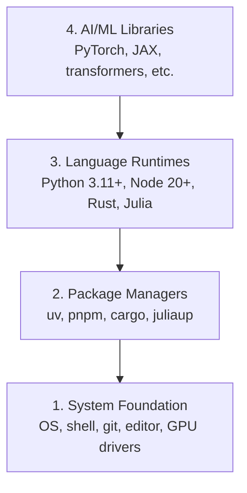

# Środowisko programistyczne

> Twoje narzędzia kształtują twój sposób myślenia. Skonfiguruj je raz, skonfiguruj je dobrze.

**Type:** Build
**Languages:** Python, Node.js, Rust
**Prerequisites:** None
**Time:** ~45 minutes

## Learning Objectives

- Skonfiguruj od zera Python 3.11+, Node.js 20+ oraz Rust
- Zarządzaj środowiskami wirtualnymi i menedżerami pakietów dla odtwarzalnych kompilacji
- Zweryfikuj dostęp do GPU za pomocą CUDA/MPS i uruchom testową operację na tensorach
- Zrozum czterowarstwowy stos: system, pakiety, środowiska uruchomieniowe, biblioteki AI

## The Problem

Zamierzasz nauczyć się inżynierii AI na ponad 200 lekcjach używając Pythona, TypeScriptu, Rusta i Julii. Jeśli twoje środowisko jest zepsute, każda lekcja zmieni się w walkę z narzędziami zamiast w naukę.

Większość osób pomija konfigurację środowiska. Potem spędzają godziny na debugowaniu błędów importów, konfliktów wersji i brakujących sterowników CUDA. Zrobimy to raz, porządnie.

## The Concept

Środowisko inżynierskie AI składa się z czterech warstw:



Instalujemy od dołu do góry. Każda warstwa zależy od warstwy poniżej.

## Build It

### Step 1: System Foundation

Sprawdź swój system i zainstaluj podstawy.

```bash
# macOS
xcode-select --install
brew install git curl wget

# Ubuntu/Debian
sudo apt update && sudo apt install -y build-essential git curl wget

# Windows (use WSL2)
wsl --install -d Ubuntu-24.04
```

### Step 2: Python z uv

Używamy `uv` — jest 10-100x szybsze niż pip i automatycznie zarządza środowiskami wirtualnymi.

```bash
curl -LsSf https://astral.sh/uv/install.sh | sh

uv python install 3.12

uv venv
source .venv/bin/activate  # or .venv\Scripts\activate on Windows

uv pip install numpy matplotlib jupyter
```

Weryfikacja:

```python
import sys
print(f"Python {sys.version}")

import numpy as np
print(f"NumPy {np.__version__}")
a = np.array([1, 2, 3])
print(f"Vector: {a}, dot product with itself: {np.dot(a, a)}")
```

### Step 3: Node.js z pnpm

Do lekcji w TypeScript (agenci, serwery MCP, aplikacje webowe).

```bash
curl -fsSL https://fnm.vercel.app/install | bash
fnm install 22
fnm use 22

npm install -g pnpm

node -e "console.log('Node', process.version)"
```

### Step 4: Rust

Do lekcji wymagających wydajności (inferencja, systemy).

```bash
curl --proto '=https' --tlsv1.2 -sSf https://sh.rustup.rs | sh

rustc --version
cargo --version
```

### Step 5: Julia (Opcjonalnie)

Do lekcji mocno opartych na matematyce, w których Julia błyszczy.

```bash
curl -fsSL https://install.julialang.org | sh

julia -e 'println("Julia ", VERSION)'
```

### Step 6: Konfiguracja GPU (Jeśli Masz)

```bash
# NVIDIA
nvidia-smi

# Install PyTorch with CUDA
uv pip install torch torchvision torchaudio --index-url https://download.pytorch.org/whl/cu124
```

```python
import torch
print(f"CUDA available: {torch.cuda.is_available()}")
if torch.cuda.is_available():
    print(f"GPU: {torch.cuda.get_device_name(0)}")
```

Brak GPU? Żaden problem. Większość lekcji działa na CPU. Do lekcji intensywnie trenujących używaj Google Colab lub chmurowych GPU.

### Step 7: Weryfikacja Wszystkiego

Uruchom skrypt weryfikacyjny:

```bash
python phases/00-setup-and-tooling/01-dev-environment/code/verify.py
```

## Use It

Twoje środowisko jest teraz gotowe na każdą lekcję w tym kursie. Oto, czego gdzie użyjesz:

| Language | Used In | Package Manager |
|----------|---------|-----------------|
| Python | Phases 1-12 (ML, DL, NLP, Vision, Audio, LLMs) | uv |
| TypeScript | Phases 13-17 (Tools, Agents, Swarms, Infra) | pnpm |
| Rust | Phases 12, 15-17 (Performance-critical systems) | cargo |
| Julia | Phase 1 (Math foundations) | Pkg |

## Ship It

Ta lekcja produkuje skrypt weryfikacyjny, który każdy może uruchomić, aby sprawdzić swoją konfigurację.

Zobacz `outputs/prompt-env-check.md` po prompt pomagający asystentom AI diagnozować problemy ze środowiskiem.

## Exercises

1. Uruchom skrypt weryfikacyjny i napraw wszystkie błędy
2. Utwórz wirtualne środowisko Pythona dla tego kursu i zainstaluj PyTorch
3. Napisz "hello world" we wszystkich czterech językach i uruchom każdy z nich