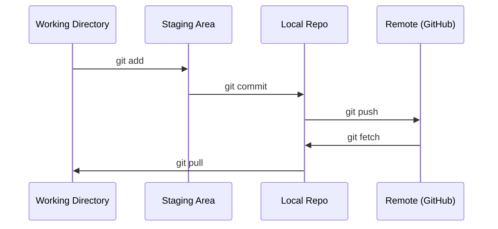

# Git i współpraca

> Kontrola wersji nie jest opcjonalna. Każdy eksperyment, każdy model, każda lekcja, którą tutaj zbudujesz, będzie śledzona.

**Type:** Learn
**Languages:** --
**Prerequisites:** Phase 0, Lesson 01
**Time:** ~30 minutes

## Learning Objectives

- Skonfiguruj tożsamość git i używaj codziennego przepływu pracy: add, commit i push
- Twórz i scalaj gałęzie do izolowanych eksperymentów bez psucia gałęzi głównej
- Napisz `.gitignore` wykluczający punkty kontrolne modeli i duże pliki binarne
- Przeglądaj historię commitów za pomocą `git log`, aby zrozumieć ewolucję projektu

## The Problem

Zamierzasz napisać setki plików z kodem w 20 fazach. Bez kontroli wersji stracisz pracę, zepsujesz rzeczy, których nie da się cofnąć, i nie będziesz miał możliwości współpracy z innymi.

Git to narzędzie. GitHub to miejsce, gdzie kod żyje. Ta lekcja obejmuje to, czego potrzebujesz w tym kursie i nic więcej.

## The Concept



Trzy rzeczy do zapamiętania:
1. Zapisuj często (`git commit`)
2. Wypychaj do zdalnego repozytorium (`git push`)
3. Twórz gałęzie dla eksperymentów (`git checkout -b experiment`)

## Build It

### Step 1: Konfiguracja gita

```bash
git config --global user.name "Your Name"
git config --global user.email "you@example.com"
```

### Step 2: Codzienny przepływ pracy

```bash
git status
git add file.py
git commit -m "Add perceptron implementation"
git push origin main
```

### Step 3: Gałęzie dla eksperymentów

```bash
git checkout -b experiment/new-optimizer

# ... make changes, commit ...

git checkout main
git merge experiment/new-optimizer
```

### Step 4: Praca z repozytorium tego kursu

```bash
git clone https://github.com/rohitg00/ai-engineering-from-scratch.git
cd ai-engineering-from-scratch

git checkout -b my-progress
# work through lessons, commit your code
git push origin my-progress
```

## Use It

W tym kursie potrzebujesz dokładnie tych komend:

| Command | When |
|---------|------|
| `git clone` | Pobranie repozytorium kursu |
| `git add` + `git commit` | Zapisanie pracy |
| `git push` | Kopia zapasowa na GitHub |
| `git checkout -b` | Wypróbowanie czegoś bez psucia gałęzi głównej |
| `git log --oneline` | Zobaczenie, co zrobiłeś |

To wszystko. Nie potrzebujesz rebase, cherry-pick ani submodułów w tym kursie.

## Exercises

1. Sklonuj to repozytorium, utwórz gałąź o nazwie `my-progress`, utwórz plik, zatwierdź go, wypchnij
2. Utwórz `.gitignore` wykluczający pliki punktów kontrolnych modelu (`.pt`, `.pth`, `.safetensors`)
3. Spójrz na historię commitów tego repozytorium za pomocą `git log --oneline` i przeczytaj, w jaki sposób dodawano lekcje

## Key Terms

| Term | What people say | What it actually means |
|------|----------------|----------------------|
| Commit | "Zapisywanie" | Migawka całego projektu w danym momencie |
| Branch | "Kopia" | Wskaźnik na commit, który przesuwa się do przodu w miarę pracy |
| Merge | "Łączenie kodu" | Pobranie zmian z jednej gałęzi i zastosowanie ich w drugiej |
| Remote | "Chmura" | Kopia repozytorium hostowana gdzie indziej (GitHub, GitLab) |