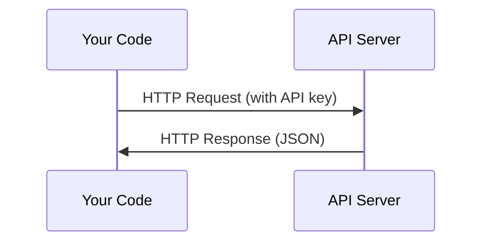

# API i klucze

> Każde AI API działa tak samo: wyślij żądanie, otrzymaj odpowiedź. Szczegóły się zmieniają, wzór pozostaje ten sam.

**Type:** Build
**Languages:** Python, TypeScript
**Prerequisites:** Phase 0, Lesson 01
**Time:** ~30 minutes

## Learning Objectives

- Przechowuj klucze API bezpiecznie używając zmiennych środowiskowych i plików `.env`
- Wykonaj wywołanie API LLM używając zarówno SDK Anthropic, jak i surowego HTTP
- Porównaj formaty żądań/odpowiedzi SDK i surowego HTTP do debugowania
- Identyfikuj i obsługuj typowe błędy API, w tym uwierzytelnianie i limity szybkości

## The Problem

Od fazy 11 będziesz wywoływać API LLM (Anthropic, OpenAI, Google). W fazach 13-16 zbudujesz agentów, którzy używają tych API w pętlach. Musisz wiedzieć, jak działają klucze API, jak je bezpiecznie przechowywać i jak wykonać swoje pierwsze wywołanie API.

## The Concept



Każde wywołanie API ma:
1. Endpoint (URL)
2. Klucz API (uwierzytelnianie)
3. Treść żądania (czego chcesz)
4. Treść odpowiedzi (co otrzymujesz)

## Build It

### Step 1: Bezpieczne przechowywanie kluczy API

Nigdy nie umieszczaj kluczy API w kodzie. Używaj zmiennych środowiskowych.

```bash
export ANTHROPIC_API_KEY="sk-ant-..."
export OPENAI_API_KEY="sk-..."
```

Lub użyj pliku `.env` (dodaj go do `.gitignore`):

```
ANTHROPIC_API_KEY=sk-ant-...
OPENAI_API_KEY=sk-...
```

### Step 2: Pierwsze wywołanie API (Python)

```python
import anthropic

client = anthropic.Anthropic()

response = client.messages.create(
    model="claude-sonnet-4-20250514",
    max_tokens=256,
    messages=[{"role": "user", "content": "What is a neural network in one sentence?"}]
)

print(response.content[0].text)
```

### Step 3: Pierwsze wywołanie API (TypeScript)

```typescript
import Anthropic from "@anthropic-ai/sdk";

const client = new Anthropic();

const response = await client.messages.create({
  model: "claude-sonnet-4-20250514",
  max_tokens: 256,
  messages: [{ role: "user", content: "What is a neural network in one sentence?" }],
});

console.log(response.content[0].text);
```

### Step 4: Surowe HTTP (bez SDK)

```python
import os
import urllib.request
import json

url = "https://api.anthropic.com/v1/messages"
headers = {
    "Content-Type": "application/json",
    "x-api-key": os.environ["ANTHROPIC_API_KEY"],
    "anthropic-version": "2023-06-01",
}
body = json.dumps({
    "model": "claude-sonnet-4-20250514",
    "max_tokens": 256,
    "messages": [{"role": "user", "content": "What is a neural network in one sentence?"}],
}).encode()

req = urllib.request.Request(url, data=body, headers=headers, method="POST")
with urllib.request.urlopen(req) as resp:
    result = json.loads(resp.read())
    print(result["content"][0]["text"])
```

To właśnie robią SDK pod maską. Zrozumienie surowego wywołania HTTP pomaga przy debugowaniu.

## Use It

W tym kursie:

| API | When you need it | Free tier |
|-----|-----------------|-----------|
| Anthropic (Claude) | Phases 11-16 (agents, tools) | $5 credit on signup |
| OpenAI | Phase 11 (comparison) | $5 credit on signup |
| Hugging Face | Phases 4-10 (models, datasets) | Free |

Nie potrzebujesz ich wszystkich od razu. Skonfiguruj je, gdy lekcja będzie tego wymagać.

## Ship It

Ta lekcja produkuje:
- `outputs/prompt-api-troubleshooter.md` - diagnozuj typowe błędy API

## Exercises

1. Uzyskaj klucz API Anthropic i wykonaj swoje pierwsze wywołanie API
2. Wypróbuj surową wersję HTTP i porównaj format odpowiedzi z wersją SDK
3. Celowo użyj złego klucza API i przeczytaj komunikat błędu

## Key Terms

| Term | What people say | What it actually means |
|------|----------------|----------------------|
| API key | "Hasło do API" | Unikalny ciąg znaków identyfikujący twoje konto i autoryzujący żądania |
| Rate limit | "Ograniczają mnie" | Maksymalna liczba żądań na minutę/godzinę zapobiegająca nadużyciom i zapewniająca sprawiedliwe użytkowanie |
| Token | "Słowo" (w kontekście API) | Jednostka rozliczeniowa: tokeny wejściowe i wyjściowe są liczone i rozliczane osobno |
| Streaming | "Odpowiedzi w czasie rzeczywistym" | Otrzymywanie odpowiedzi słowo po słowie zamiast czekania na pełną odpowiedź |