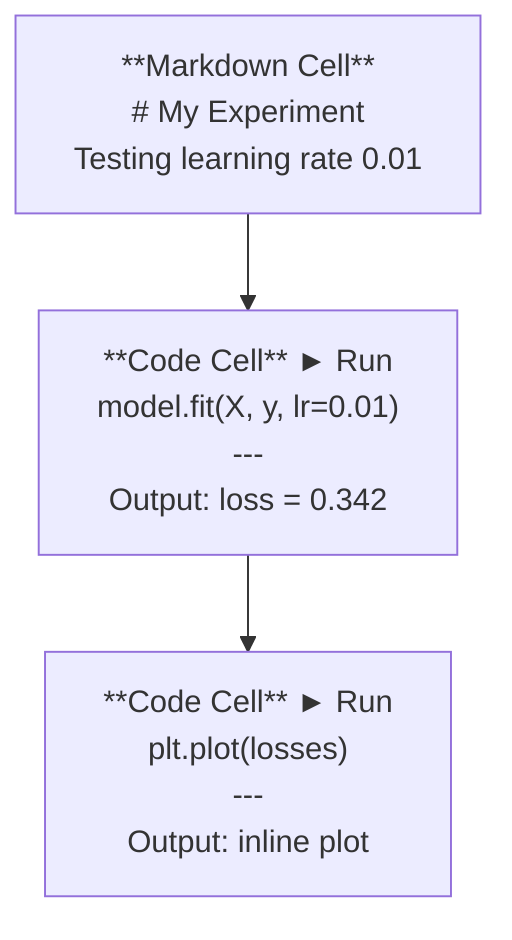
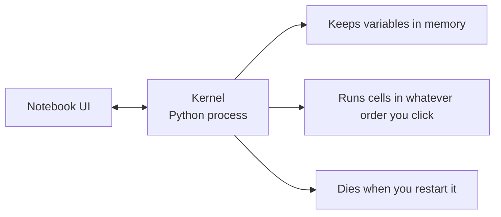

# Jupyter Notebooks

> Notebooki są stołem laboratoryjnym inżynierii AI. Prototypujesz tutaj, potem przenosisz działające rozwiązania do produkcji.

**Type:** Build
**Languages:** Python
**Prerequisites:** Phase 0, Lesson 01
**Time:** ~30 minutes

## Learning Objectives

- Zainstaluj i uruchom JupyterLab, Jupyter Notebook lub VS Code z rozszerzeniem Jupyter
- Używaj magicznych komend (`%timeit`, `%%time`, `%matplotlib inline`) do benchmarkowania i wizualizacji w linii
- Rozróżniaj, kiedy używać notebooków, a kiedy skryptów i stosuj schemat "eksploruj w notebookach, wdrażaj w skryptach"
- Identyfikuj i unikaj typowych pułapek notebooków: wykonywanie nie po kolei, ukryty stan i wycieki pamięci

## The Problem

Każda publikacja AI, tutorial i konkurs Kaggle używa notebooków Jupyter. Pozwalają uruchamiać kod w kawałkach, widzieć wyniki w linii, mieszać kod z wyjaśnieniami i szybko iterować. Jeśli próbujesz uczyć się AI bez notebooków, odrabiasz pracę domową z matematyki bez brudnopisu.

Ale notebooki mają realne pułapki. Ludzie używają ich do wszystkiego, włączając rzeczy, w których są fatalne. Wiedza, kiedy użyć notebooka, a kiedy skryptu, uchroni cię przed koszmarami debugowania w przyszłości.

## The Concept

Notebook to lista komórek. Każda komórka to kod lub tekst.



Kernel to proces Pythona działający w tle. Kiedy uruchamiasz komórkę, wysyła kod do jądra, które go wykonuje i odsyła wynik. Wszystkie komórki współdzielą to samo jądro, więc zmienne utrzymują się między komórkami.



Ta część "w dowolnej kolejności" jest zarówno supermocą, jak i strzałem w stopę.

## Build It

### Step 1: Wybierz interfejs

Trzy opcje, jeden format:

| Interface | Install | Best for |
|-----------|---------|----------|
| JupyterLab | `pip install jupyterlab` then `jupyter lab` | Pełne IDE, wiele zakładek, przeglądarka plików, terminal |
| Jupyter Notebook | `pip install notebook` then `jupyter notebook` | Prosty, lekki, jeden notebook naraz |
| VS Code | Zainstaluj rozszerzenie "Jupyter" | Już w edytorze, integracja z gitem, debugowanie |

Wszystkie trzy czytają i zapisują ten sam format `.ipynb`. Wybierz, co lubisz. JupyterLab jest najczęściej używany w pracy z AI.

```bash
pip install jupyterlab
jupyter lab
```

### Step 2: Skróty klawiszowe, które mają znaczenie

Działasz w dwóch trybach. Naciśnij `Escape`, aby przejść do trybu poleceń (niebieski pasek po lewej), `Enter` do trybu edycji (zielony pasek).

**Tryb poleceń (najczęściej używany):**

| Key | Action |
|-----|--------|
| `Shift+Enter` | Uruchom komórkę, przejdź do następnej |
| `A` | Wstaw komórkę powyżej |
| `B` | Wstaw komórkę poniżej |
| `DD` | Usuń komórkę |
| `M` | Konwertuj na markdown |
| `Y` | Konwertuj na kod |
| `Z` | Cofnij operację na komórce |
| `Ctrl+Shift+H` | Pokaż wszystkie skróty |

**Tryb edycji:**

| Key | Action |
|-----|--------|
| `Tab` | Autouzupełnianie |
| `Shift+Tab` | Pokaż sygnaturę funkcji |
| `Ctrl+/` | Przełącz komentarz |

`Shift+Enter` to skrót, którego użyjesz tysiąc razy dziennie. Zapamiętaj go jako pierwszy.

### Step 3: Typy komórek

**Komórki kodu** uruchamiają Pythona i pokazują wynik:

```python
import numpy as np
data = np.random.randn(1000)
data.mean(), data.std()
```

Wynik: `(0.0032, 0.9987)`

**Komórki Markdown** renderują sformatowany tekst. Używaj ich, aby dokumentować, co robisz i dlaczego. Obsługują nagłówki, pogrubienie, kursywę, matematykę LaTeX (`$E = mc^2$`), tabele i obrazy.

### Step 4: Magiczne komendy

To nie jest Python. To komendy specyficzne dla Jupytera, zaczynające się od `%` (magia linii) lub `%%` (magia komórki).

**Mierz czas swojego kodu:**

```python
%timeit np.random.randn(10000)
```

Wynik: `45.2 us +/- 1.3 us per loop`

```python
%%time
model.fit(X_train, y_train, epochs=10)
```

Wynik: `Wall time: 2.34 s`

`%timeit` uruchamia kod wiele razy i uśrednia. `%%time` uruchamia go raz. Używaj `%timeit` do mikrobenchmarków, `%%time` do trenowania.

**Włącz wykresy w linii:**

```python
%matplotlib inline
```

Każde `plt.plot()` lub `plt.show()` renderuje się teraz bezpośrednio w notebooku.

**Instaluj pakiety bez wychodzenia z notebooka:**

```python
!pip install scikit-learn
```

Prefiks `!` uruchamia dowolne polecenie powłoki.

**Sprawdź zmienne środowiskowe:**

```python
%env CUDA_VISIBLE_DEVICES
```

### Step 5: Wyświetlanie bogatego wyniku w linii

Notebooki automatycznie wyświetlają ostatnie wyrażenie w komórce. Ale możesz to kontrolować:

```python
import pandas as pd

df = pd.DataFrame({
    "model": ["Linear", "Random Forest", "Neural Net"],
    "accuracy": [0.72, 0.89, 0.94],
    "training_time": [0.1, 2.3, 45.6]
})
df
```

To renderuje sformatowaną tabelę HTML, a nie tekst. Podobnie z wykresami:

```python
import matplotlib.pyplot as plt

plt.figure(figsize=(8, 4))
plt.plot([1, 2, 3, 4], [1, 4, 2, 3])
plt.title("Inline Plot")
plt.show()
```

Wykres pojawia się tuż pod komórką. Dlatego notebooki dominują w pracy z AI. Widzisz dane, wykres i kod razem.

Dla obrazów:

```python
from IPython.display import Image, display
display(Image(filename="architecture.png"))
```

### Step 6: Google Colab

Colab to darmowy notebook Jupyter w chmurze. Daje GPU, preinstalowane biblioteki i integrację z Google Drive. Nie wymaga konfiguracji.

1. Przejdź do [colab.research.google.com](https://colab.research.google.com)
2. Prześlij dowolny plik `.ipynb` z tego kursu
3. Runtime > Change runtime type > T4 GPU (darmowe)

Różnice Colaba od lokalnego Jupytera:
- Pliki nie utrzymują się między sesjami (zapisz na Drive lub pobierz)
- Preinstalowane: numpy, pandas, matplotlib, torch, tensorflow, sklearn
- `from google.colab import files` do przesyłania/pobierania plików
- `from google.colab import drive; drive.mount('/content/drive')` do trwałego przechowywania
- Sesje wygasają po 90 minutach bezczynności (darmowy poziom)

## Use It

### Notebooki vs Skrypty: Kiedy czego używać

| Używaj notebooków do | Używaj skryptów do |
|-------------------|-----------------|
| Eksploracji zbioru danych | Pipeline'ów treningowych |
| Prototypowania modelu | Narzędzi wielokrotnego użytku |
| Wizualizacji wyników | Czegokolwiek z `if __name__` |
| Wyjaśniania swojej pracy | Kodu działającego według harmonogramu |
| Szybkich eksperymentów | Kodu produkcyjnego |
| Ćwiczeń kursowych | Pakietów i bibliotek |

Zasada: **eksploruj w notebookach, wdrażaj w skryptach**.

Typowy przepływ pracy w AI:
1. Eksploruj dane w notebooku
2. Prototypuj model w notebooku
3. Gdy działa, przenieś kod do plików `.py`
4. Importuj te pliki `.py` z powrotem do notebooka do dalszych eksperymentów

### Typowe pułapki

**Wykonywanie nie po kolei.** Uruchamiasz komórkę 5, potem komórkę 2, potem komórkę 7. Notebook działa na twojej maszynie, ale psuje się, gdy ktoś uruchomi go od góry do dołu. Naprawa: Kernel > Restart & Run All przed udostępnieniem.

**Ukryty stan.** Usuwasz komórkę, ale zmienna, którą utworzyła, nadal jest w pamięci. Notebook wygląda czysto, ale zależy od widmowej komórki. Naprawa: Regularnie restartuj kernel.

**Wycieki pamięci.** Ładowanie 4GB zbioru danych, trenowanie modelu, ładowanie kolejnego zbioru. Nic nie jest zwalniane. Naprawa: `del nazwa_zmiennej` i `gc.collect()`, lub restart kernela.

## Ship It

Ta lekcja produkuje:
- `outputs/prompt-notebook-helper.md` do debugowania problemów z notebookami

## Exercises

1. Otwórz JupyterLab, utwórz notebook i użyj `%timeit`, aby porównać list comprehension z numpy przy tworzeniu tablicy 100 000 losowych liczb
2. Utwórz notebook z komórkami markdown i kodu, który ładuje CSV, wyświetla dataframe i rysuje wykres. Następnie uruchom Kernel > Restart & Run All, aby zweryfikować działanie od góry do dołu
3. Weź kod z `code/notebook_tips.py`, wklej go do notebooka Colab i uruchom z darmowym GPU

## Key Terms

| Term | What people say | What it actually means |
|------|----------------|----------------------|
| Kernel | "To, co uruchamia mój kod" | Osobny proces Pythona, który wykonuje komórki i przechowuje zmienne w pamięci |
| Cell | "Blok kodu" | Niezależnie wykonywalna jednostka w notebooku, kod lub markdown |
| Magic command | "Sztuczki Jupytera" | Specjalne komendy z prefiksem `%` lub `%%` kontrolujące środowisko notebooka |
| `.ipynb` | "Plik notebooka" | Plik JSON zawierający komórki, wyniki i metadane. Skrót od IPython Notebook |

## Further Reading

- [JupyterLab Docs](https://jupyterlab.readthedocs.io/) po pełną listę funkcji
- [Google Colab FAQ](https://research.google.com/colaboratory/faq.html) po limity i funkcje Colaba
- [28 Jupyter Notebook Tips](https://www.dataquest.io/blog/jupyter-notebook-tips-tricks-shortcuts/) po skróty dla zaawansowanych użytkowników