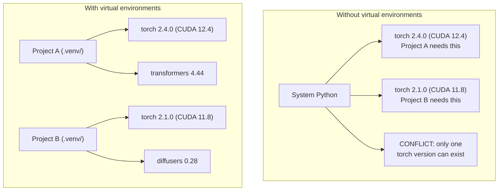

# Środowiska Python

> Piekło zależności istnieje naprawdę. Środowiska wirtualne są lekarstwem.

**Type:** Build
**Languages:** Shell
**Prerequisites:** Phase 0, Lesson 01
**Time:** ~30 minutes

## Learning Objectives

- Twórz izolowane środowiska wirtualne używając `uv`, `venv` lub `conda`
- Napisz `pyproject.toml` z opcjonalnymi grupami zależności i generuj pliki blokady dla odtwarzalności
- Diagnozuj i naprawiaj typowe pułapki: globalne instalacje, mieszanie pip/conda, niezgodności wersji CUDA
- Zaimplementuj strategię środowisk na fazę dla projektów z konfliktującymi zależnościami

## The Problem

Instalujesz PyTorch 2.4 dla projektu fine-tuningu. W następnym tygodniu inny projekt potrzebuje PyTorch 2.1, ponieważ jego kompilacja CUDA jest przypięta. Aktualizujesz globalnie i pierwszy projekt się psuje. Cofasz wersję i drugi się psuje.

To jest piekło zależności. Zdarza się stale w pracy z AI/ML, ponieważ:

- PyTorch, JAX i TensorFlow każdy dostarcza własne wiązania CUDA
- Biblioteki modeli przypinają konkretne wersje frameworków
- Globalne `pip install` nadpisuje wszystko, co było wcześniej
- Kompilacje dla CUDA 11.8 nie działają ze sterownikami CUDA 12.x (i odwrotnie)

Rozwiązanie: każdy projekt otrzymuje własne izolowane środowisko z własnymi pakietami.

## The Concept



## Build It

### Option 1: uv venv (Zalecane)

`uv` to najszybszy menedżer pakietów Pythona (10-100x szybszy niż pip). Obsługuje środowiska wirtualne, wersje Pythona i rozwiązywanie zależności w jednym narzędziu.

```bash
curl -LsSf https://astral.sh/uv/install.sh | sh

uv python install 3.12

cd your-project
uv venv
source .venv/bin/activate
```

Instalowanie pakietów:

```bash
uv pip install torch numpy
```

Utwórz projekt z `pyproject.toml` w jednym kroku:

```bash
uv init my-ai-project
cd my-ai-project
uv add torch numpy matplotlib
```

### Option 2: venv (Wbudowane)

Jeśli nie możesz zainstalować `uv`, Python jest dostarczany z `venv`:

```bash
python3 -m venv .venv
source .venv/bin/activate  # Linux/macOS
.venv\Scripts\activate     # Windows

pip install torch numpy
```

Wolniejsze niż `uv`, ale działa wszędzie tam, gdzie jest Python.

### Option 3: conda (Gdy Potrzebujesz)

Conda zarządza zależnościami nie-Pythonowymi, takimi jak zestawy narzędzi CUDA, cuDNN i biblioteki C. Używaj jej, gdy:

- Potrzebujesz konkretnej wersji CUDA bez instalowania jej systemowo
- Pracujesz na współdzielonym klastrze, gdzie nie możesz instalować pakietów systemowych
- Instrukcje instalacji biblioteki mówią "use conda"

```bash
# Install miniconda (not the full Anaconda)
curl -LsSf https://repo.anaconda.com/miniconda/Miniconda3-latest-Linux-x86_64.sh -o miniconda.sh
bash miniconda.sh -b

conda create -n myproject python=3.12
conda activate myproject

conda install pytorch torchvision torchaudio pytorch-cuda=12.4 -c pytorch -c nvidia
```

Jedna zasada: jeśli używasz conda dla środowiska, używaj conda dla wszystkich pakietów w tym środowisku. Mieszanie `pip install` w środowisku conda powoduje konflikty zależności, które są uciążliwe w debugowaniu.

### Dla Tego Kursu: Strategia na Fazę

Mógłbyś utworzyć jedno środowisko dla całego kursu. Nie rób tego. Różne fazy potrzebują różnych (czasami konfliktujących) zależności.

Strategia:

```
ai-engineering-from-scratch/
├── .venv/                    <-- współdzielone lekkie środowisko dla faz 0-3
├── phases/
│   ├── 04-neural-networks/
│   │   └── .venv/            <-- środowisko PyTorch
│   ├── 05-cnns/
│   │   └── .venv/            <-- to samo środowisko PyTorch (symlink lub współdzielone)
│   ├── 08-transformers/
│   │   └── .venv/            <-- może potrzebować innych wersji transformerów
│   └── 11-llm-apis/
│       └── .venv/            <-- SDK API, torch nie potrzebny
```

Skrypt w `code/env_setup.sh` tworzy podstawowe środowisko dla tego kursu.

## pyproject.toml Basics

Każdy projekt Pythona powinien mieć `pyproject.toml`. Zastępuje `setup.py`, `setup.cfg` i `requirements.txt` w jednym pliku.

```toml
[project]
name = "ai-engineering-from-scratch"
version = "0.1.0"
requires-python = ">=3.11"
dependencies = [
    "numpy>=1.26",
    "matplotlib>=3.8",
    "jupyter>=1.0",
    "scikit-learn>=1.4",
]

[project.optional-dependencies]
torch = ["torch>=2.3", "torchvision>=0.18"]
llm = ["anthropic>=0.39", "openai>=1.50"]
```

Następnie zainstaluj:

```bash
uv pip install -e ".[torch]"    # base + PyTorch
uv pip install -e ".[llm]"     # base + LLM SDKs
uv pip install -e ".[torch,llm]" # everything
```

## Lockfiles

Plik blokady przypina każdą zależność (w tym przechodnie) do dokładnych wersji. Gwarantuje to odtwarzalność: każdy, kto instaluje z pliku blokady, otrzymuje dokładnie te same pakiety.

```bash
# uv generates uv.lock automatically when using uv add
uv add numpy

# pip-tools approach
uv pip compile pyproject.toml -o requirements.lock
uv pip install -r requirements.lock
```

Zatwierdź plik blokady w gicie. Gdy ktoś sklonuje repozytorium, instaluje z pliku blokady i otrzymuje identyczne wersje.

## Common Mistakes

### 1. Instalowanie globalnie

```bash
pip install torch  # ŹLE: instaluje do systemowego Pythona

source .venv/bin/activate
pip install torch  # DOBRZE: instaluje do środowiska wirtualnego
```

Sprawdź, gdzie trafiają twoje pakiety:

```bash
which python       # powinno pokazać .venv/bin/python, nie /usr/bin/python
which pip           # powinno pokazać .venv/bin/pip
```

### 2. Mieszanie pip i conda

```bash
conda create -n myenv python=3.12
conda activate myenv
conda install pytorch -c pytorch
pip install some-other-package   # ŹLE: może zepsuć śledzenie zależności condy
conda install some-other-package # DOBRZE: pozwól condzie zarządzać wszystkim
```

Jeśli musisz użyć pip wewnątrz condy (niektóre pakiety są tylko na pip), zainstaluj najpierw wszystkie pakiety conda, a potem pakiety pip jako ostatnie.

### 3. Zapominanie o aktywacji

```bash
python train.py           # używa systemowego Pythona, brakujące pakiety
source .venv/bin/activate
python train.py           # używa Pythona projektu, pakiety znalezione
```

Twój prompt powłoki powinien pokazywać nazwę środowiska:

```
(.venv) $ python train.py
```

### 4. Zatwierdzanie .venv w gicie

```bash
echo ".venv/" >> .gitignore
```

Środowiska wirtualne mają 200MB-2GB. Są lokalne, nieprzenośne między maszynami. Zatwierdź `pyproject.toml` i plik blokady zamiast tego.

### 5. Niezgodność wersji CUDA

```bash
nvidia-smi                # pokazuje wersję CUDA sterownika (np. 12.4)
python -c "import torch; print(torch.version.cuda)"  # pokazuje wersję CUDA PyTorcha

# Te muszą być kompatybilne.
# Wersja CUDA PyTorcha musi być <= wersji CUDA sterownika.
```

## Use It

Uruchom skrypt konfiguracyjny, aby utworzyć środowisko kursu:

```bash
bash phases/00-setup-and-tooling/06-python-environments/code/env_setup.sh
```

To tworzy `.venv` w katalogu głównym repozytorium z zainstalowanymi i zweryfikowanymi podstawowymi zależnościami.

## Exercises

1. Uruchom `env_setup.sh` i zweryfikuj, że wszystkie sprawdzenia przechodzą
2. Utwórz drugie środowisko wirtualne, zainstaluj w nim inną wersję numpy i potwierdź, że dwa środowiska są izolowane
3. Napisz `pyproject.toml` dla projektu, który potrzebuje zarówno PyTorch, jak i SDK Anthropic
4. Celowo zainstaluj pakiet globalnie (bez aktywacji venv), zobacz, gdzie trafia, a następnie go odinstaluj

## Key Terms

| Term | What people say | What it actually means |
|------|----------------|----------------------|
| Virtual environment | "Venv" | Izolowany katalog zawierający interpreter Pythona i pakiety, oddzielony od systemowego Pythona |
| Lockfile | "Przypięte zależności" | Plik wymieniający każdy pakiet i jego dokładną wersję, gwarantujący identyczne instalacje na różnych maszynach |
| pyproject.toml | "Nowy setup.py" | Standardowy plik konfiguracyjny projektu Python, zastępujący setup.py/setup.cfg/requirements.txt |
| Transitive dependency | "Zależność zależności" | Pakiet B zależy od C; jeśli instalujesz A, które zależy od B, C jest przechodnią zależnością A |
| CUDA mismatch | "Mój GPU nie działa" | PyTorch został skompilowany dla innej wersji CUDA niż ta obsługiwana przez twój sterownik GPU |