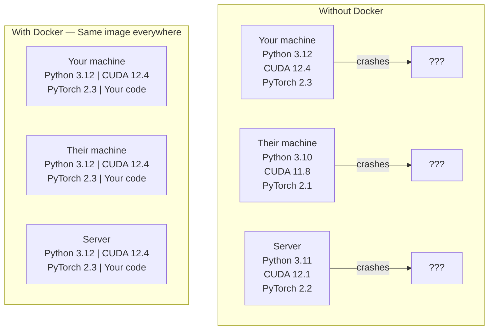

# Docker dla AI

> Kontenery sprawiają, że "działa na mojej maszynie" odchodzi w przeszłość.

**Type:** Build
**Languages:** Docker
**Prerequisites:** Phase 0, Lessons 01 and 03
**Time:** ~60 minutes

## Learning Objectives

- Zbuduj obraz Dockera z obsługą GPU, CUDA, PyTorch i bibliotekami AI z pliku Dockerfile
- Montuj katalogi hosta jako wolumeny, aby utrwalać modele, zbiory danych i kod między przebudowami kontenerów
- Skonfiguruj NVIDIA Container Toolkit, aby udostępniać GPU wewnątrz kontenerów
- Orkiestruj wielousługowe aplikacje AI (serwer inferencyjny + baza wektorowa) za pomocą Docker Compose

## The Problem

Wytrenowałeś model na swoim laptopie z PyTorch 2.3, CUDA 12.4 i Python 3.12. Twój kolega ma PyTorch 2.1, CUDA 11.8 i Python 3.10. Twój model crashuje na jego maszynie. Twój plik Dockerfile działa na obu.

Projekty AI to koszmar zależności. Typowy stos obejmuje Pythona, PyTorch, sterowniki CUDA, cuDNN, biblioteki C na poziomie systemowym i specjalistyczne pakiety, takie jak flash-attn, które wymagają dokładnych wersji kompilatora. Docker pakuje to wszystko w jeden obraz, który działa identycznie wszędzie.

## The Concept

Docker owija twój kod, środowisko uruchomieniowe, biblioteki i narzędzia systemowe w izolowaną jednostkę zwaną kontenerem. Myśl o tym jak o lekkiej maszynie wirtualnej, z tą różnicą, że współdzieli jądro systemu operacyjnego hosta zamiast uruchamiać własne, więc uruchamia się w sekundy zamiast minut.



### Dlaczego projekty AI potrzebują Dockera bardziej niż inne

1. **Sterowniki GPU są delikatne.** Kod CUDA 12.4 nie działa na CUDA 11.8. Docker izoluje zestaw narzędzi CUDA wewnątrz kontenera, współdzieląc sterownik GPU hosta przez NVIDIA Container Toolkit.

2. **Wagi modeli są duże.** Model 7B parametrów waży 14 GB w fp16. Nie chcesz go pobierać ponownie za każdym razem, gdy przebudowujesz. Wolumeny Docker pozwalają zamontować katalog modeli z hosta.

3. **Architektury wielousługowe są powszechne.** Prawdziwa aplikacja AI to nie tylko skrypt Pythona. To serwer inferencyjny, baza wektorowa dla RAG, może frontend webowy. Docker Compose orkiestruje to wszystko jednym poleceniem.

### Kluczowe słownictwo

| Term | What it means |
|------|---------------|
| Image | Szablon tylko do odczytu. Twój przepis. Zbudowany z pliku Dockerfile. |
| Container | Działająca instancja obrazu. Twoja kuchnia. |
| Dockerfile | Instrukcje do zbudowania obrazu. Warstwa po warstwie. |
| Volume | Trwałe przechowywanie, które przetrwa restart kontenera. |
| docker-compose | Narzędzie do definiowania aplikacji wielokontenerowych w YAML. |

### Typowe wzorce kontenerów w AI

```
Kontener deweloperski
  Pełny zestaw narzędzi. Wsparcie edytora. Jupyter. Narzędzia debugowania.
  Używany podczas rozwoju i eksperymentów.

Kontener treningowy
  Minimalny. Tylko skrypt treningowy i zależności.
  Działa na klastrach GPU. Bez edytora, bez Jupytera.

Kontener inferencyjny
  Zoptymalizowany do serwowania. Mały obraz. Szybki zimny start.
  Działa za load balancerem w produkcji.
```

## Build It

### Step 1: Instalacja Dockera

```bash
# macOS
brew install --cask docker
open /Applications/Docker.app

# Ubuntu
curl -fsSL https://get.docker.com | sh
sudo usermod -aG docker $USER
# Wyloguj się i zaloguj ponownie, aby zmiana grupy zaczęła działać
```

Weryfikacja:

```bash
docker --version
docker run hello-world
```

### Step 2: Instalacja NVIDIA Container Toolkit (Linux z GPU NVIDIA)

To pozwala kontenerom Docker korzystać z twojego GPU. Użytkownicy macOS i Windows (WSL2) mogą to pominąć; Docker Desktop obsługuje przekazywanie GPU inaczej na tych platformach.

```bash
distribution=$(. /etc/os-release;echo $ID$VERSION_ID)
curl -fsSL https://nvidia.github.io/libnvidia-container/gpgkey | sudo gpg --dearmor -o /usr/share/keyrings/nvidia-container-toolkit-keyring.gpg
curl -s -L https://nvidia.github.io/libnvidia-container/$distribution/libnvidia-container.list | \
    sed 's#deb https://#deb [signed-by=/usr/share/keyrings/nvidia-container-toolkit-keyring.gpg] https://#g' | \
    sudo tee /etc/apt/sources.list.d/nvidia-container-toolkit.list

sudo apt-get update
sudo apt-get install -y nvidia-container-toolkit
sudo nvidia-ctk runtime configure --runtime=docker
sudo systemctl restart docker
```

Przetestuj dostęp do GPU wewnątrz kontenera:

```bash
docker run --rm --gpus all nvidia/cuda:12.4.1-base-ubuntu22.04 nvidia-smi
```

Jeśli widzisz informacje o swoim GPU, zestaw narzędzi działa.

### Step 3: Zrozumienie obrazów bazowych

Wybór odpowiedniego obrazu bazowego oszczędza godzin debugowania.

```
nvidia/cuda:12.4.1-devel-ubuntu22.04
  Pełny zestaw narzędzi CUDA. Kompilatory dołączone.
  Użyj do: budowania pakietów potrzebujących nvcc (flash-attn, bitsandbytes)
  Rozmiar: ~4 GB

nvidia/cuda:12.4.1-runtime-ubuntu22.04
  Tylko środowisko uruchomieniowe CUDA. Bez kompilatorów.
  Użyj do: uruchamiania prekompilowanego kodu
  Rozmiar: ~1.5 GB

pytorch/pytorch:2.3.1-cuda12.4-cudnn9-runtime
  PyTorch preinstalowany na CUDA.
  Użyj do: pominięcia kroku instalacji PyTorcha
  Rozmiar: ~6 GB

python:3.12-slim
  Bez CUDA. Tylko CPU.
  Użyj do: inferencji na CPU, lekkich narzędzi
  Rozmiar: ~150 MB
```

### Step 4: Napisz Dockerfile dla rozwoju AI

Oto Dockerfile w `code/Dockerfile`. Przejdź przez niego:

```dockerfile
FROM nvidia/cuda:12.4.1-devel-ubuntu22.04

ENV DEBIAN_FRONTEND=noninteractive
ENV PYTHONUNBUFFERED=1

RUN apt-get update && apt-get install -y --no-install-recommends \
    python3.12 \
    python3.12-venv \
    python3.12-dev \
    python3-pip \
    git \
    curl \
    build-essential \
    && rm -rf /var/lib/apt/lists/*

RUN update-alternatives --install /usr/bin/python python /usr/bin/python3.12 1

RUN python -m pip install --no-cache-dir --upgrade pip setuptools wheel

RUN python -m pip install --no-cache-dir \
    torch==2.3.1 \
    torchvision==0.18.1 \
    torchaudio==2.3.1 \
    --index-url https://download.pytorch.org/whl/cu124

RUN python -m pip install --no-cache-dir \
    numpy \
    pandas \
    scikit-learn \
    matplotlib \
    jupyter \
    transformers \
    datasets \
    accelerate \
    safetensors

WORKDIR /workspace

VOLUME ["/workspace", "/models"]

EXPOSE 8888

CMD ["python"]
```

Zbuduj go:

```bash
docker build -t ai-dev -f phases/00-setup-and-tooling/07-docker-for-ai/code/Dockerfile .
```

To zajmuje chwilę za pierwszym razem (pobieranie obrazu bazowego CUDA + PyTorch). Kolejne kompilacje używają zapisanych w pamięci podręcznej warstw.

Uruchom go:

```bash
docker run --rm -it --gpus all \
    -v $(pwd):/workspace \
    -v ~/models:/models \
    ai-dev python -c "import torch; print(f'PyTorch {torch.__version__}, CUDA: {torch.cuda.is_available()}')"
```

Uruchom Jupyter wewnątrz kontenera:

```bash
docker run --rm -it --gpus all \
    -v $(pwd):/workspace \
    -v ~/models:/models \
    -p 8888:8888 \
    ai-dev jupyter notebook --ip=0.0.0.0 --port=8888 --no-browser --allow-root
```

### Step 5: Montowanie wolumenów dla danych i modeli

Montowanie wolumenów jest kluczowe w pracy z AI. Bez nich twoje 14 GB modeli znikają, gdy kontener się zatrzyma.

```bash
# Zamontuj swój kod
-v $(pwd):/workspace

# Zamontuj współdzielony katalog modeli
-v ~/models:/models

# Zamontuj zbiory danych
-v ~/datasets:/data
```

W swoim skrypcie treningowym ładuj z zamontowanej ścieżki:

```python
from transformers import AutoModel

model = AutoModel.from_pretrained("/models/llama-7b")
```

Model żyje w systemie plików hosta. Przebudowuj kontener tak często, jak chcesz, bez ponownego pobierania.

### Step 6: Docker Compose dla aplikacji AI wielousługowych

Prawdziwa aplikacja RAG potrzebuje serwera inferencyjnego i bazy wektorowej. Docker Compose uruchamia oba jednym poleceniem.

Zobacz `code/docker-compose.yml`:

```yaml
services:
  ai-dev:
    build:
      context: .
      dockerfile: Dockerfile
    deploy:
      resources:
        reservations:
          devices:
            - driver: nvidia
              count: all
              capabilities: [gpu]
    volumes:
      - ../../../:/workspace
      - ~/models:/models
      - ~/datasets:/data
    ports:
      - "8888:8888"
    stdin_open: true
    tty: true
    command: jupyter notebook --ip=0.0.0.0 --port=8888 --no-browser --allow-root

  qdrant:
    image: qdrant/qdrant:v1.12.5
    ports:
      - "6333:6333"
      - "6334:6334"
    volumes:
      - qdrant_data:/qdrant/storage

volumes:
  qdrant_data:
```

Uruchom wszystko:

```bash
cd phases/00-setup-and-tooling/07-docker-for-ai/code
docker compose up -d
```

Twój kontener deweloperski AI może teraz sięgać do bazy wektorowej pod adresem `http://qdrant:6333` po nazwie usługi. Docker Compose tworzy współdzieloną sieć automatycznie.

Przetestuj połączenie z wnętrza kontenera AI:

```python
from qdrant_client import QdrantClient

client = QdrantClient(host="qdrant", port=6333)
print(client.get_collections())
```

Zatrzymaj wszystko:

```bash
docker compose down
```

Dodaj `-v`, aby również usunąć wolumen qdrant:

```bash
docker compose down -v
```

### Step 7: Przydatne komendy Dockera w pracy z AI

```bash
# Lista działających kontenerów
docker ps

# Lista wszystkich obrazów i ich rozmiarów
docker images

# Usuń nieużywane obrazy (odzyskaj miejsce na dysku)
docker system prune -a

# Sprawdź użycie GPU wewnątrz działającego kontenera
docker exec -it <container_id> nvidia-smi

# Skopiuj plik z kontenera na host
docker cp <container_id>:/workspace/results.csv ./results.csv

# Podgląd logów kontenera
docker logs -f <container_id>
```

## Use It

Masz teraz odtwarzalne środowisko programistyczne AI. Przez resztę tego kursu:

- Używaj `docker compose up`, aby uruchomić środowisko deweloperskie i bazę wektorową razem
- Montuj swój kod, modele i dane jako wolumeny, aby nic nie zostało utracone między przebudowami
- Gdy lekcja wymaga nowego pakietu Pythona, dodaj go do Dockerfile i przebuduj
- Udostępnij swój Dockerfile współpracownikom. Otrzymają dokładnie to samo środowisko.

### Bez GPU?

Usuń flagę `--gpus all` i blok deploy NVIDIA. Kontener nadal działa dla lekcji na CPU. PyTorch wykrywa brak CUDA i automatycznie przełącza się na CPU.

## Exercises

1. Zbuduj Dockerfile i uruchom `python -c "import torch; print(torch.__version__)"` wewnątrz kontenera
2. Uruchom stos docker-compose i zweryfikuj, że Qdrant jest dostępny z kontenera AI pod adresem `http://qdrant:6333/collections`
3. Dodaj `flask` do Dockerfile, przebuduj i uruchom prosty serwer API na porcie 5000. Zmapuj port za pomocą `-p 5000:5000`
4. Zmierz rozmiar obrazu za pomocą `docker images`. Spróbuj zmienić obraz bazowy z `devel` na `runtime` i porównaj rozmiary

## Key Terms

| Term | What people say | What it actually means |
|------|----------------|----------------------|
| Container | "Lekka VM" | Izolowany proces używający jądra hosta, z własnym systemem plików i siecią |
| Image layer | "Zapisana w pamięci podręcznej warstwa" | Każda instrukcja Dockerfile tworzy warstwę. Niezmienione warstwy są buforowane, więc przebudowy są szybkie. |
| NVIDIA Container Toolkit | "GPU w Dockerze" | Hook środowiska uruchomieniowego, który udostępnia GPU hosta kontenerom przez flagę `--gpus` |
| Volume mount | "Współdzielony folder" | Katalog na hoście zamapowany do kontenera. Zmiany utrzymują się po zatrzymaniu kontenera. |
| Base image | "Punkt początkowy" | Obraz `FROM`, na którym opiera się twój Dockerfile. Określa, co jest preinstalowane. |