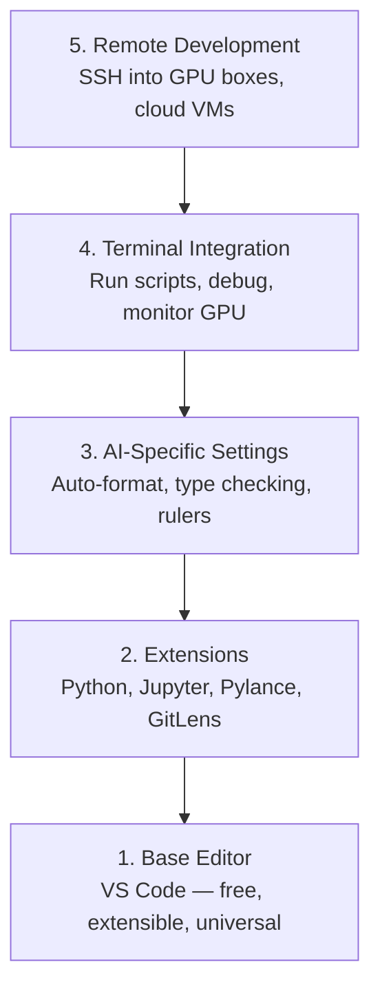

# Konfiguracja edytora

> Twój edytor jest twoim drugim pilotem. Skonfiguruj go raz, aby nie przeszkadzał i zaczął działać na twoją korzyść.

**Type:** Build
**Languages:** --
**Prerequisites:** Phase 0, Lesson 01
**Time:** ~20 minutes

## Learning Objectives

- Zainstaluj VS Code z niezbędnymi rozszerzeniami do Pythona, Jupytera, lintingu i zdalnego SSH
- Skonfiguruj formatowanie przy zapisie, sprawdzanie typów i przewijanie wyników notebooków dla przepływów AI
- Skonfiguruj Remote SSH do edycji i debugowania kodu na zdalnych maszynach GPU tak, jakby były lokalne
- Oceń alternatywy edytorów (Cursor, Windsurf, Neovim) i ich kompromisy w pracy z AI

## The Problem

Spędzisz tysiące godzin w swoim edytorze, pisząc Pythona, uruchamiając notebooki, debugując pętle treningowe i łącząc się przez SSH z maszynami GPU. Źle skonfigurowany edytor zamienia każdą sesję w tarcie: brak autouzupełniania, brak podpowiedzi typów, brak błędów w linii, ręczne formatowanie i nieporęczny terminal.

Prawidłowa konfiguracja zajmuje 20 minut. Pominięcie jej kosztuje cię 20 minut każdego dnia.

## The Concept

Konfiguracja edytora dla inżynierii AI potrzebuje pięciu rzeczy:



## Build It

### Step 1: Instalacja VS Code

VS Code to zalecany edytor. Jest darmowy, działa na każdym systemie operacyjnym, ma pierwszorzędne wsparcie dla notebooków Jupyter, a ekosystem rozszerzeń obejmuje wszystko, czego potrzebujesz do pracy z AI.

Pobierz go z [code.visualstudio.com](https://code.visualstudio.com/).

Zweryfikuj z terminala:

```bash
code --version
```

Jeśli `code` nie jest znalezione na macOS, otwórz VS Code, naciśnij `Cmd+Shift+P`, wpisz "Shell Command" i wybierz "Install 'code' command in PATH".

### Step 2: Instalacja niezbędnych rozszerzeń

Otwórz zintegrowany terminal w VS Code (`Ctrl+`` ` lub `` Cmd+` ``) i zainstaluj rozszerzenia, które mają znaczenie w pracy z AI:

```bash
code --install-extension ms-python.python
code --install-extension ms-python.vscode-pylance
code --install-extension ms-toolsai.jupyter
code --install-extension eamodio.gitlens
code --install-extension ms-vscode-remote.remote-ssh
code --install-extension ms-python.debugpy
code --install-extension ms-python.black-formatter
code --install-extension charliermarsh.ruff
```

Co robi każde z nich:

| Extension | Why |
|-----------|-----|
| Python | Wsparcie języka, wykrywanie środowisk wirtualnych, uruchamianie/debugowanie |
| Pylance | Szybkie sprawdzanie typów, autouzupełnianie, rozpoznawanie importów |
| Jupyter | Uruchamianie notebooków w VS Code, eksplorator zmiennych |
| GitLens | Zobacz, kto zmienił co i kiedy, git blame w linii |
| Remote SSH | Otwórz folder na zdalnej maszynie GPU tak, jakby był lokalny |
| Debugpy | Debugowanie krok po kroku dla Pythona |
| Black Formatter | Automatyczne formatowanie przy zapisie, spójny styl |
| Ruff | Szybkie linting, wyłapuje typowe błędy |

Plik `code/.vscode/extensions.json` w tej lekcji zawiera pełną listę rekomendacji. Gdy otworzysz folder projektu, VS Code poprosi cię o ich instalację.

### Step 3: Konfiguracja ustawień

Skopiuj ustawienia z `code/.vscode/settings.json` w tej lekcji lub zastosuj je ręcznie przez `Settings > Open Settings (JSON)`.

Kluczowe ustawienia dla pracy z AI:

```jsonc
{
    "python.analysis.typeCheckingMode": "basic",
    "editor.formatOnSave": true,
    "editor.rulers": [88, 120],
    "notebook.output.scrolling": true,
    "files.autoSave": "afterDelay"
}
```

Dlaczego to ma znaczenie:

- **Sprawdzanie typów na basic**: Wyłapuje błędne typy argumentów przed uruchomieniem. Oszczędza czas debugowania na niezgodnościach kształtów tensorów i błędnych parametrach API.
- **Formatowanie przy zapisie**: Nigdy więcej nie myśl o formatowaniu. Black się tym zajmuje.
- **Linijki na 88 i 120**: Black zawija wiersze na 88. Znacznik 120 pokazuje, gdy docstringi i komentarze stają się zbyt długie.
- **Przewijanie wyników notebooka**: Pętle treningowe wypisują tysiące linii. Bez przewijania panel wyników eksploduje.
- **Autozapis**: Zapomnisz zapisać. Twój skrypt treningowy uruchomi nieaktualny kod. Autozapis temu zapobiega.

### Step 4: Integracja terminala

Zintegrowany terminal VS Code to miejsce, gdzie uruchamiasz skrypty treningowe, monitorujesz GPU i zarządzasz środowiskami.

Skonfiguruj go prawidłowo:

```jsonc
{
    "terminal.integrated.defaultProfile.osx": "zsh",
    "terminal.integrated.defaultProfile.linux": "bash",
    "terminal.integrated.fontSize": 13,
    "terminal.integrated.scrollback": 10000
}
```

Przydatne skróty:

| Action | macOS | Linux/Windows |
|--------|-------|---------------|
| Przełącz terminal | `` Ctrl+` `` | `` Ctrl+` `` |
| Nowy terminal | `Ctrl+Shift+`` ` | `Ctrl+Shift+`` ` |
| Podziel terminal | `Cmd+\` | `Ctrl+\` |

Podzielone terminale są przydatne: jeden do uruchamiania skryptu, drugi do monitorowania GPU za pomocą `nvidia-smi -l 1` lub `watch -n 1 nvidia-smi`.

### Step 5: Zdalne programowanie (SSH na maszyny GPU)

To najważniejsze rozszerzenie w pracy z AI. Będziesz uruchamiać trening na zdalnych maszynach (chmurowe VM, serwery laboratoryjne, Lambda, Vast.ai). Remote SSH pozwala otworzyć zdalny system plików, edytować pliki, uruchamiać terminale i debugować tak, jakby wszystko było lokalne.

Konfiguracja:

1. Zainstaluj rozszerzenie Remote SSH (zrobione w kroku 2).
2. Naciśnij `Ctrl+Shift+P` (lub `Cmd+Shift+P`), wpisz "Remote-SSH: Connect to Host".
3. Wprowadź `user@your-gpu-box-ip`.
4. VS Code automatycznie instaluje swój komponent serwerowy na zdalnej maszynie.

Aby uzyskać dostęp bez hasła, skonfiguruj klucze SSH:

```bash
ssh-keygen -t ed25519 -C "your-email@example.com"
ssh-copy-id user@your-gpu-box-ip
```

Dodaj hosta do `~/.ssh/config` dla wygody:

```
Host gpu-box
    HostName 203.0.113.50
    User ubuntu
    IdentityFile ~/.ssh/id_ed25519
    ForwardAgent yes
```

Teraz `Remote-SSH: Connect to Host > gpu-box` łączy się natychmiast.

## Alternatives

### Cursor

[cursor.com](https://cursor.com) to fork VS Code z wbudowaną generacją kodu AI. Używa tego samego ekosystemu rozszerzeń i formatu ustawień. Jeśli używasz Cursora, wszystko w tej lekcji nadal obowiązuje. Zaimportuj te same `settings.json` i `extensions.json`.

### Windsurf

[windsurf.com](https://windsurf.com) to kolejny fork VS Code zorientowany na AI. Ta sama historia: te same rozszerzenia, ten sam format ustawień, to samo wsparcie Remote SSH.

### Vim/Neovim

Jeśli już używasz Vima lub Neovima i jesteś w nim produktywny, zostań przy nim. Minimalna konfiguracja do pracy z AI w Pythonie:

- **pyright** lub **pylsp** do sprawdzania typów (przez Mason lub ręczną instalację)
- **nvim-lspconfig** do integracji serwera językowego
- **jupyter-vim** lub **molten-nvim** do wykonania przypominającego notebook
- **telescope.nvim** do wyszukiwania plików/symboli
- **none-ls.nvim** z black i ruff do formatowania/lintingu

Jeśli już nie używasz Vima, nie zaczynaj teraz. Krzywa uczenia się będzie konkurować z nauką inżynierii AI. Używaj VS Code.

## Use It

Z tą konfiguracją twój codzienny przepływ pracy wygląda tak:

1. Otwórz folder projektu w VS Code (lub połącz się przez Remote SSH z maszyną GPU).
2. Pisz Pythona w edytorze z autouzupełnianiem, podpowiedziami typów i błędami w linii.
3. Uruchamiaj notebooki Jupyter w linii za pomocą rozszerzenia Jupyter.
4. Używaj zintegrowanego terminala do skryptów treningowych, `uv pip install` i monitorowania GPU.
5. Przeglądaj zmiany za pomocą GitLens przed zatwierdzeniem.

## Exercises

1. Zainstaluj VS Code i wszystkie rozszerzenia wymienione w kroku 2
2. Skopiuj `settings.json` z tej lekcji do swojej konfiguracji VS Code
3. Otwórz plik Pythona i zweryfikuj, że Pylance pokazuje podpowiedzi typów, a Black formatuje przy zapisie
4. Jeśli masz dostęp do zdalnej maszyny, skonfiguruj Remote SSH i otwórz na niej folder

## Key Terms

| Term | What people say | What it actually means |
|------|----------------|----------------------|
| LSP | "Silnik autouzupełniania" | Language Server Protocol: standard dla edytorów do uzyskiwania informacji o typach, uzupełnień i diagnostyki z serwera specyficznego dla języka |
| Pylance | "Wtyczka Pythona" | Serwer językowy Pythona Microsoftu używający Pyright do sprawdzania typów i IntelliSense |
| Remote SSH | "Praca na serwerze" | Rozszerzenie VS Code, które uruchamia lekki serwer na zdalnej maszynie i przesyła interfejs do lokalnego edytora |
| Format on save | "Auto-prettier" | Edytor uruchamia formater (Black, Ruff) przy każdym zapisie, więc styl kodu jest zawsze spójny |