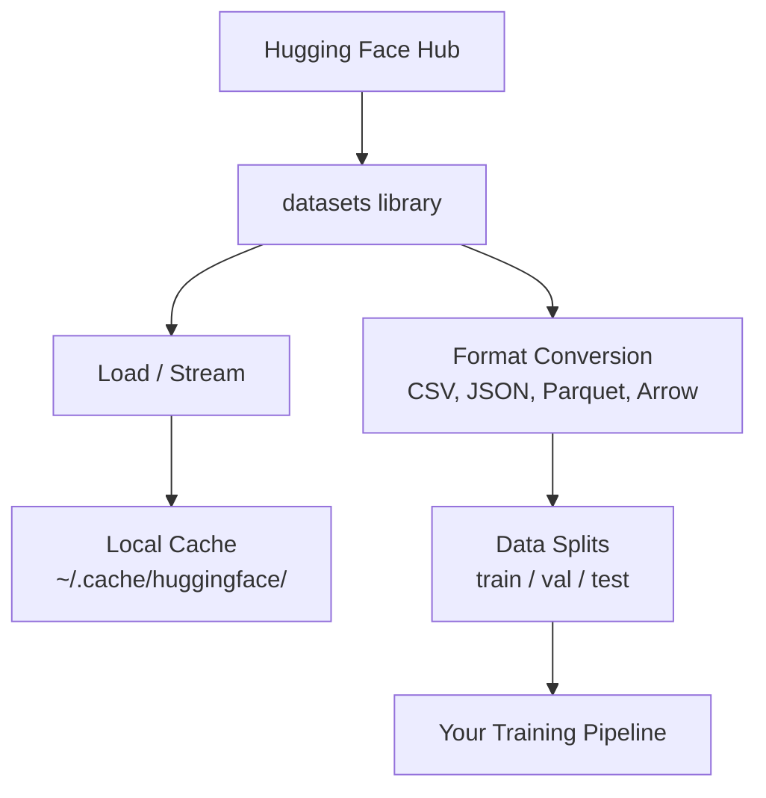

# Zarządzanie danymi

> Dane są paliwem. Sposób, w jaki nimi zarządzasz, determinuje, jak szybko jedziesz.

**Type:** Build
**Language:** Python
**Prerequisites:** Phase 0, Lesson 01
**Time:** ~45 minutes

## Learning Objectives

- Ładuj, strumieniuj i buforuj zbiory danych za pomocą biblioteki Hugging Face `datasets`
- Konwertuj między formatami CSV, JSON, Parquet i Arrow oraz wyjaśnij ich kompromisy
- Twórz odtwarzalne podziały train/validation/test z ustalonym seedem losowym
- Zarządzaj dużymi plikami modeli i zbiorów danych za pomocą `.gitignore`, Git LFS lub DVC

## The Problem

Każdy projekt AI zaczyna się od danych. Musisz znaleźć zbiory danych, pobrać je, konwertować między formatami, podzielić na trening i ewaluację oraz wersjonować, aby eksperymenty były odtwarzalne. Robienie tego ręcznie za każdym razem jest powolne i podatne na błędy. Potrzebujesz powtarzalnego przepływu pracy.

## The Concept



Biblioteka Hugging Face `datasets` to standardowy sposób ładowania danych w pracy z AI. Obsługuje pobieranie, buforowanie, konwersję formatów i strumieniowanie od razu po wyjęciu z pudełka.

## Build It

### Step 1: Instalacja biblioteki datasets

```bash
pip install datasets huggingface_hub
```

### Step 2: Załaduj zbiór danych

```python
from datasets import load_dataset

dataset = load_dataset("imdb")
print(dataset)
print(dataset["train"][0])
```

To pobiera zbiór danych recenzji filmów IMDB. Po pierwszym pobraniu ładuje się z pamięci podręcznej w `~/.cache/huggingface/datasets/`.

### Step 3: Strumieniowanie dużych zbiorów danych

Niektóre zbiory danych są zbyt duże, by zmieścić się na dysku. Strumieniowanie ładuje je wiersz po wierszu bez pobierania całości.

```python
dataset = load_dataset("wikimedia/wikipedia", "20220301.en", split="train", streaming=True)

for i, example in enumerate(dataset):
    print(example["title"])
    if i >= 4:
        break
```

Strumieniowanie daje `IterableDataset`. Przetwarzasz wiersze, gdy przychodzą. Użycie pamięci pozostaje stałe niezależnie od rozmiaru zbioru danych.

### Step 4: Formaty zbiorów danych

Biblioteka `datasets` używa Apache Arrow pod maską. Możesz konwertować do innych formatów w zależności od potrzeb twojego pipeline'u.

```python
dataset = load_dataset("imdb", split="train")

dataset.to_csv("imdb_train.csv")
dataset.to_json("imdb_train.json")
dataset.to_parquet("imdb_train.parquet")
```

Porównanie formatów:

| Format | Size | Read Speed | Best For |
|--------|------|-----------|----------|
| CSV | Duży | Wolny | Czytelność dla człowieka, arkusze kalkulacyjne |
| JSON | Duży | Wolny | API, dane zagnieżdżone |
| Parquet | Mały | Szybki | Analityka, zapytania kolumnowe |
| Arrow | Mały | Najszybszy | Przetwarzanie w pamięci (tego `datasets` używa wewnętrznie) |

W pracy z AI Parquet jest najlepszym formatem przechowywania. Arrow to to, z czym pracujesz w pamięci. CSV i JSON są do wymiany danych.

### Step 5: Podziały danych

Każdy projekt ML potrzebuje trzech podziałów:

- **Train**: Model uczy się z tego (zazwyczaj 80%)
- **Validation**: Sprawdzasz postępy podczas treningu (zazwyczaj 10%)
- **Test**: Końcowa ewaluacja po zakończeniu treningu (zazwyczaj 10%)

Niektóre zbiory danych są już wstępnie podzielone. Gdy nie są, podziel je samodzielnie:

```python
dataset = load_dataset("imdb", split="train")

split = dataset.train_test_split(test_size=0.2, seed=42)
train_val = split["train"].train_test_split(test_size=0.125, seed=42)

train_ds = train_val["train"]
val_ds = train_val["test"]
test_ds = split["test"]

print(f"Train: {len(train_ds)}, Val: {len(val_ds)}, Test: {len(test_ds)}")
```

Zawsze ustawiaj seed dla odtwarzalności. Ten sam seed daje ten sam podział za każdym razem.

### Step 6: Pobieranie i buforowanie modeli

Modele to duże pliki. Biblioteka `huggingface_hub` obsługuje pobieranie i buforowanie.

```python
from huggingface_hub import hf_hub_download, snapshot_download

model_path = hf_hub_download(
    repo_id="sentence-transformers/all-MiniLM-L6-v2",
    filename="config.json"
)
print(f"Cached at: {model_path}")

model_dir = snapshot_download("sentence-transformers/all-MiniLM-L6-v2")
print(f"Full model at: {model_dir}")
```

Modele są buforowane w `~/.cache/huggingface/hub/`. Po pobraniu ładują się natychmiastowo przy kolejnych uruchomieniach.

### Step 7: Obsługa dużych plików

Wagi modeli i duże zbiory danych nie powinny trafiać do gita. Trzy opcje:

**Option A: .gitignore (najprostsze)**

```
*.bin
*.safetensors
*.pt
*.onnx
data/*.parquet
data/*.csv
models/
```

**Option B: Git LFS (śledź duże pliki w gicie)**

```bash
git lfs install
git lfs track "*.bin"
git lfs track "*.safetensors"
git add .gitattributes
```

Git LFS przechowuje wskaźniki w repozytorium, a rzeczywiste pliki na osobnym serwerze. GitHub daje 1 GB za darmo.

**Option C: DVC (kontrola wersji danych)**

```bash
pip install dvc
dvc init
dvc add data/training_set.parquet
git add data/training_set.parquet.dvc data/.gitignore
git commit -m "Track training data with DVC"
```

DVC tworzy małe pliki `.dvc`, które wskazują na twoje dane. Dane same w sobie żyją w S3, GCS lub innym zdalnym magazynie.

| Approach | Complexity | Best For |
|----------|-----------|----------|
| .gitignore | Niski | Projekty osobiste, pobrane dane, które możesz ponownie pobrać |
| Git LFS | Średni | Zespoły współdzielące wagi modeli przez git |
| DVC | Wysoki | Odtwarzalne eksperymenty, duże zbiory danych, zespoły |

W tym kursie `.gitignore` wystarczy. Używaj DVC, gdy potrzebujesz odtworzyć dokładne eksperymenty na różnych maszynach.

### Step 8: Wzorce przechowywania

**Przechowywanie lokalne** działa dla zbiorów danych poniżej ~10 GB. Pamięć podręczna HF obsługuje to automatycznie.

**Przechowywanie w chmurze** jest dla czegokolwiek większego lub współdzielonego między maszynami:

```python
import os

local_path = os.path.expanduser("~/.cache/huggingface/datasets/")

# s3_path = "s3://my-bucket/datasets/"
# gcs_path = "gs://my-bucket/datasets/"
```

DVC integruje się z S3 i GCS bezpośrednio:

```bash
dvc remote add -d myremote s3://my-bucket/dvc-store
dvc push
```

W tym kursie przechowywanie lokalne jest wystarczające. Przechowywanie w chmurze staje się istotne, gdy dostrajasz modele na zdalnych instancjach GPU.

## Datasets Used in This Course

| Dataset | Lessons | Size | What It Teaches |
|---------|---------|------|----------------|
| IMDB | Tokenizacja, klasyfikacja | 84 MB | Podstawy klasyfikacji tekstu |
| WikiText | Modelowanie języka | 181 MB | Predykcja następnego tokena |
| SQuAD | Systemy QA | 35 MB | Odpowiadanie na pytania, fragmenty |
| Common Crawl (subset) | Embeddingi | Zmienny | Przetwarzanie tekstu na dużą skalę |
| MNIST | Podstawy wizji | 21 MB | Podstawy klasyfikacji obrazów |
| COCO (subset) | Multimodalne | Zmienny | Pary obraz-tekst |

Nie musisz pobierać ich wszystkich teraz. Każda lekcja określa, czego potrzebuje.

## Use It

Uruchom skrypt narzędziowy, aby zweryfikować, że wszystko działa:

```bash
python code/data_utils.py
```

To pobiera mały zbiór danych, konwertuje go, dzieli i wyświetla podsumowanie.

## Ship It

Ta lekcja produkuje:
- `code/data_utils.py` - narzędzie do ładowania i buforowania danych wielokrotnego użytku
- `outputs/prompt-data-helper.md` - prompt do znalezienia odpowiedniego zbioru danych dla zadania

## Exercises

1. Załaduj zbiór danych `glue` z konfiguracją `mrpc` i sprawdź pierwsze 5 przykładów
2. Strumieniuj zbiór danych `c4` i policz, ile przykładów możesz przetworzyć w 10 sekund
3. Konwertuj zbiór danych do Parquet i porównaj rozmiar pliku z CSV
4. Utwórz podział 70/15/15 train/val/test z ustalonym seedem i zweryfikuj rozmiary

## Key Terms

| Term | What people say | What it actually means |
|------|----------------|----------------------|
| Dataset split | "Dane treningowe" | Nazwany podzbiór (train/val/test) używany na różnych etapach cyklu życia ML |
| Streaming | "Ładuj leniwie" | Przetwarzanie danych wiersz po wierszu ze zdalnego źródła bez pobierania całego zbioru |
| Parquet | "Skompresowane CSV" | Kolumnowy format pliku zoptymalizowany pod kątem zapytań analitycznych i wydajności przechowywania |
| Arrow | "Szybka dataframe" | Kolumnowy format w pamięci używany wewnętrznie przez bibliotekę datasets do odczytów bez kopiowania |
| Git LFS | "Git dla dużych plików" | Rozszerzenie przechowujące duże pliki poza repozytorium git, zachowując wskaźniki w kontroli wersji |
| DVC | "Git dla danych" | System kontroli wersji dla zbiorów danych i modeli integrujący się z przechowywaniem w chmurze |
| Cache | "Już pobrane" | Lokalna kopia wcześniej pobranych danych, domyślnie przechowywana w ~/.cache/huggingface/ |