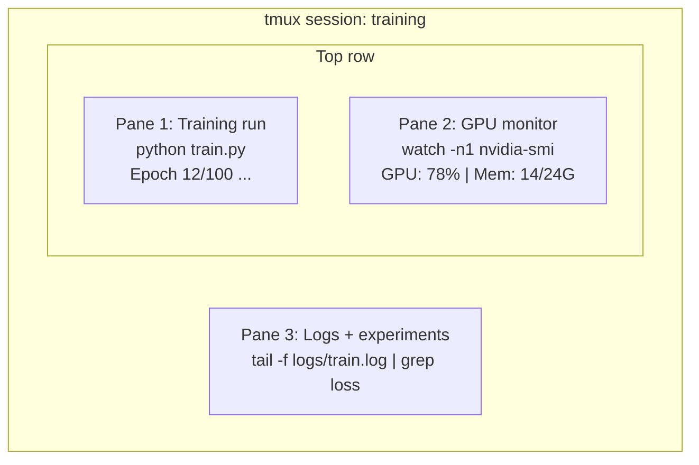

# Terminal i powłoka

> Terminal to miejsce, w którym żyją inżynierowie AI. Zaprzyjaźnij się z nim.

**Type:** Learn
**Languages:** --
**Prerequisites:** Phase 0, Lesson 01
**Time:** ~35 minutes

## Learning Objectives

- Używaj potokowania, przekierowań i `grep` do filtrowania i przetwarzania logów treningowych z wiersza poleceń
- Twórz trwałe sesje tmux z wieloma panelami do równoczesnego trenowania i monitorowania GPU
- Monitoruj zasoby systemowe i GPU za pomocą `htop`, `nvtop` i `nvidia-smi`
- Przenoś pliki między maszynami lokalnymi i zdalnymi za pomocą SSH, `scp` i `rsync`

## The Problem

Spędzisz więcej czasu w terminalu niż w jakimkolwiek edytorze. Uruchamianie treningów, monitorowanie GPU, podgląd logów, zdalne sesje SSH, zarządzanie środowiskami. Każdy przepływ pracy w AI dotyka powłoki. Jeśli jesteś tutaj wolny, jesteś wolny wszędzie.

Ta lekcja obejmuje umiejętności terminalowe, które mają znaczenie w pracy z AI. Żadnej historii Uniksa. Żadnego głębokiego nurkowania w skrypty Bash. Tylko to, czego potrzebujesz.

## The Concept



Trzy rzeczy działające jednocześnie. Jeden terminal. Możesz się odłączyć, iść do domu, połączyć się przez SSH i ponownie podłączyć. Trening działa dalej.

## Build It

### Step 1: Poznaj swoją powłokę

Sprawdź, której powłoki używasz:

```bash
echo $SHELL
```

Większość systemów używa `bash` lub `zsh`. Oba działają dobrze. Polecenia w tym kursie działają w obu.

Kluczowe rzeczy do poznania:

```bash
# Poruszanie się
cd ~/projects/ai-engineering-from-scratch
pwd
ls -la

# Wyszukiwanie w historii (najbardziej przydatny skrót, jakiego się nauczysz)
# Ctrl+R, a następnie wpisz część poprzedniego polecenia
# Naciśnij Ctrl+R ponownie, aby przechodzić między dopasowaniami

# Wyczyść terminal
clear   # lub Ctrl+L

# Anuluj działające polecenie
# Ctrl+C

# Zawieś działające polecenie (wznów za pomocą fg)
# Ctrl+Z
```

### Step 2: Potokowanie i przekierowania

Potokowanie łączy polecenia ze sobą. W ten sposób przetwarzasz logi, filtrujesz wyniki i łańcuchujesz narzędzia. Będziesz tego używać stale.

```bash
# Policz, ile razy "loss" pojawia się w logu
cat train.log | grep "loss" | wc -l

# Wyodrębnij tylko wartości loss z wyniku treningu
grep "loss:" train.log | awk '{print $NF}' > losses.txt

# Obserwuj aktualizacje pliku logu w czasie rzeczywistym, filtrując błędy
tail -f train.log | grep --line-buffered "ERROR"

# Sortuj eksperymenty według końcowej dokładności
grep "final_accuracy" results/*.log | sort -t= -k2 -n -r

# Przekieruj stdout i stderr do osobnych plików
python train.py > output.log 2> errors.log

# Przekieruj oba do tego samego pliku
python train.py > train_full.log 2>&1
```

Trzy przekierowania, których potrzebujesz:

| Symbol | What it does |
|--------|-------------|
| `>` | Zapisuje stdout do pliku (nadpisuje) |
| `>>` | Dopisuje stdout do pliku |
| `2>` | Zapisuje stderr do pliku |
| `2>&1` | Wysyła stderr w to samo miejsce co stdout |
| `\|` | Wysyła stdout jednego polecenia jako stdin do następnego |

### Step 3: Procesy w tle

Treningi trwają godzinami. Nie chcesz trzymać terminala otwartego przez cały czas.

```bash
# Uruchom w tle (wynik nadal trafia do terminala)
python train.py &

# Uruchom w tle, odporny na hangup (zamknięcie terminala go nie zabije)
nohup python train.py > train.log 2>&1 &

# Sprawdź, co działa w tle
jobs
ps aux | grep train.py

# Przywróć zadanie w tle na pierwszy plan
fg %1

# Zakończ proces w tle
kill %1
# lub znajdź jego PID i zabij go
kill $(pgrep -f "train.py")
```

Różnica między `&`, `nohup` i `screen`/`tmux`:

| Method | Survives terminal close? | Can reattach? |
|--------|-------------------------|---------------|
| `command &` | Nie | Nie |
| `nohup command &` | Tak | Nie (sprawdź plik logu) |
| `screen` / `tmux` | Tak | Tak |

W przypadku czegokolwiek dłuższego niż kilka minut, używaj tmux.

### Step 4: tmux

tmux pozwala tworzyć trwałe sesje terminalowe z wieloma panelami. To pojedyncze najbardziej przydatne narzędzie do zarządzania treningami.

```bash
# Instalacja
# macOS
brew install tmux
# Ubuntu
sudo apt install tmux

# Uruchom nazwaną sesję
tmux new -s training

# Podziel poziomo
# Ctrl+B then "

# Podziel pionowo
# Ctrl+B then %

# Nawiguj między panelami
# Ctrl+B then arrow keys

# Odłącz (sesja działa dalej)
# Ctrl+B then d

# Podłącz ponownie
tmux attach -t training

# Lista sesji
tmux ls

# Zakończ sesję
tmux kill-session -t training
```

Typowa sesja pracy z AI:

```bash
tmux new -s train

# Pane 1: rozpocznij trening
python train.py --epochs 100 --lr 1e-4

# Ctrl+B, " aby podzielić, potem uruchom monitor GPU
watch -n1 nvidia-smi

# Ctrl+B, % aby podzielić pionowo, podglądaj logi
tail -f logs/experiment.log

# Teraz odłącz za pomocą Ctrl+B, d
# Rozłącz SSH, idź na kawę, wróć
# tmux attach -t train
```

### Step 5: Monitorowanie za pomocą htop i nvtop

```bash
# Procesy systemowe (lepsze niż top)
htop

# Procesy GPU (jeśli masz GPU NVIDIA)
# Instalacja: sudo apt install nvtop (Ubuntu) lub brew install nvtop (macOS)
nvtop

# Szybkie sprawdzenie GPU bez nvtop
nvidia-smi

# Obserwuj użycie GPU aktualizowane co sekundę
watch -n1 nvidia-smi

# Zobacz, które procesy używają GPU
nvidia-smi --query-compute-apps=pid,name,used_memory --format=csv
```

Skróty klawiszowe `htop`, których użyjesz:
- `F6` lub `>` aby sortować według kolumny (sortuj według pamięci, aby znaleźć wycieki pamięci)
- `F5` aby przełączyć widok drzewa (zobacz procesy potomne)
- `F9` aby zabić proces
- `/` aby wyszukać nazwę procesu

### Step 6: SSH do zdalnych maszyn GPU

Gdy wynajmujesz chmurowe GPU (Lambda, RunPod, Vast.ai), łączysz się przez SSH.

```bash
# Podstawowe połączenie
ssh user@gpu-box-ip

# Z konkretnym kluczem
ssh -i ~/.ssh/my_gpu_key user@gpu-box-ip

# Kopiuj pliki na zdalną maszynę
scp model.pt user@gpu-box-ip:~/models/

# Kopiuj pliki ze zdalnej maszyny
scp user@gpu-box-ip:~/results/metrics.json ./

# Synchronizuj cały katalog (szybsze dla wielu plików)
rsync -avz ./data/ user@gpu-box-ip:~/data/

# Przekieruj port (uzyskaj dostęp do zdalnego Jupytera/TensorBoard lokalnie)
ssh -L 8888:localhost:8888 user@gpu-box-ip
# Teraz otwórz localhost:8888 w swojej przeglądarce

# Konfiguracja SSH dla wygody
# Dodaj do ~/.ssh/config:
# Host gpu
#     HostName 192.168.1.100
#     User ubuntu
#     IdentityFile ~/.ssh/gpu_key
#
# Potem po prostu:
# ssh gpu
```

### Step 7: Przydatne aliasy dla pracy z AI

Dodaj to do swojego `~/.bashrc` lub `~/.zshrc`:

```bash
source phases/00-setup-and-tooling/10-terminal-and-shell/code/shell_aliases.sh
```

Lub skopiuj te, których chcesz. Kluczowe aliasy:

```bash
# Status GPU na pierwszy rzut oka
alias gpu='nvidia-smi --query-gpu=index,name,utilization.gpu,memory.used,memory.total,temperature.gpu --format=csv,noheader'

# Zabij wszystkie procesy treningowe Pythona
alias killtraining='pkill -f "python.*train"'

# Szybka aktywacja środowiska wirtualnego
alias ae='source .venv/bin/activate'

# Obserwuj stratę treningową
alias watchloss='tail -f logs/*.log | grep --line-buffered "loss"'
```

Zobacz `code/shell_aliases.sh` po pełną listę.

### Step 8: Typowe wzorce terminalowe w AI

Te pojawiają się wielokrotnie w praktyce:

```bash
# Uruchom trening, zaloguj wszystko, powiadom po zakończeniu
python train.py 2>&1 | tee train.log; echo "DONE" | mail -s "Training complete" you@email.com

# Porównaj dwa logi eksperymentów obok siebie
diff <(grep "accuracy" exp1.log) <(grep "accuracy" exp2.log)

# Znajdź największe pliki modeli (oczyszczanie miejsca na dysku)
find . -name "*.pt" -o -name "*.safetensors" | xargs du -h | sort -rh | head -20

# Pobierz model z Hugging Face
wget https://huggingface.co/model/resolve/main/model.safetensors

# Rozpakuj zbiór danych
tar xzf dataset.tar.gz -C ./data/

# Policz linie we wszystkich plikach Pythona (zobacz, jak duży jest twój projekt)
find . -name "*.py" | xargs wc -l | tail -1

# Sprawdź miejsce na dysku (dane treningowe szybko wypełniają dyski)
df -h
du -sh ./data/*

# Sprawdź zmienne środowiskowe przed treningiem
env | grep -i cuda
env | grep -i torch
```

## Use It

Oto, kiedy każde narzędzie wchodzi do gry w tym kursie:

| Tool | When you use it |
|------|----------------|
| tmux | Każdy trening (fazy 3+) |
| `tail -f` + `grep` | Monitorowanie logów treningowych |
| `nohup` / `&` | Szybkie zadania w tle |
| `htop` / `nvtop` | Debugowanie wolnego treningu, błędów OOM |
| SSH + `rsync` | Praca na chmurowych GPU |
| Potokowanie + przekierowania | Przetwarzanie wyników eksperymentów |
| Aliasy | Oszczędzanie czasu na powtarzalnych poleceniach |

## Exercises

1. Zainstaluj tmux, utwórz sesję z trzema panelami i uruchom `htop` w jednym, `watch -n1 date` w drugim i skrypt Pythona w trzecim. Odłącz i podłącz ponownie.
2. Dodaj aliasy z `code/shell_aliases.sh` do swojej konfiguracji powłoki i przeładuj za pomocą `source ~/.zshrc` (lub `~/.bashrc`).
3. Utwórz fałszywy log treningowy za pomocą `for i in $(seq 1 100); do echo "epoch $i loss: $(echo "scale=4; 1/$i" | bc)"; sleep 0.1; done > fake_train.log` a następnie użyj `grep`, `tail` i `awk`, aby wyodrębnić tylko wartości strat.
4. Skonfiguruj wpis konfiguracyjny SSH dla serwera, do którego masz dostęp (lub użyj `localhost`, aby przećwiczyć składnię).

## Key Terms

| Term | What people say | What it actually means |
|------|----------------|----------------------|
| Shell | "Terminal" | Program, który interpretuje twoje polecenia (bash, zsh, fish) |
| tmux | "Multiplekser terminala" | Program pozwalający uruchamiać wiele sesji terminalowych w jednym oknie oraz odłączać się i ponownie podłączać |
| Pipe | "Ta kreska" | Operator `\|` wysyłający wynik jednego polecenia jako wejście do innego |
| PID | "Identyfikator procesu" | Unikalny numer przypisany do każdego działającego procesu, używany do monitorowania lub zabijania go |
| nohup | "Bez zawieszania" | Uruchamia polecenie odporne na sygnał zawieszenia, więc zamknięcie terminala go nie zabije |
| SSH | "Łączenie z serwerem" | Secure Shell, zaszyfrowany protokół do uruchamiania poleceń na zdalnej maszynie |