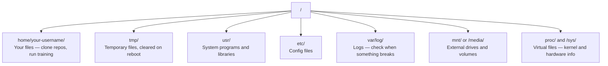

# Linux dla AI

> Większość AI działa na Linuksie. Musisz wiedzieć wystarczająco dużo, aby nie utknąć.

**Type:** Learn
**Languages:** --
**Prerequisites:** Phase 0, Lesson 01
**Time:** ~30 minutes

## Learning Objectives

- Nawiguj po systemie plików Linux i wykonuj podstawowe operacje na plikach z wiersza poleceń
- Zarządzaj uprawnieniami plików za pomocą `chmod` i `chown`, aby rozwiązywać błędy "Permission denied"
- Instaluj pakiety systemowe za pomocą `apt` i konfiguruj świeżą maszynę GPU do pracy z AI
- Identyfikuj różnice między macOS a Linuxem, które często zaskakują programistów pracujących na zdalnych maszynach

## The Problem

Pracujesz na macOS lub Windows. Ale w momencie, gdy łączysz się przez SSH z chmurową maszyną GPU, wynajmujesz instancję Lambda lub uruchamiasz maszynę EC2, lądujesz w Ubuntu. Terminal to twój jedyny interfejs. Nie ma Findera, Explorera ani GUI. Jeśli nie potrafisz nawigować po systemie plików, instalować pakietów i zarządzać procesami z wiersza poleceń, utkniesz płacąc za bezczynne godziny GPU, googlując "jak rozpakować plik w Linuksie."

To jest przewodnik przetrwania. Obejmuje dokładnie to, czego potrzebujesz do działania na zdalnej maszynie Linux w pracy z AI. Nic więcej.

## File System Layout

Linux organizuje wszystko pod jednym korzeniem `/`. Nie ma `C:\` ani `/Volumes`. Katalogi, których faktycznie dotkniesz:



Twój katalog domowy to `~` lub `/home/twoja-nazwa-użytkownika`. Prawie wszystko, co robisz, dzieje się tutaj.

## Essential Commands

To 15 poleceń, które pokrywają 95% tego, co będziesz robić na zdalnej maszynie GPU.

### Poruszanie się

```bash
pwd                         # Gdzie jestem?
ls                          # Co tu jest?
ls -la                      # Co tu jest, włączając ukryte pliki ze szczegółami?
cd /path/to/dir             # Idź tam
cd ~                        # Idź do domu
cd ..                       # Idź poziom wyżej
```

### Pliki i katalogi

```bash
mkdir my-project            # Utwórz katalog
mkdir -p a/b/c              # Utwórz zagnieżdżone katalogi za jednym razem

cp file.txt backup.txt      # Skopiuj plik
cp -r src/ src-backup/      # Skopiuj katalog (rekurencyjnie)

mv old.txt new.txt          # Zmień nazwę pliku
mv file.txt /tmp/           # Przenieś plik

rm file.txt                 # Usuń plik (bez kosza, znika na dobre)
rm -rf my-dir/              # Usuń katalog i wszystko w środku
```

`rm -rf` jest trwałe. Nie ma cofania. Sprawdź ścieżkę dwukrotnie przed naciśnięciem enter.

### Czytanie plików

```bash
cat file.txt                # Wyświetl cały plik
head -20 file.txt           # Pierwsze 20 linii
tail -20 file.txt           # Ostatnie 20 linii
tail -f log.txt             # Śledź plik logu w czasie rzeczywistym (Ctrl+C, aby zatrzymać)
less file.txt               # Przewijaj plik (q, aby wyjść)
```

### Wyszukiwanie

```bash
grep "error" training.log           # Znajdź linie zawierające "error"
grep -r "learning_rate" .           # Przeszukaj wszystkie pliki w bieżącym katalogu
grep -i "cuda" config.yaml          # Wyszukiwanie bez uwzględniania wielkości liter

find . -name "*.py"                 # Znajdź wszystkie pliki Pythona w bieżącym katalogu
find . -name "*.ckpt" -size +1G     # Znajdź pliki punktów kontrolnych większe niż 1GB
```

## Permissions

Każdy plik w Linuksie ma właściciela i bity uprawnień. Natkniesz się na to, gdy skrypty nie będą działać lub nie będziesz mógł zapisać do katalogu.

```bash
ls -l train.py
# -rwxr-xr-- 1 user group 2048 Mar 19 10:00 train.py
#  ^^^             uprawnienia właściciela: odczyt, zapis, wykonanie
#     ^^^          uprawnienia grupy: odczyt, wykonanie
#        ^^        wszyscy inni: tylko odczyt
```

Typowe poprawki:

```bash
chmod +x train.sh           # Uczyń skrypt wykonywalnym
chmod 755 deploy.sh         # Właściciel: pełne, inni: odczyt+wykonanie
chmod 644 config.yaml       # Właściciel: odczyt+zapis, inni: tylko odczyt

chown user:group file.txt   # Zmień właściciela pliku (wymaga sudo)
```

Gdy coś mówi "Permission denied", prawie zawsze jest to problem uprawnień. `chmod +x` lub `sudo` naprawi większość przypadków.

## Package Management (apt)

Ubuntu używa `apt`. W ten sposób instalujesz oprogramowanie na poziomie systemowym.

```bash
sudo apt update             # Odśwież listę pakietów (zawsze rób to najpierw)
sudo apt install -y htop    # Zainstaluj pakiet (-y pomija potwierdzenie)
sudo apt install -y build-essential  # Kompilator C, make, itp. Wymagane przez wiele pakietów Pythona
sudo apt install -y tmux    # Multiplekser terminala (utrzymuj sesje przy życiu po rozłączeniu)

apt list --installed        # Co jest zainstalowane?
sudo apt remove htop        # Odinstaluj
```

Typowe pakiety, które zainstalujesz na świeżej maszynie GPU:

```bash
sudo apt update && sudo apt install -y \
    build-essential \
    git \
    curl \
    wget \
    tmux \
    htop \
    unzip \
    python3-venv
```

## Users and sudo

Zwykle jesteś zalogowany jako zwykły użytkownik. Niektóre operacje wymagają dostępu root (administratora).

```bash
whoami                      # Jakim użytkownikiem jestem?
sudo command                # Uruchom pojedyncze polecenie jako root
sudo su                     # Zostań rootem (exit, aby wrócić, używaj oszczędnie)
```

Na chmurowych instancjach GPU jesteś zazwyczaj jedynym użytkownikiem i już masz dostęp sudo. Nie uruchamiaj wszystkiego jako root. Używaj sudo tylko wtedy, gdy to konieczne.

## Processes and systemd

Gdy twój trening się zawiesza lub musisz sprawdzić, co działa:

```bash
htop                        # Interaktywny przeglądarka procesów (q, aby wyjść)
ps aux | grep python        # Znajdź działające procesy Pythona
kill 12345                  # Łagodnie zatrzymaj proces o PID 12345
kill -9 12345               # Wymuś zatrzymanie (użyj, gdy łagodne nie działa)
nvidia-smi                  # Procesy GPU i użycie pamięci
```

systemd zarządza usługami (demonami w tle). Użyjesz go, jeśli uruchamiasz serwery inferencyjne:

```bash
sudo systemctl start nginx          # Uruchom usługę
sudo systemctl stop nginx           # Zatrzymaj ją
sudo systemctl restart nginx        # Zrestartuj ją
sudo systemctl status nginx         # Sprawdź, czy działa
sudo systemctl enable nginx         # Uruchom automatycznie przy starcie systemu
```

## Disk Space

Maszyny GPU często mają ograniczoną przestrzeń dyskową. Modele i zbiory danych szybko ją wypełniają.

```bash
df -h                       # Użycie dysku dla wszystkich zamontowanych napędów
df -h /home                 # Użycie dysku dla /home konkretnie

du -sh *                    # Rozmiar każdego elementu w bieżącym katalogu
du -sh ~/.cache             # Rozmiar twojego cache (pip, modele huggingface lądują tutaj)
du -sh /data/checkpoints/   # Sprawdź, jak duże są twoje punkty kontrolne

# Znajdź największe pożeracze miejsca
du -h --max-depth=1 / 2>/dev/null | sort -hr | head -20
```

Typowe oszczędzacze miejsca:

```bash
# Wyczyść cache pip
pip cache purge

# Wyczyść cache apt
sudo apt clean

# Usuń stare punkty kontrolne, których nie potrzebujesz
rm -rf checkpoints/epoch_01/ checkpoints/epoch_02/
```

## Networking

Będziesz pobierać modele, przesyłać pliki i łączyć się z API z wiersza poleceń.

```bash
# Pobieranie plików
wget https://example.com/model.bin                   # Pobierz plik
curl -O https://example.com/data.tar.gz              # To samo z curl
curl -s https://api.example.com/health | python3 -m json.tool  # Wywołaj API, ładnie wyświetl JSON

# Przesyłanie plików między maszynami
scp model.bin user@remote:/data/                     # Skopiuj plik na zdalną maszynę
scp user@remote:/data/results.csv .                  # Skopiuj plik ze zdalnej na lokalną
scp -r user@remote:/data/checkpoints/ ./local-dir/   # Skopiuj katalog

# Synchronizuj katalogi (szybsze niż scp dla dużych transferów, wznawia po błędzie)
rsync -avz --progress ./data/ user@remote:/data/
rsync -avz --progress user@remote:/results/ ./results/
```

Używaj `rsync` zamiast `scp` do czegokolwiek dużego. Przenosi tylko zmienione bajty i obsługuje przerwane połączenia.

## tmux: Utrzymuj Sesje Przy Życiu

Gdy łączysz się przez SSH ze zdalną maszyną, zamknięcie laptopa zabija twój trening. tmux temu zapobiega.

```bash
tmux new -s train           # Rozpocznij nową sesję o nazwie "train"
# ... rozpocznij trening, potem:
# Ctrl+B, then D            # Odłącz (trening działa dalej)

tmux ls                     # Lista sesji
tmux attach -t train        # Podłącz się ponownie do sesji

# Wewnątrz tmux:
# Ctrl+B, then %            # Podziel panel pionowo
# Ctrl+B, then "            # Podziel panel poziomo
# Ctrl+B, then arrow keys   # Przełączaj między panelami
```

Zawsze uruchamiaj długie treningi wewnątrz tmux. Zawsze.

## WSL2 dla Użytkowników Windows

Jeśli jesteś na Windows, WSL2 daje ci prawdziwe środowisko Linux bez podwójnego bootowania.

```bash
# W PowerShell (admin)
wsl --install -d Ubuntu-24.04

# Po restarcie otwórz Ubuntu z menu Start
sudo apt update && sudo apt upgrade -y
```

WSL2 uruchamia prawdziwe jądro Linux. Wszystko w tej lekcji działa w nim. Twoje pliki Windows są w `/mnt/c/Users/TwojaNazwa/` z wnętrza WSL.

Przekazywanie GPU działa ze sterownikami NVIDIA zainstalowanymi po stronie Windows. Zainstaluj sterownik NVIDIA dla Windows (nie Linux), a CUDA będzie dostępne wewnątrz WSL2.

## Gotchas: macOS na Linux

Rzeczy, które cię zaskoczą, jeśli przechodzisz z macOS:

| macOS | Linux | Notes |
|-------|-------|-------|
| `brew install` | `sudo apt install` | Czasami różne nazwy pakietów. `brew install htop` vs `sudo apt install htop` działa tak samo, ale `brew install readline` vs `sudo apt install libreadline-dev` już nie. |
| `open file.txt` | `xdg-open file.txt` | Ale nie będziesz miał GUI na zdalnej maszynie. Użyj `cat` lub `less`. |
| `pbcopy` / `pbpaste` | Niedostępne | Przekazywanie do/z schowka nie istnieje przez SSH. |
| `~/.zshrc` | `~/.bashrc` | macOS domyślnie używa zsh. Większość serwerów Linux używa bash. |
| `/opt/homebrew/` | `/usr/bin/`, `/usr/local/bin/` | Pliki binarne znajdują się w różnych miejscach. |
| `sed -i '' 's/a/b/' file` | `sed -i 's/a/b/' file` | sed na macOS wymaga pustego ciągu po `-i`. Linux nie. |
| System plików bez rozróżniania wielkości liter | System plików z rozróżnianiem wielkości liter | `Model.py` i `model.py` to dwa różne pliki na Linuksie. |
| Końce linii `\n` | Końce linii `\n` | To samo. Ale Windows używa `\r\n`, co psuje skrypty bash. Uruchom `dos2unix`, aby naprawić. |

## Quick Reference Card

```
Nawigacja:      pwd, ls, cd, find
Pliki:          cp, mv, rm, mkdir, cat, head, tail, less
Wyszukiwanie:   grep, find
Uprawnienia:    chmod, chown, sudo
Pakiety:        apt update, apt install
Procesy:        htop, ps, kill, nvidia-smi
Usługi:         systemctl start/stop/restart/status
Dysk:           df -h, du -sh
Sieć:           curl, wget, scp, rsync
Sesje:          tmux new/attach/detach
```

## Exercises

1. Połącz się przez SSH z dowolną maszyną Linux (lub otwórz WSL2) i przejdź do swojego katalogu domowego. Utwórz folder projektu, utwórz w nim trzy puste pliki za pomocą `touch`, a następnie wyświetl je za pomocą `ls -la`.
2. Zainstaluj `htop` za pomocą apt, uruchom go i zidentyfikuj, który proces zużywa najwięcej pamięci.
3. Uruchom sesję tmux, uruchom w niej `sleep 300`, odłącz, wyświetl listę sesji i podłącz się ponownie.
4. Użyj `df -h`, aby sprawdzić dostępne miejsce na dysku, a następnie użyj `du -sh ~/.cache/*`, aby znaleźć, co zajmuje miejsce w twoim cache.
5. Przenieś plik z lokalnej maszyny na zdalną za pomocą `scp`, a następnie wykonaj ten sam transfer za pomocą `rsync` i porównaj doświadczenia.