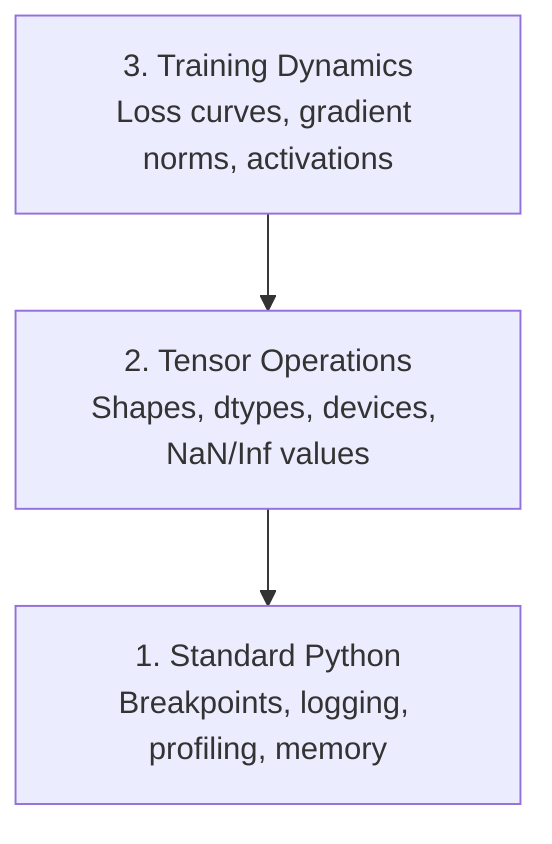

# Debugowanie i profilowanie

> Najgorsze błędy AI nie powodują crashy. Trenują w milczeniu na śmieciach i raportują piękną krzywą straty.

**Type:** Build
**Language:** Python
**Prerequisites:** Lesson 1 (Dev Environment), basic PyTorch familiarity
**Time:** ~60 minutes

## Learning Objectives

- Używaj warunkowego `breakpoint()` i `debug_print` do inspekcji kształtów tensorów, typów danych i wartości NaN podczas treningu
- Profiluj pętle treningowe za pomocą `cProfile`, `line_profiler` i `tracemalloc` w celu znalezienia wąskich gardeł
- Wykrywaj typowe błędy AI: niezgodności kształtów, NaN straty, wycieki danych i tensory na złym urządzeniu
- Skonfiguruj TensorBoard do wizualizacji krzywych straty, histogramów wag i rozkładów gradientów

## The Problem

Kod AI zawodzi inaczej niż zwykły kod. Aplikacja webowa crashuje ze stosem wywołań. Źle skonfigurowana pętla treningowa działa przez 8 godzin, spala 200 USD czasu GPU i produkuje model, który przewiduje średnią każdego wejścia. Kod nigdy nie zgłosił błędu. Błąd polegał na tensorze na złym urządzeniu, zapomnianym `.detach()` lub etykietach wyciekających do cech.

Potrzebujesz narzędzi debugowania, które wyłapują te ciche awarie, zanim zmarnowią twój czas i moc obliczeniową.

## The Concept

Debugowanie AI działa na trzech poziomach:



Większość ludzi skacze od razu do poziomu 3 (wpatrywanie się w TensorBoard). Ale 80% błędów AI żyje na poziomach 1 i 2.

## Build It

### Part 1: Debugowanie przez wydruk (Tak, Działa)

Debugowanie przez wydruk jest lekceważone. Nie powinno być. Dla kodu tensorowego ukierunkowany print bije na głowę przechodzenie przez debugger, ponieważ musisz widzieć kształty, typy danych i zakresy wartości naraz.

```python
def debug_print(name, tensor):
    print(f"{name}: shape={tensor.shape}, dtype={tensor.dtype}, "
          f"device={tensor.device}, "
          f"min={tensor.min().item():.4f}, max={tensor.max().item():.4f}, "
          f"mean={tensor.mean().item():.4f}, "
          f"has_nan={tensor.isnan().any().item()}")
```

Wywołuj to po każdej podejrzanej operacji. Gdy błąd zostanie znaleziony, usuń wydruki. Proste.

### Part 2: Debugger Pythona (pdb i breakpoint)

Wbudowany debugger jest niedoceniany w pracy z AI. Wstaw `breakpoint()` do swojej pętli treningowej i inspekcjonuj tensory interaktywnie.

```python
def training_step(model, batch, criterion, optimizer):
    inputs, labels = batch
    outputs = model(inputs)
    loss = criterion(outputs, labels)

    if loss.item() > 100 or torch.isnan(loss):
        breakpoint()

    loss.backward()
    optimizer.step()
```

Gdy debugger cię zatrzyma, przydatne polecenia:

- `p outputs.shape` aby sprawdzić kształty
- `p loss.item()` aby zobaczyć wartość straty
- `p torch.isnan(outputs).sum()` aby policzyć NaNy
- `p model.fc1.weight.grad` aby sprawdzić gradienty
- `c` aby kontynuować, `q` aby wyjść

To jest debugowanie warunkowe. Zatrzymujesz się tylko wtedy, gdy coś wygląda źle. Dla treningu na 10 000 kroków ma to znaczenie.

### Part 3: Logowanie w Pythonie

Zastąp printy logowaniem, gdy debugowanie wykracza poza szybkie sprawdzenie.

```python
import logging

logging.basicConfig(
    level=logging.INFO,
    format="%(asctime)s [%(levelname)s] %(message)s",
    handlers=[
        logging.FileHandler("training.log"),
        logging.StreamHandler()
    ]
)
logger = logging.getLogger(__name__)

logger.info("Starting training: lr=%.4f, batch_size=%d", lr, batch_size)
logger.warning("Loss spike detected: %.4f at step %d", loss.item(), step)
logger.error("NaN loss at step %d, stopping", step)
```

Logowanie daje znaczniki czasu, poziomy ważności i wyjście do pliku. Gdy trening zakończy się niepowodzeniem o 3 nad ranem, chcesz plik logu, a nie wyjście terminala, które przewinęło się poza ekran.

### Part 4: Mierzenie czasu sekcji kodu

Wiedza, gdzie idzie czas, to pierwszy krok do optymalizacji.

```python
import time

class Timer:
    def __init__(self, name=""):
        self.name = name

    def __enter__(self):
        self.start = time.perf_counter()
        return self

    def __exit__(self, *args):
        elapsed = time.perf_counter() - self.start
        print(f"[{self.name}] {elapsed:.4f}s")

with Timer("data loading"):
    batch = next(dataloader_iter)

with Timer("forward pass"):
    outputs = model(batch)

with Timer("backward pass"):
    loss.backward()
```

Typowe odkrycie: ładowanie danych zajmuje 60% czasu treningu. Naprawa to `num_workers > 0` w twoim DataLoader, a nie szybsze GPU.

### Part 5: cProfile i line_profiler

Gdy potrzebujesz więcej niż ręcznych timerów:

```bash
python -m cProfile -s cumtime train.py
```

To pokazuje każde wywołanie funkcji posortowane według skumulowanego czasu. Do profilowania linia po linii:

```bash
pip install line_profiler
```

```python
@profile
def train_step(model, data, target):
    output = model(data)
    loss = F.cross_entropy(output, target)
    loss.backward()
    return loss

# Run with: kernprof -l -v train.py
```

### Part 6: Profilowanie pamięci

#### Pamięć CPU z tracemalloc

```python
import tracemalloc

tracemalloc.start()

# your code here
model = build_model()
data = load_dataset()

snapshot = tracemalloc.take_snapshot()
top_stats = snapshot.statistics("lineno")
for stat in top_stats[:10]:
    print(stat)
```

#### Pamięć CPU z memory_profiler

```bash
pip install memory_profiler
```

```python
from memory_profiler import profile

@profile
def load_data():
    raw = read_csv("data.csv")       # watch memory jump here
    processed = preprocess(raw)       # and here
    return processed
```

Uruchom z `python -m memory_profiler your_script.py`, aby zobaczyć użycie pamięci linia po linii.

#### Pamięć GPU z PyTorch

```python
import torch

if torch.cuda.is_available():
    print(torch.cuda.memory_summary())

    print(f"Allocated: {torch.cuda.memory_allocated() / 1e9:.2f} GB")
    print(f"Cached: {torch.cuda.memory_reserved() / 1e9:.2f} GB")
```

Gdy trafisz na OOM (Out of Memory):

1. Zmniejsz rozmiar partii (pierwsza rzecz do wypróbowania, zawsze)
2. Użyj `torch.cuda.empty_cache()` aby zwolnić zapisaną w pamięci podręcznej pamięć
3. Użyj `del tensor` po którym następuje `torch.cuda.empty_cache()` dla dużych obiektów pośrednich
4. Użyj mieszanej precyzji (`torch.cuda.amp`) aby zmniejszyć użycie pamięci o połowę
5. Użyj gradient checkpointing dla bardzo głębokich modeli

### Part 7: Typowe błędy AI i jak je wyłapywać

#### Niezgodność kształtów

Najczęstszy błąd. Tensor ma kształt `[batch, features]`, gdy model oczekuje `[batch, channels, height, width]`.

```python
def check_shapes(model, sample_input):
    print(f"Input: {sample_input.shape}")
    hooks = []

    def make_hook(name):
        def hook(module, inp, out):
            in_shape = inp[0].shape if isinstance(inp, tuple) else inp.shape
            out_shape = out.shape if hasattr(out, "shape") else type(out)
            print(f"  {name}: {in_shape} -> {out_shape}")
        return hook

    for name, module in model.named_modules():
        hooks.append(module.register_forward_hook(make_hook(name)))

    with torch.no_grad():
        model(sample_input)

    for h in hooks:
        h.remove()
```

Uruchom to raz z przykładową partią. Mapuje każdą transformację kształtu w twoim modelu.

#### NaN straty

NaN strata oznacza, że coś eksplodowało. Typowe przyczyny:

- Zbyt wysoka szybkość uczenia
- Dzielenie przez zero w niestandardowej stracie
- Log z zera lub liczby ujemnej
- Eksplodujące gradienty w RNN

```python
def detect_nan(model, loss, step):
    if torch.isnan(loss):
        print(f"NaN loss at step {step}")
        for name, param in model.named_parameters():
            if param.grad is not None:
                if torch.isnan(param.grad).any():
                    print(f"  NaN gradient in {name}")
                if torch.isinf(param.grad).any():
                    print(f"  Inf gradient in {name}")
        return True
    return False
```

#### Wyciek danych

Twój model osiąga 99% dokładności na zbiorze testowym. Brzmi świetnie. To błąd.

```python
def check_data_leakage(train_set, test_set, id_column="id"):
    train_ids = set(train_set[id_column].tolist())
    test_ids = set(test_set[id_column].tolist())
    overlap = train_ids & test_ids
    if overlap:
        print(f"WYCIEK DANYCH: {len(overlap)} próbek w train i test")
        return True
    return False
```

Sprawdź także wyciek czasowy: używanie przyszłych danych do przewidywania przeszłości. Sortuj według znacznika czasu przed podziałem.

#### Złe urządzenie

Tensory na różnych urządzeniach (CPU vs GPU) powodują błędy wykonania. Ale czasami tensor cicho pozostaje na CPU, podczas gdy wszystko inne jest na GPU, a trening po prostu działa wolno.

```python
def check_devices(model, *tensors):
    model_device = next(model.parameters()).device
    print(f"Model device: {model_device}")
    for i, t in enumerate(tensors):
        if t.device != model_device:
            print(f"  OSTRZEŻENIE: tensor {i} na {t.device}, model na {model_device}")
```

### Part 8: Podstawy TensorBoard

TensorBoard pokazuje, co dzieje się wewnątrz treningu w czasie.

```bash
pip install tensorboard
```

```python
from torch.utils.tensorboard import SummaryWriter

writer = SummaryWriter("runs/experiment_1")

for step in range(num_steps):
    loss = train_step(model, batch)

    writer.add_scalar("loss/train", loss.item(), step)
    writer.add_scalar("lr", optimizer.param_groups[0]["lr"], step)

    if step % 100 == 0:
        for name, param in model.named_parameters():
            writer.add_histogram(f"weights/{name}", param, step)
            if param.grad is not None:
                writer.add_histogram(f"grads/{name}", param.grad, step)

writer.close()
```

Uruchom go:

```bash
tensorboard --logdir=runs
```

Na co zwracać uwagę:

- **Strata nie maleje**: Zbyt niska szybkość uczenia lub problem z architekturą modelu
- **Strata oscyluje gwałtownie**: Zbyt wysoka szybkość uczenia
- **Strata idzie w NaN**: Niestabilność numeryczna (patrz sekcja NaN powyżej)
- **Strata treningowa maleje, walidacyjna rośnie**: Przeuczenie (overfitting)
- **Histogramy wag kurczą się do zera**: Zanikające gradienty
- **Histogramy gradientów eksplodują**: Wymagane przycinanie gradientów

### Part 9: Debugger VS Code

Do interaktywnego debugowania skonfiguruj VS Code z `launch.json`:

```json
{
    "version": "0.2.0",
    "configurations": [
        {
            "name": "Debug Training",
            "type": "debugpy",
            "request": "launch",
            "program": "${file}",
            "console": "integratedTerminal",
            "justMyCode": false
        }
    ]
}
```

Ustaw punkty przerwania, klikając w rynnę. Użyj panelu Zmienne, aby inspekcjonować właściwości tensorów. Konsola debugowania pozwala uruchamiać dowolne wyrażenia Pythona w trakcie wykonywania.

Przydatne do przechodzenia przez pipeline'y przetwarzania danych, gdzie chcesz zobaczyć każdą transformację.

## Use It

Oto przepływ debugowania, który wyłapuje większość błędów AI:

1. **Przed treningiem**: Uruchom `check_shapes` z przykładową partią. Zweryfikuj, że wymiary wejściowe i wyjściowe są zgodne z oczekiwaniami.
2. **Pierwsze 10 kroków**: Użyj `debug_print` na stracie, wynikach i gradientach. Potwierdź, że nic nie jest NaN, a wartości są w rozsądnych zakresach.
3. **Podczas treningu**: Loguj stratę, szybkość uczenia i normy gradientów. Użyj TensorBoard do wizualizacji.
4. **Gdy coś się psuje**: Wstaw `breakpoint()` w punkcie awarii. Inspekcjonuj tensory interaktywnie.
5. **Dla wydajności**: Zmierz czas ładowania danych vs przejście w przód vs wstecz. Profiluj pamięć, jeśli jesteś blisko OOM.

## Ship It

Uruchom skrypt zestawu narzędzi debugowania:

```bash
python phases/00-setup-and-tooling/12-debugging-and-profiling/code/debug_tools.py
```

Zobacz `outputs/prompt-debug-ai-code.md` po prompt pomagający diagnozować błędy specyficzne dla AI.

## Exercises

1. Uruchom `debug_tools.py` i przeczytaj wyniki każdej sekcji. Zmodyfikuj fałszywy model, aby wprowadzić NaN (wskazówka: podziel przez zero w przejściu w przód) i obserwuj, jak detektor go wyłapie.
2. Profiluj pętlę treningową za pomocą `cProfile` i zidentyfikuj najwolniejszą funkcję.
3. Użyj `tracemalloc`, aby znaleźć, która linia w pipeline'ie ładowania danych alokuje najwięcej pamięci.
4. Skonfiguruj TensorBoard dla prostego przebiegu treningowego i określ, czy model się przeucza.
5. Użyj `breakpoint()` wewnątrz pętli treningowej. Ćwicz inspekcję kształtów tensorów, urządzeń i wartości gradientów z poziomu promptu debuggera.