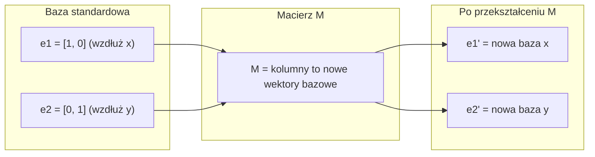
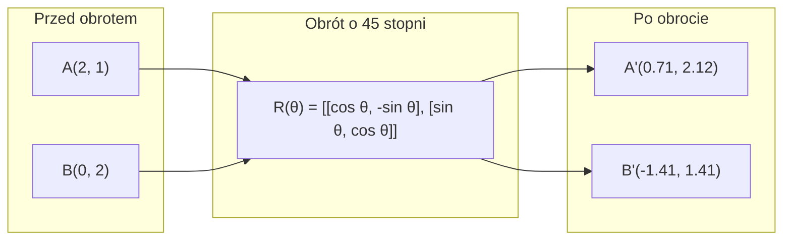
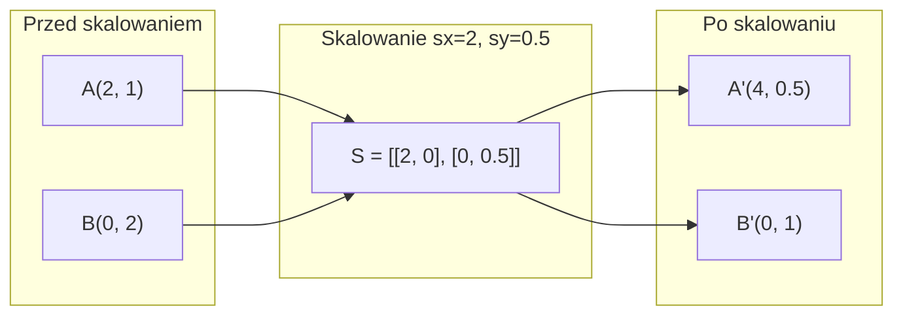
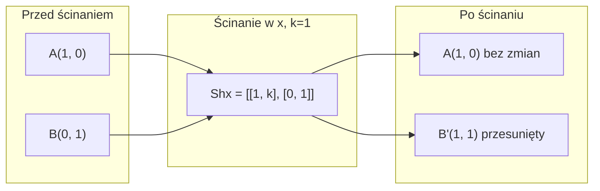
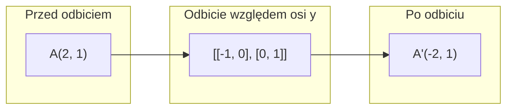
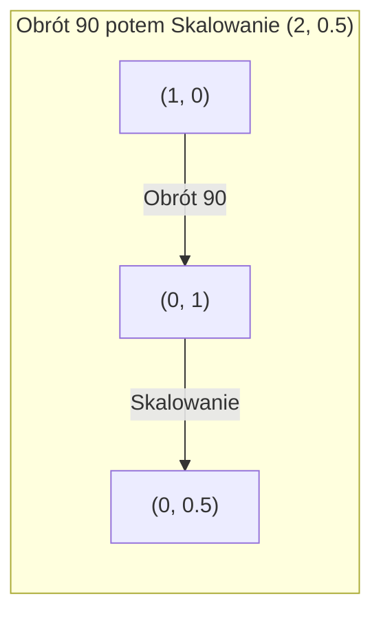
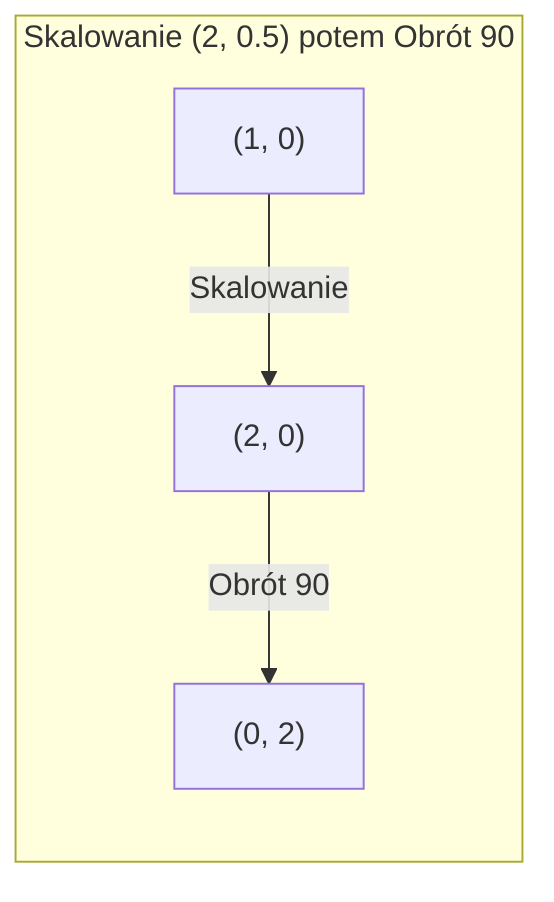

# Przekształcenia Macierzowe

> Macierz to maszyna przekształcająca przestrzeń. Zrozum, co robi z każdym punktem, a zrozumiesz całe przekształcenie.

**Type:** Build
**Languages:** Python, Julia
**Prerequisites:** Phase 1, Lessons 01-02 (Linear Algebra Intuition, Vectors & Matrices Operations)
**Time:** ~75 minut

## Learning Objectives

- Skonstruuj macierze obrotu, skalowania, ścinania i odbicia i zastosuj je do punktów 2D i 3D
- Złóż wiele przekształceń przez mnożenie macierzy i zweryfikuj, że kolejność ma znaczenie
- Oblicz wartości i wektory własne macierzy 2x2 z równania charakterystycznego
- Wyjaśnij, dlaczego wartości własne determinują kierunki PCA, stabilność RNN i zachowanie klastrowania spektralnego

## Problem

Czytasz o PCA i widzisz "znajdź wektory własne macierzy kowariancji". Czytasz o stabilności modelu i widzisz "sprawdź, czy wszystkie wartości własne mają moduł mniejszy niż 1". Czytasz o augmentacji danych i widzisz "zastosuj losowy obrót". Nic z tego nie ma sensu, dopóki nie zrozumiesz, co macierze robią z przestrzenią geometrycznie.

Macierze to nie tylko siatki liczb. To maszyny przestrzenne. Macierz obrotu obraca punkty. Macierz skalowania rozciąga je. Macierz ścinania przechyla je. Każde przekształcenie, jakie sieć neuronowa stosuje do danych, jest jedną z tych operacji lub ich złożeniem. Ta lekcja sprawia, że te operacje stają się konkretne.

## Koncepcja

### Przekształcenia jako macierze

Każde przekształcenie liniowe w 2D można zapisać jako macierz 2x2. Macierz mówi dokładnie, gdzie trafiają wektory bazowe [1, 0] i [0, 1]. Wszystko inne wynika z tego.



### Obrót

Obrót 2D o kąt theta zachowuje odległości i kąty. Przesuwa każdy punkt po łuku koła.



W 3D obracasz wokół osi. Każda oś ma własną macierz obrotu:

```
Rz(theta) = | cos  -sin  0 |     Obrót wokół osi z
            | sin   cos  0 |     (płaszczyzna x-y się kręci, z zostaje)
            |  0     0   1 |

Rx(theta) = | 1   0     0    |   Obrót wokół osi x
            | 0  cos  -sin   |   (płaszczyzna y-z się kręci, x zostaje)
            | 0  sin   cos   |

Ry(theta) = |  cos  0  sin |     Obrót wokół osi y
            |   0   1   0  |     (płaszczyzna x-z się kręci, y zostaje)
            | -sin  0  cos |
```

### Skalowanie

Skalowanie rozciąga lub ściska wzdłuż każdej osi niezależnie.



### Ścinanie

Ścinanie przechyla jedną oś, pozostawiając drugą nieruchomą. Zamienia prostokąty w równoległoboki.



Macierze ścinania:
- `Shx = [[1, k], [0, 1]]` przesuwa x o k * y
- `Shy = [[1, 0], [k, 1]]` przesuwa y o k * x

### Odbicie

Odbicie odbija punkty względem osi lub linii.



Macierze odbicia:
- Odbicie względem osi y: `[[-1, 0], [0, 1]]`
- Odbicie względem osi x: `[[1, 0], [0, -1]]`

### Złożenie: łańcuchowanie przekształceń

Zastosowanie przekształcenia A, a następnie B jest tym samym, co pomnożenie ich macierzy: `result = B @ A @ point`. Kolejność ma znaczenie. Obrót, a potem skalowanie daje inne wyniki niż skalowanie, a potem obrót.



Złożone: `S @ R = [[0, -2], [0.5, 0]]`



Złożone: `R @ S = [[0, -0.5], [2, 0]]`

Różne wyniki. Mnożenie macierzy nie jest przemienne.

### Wartości i wektory własne

Większość wektorów zmienia kierunek, gdy działa na nie macierz. Wektory własne są wyjątkowe: macierz tylko je skaluje, nigdy nie obraca. Współczynnik skalowania to wartość własna.

```
A @ v = lambda * v

v to wektor własny (kierunek, który przetrwa)
lambda to wartość własna (o ile rozciąga)

Przykład: A = | 2  1 |
             | 1  2 |

Wektor własny [1, 1] z wartością własną 3:
  A @ [1,1] = [3, 3] = 3 * [1, 1]     (ten sam kierunek, przeskalowane o 3)

Wektor własny [1, -1] z wartością własną 1:
  A @ [1,-1] = [1, -1] = 1 * [1, -1]  (ten sam kierunek, bez zmian)
```

Macierz rozciąga przestrzeń 3x wzdłuż [1, 1] i pozostawia [1, -1] bez zmian. Każdy inny kierunek jest mieszanką tych dwóch.

### Rozkład na wartości własne

Jeśli macierz ma n liniowo niezależnych wektorów własnych, można ją rozłożyć:

```
A = V @ D @ V^(-1)

V = macierz, której kolumny to wektory własne
D = macierz diagonalna wartości własnych
V^(-1) = odwrotność V

To mówi: obróć do współrzędnych wektorów własnych, skaluj wzdłuż każdej osi, obróć z powrotem.
```

### Dlaczego wartości własne mają znaczenie

**PCA.** Wektory własne macierzy kowariancji to główne składowe. Wartości własne mówią, ile wariancji przechwytuje każda składowa. Posortuj według wartości własnych, zachowaj top k, i masz redukcję wymiarowości.

**Stabilność.** W sieciach rekurencyjnych i układach dynamicznych wartości własne o module > 1 powodują eksplozję wyjść. Moduł < 1 powoduje ich zanikanie. To jest problem zanikających/eksplodujących gradientów w jednym zdaniu.

**Metody spektralne.** Grafy sieci neuronowych używają wartości własnych macierzy sąsiedztwa. Klastrowanie spektralne używa wartości własnych laplasjanu. Wektory własne ujawniają strukturę grafu.

### Wyznacznik jako współczynnik skalowania objętości

Wyznacznik macierzy przekształcenia mówi, jak bardzo skaluje ona pole (2D) lub objętość (3D).

```
det = 1:   pole zachowane (obrót)
det = 2:   pole podwojone
det = 0:   przestrzeń zgnieciona do niższego wymiaru (osobliwa)
det = -1:  pole zachowane, ale orientacja odwrócona (odbicie)

| det(Obrót) | = 1        (zawsze)
| det(Skalowanie sx, sy) | = sx * sy
| det(Ścinanie) | = 1           (pole zachowane)
| det(Odbicie) | = -1           (orientacja odwrócona)
```

```figure
matrix-transform
```

## Build It

### Krok 1: Macierze przekształceń od podstaw (Python)

```python
import math

def rotation_2d(theta):
    c, s = math.cos(theta), math.sin(theta)
    return [[c, -s], [s, c]]

def scaling_2d(sx, sy):
    return [[sx, 0], [0, sy]]

def shearing_2d(kx, ky):
    return [[1, kx], [ky, 1]]

def reflection_x():
    return [[1, 0], [0, -1]]

def reflection_y():
    return [[-1, 0], [0, 1]]

def mat_vec_mul(matrix, vector):
    return [
        sum(matrix[i][j] * vector[j] for j in range(len(vector)))
        for i in range(len(matrix))
    ]

def mat_mul(a, b):
    rows_a, cols_b = len(a), len(b[0])
    cols_a = len(a[0])
    return [
        [sum(a[i][k] * b[k][j] for k in range(cols_a)) for j in range(cols_b)]
        for i in range(rows_a)
    ]

point = [1.0, 0.0]
angle = math.pi / 4

rotated = mat_vec_mul(rotation_2d(angle), point)
print(f"Obrót (1,0) o 45 st: ({rotated[0]:.4f}, {rotated[1]:.4f})")

scaled = mat_vec_mul(scaling_2d(2, 3), [1.0, 1.0])
print(f"Skalowanie (1,1) przez (2,3): ({scaled[0]:.1f}, {scaled[1]:.1f})")

sheared = mat_vec_mul(shearing_2d(1, 0), [1.0, 1.0])
print(f"Ścinanie (1,1) kx=1: ({sheared[0]:.1f}, {sheared[1]:.1f})")

reflected = mat_vec_mul(reflection_y(), [2.0, 1.0])
print(f"Odbicie (2,1) względem y: ({reflected[0]:.1f}, {reflected[1]:.1f})")
```

### Krok 2: Złożenie przekształceń

```python
R = rotation_2d(math.pi / 2)
S = scaling_2d(2, 0.5)

rotate_then_scale = mat_mul(S, R)
scale_then_rotate = mat_mul(R, S)

point = [1.0, 0.0]
result1 = mat_vec_mul(rotate_then_scale, point)
result2 = mat_vec_mul(scale_then_rotate, point)

print(f"Obrót 90 potem skalowanie: ({result1[0]:.2f}, {result1[1]:.2f})")
print(f"Skalowanie potem obrót 90: ({result2[0]:.2f}, {result2[1]:.2f})")
print(f"Takie same? {result1 == result2}")
```

### Krok 3: Wartości własne od podstaw (2x2)

Dla macierzy 2x2 `[[a, b], [c, d]]`, wartości własne rozwiązują równanie charakterystyczne: `lambda^2 - (a+d)*lambda + (ad - bc) = 0`.

```python
def eigenvalues_2x2(matrix):
    a, b = matrix[0]
    c, d = matrix[1]
    trace = a + d
    det = a * d - b * c
    discriminant = trace ** 2 - 4 * det
    if discriminant < 0:
        real = trace / 2
        imag = (-discriminant) ** 0.5 / 2
        return (complex(real, imag), complex(real, -imag))
    sqrt_disc = discriminant ** 0.5
    return ((trace + sqrt_disc) / 2, (trace - sqrt_disc) / 2)

def eigenvector_2x2(matrix, eigenvalue):
    a, b = matrix[0]
    c, d = matrix[1]
    if abs(b) > 1e-10:
        v = [b, eigenvalue - a]
    elif abs(c) > 1e-10:
        v = [eigenvalue - d, c]
    else:
        if abs(a - eigenvalue) < 1e-10:
            v = [1, 0]
        else:
            v = [0, 1]
    mag = (v[0] ** 2 + v[1] ** 2) ** 0.5
    return [v[0] / mag, v[1] / mag]

A = [[2, 1], [1, 2]]
vals = eigenvalues_2x2(A)
print(f"Macierz: {A}")
print(f"Wartości własne: {vals[0]:.4f}, {vals[1]:.4f}")

for val in vals:
    vec = eigenvector_2x2(A, val)
    result = mat_vec_mul(A, vec)
    scaled = [val * vec[0], val * vec[1]]
    print(f"  lambda={val:.1f}, v={[round(x,4) for x in vec]}")
    print(f"    A@v = {[round(x,4) for x in result]}")
    print(f"    l*v = {[round(x,4) for x in scaled]}")
```

### Krok 4: Wyznacznik jako współczynnik skalowania objętości

```python
def det_2x2(matrix):
    return matrix[0][0] * matrix[1][1] - matrix[0][1] * matrix[1][0]

print(f"det(obrót 45) = {det_2x2(rotation_2d(math.pi/4)):.4f}")
print(f"det(skalowanie 2,3)   = {det_2x2(scaling_2d(2, 3)):.1f}")
print(f"det(ścinanie kx=1)  = {det_2x2(shearing_2d(1, 0)):.1f}")
print(f"det(odbicie y)   = {det_2x2(reflection_y()):.1f}")

singular = [[1, 2], [2, 4]]
print(f"det(osobliwa)     = {det_2x2(singular):.1f}")
print("Osobliwa: kolumny są proporcjonalne, przestrzeń zapada się do linii.")
```

## Use It

NumPy obsługuje wszystko to zoptymalizowanymi procedurami.

```python
import numpy as np

theta = np.pi / 4
R = np.array([[np.cos(theta), -np.sin(theta)],
              [np.sin(theta),  np.cos(theta)]])

point = np.array([1.0, 0.0])
print(f"Obrót (1,0) o 45 st: {R @ point}")

S = np.diag([2.0, 3.0])
composed = S @ R
print(f"Skalowanie(2,3) po Obrocie(45): {composed @ point}")

A = np.array([[2, 1], [1, 2]], dtype=float)
eigenvalues, eigenvectors = np.linalg.eig(A)
print(f"\nWartości własne: {eigenvalues}")
print(f"Wektory własne (kolumny):\n{eigenvectors}")

for i in range(len(eigenvalues)):
    v = eigenvectors[:, i]
    lam = eigenvalues[i]
    print(f"  A @ v{i} = {A @ v}, lambda * v{i} = {lam * v}")

print(f"\ndet(R) = {np.linalg.det(R):.4f}")
print(f"det(S) = {np.linalg.det(S):.1f}")

B = np.array([[3, 1], [0, 2]], dtype=float)
vals, vecs = np.linalg.eig(B)
D = np.diag(vals)
V = vecs
reconstructed = V @ D @ np.linalg.inv(V)
print(f"\nRozkład własnościowy A = V @ D @ V^-1:")
print(f"Oryginał:\n{B}")
print(f"Odtworzony:\n{reconstructed}")
```

### Obrót 3D z NumPy

```python
def rotation_3d_z(theta):
    c, s = np.cos(theta), np.sin(theta)
    return np.array([[c, -s, 0], [s, c, 0], [0, 0, 1]])

def rotation_3d_x(theta):
    c, s = np.cos(theta), np.sin(theta)
    return np.array([[1, 0, 0], [0, c, -s], [0, s, c]])

point_3d = np.array([1.0, 0.0, 0.0])
rotated_z = rotation_3d_z(np.pi / 2) @ point_3d
rotated_x = rotation_3d_x(np.pi / 2) @ point_3d

print(f"\nPunkt 3D: {point_3d}")
print(f"Obrót 90 wokół z: {np.round(rotated_z, 4)}")
print(f"Obrót 90 wokół x: {np.round(rotated_x, 4)}")
```

## Ship It

Ta lekcja buduje geometryczny fundament dla PCA (Phase 2) i analizy wag sieci neuronowych. Kod wartości/wektorów własnych zbudowany tutaj to ten sam algorytm, który napędza redukcję wymiarowości, klastrowanie spektralne i analizę stabilności w produkcyjnych systemach ML.

## Ćwiczenia

1. Zastosuj obrót, skalowanie i ścinanie do kwadratu jednostkowego (wierzchołki w [0,0], [1,0], [1,1], [0,1]). Wydrukuj przekształcone wierzchołki dla każdego. Zweryfikuj, że obrót zachowuje odległości między wierzchołkami.

2. Znajdź wartości własne macierzy [[4, 2], [1, 3]] ręcznie używając równania charakterystycznego. Następnie zweryfikuj swoją funkcją od podstaw i NumPy.

3. Stwórz złożenie trzech przekształceń (obrót o 30 stopni, skalowanie przez [1.5, 0.8], ścinanie z kx=0.3) i zastosuj je do 8 punktów ułożonych w okrąg. Wydrukuj współrzędne przed i po. Oblicz wyznacznik złożonej macierzy i zweryfikuj, że jest równy iloczynowi poszczególnych wyznaczników.

## Key Terms

| Termin | Co ludzie mówią | Co naprawdę znaczy |
|------|----------------|----------------------|
| Macierz obrotu | "Obraca rzeczy" | Ortogonalna macierz, która przesuwa punkty po łukach koła, zachowując odległości i kąty. Wyznacznik zawsze wynosi 1. |
| Macierz skalowania | "Powiększa rzeczy" | Macierz diagonalna, która rozciąga lub ściska niezależnie wzdłuż każdej osi. Wyznacznik to iloczyn współczynników skalowania. |
| Macierz ścinania | "Pochyla rzeczy" | Macierz przesuwająca jedną współrzędną proporcjonalnie do drugiej, zamieniająca prostokąty w równoległoboki. Wyznacznik wynosi 1. |
| Odbicie | "Odbija rzeczy" | Macierz odwracająca przestrzeń względem osi lub płaszczyzny. Wyznacznik wynosi -1. |
| Złożenie | "Zrób dwie rzeczy" | Mnożenie macierzy przekształceń w celu łańcuchowego wykonywania operacji. Kolejność ma znaczenie: B @ A oznacza najpierw A, potem B. |
| Wektor własny | "Specjalny kierunek" | Kierunek, który macierz tylko skaluje, nigdy nie obraca. Odcisk palca przekształcenia. |
| Wartość własna | "O ile rozciąga" | Skalarny współczynnik, przez który macierz skaluje swój wektor własny. Może być ujemna (odbicie) lub zespolona (obrót). |
| Rozkład na wartości własne | "Rozłóż macierz" | Zapisanie macierzy jako V @ D @ V^(-1), rozdzielenie jej na fundamentalne kierunki skalowania i ich wielkości. |
| Wyznacznik | "Pojedyncza liczba z macierzy" | Współczynnik, przez który przekształcenie skaluje pole (2D) lub objętość (3D). Zero oznacza, że przekształcenie jest nieodwracalne. |
| Równanie charakterystyczne | "Skąd biorą się wartości własne" | det(A - lambda * I) = 0. Wielomian, którego pierwiastkami są wartości własne. |
