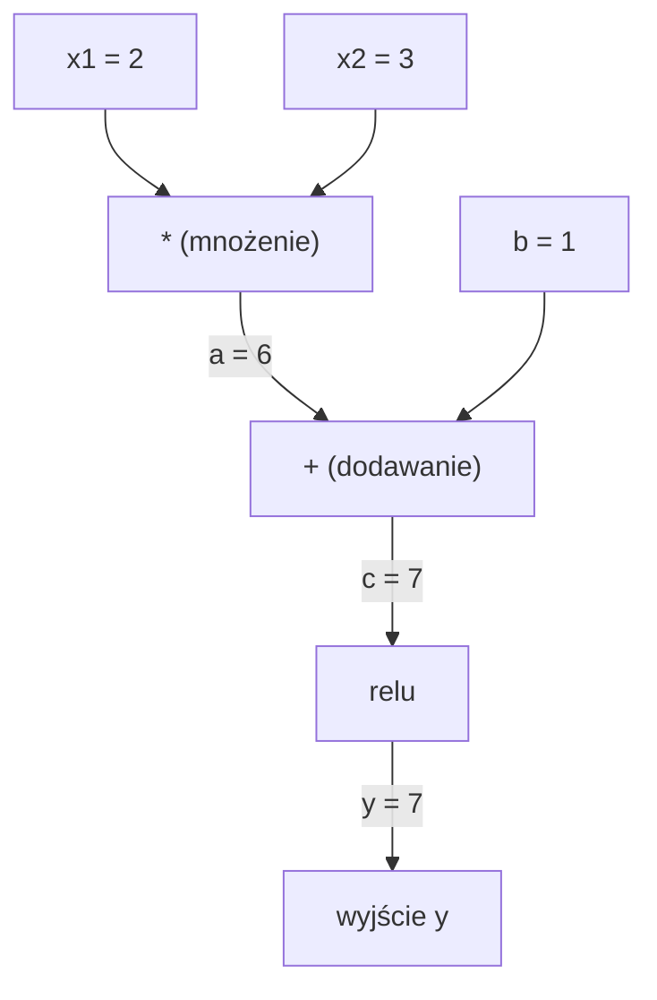
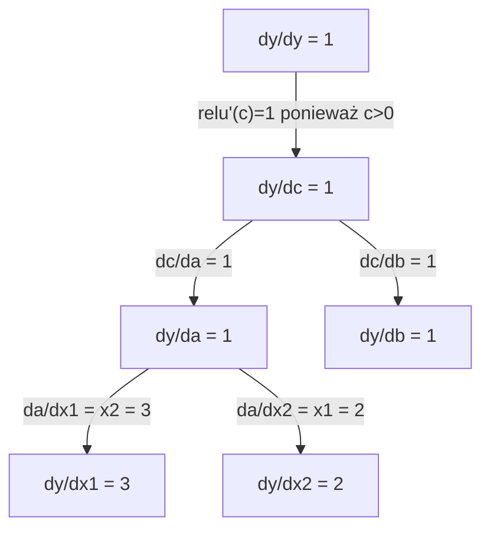

# Reguła łańcuchowa i automatyczne różniczkowanie

> Reguła łańcuchowa to silnik napędzający każdą sieć neuronową, która się uczy.

**Type:** Build
**Language:** Python
**Prerequisites:** Phase 1, Lesson 04 (Derivatives & Gradients)
**Time:** ~90 minut

## Learning Objectives

- Zbuduj minimalny silnik autograd (klasa Value), który rejestruje operacje i oblicza gradienty przez automatyczne różniczkowanie wsteczne
- Zaimplementuj przejścia w przód i wsteczne przez graf obliczeniowy używając sortowania topologicznego
- Skonstruuj i trenuj wielowarstwowy perceptron na XOR używając tylko własnoręcznie napisanego silnika autograd
- Zweryfikuj poprawność autodiff używając sprawdzania gradientów względem numerycznych różnic skończonych

## Problem

Umiesz obliczać pochodne prostych funkcji. Ale sieć neuronowa nie jest prostą funkcją. To setki funkcji złożonych razem: mnożenie macierzy, dodawanie biasu, aktywacja, mnożenie macierzy, softmax, strata cross-entropii. Wyjście jest funkcją funkcji funkcji.

Aby trenować sieć, potrzebujesz gradientu straty względem każdej pojedynczej wagi. Robienie tego ręcznie jest niemożliwe dla milionów parametrów. Robienie tego numerycznie (różnice skończone) jest zbyt wolne.

Reguła łańcuchowa daje ci matematykę. Automatyczne różniczkowanie daje ci algorytm. Razem pozwalają obliczać dokładne gradienty przez dowolne złożenia funkcji w czasie proporcjonalnym do pojedynczego przejścia w przód.

Tak działają PyTorch, TensorFlow i JAX. Zbudujesz miniaturową wersję od podstaw.

## Koncepcja

### Reguła łańcuchowa

Jeśli `y = f(g(x))`, to pochodna `y` względem `x` to:

```
dy/dx = dy/dg * dg/dx = f'(g(x)) * g'(x)
```

Pomnóż pochodne wzdłuż łańcucha. Każde ogniwo wnosi swoją lokalną pochodną.

Przykład: `y = sin(x^2)`

```
g(x) = x^2       g'(x) = 2x
f(g) = sin(g)     f'(g) = cos(g)

dy/dx = cos(x^2) * 2x
```

Dla głębszych złożeń łańcuch się wydłuża:

```
y = f(g(h(x)))

dy/dx = f'(g(h(x))) * g'(h(x)) * h'(x)
```

Każda warstwa w sieci neuronowej to jedno ogniwo w tym łańcuchu.

### Grafy obliczeniowe

Graf obliczeniowy uwidacznia regułę łańcuchową. Każda operacja staje się węzłem. Dane płyną w przód przez graf. Gradienty płyną wstecz.

**Przejście w przód (oblicz wartości):**



**Przejście wsteczne (oblicz gradienty):**



Przejście wsteczne stosuje regułę łańcuchową w każdym węźle, propagując gradienty od wyjścia do wejść.

### Tryb w przód vs tryb wsteczny

Są dwa sposoby stosowania reguły łańcuchowej przez graf.

**Tryb w przód** zaczyna od wejść i popycha pochodne do przodu. Oblicza `dx/dx = 1` i propaguje przez każdą operację. Dobry, gdy masz mało wejść i wiele wyjść.

```
Tryb w przód: seed dx/dx = 1, propaguj w przód

  x = 2       (dx/dx = 1)
  a = x^2     (da/dx = 2x = 4)
  y = sin(a)  (dy/dx = cos(a) * da/dx = cos(4) * 4 = -2.615)
```

**Tryb wsteczny** zaczyna od wyjścia i ściąga gradienty wstecz. Oblicza `dy/dy = 1` i propaguje przez każdą operację w odwrotnej kolejności. Dobry, gdy masz wiele wejść i mało wyjść.

```
Tryb wsteczny: seed dy/dy = 1, propaguj wstecz

  y = sin(a)  (dy/dy = 1)
  a = x^2     (dy/da = cos(a) = cos(4) = -0.654)
  x = 2       (dy/dx = dy/da * da/dx = -0.654 * 4 = -2.615)
```

Sieci neuronowe mają miliony wejść (wag) i jedno wyjście (stratę). Tryb wsteczny oblicza wszystkie gradienty w jednym przejściu wstecznym. Dlatego wsteczna propagacja używa trybu wstecznego.

| Tryb | Seed | Kierunek | Najlepszy gdy |
|------|------|-----------|-----------|
| W przód | `dx_i/dx_i = 1` | Wejście do wyjścia | Mało wejść, wiele wyjść |
| Wsteczny | `dy/dy = 1` | Wyjście do wejścia | Wiele wejść, mało wyjść (sieci neuronowe) |

### Liczby dualne dla trybu w przód

Tryb w przód można elegancko zaimplementować za pomocą liczb dualnych. Liczba dualna ma postać `a + b*epsilon`, gdzie `epsilon^2 = 0`.

```
Liczba dualna: (wartość, pochodna)

(2, 1) oznacza: wartość to 2, pochodna względem x to 1

Reguły arytmetyki:
  (a, a') + (b, b') = (a+b, a'+b')
  (a, a') * (b, b') = (a*b, a'*b + a*b')
  sin(a, a')         = (sin(a), cos(a)*a')
```

Zasiej zmienną wejściową z pochodną 1. Pochodna propaguje się automatycznie przez każdą operację.

### Budowanie silnika autograd

Silnik autograd potrzebuje trzech rzeczy:

1. **Otoczka wartości.** Owiń każdą liczbę w obiekt przechowujący jej wartość i gradient.
2. **Nagrywanie grafu.** Każda operacja rejestruje swoje wejścia i lokalną funkcję gradientu.
3. **Przejście wsteczne.** Sortowanie topologiczne grafu, a następnie przejście w odwrotnej kolejności, stosując regułę łańcuchową w każdym węźle.

To dokładnie to, co robi `autograd` PyTorcha. Klasa `torch.Tensor` otacza wartości, rejestruje operacje, gdy `requires_grad=True`, i oblicza gradienty, gdy wywołasz `.backward()`.

### Jak PyTorch Autograd działa pod maską

Gdy piszesz kod PyTorch:

```python
x = torch.tensor(2.0, requires_grad=True)
y = x ** 2 + 3 * x + 1
y.backward()
print(x.grad)  # 7.0 = 2*x + 3 = 2*2 + 3
```

PyTorch wewnętrznie:

1. Tworzy węzeł `Tensor` dla `x` z `requires_grad=True`
2. Każda operacja (`**`, `*`, `+`) tworzy nowy węzeł i rejestruje funkcję wsteczną
3. `y.backward()` uruchamia automatyczne różniczkowanie wsteczne przez nagrany graf
4. Każdy węzeł `grad_fn` oblicza lokalne gradienty i przekazuje je do węzłów nadrzędnych
5. Gradienty kumulują się w atrybutach `.grad` przez dodawanie (nie zastępowanie)

Graf jest dynamiczny (define-by-run). Nowy graf jest budowany przy każdym przejściu w przód. Dlatego PyTorch obsługuje przepływ sterowania (if/else, pętle) wewnątrz modeli.

```figure
chain-rule
```

## Build It

### Krok 1: Klasa Value

```python
class Value:
    def __init__(self, data, children=(), op=''):
        self.data = data
        self.grad = 0.0
        self._backward = lambda: None
        self._prev = set(children)
        self._op = op

    def __repr__(self):
        return f"Value(data={self.data:.4f}, grad={self.grad:.4f})"
```

Każdy `Value` przechowuje swoją wartość liczbową, gradient (początkowo zero), funkcję wsteczną i wskaźniki do węzłów potomnych, które go utworzyły.

### Krok 2: Operacje arytmetyczne ze śledzeniem gradientów

```python
    def __add__(self, other):
        other = other if isinstance(other, Value) else Value(other)
        out = Value(self.data + other.data, (self, other), '+')
        def _backward():
            self.grad += out.grad
            other.grad += out.grad
        out._backward = _backward
        return out

    def __mul__(self, other):
        other = other if isinstance(other, Value) else Value(other)
        out = Value(self.data * other.data, (self, other), '*')
        def _backward():
            self.grad += other.data * out.grad
            other.grad += self.data * out.grad
        out._backward = _backward
        return out

    def relu(self):
        out = Value(max(0, self.data), (self,), 'relu')
        def _backward():
            self.grad += (1.0 if out.data > 0 else 0.0) * out.grad
        out._backward = _backward
        return out
```

Każda operacja tworzy domknięcie, które wie, jak obliczyć lokalne gradienty i pomnożyć przez gradient nadrzędny (`out.grad`). `+=` obsługuje przypadek, gdy wartość jest używana w wielu operacjach.

### Krok 3: Przejście wsteczne

```python
    def backward(self):
        topo = []
        visited = set()
        def build_topo(v):
            if v not in visited:
                visited.add(v)
                for child in v._prev:
                    build_topo(child)
                topo.append(v)
        build_topo(self)

        self.grad = 1.0
        for v in reversed(topo):
            v._backward()
```

Sortowanie topologiczne zapewnia, że gradient każdego węzła jest w pełni obliczony, zanim zostanie propagowany do jego dzieci. Gradient początkowy to 1.0 (dy/dy = 1).

### Krok 4: Więcej operacji dla kompletnego silnika

Podstawowa klasa Value obsługuje dodawanie, mnożenie i relu. Prawdziwy silnik autograd potrzebuje więcej. Oto operacje potrzebne do budowania sieci neuronowych:

```python
    def __neg__(self):
        return self * -1

    def __sub__(self, other):
        return self + (-other)

    def __radd__(self, other):
        return self + other

    def __rmul__(self, other):
        return self * other

    def __rsub__(self, other):
        return other + (-self)

    def __pow__(self, n):
        out = Value(self.data ** n, (self,), f'**{n}')
        def _backward():
            self.grad += n * (self.data ** (n - 1)) * out.grad
        out._backward = _backward
        return out

    def __truediv__(self, other):
        return self * (other ** -1) if isinstance(other, Value) else self * (Value(other) ** -1)

    def exp(self):
        import math
        e = math.exp(self.data)
        out = Value(e, (self,), 'exp')
        def _backward():
            self.grad += e * out.grad
        out._backward = _backward
        return out

    def log(self):
        import math
        out = Value(math.log(self.data), (self,), 'log')
        def _backward():
            self.grad += (1.0 / self.data) * out.grad
        out._backward = _backward
        return out

    def tanh(self):
        import math
        t = math.tanh(self.data)
        out = Value(t, (self,), 'tanh')
        def _backward():
            self.grad += (1 - t ** 2) * out.grad
        out._backward = _backward
        return out
```

**Dlaczego każda operacja ma znaczenie:**

| Operacja | Reguła wsteczna | Używana w |
|-----------|--------------|---------|
| `__sub__` | Wykorzystuje add + neg | Obliczanie straty (pred - target) |
| `__pow__` | n * x^(n-1) | Aktywacje wielomianowe, MSE (błąd^2) |
| `__truediv__` | Wykorzystuje mul + pow(-1) | Normalizacja, skalowanie współczynnika uczenia |
| `exp` | exp(x) * nadrzędny | Softmax, log-wiarygodność |
| `log` | (1/x) * nadrzędny | Strata cross-entropii, log-prawdopodobieństwa |
| `tanh` | (1 - tanh^2) * nadrzędny | Klasyczna funkcja aktywacji |

Sprytna część: `__sub__` i `__truediv__` są zdefiniowane w kategoriach istniejących operacji. Dostają poprawne gradienty za darmo, ponieważ reguła łańcuchowa składa się przez podstawowe operacje add/mul/pow.

### Krok 5: Mini MLP od podstaw

Z kompletną klasą Value możesz zbudować sieć neuronową. Bez PyTorcha. Bez NumPy. Tylko Value i reguła łańcuchowa.

```python
import random

class Neuron:
    def __init__(self, n_inputs):
        self.w = [Value(random.uniform(-1, 1)) for _ in range(n_inputs)]
        self.b = Value(0.0)

    def __call__(self, x):
        act = sum((wi * xi for wi, xi in zip(self.w, x)), self.b)
        return act.tanh()

    def parameters(self):
        return self.w + [self.b]

class Layer:
    def __init__(self, n_inputs, n_outputs):
        self.neurons = [Neuron(n_inputs) for _ in range(n_outputs)]

    def __call__(self, x):
        return [n(x) for n in self.neurons]

    def parameters(self):
        return [p for n in self.neurons for p in n.parameters()]

class MLP:
    def __init__(self, sizes):
        self.layers = [Layer(sizes[i], sizes[i+1]) for i in range(len(sizes)-1)]

    def __call__(self, x):
        for layer in self.layers:
            x = layer(x)
        return x[0] if len(x) == 1 else x

    def parameters(self):
        return [p for layer in self.layers for p in layer.parameters()]
```

`Neuron` oblicza `tanh(w1*x1 + w2*x2 + ... + b)`. `Layer` to lista neuronów. `MLP` układa warstwy. Każda waga to `Value`, więc wywołanie `loss.backward()` propaguje gradienty do każdego parametru.

**Trenowanie na XOR:**

```python
random.seed(42)
model = MLP([2, 4, 1])  # 2 wejścia, 4 neurony ukryte, 1 wyjście

xs = [[0, 0], [0, 1], [1, 0], [1, 1]]
ys = [-1, 1, 1, -1]  # Wzorzec XOR (używając -1/1 dla tanh)

for step in range(100):
    preds = [model(x) for x in xs]
    loss = sum((p - y) ** 2 for p, y in zip(preds, ys))

    for p in model.parameters():
        p.grad = 0.0
    loss.backward()

    lr = 0.05
    for p in model.parameters():
        p.data -= lr * p.grad

    if step % 20 == 0:
        print(f"krok {step:3d}  strata = {loss.data:.4f}")

print("\nPredykcje po trenowaniu:")
for x, y in zip(xs, ys):
    print(f"  wejście={x}  cel={y:2d}  pred={model(x).data:6.3f}")
```

To jest micrograd. Kompletna pętla trenowania sieci neuronowej w czystym Pythonie z automatycznym różniczkowaniem. Każdy komercyjny framework głębokiego uczenia robi to samo na masową skalę.

### Krok 6: Sprawdzanie gradientów

Skąd wiesz, że twój autodiff jest poprawny? Porównaj go z numerycznymi pochodnymi. To jest sprawdzanie gradientów.

```python
def gradient_check(build_expr, x_val, h=1e-7):
    x = Value(x_val)
    y = build_expr(x)
    y.backward()
    autodiff_grad = x.grad

    y_plus = build_expr(Value(x_val + h)).data
    y_minus = build_expr(Value(x_val - h)).data
    numerical_grad = (y_plus - y_minus) / (2 * h)

    diff = abs(autodiff_grad - numerical_grad)
    return autodiff_grad, numerical_grad, diff
```

Przetestuj na złożonym wyrażeniu:

```python
def expr(x):
    return (x ** 3 + x * 2 + 1).tanh()

ad, num, diff = gradient_check(expr, 0.5)
print(f"Autodiff:  {ad:.8f}")
print(f"Numeryczny: {num:.8f}")
print(f"Różnica: {diff:.2e}")
# Różnica powinna być < 1e-5
```

Sprawdzanie gradientów jest niezbędne przy implementacji nowych operacji. Jeśli twoje przejście wsteczne ma błąd, kontrola numeryczna go wyłapie. Każda poważna implementacja głębokiego uczenia uruchamia kontrole gradientów podczas rozwoju.

**Kiedy używać sprawdzania gradientów:**

| Sytuacja | Robić sprawdzanie gradientów? |
|-----------|-------------------|
| Dodawanie nowej operacji do autograda | Tak, zawsze |
| Debugowanie pętli treningowej, która nie zbiega się | Tak, najpierw sprawdź gradienty |
| Produkcyjne trenowanie | Nie, za wolno (2x przejścia w przód na parametr) |
| Testy jednostkowe kodu autograd | Tak, zautomatyzuj to |

### Krok 7: Weryfikacja względem ręcznego obliczenia

```python
x1 = Value(2.0)
x2 = Value(3.0)
a = x1 * x2          # a = 6.0
b = a + Value(1.0)    # b = 7.0
y = b.relu()          # y = 7.0

y.backward()

print(f"y = {y.data}")          # 7.0
print(f"dy/dx1 = {x1.grad}")   # 3.0 (= x2)
print(f"dy/dx2 = {x2.grad}")   # 2.0 (= x1)
```

Ręczne sprawdzenie: `y = relu(x1*x2 + 1)`. Ponieważ `x1*x2 + 1 = 7 > 0`, relu jest tożsamością. `dy/dx1 = x2 = 3`. `dy/dx2 = x1 = 2`. Silnik się zgadza.

## Use It

### Weryfikacja względem PyTorcha

```python
import torch

x1 = torch.tensor(2.0, requires_grad=True)
x2 = torch.tensor(3.0, requires_grad=True)
a = x1 * x2
b = a + 1.0
y = torch.relu(b)
y.backward()

print(f"PyTorch dy/dx1 = {x1.grad.item()}")  # 3.0
print(f"PyTorch dy/dx2 = {x2.grad.item()}")  # 2.0
```

Te same gradienty. Twój silnik oblicza ten sam wynik co PyTorch, ponieważ matematyka jest ta sama: automatyczne różniczkowanie wsteczne przez regułę łańcuchową.

### Bardziej złożone wyrażenie

```python
a = Value(2.0)
b = Value(-3.0)
c = Value(10.0)
f = (a * b + c).relu()  # relu(2*(-3) + 10) = relu(4) = 4

f.backward()
print(f"df/da = {a.grad}")  # -3.0 (= b)
print(f"df/db = {b.grad}")  #  2.0 (= a)
print(f"df/dc = {c.grad}")  #  1.0
```

## Ship It

Ta lekcja produkuje:
- `outputs/skill-autodiff.md` -- umiejętność budowania i debugowania systemów autograd
- `code/autodiff.py` -- minimalny silnik autograd, który możesz rozszerzać

Klasa Value zbudowana tutaj jest fundamentem pętli treningowej sieci neuronowej w Phase 3.

## Ćwiczenia

1. Dodaj `__pow__` do klasy Value, abyś mógł obliczać `x ** n`. Zweryfikuj, że `d/dx(x^3)` w `x=2` wynosi `12.0`.

2. Dodaj `tanh` jako funkcję aktywacji. Zweryfikuj, że `tanh'(0) = 1` i `tanh'(2) = 0.0707` (w przybliżeniu).

3. Zbuduj graf obliczeniowy dla pojedynczego neuronu: `y = relu(w1*x1 + w2*x2 + b)`. Oblicz wszystkie pięć gradientów i zweryfikuj względem PyTorcha.

4. Zaimplementuj automatyczne różniczkowanie w przód używając liczb dualnych. Stwórz klasę `Dual` i zweryfikuj, że daje te same pochodne co twój silnik wsteczny.

## Key Terms

| Termin | Co ludzie mówią | Co naprawdę znaczy |
|------|----------------|----------------------|
| Reguła łańcuchowa | "Pomnóż pochodne" | Pochodna funkcji złożonej równa się iloczynowi pochodnych lokalnych każdej funkcji, obliczonych w odpowiednim punkcie |
| Graf obliczeniowy | "Diagram sieci" | Skierowany graf acykliczny, gdzie węzły to operacje, a krawędzie niosą wartości (w przód) lub gradienty (wstecz) |
| Tryb w przód | "Pchaj pochodne do przodu" | Autodiff propagujący pochodne od wejść do wyjść. Jedno przejście na zmienną wejściową. |
| Tryb wsteczny | "Wsteczna propagacja" | Autodiff propagujący gradienty od wyjść do wejść. Jedno przejście na zmienną wyjściową. |
| Autograd | "Automatyczne gradienty" | System rejestrujący operacje na wartościach, budujący graf i obliczający dokładne gradienty przez regułę łańcuchową |
| Liczby dualne | "Wartość plus pochodna" | Liczby postaci a + b*epsilon (epsilon^2 = 0) niosące informację o pochodnej przez arytmetykę |
| Sortowanie topologiczne | "Kolejność zależności" | Porządkowanie węzłów grafu tak, by każdy węzeł występował po wszystkich swoich zależnościach. Wymagane do poprawnej propagacji gradientów. |
| Akumulacja gradientów | "Dodawaj, nie zastępuj" | Gdy wartość jest używana w wielu operacjach, jej gradient jest sumą wszystkich przychodzących wkładów gradientowych |
| Graf dynamiczny | "Definiuj przez wykonanie" | Graf obliczeniowy odbudowywany przy każdym przejściu w przód, umożliwiający przepływ sterowania w Pythonie wewnątrz modeli (styl PyTorch) |
| Sprawdzanie gradientów | "Weryfikacja numeryczna" | Porównanie gradientów z autodiff z numerycznymi gradientami z różnic skończonych w celu weryfikacji poprawności. Niezbędne do debugowania. |
| MLP | "Wielowarstwowy perceptron" | Sieć neuronowa z jedną lub więcej warstwami ukrytymi neuronów. Każdy neuron oblicza ważoną sumę plus bias, a następnie stosuje funkcję aktywacji. |
| Neuron | "Ważona suma + aktywacja" | Podstawowa jednostka: wyjście = aktywacja(w1*x1 + w2*x2 + ... + b). Wagi i bias to parametry uczone. |
