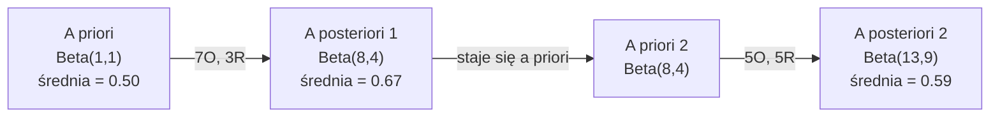

# Twierdzenie Bayesa

> Prawdopodobieństwo dotyczy tego, czego oczekujesz. Twierdzenie Bayesa dotyczy tego, czego się uczysz.

**Type:** Build
**Language:** Python
**Prerequisites:** Phase 1, Lesson 06 (Probability Fundamentals)
**Time:** ~75 minut

## Learning Objectives

- Zastosuj twierdzenie Bayesa do obliczania prawdopodobieństw a posteriori z prawdopodobieństw a priori, wiarygodności i dowodu
- Zbuduj klasyfikator tekstu Naive Bayes od podstaw z wygładzaniem Laplace'a i obliczeniami w przestrzeni logarytmicznej
- Porównaj estymację MLE i MAP oraz wyjaśnij, jak MAP odpowiada regularyzacji L2
- Zaimplementuj sekwencyjną aktualizację bayesowską używając sprzężonych rozkładów a priori Beta-Binomial dla testów A/B

## Problem

Test medyczny jest w 99% dokładny. Twój wynik jest pozytywny. Jakie jest prawdopodobieństwo, że rzeczywiście masz chorobę?

Większość ludzi mówi 99%. Prawdziwa odpowiedź zależy od tego, jak rzadka jest choroba. Jeśli 1 na 10 000 ludzi ją ma, pozytywny wynik daje tylko około 1% szansy na bycie chorym. Pozostałe 99% pozytywnych wyników to fałszywe alarmy od zdrowych ludzi.

To nie jest pytanie z pułapką. To twierdzenie Bayesa. Każdy filtr spamu, każda diagnostyka medyczna, każdy model uczenia maszynowego, który określa niepewność, używa dokładnie tego rozumowania. Zaczynasz od przekonania. Widzisz dowód. Aktualizujesz.

Jeśli budujesz systemy ML bez zrozumienia tego, będziesz błędnie interpretować wyjścia modeli, ustawiać złe progi i dostarczać nadmiernie pewne predykcje.

## Koncepcja

### Od prawdopodobieństwa łącznego do Bayesa

Wiesz już z Lekcji 06, że prawdopodobieństwo warunkowe to:

```
P(A|B) = P(A i B) / P(B)
```

I symetrycznie:

```
P(B|A) = P(A i B) / P(A)
```

Oba wyrażenia mają ten sam licznik: P(A i B). Przyrównaj je i przekształć:

```
P(A i B) = P(A|B) * P(B) = P(B|A) * P(A)

Zatem:

P(A|B) = P(B|A) * P(A) / P(B)
```

To jest twierdzenie Bayesa. Cztery wielkości, jedno równanie.

### Cztery części

| Część | Nazwa | Co oznacza |
|------|------|---------------|
| P(A\|B) | A posteriori | Twoje zaktualizowane przekonanie o A po zobaczeniu dowodu B |
| P(B\|A) | Wiarygodność | Jak prawdopodobny jest dowód B, jeśli A jest prawdziwe |
| P(A) | A priori | Twoje przekonanie o A przed zobaczeniem jakiegokolwiek dowodu |
| P(B) | Dowód | Całkowite prawdopodobieństwo zobaczenia B we wszystkich możliwościach |

Człon dowodu P(B) działa jako normalizator. Możesz go rozwinąć używając prawa całkowitego prawdopodobieństwa:

```
P(B) = P(B|A) * P(A) + P(B|nie A) * P(nie A)
```

### Przykład testu medycznego

Choroba dotyka 1 na 10 000 ludzi. Test jest w 99% dokładny (wykrywa 99% chorych, daje fałszywie pozytywne wyniki u 1% zdrowych).

```
P(chory)          = 0.0001     (a priori: choroba jest rzadka)
P(pozytywny|chory) = 0.99       (wiarygodność: test wykrywa)
P(pozytywny|zdrowy) = 0.01    (wskaźnik fałszywie pozytywnych)

P(pozytywny) = P(pozytywny|chory) * P(chory) + P(pozytywny|zdrowy) * P(zdrowy)
             = 0.99 * 0.0001 + 0.01 * 0.9999
             = 0.000099 + 0.009999
             = 0.010098

P(chory|pozytywny) = P(pozytywny|chory) * P(chory) / P(pozytywny)
                  = 0.99 * 0.0001 / 0.010098
                  = 0.0098
                  = 0.98%
```

Mniej niż 1%. Prawdopodobieństwo a priori dominuje. Gdy stan jest rzadki, nawet dokładne testy dają głównie fałszywie pozytywne wyniki. Dlatego lekarze zlecają testy potwierdzające.

### Przykład filtra spamu

Otrzymujesz e-mail zawierający słowo "loteria". Czy to spam?

```
P(spam)                = 0.3      (30% e-maili to spam)
P("loteria"|spam)      = 0.05     (5% spamów zawiera "loteria")
P("loteria"|nie spam)  = 0.001    (0.1% legalnych e-maili zawiera "loteria")

P("loteria") = 0.05 * 0.3 + 0.001 * 0.7
             = 0.015 + 0.0007
             = 0.0157

P(spam|"loteria") = 0.05 * 0.3 / 0.0157
                  = 0.955
                  = 95.5%
```

Jedno słowo przesuwa prawdopodobieństwo z 30% na 95.5%. Prawdziwy filtr spamu stosuje Bayesa dla setek słów jednocześnie.

### Naive Bayes: założenie niezależności

Naive Bayes rozszerza to na wiele cech, zakładając, że wszystkie cechy są warunkowo niezależne dając klasę:

```
P(klasa | cecha_1, cecha_2, ..., cecha_n)
  = P(klasa) * P(cecha_1|klasa) * P(cecha_2|klasa) * ... * P(cecha_n|klasa)
    / P(cecha_1, cecha_2, ..., cecha_n)
```

"Naiwna" część to założenie niezależności. W tekście wystąpienia słów nie są niezależne ("Nowy" i "Jork" są skorelowane). Ale założenie działa zaskakująco dobrze w praktyce, ponieważ klasyfikator potrzebuje tylko rankingować klasy, nie produkować skalibrowanych prawdopodobieństw.

Ponieważ mianownik jest taki sam dla wszystkich klas, możesz go pominąć i tylko porównywać liczniki:

```
score(klasa) = P(klasa) * iloczyn P(cecha_i | klasa)
```

Wybierz klasę z najwyższym wynikiem.

### Estymacja największej wiarygodności (MLE)

Skąd bierzesz P(cecha|klasa) z danych treningowych? Liczysz.

```
P("darmowy"|spam) = (liczba spamów zawierających "darmowy") / (całkowita liczba spamów)
```

To jest MLE: wybierz wartości parametrów, które czynią obserwowane dane najbardziej prawdopodobnymi. Maksymalizujesz funkcję wiarygodności, która dla dyskretnych liczebności sprowadza się do względnej częstości.

Problem: jeśli słowo nigdy nie pojawiło się w spamie podczas trenowania, MLE daje mu zerowe prawdopodobieństwo. Jedno niewidziane słowo zabija cały iloczyn. Rozwiązaniem jest wygładzanie Laplace'a:

```
P(słowo|klasa) = (liczba(słowo, klasa) + 1) / (całkowita_liczba_słów_w_klasie + rozmiar_słownika)
```

Dodanie 1 do każdej liczebności zapewnia, że żadne prawdopodobieństwo nigdy nie jest zerowe.

### Maksimum a posteriori (MAP)

MLE pyta: jakie parametry maksymalizują P(dane|parametry)?

MAP pyta: jakie parametry maksymalizują P(parametry|dane)?

Z twierdzenia Bayesa:

```
P(parametry|dane) proporcjonalne do P(dane|parametry) * P(parametry)
```

MAP dodaje rozkład a priori na same parametry. Jeśli uważasz, że parametry powinny być małe, kodujesz to jako rozkład a priori, który karze duże wartości. To jest identyczne z regularyzacją L2 w ML. Kara "ridge" w regresji grzbietowej to dosłownie rozkład a priori Gaussa na wagach.

| Estymacja | Optymalizuje | Odpowiednik w ML |
|------------|-----------|---------------|
| MLE | P(dane\|param) | Trenowanie bez regularyzacji |
| MAP | P(dane\|param) * P(param) | Regularyzacja L2 / L1 |

### Bayesowski vs częstościowy: praktyczna różnica

Częstościowcy traktują parametry jako stałe niewiadome. Pytają: "Gdybym powtórzył ten eksperyment wiele razy, co by się stało?"

Bayesiści traktują parametry jako rozkłady. Pytają: "Biorąc pod uwagę to, co zaobserwowałem, co sądzę o parametrach?"

Dla budowania systemów ML, praktyczna różnica:

| Aspekt | Częstościowy | Bayesowski |
|--------|-------------|----------|
| Wyjście | Estymacja punktowa | Rozkład wartości |
| Niepewność | Przedziały ufności (o procedurze) | Przedziały wiarygodności (o parametrze) |
| Małe dane | Może przeuczyć | A priori działa jako regularyzacja |
| Obliczenia | Zwykle szybsze | Często wymaga próbkowania (MCMC) |

Większość produkcyjnego ML jest częstościowa (SGD, estymacje punktowe). Metody bayesowskie błyszczą, gdy potrzebujesz skalibrowanej niepewności (decyzje medyczne, systemy bezpieczeństwa krytycznego) lub gdy danych jest mało (uczenie się z kilku przykładów, zimny start).

### Dlaczego myślenie bayesowskie ma znaczenie dla ML

Związek jest głębszy niż analogia:

**A priori to regularyzacja.** Gaussowski rozkład a priori na wagach to regularyzacja L2. Laplace'owski rozkład a priori to L1. Za każdym razem, gdy dodajesz człon regularyzacji, robisz bayesowskie stwierdzenie o tym, jakich wartości parametrów się spodziewasz.

**A posteriori to niepewność.** Pojedyncze przewidywane prawdopodobieństwo nic nie mówi o tym, jak pewny model jest tego oszacowania. Metody bayesowskie dają rozkład: "Myślę, że P(spam) jest między 0.8 a 0.95."

**Aktualizacje bayesowskie to uczenie online.** Dzisiejsze a posteriori staje się jutrzejszym a priori. Gdy twój model widzi nowe dane, aktualizuje swoje przekonania przyrostowo zamiast trenować od nowa.

**Porównywanie modeli jest bayesowskie.** Bayesowskie kryterium informacyjne (BIC), wiarygodność brzegowa i czynniki Bayesa wszystkie używają bayesowskiego rozumowania do wyboru między modelami bez przeuczania.

```figure
bayes-update
```

## Build It

### Krok 1: Funkcja twierdzenia Bayesa

```python
def bayes(prior, likelihood, false_positive_rate):
    evidence = likelihood * prior + false_positive_rate * (1 - prior)
    posterior = likelihood * prior / evidence
    return posterior

result = bayes(prior=0.0001, likelihood=0.99, false_positive_rate=0.01)
print(f"P(chory|pozytywny) = {result:.4f}")
```

### Krok 2: Klasyfikator Naive Bayes

```python
import math
from collections import defaultdict

class NaiveBayes:
    def __init__(self, smoothing=1.0):
        self.smoothing = smoothing
        self.class_counts = defaultdict(int)
        self.word_counts = defaultdict(lambda: defaultdict(int))
        self.class_word_totals = defaultdict(int)
        self.vocab = set()

    def train(self, documents, labels):
        for doc, label in zip(documents, labels):
            self.class_counts[label] += 1
            words = doc.lower().split()
            for word in words:
                self.word_counts[label][word] += 1
                self.class_word_totals[label] += 1
                self.vocab.add(word)

    def predict(self, document):
        words = document.lower().split()
        total_docs = sum(self.class_counts.values())
        vocab_size = len(self.vocab)
        best_class = None
        best_score = float("-inf")
        for cls in self.class_counts:
            score = math.log(self.class_counts[cls] / total_docs)
            for word in words:
                count = self.word_counts[cls].get(word, 0)
                total = self.class_word_totals[cls]
                score += math.log((count + self.smoothing) / (total + self.smoothing * vocab_size))
            if score > best_score:
                best_score = score
                best_class = cls
        return best_class
```

Log-prawdopodobieństwa zapobiegają niedomiarewi. Mnożenie wielu małych prawdopodobieństw produkuje liczby zbyt małe dla zmiennoprzecinkowych. Sumowanie log-prawdopodobieństw jest numerycznie stabilne i matematycznie równoważne.

### Krok 3: Trenuj na danych spamowych

```python
train_docs = [
    "win free money now",
    "free lottery ticket winner",
    "claim your prize today free",
    "urgent offer free cash",
    "congratulations you won free",
    "meeting tomorrow at noon",
    "project update attached",
    "can we schedule a call",
    "quarterly report review",
    "lunch on thursday sounds good",
    "team standup notes attached",
    "please review the pull request",
]

train_labels = [
    "spam", "spam", "spam", "spam", "spam",
    "ham", "ham", "ham", "ham", "ham", "ham", "ham",
]

classifier = NaiveBayes()
classifier.train(train_docs, train_labels)

test_messages = [
    "free money waiting for you",
    "meeting rescheduled to friday",
    "you won a free prize",
    "please review the attached report",
]

for msg in test_messages:
    print(f"  '{msg}' -> {classifier.predict(msg)}")
```

### Krok 4: Sprawdź nauczone prawdopodobieństwa

```python
def show_top_words(classifier, cls, n=5):
    vocab_size = len(classifier.vocab)
    total = classifier.class_word_totals[cls]
    probs = {}
    for word in classifier.vocab:
        count = classifier.word_counts[cls].get(word, 0)
        probs[word] = (count + classifier.smoothing) / (total + classifier.smoothing * vocab_size)
    sorted_words = sorted(probs.items(), key=lambda x: x[1], reverse=True)
    for word, prob in sorted_words[:n]:
        print(f"    {word}: {prob:.4f}")

print("\nTop słowa spam:")
show_top_words(classifier, "spam")
print("\nTop słowa ham:")
show_top_words(classifier, "ham")
```

## Use It

Scikit-learn dostarcza produkcyjne implementacje Naive Bayes:

```python
from sklearn.feature_extraction.text import CountVectorizer
from sklearn.naive_bayes import MultinomialNB
from sklearn.metrics import classification_report

vectorizer = CountVectorizer()
X_train = vectorizer.fit_transform(train_docs)
clf = MultinomialNB()
clf.fit(X_train, train_labels)

X_test = vectorizer.transform(test_messages)
predictions = clf.predict(X_test)
for msg, pred in zip(test_messages, predictions):
    print(f"  '{msg}' -> {pred}")
```

Ten sam algorytm. CountVectorizer obsługuje tokenizację i budowę słownika. MultinomialNB obsługuje wygładzanie i log-prawdopodobieństwa wewnętrznie. Twoja wersja od podstaw robi to samo w 40 liniach.

## Ship It

Klasa NaiveBayes zbudowana tutaj demonstruje pełny potok: tokenizacja, estymacja prawdopodobieństwa z wygładzaniem Laplace'a, predykcja w przestrzeni logarytmicznej. Kod w `code/bayes.py` działa od początku do końca bez zależności poza standardową biblioteką Pythona.

### Rozkłady sprzężone

Gdy rozkład a priori i a posteriori należą do tej samej rodziny rozkładów, rozkład a priori nazywa się "sprzężonym". To sprawia, że aktualizacja bayesowska jest algebraicznie czysta -- dostajesz rozkład a posteriori w postaci zamkniętej bez całkowania numerycznego.

| Wiarygodność | A priori sprzężone | A posteriori | Przykład |
|-----------|----------------|-----------|---------|
| Bernoulli | Beta(a, b) | Beta(a + sukcesy, b + porażki) | Estymacja błędu monety |
| Normalny (znana wariancja) | Normalny(mu_0, sigma_0) | Normalny(średnia ważona, mniejsza wariancja) | Kalibracja czujnika |
| Poisson | Gamma(a, b) | Gamma(a + suma liczebności, b + n) | Modelowanie częstości |
| Wielomianowy | Dirichlet(alpha) | Dirichlet(alpha + liczebności) | Modelowanie tematów, modele językowe |

Dlaczego to ma znaczenie: bez sprzężonych rozkładów a priori potrzebujesz próbkowania Monte Carlo lub wnioskowania wariacyjnego do przybliżenia a posteriori. Ze sprzężonymi rozkładami a priori po prostu aktualizujesz dwie liczby.

Rozkład Beta jest najczęstszym sprzężonym rozkładem a priori w praktyce. Beta(a, b) reprezentuje twoje przekonanie o parametrze prawdopodobieństwa. Średnia to a/(a+b). Im większe a+b, tym bardziej skoncentrowany (pewny) rozkład.

Szczególne przypadki rozkładu a priori Beta:
- Beta(1, 1) = jednostajny. Nie masz opinii o parametrze.
- Beta(10, 10) = szczytowy w 0.5. Silnie uważasz, że parametr jest blisko 0.5.
- Beta(1, 10) = przekrzywiony w kierunku 0. Uważasz, że parametr jest mały.

Reguła aktualizacji jest banalnie prosta:

```
A priori:     Beta(a, b)
Dane:      s sukcesów, f porażek
A posteriori: Beta(a + s, b + f)
```

Żadnych całek. Żadnego próbkowania. Tylko dodawanie.

### Sekwencyjna aktualizacja bayesowska

Wnioskowanie bayesowskie jest naturalnie sekwencyjne. Dzisiejsze a posteriori staje się jutrzejszym a priori. Tak działają prawdziwe systemy, które uczą się przyrostowo bez przetwarzania wszystkich historycznych danych.

Konkretny przykład: estymowanie, czy moneta jest uczciwa.

**Dzień 1: Brak danych.**
Zacznij z Beta(1, 1) -- jednostajny rozkład a priori. Nie masz opinii.
- Średnia a priori: 0.5
- Rozkład a priori jest płaski na [0, 1]

**Dzień 2: Zaobserwuj 7 orłów, 3 reszki.**
A posteriori = Beta(1 + 7, 1 + 3) = Beta(8, 4)
- Średnia a posteriori: 8/12 = 0.667
- Dowód sugeruje, że moneta jest przekrzywiona na korzyść orła

**Dzień 3: Zaobserwuj 5 orłów, 5 reszek.**
Użyj wczorajszego a posteriori jako dzisiejszego a priori.
A posteriori = Beta(8 + 5, 4 + 5) = Beta(13, 9)
- Średnia a posteriori: 13/22 = 0.591
- Zrównoważone nowe dane ściągnęły estymację z powrotem w kierunku 0.5



Kolejność obserwacji nie ma znaczenia. Beta(1,1) zaktualizowana wszystkimi 12 orłami i 8 reszkami naraz daje Beta(13, 9) -- ten sam wynik. Aktualizacja sekwencyjna i wsadowa są matematycznie równoważne. Ale aktualizacja sekwencyjna pozwala podejmować decyzje na każdym kroku bez przechowywania surowych danych.

To jest podstawa uczenia online w produkcyjnych systemach ML. Próbkowanie Thompsona dla algorytmów typu bandyta, przyrostowe systemy rekomendacji i streamingowe detektory anomalii używają tego wzorca.

### Związek z testami A/B

Testy A/B to wnioskowanie bayesowskie w przebraniu.

Konfiguracja: testujesz dwa kolory przycisków. Wariant A (niebieski) i wariant B (zielony). Chcesz wiedzieć, który dostaje więcej kliknięć.

Bayesowski test A/B:

1. **A priori.** Zacznij z Beta(1, 1) dla obu wariantów. Brak preferencji z góry.
2. **Dane.** Wariant A: 50 kliknięć z 1000 wyświetleń. Wariant B: 65 kliknięć z 1000 wyświetleń.
3. **A posteriori.**
   - A: Beta(1 + 50, 1 + 950) = Beta(51, 951). Średnia = 0.051
   - B: Beta(1 + 65, 1 + 935) = Beta(66, 936). Średnia = 0.066
4. **Decyzja.** Oblicz P(B > A) -- prawdopodobieństwo, że prawdziwy współczynnik konwersji B jest wyższy niż A.

Obliczenie P(B > A) analitycznie jest trudne. Ale Monte Carlo czyni to trywialnym:

```
1. Losuj 100 000 próbek z Beta(51, 951)  -> próbki_A
2. Losuj 100 000 próbek z Beta(66, 936)  -> próbki_B
3. P(B > A) = ułamek próbek, gdzie B > A
```

Jeśli P(B > A) > 0.95, wdrażasz wariant B. Jeśli jest między 0.05 a 0.95, zbierasz więcej danych. Jeśli P(B > A) < 0.05, wdrażasz wariant A.

Zalety nad częstościowym testem A/B:
- Dostajesz bezpośrednie stwierdzenie probabilistyczne: "jest 97% szans, że B jest lepsze"
- Żadnego zamieszania z p-wartościami. Żadnego "nie ma podstaw do odrzucenia hipotezy zerowej".
- Możesz sprawdzać wyniki w dowolnym momencie bez inflacji wskaźnika fałszywie pozytywnych (brak "problemu podglądania")
- Możesz uwzględnić wiedzę z góry (np. poprzednie testy sugerują, że współczynniki konwersji są zwykle 3-8%)

| Aspekt | Częstościowe A/B | Bayesowskie A/B |
|--------|----------------|--------------|
| Wynik | p-wartość | P(B > A) |
| Interpretacja | "Jak zaskakujące są te dane, jeśli A=B?" | "Jak prawdopodobne jest, że B jest lepsze od A?" |
| Wczesne zatrzymanie | Influje fałszywie pozytywne | Bezpieczne w dowolnym momencie (przy dobrze dobranym a priori i poprawnie określonym modelu) |
| Wiedza z góry | Nieużywana | Zakodowana jako Beta a priori |
| Reguła decyzyjna | p < 0.05 | P(B > A) > próg |

## Ćwiczenia

1. **Wielokrotne testy.** Pacjent testuje się pozytywnie dwukrotnie na niezależnych testach (oba w 99% dokładne, rozpowszechnienie choroby 1 na 10 000). Jakie jest P(chory) po obu testach? Użyj a posteriori z pierwszego testu jako a priori dla drugiego.

2. **Wpływ wygładzania.** Uruchom klasyfikator spamu z wartościami wygładzania 0.01, 0.1, 1.0 i 10.0. Jak zmieniają się prawdopodobieństwa najważniejszych słów? Co się dzieje z wygładzaniem=0 i słowem, które pojawia się tylko w ham?

3. **Dodaj cechy.** Rozszerz klasę NaiveBayes, aby używać również długości wiadomości (krótka/długa) jako cechy obok liczebności słów. Oszacuj P(krótka|spam) i P(krótka|ham) z danych treningowych i włącz to do wyniku predykcji.

4. **MAP ręcznie.** Dla zaobserwowanych danych (7 orłów w 10 rzutach monetą), oblicz estymację MAP błędu używając rozkładu a priori Beta(2,2). Porównaj z estymacją MLE (7/10).

## Key Terms

| Termin | Co ludzie mówią | Co naprawdę znaczy |
|------|----------------|----------------------|
| A priori | "Mój początkowy domysł" | P(hipoteza) przed zaobserwowaniem dowodu. W ML: człon regularyzacyjny. |
| Wiarygodność | "Jak dobrze dane pasują" | P(dowód\|hipoteza). Jak prawdopodobne są zaobserwowane dane przy danej hipotezie. |
| A posteriori | "Moje zaktualizowane przekonanie" | P(hipoteza\|dowód). A priori pomnożone przez wiarygodność, potem znormalizowane. |
| Dowód | "Stała normalizująca" | P(dane) dla wszystkich hipotez. Zapewnia, że a posteriori sumuje się do 1. |
| Naive Bayes | "Ten prosty klasyfikator tekstu" | Klasyfikator zakładający, że cechy są niezależne przy danej klasie. Działa dobrze mimo fałszywego założenia. |
| Wygładzanie Laplace'a | "Wygładzanie przez dodanie 1" | Dodanie małej liczebności do każdej cechy, by zapobiec zerowym prawdopodobieństwom z niewidzianych danych. |
| MLE | "Po prostu użyj częstości" | Wybierz parametry maksymalizujące P(dane\|parametry). Bez a priori. Może przeuczyć na małych danych. |
| MAP | "MLE z a priori" | Wybierz parametry maksymalizujące P(dane\|parametry) * P(parametry). Równoważne regularyzowanemu MLE. |
| Log-prawdopodobieństwo | "Pracuj w przestrzeni log" | Użycie log(P) zamiast P, by uniknąć niedomiaru zmiennoprzecinkowego przy mnożeniu wielu małych liczb. |
| Fałszywie pozytywny | "Fałszywy alarm" | Test mówi pozytywny, ale prawdziwy stan jest negatywny. Napędza błąd częstości podstawowej. |