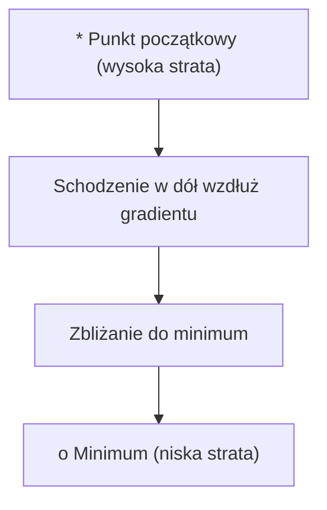
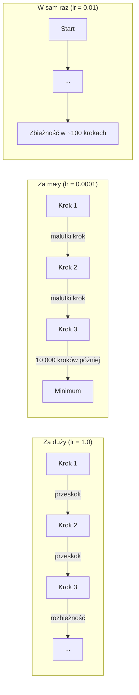
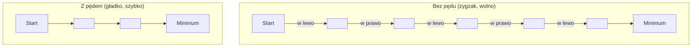
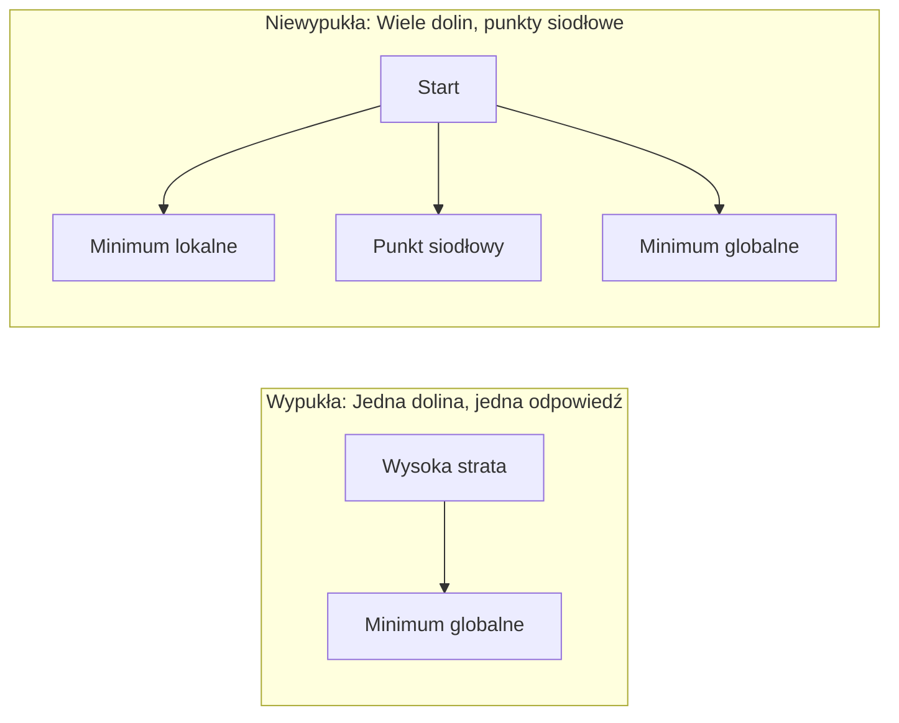
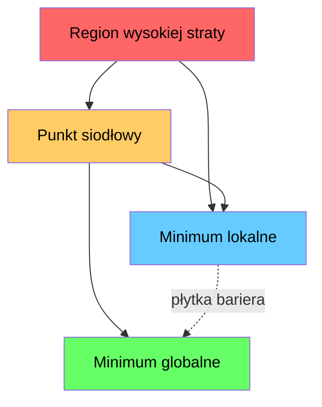

# Optymalizacja

> Trenowanie sieci neuronowej to nic innego jak znajdowanie dna doliny.

**Type:** Build
**Language:** Python
**Prerequisites:** Phase 1, Lessons 04-05 (Derivatives, Gradients)
**Time:** ~75 minut

## Learning Objectives

- Zaimplementuj podstawowy spadek gradientowy, SGD z pędem i Adam od podstaw
- Porównaj zbieżność optymalizatorów na funkcji Rosenbrocka i wyjaśnij, dlaczego Adam adaptuje współczynniki uczenia na wagę
- Rozróżnij wypukłe i niewypukłe krajobrazy straty i wyjaśnij rolę punktów siodłowych w wysokich wymiarach
- Skonfiguruj harmonogramy współczynnika uczenia (zanik schodkowy, wyżarzanie cosinusowe, rozgrzewanie) dla stabilności trenowania

## Problem

Masz funkcję straty. Mówi ci, jak bardzo twój model się myli. Masz gradienty. Mówią ci, który kierunek pogarsza stratę. Teraz potrzebujesz strategii schodzenia w dół.

Naiwne podejście jest proste: przesuń się przeciwnie do gradientu. Skaluj krok przez liczbę zwaną współczynnikiem uczenia. Powtórz. To jest spadek gradientowy i działa. Ale "działa" ma zastrzeżenia. Zbyt duży współczynnik uczenia i przeskoczysz dolinę, odbijając się między ścianami. Zbyt mały i będziesz się czołgać do odpowiedzi tysiącami niepotrzebnych kroków. Trafisz na punkt siodłowy i przestaniesz się poruszać, mimo że nie znalazłeś minimum.

Każdy optymalizator w głębokim uczeniu jest odpowiedzią na to samo pytanie: jak dotrzeć do dna doliny szybciej i bardziej niezawodnie?

## Koncepcja

### Co oznacza optymalizacja

Optymalizacja to znajdowanie wartości wejściowych, które minimalizują (lub maksymalizują) funkcję. W uczeniu maszynowym funkcją jest strata. Wejściami są wagi modelu. Trenowanie to optymalizacja.

```
minimalizuj L(w) gdzie:
  L = funkcja straty
  w = wagi modelu (mogą być miliony parametrów)
```

### Spadek gradientowy (podstawowy)

Najprostszy optymalizator. Oblicz gradient straty względem każdej wagi. Przesuń każdą wagę w przeciwnym kierunku do jej gradientu. Skaluj krok przez współczynnik uczenia.

```
w = w - lr * gradient
```

To cały algorytm. Jedna linia.



### Współczynnik uczenia: najważniejszy hiperparametr

Współczynnik uczenia kontroluje wielkość kroku. Determinuje wszystko o zbieżności.



Nie ma wzoru na odpowiedni współczynnik uczenia. Znajdujesz go eksperymentalnie. Częste punkty startowe: 0.001 dla Adama, 0.01 dla SGD z pędem.

### SGD vs wsadowy vs mini-wsadowy

Podstawowy spadek gradientowy oblicza gradient na całym zbiorze danych przed wykonaniem jednego kroku. To jest wsadowy spadek gradientowy. Jest stabilny, ale wolny.

Stochastyczny spadek gradientowy (SGD) oblicza gradient na pojedynczej losowej próbce i robi krok natychmiast. Jest głośny, ale szybki.

Mini-wsadowy spadek gradientowy dzieli różnicę. Oblicz gradient na małym wsadzie (32, 64, 128, 256 próbek), potem krok. Tego faktycznie wszyscy używają.

| Wariant | Rozmiar wsadu | Jakość gradientu | Szybkość na krok | Szum |
|---------|-----------|-----------------|---------------|-------|
| Wsadowy GD | Cały zbiór | Dokładny | Wolny | Brak |
| SGD | 1 próbka | Bardzo głośny | Szybki | Wysoki |
| Mini-wsadowy | 32-256 | Dobre oszacowanie | Zrównoważony | Umiarkowany |

Szum w SGD i mini-wsadowym to nie błąd. Pomaga uciekać z płytkich minimów lokalnych i punktów siodłowych.

### Pęd: piłka tocząca się w dół

Podstawowy spadek gradientowy patrzy tylko na bieżący gradient. Jeśli gradient zygzakuje (częste w wąskich dolinach), postęp jest powolny. Pęd naprawia to przez akumulowanie przeszłych gradientów w członie prędkości.

```
v = beta * v + gradient
w = w - lr * v
```

Analogia: piłka tocząca się w dół. Nie zatrzymuje się i nie restartuje przy każdym wyboju. Nabiera prędkości w spójnych kierunkach i tłumi oscylacje.



`beta` (zwykle 0.9) kontroluje, ile historii zachować. Wyższe beta oznacza więcej pędu, gładsze ścieżki, ale wolniejszą reakcję na zmiany kierunku.

### Adam: adaptacyjne współczynniki uczenia

Różne wagi potrzebują różnych współczynników uczenia. Waga, która rzadko dostaje duże gradienty, powinna robić większe kroki, gdy w końcu je dostanie. Waga, która stale dostaje ogromne gradienty, powinna robić mniejsze kroki.

Adam (Adaptive Moment Estimation) śledzi dwie rzeczy na wagę:

1. Pierwszy moment (m): średnia bieżąca gradientów (jak pęd)
2. Drugi moment (v): średnia bieżąca kwadratów gradientów (wielkość gradientu)

```
m = beta1 * m + (1 - beta1) * gradient
v = beta2 * v + (1 - beta2) * gradient^2

m_hat = m / (1 - beta1^t)    korekcja obciążenia
v_hat = v / (1 - beta2^t)    korekcja obciążenia

w = w - lr * m_hat / (sqrt(v_hat) + epsilon)
```

Dzielenie przez `sqrt(v_hat)` to kluczowa intuicja. Wagi z dużymi gradientami są dzielone przez dużą liczbę (mały efektywny krok). Wagi z małymi gradientami są dzielone przez małą liczbę (duży efektywny krok). Każda waga dostaje swój własny adaptacyjny współczynnik uczenia.

Domyślne hiperparametry: `lr=0.001, beta1=0.9, beta2=0.999, epsilon=1e-8`. Te domyślne działają dobrze dla większości problemów.

### Harmonogramy współczynnika uczenia

Stały współczynnik uczenia to kompromis. Wcześnie w trenowaniu chcesz dużych kroków, by szybko robić postępy. Późno w trenowaniu chcesz małych kroków, by precyzyjnie dostroić w pobliżu minimum.

Typowe harmonogramy:

| Harmonogram | Wzór | Zastosowanie |
|----------|---------|----------|
| Zanik schodkowy | lr = lr * czynnik co N epok | Prosty, ręczna kontrola |
| Zanik wykładniczy | lr = lr_0 * zanik^t | Gładkie zmniejszanie |
| Wyżarzanie cosinusowe | lr = lr_min + 0.5 * (lr_max - lr_min) * (1 + cos(pi * t / T)) | Transformery, nowoczesne trenowanie |
| Rozgrzewanie + zanik | Liniowy wzrost, potem zanik | Duże modele, zapobiega wczesnej niestabilności |

### Wypukła vs niewypukła

Funkcja wypukła ma jedno minimum. Spadek gradientowy zawsze je znajduje. Kwadratowa funkcja jak `f(x) = x^2` jest wypukła.

Funkcje straty sieci neuronowych są niewypukłe. Mają wiele minimów lokalnych, punktów siodłowych i płaskich regionów.



W praktyce minima lokalne w wysokowymiarowych sieciach neuronowych rzadko są problemem. Większość minimów lokalnych ma wartości straty bliskie minimum globalnemu. Punkty siodłowe (płaskie w niektórych kierunkach, zakrzywione w innych) to prawdziwa przeszkoda. Pęd i szum z mini-wsadów pomagają z nich uciec.

### Wizualizacja krajobrazu straty

Strata jest funkcją wszystkich wag. Dla modelu z 1 milionem wag krajobraz straty żyje w 1 000 001-wymiarowej przestrzeni. Wizualizujemy go, wybierając dwa losowe kierunki w przestrzeni wag i wykreślając stratę wzdłuż tych kierunków, tworząc powierzchnię 2D.



Ostre minima generalizują słabo. Płaskie minima generalizują dobrze. To jeden z powodów, dla których SGD z pędem często przewyższa Adama pod względem końcowej dokładności testowej: jego szum zapobiega osiadaniu w ostrych minimach.

```figure
gradient-descent
```

## Build It

### Krok 1: Zdefiniuj funkcję testową

Funkcja Rosenbrocka to klasyczny benchmark optymalizacyjny. Jej minimum jest w (1, 1) wewnątrz wąskiej zakrzywionej doliny, którą łatwo znaleźć, ale trudno podążać.

```
f(x, y) = (1 - x)^2 + 100 * (y - x^2)^2
```

```python
def rosenbrock(params):
    x, y = params
    return (1 - x) ** 2 + 100 * (y - x ** 2) ** 2

def rosenbrock_gradient(params):
    x, y = params
    df_dx = -2 * (1 - x) + 200 * (y - x ** 2) * (-2 * x)
    df_dy = 200 * (y - x ** 2)
    return [df_dx, df_dy]
```

### Krok 2: Podstawowy spadek gradientowy

```python
class GradientDescent:
    def __init__(self, lr=0.001):
        self.lr = lr

    def step(self, params, grads):
        return [p - self.lr * g for p, g in zip(params, grads)]
```

### Krok 3: SGD z pędem

```python
class SGDMomentum:
    def __init__(self, lr=0.001, momentum=0.9):
        self.lr = lr
        self.momentum = momentum
        self.velocity = None

    def step(self, params, grads):
        if self.velocity is None:
            self.velocity = [0.0] * len(params)
        self.velocity = [
            self.momentum * v + g
            for v, g in zip(self.velocity, grads)
        ]
        return [p - self.lr * v for p, v in zip(params, self.velocity)]
```

### Krok 4: Adam

```python
class Adam:
    def __init__(self, lr=0.001, beta1=0.9, beta2=0.999, epsilon=1e-8):
        self.lr = lr
        self.beta1 = beta1
        self.beta2 = beta2
        self.epsilon = epsilon
        self.m = None
        self.v = None
        self.t = 0

    def step(self, params, grads):
        if self.m is None:
            self.m = [0.0] * len(params)
            self.v = [0.0] * len(params)

        self.t += 1

        self.m = [
            self.beta1 * m + (1 - self.beta1) * g
            for m, g in zip(self.m, grads)
        ]
        self.v = [
            self.beta2 * v + (1 - self.beta2) * g ** 2
            for v, g in zip(self.v, grads)
        ]

        m_hat = [m / (1 - self.beta1 ** self.t) for m in self.m]
        v_hat = [v / (1 - self.beta2 ** self.t) for v in self.v]

        return [
            p - self.lr * mh / (vh ** 0.5 + self.epsilon)
            for p, mh, vh in zip(params, m_hat, v_hat)
        ]
```

### Krok 5: Uruchom i porównaj

```python
def optimize(optimizer, func, grad_func, start, steps=5000):
    params = list(start)
    history = [params[:]]
    for _ in range(steps):
        grads = grad_func(params)
        params = optimizer.step(params, grads)
        history.append(params[:])
    return history

start = [-1.0, 1.0]

gd_history = optimize(GradientDescent(lr=0.0005), rosenbrock, rosenbrock_gradient, start)
sgd_history = optimize(SGDMomentum(lr=0.0001, momentum=0.9), rosenbrock, rosenbrock_gradient, start)
adam_history = optimize(Adam(lr=0.01), rosenbrock, rosenbrock_gradient, start)

for name, history in [("GD", gd_history), ("SGD+M", sgd_history), ("Adam", adam_history)]:
    final = history[-1]
    loss = rosenbrock(final)
    print(f"{name:6s} -> x={final[0]:.6f}, y={final[1]:.6f}, loss={loss:.8f}")
```

Oczekiwane wyjście: Adam zbiega najszybciej. SGD z pędem podąża gładszą ścieżką. Podstawowy GD robi powolne postępy wzdłuż wąskiej doliny.

## Use It

W praktyce używaj optymalizatorów PyTorch lub JAX. Obsługują grupy parametrów, zanik wag, obcinanie gradientów i akcelerację GPU.

```python
import torch

model = torch.nn.Linear(784, 10)

sgd = torch.optim.SGD(model.parameters(), lr=0.01, momentum=0.9)
adam = torch.optim.Adam(model.parameters(), lr=0.001)
adamw = torch.optim.AdamW(model.parameters(), lr=0.001, weight_decay=0.01)

scheduler = torch.optim.lr_scheduler.CosineAnnealingLR(adam, T_max=100)
```

Reguły kciuka:

- Zacznij z Adamem (lr=0.001). Działa dla większości problemów bez strojenia.
- Przełącz na SGD z pędem (lr=0.01, pęd=0.9), gdy potrzebujesz najlepszej końcowej dokładności i możesz pozwolić sobie na więcej strojenia.
- Użyj AdamW (Adam z odseparowanym zanikiem wag) dla transformerów.
- Zawsze używaj harmonogramu współczynnika uczenia dla dłuższych trenowań.
- Jeśli trenowanie jest niestabilne, zmniejsz współczynnik uczenia. Jeśli jest zbyt wolne, zwiększ go.

## Ship It

Ta lekcja produkuje prompt do wyboru odpowiedniego optymalizatora. Zobacz `outputs/prompt-optimizer-guide.md`.

Klasy optymalizatorów zbudowane tutaj pojawiają się ponownie w Phase 3, gdy trenujemy sieć neuronową od podstaw.

## Ćwiczenia

1. **Przebieg współczynnika uczenia.** Uruchom podstawowy spadek gradientowy na funkcji Rosenbrocka ze współczynnikami uczenia [0.0001, 0.0005, 0.001, 0.005, 0.01]. Wykreśl lub wydrukuj końcową stratę po 5000 krokach dla każdego. Znajdź największy współczynnik uczenia, który wciąż zbiega.

2. **Porównanie pędu.** Uruchom SGD z wartościami pędu [0.0, 0.5, 0.9, 0.99] na funkcji Rosenbrocka. Śledź stratę na każdym kroku. Która wartość pędu zbiega najszybciej? Która przestrzeliwuje?

3. **Ucieczka z punktu siodłowego.** Zdefiniuj funkcję `f(x, y) = x^2 - y^2` (punkt siodłowy w początku). Zacznij w (0.01, 0.01). Porównaj, jak zachowują się podstawowy GD, SGD z pędem i Adam. Który ucieka z punktu siodłowego?

4. **Zaimplementuj zanik współczynnika uczenia.** Dodaj wykładniczy harmonogram zaniku do klasy GradientDescent: `lr = lr_0 * 0.999^krok`. Porównaj zbieżność z i bez zaniku na funkcji Rosenbrocka.

## Key Terms

| Termin | Co ludzie mówią | Co naprawdę znaczy |
|------|----------------|----------------------|
| Spadek gradientowy | "Idź w dół" | Zaktualizuj wagi przez odjęcie gradientu skalowanego przez współczynnik uczenia. Najbardziej podstawowy optymalizator. |
| Współczynnik uczenia | "Wielkość kroku" | Skalar kontrolujący, jak daleko każda aktualizacja przesuwa wagi. Za duży powoduje rozbieżność. Za mały marnuje obliczenia. |
| Pęd | "Kontynuuj toczenie" | Akumuluj przeszłe gradienty w wektorze prędkości. Tłumi oscylacje i przyspiesza ruch przez spójne kierunki. |
| SGD | "Losowe próbkowanie" | Stochastyczny spadek gradientowy. Oblicza gradient na losowym podzbiorze zamiast całego zbioru danych. Prawie zawsze oznacza mini-wsadowy SGD w praktyce. |
| Mini-wsad | "Kawałek danych" | Mały podzbiór danych treningowych (32-256 próbek) używany do estymacji gradientu. Równoważy szybkość i dokładność gradientu. |
| Adam | "Domyślny optymalizator" | Adaptive Moment Estimation. Śledzi na wagę średnie bieżące gradientów i kwadratów gradientów, by dać każdej wadze własny współczynnik uczenia. |
| Korekcja obciążenia | "Napraw zimny start" | Pierwszy i drugi moment Adama są inicjalizowane zerem. Korekcja obciążenia dzieli przez (1 - beta^t) by skompensować to we wczesnych krokach. |
| Harmonogram współczynnika uczenia | "Zmień lr w czasie" | Funkcja dostosowująca współczynnik uczenia podczas trenowania. Duże kroki wcześnie, małe kroki późno. |
| Funkcja wypukła | "Jedna dolina" | Funkcja, gdzie każde minimum lokalne jest minimum globalnym. Spadek gradientowy zawsze je znajduje. Straty sieci neuronowych nie są wypukłe. |
| Punkt siodłowy | "Płaski, ale nie minimum" | Punkt, gdzie gradient jest zerem, ale jest minimum w niektórych kierunkach i maksimum w innych. Częsty w wysokich wymiarach. |
| Krajobraz straty | "Teren" | Funkcja straty wykreślona nad przestrzenią wag. Wizualizowana przez przecięcie wzdłuż dwóch losowych kierunków. |
| Zbieżność | "Dotarcie tam" | Optymalizator osiągnął punkt, gdzie dalsze kroki nie zmniejszają znacząco straty. |