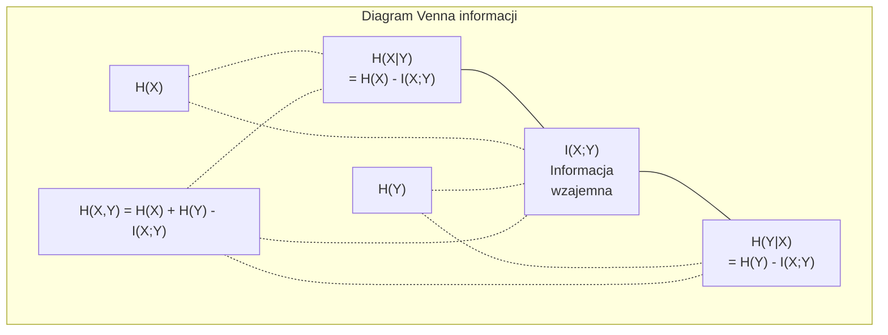

# Teoria informacji

> Teoria informacji mierzy zaskoczenie. Funkcje straty są na niej zbudowane.

**Type:** Learn
**Language:** Python
**Prerequisites:** Phase 1, Lesson 06 (Probability)
**Time:** ~60 minut

## Learning Objectives

- Oblicz entropię, cross-entropię i dywergencję KL od podstaw i wyjaśnij ich związek
- Wyprowadź, dlaczego minimalizacja cross-entropii jest równoważna maksymalizacji log-wiarygodności
- Oblicz informację wzajemną między cechami a celem w celu rankingowania ważności cech
- Wyjaśnij perplexity jako efektywny rozmiar słownika, z którego model językowy wybiera

## Problem

Wywołujesz `CrossEntropyLoss()` w każdym modelu klasyfikacji, który trenujesz. Widzisz "perplexity" w każdej pracy o modelach językowych. Czytasz o dywergencji KL w VAE, dystylacji i RLHF. To nie są odłączone koncepcje. To ten sam pomysł w różnych przebraniach.

Teoria informacji daje język do rozumowania o niepewności, kompresji i predykcji. Claude Shannon wynalazł ją w 1948 roku, by rozwiązywać problemy komunikacyjne. Okazuje się, że trenowanie sieci neuronowej jest problemem komunikacyjnym: model próbuje przesłać poprawną etykietę przez głośny kanał nauczonych wag.

Ta lekcja buduje każdy wzór od podstaw, abyś zobaczył, skąd pochodzą i dlaczego działają.

## Koncepcja

### Zawartość informacji (zaskoczenie)

Gdy zdarza się coś mało prawdopodobnego, niesie więcej informacji. Orzeł w rzucie monetą? Niezaskakujące. Wygrana na loterii? Bardzo zaskakujące.

Zawartość informacji zdarzenia z prawdopodobieństwem p to:

```
I(x) = -log(p(x))
```

Użycie logarytmu o podstawie 2 daje bity. Użycie logarytmu naturalnego daje naty. Ten sam pomysł, różne jednostki.

```
Zdarzenie              Prawdopodobieństwo    Zaskoczenie (bity)
Orzeł w uczciwej monecie  0.5                    1.0
Wyrzucenie 6              0.167                  2.58
Zdarzenie 1-na-1000       0.001                  9.97
Zdarzenie pewne           1.0                    0.0
```

Zdarzenia pewne niosą zero informacji. Już wiedziałeś, że się zdarzą.

### Entropia (średnie zaskoczenie)

Entropia to oczekiwane zaskoczenie dla wszystkich możliwych wyników rozkładu.

```
H(P) = -sum( p(x) * log(p(x)) )  dla wszystkich x
```

Uczciwa moneta ma maksymalną entropię dla zmiennej binarnej: 1 bit. Przekrzywiona moneta (99% orłów) ma niską entropię: 0.08 bita. Już wiesz, co się wydarzy, więc każdy rzut mówi ci prawie nic.

```
Uczciwa moneta:    H = -(0.5 * log2(0.5) + 0.5 * log2(0.5)) = 1.0 bit
Przekrzywiona moneta:  H = -(0.99 * log2(0.99) + 0.01 * log2(0.01)) = 0.08 bita
```

Entropia mierzy nieredukowalną niepewność w rozkładzie. Nie możesz skompresować poniżej niej.

### Cross-entropia (funkcja straty, której używasz codziennie)

Cross-entropia mierzy średnie zaskoczenie, gdy używasz rozkładu Q do kodowania zdarzeń, które faktycznie pochodzą z rozkładu P.

```
H(P, Q) = -sum( p(x) * log(q(x)) )  dla wszystkich x
```

P to prawdziwy rozkład (etykiety). Q to przewidywania twojego modelu. Jeśli Q pasuje do P idealnie, cross-entropia równa się entropii. Każda niezgodność zwiększa ją.

W klasyfikacji P jest wektorem one-hot (prawdziwa klasa ma prawdopodobieństwo 1, wszystko inne 0). To upraszcza cross-entropię do:

```
H(P, Q) = -log(q(prawdziwa_klasa))
```

To cały wzór straty cross-entropii dla klasyfikacji. Maksymalizuj przewidywane prawdopodobieństwo poprawnej klasy.

### Dywergencja KL (odległość między rozkładami)

Dywergencja KL mierzy, ile dodatkowego zaskoczenia dostajesz z używania Q zamiast P.

```
D_KL(P || Q) = sum( p(x) * log(p(x) / q(x)) )  dla wszystkich x
             = H(P, Q) - H(P)
```

Cross-entropia to entropia plus dywergencja KL. Ponieważ entropia prawdziwego rozkładu jest stała podczas trenowania, minimalizowanie cross-entropii jest tym samym, co minimalizowanie dywergencji KL. Popychasz rozkład swojego modelu w kierunku prawdziwego rozkładu.

Dywergencja KL nie jest symetryczna: D_KL(P || Q) != D_KL(Q || P). Nie jest prawdziwą metryką odległości.

### Informacja wzajemna

Informacja wzajemna mierzy, jak bardzo wiedza o jednej zmiennej mówi ci o drugiej.

```
I(X; Y) = H(X) - H(X|Y)
        = H(X) + H(Y) - H(X, Y)
```

Jeśli X i Y są niezależne, informacja wzajemna wynosi zero. Wiedza o jednej nie mówi nic o drugiej. Jeśli są idealnie skorelowane, informacja wzajemna równa się entropii każdej ze zmiennych.

W selekcji cech, wysoka informacja wzajemna między cechą a celem oznacza, że cecha jest użyteczna. Niska informacja wzajemna oznacza szum.

### Entropia warunkowa

H(Y|X) mierzy, ile niepewności pozostaje o Y po zaobserwowaniu X.

```
H(Y|X) = H(X,Y) - H(X)
```

Dwie skrajności:
- Jeśli X całkowicie determinuje Y, to H(Y|X) = 0. Znajomość X eliminuje całą niepewność o Y. Przykład: X = temperatura w Celsjuszach, Y = temperatura w Fahrenheitach.
- Jeśli X nic nie mówi o Y, to H(Y|X) = H(Y). Znajomość X nie redukuje w ogóle twojej niepewności. Przykład: X = rzut monetą, Y = jutrzejsza pogoda.

Entropia warunkowa jest zawsze nieujemna i nigdy nie przekracza H(Y):

```
0 <= H(Y|X) <= H(Y)
```

W uczeniu maszynowym entropia warunkowa pojawia się w drzewach decyzyjnych. Przy każdym podziale algorytm wybiera cechę X, która minimalizuje H(Y|X) -- cechę, która usuwa najwięcej niepewności o etykiecie Y.

### Entropia łączna

H(X,Y) to entropia łącznego rozkładu X i Y razem.

```
H(X,Y) = -sum sum p(x,y) * log(p(x,y))   dla wszystkich x, y
```

Kluczowa własność:

```
H(X,Y) <= H(X) + H(Y)
```

Równość zachodzi, gdy X i Y są niezależne. Jeśli dzielą informację, entropia łączna jest mniejsza niż suma indywidualnych entropii. "Brakująca" entropia to dokładnie informacja wzajemna.



Zależności:
- H(X,Y) = H(X) + H(Y|X) = H(Y) + H(X|Y)
- I(X;Y) = H(X) - H(X|Y) = H(Y) - H(Y|X)
- H(X,Y) = H(X) + H(Y) - I(X;Y)

### Informacja wzajemna (szczegółowo)

Informacja wzajemna I(X;Y) określa, jak bardzo znajomość jednej zmiennej redukuje niepewność co do drugiej.

```
I(X;Y) = H(X) - H(X|Y)
       = H(Y) - H(Y|X)
       = H(X) + H(Y) - H(X,Y)
       = sum sum p(x,y) * log(p(x,y) / (p(x) * p(y)))
```

Własności:
- I(X;Y) >= 0 zawsze. Nigdy nie tracisz informacji przez obserwację czegoś.
- I(X;Y) = 0 wtedy i tylko wtedy, gdy X i Y są niezależne.
- I(X;Y) = I(Y;X). Jest symetryczna, w przeciwieństwie do dywergencji KL.
- I(X;X) = H(X). Zmienna dzieli całą swoją informację z samą sobą.

**Informacja wzajemna do selekcji cech.** W ML chcesz cech, które są informacyjne o celu. Informacja wzajemna daje zasadniczy sposób rankingowania cech:

1. Dla każdej cechy X_i, oblicz I(X_i; Y), gdzie Y to zmienna celu.
2. Uszereguj cechy według wyniku MI.
3. Zachowaj top k cech.

Działa to dla dowolnej relacji między cechą a celem -- liniowej, nieliniowej, monotonicznej lub nie. Korelacja łapie tylko relacje liniowe. MI łapie wszystko.

| Metoda | Wykrywa | Koszt obliczeniowy | Obsługuje kategoryczne? |
|--------|---------|-------------------|---------------------|
| Korelacja Pearsona | Relacje liniowe | O(n) | Nie |
| Korelacja Spearmana | Relacje monotoniczne | O(n log n) | Nie |
| Informacja wzajemna | Dowolną zależność statystyczną | O(n log n) z grupowaniem | Tak |

### Wygładzanie etykiet i cross-entropia

Standardowa klasyfikacja używa twardych celów: [0, 0, 1, 0]. Prawdziwa klasa dostaje prawdopodobieństwo 1, wszystko inne 0. Wygładzanie etykiet zastępuje je miękkimi celami:

```
miękki_cel = (1 - epsilon) * twardy_cel + epsilon / liczba_klas
```

Z epsilon = 0.1 i 4 klasami:
- Twardy cel:  [0, 0, 1, 0]
- Miękki cel:  [0.025, 0.025, 0.925, 0.025]

Z perspektywy teorii informacji, wygładzanie etykiet zwiększa entropię rozkładu celu. Twarde cele one-hot mają entropię 0 -- nie ma niepewności. Miękkie cele mają dodatnią entropię.

Dlaczego to pomaga:
- Zapobiega popychaniu logitów do ekstremalnych wartości (nieskończone logity byłyby potrzebne do idealnego dopasowania celu one-hot przy cross-entropii)
- Działa jak regularyzacja: model nie może być w 100% pewny
- Poprawia kalibrację: przewidywane prawdopodobieństwa lepiej odzwierciedlają prawdziwą niepewność
- Zmniejsza różnicę między zachowaniem podczas trenowania a wnioskowania

Strata cross-entropii z wygładzaniem etykiet staje się:

```
L = (1 - epsilon) * CE(twardy_cel, predykcja) + epsilon * H_jednostajna(predykcja)
```

Drugi człon karze predykcje dalekie od jednostajnego -- bezpośrednia regularyzacja pewności.

### Dlaczego cross-entropia JEST funkcją straty klasyfikacji

Trzy perspektywy, ten sam wniosek.

**Perspektywa teorii informacji.** Cross-entropia mierzy, ile bitów marnujesz, używając rozkładu swojego modelu zamiast prawdziwego rozkładu. Minimalizowanie jej czyni twój model najefektywniejszym koderem rzeczywistości.

**Perspektywa największej wiarygodności.** Dla N próbek treningowych z prawdziwymi klasami y_i:

```
Wiarygodność     = iloczyn( q(y_i) )
Log-wiarygodność = suma( log(q(y_i)) )
Ujemna log-wiarygodność = -suma( log(q(y_i)) )
```

Ta ostatnia linia to strata cross-entropii. Minimalizowanie cross-entropii = maksymalizowanie wiarygodności danych treningowych przy twoim modelu.

**Perspektywa gradientu.** Gradient cross-entropii względem logitów to po prostu (przewidziane - prawdziwe). Czysty, stabilny i szybki do obliczenia. Dlatego idealnie współgra z softmaxem.

### Bity vs Naty

Jedyna różnica to podstawa logarytmu.

```
log o podstawie 2   -> bity      (tradycja teorii informacji)
log o podstawie e   -> naty      (konwencja uczenia maszynowego)
log o podstawie 10  -> hartleye  (rzadko używane)
```

1 nat = 1/ln(2) bita = 1.4427 bita. PyTorch i TensorFlow domyślnie używają logarytmu naturalnego (natów).

### Perplexity

Perplexity to eksponenta cross-entropii. Mówi o efektywnej liczbie równie prawdopodobnych wyborów, między którymi model jest niepewny.

```
Perplexity = 2^H(P,Q)   (jeśli używasz bitów)
Perplexity = e^H(P,Q)   (jeśli używasz natów)
```

Model językowy z perplexity 50 jest średnio tak samo zdezorientowany, jakby musiał wybierać jednostajnie spośród 50 możliwych następnych tokenów. Niżej = lepiej.

GPT-2 osiągnął perplexity ~30 na typowych benchmarkach. Nowoczesne modele są w zakresie jednocyfrowym dla dobrze reprezentowanych domen.

```figure
entropy-kl
```

## Build It

### Krok 1: Zawartość informacji i entropia

```python
import math

def information_content(p, base=2):
    if p <= 0 or p > 1:
        return float('inf') if p <= 0 else 0.0
    return -math.log(p) / math.log(base)

def entropy(probs, base=2):
    return sum(
        p * information_content(p, base)
        for p in probs if p > 0
    )

fair_coin = [0.5, 0.5]
biased_coin = [0.99, 0.01]
fair_die = [1/6] * 6

print(f"Entropia uczciwej monety:   {entropy(fair_coin):.4f} bitów")
print(f"Entropia przekrzywionej monety: {entropy(biased_coin):.4f} bitów")
print(f"Entropia uczciwej kostki:    {entropy(fair_die):.4f} bitów")
```

### Krok 2: Cross-entropia i dywergencja KL

```python
def cross_entropy(p, q, base=2):
    total = 0.0
    for pi, qi in zip(p, q):
        if pi > 0:
            if qi <= 0:
                return float('inf')
            total += pi * (-math.log(qi) / math.log(base))
    return total

def kl_divergence(p, q, base=2):
    return cross_entropy(p, q, base) - entropy(p, base)

true_dist = [0.7, 0.2, 0.1]
good_model = [0.6, 0.25, 0.15]
bad_model = [0.1, 0.1, 0.8]

print(f"Entropia prawdziwego rozkładu:     {entropy(true_dist):.4f} bitów")
print(f"CE (dobry model):          {cross_entropy(true_dist, good_model):.4f} bitów")
print(f"CE (zły model):           {cross_entropy(true_dist, bad_model):.4f} bitów")
print(f"Dywergencja KL (dobry):     {kl_divergence(true_dist, good_model):.4f} bitów")
print(f"Dywergencja KL (zły):      {kl_divergence(true_dist, bad_model):.4f} bitów")
```

### Krok 3: Cross-entropia jako strata klasyfikacji

```python
def softmax(logits):
    max_logit = max(logits)
    exps = [math.exp(z - max_logit) for z in logits]
    total = sum(exps)
    return [e / total for e in exps]

def cross_entropy_loss(true_class, logits):
    probs = softmax(logits)
    return -math.log(probs[true_class])

logits = [2.0, 1.0, 0.1]
true_class = 0

probs = softmax(logits)
loss = cross_entropy_loss(true_class, logits)

print(f"Logity:      {logits}")
print(f"Softmax:     {[f'{p:.4f}' for p in probs]}")
print(f"Prawdziwa klasa:  {true_class}")
print(f"Strata:        {loss:.4f} natów")
print(f"Perplexity:  {math.exp(loss):.2f}")
```

### Krok 4: Cross-entropia równa się ujemnej log-wiarygodności

```python
import random

random.seed(42)

n_samples = 1000
n_classes = 3
true_labels = [random.randint(0, n_classes - 1) for _ in range(n_samples)]
model_logits = [[random.gauss(0, 1) for _ in range(n_classes)] for _ in range(n_samples)]

ce_loss = sum(
    cross_entropy_loss(label, logits)
    for label, logits in zip(true_labels, model_logits)
) / n_samples

nll = -sum(
    math.log(softmax(logits)[label])
    for label, logits in zip(true_labels, model_logits)
) / n_samples

print(f"Strata cross-entropii:      {ce_loss:.6f}")
print(f"Ujemna log-wiarygodność: {nll:.6f}")
print(f"Różnica:              {abs(ce_loss - nll):.2e}")
```

### Krok 5: Informacja wzajemna

```python
def mutual_information(joint_probs, base=2):
    rows = len(joint_probs)
    cols = len(joint_probs[0])

    margin_x = [sum(joint_probs[i][j] for j in range(cols)) for i in range(rows)]
    margin_y = [sum(joint_probs[i][j] for i in range(rows)) for j in range(cols)]

    mi = 0.0
    for i in range(rows):
        for j in range(cols):
            pxy = joint_probs[i][j]
            if pxy > 0:
                mi += pxy * math.log(pxy / (margin_x[i] * margin_y[j])) / math.log(base)
    return mi

independent = [[0.25, 0.25], [0.25, 0.25]]
dependent = [[0.45, 0.05], [0.05, 0.45]]

print(f"MI (niezależne): {mutual_information(independent):.4f} bitów")
print(f"MI (zależne):   {mutual_information(dependent):.4f} bitów")
```

## Use It

Te same koncepcje z NumPy, tak jak będziesz ich używać w praktyce:

```python
import numpy as np

def np_entropy(p):
    p = np.asarray(p, dtype=float)
    mask = p > 0
    result = np.zeros_like(p)
    result[mask] = p[mask] * np.log(p[mask])
    return -result.sum()

def np_cross_entropy(p, q):
    p, q = np.asarray(p, dtype=float), np.asarray(q, dtype=float)
    mask = p > 0
    return -(p[mask] * np.log(q[mask])).sum()

def np_kl_divergence(p, q):
    return np_cross_entropy(p, q) - np_entropy(p)

true = np.array([0.7, 0.2, 0.1])
pred = np.array([0.6, 0.25, 0.15])
print(f"Entropia:    {np_entropy(true):.4f} natów")
print(f"Cross-ent:  {np_cross_entropy(true, pred):.4f} natów")
print(f"KL div:     {np_kl_divergence(true, pred):.4f} natów")
```

Zbudowałeś od podstaw to, co `torch.nn.CrossEntropyLoss()` robi wewnętrznie. Teraz wiesz, dlaczego strata maleje podczas trenowania: przewidywany rozkład twojego modelu zbliża się do prawdziwego rozkładu, mierzonego w natach zmarnowanej informacji.

## Ćwiczenia

1. Oblicz entropię alfabetu angielskiego zakładając rozkład jednostajny (26 liter). Następnie oszacuj go używając rzeczywistych częstości liter. Która jest wyższa i dlaczego?

2. Model wyjściowo daje logity [5.0, 2.0, 0.5] dla próbki z prawdziwą klasą 1. Oblicz stratę cross-entropii ręcznie, a następnie zweryfikuj swoją funkcją `cross_entropy_loss`. Jakie logity dałyby zerową stratę?

3. Pokaż, że dywergencja KL nie jest symetryczna. Wybierz dwa rozkłady P i Q i oblicz D_KL(P || Q) i D_KL(Q || P). Wyjaśnij, dlaczego się różnią.

4. Zbuduj funkcję obliczającą perplexity dla sekwencji predykcji tokenów. Dając listę par (indeks_prawdziwego_tokena, przewidziane_logity), zwróć perplexity sekwencji.

## Key Terms

| Termin | Co ludzie mówią | Co naprawdę znaczy |
|------|----------------|----------------------|
| Zawartość informacji | "Zaskoczenie" | Liczba bitów (lub natów) potrzebna do zakodowania zdarzenia: -log(p) |
| Entropia | "Losowość" | Średnie zaskoczenie dla wszystkich wyników rozkładu. Mierzy nieredukowalną niepewność. |
| Cross-entropia | "Funkcja straty" | Średnie zaskoczenie przy używaniu rozkładu modelu Q do kodowania zdarzeń z prawdziwego rozkładu P. |
| Dywergencja KL | "Odległość między rozkładami" | Dodatkowe bity zmarnowane przez używanie Q zamiast P. Równa się cross-entropia minus entropia. Niesymetryczna. |
| Informacja wzajemna | "Jak bardzo X i Y są związane" | Redukcja niepewności o X z znajomości Y. Zero oznacza niezależność. |
| Softmax | "Zmień logity na prawdopodobieństwa" | Podnieś do potęgi i normalizuj. Mapuje dowolny wektor rzeczywisty na poprawny rozkład prawdopodobieństwa. |
| Perplexity | "Jak zdezorientowany jest model" | Eksponenta cross-entropii. Efektywny rozmiar słownika, z którego model wybiera na każdym kroku. |
| Bity | "Jednostka Shannona" | Informacja mierzona logarytmem o podstawie 2. Jeden bit rozstrzyga jeden rzut uczciwej monety. |
| Naty | "Jednostka ML" | Informacja mierzona logarytmem naturalnym. Domyślnie używane przez PyTorch i TensorFlow. |
| Ujemna log-wiarygodność | "Strata NLL" | Identyczna ze stratą cross-entropii dla etykiet one-hot. Minimalizacja jej maksymalizuje prawdopodobieństwo poprawnych predykcji. |