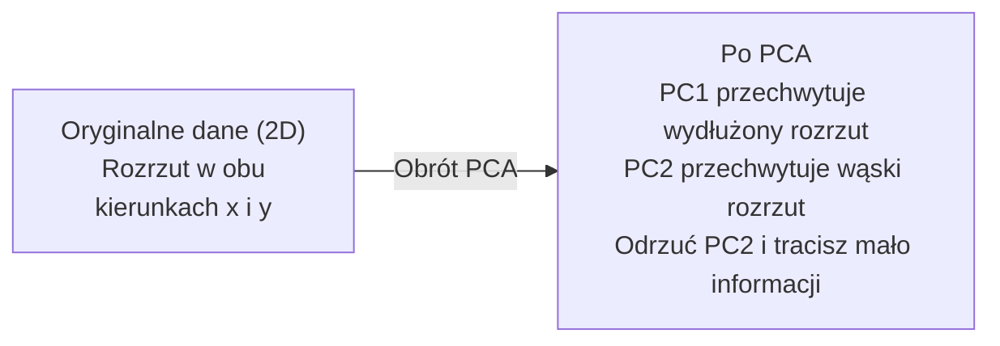

# Redukcja wymiarowości

> Dane wysokowymiarowe mają strukturę. Znajdujesz ją, patrząc z odpowiedniego kąta.

**Type:** Build
**Language:** Python
**Prerequisites:** Phase 1, Lessons 01 (Linear Algebra Intuition), 02 (Vectors, Matrices & Operations), 03 (Eigenvalues & Eigenvectors), 06 (Probability & Distributions)
**Time:** ~90 minut

## Learning Objectives

- Zaimplementuj PCA od podstaw: wycentruj dane, oblicz macierz kowariancji, wykonaj rozkład na wartości własne i rzutuj
- Użyj współczynnika wyjaśnionej wariancji i metody łokcia do wyboru liczby głównych składowych
- Porównaj PCA, t-SNE i UMAP do wizualizacji cyfr MNIST w 2D i wyjaśnij ich kompromisy
- Zastosuj PCA jądrowy z jądrem RBF do separacji nieliniowych struktur danych, z którymi standardowy PCA nie może sobie poradzić

## Problem

Masz zbiór danych z 784 cechami na próbkę. Może to wartości pikseli ręcznie pisanych cyfr. Może poziomy ekspresji genów. Może sygnały zachowania użytkowników. Nie możesz zwizualizować 784 wymiarów. Nie możesz ich wykreślić. Nie możesz nawet o nich myśleć.

Ale większość z tych 784 cech jest nadmiarowa. Rzeczywista informacja żyje na znacznie mniejszej powierzchni. Ręcznie napisana "7" nie potrzebuje 784 niezależnych liczb do opisania. Potrzebuje kilku: kąta pociągnięcia, długości poprzeczki, jak bardzo jest pochylona. Reszta to szum.

Redukcja wymiarowości znajduje tę mniejszą powierzchnię. Bierze twoje 784-wymiarowe dane i kompresuje je do 2, 10 lub 50 wymiarów, zachowując strukturę, która ma znaczenie.

## Koncepcja

### Przekleństwo wymiarowości

Przestrzenie wysokowymiarowe są nieintuicyjne. Trzy rzeczy się psują, gdy wymiary rosną.

**Odległość staje się bez znaczenia.** W wysokich wymiarach odległość między dowolnymi dwoma losowymi punktami zbiega do tej samej wartości. Jeśli każdy punkt jest mniej więcej w tej samej odległości od każdego innego punktu, wyszukiwanie najbliższych sąsiadów przestaje działać.

```
Wymiar    Średni stosunek odległości (max/min między losowymi punktami)
2            ~5.0
10           ~1.8
100          ~1.2
1000         ~1.02
```

**Objętość koncentruje się w rogach.** Sześcian jednostkowy w d wymiarach ma 2^d rogów. W 100 wymiarach prawie cała objętość jest w rogach, daleko od środka. Punkty danych rozchodzą się do krawędzi, a twoje modele głodują danych we wnętrzu.

**Potrzebujesz wykładniczo więcej danych.** Aby utrzymać tę samą gęstość próbek w przestrzeni, przejście z 2D do 20D oznacza potrzebę 10^18 razy więcej danych. Nigdy nie masz wystarczająco. Redukcja wymiarów przywraca gęstość danych do czegoś użytecznego.

### PCA: znajdź kierunki, które mają znaczenie

Analiza głównych składowych (PCA) znajduje osie, wzdłuż których twoje dane zmieniają się najbardziej. Obraca twój układ współrzędnych, tak by pierwsza oś przechwytywała najwięcej wariancji, druga przechwytywała kolejną największą, i tak dalej.

Algorytm:

```
1. Wyśrodkuj dane        (odejmij średnią z każdej cechy)
2. Oblicz kowariancję     (jak cechy poruszają się razem)
3. Rozkład na wartości własne     (znajdź główne kierunki)
4. Posortuj według wartości własnej     (największa wariancja pierwsza)
5. Rzutuj               (zachowaj top k wektorów własnych, odrzuć resztę)
```

Dlaczego rozkład na wartości własne? Macierz kowariancji jest symetryczna i dodatnio półokreślona. Jej wektory własne są ortogonalnymi kierunkami w przestrzeni cech. Wartości własne mówią, ile wariancji przechwytuje każdy kierunek. Wektor własny z największą wartością własną wskazuje wzdłuż kierunku maksymalnej wariancji.



- **Przed PCA:** Chmura danych jest rozrzucona po przekątnej wzdłuż osi x i y
- **Po PCA:** Układ współrzędnych jest obrócony, tak że PC1 jest zgodny z kierunkiem maksymalnej wariancji (wydłużony rozrzut), a PC2 z kierunkiem minimalnej wariancji (wąski rozrzut)
- **Redukcja wymiarowości:** Odrzucenie PC2 rzutuje dane na PC1, tracąc bardzo mało informacji

### Współczynnik wyjaśnionej wariancji

Każda główna składowa przechwytuje ułamek całkowitej wariancji. Współczynnik wyjaśnionej wariancji mówi, ile.

```
Składowa    Wartość własna    Współczynnik wyjaśnienia    Skumulowany
PC1          4.73              0.473                       0.473
PC2          2.51              0.251                       0.724
PC3          1.12              0.112                       0.836
PC4          0.89              0.089                       0.925
...
```

Gdy skumulowana wyjaśniona wariancja osiąga 0.95, wiesz, że tyle składowych przechwytuje 95% informacji. Wszystko po tym to głównie szum.

### Wybór liczby składowych

Trzy strategie:

1. **Próg.** Zachowaj wystarczająco składowych, by wyjaśnić 90-95% wariancji.
2. **Metoda łokcia.** Wykreśl wyjaśnioną wariancję na składową. Szukaj ostrego spadku.
3. **Wydajność dalszych etapów.** Użyj PCA jako wstępnego przetwarzania. Przemieć k i zmierz dokładność swojego modelu. Najlepsze k jest tam, gdzie dokładność osiąga plateau.

### t-SNE: zachowaj sąsiedztwa

t-Distributed Stochastic Neighbor Embedding (t-SNE) jest zaprojektowane do wizualizacji. Mapuje dane wysokowymiarowe do 2D (lub 3D), zachowując które punkty są blisko siebie.

Intuicja: w oryginalnej przestrzeni oblicz rozkład prawdopodobieństwa dla par punktów na podstawie ich odległości. Bliskie punkty dostają wysokie prawdopodobieństwo. Dalekie punkty dostają niskie prawdopodobieństwo. Następnie znajdź układ 2D, w którym zachodzi ten sam rozkład prawdopodobieństwa. Punkty, które były sąsiadami w 784 wymiarach, pozostają sąsiadami w 2D.

Kluczowe właściwości t-SNE:
- Nieliniowe. Może rozwinąć złożone rozmaitości, których PCA nie może.
- Stochastyczne. Różne uruchomienia dają różne układy.
- Parametr perplexity kontroluje, ilu sąsiadów brać pod uwagę (typowy zakres: 5-50).
- Odległości między klastrami w wyjściu nie są znaczące. Tylko same klastry mają znaczenie.
- Wolne na dużych zbiorach danych. Domyślnie O(n^2).

### UMAP: szybszy, lepsza struktura globalna

Uniform Manifold Approximation and Projection (UMAP) działa podobnie do t-SNE, ale z dwoma zaletami:
- Szybszy. Używa przybliżonych grafów najbliższych sąsiadów zamiast obliczać wszystkie odległości parami.
- Lepsza struktura globalna. Względne pozycje klastrów w wyjściu są zwykle bardziej znaczące niż w t-SNE.

UMAP buduje ważony graf w przestrzeni wysokowymiarowej ("rozmyta reprezentacja topologiczna"), a następnie znajduje niskowymiarowy układ, który zachowuje ten graf jak najlepiej.

Kluczowe parametry:
- `n_neighbors`: ilu sąsiadów definiuje lokalną strukturę (podobne do perplexity). Wyższe wartości zachowują więcej globalnej struktury.
- `min_dist`: jak ciasno punkty pakują się w wyjściu. Niższe wartości tworzą gęstsze klastry.

### Kiedy używać którego

| Metoda | Zastosowanie | Zachowuje | Szybkość |
|--------|----------|-----------|-------|
| PCA | Wstępne przetwarzanie przed trenowaniem | Globalną wariancję | Szybki (dokładny), działa na milionach próbek |
| PCA | Szybka wizualizacja eksploracyjna | Strukturę liniową | Szybki |
| t-SNE | Wykresy 2D do publikacji | Lokalne sąsiedztwa | Wolny (< 10k próbek idealnie) |
| UMAP | Wizualizacja 2D na dużą skalę | Lokalną + trochę globalnej struktury | Średni (obsługuje miliony) |
| PCA | Redukcja cech dla modeli | Cechy rankingowane wariancją | Szybki |
| t-SNE / UMAP | Zrozumienie struktury klastrów | Separację klastrów | Średni do wolnego |

Reguła kciuka: używaj PCA do wstępnego przetwarzania i kompresji danych. Używaj t-SNE lub UMAP, gdy potrzebujesz zwizualizować strukturę w 2D.

### PCA jądrowy

Standardowy PCA znajduje podprzestrzenie liniowe. Obraca twój układ współrzędnych i odrzuca osie. Ale co, jeśli dane leżą na nieliniowej rozmaitości? Okrąg w 2D nie może być rozdzielony żadną linią. Standardowy PCA nie pomoże.

PCA jądrowy stosuje PCA w wysokowymiarowej przestrzeni cech indukowanej przez funkcję jądra, bez jawnego obliczania współrzędnych w tej przestrzeni. To sztuczka jądra -- ten sam pomysł, co za SVM.

Algorytm:
1. Oblicz macierz jądra K, gdzie K_ij = k(x_i, x_j)
2. Wyśrodkuj macierz jądra w przestrzeni cech
3. Wykonaj rozkład na wartości własne wyśrodkowanej macierzy jądra
4. Górne wektory własne (skalowane przez 1/sqrt(wartość własna)) to rzuty

Typowe funkcje jądra:

| Jądro | Wzór | Dobre do |
|--------|---------|----------|
| RBF (Gaussowskie) | exp(-gamma * ||x - y||^2) | Większość danych nieliniowych, gładkie rozmaitości |
| Wielomianowe | (x . y + c)^d | Zależności wielomianowe |
| Sigmoidalne | tanh(alpha * x . y + c) | Mapowania podobne do sieci neuronowych |

Kiedy używać PCA jądrowego vs standardowego PCA:

| Kryterium | Standardowy PCA | PCA jądrowy |
|-----------|-------------|------------|
| Struktura danych | Podprzestrzeń liniowa | Rozmaitość nieliniowa |
| Szybkość | O(min(n^2 d, d^2 n)) | O(n^2 d + n^3) |
| Interpretowalność | Składowe to liniowe kombinacje cech | Składowe nie mają bezpośredniej interpretacji cech |
| Skalowalność | Działa na milionach próbek | Macierz jądra to n x n, ograniczona pamięciowo |
| Odtworzenie | Bezpośrednie przekształcenie odwrotne | Wymaga przybliżenia pre-image |

Klasyczny przykład: koncentryczne okręgi w 2D. Dwa pierścienie punktów, jeden wewnątrz drugiego. Standardowy PCA rzutuje oba na tę samą linię -- bezużyteczne dla klasyfikacji. PCA jądrowy z jądrem RBF mapuje wewnętrzny okrąg i zewnętrzny okrąg do różnych regionów, czyniąc je liniowo separowalnymi.

### Błąd rekonstrukcji

Jak dobra jest twoja redukcja wymiarowości? Skompresowałeś 784 wymiary do 50. Co straciłeś?

Zmierz błąd rekonstrukcji:
1. Rzutuj dane do k wymiarów: X_zredukowane = X @ W_k
2. Odtwórz: X_hat = X_zredukowane @ W_k^T
3. Oblicz MSE: średnia((X - X_hat)^2)

Dla PCA błąd rekonstrukcji ma czystą zależność od wyjaśnionej wariancji:

```
Błąd rekonstrukcji = suma wartości własnych NIE uwzględnionych
Całkowita wariancja = suma WSZYSTKICH wartości własnych
Ułamek stracony = (suma odrzuconych wartości własnych) / (suma wszystkich wartości własnych)
```

Współczynnik wyjaśnionej wariancji dla każdej składowej to:

```
współczynnik_wyjaśnienia_k = wartość_własna_k / suma(wszystkie wartości własne)
```

Wykreślenie skumulowanej wyjaśnionej wariancji w zależności od liczby składowych daje krzywą "łokcia". Prawidłowa liczba składowych to miejsce, gdzie:
- Krzywa się spłaszcza (malejące zyski)
- Skumulowana wariancja przekracza twój próg (zwykle 0.90 lub 0.95)
- Wydajność dalszego zadania osiąga plateau

Błąd rekonstrukcji jest użyteczny nie tylko do wyboru k. Możesz go użyć do wykrywania anomalii: próbki z wysokim błędem rekonstrukcji to wartości odstające, które nie pasują do nauczonej podprzestrzeni. To podstawa wykrywania anomalii opartego na PCA w systemach produkcyjnych.

```figure
pca-axes
```

## Build It

### Krok 1: PCA od podstaw

```python
import numpy as np

class PCA:
    def __init__(self, n_components):
        self.n_components = n_components
        self.components = None
        self.mean = None
        self.eigenvalues = None
        self.explained_variance_ratio_ = None

    def fit(self, X):
        self.mean = np.mean(X, axis=0)
        X_centered = X - self.mean

        cov_matrix = np.cov(X_centered, rowvar=False)

        eigenvalues, eigenvectors = np.linalg.eigh(cov_matrix)

        sorted_idx = np.argsort(eigenvalues)[::-1]
        eigenvalues = eigenvalues[sorted_idx]
        eigenvectors = eigenvectors[:, sorted_idx]

        self.components = eigenvectors[:, :self.n_components].T
        self.eigenvalues = eigenvalues[:self.n_components]
        total_var = np.sum(eigenvalues)
        self.explained_variance_ratio_ = self.eigenvalues / total_var

        return self

    def transform(self, X):
        X_centered = X - self.mean
        return X_centered @ self.components.T

    def fit_transform(self, X):
        self.fit(X)
        return self.transform(X)
```

### Krok 2: Test na syntetycznych danych

```python
np.random.seed(42)
n_samples = 500

t = np.random.uniform(0, 2 * np.pi, n_samples)
x1 = 3 * np.cos(t) + np.random.normal(0, 0.2, n_samples)
x2 = 3 * np.sin(t) + np.random.normal(0, 0.2, n_samples)
x3 = 0.5 * x1 + 0.3 * x2 + np.random.normal(0, 0.1, n_samples)

X_synthetic = np.column_stack([x1, x2, x3])

pca = PCA(n_components=2)
X_reduced = pca.fit_transform(X_synthetic)

print(f"Oryginalny kształt: {X_synthetic.shape}")
print(f"Zredukowany kształt:  {X_reduced.shape}")
print(f"Współczynniki wyjaśnionej wariancji: {pca.explained_variance_ratio_}")
print(f"Całkowita uchwycona wariancja: {sum(pca.explained_variance_ratio_):.4f}")
```

### Krok 3: Cyfry MNIST w 2D

```python
from sklearn.datasets import fetch_openml

mnist = fetch_openml("mnist_784", version=1, as_frame=False, parser="auto")
X_mnist = mnist.data[:5000].astype(float)
y_mnist = mnist.target[:5000].astype(int)

pca_mnist = PCA(n_components=50)
X_pca50 = pca_mnist.fit_transform(X_mnist)
print(f"50 składowych przechwytuje {sum(pca_mnist.explained_variance_ratio_):.2%} wariancji")

pca_2d = PCA(n_components=2)
X_pca2d = pca_2d.fit_transform(X_mnist)
print(f"2 składowe przechwytuje {sum(pca_2d.explained_variance_ratio_):.2%} wariancji")
```

### Krok 4: Porównaj z sklearn

```python
from sklearn.decomposition import PCA as SklearnPCA
from sklearn.manifold import TSNE

sklearn_pca = SklearnPCA(n_components=2)
X_sklearn_pca = sklearn_pca.fit_transform(X_mnist)

print(f"\nNasze PCA wyjaśniona wariancja:     {pca_2d.explained_variance_ratio_}")
print(f"Sklearn PCA wyjaśniona wariancja: {sklearn_pca.explained_variance_ratio_}")

diff = np.abs(np.abs(X_pca2d) - np.abs(X_sklearn_pca))
print(f"Maksymalna bezwzględna różnica: {diff.max():.10f}")

tsne = TSNE(n_components=2, perplexity=30, random_state=42)
X_tsne = tsne.fit_transform(X_mnist)
print(f"\nt-SNE kształt wyjścia: {X_tsne.shape}")
```

### Krok 5: Porównanie UMAP

```python
try:
    from umap import UMAP

    reducer = UMAP(n_components=2, n_neighbors=15, min_dist=0.1, random_state=42)
    X_umap = reducer.fit_transform(X_mnist)
    print(f"UMAP kształt wyjścia: {X_umap.shape}")
except ImportError:
    print("Zainstaluj umap-learn: pip install umap-learn")
```

## Use It

PCA jako wstępne przetwarzanie przed klasyfikatorem:

```python
from sklearn.decomposition import PCA as SklearnPCA
from sklearn.linear_model import LogisticRegression
from sklearn.model_selection import train_test_split
from sklearn.metrics import accuracy_score

X_train, X_test, y_train, y_test = train_test_split(
    X_mnist, y_mnist, test_size=0.2, random_state=42
)

results = {}
for k in [10, 30, 50, 100, 200]:
    pca_k = SklearnPCA(n_components=k)
    X_tr = pca_k.fit_transform(X_train)
    X_te = pca_k.transform(X_test)

    clf = LogisticRegression(max_iter=1000, random_state=42)
    clf.fit(X_tr, y_train)
    acc = accuracy_score(y_test, clf.predict(X_te))
    var_captured = sum(pca_k.explained_variance_ratio_)
    results[k] = (acc, var_captured)
    print(f"k={k:>3d}  dokładność={acc:.4f}  wariancja={var_captured:.4f}")
```

Wydajność osiąga plateau dużo przed 784 wymiarami. To plateau jest twoim punktem pracy.

## Ship It

Ta lekcja produkuje:
- `outputs/skill-dimensionality-reduction.md` -- umiejętność wyboru odpowiedniej techniki redukcji wymiarowości dla danego zadania

## Ćwiczenia

1. Modyfikuj klasę PCA, aby obsługiwała `inverse_transform`. Odtwórz cyfry MNIST z 10, 50 i 200 składowymi. Wydrukuj błąd rekonstrukcji (średnia kwadratowa różnica od oryginału) dla każdej.

2. Uruchom t-SNE na tym samym podzbiorze MNIST z wartościami perplexity 5, 30 i 100. Opisz, jak zmienia się wyjście. Dlaczego perplexity wpływa na zwartość klastrów?

3. Weź zbiór danych z 50 cechami, gdzie tylko 5 jest informacyjnych (wygeneruj jeden z `sklearn.datasets.make_classification`). Zastosuj PCA i sprawdź, czy krzywa wyjaśnionej wariancji poprawnie identyfikuje, że dane są efektywnie 5-wymiarowe.

## Key Terms

| Termin | Co ludzie mówią | Co naprawdę znaczy |
|------|----------------|----------------------|
| Przekleństwo wymiarowości | "Za dużo cech" | Odległości, objętości i gęstość danych zachowują się nieintuicyjnie, gdy wymiary rosną. Modele potrzebują wykładniczo więcej danych, by skompensować. |
| PCA | "Zmniejsz wymiary" | Obróć układ współrzędnych, by osie były zgodne z kierunkami maksymalnej wariancji, a następnie odrzuć osie o niskiej wariancji. |
| Główna składowa | "Ważny kierunek" | Wektor własny macierzy kowariancji. Kierunek w przestrzeni cech, wzdłuż którego dane zmieniają się najbardziej. |
| Współczynnik wyjaśnionej wariancji | "Ile info ma ta składowa" | Ułamek całkowitej wariancji przechwycony przez jedną główną składową. Zsumuj top k współczynników, by zobaczyć, ile k składowych zachowuje. |
| Macierz kowariancji | "Jak cechy korelują" | Macierz symetryczna, gdzie element (i,j) mierzy, jak cecha i i cecha j poruszają się razem. Elementy diagonalne to indywidualne wariancje. |
| t-SNE | "Ten wykres klastrów" | Nieliniowa metoda mapująca dane wysokowymiarowe do 2D przez zachowanie prawdopodobieństw sąsiedztwa parami. Dobra do wizualizacji, nie do wstępnego przetwarzania. |
| UMAP | "Szybszy t-SNE" | Nieliniowa metoda oparta na topologicznej analizie danych. Zachowuje lokalną i trochę globalnej struktury. Skaluje się lepiej niż t-SNE. |
| Perplexity | "Pokrętło t-SNE" | Kontroluje efektywną liczbę sąsiadów, których każdy punkt bierze pod uwagę. Niskie perplexity skupia się na bardzo lokalnej strukturze. Wysokie perplexity przechwytuje szersze wzorce. |
| Rozmaitość | "Powierzchnia, na której żyją dane" | Niżej-wymiarowa powierzchnia osadzona w wyżej-wymiarowej przestrzeni. Kartka papieru zgnieciona w 3D to 2D rozmaitość. |