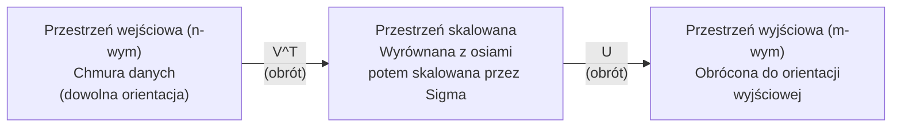
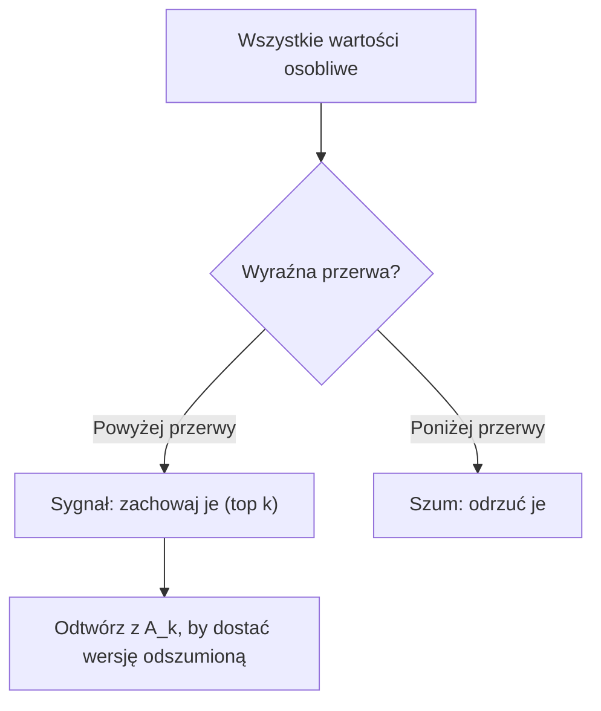

# Rozkład według wartości osobliwych

> SVD to scyzoryk algebry liniowej. Każda macierz ma jeden. Każdy analityk danych potrzebuje jednego.

**Type:** Build
**Languages:** Python, Julia
**Prerequisites:** Phase 1, Lessons 01 (Linear Algebra Intuition), 02 (Vectors & Matrices Operations), 03 (Matrix Transformations)
**Time:** ~120 minut

## Learning Objectives

- Zaimplementuj SVD przez iterację potęgową i wyjaśnij geometryczne znaczenie U, Sigma i V^T
- Zastosuj obcięte SVD do kompresji obrazu i zmierz współczynnik kompresji vs błąd rekonstrukcji
- Oblicz pseudoodwrotność Moore'a-Penrose'a przez SVD do rozwiązywania nadokreślonych układów najmniejszych kwadratów
- Połącz SVD z PCA, systemami rekomendacji (czynniki latentne) i analizą latentną semantyczną w NLP

## Problem

Masz macierz 1000x2000. Może to oceny użytkownik-film. Może to tabela częstości dokument-termin. Może wartości pikseli obrazu. Potrzebujesz ją skompresować, odszumić, znaleźć w niej ukrytą strukturę lub rozwiązać układ najmniejszych kwadratów. Rozkład na wartości własne działa tylko na macierzach kwadratowych. Nawet wtedy wymaga, by macierz miała pełny zestaw liniowo niezależnych wektorów własnych.

SVD działa na dowolnej macierzy. Dowolny kształt. Dowolny rząd. Żadnych warunków. Rozkłada macierz na trzy czynniki, które ujawniają geometrię tego, co macierz robi z przestrzenią. To najogólniejsza i najbardziej użyteczna faktoryzacja w całej algebrze liniowej.

## Koncepcja

### Co SVD robi geometrycznie

Każda macierz, niezależnie od kształtu, wykonuje trzy operacje sekwencyjnie: obrót, skalowanie, obrót. SVD czyni ten rozkład jawnym.

```
A = U * Sigma * V^T

      m x n     m x m    m x n    n x n
     (dowolna)  (obrót)  (skalowanie)  (obrót)
```

Dla dowolnej macierzy A, SVD rozkłada ją na:
- V^T obraca wektory w przestrzeni wejściowej (n-wymiarowej)
- Sigma skaluje wzdłuż każdej osi (rozciąga lub ściska)
- U obraca wynik do przestrzeni wyjściowej (m-wymiarowej)



Myśl o tym w ten sposób. Dajesz SVD macierz. Mówi ci: "Ta macierz bierze sferę wejść, najpierw obraca ją przez V^T, potem rozciąga w elipsoidę przez Sigma, potem obraca elipsoidę przez U." Wartości osobliwe to długości osi elipsoidy.

### Pełny rozkład

Dla macierzy A o kształcie m x n:

```
A = U * Sigma * V^T

gdzie:
  U     to m x m, ortogonalna (U^T U = I)
  Sigma to m x n, diagonalna (wartości osobliwe na diagonali)
  V     to n x n, ortogonalna (V^T V = I)

Wartości osobliwe sigma_1 >= sigma_2 >= ... >= sigma_r > 0
gdzie r = rząd(A)
```

Kolumny U nazywane są lewymi wektorami osobliwymi. Kolumny V nazywane są prawymi wektorami osobliwymi. Elementy diagonalne Sigmy nazywane są wartościami osobliwymi. Są zawsze nieujemne i konwencjonalnie sortowane malejąco.

### Lewe wektory osobliwe, wartości osobliwe, prawe wektory osobliwe

Każda składowa SVD ma odrębne znaczenie geometryczne.

**Prawe wektory osobliwe (kolumny V):** Tworzą bazę ortonormalną dla przestrzeni wejściowej (R^n). Są kierunkami w przestrzeni wejściowej, które macierz mapuje na ortogonalne kierunki w przestrzeni wyjściowej. Myśl o nich jako o naturalnym układzie współrzędnych dla dziedziny.

**Wartości osobliwe (diagonala Sigmy):** To współczynniki skalowania. i-ta wartość osobliwa mówi, jak bardzo macierz rozciąga wektory wzdłuż i-tego prawego wektora osobliwego. Wartość osobliwa zero oznacza, że macierz całkowicie zgniata ten kierunek.

**Lewe wektory osobliwe (kolumny U):** Tworzą bazę ortonormalną dla przestrzeni wyjściowej (R^m). i-ty lewy wektor osobliwy to kierunek w przestrzeni wyjściowej, w którym ląduje i-ty prawy wektor osobliwy (po skalowaniu).

Związek między nimi:

```
A * v_i = sigma_i * u_i

Macierz A bierze i-ty prawy wektor osobliwy v_i,
skaluje go przez sigma_i i mapuje na i-ty lewy wektor osobliwy u_i.
```

To daje współrzędna-po-współrzędnej obraz tego, co robi dowolna macierz.

### Postać iloczynu zewnętrznego

SVD można zapisać jako sumę macierzy rzędu 1:

```
A = sigma_1 * u_1 * v_1^T + sigma_2 * u_2 * v_2^T + ... + sigma_r * u_r * v_r^T

Każdy człon sigma_i * u_i * v_i^T to macierz rzędu 1 (iloczyn zewnętrzny).
Pełna macierz to suma r takich macierzy, gdzie r to rząd.
```

Ta postać jest fundamentem przybliżeń niskiego rzędu. Każdy człon dodaje jedną warstwę struktury. Pierwszy człon przechwytuje pojedynczy najważniejszy wzorzec. Drugi przechwytuje kolejny najważniejszy. I tak dalej. Obcięcie tej sumy daje najlepsze możliwe przybliżenie przy dowolnym danym rzędzie.

```
Rząd 1 przybliżenie:    A_1 = sigma_1 * u_1 * v_1^T
                        (przechwytuje dominujący wzorzec)

Rząd 2 przybliżenie:    A_2 = sigma_1 * u_1 * v_1^T + sigma_2 * u_2 * v_2^T
                        (przechwytuje dwa najważniejsze wzorce)

Rząd k przybliżenie:    A_k = suma top k członów
                        (optymalne na mocy twierdzenia Eckarta-Younga)
```

### Związek z rozkładem na wartości własne

SVD i rozkład na wartości własne są głęboko powiązane. Wartości osobliwe i wektory A pochodzą bezpośrednio z wartości własnych i wektorów własnych A^T A i A A^T.

```
A^T A = V * Sigma^T * U^T * U * Sigma * V^T
      = V * Sigma^T * Sigma * V^T
      = V * D * V^T

gdzie D = Sigma^T * Sigma to macierz diagonalna z sigma_i^2 na diagonali.

Zatem:
- Prawe wektory osobliwe (V) to wektory własne A^T A
- Kwadraty wartości osobliwych (sigma_i^2) to wartości własne A^T A

Podobnie:
A A^T = U * Sigma * V^T * V * Sigma^T * U^T
      = U * Sigma * Sigma^T * U^T

Zatem:
- Lewe wektory osobliwe (U) to wektory własne A A^T
- Wartości własne A A^T to również sigma_i^2
```

Ten związek mówi trzy rzeczy:
1. Wartości osobliwe są zawsze rzeczywiste i nieujemne (są pierwiastkami kwadratowymi wartości własnych macierzy dodatnio półokreślonej).
2. Mógłbyś obliczyć SVD przez rozkład na wartości własne A^T A, ale to podnosi do kwadratu wskaźnik uwarunkowania i traci precyzję numeryczną. Dedykowane algorytmy SVD tego unikają.
3. Gdy A jest kwadratowa i symetryczna dodatnio półokreślona, SVD i rozkład na wartości własne są tym samym.

### Obcięte SVD: przybliżenie niskiego rzędu

Twierdzenie Eckarta-Younga-Mirsky'ego stwierdza, że najlepsze przybliżenie rzędu k do A (w normie Frobeniusa i spektralnej) uzyskuje się przez zachowanie tylko top k wartości osobliwych i odpowiadających im wektorów:

```
A_k = U_k * Sigma_k * V_k^T

gdzie:
  U_k     to m x k  (pierwsze k kolumn U)
  Sigma_k to k x k  (górny-lewy k x k blok Sigmy)
  V_k     to n x k  (pierwsze k kolumn V)

Błąd przybliżenia = sigma_{k+1}  (w normie spektralnej)
                    = sqrt(sigma_{k+1}^2 + ... + sigma_r^2)  (w normie Frobeniusa)
```

To nie jest tylko "dobre" przybliżenie. Jest to udowodnialnie najlepsze możliwe przybliżenie rzędu k. Żadna inna macierz rzędu k nie jest bliższa A.

| Składowa | Względna wielkość | Zachowana w przybliżeniu rzędu 3? |
|-----------|-------------------|------------------------|
| sigma_1 | Największa | Tak |
| sigma_2 | Duża | Tak |
| sigma_3 | Średnio-duża | Tak |
| sigma_4 | Średnia | Nie (błąd) |
| sigma_5 | Średnio-mała | Nie (błąd) |
| sigma_6 | Mała | Nie (błąd) |
| sigma_7 | Bardzo mała | Nie (błąd) |
| sigma_8 | Malutka | Nie (błąd) |

Zachowaj top 3: A_3 przechwytuje trzy największe wartości osobliwe. Błąd = pozostałe wartości (sigma_4 do sigma_8).

Jeśli wartości osobliwe zanikają szybko, małe k przechwytuje większość macierzy. Jeśli zanikają wolno, macierz nie ma struktury niskiego rzędu.

### Kompresja obrazu z SVD

Obraz w skali szarości to macierz intensywności pikseli. Obraz 800x600 ma 480 000 wartości. SVD pozwala przybliżyć go znacznie mniejszą liczbą.

```
Oryginalny obraz: 800 x 600 = 480 000 wartości

SVD z rzędem k:
  U_k:      800 x k wartości
  Sigma_k:  k wartości
  V_k:      600 x k wartości
  Razem:    k * (800 + 600 + 1) = k * 1401 wartości

  k=10:   14 010 wartości   (2.9% oryginału)
  k=50:   70 050 wartości  (14.6% oryginału)
  k=100: 140 100 wartości  (29.2% oryginału)

  Współczynnik kompresji poprawia się, gdy k maleje,
  ale jakość wizualna pogarsza się.
```

Kluczowa intuicja: naturalne obrazy mają szybko zanikające wartości osobliwe. Kilka pierwszych wartości osobliwych przechwytuje szeroką strukturę (kształty, gradienty). Późniejsze przechwytują drobne szczegóły i szum. Obcięcie przy rzędzie 50 często produkuje obraz, który wygląda prawie identycznie jak oryginał, używając 85% mniej pamięci.

### SVD dla systemów rekomendacji

Nagroda Netflixa rozsławiła to. Masz macierz ocen użytkownik-film, gdzie większość elementów brakuje.

```
             Film1  Film2  Film3  Film4  Film5
  Użytkownik1 [  5      ?      3       ?       1  ]
  Użytkownik2 [  ?      4       ?       2       ?  ]
  Użytkownik3 [  3      ?      5       ?       ?  ]
  Użytkownik4 [  ?      ?       ?       4       3  ]

  ? = nieznana ocena
```

Chodzi o to, że ta macierz ocen ma niski rząd. Użytkownicy nie mają całkowicie niezależnych gustów. Jest garstka czynników latentnych (akcja vs dramat, stare vs nowe, intelektualne vs zmysłowe), które wyjaśniają większość preferencji.

SVD na (uzupełnionej) macierzy ocen rozkłada ją na:
- U: profile użytkowników w przestrzeni czynników latentnych
- Sigma: ważność każdego czynnika latentnego
- V^T: profile filmów w przestrzeni czynników latentnych

Przewidywana ocena użytkownika dla filmu to iloczyn skalarny profilu użytkownika z profilem filmu (ważony przez wartości osobliwe). Przybliżenie niskiego rzędu wypełnia brakujące elementy.

W praktyce używa się wariantów takich jak inkrementalne SVD Simona Funka lub ALS (alternujące najmniejsze kwadraty), które obsługują brakujące dane bezpośrednio. Ale główna idea jest ta sama: dekompozycja czynników latentnych przez SVD.

### SVD w NLP: analiza latentnej semantyki

Analiza Latentnej Semantyki (LSA), zwana również Latent Semantic Indexing (LSI), stosuje SVD do macierzy termin-dokument.

```
             Dok1   Dok2   Dok3   Dok4
  "kot"      [  3      0      1      0  ]
  "pies"     [  2      0      0      1  ]
  "ryba"     [  0      4      1      0  ]
  "zwierzę"  [  1      1      1      1  ]
  "ocean"    [  0      3      0      0  ]

Po SVD z rzędem k=2:

  Każdy dokument staje się punktem w 2D "przestrzeni koncepcji".
  Każdy termin staje się punktem w tej samej 2D przestrzeni.
  Dokumenty o podobnych tematach grupują się razem.
  Terminy o podobnych znaczeniach grupują się razem.

  "kot" i "pies" lądują blisko siebie (zwierzęta lądowe).
  "ryba" i "ocean" lądują blisko siebie (koncepcje wodne).
  Dok1 i Dok3 grupują się, jeśli dzielą podobne tematy.
```

LSA była jedną z pierwszych udanych metod przechwytywania podobieństwa semantycznego z surowego tekstu. Działa, ponieważ synonimiczne terminy pojawiają się w podobnych dokumentach, więc SVD grupuje je w te same latentne wymiary. Nowoczesne embeddingi słów (Word2Vec, GloVe) można postrzegać jako potomków tej idei.

### SVD do redukcji szumu

Zaszumione dane mają sygnał skoncentrowany w górnych wartościach osobliwych, a szum rozłożony na wszystkie wartości osobliwe. Obcięcie usuwa poziom szumu.

**Czyste wartości osobliwe sygnału:**

| Składowa | Wielkość | Typ |
|-----------|-----------|------|
| sigma_1 | Bardzo duża | Sygnał |
| sigma_2 | Duża | Sygnał |
| sigma_3 | Średnia | Sygnał |
| sigma_4 | Blisko zera | Pomijalna |
| sigma_5 | Blisko zera | Pomijalna |

**Zaszumione wartości osobliwe sygnału (szum dodaje się do wszystkich):**

| Składowa | Wielkość | Typ |
|-----------|-----------|------|
| sigma_1 | Bardzo duża | Sygnał |
| sigma_2 | Duża | Sygnał |
| sigma_3 | Średnia | Sygnał |
| sigma_4 | Mała | Szum |
| sigma_5 | Mała | Szum |
| sigma_6 | Mała | Szum |
| sigma_7 | Mała | Szum |



Jest to używane w przetwarzaniu sygnałów, pomiarach naukowych i czyszczeniu danych. Za każdym razem, gdy masz macierz zniekształconą przez addytywny szum, obcięte SVD jest zasadniczym sposobem oddzielenia sygnału od szumu.

### Pseudoodwrotność przez SVD

Pseudoodwrotność Moore'a-Penrose'a A+ uogólnia odwracanie macierzy do macierzy niekwadratowych i osobliwych. SVD czyni jej obliczanie trywialnym.

```
Jeśli A = U * Sigma * V^T, to:

A+ = V * Sigma+ * U^T

gdzie Sigma+ jest tworzona przez:
  1. Transponuj Sigmę (zamień wiersze i kolumny)
  2. Zastąp każdy niezerowy element diagonalny sigma_i przez 1/sigma_i
  3. Zostaw zera jako zera

Dla A (m x n):      A+ to (n x m)
Dla Sigmy (m x n):  Sigma+ to (n x m)
```

Pseudoodwrotność rozwiązuje problemy najmniejszych kwadratów. Jeśli Ax = b nie ma dokładnego rozwiązania (układ nadokreślony), to x = A+ b jest rozwiązaniem najmniejszych kwadratów (minimalizuje ||Ax - b||).

```
Układ nadokreślony (więcej równań niż niewiadomych):

  [1  1]         [3]
  [2  1] x   =   [5]       Nie istnieje dokładne rozwiązanie.
  [3  1]         [6]

  x_ls = A+ b = V * Sigma+ * U^T * b

  To daje x, który minimalizuje sumę kwadratów reszt.
  Ten sam wynik co równania normalne (A^T A)^(-1) A^T b,
  ale numerycznie bardziej stabilny.
```

### Zalety stabilności numerycznej

Obliczanie rozkładu na wartości własne A^T A podnosi do kwadratu wartości osobliwe (wartości własne A^T A to sigma_i^2). To podnosi do kwadratu wskaźnik uwarunkowania, amplifikując błędy numeryczne.

```
Przykład:
  A ma wartości osobliwe [1000, 1, 0.001]
  Wskaźnik uwarunkowania A: 1000 / 0.001 = 10^6

  A^T A ma wartości własne [10^6, 1, 10^{-6}]
  Wskaźnik uwarunkowania A^T A: 10^6 / 10^{-6} = 10^{12}

  Obliczanie SVD bezpośrednio: działa ze wskaźnikiem uwarunkowania 10^6
  Obliczanie przez A^T A:     działa ze wskaźnikiem uwarunkowania 10^{12}
                              (6 dodatkowych cyfr precyzji straconych)
```

Nowoczesne algorytmy SVD (bidiagonalizacja Goluba-Kahana) pracują bezpośrednio na A, nigdy nie tworząc A^T A. Dlatego zawsze powinieneś preferować `np.linalg.svd(A)` nad `np.linalg.eig(A.T @ A)`.

### Związek z PCA

PCA TO SVD na wyśrodkowanych danych. To nie analogia. To dosłownie to samo obliczenie.

```
Dana macierz danych X (n_próbek x n_cech), wyśrodkowana (odjęta średnia):

Macierz kowariancji: C = (1/(n-1)) * X^T X

PCA znajduje wektory własne C. Ale:

  X = U * Sigma * V^T    (SVD X)

  X^T X = V * Sigma^2 * V^T

  C = (1/(n-1)) * V * Sigma^2 * V^T

Zatem główne składowe to dokładnie prawe wektory osobliwe V.
Wyjaśniona wariancja dla każdej składowej to sigma_i^2 / (n-1).

W sklearn PCA jest zaimplementowane przy użyciu SVD, nie rozkładu na wartości własne.
Jest szybsze i numerycznie bardziej stabilne.
```

Oznacza to, że wszystko, czego nauczyłeś się o redukcji wymiarowości w Lekcji 10, to SVD pod maską. PCA jest najczęstszym zastosowaniem SVD w uczeniu maszynowym.

```figure
svd-rank-reconstruction
```

## Build It

### Krok 1: SVD od podstaw używając iteracji potęgowej

Pomysł: aby znaleźć największą wartość osobliwą i jej wektory, użyj iteracji potęgowej na A^T A (lub A A^T). Następnie defluj macierz i powtórz dla następnej wartości osobliwej.

```python
import numpy as np

def power_iteration(M, num_iters=100):
    n = M.shape[1]
    v = np.random.randn(n)
    v = v / np.linalg.norm(v)

    for _ in range(num_iters):
        Mv = M @ v
        v = Mv / np.linalg.norm(Mv)

    eigenvalue = v @ M @ v
    return eigenvalue, v

def svd_from_scratch(A, k=None):
    m, n = A.shape
    if k is None:
        k = min(m, n)

    sigmas = []
    us = []
    vs = []

    A_residual = A.copy().astype(float)

    for _ in range(k):
        AtA = A_residual.T @ A_residual
        eigenvalue, v = power_iteration(AtA, num_iters=200)

        if eigenvalue < 1e-10:
            break

        sigma = np.sqrt(eigenvalue)
        u = A_residual @ v / sigma

        sigmas.append(sigma)
        us.append(u)
        vs.append(v)

        A_residual = A_residual - sigma * np.outer(u, v)

    U = np.column_stack(us) if us else np.empty((m, 0))
    S = np.array(sigmas)
    V = np.column_stack(vs) if vs else np.empty((n, 0))

    return U, S, V
```

### Krok 2: Test i porównanie z NumPy

```python
np.random.seed(42)
A = np.random.randn(5, 4)

U_ours, S_ours, V_ours = svd_from_scratch(A)
U_np, S_np, Vt_np = np.linalg.svd(A, full_matrices=False)

print("Nasze wartości osobliwe:", np.round(S_ours, 4))
print("NumPy wartości osobliwe:", np.round(S_np, 4))

A_reconstructed = U_ours @ np.diag(S_ours) @ V_ours.T
print(f"Błąd rekonstrukcji: {np.linalg.norm(A - A_reconstructed):.8f}")
```

### Krok 3: Demo kompresji obrazu

```python
def compress_image_svd(image_matrix, k):
    U, S, Vt = np.linalg.svd(image_matrix, full_matrices=False)
    compressed = U[:, :k] @ np.diag(S[:k]) @ Vt[:k, :]
    return compressed

image = np.random.seed(42)
rows, cols = 200, 300
image = np.random.randn(rows, cols)

for k in [1, 5, 10, 20, 50]:
    compressed = compress_image_svd(image, k)
    error = np.linalg.norm(image - compressed) / np.linalg.norm(image)
    original_size = rows * cols
    compressed_size = k * (rows + cols + 1)
    ratio = compressed_size / original_size
    print(f"k={k:>3d}  błąd={error:.4f}  pamięć={ratio:.1%}")
```

### Krok 4: Redukcja szumu

```python
np.random.seed(42)
clean = np.outer(np.sin(np.linspace(0, 4*np.pi, 100)),
                 np.cos(np.linspace(0, 2*np.pi, 80)))
noise = 0.3 * np.random.randn(100, 80)
noisy = clean + noise

U, S, Vt = np.linalg.svd(noisy, full_matrices=False)
denoised = U[:, :5] @ np.diag(S[:5]) @ Vt[:5, :]

print(f"Błąd zaszumiony:    {np.linalg.norm(noisy - clean):.4f}")
print(f"Błąd odszumiony: {np.linalg.norm(denoised - clean):.4f}")
print(f"Poprawa:    {(1 - np.linalg.norm(denoised - clean) / np.linalg.norm(noisy - clean)):.1%}")
```

### Krok 5: Pseudoodwrotność

```python
A = np.array([[1, 1], [2, 1], [3, 1]], dtype=float)
b = np.array([3, 5, 6], dtype=float)

U, S, Vt = np.linalg.svd(A, full_matrices=False)
S_inv = np.diag(1.0 / S)
A_pinv = Vt.T @ S_inv @ U.T

x_svd = A_pinv @ b
x_lstsq = np.linalg.lstsq(A, b, rcond=None)[0]
x_pinv = np.linalg.pinv(A) @ b

print(f"Rozwiązanie pseudoodwrotności SVD:  {x_svd}")
print(f"Rozwiązanie np.linalg.lstsq:   {x_lstsq}")
print(f"Rozwiązanie np.linalg.pinv:    {x_pinv}")
```

## Use It

Pełne działające dema są w `code/svd.py`. Uruchom je, by zobaczyć SVD zastosowane do kompresji obrazu, systemów rekomendacji, analizy latentnej semantyki i redukcji szumu.

```bash
python svd.py
```

Wersja w Julii w `code/svd.jl` demonstruje te same koncepcje używając natywnej funkcji `svd()` i pakietu `LinearAlgebra`.

```bash
julia svd.jl
```

## Ship It

Ta lekcja produkuje:
- `outputs/skill-svd.md` -- umiejętność wiedzy, kiedy i jak stosować SVD w rzeczywistych projektach

## Ćwiczenia

1. Zaimplementuj pełne SVD od podstaw bez używania iteracji potęgowej. Zamiast tego oblicz rozkład na wartości własne A^T A, by dostać V i wartości osobliwe, a następnie oblicz U = A V Sigma^{-1}. Porównaj dokładność numeryczną z wersją z iteracją potęgową i z NumPy.

2. Załaduj prawdziwy obraz w skali szarości (lub przekonwertuj jeden). Skompresuj go przy rzędach 1, 5, 10, 25, 50, 100. Dla każdego rzędu oblicz współczynnik kompresji i względny błąd. Znajdź rząd, przy którym obraz staje się wizualnie akceptowalny.

3. Zbuduj malutki system rekomendacji. Stwórz macierz ocen użytkownik-film 10x8 z niektórymi znanymi elementami. Wypełnij brakujące elementy średnimi wierszowymi. Oblicz SVD i odtwórz przybliżenie rzędu 3. Użyj odtworzonej macierzy do przewidzenia brakujących ocen. Zweryfikuj, że przewidywania są rozsądne.

4. Stwórz macierz dokument-termin 100x50 z 3 syntetycznymi tematami. Każdy temat ma 5 powiązanych terminów. Dodaj szum. Zastosuj SVD i zweryfikuj, że top 3 wartości osobliwe są znacznie większe niż reszta. Rzutuj dokumenty do 3D przestrzeni latentnej i sprawdź, czy dokumenty z tego samego tematu grupują się razem.

5. Wygeneruj czystą macierz niskiego rzędu (rząd 3, rozmiar 50x40) i dodaj szum Gaussa na różnych poziomach (sigma = 0.1, 0.5, 1.0, 2.0). Dla każdego poziomu szumu znajdź optymalny rząd obcięcia przez przeszukanie k od 1 do 40 i zmierzenie błędu rekonstrukcji względem czystej macierzy. Wykreśl, jak optymalne k zmienia się z poziomem szumu.

## Key Terms

| Termin | Co ludzie mówią | Co naprawdę znaczy |
|------|----------------|----------------------|
| SVD | "Faktoryzuj dowolną macierz" | Rozłóż A na U Sigma V^T, gdzie U i V są ortogonalne, a Sigma diagonalna z nieujemnymi elementami. Działa dla dowolnej macierzy dowolnego kształtu. |
| Wartość osobliwa | "Jak ważna jest ta składowa" | i-ty element diagonalny Sigmy. Mierzy, jak bardzo macierz rozciąga wzdłuż i-tego głównego kierunku. Zawsze nieujemna, sortowana malejąco. |
| Lewy wektor osobliwy | "Kierunek wyjściowy" | Kolumna U. Kierunek w przestrzeni wyjściowej, do którego mapowany jest i-ty prawy wektor osobliwy (po skalowaniu przez sigma_i). |
| Prawy wektor osobliwy | "Kierunek wejściowy" | Kolumna V. Kierunek w przestrzeni wejściowej, który macierz mapuje do i-tego lewego wektora osobliwego (po skalowaniu przez sigma_i). |
| Obcięte SVD | "Przybliżenie niskiego rzędu" | Zachowaj tylko top k wartości osobliwych i ich wektorów. Produkuje udowodnialnie najlepsze przybliżenie rzędu k do oryginalnej macierzy (twierdzenie Eckarta-Younga). |
| Rząd | "Prawdziwa wymiarowość" | Liczba niezerowych wartości osobliwych. Mówi, ile niezależnych kierunków macierz faktycznie używa. |
| Pseudoodwrotność | "Uogólniona odwrotność" | V Sigma+ U^T. Odwraca niezerowe wartości osobliwe, zostawia zera jako zera. Rozwiązuje problemy najmniejszych kwadratów dla macierzy niekwadratowych lub osobliwych. |
| Wskaźnik uwarunkowania | "Jak wrażliwy na błędy" | sigma_max / sigma_min. Duży wskaźnik uwarunkowania oznacza, że małe zmiany wejściowe powodują duże zmiany wyjściowe. SVD ujawnia to bezpośrednio. |
| Czynnik latentny | "Ukryta zmienna" | Wymiar w przestrzeni niskiego rzędu odkryty przez SVD. W rekomendacjach czynnik latentny może odpowiadać preferencji gatunku. W NLP może odpowiadać tematowi. |
| Norma Frobeniusa | "Całkowity rozmiar macierzy" | Pierwiastek kwadratowy z sumy kwadratów elementów. Równa się pierwiastkowi kwadratowemu z sumy kwadratów wartości osobliwych. Używana do mierzenia błędu przybliżenia. |
| Twierdzenie Eckarta-Younga | "SVD daje najlepszą kompresję" | Dla dowolnego docelowego rzędu k, obcięte SVD minimalizuje błąd przybliżenia względem wszystkich możliwych macierzy rzędu k. |
| Iteracja potęgowa | "Znajdź największy wektor własny" | Wielokrotnie mnóż losowy wektor przez macierz i normalizuj. Zbiega do wektora własnego z największą wartością własną. Budulec wielu algorytmów SVD. |