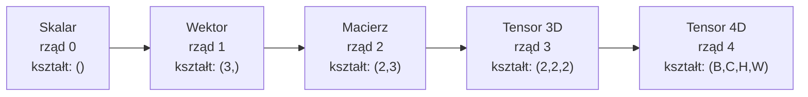
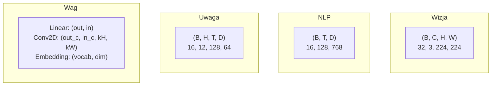
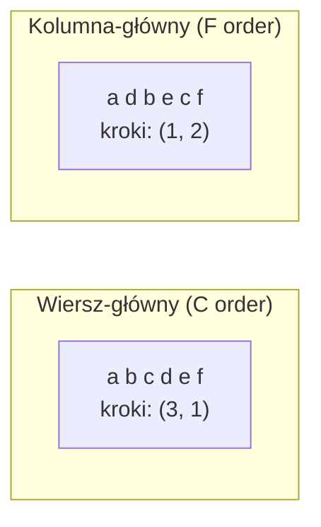
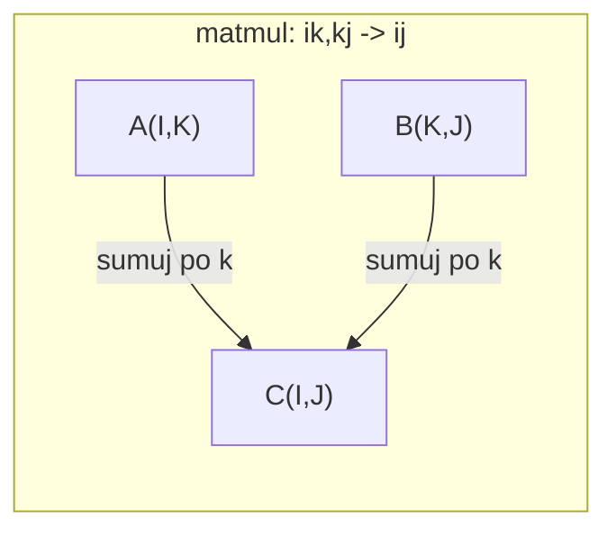

# Operacje na tensorach

> Tensory są wspólnym językiem między danymi a głębokim uczeniem. Każdy obraz, każde zdanie, każdy gradient przez nie przepływa.

**Type:** Build
**Language:** Python
**Prerequisites:** Phase 1, Lessons 01 (Linear Algebra Intuition), 02 (Vectors, Matrices & Operations)
**Time:** ~90 minut

## Learning Objectives

- Zaimplementuj klasę tensora z kształtem, krokami, reshape, transpose i operacjami elementarnymi od podstaw
- Zastosuj reguły broadcastingu do operowania na tensorach różnych kształtów bez kopiowania danych
- Napisz wyrażenia einsum dla iloczynów skalarnych, mnożenia macierzy, iloczynów zewnętrznych i operacji wsadowych
- Prześledź dokładne kształty tensorów przez każdy krok wielogłowicowej uwagi

## Problem

Budujesz transformer. Przejście w przód wygląda czysto. Uruchamiasz go i dostajesz: `RuntimeError: mat1 and mat2 shapes cannot be multiplied (32x768 and 512x768)`. Gapisz się na kształty. Próbujesz transpozycji. Teraz mówi `Expected 4D input (got 3D input)`. Dodajesz unsqueeze. Coś innego się psuje.

Błędy kształtów to najczęstszy błąd w kodzie głębokiego uczenia. Nie są trudne koncepcyjnie -- każda operacja ma kontrakt kształtu -- ale mnożą się szybko. Transformer ma dziesiątki reshape'ów, transpozycji i broadcastów połączonych w łańcuch. Jedna zła oś i błąd kaskaduje. Co gorsza, niektóre błędy kształtów w ogóle nie rzucają błędów. Po cichu produkują śmieci przez broadcast wzdłuż złego wymiaru lub sumowanie po złej osi.

Macierze obsługują relacje parami między dwoma zbiorami rzeczy. Prawdziwe dane nie mieszczą się w dwóch wymiarach. Wsad 32 obrazów RGB w 224x224 to tensor 4D: `(32, 3, 224, 224)`. Samouwaga z 12 głowami jest również 4D: `(wsad, głowy, dł_sekw, wym_głowy)`. Potrzebujesz struktury danych, która uogólnia do dowolnej liczby wymiarów, z operacjami komponującymi się czysto przez wszystkie z nich. Tą strukturą jest tensor. Opanuj jego operacje, a błędy kształtów staną się trywialne do debugowania.

## Koncepcja

### Czym jest tensor

Tensor to wielowymiarowa tablica liczb o jednolitym typie danych. Liczba wymiarów to **rząd** (lub **rzędowość**). Każdy wymiar to **oś**. **Kształt** to krotka podająca rozmiar wzdłuż każdej osi.



Całkowita liczba elementów = iloczyn wszystkich rozmiarów. Kształt `(2, 3, 4)` zawiera `2 * 3 * 4 = 24` elementy.

### Kształty tensorów w głębokim uczeniu

Różne typy danych mapują się na określone kształty tensorów zgodnie z konwencją.



PyTorch używa NCHW (kanały pierwsze). TensorFlow domyślnie NHWC (kanały ostatnie). Niedopasowane układy powodują ciche spowolnienia lub błędy.

### Jak działa układ pamięci

Tablica 2D w pamięci to 1D sekwencja bajtów. **Kroki** mówią, ile elementów pominąć, by przesunąć się o jeden krok wzdłuż każdej osi.



Transpozycja nie przenosi danych. Zamienia kroki, czyniąc tensor **nieciągłym** -- elementy dla wiersza nie są już sąsiednie w pamięci.

### Reguły broadcastingu

Broadcasting pozwala operować na tensorach różnych kształtów bez kopiowania danych. Wyrównaj kształty od prawej. Dwa wymiary są kompatybilne, gdy są równe lub jeden jest 1. Mniej wymiarów jest dopełnianych 1 z lewej strony.

```
Tensor A:     (8, 1, 6, 1)
Tensor B:        (7, 1, 5)
Dopełniony B: (1, 7, 1, 5)
Wynik:       (8, 7, 6, 5)
```

### Einsum: uniwersalna operacja tensorowa

Notacja sumowania Einsteina oznacza każdą oś literą. Osie w wejściu, ale nie w wyjściu, są sumowane. Osie w obu są zachowane.



Kluczowe wzorce: `i,i->` (iloczyn skalarny), `i,j->ij` (iloczyn zewnętrzny), `ii->` (ślad), `ij->ji` (transpozycja), `bij,bjk->bik` (wsadowy matmul), `bhtd,bhsd->bhts` (wyniki uwagi).

```figure
tensor-broadcast
```

## Build It

Kod znajduje się w `code/tensors.py`. Każdy krok odnosi się do implementacji tam.

### Krok 1: Przechowywanie tensorów i kroki

Tensor przechowuje płaską listę liczb plus metadane kształtu. Kroki mówią logice indeksowania, jak mapować wielowymiarowe indeksy na płaskie pozycje.

```python
class Tensor:
    def __init__(self, data, shape=None):
        if isinstance(data, (list, tuple)):
            self._data, self._shape = self._flatten_nested(data)
        elif isinstance(data, np.ndarray):
            self._data = data.flatten().tolist()
            self._shape = tuple(data.shape)
        else:
            self._data = [data]
            self._shape = ()

        if shape is not None:
            total = reduce(lambda a, b: a * b, shape, 1)
            if total != len(self._data):
                raise ValueError(
                    f"Cannot reshape {len(self._data)} elements into shape {shape}"
                )
            self._shape = tuple(shape)

        self._strides = self._compute_strides(self._shape)

    @staticmethod
    def _compute_strides(shape):
        if len(shape) == 0:
            return ()
        strides = [1] * len(shape)
        for i in range(len(shape) - 2, -1, -1):
            strides[i] = strides[i + 1] * shape[i + 1]
        return tuple(strides)
```

Dla kształtu `(3, 4)` kroki to `(4, 1)` -- pomiń 4 elementy, by przejść do następnego wiersza, pomiń 1 element, by przejść do następnej kolumny.

### Krok 2: Reshape, squeeze, unsqueeze

Reshape zmienia kształt bez zmiany kolejności elementów. Całkowita liczba elementów musi pozostać taka sama. Użyj `-1` dla jednego wymiaru, by wywnioskować jego rozmiar.

```python
t = Tensor(list(range(12)), shape=(2, 6))
r = t.reshape((3, 4))
r = t.reshape((-1, 3))
```

Squeeze usuwa osie rozmiaru 1. Unsqueeze wstawia jeden. Unsqueeze jest kluczowe dla broadcastingu -- wektor biasu `(D,)` dodawany do wsadu `(B, T, D)` wymaga unsqueeze do `(1, 1, D)`.

```python
t = Tensor(list(range(6)), shape=(1, 3, 1, 2))
s = t.squeeze()
v = Tensor([1, 2, 3])
u = v.unsqueeze(0)
```

### Krok 3: Transpose i permute

Transpose zamienia dwie osie. Permute zmienia kolejność wszystkich osi. W ten sposób konwertujesz między NCHW a NHWC.

```python
mat = Tensor(list(range(6)), shape=(2, 3))
tr = mat.transpose(0, 1)

t4d = Tensor(list(range(24)), shape=(1, 2, 3, 4))
perm = t4d.permute((0, 2, 3, 1))
```

Po transpozycji lub permute tensor jest nieciągły w pamięci. W PyTorchu `view` zawodzi na nieciągłych tensorach -- użyj `reshape` lub wywołaj `.contiguous()` najpierw.

### Krok 4: Operacje elementarne i redukcje

Operacje elementarne (dodawanie, mnożenie, odejmowanie) stosują się niezależnie do każdego elementu i zachowują kształt. Redukcje (suma, średnia, max) zwijają jedną lub więcej osi.

```python
a = Tensor([[1, 2], [3, 4]])
b = Tensor([[10, 20], [30, 40]])
c = a + b
d = a * 2
s = a.sum(axis=0)
```

Globalne uśrednianie puli w CNN: `(B, C, H, W).mean(axis=[2, 3])` produkuje `(B, C)`. Uśrednianie sekwencji w NLP: `(B, T, D).mean(axis=1)` produkuje `(B, D)`.

### Krok 5: Broadcasting z NumPy

Funkcja `demo_broadcasting_numpy()` w `tensors.py` pokazuje podstawowe wzorce.

```python
activations = np.random.randn(4, 3)
bias = np.array([0.1, 0.2, 0.3])
result = activations + bias

images = np.random.randn(2, 3, 4, 4)
scale = np.array([0.5, 1.0, 1.5]).reshape(1, 3, 1, 1)
result = images * scale

a = np.array([1, 2, 3]).reshape(-1, 1)
b = np.array([10, 20, 30, 40]).reshape(1, -1)
outer = a * b
```

Odległość parami przez broadcasting: przekształć `(M, 2)` na `(M, 1, 2)` i `(N, 2)` na `(1, N, 2)`, odejmij, podnieś do kwadratu, sumuj wzdłuż ostatniej osi, weź pierwiastek kwadratowy. Wynik: `(M, N)`.

### Krok 6: Operacje einsum

Funkcje `demo_einsum()` i `demo_einsum_gallery()` przeprowadzają przez każdy typowy wzorzec.

```python
a = np.array([1.0, 2.0, 3.0])
b = np.array([4.0, 5.0, 6.0])
dot = np.einsum("i,i->", a, b)

A = np.array([[1, 2], [3, 4], [5, 6]], dtype=float)
B = np.array([[7, 8, 9], [10, 11, 12]], dtype=float)
matmul = np.einsum("ik,kj->ij", A, B)

batch_A = np.random.randn(4, 3, 5)
batch_B = np.random.randn(4, 5, 2)
batch_mm = np.einsum("bij,bjk->bik", batch_A, batch_B)
```

Koszt obliczeniowy kontrakcji to iloczyn wszystkich rozmiarów indeksów (zachowanych i sumowanych). Dla `bij,bjk->bik` z B=32, I=128, J=64, K=128: `32 * 128 * 64 * 128 = 33 554 432` mnożeń-dodawań.

### Krok 7: Mechanizm uwagi przez einsum

Funkcja `demo_attention_einsum()` implementuje wielogłowicową uwagę od początku do końca.

```python
B, H, T, D = 2, 4, 8, 16
E = H * D

X = np.random.randn(B, T, E)
W_q = np.random.randn(E, E) * 0.02

Q = np.einsum("bte,ek->btk", X, W_q)
Q = Q.reshape(B, T, H, D).transpose(0, 2, 1, 3)

scores = np.einsum("bhtd,bhsd->bhts", Q, K) / np.sqrt(D)
weights = softmax(scores, axis=-1)
attn_output = np.einsum("bhts,bhsd->bhtd", weights, V)

concat = attn_output.transpose(0, 2, 1, 3).reshape(B, T, E)
output = np.einsum("bte,ek->btk", concat, W_o)
```

Każdy krok to operacja tensorowa: projekcja (matmul przez einsum), dzielenie głów (reshape + transpose), wyniki uwagi (wsadowy matmul przez einsum), ważona suma (wsadowy matmul przez einsum), scalanie głów (transpose + reshape), projekcja wyjściowa (matmul przez einsum).

## Use It

### Od podstaw vs NumPy

| Operacja | Od podstaw (klasa Tensor) | NumPy |
|---|---|---|
| Utwórz | `Tensor([[1,2],[3,4]])` | `np.array([[1,2],[3,4]])` |
| Reshape | `t.reshape((3,4))` | `a.reshape(3,4)` |
| Transpose | `t.transpose(0,1)` | `a.T` lub `a.transpose(0,1)` |
| Squeeze | `t.squeeze(0)` | `np.squeeze(a, 0)` |
| Suma | `t.sum(axis=0)` | `a.sum(axis=0)` |
| Einsum | N/D | `np.einsum("ij,jk->ik", a, b)` |

### Od podstaw vs PyTorch

```python
import torch

t = torch.tensor([[1, 2, 3], [4, 5, 6]], dtype=torch.float32)
t.shape
t.stride()
t.is_contiguous()

t.reshape(3, 2)
t.unsqueeze(0)
t.transpose(0, 1)
t.transpose(0, 1).contiguous()

torch.einsum("ik,kj->ij", A, B)
```

PyTorch dodaje autograd, obsługę GPU i zoptymalizowane jądra BLAS. Semantyka kształtów jest identyczna. Jeśli rozumiesz wersję od podstaw, błędy kształtów w PyTorchu stają się czytelne.

### Każda warstwa sieci neuronowej jako operacja tensorowa

| Operacja | Forma tensorowa | Einsum |
|---|---|---|
| Warstwa liniowa | `Y = X @ W.T + b` | `"bd,od->bo"` + bias |
| Uwaga QKV | `Q = X @ W_q` | `"btd,dh->bth"` |
| Wyniki uwagi | `Q @ K.T / sqrt(d)` | `"bhtd,bhsd->bhts"` |
| Wyjście uwagi | `softmax(scores) @ V` | `"bhts,bhsd->bhtd"` |
| Batch norm | `(X - mu) / sigma * gamma` | elementarne + broadcast |
| Softmax | `exp(x) / sum(exp(x))` | elementarne + redukcja |

## Ship It

Ta lekcja produkuje dwa wielokrotnego użytku prompt:

1. **`outputs/prompt-tensor-shapes.md`** -- Systematyczny prompt do debugowania niezgodności kształtów tensorów. Zawiera tabele decyzyjne dla każdej typowej operacji (matmul, broadcast, cat, Linear, Conv2d, BatchNorm, softmax) i tabelę wyszukiwania poprawek.

2. **`outputs/prompt-tensor-debugger.md`** -- Krokowy prompt debugowania, który wklejasz do dowolnego asystenta AI, gdy błąd kształtu cię blokuje. Podaj mu komunikat błędu i kształty tensorów, dostaniesz dokładną poprawkę.

## Ćwiczenia

1. **Łatwe -- Reshape tam i z powrotem.** Weź tensor kształtu `(2, 3, 4)`. Przekształć go na `(6, 4)`, potem na `(24,)`, potem z powrotem na `(2, 3, 4)`. Zweryfikuj, że kolejność elementów jest zachowana na każdym kroku przez wydrukowanie płaskich danych.

2. **Średnie -- Zaimplementuj broadcasting.** Rozszerz klasę `Tensor` o metodę `broadcast_to(shape)`, która rozszerza wymiary rozmiaru 1, by dopasować docelowy kształt. Następnie zmodyfikuj `_elementwise_op`, by automatycznie broadcastować przed operacją. Przetestuj z kształtami `(3, 1)` i `(1, 4)` produkującymi `(3, 4)`.

3. **Trudne -- Zbuduj einsum od podstaw.** Zaimplementuj podstawową funkcję `einsum(subscripts, *tensors)`, która obsługuje przynajmniej: iloczyn skalarny (`i,i->`), mnożenie macierzy (`ij,jk->ik`), iloczyn zewnętrzny (`i,j->ij`) i transpozycję (`ij->ji`). Sparsuj string z subscriptami, zidentyfikuj indeksy kontraktowane i przejdź przez wszystkie kombinacje indeksów. Porównaj wyniki z `np.einsum`.

4. **Trudne -- Śledzenie kształtów uwagi.** Napisz funkcję, która przyjmuje `batch_size`, `seq_len`, `embed_dim` i `num_heads` jako wejścia i wypisuje dokładny kształt na każdym kroku wielogłowicowej uwagi: wejście, projekcja Q/K/V, podział głów, wyniki uwagi, wagi softmax, ważona suma, scalanie głów, projekcja wyjściowa. Zweryfikuj względem wyjścia `demo_attention_einsum()`.

## Key Terms

| Termin | Co ludzie mówią | Co naprawdę znaczy |
|---|---|---|
| Tensor | "Macierz, ale więcej wymiarów" | Wielowymiarowa tablica o jednolitym typie i zdefiniowanym kształcie, krokach i operacjach |
| Rząd | "Liczba wymiarów" | Liczba osi. Macierz ma rząd 2, a nie rząd równy swojemu rzędowi macierzowemu |
| Kształt | "Rozmiar tensora" | Krotka podająca rozmiar wzdłuż każdej osi. `(2, 3)` oznacza 2 wiersze, 3 kolumny |
| Krok | "Jak ułożona jest pamięć" | Liczba elementów do pominięcia, by przesunąć się o jedną pozycję wzdłuż każdej osi |
| Broadcasting | "Jakoś działa, gdy kształty się różnią" | Surowe reguły: wyrównaj od prawej, wymiary muszą być równe lub jeden musi być 1 |
| Ciągły | "Tensor jest normalny" | Elementy przechowywane sekwencyjnie w pamięci bez przerw ani zmiany kolejności od logicznego układu |
| Einsum | "Wymyślny sposób pisania matmul" | Ogólna notacja wyrażająca dowolną kontrakcję tensorową, iloczyn zewnętrzny, ślad lub transpozycję w jednej linii |
| View | "To samo co reshape" | Tensor współdzielący ten sam bufor pamięci, ale z innymi metadanymi kształtu/kroków. Zawodzi na nieciągłych danych |
| Kontrakcja | "Sumowanie po indeksie" | Ogólna operacja, gdzie wspólny indeks między tensorami jest mnożony i sumowany, produkując wynik niższego rzędu |
| NCHW / NHWC | "Format PyTorch vs TensorFlow" | Konwencje układu pamięci dla tensorów obrazów. NCHW umieszcza kanały przed wymiarami przestrzennymi, NHWC po |