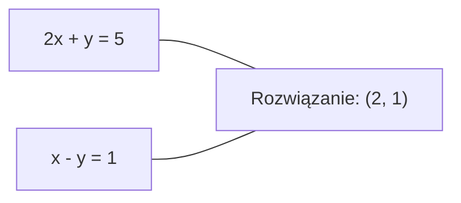
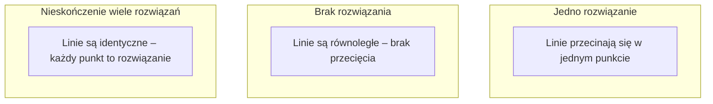

# Układy liniowe

> Rozwiązywanie Ax = b to najstarszy problem w matematyce, który wciąż napędza twoją sieć neuronową.

**Type:** Build
**Language:** Python
**Prerequisites:** Phase 1, Lessons 01 (Linear Algebra Intuition), 02 (Vectors & Matrices), 03 (Matrix Transformations)
**Time:** ~120 minut

## Learning Objectives

- Rozwiąż Ax = b używając eliminacji Gaussa z częściowym wyborem elementu podstawowego i podstawianiem wstecznym
- Faktoryzuj macierze przez dekompozycję LU, QR i Cholesky'ego i wyjaśnij, kiedy każda jest odpowiednia
- Wyprowadź równania normalne dla najmniejszych kwadratów i połącz je z regresją liniową i grzbietową
- Zdiagnozuj źle uwarunkowane układy używając wskaźnika uwarunkowania i zastosuj regularyzację do ich stabilizacji

## Problem

Za każdym razem, gdy trenujesz regresję liniową, rozwiązujesz układ liniowy. Za każdym razem, gdy obliczasz dopasowanie najmniejszych kwadratów, rozwiązujesz układ liniowy. Za każdym razem, gdy warstwa sieci neuronowej oblicza `y = Wx + b`, oblicza ona jedną stronę układu liniowego. Gdy dodajesz regularyzację, modyfikujesz układ. Gdy używasz procesów Gaussa, faktoryzujesz macierz. Gdy odwracasz macierz kowariancji dla odległości Mahalanobisa, rozwiązujesz układ liniowy.

Równanie Ax = b pojawia się wszędzie. A to macierz znanych współczynników. b to wektor znanych wyjść. x to wektor niewiadomych, które chcesz znaleźć. W regresji liniowej A to macierz danych, b to wektor celu, a x to wektor wag. Cały model sprowadza się do: znajdź x takie, że Ax jest możliwie blisko b.

Ta lekcja buduje każdą główną metodę rozwiązywania tego równania od podstaw. Zrozumiesz, dlaczego niektóre metody są szybkie, a inne stabilne, dlaczego niektóre działają tylko dla kwadratowych układów, a inne obsługują nadokreślone, i dlaczego wskaźnik uwarunkowania twojej macierzy określa, czy twoja odpowiedź w ogóle cokolwiek znaczy.

## Koncepcja

### Co Ax = b oznacza geometrycznie

Układ równań liniowych ma geometryczną interpretację. Każde równanie definiuje hiperpłaszczyznę. Rozwiązanie to punkt (lub zbiór punktów), gdzie wszystkie hiperpłaszczyzny się przecinają.

```
2x + y = 5          Dwie linie w 2D.
x - y  = 1          Przecinają się w x=2, y=1.
```



Trzy rzeczy mogą się zdarzyć:



W formie macierzowej "jedno rozwiązanie" oznacza, że A jest odwracalna. "Brak rozwiązania" oznacza, że układ jest sprzeczny. "Nieskończenie wiele rozwiązań" oznacza, że A ma przestrzeń zerową. Większość problemów ML wpada w kategorię "brak dokładnego rozwiązania", ponieważ masz więcej równań (punktów danych) niż niewiadomych (parametrów). Tu wchodzą najmniejsze kwadraty.

### Obraz kolumnowy vs obraz wierszowy

Są dwa sposoby czytania Ax = b.

**Obraz wierszowy.** Każdy wiersz A definiuje jedno równanie. Każde równanie to hiperpłaszczyzna. Rozwiązanie to miejsce, gdzie wszystkie się przecinają.

**Obraz kolumnowy.** Każda kolumna A to wektor. Pytanie brzmi: jaka liniowa kombinacja kolumn A produkuje b?

```
A = | 2  1 |    b = | 5 |
    | 1 -1 |        | 1 |

Obraz wierszowy: rozwiąż 2x + y = 5 i x - y = 1 jednocześnie.

Obraz kolumnowy: znajdź x1, x2 takie, że:
  x1 * [2, 1] + x2 * [1, -1] = [5, 1]
  2 * [2, 1] + 1 * [1, -1] = [4+1, 2-1] = [5, 1]   zgadza się.
```

Obraz kolumnowy jest bardziej fundamentalny. Jeśli b leży w przestrzeni kolumn A, układ ma rozwiązanie. Jeśli b nie leży, znajdujesz najbliższy punkt w przestrzeni kolumn. Ten najbliższy punkt to rozwiązanie najmniejszych kwadratów.

### Eliminacja Gaussa

Eliminacja Gaussa przekształca Ax = b w górny trójkątny układ Ux = c, który rozwiązujesz przez podstawianie wsteczne. To najbardziej bezpośrednia metoda.

Algorytm:

```
1. Dla każdej kolumny k (kolumna główna):
   a. Znajdź największy wpis w kolumnie k na lub poniżej wiersza k (częściowy wybór główny).
   b. Zamień ten wiersz z wierszem k.
   c. Dla każdego wiersza i poniżej k:
      - Oblicz mnożnik m = A[i][k] / A[k][k]
      - Odejmij m razy wiersz k od wiersza i.
2. Podstawianie wsteczne: rozwiązuj od ostatniego równania w górę.
```

Przykład:

```
Oryginał:
| 2  1  1 | 8 |       R2 = R2 - (2)R1     | 2  1   1 |  8 |
| 4  3  3 |20 |  -->  R3 = R3 - (1)R1 --> | 0  1   1 |  4 |
| 2  3  1 |12 |                            | 0  2   0 |  4 |

                       R3 = R3 - (2)R2     | 2  1   1 |  8 |
                                       --> | 0  1   1 |  4 |
                                           | 0  0  -2 | -4 |

Podstawianie wsteczne:
  -2 * x3 = -4    -->  x3 = 2
  x2 + 2  = 4     -->  x2 = 2
  2*x1 + 2 + 2 = 8 --> x1 = 2
```

Eliminacja Gaussa kosztuje O(n^3) operacji. Dla układu 1000x1000 to około miliard operacji zmiennoprzecinkowych. Szybko, ale możesz zrobić lepiej, jeśli potrzebujesz rozwiązać wiele układów z tym samym A.

### Częściowy wybór główny: dlaczego ma znaczenie

Bez wyboru głównego eliminacja Gaussa może zawieść lub produkować śmieci. Jeśli element główny jest zerem, dzielisz przez zero. Jeśli jest mały, amplifikujesz błędy zaokrągleń.

```
Zły element główny:              Z częściowym wyborem głównym:
| 0.001  1 | 1.001 |            Zamień wiersze najpierw:
| 1      1 | 2     |            | 1      1 | 2     |
                                 | 0.001  1 | 1.001 |
m = 1/0.001 = 1000               m = 0.001/1 = 0.001
R2 = R2 - 1000*R1                R2 = R2 - 0.001*R1
| 0.001  1     | 1.001   |      | 1      1     | 2     |
| 0     -999   | -999.0  |      | 0      0.999 | 0.999 |

x2 = 1.000 (poprawne)            x2 = 1.000 (poprawne)
x1 = (1.001 - 1)/0.001           x1 = (2 - 1)/1 = 1.000 (poprawne)
   = 0.001/0.001 = 1.000         Stabilne, bo mnożnik jest mały.
```

W arytmetyce zmiennoprzecinkowej z ograniczoną precyzją wersja bez wyboru głównego może stracić znaczące cyfry. Częściowy wybór główny zawsze wybiera największy dostępny element główny, by zminimalizować amplifikację błędu.

### Dekompozycja LU

Dekompozycja LU rozkłada A na dolną trójkątną macierz L i górną trójkątną macierz U: A = LU. Macierz L przechowuje mnożniki z eliminacji Gaussa. Macierz U to wynik eliminacji.

```
A = L @ U

| 2  1  1 |   | 1  0  0 |   | 2  1   1 |
| 4  3  3 | = | 2  1  0 | @ | 0  1   1 |
| 2  3  1 |   | 1  2  1 |   | 0  0  -2 |
```

Po co faktoryzować zamiast tylko eliminować? Ponieważ gdy masz L i U, rozwiązanie Ax = b dla dowolnego nowego b kosztuje tylko O(n^2):

```
Ax = b
LUx = b
Niech y = Ux:
  Ly = b    (podstawianie w przód, O(n^2))
  Ux = y    (podstawianie wstecz, O(n^2))
```

Koszt O(n^3) jest płacony raz podczas faktoryzacji. Każde kolejne rozwiązanie to O(n^2). Jeśli potrzebujesz rozwiązać 1000 układów z tym samym A, ale różnymi wektorami b, LU oszczędza czynnik 1000/3 całkowitej pracy.

Z częściowym wyborem głównym dostajesz PA = LU, gdzie P to macierz permutacji rejestrująca zamiany wierszy.

### Dekompozycja QR

Dekompozycja QR rozkłada A na ortogonalną macierz Q i górną trójkątną macierz R: A = QR.

Ortogonalna macierz ma własność Q^T Q = I. Jej kolumny to wektory ortonormalne. Mnożenie przez Q zachowuje długości i kąty.

```
A = Q @ R

Q ma ortonormalne kolumny: Q^T Q = I
R jest górna trójkątna

Aby rozwiązać Ax = b:
  QRx = b
  Rx = Q^T b    (po prostu pomnóż przez Q^T, żadne odwracanie nie potrzebne)
  Podstawianie wsteczne, by dostać x.
```

QR jest numerycznie bardziej stabilny niż LU do rozwiązywania problemów najmniejszych kwadratów. Proces Grama-Schmidta buduje Q kolumna po kolumnie:

```
Dane kolumny a1, a2, ... z A:

q1 = a1 / ||a1||

q2 = a2 - (a2 . q1) * q1        (odejmij rzut na q1)
q2 = q2 / ||q2||                (normalizuj)

q3 = a3 - (a3 . q1) * q1 - (a3 . q2) * q2
q3 = q3 / ||q3||

R[i][j] = qi . aj    dla i <= j
```

Każdy krok usuwa składową wzdłuż wszystkich poprzednich q, pozostawiając tylko nowy ortogonalny kierunek.

### Dekompozycja Cholesky'ego

Gdy A jest symetryczna (A = A^T) i dodatnio określona (wszystkie wartości własne dodatnie), możesz rozłożyć ją jako A = L L^T, gdzie L jest dolna trójkątna. To dekompozycja Cholesky'ego.

```
A = L @ L^T

| 4  2 |   | 2  0 |   | 2  1 |
| 2  5 | = | 1  2 | @ | 0  2 |

L[i][i] = sqrt(A[i][i] - sum(L[i][k]^2 dla k < i))
L[i][j] = (A[i][j] - sum(L[i][k]*L[j][k] dla k < j)) / L[j][j]    dla i > j
```

Cholesky jest dwa razy szybszy niż LU i wymaga połowy pamięci. Działa tylko dla symetrycznych dodatnio określonych macierzy, ale te pojawiają się stale:

- Macierze kowariancji są symetryczne dodatnio półokreślone (dodatnio określone z regularyzacją).
- Macierz jądra w procesach Gaussa jest symetryczna dodatnio określona.
- Hessian funkcji wypukłej w minimum jest symetryczny dodatnio określony.
- A^T A jest zawsze symetryczne dodatnio półokreślone.

W procesach Gaussa faktoryzujesz macierz jądra K przez Cholesky'ego, a następnie rozwiązujesz K alpha = y, by dostać średnią predykcyjną. Czynnik Cholesky'ego daje również log-wyznacznik dla wiarygodności brzegowej: log det(K) = 2 * sum(log(diag(L))).

### Najmniejsze kwadraty: gdy Ax = b nie ma dokładnego rozwiązania

Jeśli A jest m x n z m > n (więcej równań niż niewiadomych), układ jest nadokreślony. Nie ma dokładnego rozwiązania. Zamiast tego minimalizujesz błąd kwadratowy:

```
minimalizuj ||Ax - b||^2

To jest suma kwadratów reszt:
  sum((A[i,:] @ x - b[i])^2 dla i w zakresie(m))
```

Minimalizator spełnia równania normalne:

```
A^T A x = A^T b
```

Wyprowadzenie: rozwiń ||Ax - b||^2 = (Ax - b)^T (Ax - b) = x^T A^T A x - 2 x^T A^T b + b^T b. Weź gradient względem x, ustaw na zero: 2 A^T A x - 2 A^T b = 0.

```
Oryginalny układ (nadokreślony, 4 równania, 2 niewiadome):
| 1  1 |         | 3 |
| 1  2 | x     = | 5 |       Żaden dokładny x nie spełnia wszystkich 4 równań.
| 1  3 |         | 6 |
| 1  4 |         | 8 |

Równania normalne:
A^T A = | 4  10 |    A^T b = | 22 |
        | 10 30 |            | 63 |

Rozwiąż: x = [1.5, 1.7]

To jest regresja liniowa. x[0] to wyraz wolny, x[1] to nachylenie.
```

### Równania normalne = regresja liniowa

Związek jest dokładny. W regresji liniowej twoja macierz danych X ma jeden wiersz na próbkę i jedną kolumnę na cechę. Twój wektor celu y ma jeden wpis na próbkę. Wektor wag w spełnia:

```
X^T X w = X^T y
w = (X^T X)^(-1) X^T y
```

To jest rozwiązanie w postaci zamkniętej dla regresji liniowej. Każde wywołanie `sklearn.linear_model.LinearRegression.fit()` oblicza to (lub odpowiednik przez QR lub SVD).

Dodaj człon regularyzacji lambda * I do macierzy i dostajesz regresję grzbietową:

```
(X^T X + lambda * I) w = X^T y
w = (X^T X + lambda * I)^(-1) X^T y
```

Regularyzacja sprawia, że macierz jest lepiej uwarunkowana (łatwiejsza do dokładnego odwrócenia) i zapobiega przeuczeniu przez zmniejszanie wag w kierunku zera. Macierz X^T X + lambda * I jest zawsze symetryczna dodatnio określona, gdy lambda > 0, więc możesz użyć Cholesky'ego do jej rozwiązania.

### Pseudoodwrotność (Moore'a-Penrose'a)

Pseudoodwrotność A+ uogólnia odwracanie macierzy do macierzy niekwadratowych i osobliwych. Dla dowolnej macierzy A:

```
x = A+ b

gdzie A+ = V Sigma+ U^T    (obliczone przez SVD)
```

Sigma+ jest tworzona przez wzięcie odwrotności każdej niezerowej wartości osobliwej i transpozycję wyniku. Jeśli A = U Sigma V^T, to A+ = V Sigma+ U^T.

```
A = U Sigma V^T        (SVD)

Sigma = | 5  0 |       Sigma+ = | 1/5  0  0 |
        | 0  2 |                | 0  1/2  0 |
        | 0  0 |

A+ = V Sigma+ U^T
```

Pseudoodwrotność daje rozwiązanie najmniejszych kwadratów o minimalnej normie. Jeśli układ ma:
- Jedno rozwiązanie: A+ b daje je.
- Brak rozwiązania: A+ b daje rozwiązanie najmniejszych kwadratów.
- Nieskończenie wiele rozwiązań: A+ b daje to z najmniejszym ||x||.

NumPy `np.linalg.lstsq` i `np.linalg.pinv` oba używają wewnętrznie SVD.

### Wskaźnik uwarunkowania

Wskaźnik uwarunkowania mierzy, jak wrażliwe jest rozwiązanie na małe zmiany wejścia. Dla macierzy A wskaźnik uwarunkowania to:

```
kappa(A) = ||A|| * ||A^(-1)|| = sigma_max / sigma_min
```

gdzie sigma_max i sigma_min to największa i najmniejsza wartość osobliwa.

```
Dobrze uwarunkowane (kappa ~ 1):        Źle uwarunkowane (kappa ~ 10^15):
Mała zmiana b -->                       Mała zmiana b -->
mała zmiana x                           ogromna zmiana x

| 2  0 |   kappa = 2/1 = 2          | 1   1          |   kappa ~ 10^15
| 0  1 |   bezpieczne do rozwiązania | 1   1+10^(-15) |   rozwiązanie to śmieci
```

Reguły kciuka:
- kappa < 100: bezpieczne, rozwiązanie jest dokładne.
- kappa ~ 10^k: tracisz około k cyfr precyzji z arytmetyki zmiennoprzecinkowej.
- kappa ~ 10^16 (dla float64): rozwiązanie jest bez znaczenia. Macierz jest efektywnie osobliwa.

W ML złe uwarunkowanie występuje, gdy cechy są prawie współliniowe. Regularyzacja (dodanie lambda * I) poprawia wskaźnik uwarunkowania z sigma_max / sigma_min do (sigma_max + lambda) / (sigma_min + lambda).

### Metody iteracyjne: gradient sprzężony

Dla bardzo dużych rzadkich układów (miliony niewiadomych), metody bezpośrednie jak LU czy Cholesky są zbyt kosztowne. Metody iteracyjne przybliżają rozwiązanie przez poprawianie zgadnięcia przez wiele iteracji.

Gradient sprzężony (CG) rozwiązuje Ax = b, gdy A jest symetryczna dodatnio określona. Znajduje dokładne rozwiązanie w co najwyżej n iteracjach (w dokładnej arytmetyce), ale typowo zbiega znacznie szybciej, jeśli wartości własne A są skupione.

```
Szkic algorytmu:
  x0 = początkowe zgadnięcie (często zero)
  r0 = b - A x0           (reszta)
  p0 = r0                 (kierunek poszukiwań)

  Dla k = 0, 1, 2, ...:
    alpha = (rk . rk) / (pk . A pk)
    x_{k+1} = xk + alpha * pk
    r_{k+1} = rk - alpha * A pk
    beta = (r_{k+1} . r_{k+1}) / (rk . rk)
    p_{k+1} = r_{k+1} + beta * pk
    if ||r_{k+1}|| < tolerancja: stop
```

CG jest używany w:
- Optymalizacji na dużą skalę (metoda Newtona-CG)
- Rozwiązywaniu dyskretyzacji PDE
- Metodach jądrowych, gdzie macierz jądra jest zbyt duża do faktoryzacji
- Preconditioningu dla innych solverów iteracyjnych

Szybkość zbieżności zależy od wskaźnika uwarunkowania. Lepiej uwarunkowane układy zbiegają szybciej, co jest kolejnym powodem, dla którego regularyzacja pomaga.

### Pełny obraz: która metoda kiedy

| Metoda | Wymagania | Koszt | Zastosowanie |
|--------|-------------|------|----------|
| Eliminacja Gaussa | Kwadratowa, nieosobliwa A | O(n^3) | Jednorazowe rozwiązanie kwadratowego układu |
| Dekompozycja LU | Kwadratowa, nieosobliwa A | O(n^3) faktoryzacja + O(n^2) rozwiązanie | Wiele rozwiązań z tym samym A |
| Dekompozycja QR | Dowolna A (m >= n) | O(mn^2) | Najmniejsze kwadraty, numerycznie stabilne |
| Cholesky | Symetryczna dodatnio określona A | O(n^3/3) | Macierze kowariancji, procesy Gaussa, regresja grzbietowa |
| Równania normalne | Nadokreślony (m > n) | O(mn^2 + n^3) | Regresja liniowa (małe n) |
| SVD / pseudoodwrotność | Dowolna A | O(mn^2) | Układy deficytowe rangowo, rozwiązania minimalnej normy |
| Gradient sprzężony | Symetryczna dodatnio określona, rzadka A | O(n * k * nnz) | Duże rzadkie układy, k = iteracje |

### Związek z ML

Każda metoda w tej lekcji pojawia się w produkcyjnym ML:

**Regresja liniowa.** Rozwiązanie w postaci zamkniętej rozwiązuje równania normalne X^T X w = X^T y. To jest robione przez Cholesky'ego (jeśli n jest małe) lub QR (jeśli stabilność numeryczna ma znaczenie) lub SVD (jeśli macierz może być deficytowa rangowo).

**Regresja grzbietowa.** Dodaje lambda * I do X^T X. Regularyzowany układ (X^T X + lambda * I) w = X^T y jest zawsze rozwiązywalny przez Cholesky'ego, ponieważ X^T X + lambda * I jest symetryczny dodatnio określony dla lambda > 0.

**Procesy Gaussa.** Średnia predykcyjna wymaga rozwiązania K alpha = y, gdzie K to macierz jądra. Faktoryzacja Cholesky'ego K jest standardowym podejściem. Logarytm wiarygodności brzegowej używa log det(K) = 2 sum(log(diag(L))).

**Inicjalizacja sieci neuronowych.** Ortogonalna inicjalizacja używa dekompozycji QR do tworzenia macierzy wag, których kolumny są ortonormalne. Zapobiega to załamywaniu się sygnału w głębokich sieciach.

**Preconditioning.** Optymalizatory na dużą skalę używają niepełnego Cholesky'ego lub niepełnego LU jako preconditionerów dla solverów gradientu sprzężonego.

**Inżynieria cech.** Wskaźnik uwarunkowania X^T X mówi, czy twoje cechy są współliniowe. Jeśli kappa jest duże, usuń cechy lub dodaj regularyzację.

```figure
linear-system-conditioning
```

## Build It

### Krok 1: Eliminacja Gaussa z częściowym wyborem głównym

```python
import numpy as np

def gaussian_elimination(A, b):
    n = len(b)
    Ab = np.hstack([A.astype(float), b.reshape(-1, 1).astype(float)])

    for k in range(n):
        max_row = k + np.argmax(np.abs(Ab[k:, k]))
        Ab[[k, max_row]] = Ab[[max_row, k]]

        if abs(Ab[k, k]) < 1e-12:
            raise ValueError(f"Matrix is singular or nearly singular at pivot {k}")

        for i in range(k + 1, n):
            m = Ab[i, k] / Ab[k, k]
            Ab[i, k:] -= m * Ab[k, k:]

    x = np.zeros(n)
    for i in range(n - 1, -1, -1):
        x[i] = (Ab[i, -1] - Ab[i, i+1:n] @ x[i+1:n]) / Ab[i, i]

    return x
```

### Krok 2: Dekompozycja LU

```python
def lu_decompose(A):
    n = A.shape[0]
    L = np.eye(n)
    U = A.astype(float).copy()
    P = np.eye(n)

    for k in range(n):
        max_row = k + np.argmax(np.abs(U[k:, k]))
        if max_row != k:
            U[[k, max_row]] = U[[max_row, k]]
            P[[k, max_row]] = P[[max_row, k]]
            if k > 0:
                L[[k, max_row], :k] = L[[max_row, k], :k]

        for i in range(k + 1, n):
            L[i, k] = U[i, k] / U[k, k]
            U[i, k:] -= L[i, k] * U[k, k:]

    return P, L, U

def lu_solve(P, L, U, b):
    n = len(b)
    Pb = P @ b.astype(float)

    y = np.zeros(n)
    for i in range(n):
        y[i] = Pb[i] - L[i, :i] @ y[:i]

    x = np.zeros(n)
    for i in range(n - 1, -1, -1):
        x[i] = (y[i] - U[i, i+1:] @ x[i+1:]) / U[i, i]

    return x
```

### Krok 3: Dekompozycja Cholesky'ego

```python
def cholesky(A):
    n = A.shape[0]
    L = np.zeros_like(A, dtype=float)

    for i in range(n):
        for j in range(i + 1):
            s = A[i, j] - L[i, :j] @ L[j, :j]
            if i == j:
                if s <= 0:
                    raise ValueError("Matrix is not positive definite")
                L[i, j] = np.sqrt(s)
            else:
                L[i, j] = s / L[j, j]

    return L
```

### Krok 4: Najmniejsze kwadraty przez równania normalne

```python
def least_squares_normal(A, b):
    AtA = A.T @ A
    Atb = A.T @ b
    return gaussian_elimination(AtA, Atb)

def ridge_regression(A, b, lam):
    n = A.shape[1]
    AtA = A.T @ A + lam * np.eye(n)
    Atb = A.T @ b
    L = cholesky(AtA)
    y = np.zeros(n)
    for i in range(n):
        y[i] = (Atb[i] - L[i, :i] @ y[:i]) / L[i, i]
    x = np.zeros(n)
    for i in range(n - 1, -1, -1):
        x[i] = (y[i] - L.T[i, i+1:] @ x[i+1:]) / L.T[i, i]
    return x
```

### Krok 5: Wskaźnik uwarunkowania

```python
def condition_number(A):
    U, S, Vt = np.linalg.svd(A)
    return S[0] / S[-1]
```

## Use It

Składanie wszystkiego razem dla regresji liniowej i grzbietowej na prawdziwych danych:

```python
np.random.seed(42)
X_raw = np.random.randn(100, 3)
w_true = np.array([2.0, -1.0, 0.5])
y = X_raw @ w_true + np.random.randn(100) * 0.1

X = np.column_stack([np.ones(100), X_raw])

w_ols = least_squares_normal(X, y)
print(f"Wagi OLS (nasze):    {w_ols}")

w_np = np.linalg.lstsq(X, y, rcond=None)[0]
print(f"Wagi OLS (numpy):   {w_np}")
print(f"Maksymalna różnica: {np.max(np.abs(w_ols - w_np)):.2e}")

w_ridge = ridge_regression(X, y, lam=1.0)
print(f"Wagi Ridge (nasze):  {w_ridge}")

from sklearn.linear_model import Ridge
ridge_sk = Ridge(alpha=1.0, fit_intercept=False)
ridge_sk.fit(X, y)
print(f"Wagi Ridge (sklearn): {ridge_sk.coef_}")
```

## Ship It

Ta lekcja produkuje:
- `code/linear_systems.py` zawierające implementacje od podstaw eliminacji Gaussa, dekompozycji LU, dekompozycji Cholesky'ego, najmniejszych kwadratów i regresji grzbietowej
- Działającą demonstrację, że równania normalne i sklearn LinearRegression produkują te same wagi

## Ćwiczenia

1. Rozwiąż układ `[[1,2,3],[4,5,6],[7,8,10]] x = [6, 15, 27]` używając swojej eliminacji Gaussa, swojego solvera LU i `np.linalg.solve`. Zweryfikuj, że wszystkie trzy dają tę samą odpowiedź w granicach tolerancji zmiennoprzecinkowej.

2. Wygeneruj losową macierz X 50x5 i cel y = X @ w_true + szum. Rozwiąż dla w używając równań normalnych, QR (przez `np.linalg.qr`), SVD (przez `np.linalg.svd`) i `np.linalg.lstsq`. Porównaj wszystkie cztery rozwiązania. Zmierz wskaźnik uwarunkowania X^T X i wyjaśnij, jak wpływa na to, której metodzie ufasz.

3. Stwórz prawie osobliwą macierz przez uczynienie dwóch kolumn prawie identycznymi (np. kolumna 2 = kolumna 1 + 1e-10 * szum). Oblicz jej wskaźnik uwarunkowania. Rozwiąż Ax = b z i bez regularyzacji (dodaj 0.01 * I). Porównaj rozwiązania i reszty. Wyjaśnij, dlaczego regularyzacja pomaga.

4. Zaimplementuj algorytm gradientu sprzężonego dla losowej 100x100 symetrycznej dodatnio określonej macierzy. Policz, ile iteracji potrzeba do zbieżności z tolerancją 1e-8. Porównaj z teoretycznym maksimum n iteracji.

5. Zmierz czas swojego solvera Cholesky'ego vs swojego solvera LU vs `np.linalg.solve` na symetrycznych dodatnio określonych macierzach rozmiaru 10, 50, 200, 500. Wykreśl wyniki. Zweryfikuj, że Cholesky jest z grubsza 2x szybsze niż LU.

## Key Terms

| Termin | Co ludzie mówią | Co naprawdę znaczy |
|------|----------------|----------------------|
| Układ liniowy | "Rozwiąż dla x" | Zestaw równań liniowych Ax = b. Znalezienie x oznacza znalezienie wejścia, które produkuje wyjście b pod przekształceniem A. |
| Eliminacja Gaussa | "Redukcja wierszowa" | Systematyczne zerowanie wpisów poniżej diagonali używając operacji wierszowych, produkujące górny układ trójkątny rozwiązywalny przez podstawianie wsteczne. O(n^3). |
| Częściowy wybór główny | "Zamień wiersze dla stabilności" | Przed eliminacją w kolumnie k, zamień wiersz z największą wartością bezwzględną w tej kolumnie na pozycję główną. Zapobiega dzieleniu przez małe liczby. |
| Dekompozycja LU | "Faktoryzuj na trójkąty" | Zapisz A = LU, gdzie L jest dolna trójkątna (przechowuje mnożniki), a U jest górna trójkątna (zmacierz eliminowana). Amortyzuje koszt O(n^3) przez wiele rozwiązań. |
| Dekompozycja QR | "Faktoryzacja ortogonalna" | Zapisz A = QR, gdzie Q ma ortonormalne kolumny, a R jest górna trójkątna. Bardziej stabilna niż LU dla najmniejszych kwadratów. |
| Dekompozycja Cholesky'ego | "Pierwiastek kwadratowy macierzy" | Dla symetrycznej dodatnio określonej A, zapisz A = LL^T. Połowa kosztu LU. Używane dla macierzy kowariancji, macierzy jądra i regresji grzbietowej. |
| Najmniejsze kwadraty | "Najlepsze dopasowanie, gdy dokładne jest niemożliwe" | Minimalizuj sumę kwadratów reszt ||Ax - b||^2, gdy układ jest nadokreślony (więcej równań niż niewiadomych). |
| Równania normalne | "Skrót rachunkowy" | A^T A x = A^T b. Ustawienie gradientu ||Ax - b||^2 na zero. To JEST rozwiązanie w postaci zamkniętej dla regresji liniowej. |
| Pseudoodwrotność | "Odwracanie dla niekwadratowych macierzy" | A+ = V Sigma+ U^T przez SVD. Daje rozwiązanie najmniejszych kwadratów o minimalnej normie dla dowolnej macierzy. |
| Wskaźnik uwarunkowania | "Jak godna zaufania jest ta odpowiedź" | kappa = sigma_max / sigma_min. Mierzy wrażliwość na perturbacje wejścia. Traci około log10(kappa) cyfr precyzji. |
| Regresja grzbietowa | "Regularyzowane najmniejsze kwadraty" | Rozwiąż (X^T X + lambda I) w = X^T y. Dodanie lambda I poprawia uwarunkowanie i zmniejsza wagi w kierunku zera. Zapobiega przeuczeniu. |
| Gradient sprzężony | "Iteracyjne Ax=b dla dużych macierzy" | Iteracyjny solver dla symetrycznych dodatnio określonych układów. Zbiega w co najwyżej n krokach. Praktyczny dla dużych rzadkich układów, gdzie faktoryzacja jest zbyt kosztowna. |
| Układ nadokreślony | "Więcej danych niż parametrów" | m > n w układzie m-na-n. Nie istnieje dokładne rozwiązanie. Najmniejsze kwadraty znajdują najlepsze przybliżenie. To każdy problem regresji. |
| Podstawianie wsteczne | "Rozwiąż od dołu do góry" | Dla górnego trójkątnego układu, rozwiąż ostatnie równanie najpierw, potem podstawiaj wstecz. O(n^2). |
| Podstawianie w przód | "Rozwiąż od góry do dołu" | Dla dolnego trójkątnego układu, rozwiąż pierwsze równanie najpierw, potem podstawiaj w przód. O(n^2). Używane w kroku L solvera LU. |