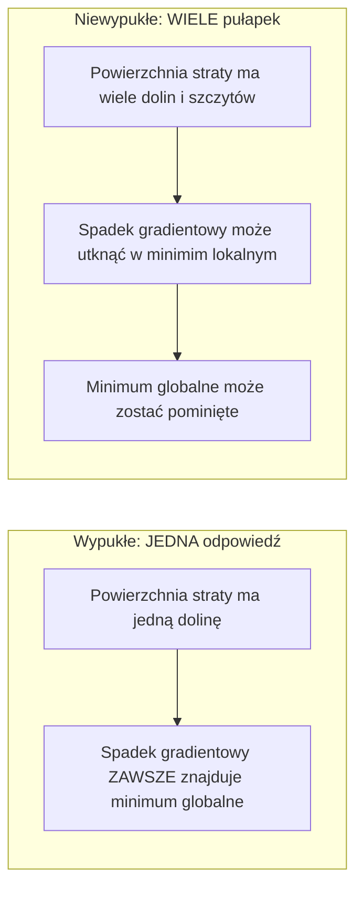
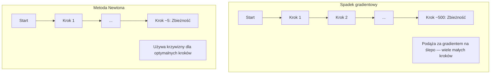
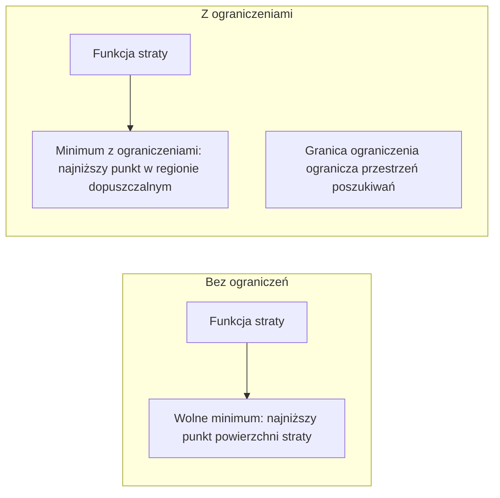
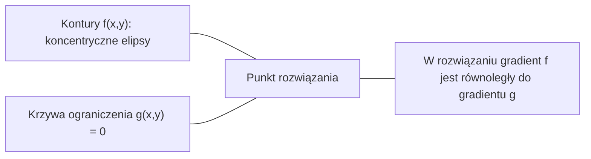

# Optymalizacja wypukła

> Problemy wypukłe mają jedną dolinę. Sieci neuronowe mają miliony. Znajomość różnicy ma znaczenie.

**Type:** Build
**Language:** Python
**Prerequisites:** Phase 1, Lessons 04 (Calculus for ML), 08 (Optimization)
**Time:** ~90 minut

## Learning Objectives

- Sprawdź, czy funkcja jest wypukła używając definicji, drugiej pochodnej i kryterium Hessianu
- Zaimplementuj metodę Newtona i porównaj jej kwadratową zbieżność przeciwko spadkowi gradientowemu
- Rozwiąż problemy optymalizacji z ograniczeniami używając mnożników Lagrange'a i interpretuj warunki KKT
- Wyjaśnij, dlaczego krajobrazy strat sieci neuronowych są niewypukłe, a mimo to SGD wciąż znajduje dobre rozwiązania

## Problem

Lekcja 08 nauczyła cię spadku gradientowego, pędu i Adama. Te optymalizatory schodzą w dół na dowolnej powierzchni. Ale nie dają żadnych gwarancji. Spadek gradientowy na niewypukłym krajobrazie może wylądować w złym minimim lokalnym, utknąć na punkcie siodłowym lub oscylować w nieskończoność. Użyłeś go mimo wszystko, bo sieci neuronowe są niewypukłe i nie ma alternatywy.

Ale wiele problemów w uczeniu maszynowym jest wypukłych. Regresja liniowa, regresja logistyczna, SVM, LASSO, regresja grzbietowa. Dla nich istnieje coś silniejszego: optymalizacja z matematycznymi gwarancjami. Problem wypukły ma dokładnie jedną dolinę. Każdy algorytm schodzący w dół osiągnie minimum globalne. Żadne ponowne uruchamiania niepotrzebne. Żadne harmonogramy współczynników uczenia. Żadne modlitwy.

Zrozumienie wypukłości robi trzy rzeczy. Po pierwsze, mówi, kiedy twój problem jest łatwy (wypukły) vs trudny (niewypukły). Po drugie, daje szybsze narzędzia, takie jak metoda Newtona dla problemów wypukłych. Po trzecie, wyjaśnia koncepcje pojawiające się w całym ML: regularyzacja jako ograniczenie, dualność w SVM i dlaczego głębokie uczenie działa mimo naruszania wszystkich miłych własności, które daje wypukłość.

## Koncepcja

### Zbiory wypukłe

Zbiór S jest wypukły, jeśli dla dowolnych dwóch punktów w S, odcinek między nimi również leży w całości w S.

| Zbiory wypukłe | Niewypukłe |
|---|---|
| **Prostokąt**: dowolne dwa punkty wewnątrz mogą być połączone odcinkiem pozostającym wewnątrz | **Kształt gwiazdy/półksiężyca**: linia między dwoma punktami wewnętrznymi może wyjść poza zbiór |
| **Trójkąt**: ta sama własność zachodzi dla wszystkich punktów wewnętrznych | **Pączek/pierścień**: dziura powoduje, że niektóre odcinki opuszczają zbiór |
| Odcinek między dowolnymi dwoma punktami pozostaje w zbiorze | Odcinek między niektórymi parami punktów wychodzi poza zbiór |

Formalny test: dla dowolnych punktów x, y w S i dowolnego t w [0, 1], punkt tx + (1-t)y jest również w S.

Przykłady zbiorów wypukłych:
- Linia, płaszczyzna, całe R^n
- Kula (koło, sfera, hipersfera)
- Półprzestrzeń: {x : a^T x <= b}
- Przecięcie dowolnej liczby zbiorów wypukłych

Przykłady zbiorów niewypukłych:
- Pączek (pierścień)
- Suma dwóch rozłącznych kół
- Dowolny zbiór z "wgnieceniem" lub "dziurą"

### Funkcje wypukłe

Funkcja f jest wypukła, jeśli jej dziedzina jest zbiorem wypukłym i dla dowolnych dwóch punktów x, y w jej dziedzinie i dowolnego t w [0, 1]:

```
f(tx + (1-t)y) <= t*f(x) + (1-t)*f(y)
```

Geometrycznie: odcinek między dowolnymi dwoma punktami na wykresie leży nad lub na wykresie.

| Własność | Funkcja wypukła | Funkcja niewypukła |
|---|---|---|
| **Test odcinka** | Linia między dowolnymi dwoma punktami na wykresie leży **nad lub na** krzywej | Linia między niektórymi punktami na wykresie opada **poniżej** krzywej |
| **Kształt** | Pojedyncza misa/dolina zakrzywiająca się w górę | Wiele szczytów i dolin z mieszaną krzywizną |
| **Minima lokalne** | Każde minimum lokalne jest minimum globalnym | Wiele minimów lokalnych może istnieć na różnych wysokościach |

Typowe funkcje wypukłe:
- f(x) = x^2 (parabola)
- f(x) = |x| (wartość bezwzględna)
- f(x) = e^x (wykładnicza)
- f(x) = max(0, x) (ReLU, choć kawałkami liniowa)
- f(x) = -log(x) dla x > 0 (ujemny logarytm)
- Dowolna funkcja liniowa f(x) = a^T x + b (zarówno wypukła, jak i wklęsła)

### Testowanie wypukłości

Trzy praktyczne testy, od najłatwiejszego do najbardziej rygorystycznego.

**Test 1: Test drugiej pochodnej (1D).** Jeśli f''(x) >= 0 dla wszystkich x, to f jest wypukła.

- f(x) = x^2: f''(x) = 2 >= 0. Wypukła.
- f(x) = x^3: f''(x) = 6x. Ujemna dla x < 0. Niewypukła.
- f(x) = e^x: f''(x) = e^x > 0. Wypukła.

**Test 2: Test Hessianu (wielowymiarowy).** Jeśli macierz Hessianu H(x) jest dodatnio półokreślona dla wszystkich x, to f jest wypukła. Hessian to macierz drugich pochodnych cząstkowych.

**Test 3: Test definicji.** Sprawdź nierówność f(tx + (1-t)y) <= t*f(x) + (1-t)*f(y) bezpośrednio. Przydatne dla funkcji, gdzie pochodne są trudne do obliczenia.

### Dlaczego wypukłość ma znaczenie

Centralne twierdzenie optymalizacji wypukłej:

**Dla funkcji wypukłej każde minimum lokalne jest minimum globalnym.**

Oznacza to, że spadek gradientowy nie może utknąć. Każda ścieżka w dół prowadzi do tej samej odpowiedzi. Algorytm jest gwarantowane zbieżny do optymalnego rozwiązania.



Konsekwencje:
- Brak potrzeby losowych restartów
- Brak potrzeby wyrafinowanych harmonogramów współczynników uczenia
- Dowody zbieżności są możliwe (szybkość zależy od własności funkcji)
- Rozwiązanie jest unikalne (poza płaskimi regionami)

### Wypukłe vs niewypukłe w ML

| Problem | Wypukły? | Dlaczego |
|---------|---------|-----|
| Regresja liniowa (MSE) | Tak | Strata jest kwadratowa w wagach |
| Regresja logistyczna | Tak | Log-strata jest wypukła w wagach |
| SVM (strata zawiasu) | Tak | Maksimum funkcji liniowych |
| LASSO (regresja L1) | Tak | Suma funkcji wypukłych jest wypukła |
| Regresja grzbietowa (L2) | Tak | Kwadratowa + kwadratowa = wypukła |
| Sieć neuronowa (dowolna strata) | Nie | Nieliniowe aktywacje tworzą niewypukły krajobraz |
| Klastrowanie k-średnich | Nie | Dyskretny krok przypisania |
| Faktoryzacja macierzy | Nie | Iloczyn niewiadomych |

Modele liniowe z wypukłymi stratami są wypukłe. W momencie dodania warstw ukrytych z nieliniowymi aktywacjami wypukłość zostaje przełamana.

### Macierz Hessianu

Hessian H funkcji f: R^n -> R to macierz n x n drugich pochodnych cząstkowych.

```
H[i][j] = d^2 f / (dx_i dx_j)
```

Dla f(x, y) = x^2 + 3xy + y^2:

```
df/dx = 2x + 3y       d^2f/dx^2 = 2      d^2f/dxdy = 3
df/dy = 3x + 2y       d^2f/dydx = 3      d^2f/dy^2 = 2

H = [ 2  3 ]
    [ 3  2 ]
```

Hessian mówi o krzywiźnie:
- Wszystkie wartości własne dodatnie: funkcja zakrzywia się w górę w każdym kierunku (wypukła w tym punkcie)
- Wszystkie wartości własne ujemne: zakrzywia się w dół w każdym kierunku (wklęsła, lokalne maksimum)
- Mieszane znaki: punkt siodłowy (zakrzywia się w górę w niektórych kierunkach, w dół w innych)
- Zerowa wartość własna: płaska w tym kierunku (zdegenerowana)

Dla wypukłości Hessian musi być dodatnio półokreślony (wszystkie wartości własne >= 0) wszędzie, nie tylko w jednym punkcie.

### Metoda Newtona

Spadek gradientowy używa informacji pierwszego rzędu (gradient). Metoda Newtona używa informacji drugiego rzędu (Hessian). Dopasowuje kwadratowe przybliżenie w bieżącym punkcie i skacze bezpośrednio do minimum tego kwadratu.

```
Reguła aktualizacji:
  x_new = x - H^(-1) * gradient

Porównaj ze spadkiem gradientowym:
  x_new = x - lr * gradient
```

Metoda Newtona zastępuje skalarny współczynnik uczenia odwrotnością Hessianu. To automatycznie dostosowuje wielkość i kierunek kroku na podstawie lokalnej krzywizny.



Zalety:
- Kwadratowa zbieżność w pobliżu minimum (błąd kwadratuje się każdym krokiem)
- Brak współczynnika uczenia do strojenia
- Niezmienniczość na skalę (działa niezależnie od parametryzacji problemu)

Wady:
- Obliczanie Hessianu kosztuje O(n^2) pamięci i O(n^3) do odwrócenia
- Dla sieci neuronowej z 1 milionem wag to 10^12 elementów i 10^18 operacji
- Niepraktyczne dla głębokiego uczenia

### Optymalizacja z ograniczeniami

Optymalizacja bez ograniczeń: minimalizuj f(x) dla wszystkich x.
Optymalizacja z ograniczeniami: minimalizuj f(x) z zachowaniem ograniczeń.

Prawdziwe problemy mają ograniczenia. Chcesz zminimalizować koszt, ale twój budżet jest ograniczony. Chcesz zminimalizować błąd, ale złożoność modelu jest ograniczona.



### Mnożniki Lagrange'a

Metoda mnożników Lagrange'a przekształca problem z ograniczeniami w problem bez ograniczeń.

Problem: minimalizuj f(x) z ograniczeniem g(x) = 0.

Rozwiązanie: wprowadź nową zmienną (mnożnik Lagrange'a lambda) i rozwiąż problem bez ograniczeń:

```
L(x, lambda) = f(x) + lambda * g(x)
```

W rozwiązaniu gradient L wynosi zero:

```
dL/dx = df/dx + lambda * dg/dx = 0
dL/dlambda = g(x) = 0
```

Geometryczna intuicja: w minimum z ograniczeniami gradient f musi być równoległy do gradientu ograniczenia g. Gdyby nie były równoległe, mógłbyś poruszać się wzdłuż powierzchni ograniczenia i dalej zmniejszać f.



Przykład: minimalizuj f(x,y) = x^2 + y^2 z ograniczeniem x + y = 1.

```
L = x^2 + y^2 + lambda(x + y - 1)

dL/dx = 2x + lambda = 0  =>  x = -lambda/2
dL/dy = 2y + lambda = 0  =>  y = -lambda/2
dL/dlambda = x + y - 1 = 0

Z dwóch pierwszych: x = y
Podstawiając: 2x = 1, więc x = y = 0.5, lambda = -1
```

Najbliższy punkt na linii x + y = 1 do początku układu to (0.5, 0.5).

### Warunki KKT

Warunki Karusha-Kuhna-Tuckera rozszerzają mnożniki Lagrange'a na ograniczenia nierównościowe.

Problem: minimalizuj f(x) z ograniczeniami g_i(x) <= 0 dla i = 1, ..., m.

Warunki KKT (konieczne dla optymalności):

```
1. Stacjonarność:    df/dx + sum(lambda_i * dg_i/dx) = 0
2. Dopuszczalność pierwotna:  g_i(x) <= 0  dla wszystkich i
3. Dopuszczalność dualna:    lambda_i >= 0  dla wszystkich i
4. Komplementarna luzność:  lambda_i * g_i(x) = 0  dla wszystkich i
```

Komplementarna luzność to kluczowa intuicja: albo ograniczenie jest aktywne (g_i = 0, rozwiązanie leży na granicy), albo mnożnik jest zerem (ograniczenie nie ma znaczenia). Ograniczenie, które nie wpływa na rozwiązanie, ma lambda = 0.

Warunki KKT są centralne dla SVM. Wektory nośne to punkty danych, gdzie ograniczenie jest aktywne (lambda > 0). Wszystkie inne punkty danych mają lambda = 0 i nie wpływają na granicę decyzyjną.

### Regularyzacja jako optymalizacja z ograniczeniami

Regularyzacja L1 i L2 to nie arbitralne sztuczki. To problemy optymalizacji z ograniczeniami w przebraniu.

**Regularyzacja L2 (Ridge):**

```
minimalizuj  Strata(w)  z ograniczeniem  ||w||^2 <= t

Równoważna forma bez ograniczeń:
minimalizuj  Strata(w) + lambda * ||w||^2
```

Ograniczenie ||w||^2 <= t definiuje kulę (okrąg w 2D, sferę w 3D). Rozwiązanie to miejsce, gdzie kontury straty pierwsze dotykają tej kuli.

**Regularyzacja L1 (LASSO):**

```
minimalizuj  Strata(w)  z ograniczeniem  ||w||_1 <= t

Równoważna forma bez ograniczeń:
minimalizuj  Strata(w) + lambda * ||w||_1
```

Ograniczenie ||w||_1 <= t definiuje diament (obrócony kwadrat w 2D).

| Własność | Ograniczenie L2 (koło) | Ograniczenie L1 (diament) |
|---|---|---|
| **Kształt ograniczenia** | Koło (sfera w wyższych wymiarach) | Diament (obrócony kwadrat w 2D) |
| **Gdzie kontur straty dotyka** | Gładka granica — dowolny punkt na kole | Wierzcholek — zgodnie z osią |
| **Zachowanie rozwiązania** | Wagi są małe, ale niezerowe | Niektóre wagi są dokładnie zerowe (rzadkie) |
| **Wynik** | Kurczenie wag | Selekcja cech |

To wyjaśnia, dlaczego L1 produkuje rzadkie modele (selekcja cech), podczas gdy L2 tylko zmniejsza wagi. Diament ma wierzchołki zgodne z osiami. Kontury straty z większym prawdopodobieństwem dotkną wierzchołka, ustawiając jedną lub więcej wag dokładnie na zero.

### Dualność

Każdy problem optymalizacji z ograniczeniami (pierwotny) ma problem towarzyszący (dualny). Dla problemów wypukłych pierwotny i dualny mają tę samą optymalną wartość. To jest silna dualność.

Dualna funkcja Lagrange'a:

```
Pierwotny: minimalizuj f(x) z ograniczeniem g(x) <= 0
Lagrangian: L(x, lambda) = f(x) + lambda * g(x)
Funkcja dualna: d(lambda) = min_x L(x, lambda)
Problem dualny: maksymalizuj d(lambda) z ograniczeniem lambda >= 0
```

Dlaczego dualność ma znaczenie:
- Problem dualny jest czasami łatwiejszy do rozwiązania niż pierwotny
- SVM są rozwiązywane w formie dualnej, gdzie problem zależy od iloczynów skalarnych między punktami danych (umożliwiając sztuczkę jądra)
- Dualna dostarcza dolnego ograniczenia optimum pierwotnego, przydatnego do sprawdzania jakości rozwiązania

Dla SVM w szczególności:

```
Pierwotny: znajdź w, b maksymalizujące margines 2/||w|| z ograniczeniem
        y_i(w^T x_i + b) >= 1 dla wszystkich i

Dualny:   maksymalizuj sum(alpha_i) - 0.5 * sum_ij(alpha_i * alpha_j * y_i * y_j * x_i^T x_j)
        z ograniczeniem alpha_i >= 0 i sum(alpha_i * y_i) = 0

Dualny dotyczy tylko iloczynów skalarnych x_i^T x_j.
Zastąp x_i^T x_j przez K(x_i, x_j), by dostać sztuczkę jądra.
```

### Dlaczego głębokie uczenie działa mimo niewypukłości

Funkcje straty sieci neuronowych są dziko niewypukłe. Według każdej klasycznej miary optymalizacja ich powinna zawieść. A jednak stochastyczny spadek gradientowy niezawodnie znajduje dobre rozwiązania. Kilka czynników to wyjaśnia.

**Większość minimów lokalnych jest wystarczająco dobra.** W przestrzeniach wysokowymiarowych losowe punkty krytyczne (gdzie gradient jest zerem) są w przeważającej mierze punktami siodłowymi, nie minimami lokalnymi. Nieliczne minima lokalne, które istnieją, mają tendencję do wartości straty bliskich minimum globalnemu. Utknięcie w strasznym minimim lokalnym jest skrajnie mało prawdopodobne, gdy przestrzeń parametrów ma miliony wymiarów.

**Punkty siodłowe, a nie minima lokalne, są prawdziwą przeszkodą.** W funkcji z n parametrami punkt siodłowy ma mieszankę dodatnich i ujemnych kierunków krzywizny. Dla losowego punktu krytycznego w wysokich wymiarach prawdopodobieństwo, że wszystkie n wartości własnych jest dodatnich (minimum lokalne) wynosi z grubsza 2^(-n). Prawie wszystkie punkty krytyczne to punkty siodłowe. Szum SGD pomaga z nich uciec.

**PrzeParametryzacja wygładza krajobraz.** Sieci z większą liczbą parametrów niż przykładów treningowych mają gładsze, bardziej połączone powierzchnie straty. Szersze sieci mają mniej złych minimów lokalnych. To kontrintuicyjne, ale empirycznie spójne.

**Struktura krajobrazu straty:**

| Własność | Przestrzeń niskowymiarowa | Przestrzeń wysokowymiarowa |
|---|---|---|
| **Krajobraz** | Wiele izolowanych szczytów i dolin | Gładko połączone doliny |
| **Minima** | Wiele izolowanych minimów lokalnych | Mało złych minimów lokalnych; większość blisko optymalnych |
| **Nawigacja** | Trudno znaleźć minimum globalne | Wiele ścieżek prowadzi do dobrych rozwiązań |
| **Punkty krytyczne** | Mieszanka minimów lokalnych i punktów siodłowych | W przeważającej mierze punkty siodłowe, nie minima lokalne |

**Szum stochastyczny działa jako ukryta regularyzacja.** Mini-wsadowy SGD dodaje szum, który zapobiega osiadaniu w ostrych minimach. Ostre minima przeuczają; płaskie minima generalizują. Szum polaryzuje optymalizację w kierunku płaskich regionów krajobrazu straty.

### Metody drugiego rzędu w praktyce

Czysta metoda Newtona jest niepraktyczna dla dużych modeli. Kilka przybliżeń czyni informację drugiego rzędu użyteczną.

**L-BFGS (Limited-memory BFGS):** Przybliża odwrotność Hessianu używając ostatnich m różnic gradientów. Wymaga O(mn) pamięci zamiast O(n^2). Działa dobrze dla problemów z do ~10 000 parametrów. Używane w klasycznym ML (regresja logistyczna, CRF), ale nie w głębokim uczeniu.

**Naturalny gradient:** Używa macierzy informacji Fishera (oczekiwany Hessian log-wiarygodności) zamiast standardowego Hessianu. Uwzględnia geometrię rozkładów prawdopodobieństwa. K-FAC (Kronecker-Factored Approximate Curvature) przybliża macierz Fishera jako iloczyn Kroneckera, czyniąc ją praktyczną dla sieci neuronowych.

**Optymalizacja wolna od Hessianu:** Używa gradientu sprzężonego do rozwiązania Hx = g bez tworzenia H. Wymaga tylko iloczynów Hessian-wektor, które można obliczyć w O(n) czasie przez automatyczne różniczkowanie.

**Przybliżenia diagonalne:** Drugi moment Adama jest diagonalnym przybliżeniem diagonali Hessianu. AdaHessian rozszerza to przez użycie rzeczywistych elementów diagonalnych Hessianu przez estymator Hutchinsona.

| Metoda | Pamięć | Koszt na krok | Kiedy używać |
|--------|--------|--------------|-------------|
| Spadek gradientowy | O(n) | O(n) | Bazowy, duże modele |
| Metoda Newtona | O(n^2) | O(n^3) | Małe problemy wypukłe |
| L-BFGS | O(mn) | O(mn) | Średnie problemy wypukłe |
| Adam | O(n) | O(n) | Domyślny dla głębokiego uczenia |
| K-FAC | O(n) | O(n) na warstwę | Badania, trenowanie z dużymi wsadami |

```figure
convex-vs-nonconvex
```

## Build It

### Krok 1: Sprawdzanie wypukłości

Zbuduj funkcję, która empirycznie testuje wypukłość przez próbkowanie punktów i sprawdzanie definicji.

```python
import random
import math

def check_convexity(f, dim, bounds=(-5, 5), samples=1000):
    violations = 0
    for _ in range(samples):
        x = [random.uniform(*bounds) for _ in range(dim)]
        y = [random.uniform(*bounds) for _ in range(dim)]
        t = random.uniform(0, 1)
        mid = [t * xi + (1 - t) * yi for xi, yi in zip(x, y)]
        lhs = f(mid)
        rhs = t * f(x) + (1 - t) * f(y)
        if lhs > rhs + 1e-10:
            violations += 1
    return violations == 0, violations
```

### Krok 2: Metoda Newtona dla 2D

Zaimplementuj metodę Newtona używając jawnego Hessianu. Porównaj szybkość zbieżności przeciwko spadkowi gradientowemu.

```python
def newtons_method(f, grad_f, hessian_f, x0, steps=50, tol=1e-12):
    x = list(x0)
    history = [x[:]]
    for _ in range(steps):
        g = grad_f(x)
        H = hessian_f(x)
        det = H[0][0] * H[1][1] - H[0][1] * H[1][0]
        if abs(det) < 1e-15:
            break
        H_inv = [
            [H[1][1] / det, -H[0][1] / det],
            [-H[1][0] / det, H[0][0] / det],
        ]
        dx = [
            H_inv[0][0] * g[0] + H_inv[0][1] * g[1],
            H_inv[1][0] * g[0] + H_inv[1][1] * g[1],
        ]
        x = [x[0] - dx[0], x[1] - dx[1]]
        history.append(x[:])
        if sum(gi ** 2 for gi in g) < tol:
            break
    return history
```

### Krok 3: Solver mnożników Lagrange'a

Rozwiąż optymalizację z ograniczeniami używając spadku gradientowego na Lagrangiana.

```python
def lagrange_solve(f_grad, g_val, g_grad, x0, lr=0.01,
                   lr_lambda=0.01, steps=5000):
    x = list(x0)
    lam = 0.0
    history = []
    for _ in range(steps):
        fg = f_grad(x)
        gv = g_val(x)
        gg = g_grad(x)
        x = [
            xi - lr * (fgi + lam * ggi)
            for xi, fgi, ggi in zip(x, fg, gg)
        ]
        lam = lam + lr_lambda * gv
        history.append((x[:], lam, gv))
    return history
```

### Krok 4: Porównaj pierwszy vs drugi rząd

Uruchom spadek gradientowy i metodę Newtona na tej samej funkcji kwadratowej. Policz kroki do zbieżności.

```python
def quadratic(x):
    return 5 * x[0] ** 2 + x[1] ** 2

def quadratic_grad(x):
    return [10 * x[0], 2 * x[1]]

def quadratic_hessian(x):
    return [[10, 0], [0, 2]]
```

Metoda Newtona zbiegnie w 1 kroku (jest dokładna dla kwadratów). Spadek gradientowy będzie potrzebował setek kroków, ponieważ wartości własne Hessianu różnią się o czynnik 5, tworząc wydłużoną dolinę.

## Use It

Analiza wypukłości stosuje się bezpośrednio przy wyborze modeli i solverów ML.

Dla problemów wypukłych (regresja logistyczna, SVM, LASSO):
- Użyj dedykowanych solverów (liblinear, CVXPY, scipy.optimize.minimize z method='L-BFGS-B')
- Oczekuj unikalnego globalnego rozwiązania
- Metody drugiego rzędu są praktyczne i szybkie

Dla problemów niewypukłych (sieci neuronowe):
- Użyj metod pierwszego rzędu (SGD, Adam)
- Zaakceptuj, że rozwiązanie zależy od inicjalizacji i losowości
- Użyj nadmiarowej parametryzacji, szumu i harmonogramów współczynnika uczenia jako ukrytej regularyzacji
- Nie trać czasu na szukanie minimum globalnego. Dobre minimum lokalne jest wystarczające.

```python
from scipy.optimize import minimize

result = minimize(
    fun=lambda w: sum((y - X @ w) ** 2) + 0.1 * sum(w ** 2),
    x0=np.zeros(d),
    method='L-BFGS-B',
    jac=lambda w: -2 * X.T @ (y - X @ w) + 0.2 * w,
)
```

Dla SVM, formuła dualna pozwala użyć sztuczki jądra:

```python
from sklearn.svm import SVC

svm = SVC(kernel='rbf', C=1.0)
svm.fit(X_train, y_train)
print(f"Wektory nośne: {svm.n_support_}")
```

## Ćwiczenia

1. **Galeria wypukłości.** Przetestuj te funkcje na wypukłość używając sprawdzarki: f(x) = x^4, f(x) = sin(x), f(x,y) = x^2 + y^2, f(x,y) = x*y, f(x) = max(x, 0). Wyjaśnij, dlaczego każdy wynik ma sens.

2. **Wyścig Newtona vs spadek gradientowy.** Uruchom obie metody na f(x,y) = 50*x^2 + y^2 z punktu startowego (10, 10). Ile kroków potrzebuje każda, by osiągnąć stratę < 1e-10? Co się dzieje ze spadkiem gradientowym, gdy wskaźnik uwarunkowania (stosunek największej do najmniejszej wartości własnej Hessianu) rośnie?

3. **Geometria mnożników Lagrange'a.** Minimalizuj f(x,y) = (x-3)^2 + (y-3)^2 z ograniczeniem x + 2y = 4. Zweryfikuj rozwiązanie przez sprawdzenie, że gradient f jest równoległy do gradientu g w rozwiązaniu.

4. **Ograniczenie regularyzacji.** Zaimplementuj optymalizację z ograniczeniem L1: minimalizuj (x-3)^2 + (y-2)^2 z ograniczeniem |x| + |y| <= 1. Pokaż, że rozwiązanie ma jedną współrzędną równą zero (rzadkość z ograniczenia w kształcie diamentu).

5. **Analiza wartości własnych Hessianu.** Oblicz Hessian funkcji Rosenbrocka w (1,1) i w (-1,1). Oblicz wartości własne w obu punktach. Co mówią wartości własne o krzywiźnie w minimum vs daleko od niego?

## Key Terms

| Termin | Co znaczy |
|------|---------------|
| Zbiór wypukły | Zbiór, w którym odcinek między dowolnymi dwoma punktami w zbiorze pozostaje w zbiorze |
| Funkcja wypukła | Funkcja, w której odcinek między dowolnymi dwoma punktami na jej wykresie leży nad lub na wykresie. Równoważnie: Hessian jest dodatnio półokreślony wszędzie |
| Minimum lokalne | Punkt niższy niż wszystkie pobliskie punkty. Dla funkcji wypukłych każde minimum lokalne jest minimum globalnym |
| Minimum globalne | Najniższy punkt funkcji nad jej całą dziedziną |
| Macierz Hessianu | Macierz wszystkich drugich pochodnych cząstkowych. Koduje informację o krzywiźnie |
| Dodatnio półokreślona | Macierz, której wszystkie wartości własne są nieujemne. Wielowymiarowy analog "druga pochodna >= 0" |
| Wskaźnik uwarunkowania | Stosunek największej do najmniejszej wartości własnej Hessianu. Wysoki wskaźnik uwarunkowania oznacza wydłużone doliny i wolny spadek gradientowy |
| Metoda Newtona | Optymalizator drugiego rzędu używający odwrotności Hessianu do określenia kierunku i wielkości kroku. Kwadratowa zbieżność w pobliżu minimum |
| Mnożnik Lagrange'a | Zmienna wprowadzona do konwersji problemu optymalizacji z ograniczeniami na problem bez ograniczeń |
| Warunki KKT | Warunki konieczne optymalności z ograniczeniami nierównościowymi. Uogólniają mnożniki Lagrange'a |
| Komplementarna luzność | W rozwiązaniu albo ograniczenie jest aktywne, albo jego mnożnik jest zerem. Nigdy oba niezerowe |
| Dualność | Każdy problem z ograniczeniami ma towarzyszący problem dualny. Dla problemów wypukłych oba mają tę samą wartość optymalną |
| Silna dualność | Wartości optymalne pierwotna i dualna są równe. Zachodzi dla problemów wypukłych spełniających warunek Slatera |
| L-BFGS | Przybliżona metoda drugiego rzędu przechowująca ostatnie m różnic gradientów zamiast pełnego Hessianu |
| Punkt siodłowy | Punkt, gdzie gradient jest zerem, ale jest minimum w niektórych kierunkach i maksimum w innych |
| Nadmiarowa parametryzacja | Używanie więcej parametrów niż przykładów treningowych. Wygładza krajobraz straty i redukuje złe minima lokalne |