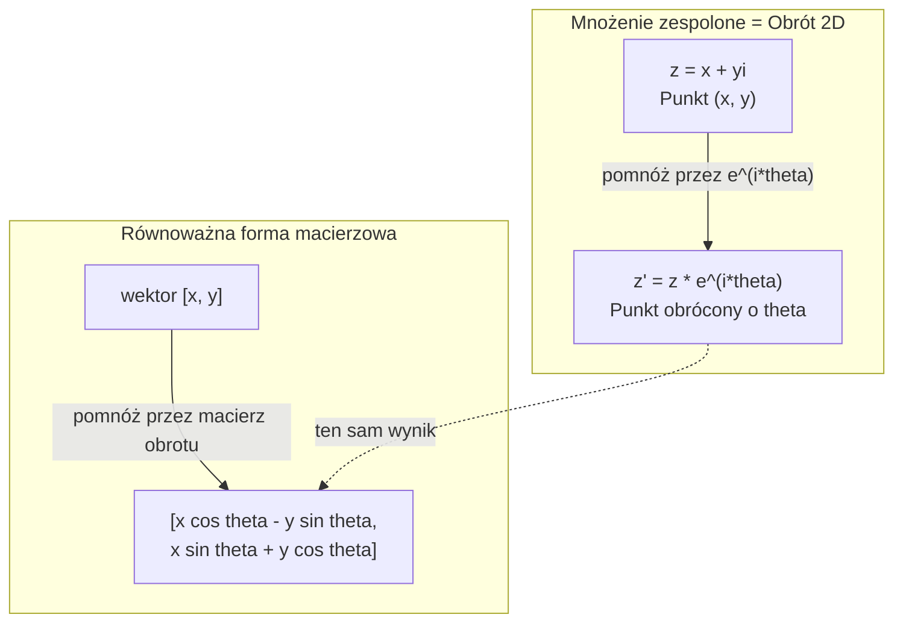
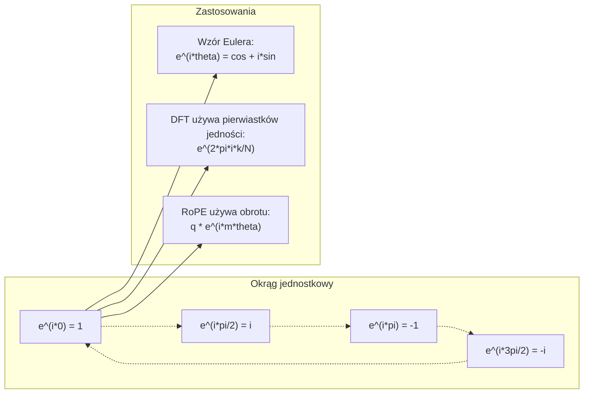

# Liczby zespolone dla AI

> Pierwiastek kwadratowy z -1 nie jest wyimaginowany. To klucz do obrotów, częstotliwości i połowy przetwarzania sygnałów.

**Type:** Learn
**Language:** Python
**Prerequisites:** Phase 1, Lessons 01-04 (linear algebra, calculus)
**Time:** ~60 minut

## Learning Objectives

- Wykonuj arytmetykę zespoloną (dodawanie, mnożenie, dzielenie, sprzężenie) w formie prostokątnej i biegunowej
- Zastosuj wzór Eulera do konwersji między eksponentalnymi zespolonymi a funkcjami trygonometrycznymi
- Zaimplementuj dyskretną transformację Fouriera używając zespolonych pierwiastków jedności
- Wyjaśnij, jak obroty zespolone leżą u podstaw RoPE i sinusoidalnych kodowań pozycyjnych w transformerach

## Problem

Otwierasz pracę o transformacjach Fouriera i wszędzie jest `i`. Patrzysz na kodowania pozycyjne w transformerach i widzisz `sin` i `cos` na różnych częstotliwościach -- rzeczywiste i urojone części eksponentalnych zespolonych. Czytasz o kwantowym komputerze i wszystko jest wyrażone w zespolonych przestrzeniach wektorowych.

Liczby zespolone wydają się abstrakcyjne. System liczbowy zbudowany na pierwiastku kwadratowym z -1 wydaje się matematyczną sztuczką. Ale to nie sztuczka. To naturalny język obrotów i oscylacji. Za każdym razem, gdy coś się kręci, wibruje lub oscyluje, liczby zespolone są właściwym narzędziem.

Bez zrozumienia liczb zespolonych nie możesz zrozumieć dyskretnej transformacji Fouriera. Nie możesz zrozumieć FFT. Nie możesz zrozumieć, jak RoPE (Rotary Position Embedding) działa w nowoczesnych modelach językowych. Nie możesz zrozumieć, dlaczego sinusoidalne kodowania pozycyjne w oryginalnej pracy o Transformerach używają takich częstotliwości, jakich używają.

Ta lekcja buduje arytmetykę zespoloną od podstaw, łączy ją z geometrią i pokazuje dokładnie, gdzie liczby zespolone pojawiają się w uczeniu maszynowym.

## Koncepcja

### Co to jest liczba zespolona?

Liczba zespolona ma dwie części: rzeczywistą i urojoną.

```
z = a + bi

gdzie:
  a to część rzeczywista
  b to część urojona
  i to jednostka urojona, zdefiniowana przez i^2 = -1
```

To wszystko. Rozszerzasz oś liczbową w płaszczyznę. Liczby rzeczywiste leżą na jednej osi. Liczby urojone leżą na drugiej. Każda liczba zespolona jest punktem na tej płaszczyźnie.

### Arytmetyka zespolona

**Dodawanie.** Dodaj części rzeczywiste razem, dodaj części urojone razem.

```
(a + bi) + (c + di) = (a + c) + (b + d)i

Przykład: (3 + 2i) + (1 + 4i) = 4 + 6i
```

**Mnożenie.** Użyj prawa rozdzielności i pamiętaj, że i^2 = -1.

```
(a + bi)(c + di) = ac + adi + bci + bdi^2
                 = ac + adi + bci - bd
                 = (ac - bd) + (ad + bc)i

Przykład: (3 + 2i)(1 + 4i) = 3 + 12i + 2i + 8i^2
                             = 3 + 14i - 8
                             = -5 + 14i
```

**Sprzężenie.** Odwróć znak części urojonej.

```
sprzężenie z (a + bi) = a - bi
```

Iloczyn liczby zespolonej i jej sprzężenia jest zawsze rzeczywisty:

```
(a + bi)(a - bi) = a^2 + b^2
```

**Dzielenie.** Pomnóż licznik i mianownik przez sprzężenie mianownika.

```
(a + bi) / (c + di) = (a + bi)(c - di) / (c^2 + d^2)
```

To usuwa część urojoną z mianownika, dając czystą liczbę zespoloną.

### Płaszczyzna zespolona

Płaszczyzna zespolona mapuje każdą liczbę zespoloną na punkt 2D. Oś pozioma to oś rzeczywista, oś pionowa to oś urojona.

```
z = 3 + 2i  odpowiada punktowi (3, 2)
z = -1 + 0i odpowiada punktowi (-1, 0) na osi rzeczywistej
z = 0 + 4i  odpowiada punktowi (0, 4) na osi urojonej
```

Liczba zespolona jest jednocześnie punktem i wektorem od początku. Ta podwójna interpretacja czyni liczby zespolone przydatnymi do geometrii.

### Forma biegunowa

Dowolny punkt na płaszczyźnie można opisać przez jego odległość od początku i kąt od dodatniej osi rzeczywistej.

```
z = r * (cos(theta) + i*sin(theta))

gdzie:
  r = |z| = sqrt(a^2 + b^2)     (moduł)
  theta = atan2(b, a)             (faza)
```

Forma prostokątna (a + bi) jest dobra do dodawania. Forma biegunowa (r, theta) jest dobra do mnożenia.

**Mnożenie w formie biegunowej.** Pomnóż moduły, dodaj kąty.

```
z1 = r1 * e^(i*theta1)
z2 = r2 * e^(i*theta2)

z1 * z2 = (r1 * r2) * e^(i*(theta1 + theta2))
```

Dlatego liczby zespolone są idealne do obrotów. Mnożenie przez liczbę zespoloną z modułem 1 to czysty obrót.

### Wzór Eulera

Most między eksponentalnymi zespolonymi a trygonometrią:

```
e^(i*theta) = cos(theta) + i*sin(theta)
```

To najważniejszy wzór w tej lekcji. Gdy theta = pi:

```
e^(i*pi) = cos(pi) + i*sin(pi) = -1 + 0i = -1

Zatem: e^(i*pi) + 1 = 0
```

Pięć fundamentalnych stałych (e, i, pi, 1, 0) połączonych w jednym równaniu.

### Dlaczego wzór Eulera ma znaczenie dla ML

Wzór Eulera mówi, że `e^(i*theta)` kreśli okrąg jednostkowy, gdy theta się zmienia. W theta = 0 jesteś w (1, 0). W theta = pi/2 jesteś w (0, 1). W theta = pi jesteś w (-1, 0). W theta = 3*pi/2 jesteś w (0, -1). Pełny obrót to theta = 2*pi.

To znaczy, że eksponenty zespolone TO obroty. A obroty są wszędzie w przetwarzaniu sygnałów i ML.

### Związek z obrotami 2D

Mnożenie liczby zespolonej (x + yi) przez e^(i*theta) obraca punkt (x, y) o kąt theta wokół początku układu.

```
Obrót przez mnożenie zespolone:
  (x + yi) * (cos(theta) + i*sin(theta))
  = (x*cos(theta) - y*sin(theta)) + (x*sin(theta) + y*cos(theta))i

Obrót przez mnożenie macierzowe:
  [cos(theta)  -sin(theta)] [x]   [x*cos(theta) - y*sin(theta)]
  [sin(theta)   cos(theta)] [y] = [x*sin(theta) + y*cos(theta)]
```

Dają identyczne wyniki. Mnożenie zespolone TO obrót 2D. Macierz obrotu to tylko mnożenie zespolone zapisane w notacji macierzowej.



### Fasory i wirujące sygnały

Eksponenta zespolona e^(i*omega*t) to punkt wirujący wokół okręgu jednostkowego z częstotliwością kątową omega. Gdy t rośnie, punkt kreśli okrąg.

Część rzeczywista tego wirującego punktu to cos(omega*t). Część urojona to sin(omega*t). Sygnał sinusoidalny to cień wirującej liczby zespolonej.

```
e^(i*omega*t) = cos(omega*t) + i*sin(omega*t)

Część rzeczywista:      cos(omega*t)    -- fala cosinus
Część urojona: sin(omega*t)    -- fala sinus
```

To reprezentacja fazorowa. Zamiast śledzić falę sinus, śledzisz gładko wirującą strzałkę. Przesunięcia fazowe stają się offsetami kąta. Zmiany amplitudy stają się zmianami modułu. Dodawanie sygnałów staje się dodawaniem wektorów.

### Pierwiastki jedności

N-te pierwiastki jedności to N punktów równomiernie rozmieszczonych na okręgu jednostkowym:

```
w_k = e^(2*pi*i*k/N)    dla k = 0, 1, 2, ..., N-1
```

Dla N = 4, pierwiastki to: 1, i, -1, -i (cztery kierunki kompasu).
Dla N = 8, dostajesz cztery kierunki kompasu plus cztery przekątne.

Pierwiastki jedności są fundamentem dyskretnej transformacji Fouriera. DFT rozkłada sygnał na składowe na tych N równomiernie rozłożonych częstotliwościach.

### Związek z DFT

Dyskretna transformacja Fouriera sygnału x[0], x[1], ..., x[N-1] to:

```
X[k] = sum_{n=0}^{N-1} x[n] * e^(-2*pi*i*k*n/N)
```

Każde X[k] mierzy, jak bardzo sygnał koreluje z k-tym pierwiastkiem jedności -- zespoloną sinusoidą na częstotliwości k. DFT rozbija sygnał na N wirujących fazorów i mówi amplitudę i fazę każdego z nich.

### Dlaczego i nie jest urojone

Słowo "urojone" to historyczny wypadek. Kartezjusz użył go lekceważąco. Ale i nie jest bardziej urojone niż liczby ujemne, gdy ludzie je odrzucali. Liczby ujemne odpowiadają "co dostaniesz, odejmując 5 od 3?". Jednostka urojona odpowiada "co podnosisz do kwadratu, by dostać -1?"

Bardziej użytecznie: i jest operatorem obrotu o 90 stopni. Pomnóż liczbę rzeczywistą przez i raz, obracasz o 90 stopni do osi urojonej. Pomnóż przez i ponownie (i^2), obracasz kolejne 90 stopni -- teraz wskazujesz w ujemnym kierunku rzeczywistym. Dlatego i^2 = -1. To nie jest tajemnicze. To półobrót zbudowany z dwóch ćwierćobrotów.

To dlatego liczby zespolone są wszędzie w inżynierii. Wszystko, co się obraca -- fale elektromagnetyczne, stany kwantowe, oscylacje sygnałów, kodowania pozycyjne -- jest naturalnie opisywane przez liczby zespolone.

### Eksponenty zespolone vs funkcje trygonometryczne

Przed wzorem Eulera inżynierowie pisali sygnały jako A*cos(omega*t + phi) -- amplituda A, częstotliwość omega, faza phi. To działa, ale czyni arytmetykę uciążliwą. Dodawanie dwóch cosinusów z różnymi fazami wymaga tożsamości trygonometrycznych.

Z eksponentalnymi zespolonymi ten sam sygnał to A*e^(i*(omega*t + phi)). Dodawanie dwóch sygnałów to tylko dodawanie dwóch liczb zespolonych. Mnożenie (modulacja) to tylko mnożenie modułów i dodawanie kątów. Przesunięcia fazowe stają się dodawaniami kątów. Zmiany częstotliwości stają się mnożeniami przez fazory.

Cała dziedzina przetwarzania sygnałów przeszła na notację eksponentalną zespoloną, bo matematyka jest czystsza. "Rzeczywisty sygnał" jest zawsze tylko rzeczywistą częścią reprezentacji zespolonej. Część urojona jest niesiona jako księgowość, sprawiając, że cała algebra działa naturalnie.

### Związek z transformerami

**Sinusoidalne kodowania pozycyjne** (oryginalna praca o Transformerach):

```
PE(pos, 2i) = sin(pos / 10000^(2i/d))
PE(pos, 2i+1) = cos(pos / 10000^(2i/d))
```

Pary sin i cos to rzeczywiste i urojone części eksponentalnych zespolonych na różnych częstotliwościach. Każda częstotliwość dostarcza innej "rozdzielczości" do kodowania pozycji. Niskie częstotliwości zmieniają się wolno (gruba pozycja). Wysokie częstotliwości zmieniają się szybko (dokładna pozycja). Razem dają każdej pozycji unikalny odcisk częstotliwościowy.

**RoPE (Rotary Position Embedding)** idzie dalej. Wyraźnie mnoży wektory zapytań i kluczy przez zespolone macierze obrotu. Względna pozycja między dwoma tokenami staje się kątem obrotu. Uwaga jest obliczana używając tych obróconych wektorów, czyniąc model wrażliwym na względną pozycję przez mnożenie zespolone.

| Operacja | Forma algebraiczna | Znaczenie geometryczne |
|-----------|---------------|-------------------|
| Dodawanie | (a+c) + (b+d)i | Dodawanie wektorów na płaszczyźnie |
| Mnożenie | (ac-bd) + (ad+bc)i | Obróć i skaluj |
| Sprzężenie | a - bi | Odbicie nad osią rzeczywistą |
| Moduł | sqrt(a^2 + b^2) | Odległość od początku |
| Faza | atan2(b, a) | Kąt od dodatniej osi rzeczywistej |
| Dzielenie | pomnóż przez sprzężenie | Odwróć obrót i przeskaluj |
| Potęga | r^n * e^(i*n*theta) | Obróć n razy, skaluj przez r^n |



```figure
roots-of-unity
```

## Build It

### Krok 1: Klasa Complex

Zbuduj klasę liczb zespolonych, która obsługuje arytmetykę, moduł, fazę i konwersję między formą prostokątną a biegunową.

```python
import math

class Complex:
    def __init__(self, real, imag=0.0):
        self.real = real
        self.imag = imag

    def __add__(self, other):
        return Complex(self.real + other.real, self.imag + other.imag)

    def __mul__(self, other):
        r = self.real * other.real - self.imag * other.imag
        i = self.real * other.imag + self.imag * other.real
        return Complex(r, i)

    def __truediv__(self, other):
        denom = other.real ** 2 + other.imag ** 2
        r = (self.real * other.real + self.imag * other.imag) / denom
        i = (self.imag * other.real - self.real * other.imag) / denom
        return Complex(r, i)

    def magnitude(self):
        return math.sqrt(self.real ** 2 + self.imag ** 2)

    def phase(self):
        return math.atan2(self.imag, self.real)

    def conjugate(self):
        return Complex(self.real, -self.imag)
```

### Krok 2: Konwersja biegunowa i wzór Eulera

```python
def to_polar(z):
    return z.magnitude(), z.phase()

def from_polar(r, theta):
    return Complex(r * math.cos(theta), r * math.sin(theta))

def euler(theta):
    return Complex(math.cos(theta), math.sin(theta))
```

Zweryfikuj: `euler(theta).magnitude()` powinno zawsze wynosić 1.0. `euler(0)` powinno dać (1, 0). `euler(pi)` powinno dać (-1, 0).

### Krok 3: Obrót

Obrócenie punktu (x, y) o kąt theta to jedno mnożenie zespolone:

```python
point = Complex(3, 4)
rotated = point * euler(math.pi / 4)
```

Moduł pozostaje ten sam. Zmienia się tylko kąt.

### Krok 4: DFT z arytmetyki zespolonej

```python
def dft(signal):
    N = len(signal)
    result = []
    for k in range(N):
        total = Complex(0, 0)
        for n in range(N):
            angle = -2 * math.pi * k * n / N
            total = total + Complex(signal[n], 0) * euler(angle)
        result.append(total)
    return result
```

To jest DFT O(N^2). Każde wyjście X[k] to suma próbek sygnału pomnożonych przez pierwiastki jedności.

### Krok 5: Odwrotna DFT

Odwrotna DFT odtwarza oryginalny sygnał z jego widma. Jedyne zmiany względem prostej DFT: odwróć znak w wykładniku i podziel przez N.

```python
def idft(spectrum):
    N = len(spectrum)
    result = []
    for n in range(N):
        total = Complex(0, 0)
        for k in range(N):
            angle = 2 * math.pi * k * n / N
            total = total + spectrum[k] * euler(angle)
        result.append(Complex(total.real / N, total.imag / N))
    return result
```

To daje idealną rekonstrukcję. Zastosuj DFT, potem IDFT, i dostajesz z powrotem oryginalny sygnał z dokładnością maszynową. Żadna informacja nie jest tracona.

### Krok 6: Pierwiastki jedności

```python
def roots_of_unity(N):
    return [euler(2 * math.pi * k / N) for k in range(N)]
```

Zweryfikuj dwie własności:
- Każdy pierwiastek ma moduł dokładnie 1.
- Suma wszystkich N pierwiastków wynosi zero (znoszą się przez symetrię).

Te własności czynią DFT odwracalną. Pierwiastki jedności tworzą ortogonalną bazę dla dziedziny częstotliwości.

## Use It

Python ma wbudowaną obsługę liczb zespolonych. Literał `j` reprezentuje jednostkę urojoną.

```python
z = 3 + 2j
w = 1 + 4j

print(z + w)
print(z * w)
print(abs(z))

import cmath
print(cmath.phase(z))
print(cmath.exp(1j * cmath.pi))
```

Dla tablic, numpy obsługuje liczby zespolone natywnie:

```python
import numpy as np

z = np.array([1+2j, 3+4j, 5+6j])
print(np.abs(z))
print(np.angle(z))
print(np.conj(z))
print(np.real(z))
print(np.imag(z))

signal = np.sin(2 * np.pi * 5 * np.linspace(0, 1, 128))
spectrum = np.fft.fft(signal)
freqs = np.fft.fftfreq(128, d=1/128)
```

## Ship It

Uruchom `code/complex_numbers.py`, by wygenerować `outputs/skill-complex-arithmetic.md`.

## Ćwiczenia

1. **Arytmetyka zespolona ręcznie.** Oblicz (2 + 3i) * (4 - i) i zweryfikuj z kodem. Następnie oblicz (5 + 2i) / (1 - 3i). Narysuj oba wyniki na płaszczyźnie zespolonej i sprawdź, czy mnożenie obróciło i przeskalowało pierwszą liczbę.

2. **Sekwencja obrotów.** Zacznij od punktu (1, 0). Pomnóż przez e^(i*pi/6) dwanaście razy. Zweryfikuj, że wracasz do (1, 0) po 12 mnożeniach. Wydrukuj współrzędne na każdym kroku i potwierdź, że kreślą regularny 12-kąt.

3. **DFT znanego sygnału.** Stwórz sygnał będący sumą sin(2*pi*3*t) i 0.5*sin(2*pi*7*t) próbkowany w 32 punktach. Uruchom swoje DFT. Zweryfikuj, że widmo amplitudowe ma piki na częstotliwościach 3 i 7, z pikiem przy 7 o połowę niższym niż pik przy 3.

4. **Wizualizacja pierwiastków jedności.** Oblicz 8. pierwiastki jedności. Zweryfikuj, że sumują się do zera. Zweryfikuj, że pomnożenie dowolnego pierwiastka przez prymitywny pierwiastek e^(2*pi*i/8) daje następny pierwiastek.

5. **Równoważność macierzy obrotu.** Dla 10 losowych kątów i 10 losowych punktów zweryfikuj, że mnożenie zespolone daje ten sam wynik co mnożenie macierz-wektor z macierzą obrotu 2x2. Wydrukuj maksymalną różnicę numeryczną.

## Key Terms

| Termin | Co znaczy |
|------|---------------|
| Liczba zespolona | Liczba a + bi, gdzie a to część rzeczywista, b to część urojona, a i^2 = -1 |
| Jednostka urojona | Liczba i, zdefiniowana przez i^2 = -1. Nie urojona w sensie filozoficznym – to operator obrotu |
| Płaszczyzna zespolona | Płaszczyzna 2D, gdzie oś x to rzeczywista, a oś y to urojona. Nazywana też płaszczyzną Arganda |
| Moduł | Odległość od początku: sqrt(a^2 + b^2). Zapisywane jako \|z\| |
| Faza | Kąt od dodatniej osi rzeczywistej: atan2(b, a). Zapisywane jako arg(z) |
| Sprzężenie | Odbicie lustrzane nad osią rzeczywistą: sprzężenie a + bi to a - bi |
| Forma biegunowa | Wyrażenie z jako r * e^(i*theta) zamiast a + bi. Ułatwia mnożenie |
| Wzór Eulera | e^(i*theta) = cos(theta) + i*sin(theta). Łączy eksponenty z trygonometrią |
| Fazor | Wirująca liczba zespolona e^(i*omega*t) reprezentująca sygnał sinusoidalny |
| Pierwiastki jedności | N liczb zespolonych e^(2*pi*i*k/N) dla k = 0 do N-1. N równomiernie rozmieszczonych punktów na okręgu jednostkowym |
| DFT | Dyskretna transformacja Fouriera. Rozkłada sygnał na zespolone składowe sinusoidalne używając pierwiastków jedności |
| RoPE | Rotary Position Embedding. Używa mnożenia zespolonego do kodowania względnej pozycji w uwadze transformerów |