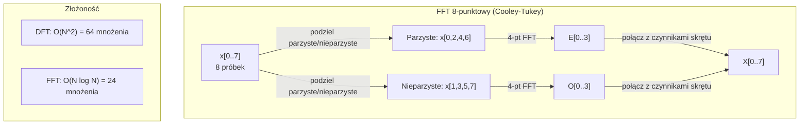
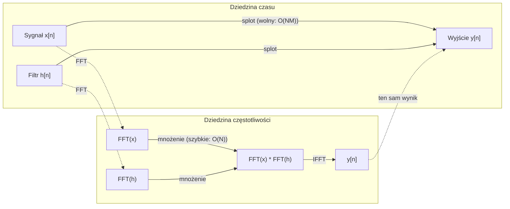

# Transformacja Fouriera

> Każdy sygnał jest sumą fal sinus. Transformacja Fouriera mówi, których.

**Type:** Build
**Language:** Python
**Prerequisites:** Phase 1, Lessons 01-04, 19 (complex numbers)
**Time:** ~90 minut

## Learning Objectives

- Zaimplementuj DFT od podstaw i zweryfikuj go przeciwko algorytmowi Cooleya-Tukeya FFT o złożoności O(N log N)
- Interpretuj współczynniki częstotliwościowe: wyodrębnij amplitudę, fazę i widmo mocy z sygnału
- Zastosuj twierdzenie o splocie do wykonania splotu przez mnożenie FFT
- Połącz dekompozycję częstotliwości Fouriera z kodowaniami pozycyjnymi w transformerach i warstwami splotowymi CNN

## Problem

Nagranie audio to sekwencja pomiarów ciśnienia w czasie. Cena akcji to sekwencja wartości w dniach. Obraz to siatka intensywności pikseli w przestrzeni. Wszystkie to dane w dziedzinie czasu (lub przestrzeni). Widzisz wartości zmieniające się wzdłuż jakiegoś indeksu.

Ale wiele wzorców jest niewidocznych w dziedzinie czasu. Czy ten sygnał audio to czysty ton czy akord? Czy ta cena akcji ma tygodniowy cykl? Czy ten obraz ma powtarzającą się teksturę? Te pytania dotyczą zawartości częstotliwościowej, a dziedzina czasu ją ukrywa.

Transformacja Fouriera przekształca dane z dziedziny czasu do dziedziny częstotliwości. Bierze sygnał i rozkłada go na fale sinus o różnych częstotliwościach. Każda fala sinus ma amplitudę (jak silna jest) i fazę (gdzie zaczyna). Transformacja Fouriera mówi o obu.

To ma znaczenie dla ML, ponieważ myślenie w dziedzinie częstotliwości pojawia się wszędzie. Splotowe sieci neuronowe wykonują splot, który jest mnożeniem w dziedzinie częstotliwości. Kodowania pozycyjne w transformerach używają dekompozycji częstotliwości do reprezentowania pozycji. Modele audio (rozpoznawanie mowy, generowanie muzyki) działają na spektrogramach – reprezentacjach częstotliwościowych dźwięku. Modele szeregów czasowych szukają okresowych wzorców. Zrozumienie transformacji Fouriera daje słownictwo do pracy ze wszystkimi tymi.

## Koncepcja

### Definicja DFT

Dla N próbek x[0], x[1], ..., x[N-1], dyskretna transformacja Fouriera produkuje N współczynników częstotliwościowych X[0], X[1], ..., X[N-1]:

```
X[k] = sum_{n=0}^{N-1} x[n] * e^(-2*pi*i*k*n/N)

dla k = 0, 1, ..., N-1
```

Każde X[k] to liczba zespolona. Jej moduł |X[k]| mówi amplitudę częstotliwości k. Jej faza angle(X[k]) mówi przesunięcie fazowe tej częstotliwości.

Kluczowa intuicja: `e^(-2*pi*i*k*n/N)` to wirujący fazor na częstotliwości k. DFT oblicza korelację między sygnałem a każdą z N równomiernie rozłożonych częstotliwości. Jeśli sygnał zawiera energię na częstotliwości k, korelacja jest duża. Jeśli nie, jest bliska zera.

### Co oznacza każdy współczynnik

**X[0]: składowa stała (DC).** To suma wszystkich próbek – proporcjonalna do średniej. Reprezentuje stałe (zerowej częstotliwości) przesunięcie sygnału.

```
X[0] = sum_{n=0}^{N-1} x[n] * e^0 = suma wszystkich próbek
```

**X[k] dla 1 <= k <= N/2: dodatnie częstotliwości.** X[k] reprezentuje częstotliwość k cykli na N próbek. Wyższe k oznacza wyższą częstotliwość (szybszą oscylację).

**X[N/2]: częstotliwość Nyquista.** Najwyższa częstotliwość, którą możesz reprezentować z N próbkami. Powyżej tej dostajesz aliasing – wysokie częstotliwości maskujące się jako niskie.

**X[k] dla N/2 < k < N: ujemne częstotliwości.** Dla sygnałów rzeczywistych X[N-k] = conj(X[k]). Ujemne częstotliwości są lustrzanymi odbiciami dodatnich. Dlatego użyteczna informacja jest w pierwszych N/2 + 1 współczynnikach.

### Odwrotna DFT

Odwrotna DFT odtwarza oryginalny sygnał z jego współczynników częstotliwościowych:

```
x[n] = (1/N) * sum_{k=0}^{N-1} X[k] * e^(2*pi*i*k*n/N)

dla n = 0, 1, ..., N-1
```

Jedyne różnice od prostej DFT: znak w wykładniku jest dodatni (nie ujemny) i jest czynnik normalizacyjny 1/N.

Odwrotna DFT to idealna rekonstrukcja. Żadna informacja nie jest tracona. Możesz przejść z dziedziny czasu do dziedziny częstotliwości i z powrotem bez żadnego błędu. DFT to zmiana bazy – wyraża te same informacje w innym układzie współrzędnych.

### FFT: przyspieszenie

DFT zdefiniowany powyżej to O(N^2): dla każdego z N wyjściowych współczynników sumujesz N wejściowych próbek. Dla N = 1 milion, to 10^12 operacji.

Szybka transformacja Fouriera (FFT) oblicza ten sam wynik w O(N log N). Dla N = 1 milion, to około 20 milionów operacji zamiast biliona. To czyni analizę częstotliwościową praktyczną.

Algorytm Cooleya-Tukeya (najczęstszy FFT) działa przez dziel i zwyciężaj:

1. Podziel sygnał na próbki o parzystych i nieparzystych indeksach.
2. Oblicz DFT każdej połowy rekurencyjnie.
3. Połącz dwie połowy DFT używając "współczynników skrętu" e^(-2*pi*i*k/N).

```
X[k] = E[k] + e^(-2*pi*i*k/N) * O[k]          dla k = 0, ..., N/2 - 1
X[k + N/2] = E[k] - e^(-2*pi*i*k/N) * O[k]    dla k = 0, ..., N/2 - 1

gdzie E = DFT próbek o parzystych indeksach
      O = DFT próbek o nieparzystych indeksach
```

Symetria oznacza, że każdy poziom rekurencji robi O(N) pracy, a jest log2(N) poziomów. Razem: O(N log N).



FFT wymaga długości sygnału będącej potęgą 2. W praktyce sygnały są uzupełniane zerami do następnej potęgi 2.

### Analiza widmowa

**Widmo mocy** to |X[k]|^2 – kwadrat modułu każdego współczynnika częstotliwościowego. Pokazuje, ile energii jest na każdej częstotliwości.

**Widmo fazowe** to angle(X[k]) – przesunięcie fazowe każdej częstotliwości. Dla większości zadań analizy interesuje cię widmo mocy i ignorujesz fazę.

```
Moc na częstotliwości k:  P[k] = |X[k]|^2 = X[k].real^2 + X[k].imag^2
Faza na częstotliwości k:  phi[k] = atan2(X[k].imag, X[k].real)
```

### Rozdzielczość częstotliwościowa

Rozdzielczość częstotliwościowa DFT zależy od liczby próbek N i częstotliwości próbkowania fs.

```
Częstotliwość k-tego pojemnika:      f_k = k * fs / N
Rozdzielczość częstotliwościowa:    delta_f = fs / N
Maksymalna częstotliwość:           f_max = fs / 2  (Nyquist)
```

Aby rozróżnić dwie częstotliwości blisko siebie, potrzebujesz więcej próbek. Aby przechwycić wysokie częstotliwości, potrzebujesz wyższej częstotliwości próbkowania.

### Twierdzenie o splocie

To jeden z najważniejszych wyników w przetwarzaniu sygnałów i bezpośrednio istotny dla CNN.

**Splot w dziedzinie czasu równa się mnożeniu punktowemu w dziedzinie częstotliwości.**

```
x * h = IFFT(FFT(x) . FFT(h))

gdzie * to splot, a . to mnożenie elementarne
```

Dlaczego to ma znaczenie:

- Bezpośredni splot dwóch sygnałów długości N i M zajmuje O(N*M) operacji.
- Splot oparty na FFT zajmuje O(N log N): przekształć oba, pomnóż, przekształć z powrotem.
- Dla dużych jąder splot FFT jest dramatycznie szybszy.
- To dokładnie to, co dzieje się w warstwach splotowych z dużymi polami recepcyjnymi.

Uwaga: DFT oblicza splot kołowy (sygnał zawija się). Dla splotu liniowego (bez zawijania) uzupełnij oba sygnały zerami do długości N + M - 1 przed obliczeniem.



### Okienkowanie

DFT zakłada, że sygnał jest okresowy – traktuje N próbek jako jeden okres nieskończenie powtarzającego się sygnału. Jeśli sygnał nie zaczyna się i nie kończy na tej samej wartości, tworzy to nieciągłość na granicy, co objawia się jako fałszywa zawartość wysokich częstotliwości. To nazywa się wyciekiem widmowym.

Okienkowanie redukuje wyciek przez zwężanie sygnału do zera na obu końcach przed obliczeniem DFT.

Typowe okna:

| Okno | Kształt | Szerokość listka głównego | Poziom listka bocznego | Zastosowanie |
|--------|-------|----------------|-----------------|----------|
| Prostokątne | Płaskie (bez okna) | Najwęższy | Najwyższy (-13 dB) | Gdy sygnał jest dokładnie okresowy w N próbkach |
| Hanna | Podniesiony cosinus | Umiarkowany | Niski (-31 dB) | Ogólna analiza widmowa |
| Hamminga | Modyfikowany cosinus | Umiarkowany | Niższy (-42 dB) | Przetwarzanie audio, analiza mowy |
| Blackmana | Potrójny cosinus | Szeroki | Bardzo niski (-58 dB) | Gdy tłumienie listków bocznych jest krytyczne |

```
Okno Hanna:    w[n] = 0.5 * (1 - cos(2*pi*n / (N-1)))
Okno Hamminga: w[n] = 0.54 - 0.46 * cos(2*pi*n / (N-1))
```

Zastosuj okno przez pomnożenie go elementarnie z sygnałem przed DFT: `X = DFT(x * w)`.

### Własności DFT

| Własność | Dziedzina czasu | Dziedzina częstotliwości |
|----------|-------------|-----------------|
| Liniowość | a*x + b*y | a*X + b*Y |
| Przesunięcie w czasie | x[n - k] | X[f] * e^(-2*pi*i*f*k/N) |
| Przesunięcie częstotliwości | x[n] * e^(2*pi*i*f0*n/N) | X[f - f0] |
| Splot | x * h | X * H (punktowe) |
| Mnożenie | x * h (punktowe) | X * H (splot kołowy, skalowany przez 1/N) |
| Twierdzenie Parsevala | sum |x[n]|^2 | (1/N) * sum |X[k]|^2 |
| Symetria sprzężenia (rzeczywiste wejście) | x[n] rzeczywiste | X[k] = conj(X[N-k]) |

Twierdzenie Parsevala mówi, że całkowita energia jest taka sama w obu dziedzinach. Energia jest zachowana przez transformację.

### Związek z kodowaniami pozycyjnymi

Oryginalny Transformer używa sinusoidalnych kodowań pozycyjnych:

```
PE(pos, 2i)   = sin(pos / 10000^(2i/d_model))
PE(pos, 2i+1) = cos(pos / 10000^(2i/d_model))
```

Każda para wymiarów (2i, 2i+1) oscyluje na innej częstotliwości. Częstotliwości są geometrycznie rozłożone od wysokich (wymiar 0,1) do niskich (ostatnie wymiary). To daje każdej pozycji unikalny wzorzec we wszystkich pasmach częstotliwości – podobnie jak współczynniki Fouriera jednoznacznie identyfikują sygnał.

Kluczowe własności, które to zapewnia:

- **Unikalność:** Żadne dwie pozycje nie mają tego samego kodowania.
- **Ograniczone wartości:** sin i cos są zawsze w [-1, 1].
- **Względna pozycja:** Kodowanie pozycji p+k może być wyrażone jako liniowa funkcja kodowania w pozycji p. Model może nauczyć się zwracać uwagę na względne pozycje.

### Związek z CNN

Warstwa splotowa stosuje nauczony filtr (jądro) do wejścia przez przesuwanie go w poprzek sygnału lub obrazu. Matematycznie jest to operacja splotu.

Z twierdzenia o splocie jest to równoważne:
1. FFT wejścia
2. FFT jądra
3. Mnożenie w dziedzinie częstotliwości
4. IFFT wyniku

Standardowe implementacje CNN używają bezpośredniego splotu (szybszego dla małych jąder 3x3). Ale dla dużych jąder lub globalnego splotu, podejścia oparte na FFT są znacząco szybsze. Niektóre architektury (jak FNet) zastępują uwagę całkowicie FFT, osiągając konkurencyjną dokładność z O(N log N) zamiast O(N^2).

### Spektrogramy i krótkookresowa transformacja Fouriera

Pojedynczy FFT daje zawartość częstotliwościową całego sygnału, ale nie mówi nic o tym, kiedy te częstotliwości występują. Ćwierkanie (sygnał, którego częstotliwość rośnie w czasie) i akord (wszystkie częstotliwości obecne jednocześnie) mogą mieć to samo widmo modułu.

Krótkookresowa transformacja Fouriera (STFT) rozwiązuje to przez obliczanie FFT na nakładających się oknach sygnału. Wynik to spektrogram: reprezentacja 2D z czasem na jednej osi i częstotliwością na drugiej. Intensywność w każdym punkcie pokazuje energię na tej częstotliwości w tym czasie.

```
Procedura STFT:
1. Wybierz rozmiar okna (np. 1024 próbki)
2. Wybierz rozmiar skoku (np. 256 próbek – 75% nakładania)
3. Dla każdej pozycji okna:
   a. Wyodrębnij segment okienkowany
   b. Zastosuj okno Hanna/Hamminga
   c. Oblicz FFT
   d. Zapisz widmo modułu jako jedną kolumnę spektrogramu
```

Spektrogramy są standardową reprezentacją wejściową dla modeli audio ML. Modele rozpoznawania mowy (Whisper, DeepSpeech) działają na mel-spektrogramach – spektrogramach z częstotliwościami mapowanymi do skali mel, która lepiej odpowiada ludzkiemu postrzeganiu wysokości.

### Aliasing

Jeśli sygnał zawiera częstotliwości powyżej fs/2 (częstotliwość Nyquista), próbkowanie z szybkością fs stworzy aliasowe kopie. Sygnał 90 Hz próbkowany przy 100 Hz wygląda identycznie jak sygnał 10 Hz. Nie ma sposobu, by odróżnić je z samych próbek.

```
Przykład:
  Prawdziwy sygnał: fala sinusoidalna 90 Hz
  Częstotliwość próbkowania: 100 Hz
  Pozorna częstotliwość: 100 - 90 = 10 Hz

  Próbki z sygnału 90 Hz przy częstotliwości próbkowania 100 Hz
  są identyczne z próbkami z sygnału 10 Hz.
  Żadna matematyka nie może odzyskać oryginalnych 90 Hz.
```

Dlatego przetworniki analogowo-cyfrowe zawierają filtry antyaliasingowe, które usuwają częstotliwości powyżej Nyquista przed próbkowaniem. W ML aliasing pojawia się przy próbkowaniu w dół map cech bez odpowiedniego filtrowania dolnoprzepustowego – niektóre architektury rozwiązują to przez warstwy pulowania z antyaliasingiem.

### Uzupełnianie zerami nie zwiększa rozdzielczości

Powszechne nieporozumienie: uzupełnienie sygnału zerami przed FFT poprawia rozdzielczość częstotliwościową. Nie poprawia. Uzupełnianie zerami interpoluje między istniejącymi pojemnikami częstotliwości, dając gładsze wyglądające widmo. Ale nie może ujawnić szczegółów częstotliwościowych, które nie były obecne w oryginalnych próbkach.

Prawdziwa rozdzielczość częstotliwościowa zależy tylko od czasu obserwacji T = N / fs. Aby rozróżnić dwie częstotliwości oddzielone o delta_f, potrzebujesz co najmniej T = 1 / delta_f sekund danych. Żadna ilość uzupełniania zerami nie zmienia tego fundamentalnego limitu.

```figure
fourier-synthesis
```

## Build It

### Krok 1: DFT od podstaw

DFT O(N^2) wynika bezpośrednio z definicji.

```python
import math

class Complex:
    ...

def dft(x):
    N = len(x)
    result = []
    for k in range(N):
        total = Complex(0, 0)
        for n in range(N):
            angle = -2 * math.pi * k * n / N
            w = Complex(math.cos(angle), math.sin(angle))
            xn = x[n] if isinstance(x[n], Complex) else Complex(x[n])
            total = total + xn * w
        result.append(total)
    return result
```

### Krok 2: Odwrotna DFT

Ta sama struktura, dodatni wykładnik, podziel przez N.

```python
def idft(X):
    N = len(X)
    result = []
    for n in range(N):
        total = Complex(0, 0)
        for k in range(N):
            angle = 2 * math.pi * k * n / N
            w = Complex(math.cos(angle), math.sin(angle))
            total = total + X[k] * w
        result.append(Complex(total.real / N, total.imag / N))
    return result
```

### Krok 3: FFT (Cooley-Tukey)

Rekurencyjny FFT wymaga długości będącej potęgą 2. Podziel na parzyste i nieparzyste, rekurencyjnie oblicz, połącz z czynnikami skrętu.

```python
def fft(x):
    N = len(x)
    if N <= 1:
        return [x[0] if isinstance(x[0], Complex) else Complex(x[0])]
    if N % 2 != 0:
        return dft(x)

    even = fft([x[i] for i in range(0, N, 2)])
    odd = fft([x[i] for i in range(1, N, 2)])

    result = [Complex(0)] * N
    for k in range(N // 2):
        angle = -2 * math.pi * k / N
        twiddle = Complex(math.cos(angle), math.sin(angle))
        t = twiddle * odd[k]
        result[k] = even[k] + t
        result[k + N // 2] = even[k] - t
    return result
```

### Krok 4: Pomocniki analizy widmowej

```python
def power_spectrum(X):
    return [xk.real ** 2 + xk.imag ** 2 for xk in X]

def convolve_fft(x, h):
    N = len(x) + len(h) - 1
    padded_N = 1
    while padded_N < N:
        padded_N *= 2

    x_padded = x + [0.0] * (padded_N - len(x))
    h_padded = h + [0.0] * (padded_N - len(h))

    X = fft(x_padded)
    H = fft(h_padded)

    Y = [xk * hk for xk, hk in zip(X, H)]

    y = idft(Y)
    return [y[n].real for n in range(N)]
```

## Use It

Do rzeczywistej pracy użyj numpy FFT, który opiera się na wysoce zoptymalizowanych bibliotekach C.

```python
import numpy as np

signal = np.sin(2 * np.pi * 5 * np.arange(256) / 256)
spectrum = np.fft.fft(signal)
freqs = np.fft.fftfreq(256, d=1/256)

power = np.abs(spectrum) ** 2

positive_freqs = freqs[:len(freqs)//2]
positive_power = power[:len(power)//2]
```

Dla okienkowania i bardziej zaawansowanej analizy widmowej:

```python
from scipy.signal import windows, stft

window = windows.hann(256)
windowed = signal * window
spectrum = np.fft.fft(windowed)
```

Dla splotu:

```python
from scipy.signal import fftconvolve

result = fftconvolve(signal, kernel, mode='full')
```

Dla spektrogramów:

```python
from scipy.signal import stft

frequencies, times, Zxx = stft(signal, fs=sample_rate, nperseg=256)
spectrogram = np.abs(Zxx) ** 2
```

Macierz spektrogramu ma kształt (n_częstotliwości, n_ramek_czasowych). Każda kolumna to widmo mocy w jednym oknie czasowym. To właśnie modele audio ML konsumują jako wejście.

## Ship It

Uruchom `code/fourier.py`, by wygenerować `outputs/prompt-spectral-analyzer.md`.

## Ćwiczenia

1. **Identyfikacja czystego tonu.** Stwórz sygnał z pojedynczą falą sinusoidalną o nieznanej częstotliwości (między 1 a 50 Hz), próbkowany przy 128 Hz przez 1 sekundę. Użyj swojego DFT do identyfikacji częstotliwości. Zweryfikuj, czy odpowiedź się zgadza. Teraz dodaj szum Gaussa z odchyleniem standardowym 0.5 i powtórz. Jak szum wpływa na widmo?

2. **Weryfikacja FFT vs DFT.** Wygeneruj losowy sygnał długości 64. Oblicz zarówno DFT (O(N^2)), jak i FFT. Zweryfikuj, że wszystkie współczynniki zgadzają się do 1e-10. Zmierz czas obu funkcji na sygnałach długości 256, 512, 1024 i 2048. Wykreśl stosunek czasu DFT do FFT.

3. **Dowód twierdzenia o splocie na przykładzie.** Stwórz sygnał x = [1, 2, 3, 4, 0, 0, 0, 0] i filtr h = [1, 1, 1, 0, 0, 0, 0, 0]. Oblicz ich splot kołowy bezpośrednio (zagnieżdżona pętla). Następnie oblicz go przez FFT (przekształć, pomnóż, przekształć odwrotnie). Zweryfikuj, że wyniki się zgadzają. Teraz zrób splot liniowy przez odpowiednie uzupełnienie zerami.

4. **Efekty okienkowania.** Stwórz sygnał będący sumą dwóch fal sinusoidalnych na 10 Hz i 12 Hz (bardzo blisko). Próbkuj przy 128 Hz przez 1 sekundę. Oblicz widmo mocy bez okna, z oknem Hanna i z oknem Hamminga. Które okno ułatwia rozróżnienie dwóch pików? Dlaczego?

5. **Analiza kodowań pozycyjnych.** Wygeneruj sinusoidalne kodowania pozycyjne dla d_model = 128 i max_pos = 512. Dla każdej pary pozycji (p1, p2) oblicz iloczyn skalarny ich kodowań. Pokaż, że iloczyn skalarny zależy tylko od |p1 - p2|, a nie od pozycji absolutnych. Co się dzieje z iloczynem skalarnym, gdy odległość rośnie?

## Key Terms

| Termin | Co znaczy |
|------|---------------|
| DFT (Dyskretna transformacja Fouriera) | Przekształca N próbek w dziedzinie czasu na N współczynników w dziedzinie częstotliwości. Każdy współczynnik to korelacja z zespoloną sinusoidą na tej częstotliwości |
| FFT (Szybka transformacja Fouriera) | Algorytm O(N log N) do obliczania DFT. Algorytm Cooleya-Tukeya dzieli parzyste/nieparzyste indeksy rekurencyjnie |
| Odwrotna DFT | Odtwarza sygnał w dziedzinie czasu ze współczynników częstotliwościowych. Ten sam wzór co DFT z odwróconym znakiem wykładnika i skalowaniem 1/N |
| Pojemnik częstotliwości | Każdy indeks k w wyjściu DFT reprezentuje częstotliwość k*fs/N Hz. "Pojemnik" to dyskretna szczelina częstotliwości |
| Składowa DC | X[0], współczynnik zerowej częstotliwości. Proporcjonalny do średniej sygnału |
| Częstotliwość Nyquista | fs/2, maksymalna częstotliwość reprezentowalna przy szybkości próbkowania fs. Częstotliwości powyżej tej dają aliasing |
| Widmo mocy | |X[k]|^2, kwadrat modułu każdego współczynnika częstotliwościowego. Pokazuje rozkład energii między częstotliwościami |
| Widmo fazowe | angle(X[k]), przesunięcie fazowe każdej składowej częstotliwościowej. Często ignorowane w analizie |
| Wyciek widmowy | Fałszywa zawartość częstotliwościowa spowodowana traktowaniem nieokresowego sygnału jako okresowego. Redukowany przez okienkowanie |
| Funkcja okna | Funkcja zwężająca (Hanna, Hamminga, Blackmana) stosowana przed DFT w celu redukcji wycieku widmowego |
| Czynnik skrętu | Eksponenta zespolona e^(-2*pi*i*k/N) używana do łączenia pod-DFT w obliczeniach FFT |
| Twierdzenie o splocie | Splot w dziedzinie czasu równa się mnożeniu punktowemu w dziedzinie częstotliwości. Fundamentalne dla przetwarzania sygnałów i CNN |
| Splot kołowy | Splot, w którym sygnał zawija się. To DFT naturalnie oblicza |
| Splot liniowy | Standardowy splot bez zawijania. Osiągany przez uzupełnienie zerami przed DFT |
| Twierdzenie Parsevala | Energia całkowita jest zachowana przez transformację Fouriera. sum |x[n]|^2 = (1/N) sum |X[k]|^2 |
| Aliasing | Gdy częstotliwości powyżej Nyquista pojawiają się jako niższe częstotliwości z powodu niewystarczającej szybkości próbkowania |