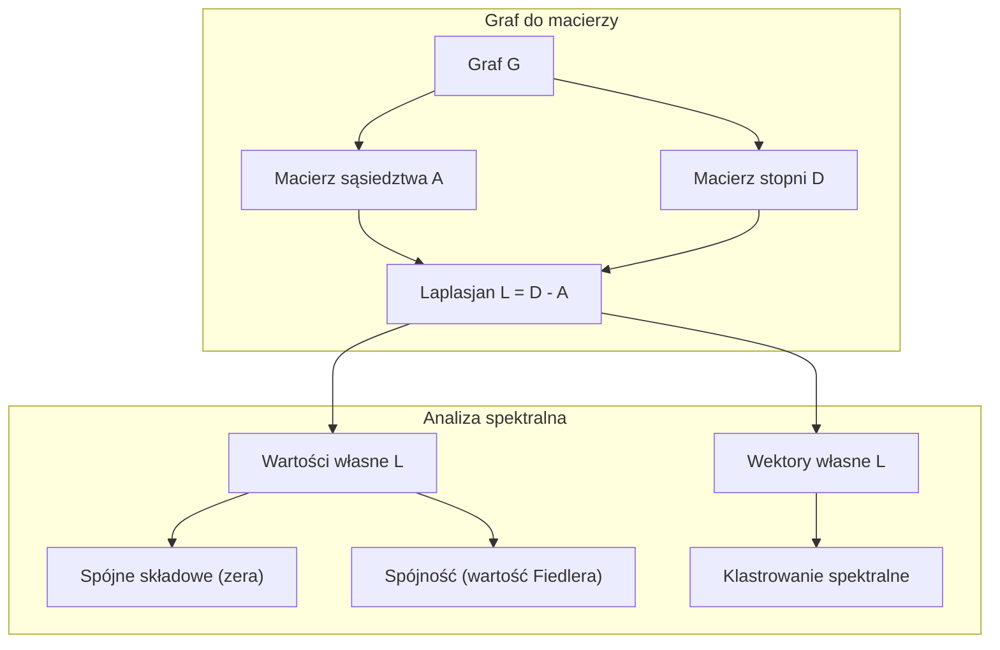
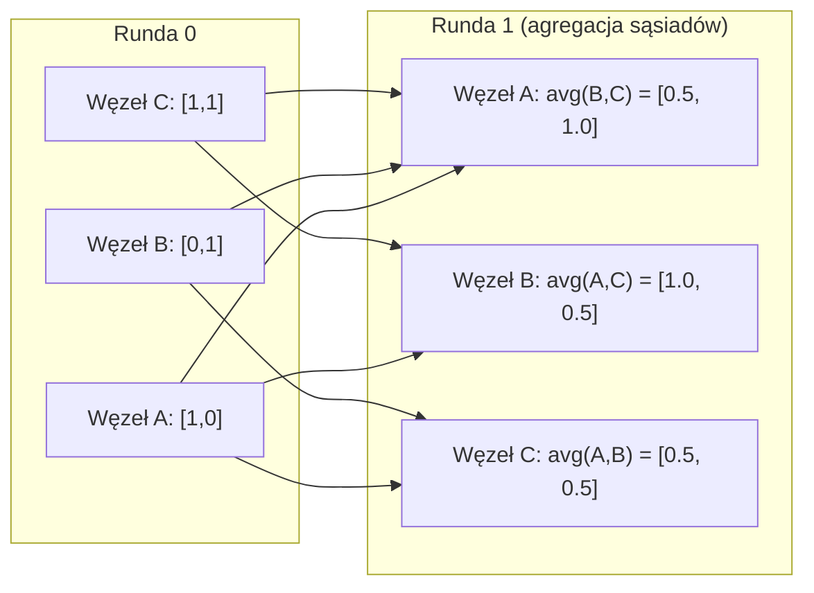

# Teoria grafów dla uczenia maszynowego

> Grafy są strukturą danych relacji. Jeśli twoje dane mają połączenia, potrzebujesz teorii grafów.

**Type:** Build
**Language:** Python
**Prerequisites:** Phase 1, Lessons 01-03 (linear algebra, matrices)
**Time:** ~90 minut

## Learning Objectives

- Zbuduj klasę grafu z reprezentacją macierzy sąsiedztwa/listy sąsiedztwa i zaimplementuj przejścia BFS i DFS
- Oblicz laplasjan grafu i użyj jego wartości własnych do wykrywania spójnych składowych i klastrowania węzłów
- Zaimplementuj jedną rundę przekazywania wiadomości w stylu GNN jako znormalizowane mnożenie macierzy sąsiedztwa
- Zastosuj klastrowanie spektralne do partycjonowania grafu używając wektora Fiedlera

## Problem

Sieci społecznościowe, cząsteczki, bazy wiedzy, sieci cytowań, mapy drogowe – wszystkie są grafami. Tradycyjne ML traktuje dane jako płaskie tabele. Każdy wiersz jest niezależny. Każda cecha to kolumna. Ale gdy struktura połączeń ma znaczenie, tabele zawodzą.

Rozważ sieć społecznościową. Chcesz przewidzieć, jaki produkt kupi użytkownik. Historia zakupów ma znaczenie. Ale historia zakupów znajomych ma większe znaczenie. Połączenia niosą sygnał.

Albo rozważ cząsteczkę. Chcesz przewidzieć, czy wiąże się z białkiem. Atomy mają znaczenie, ale to, co naprawdę ma znaczenie, to jak atomy są ze sobą połączone. Struktura jest danymi.

Grafowe sieci neuronowe (GNN) to najszybciej rozwijający się obszar w głębokim uczeniu. Napędzają odkrywanie leków, rekomendacje społecznościowe, wykrywanie oszustw i wnioskowanie w bazach wiedzy. Każdy GNN buduje na tym samym fundamencie: podstawowej teorii grafów.

Potrzebujesz czterech rzeczy:
1. Sposobu reprezentowania grafów jako macierzy (by móc je mnożyć)
2. Algorytmów przejścia do eksploracji struktury grafu
3. Laplasjanu – najważniejszej pojedynczej macierzy w spektralnej teorii grafów
4. Przekazywania wiadomości – operacji, która sprawia, że GNN działają

## Koncepcja

### Grafy: węzły i krawędzie

Graf G = (V, E) składa się z wierzchołków (węzłów) V i krawędzi E. Każda krawędź łączy dwa węzły.

**Skierowane vs nieskierowane.** W grafie nieskierowanym krawędź (u, v) oznacza, że u łączy się z v I v łączy się z u. W grafie skierowanym (digraf) krawędź (u, v) oznacza, że u wskazuje na v, ale niekoniecznie odwrotnie.

**Ważone vs nieważone.** W grafie nieważonym krawędzie albo istnieją, albo nie. W grafie ważonym każda krawędź ma wagę liczbową – odległość, koszt, siłę.

| Typ grafu | Przykład |
|-----------|---------|
| Nieskierowany, nieważony | Sieć znajomości na Facebooku |
| Skierowany, nieważony | Sieć obserwowanych na Twitterze |
| Nieskierowany, ważony | Mapa drogowa (odległości) |
| Skierowany, ważony | Linki stron WWW (PageRank) |

### Macierz sąsiedztwa

Macierz sąsiedztwa A jest podstawową reprezentacją. Dla grafu z n węzłami:

```
A[i][j] = 1    jeśli istnieje krawędź z węzła i do węzła j
A[i][j] = 0    w przeciwnym razie
```

Dla grafów nieskierowanych A jest symetryczna: A[i][j] = A[j][i]. Dla grafów ważonych A[i][j] = waga krawędzi (i, j).

**Przykład – trójkąt:**

```
Węzły: 0, 1, 2
Krawędzie: (0,1), (1,2), (0,2)

A = [[0, 1, 1],
     [1, 0, 1],
     [1, 1, 0]]
```

Macierz sąsiedztwa jest wejściem do każdego GNN. Operacje macierzowe na A odpowiadają operacjom na grafie.

### Stopień

Stopień węzła to liczba krawędzi do niego podłączonych. Dla grafów skierowanych masz stopień wejściowy (krawędzie wchodzące) i stopień wyjściowy (krawędzie wychodzące).

Macierz stopni D jest diagonalna:

```
D[i][i] = stopień węzła i
D[i][j] = 0    dla i != j
```

Dla przykładu trójkąta: D = diag(2, 2, 2), ponieważ każdy węzeł łączy się z dwoma innymi.

Stopień mówi o ważności węzła. Wysoki stopień = węzeł centralny. Rozkład stopni sieci ujawnia jej strukturę. Sieci społecznościowe podążają za prawami potęgowymi (mało centrów, wiele liści). Grafy losowe mają stopnie o rozkładzie Poissona.

### BFS i DFS

Dwa fundamentalne algorytmy przejścia grafu. Potrzebujesz obu.

**BFS (przeszukiwanie wszerz):** Przeglądaj najpierw wszystkich sąsiadów, potem sąsiadów sąsiadów. Używa kolejki (FIFO).

```
BFS z węzła 0:
  Odwiedź 0
  Kolejka: [1, 2]        (sąsiedzi 0)
  Odwiedź 1
  Kolejka: [2, 3]        (dodaj sąsiadów 1)
  Odwiedź 2
  Kolejka: [3]           (sąsiedzi 2 już odwiedzeni)
  Odwiedź 3
  Kolejka: []            (koniec)
```

BFS znajduje najkrótsze ścieżki w grafach nieważonych. Odległość od startu do dowolnego węzła jest równa poziomowi BFS, na którym ten węzeł jest pierwszy raz odkryty. Dlatego BFS jest używany do odległości w skokach w sieciach społecznościowych.

**DFS (przeszukiwanie w głąb):** Idź tak głęboko, jak to możliwe, zanim się cofniesz. Używa stosu (LIFO) lub rekurencji.

```
DFS z węzła 0:
  Odwiedź 0
  Stos: [1, 2]           (sąsiedzi 0)
  Odwiedź 2              (zdejmij ze stosu)
  Stos: [1, 3]           (dodaj sąsiadów 2)
  Odwiedź 3              (zdejmij ze stosu)
  Stos: [1]
  Odwiedź 1              (zdejmij ze stosu)
  Stos: []               (koniec)
```

DFS jest przydatny do:
- Znajdowania spójnych składowych (uruchom DFS z nieodwiedzonych węzłów)
- Wykrywania cykli (krawędzie wsteczne w drzewie DFS)
- Sortowania topologicznego (odwrócona kolejność zakończenia DFS)

| Algorytm | Struktura danych | Znajduje | Zastosowanie |
|-----------|---------------|-------|----------|
| BFS | Kolejka | Najkrótsze ścieżki | Odległość w sieci społecznościowej, przejście bazy wiedzy |
| DFS | Stos | Składowe, cykle | Spójność, sortowanie topologiczne |

### Laplasjan grafu

L = D - A. Najważniejsza macierz w spektralnej teorii grafów.

Dla trójkąta:

```
D = [[2, 0, 0],    A = [[0, 1, 1],    L = [[2, -1, -1],
     [0, 2, 0],         [1, 0, 1],         [-1, 2, -1],
     [0, 0, 2]]         [1, 1, 0]]         [-1, -1,  2]]
```

Laplasjan ma niezwykłe własności:

1. **L jest dodatnio półokreślony.** Wszystkie wartości własne są >= 0.

2. **Liczba zerowych wartości własnych równa się liczbie spójnych składowych.** Spójny graf ma dokładnie jedną zerową wartość własną. Graf z 3 odłączonymi składowymi ma trzy zerowe wartości własne.

3. **Najmniejsza niezerowa wartość własna (wartość Fiedlera) mierzy spójność.** Duża wartość Fiedlera oznacza, że graf jest dobrze połączony. Mała wartość Fiedlera oznacza, że graf ma słaby punkt – wąskie gardło.

4. **Wektor własny wartości Fiedlera (wektor Fiedlera) ujawnia najlepszy podział.** Węzły z dodatnimi wartościami idą do jednej grupy, węzły z ujemnymi do drugiej. To jest klastrowanie spektralne.



### Własności spektralne

Wartości własne macierzy sąsiedztwa i laplasjanu ujawniają własności strukturalne bez żadnego przejścia.

**Klastrowanie spektralne** działa w ten sposób:
1. Oblicz laplasjan L
2. Znajdź k najmniejszych wektorów własnych L (pomiń pierwszy, który jest wszystkimi jedynkami dla spójnych grafów)
3. Użyj tych wektorów własnych jako nowych współrzędnych dla każdego węzła
4. Uruchom k-średnich na tych współrzędnych

Dlaczego to działa? Wektory własne L kodują "najgładsze" funkcje na grafie. Węzły dobrze połączone dostają podobne wartości wektorów własnych. Węzły rozdzielone wąskim gardłem dostają różne wartości. Wektory własne naturalnie oddzielają klastry.

**Związek z błądzeniem losowym.** Znormalizowany laplasjan odnosi się do błądzeń losowych na grafie. Rozkład stacjonarny błądzenia losowego jest proporcjonalny do stopnia węzła. Czas mieszania (jak szybko błądzenie zbiega) zależy od przerwy spektralnej.

### Przekazywanie wiadomości

Podstawowa operacja grafowych sieci neuronowych. Każdy węzeł zbiera wiadomości od sąsiadów, agreguje je i aktualizuje swój własny stan.

```
h_v^(k+1) = UPDATE(h_v^(k), AGGREGATE({h_u^(k) : u w sąsiedzi(v)}))
```

W najprostszej formie AGGREGATE = średnia, a UPDATE = transformacja liniowa + aktywacja:

```
h_v^(k+1) = sigma(W * średnia({h_u^(k) : u w sąsiedzi(v)}))
```

To jest mnożenie macierzy w przebraniu. Jeśli H jest macierzą wszystkich cech węzłów, a A jest macierzą sąsiedztwa:

```
H^(k+1) = sigma(A_norm * H^(k) * W)
```

gdzie A_norm jest znormalizowaną macierzą sąsiedztwa (każdy wiersz sumuje się do 1).

Jedna runda przekazywania wiadomości pozwala każdemu węzłowi "widzieć" swoich bezpośrednich sąsiadów. Dwie rundy pozwalają widzieć sąsiadów sąsiadów. K rund daje każdemu węzłowi informację z jego K-sąsiedztwa.



### Koncepcje i zastosowania ML

| Koncepcja | Zastosowanie ML |
|---------|---------------|
| Macierz sąsiedztwa | Reprezentacja wejściowa GNN |
| Laplasjan grafu | Klastrowanie spektralne, wykrywanie społeczności |
| BFS/DFS | Przejście bazy wiedzy, znajdowanie ścieżki |
| Rozkład stopni | Ważność węzła, inżynieria cech |
| Przekazywanie wiadomości | Warstwy GNN (GCN, GAT, GraphSAGE) |
| Wartości własne L | Wykrywanie społeczności, partycjonowanie grafu |
| Klastrowanie spektralne | Nienadzorowane grupowanie węzłów |
| PageRank | Ważność węzła, wyszukiwanie w sieci |

```figure
graph-degree-distribution
```

## Build It

### Krok 1: Klasa Graph od podstaw

```python
class Graph:
    def __init__(self, n_nodes, directed=False):
        self.n = n_nodes
        self.directed = directed
        self.adj = {i: {} for i in range(n_nodes)}

    def add_edge(self, u, v, weight=1.0):
        self.adj[u][v] = weight
        if not self.directed:
            self.adj[v][u] = weight

    def neighbors(self, node):
        return list(self.adj[node].keys())

    def degree(self, node):
        return len(self.adj[node])

    def adjacency_matrix(self):
        import numpy as np
        A = np.zeros((self.n, self.n))
        for u in range(self.n):
            for v, w in self.adj[u].items():
                A[u][v] = w
        return A

    def degree_matrix(self):
        import numpy as np
        D = np.zeros((self.n, self.n))
        for i in range(self.n):
            D[i][i] = self.degree(i)
        return D

    def laplacian(self):
        return self.degree_matrix() - self.adjacency_matrix()
```

Lista sąsiedztwa (`self.adj`) przechowuje sąsiadów wydajnie. Konwersja macierzy sąsiedztwa używa numpy, ponieważ wszystkie operacje spektralne tego potrzebują.

### Krok 2: BFS i DFS

```python
from collections import deque

def bfs(graph, start):
    visited = set()
    order = []
    distances = {}
    queue = deque([(start, 0)])
    visited.add(start)
    while queue:
        node, dist = queue.popleft()
        order.append(node)
        distances[node] = dist
        for neighbor in graph.neighbors(node):
            if neighbor not in visited:
                visited.add(neighbor)
                queue.append((neighbor, dist + 1))
    return order, distances


def dfs(graph, start):
    visited = set()
    order = []
    stack = [start]
    while stack:
        node = stack.pop()
        if node in visited:
            continue
        visited.add(node)
        order.append(node)
        for neighbor in reversed(graph.neighbors(node)):
            if neighbor not in visited:
                stack.append(neighbor)
    return order
```

BFS używa deque (kolejki dwustronnej) dla O(1) popleft. DFS używa listy jako stosu. Oba odwiedzają każdy węzeł dokładnie raz -- O(V + E) czasu.

### Krok 3: Spójne składowe i wartości własne laplasjanu

```python
def connected_components(graph):
    visited = set()
    components = []
    for node in range(graph.n):
        if node not in visited:
            order, _ = bfs(graph, node)
            visited.update(order)
            components.append(order)
    return components


def laplacian_eigenvalues(graph):
    import numpy as np
    L = graph.laplacian()
    eigenvalues = np.linalg.eigvalsh(L)
    return eigenvalues
```

`eigvalsh` jest dla macierzy symetrycznych -- laplasjan jest zawsze symetryczny dla nieskierowanych grafów. Zwraca wartości własne w porządku rosnącym. Policz zera, by znaleźć liczbę spójnych składowych.

### Krok 4: Klastrowanie spektralne

```python
def spectral_clustering(graph, k=2):
    import numpy as np
    L = graph.laplacian()
    eigenvalues, eigenvectors = np.linalg.eigh(L)
    features = eigenvectors[:, 1:k+1]

    labels = np.zeros(graph.n, dtype=int)
    for i in range(graph.n):
        if features[i, 0] >= 0:
            labels[i] = 0
        else:
            labels[i] = 1
    return labels
```

Dla k=2 znak wektora Fiedlera dzieli graf na dwa klastry. Dla k>2 uruchomiłbyś k-średnich na pierwszych k wektorach własnych (pomijając trywialny wektor wszystkich jedynek).

### Krok 5: Przekazywanie wiadomości

```python
def message_passing(graph, features, weight_matrix):
    import numpy as np
    A = graph.adjacency_matrix()
    row_sums = A.sum(axis=1, keepdims=True)
    row_sums[row_sums == 0] = 1
    A_norm = A / row_sums
    aggregated = A_norm @ features
    output = aggregated @ weight_matrix
    return output
```

To jest jedna runda przekazywania wiadomości GNN. Nowe cechy każdego węzła to ważona średnia cech sąsiadów, przekształcona przez macierz wag. Ułóż wiele rund, by propagować informację dalej.

## Use It

Z networkx i numpy te same operacje to jednolinijkowce:

```python
import networkx as nx
import numpy as np

G = nx.karate_club_graph()

A = nx.adjacency_matrix(G).toarray()
L = nx.laplacian_matrix(G).toarray()

eigenvalues = np.linalg.eigvalsh(L.astype(float))
print(f"Najmniejsze wartości własne: {eigenvalues[:5]}")
print(f"Spójne składowe: {nx.number_connected_components(G)}")

communities = nx.community.greedy_modularity_communities(G)
print(f"Znalezione społeczności: {len(communities)}")

pr = nx.pagerank(G)
top_nodes = sorted(pr.items(), key=lambda x: x[1], reverse=True)[:5]
print(f"Top 5 węzłów PageRank: {top_nodes}")
```

networkx obsługuje grafy dowolnego rozmiaru z zoptymalizowanymi backendami C. Używaj go w produkcji. Używaj swojej implementacji od podstaw, by zrozumieć, co robi.

### Analiza spektralna numpy

```python
import numpy as np

A = np.array([
    [0, 1, 1, 0, 0],
    [1, 0, 1, 0, 0],
    [1, 1, 0, 1, 0],
    [0, 0, 1, 0, 1],
    [0, 0, 0, 1, 0]
])

D = np.diag(A.sum(axis=1))
L = D - A

eigenvalues, eigenvectors = np.linalg.eigh(L)
print(f"Wartości własne: {np.round(eigenvalues, 4)}")
print(f"Wartość Fiedlera: {eigenvalues[1]:.4f}")
print(f"Wektor Fiedlera: {np.round(eigenvectors[:, 1], 4)}")

fiedler = eigenvectors[:, 1]
group_a = np.where(fiedler >= 0)[0]
group_b = np.where(fiedler < 0)[0]
print(f"Klaster A: {group_a}")
print(f"Klaster B: {group_b}")
```

Wektor Fiedlera robi ciężką pracę. Dodatnie wpisy w jednym klastrze, ujemne w drugim. Żadna iteracyjna optymalizacja nie potrzebna -- tylko jeden rozkład na wartości własne.

## Ship It

Ta lekcja produkuje:
- `outputs/skill-graph-analysis.md` -- referencja umiejętności do analizy danych o strukturze grafowej

## Połączenia

| Koncepcja | Gdzie się pojawia |
|---------|------------------|
| Macierz sąsiedztwa | Wejście GCN, GAT, GraphSAGE |
| Laplasjan | Klastrowanie spektralne, filtry ChebNet |
| BFS | Przejście bazy wiedzy, zapytania najkrótszych ścieżek |
| Przekazywanie wiadomości | Każda warstwa GNN, nerwowe przekazywanie wiadomości |
| Przerwa spektralna | Spójność grafu, czas mieszania błądzeń losowych |
| Rozkład stopni | Sieci z prawem potęgowym, inżynieria cech węzłów |
| Spójne składowe | Wstępne przetwarzanie, obsługa niespójnych grafów |
| PageRank | Ranking ważności węzłów, inicjalizacja uwagi |

GNN zasługują na szczególną wzmiankę. Operacja splotu grafu w GCN (Kipf & Welling, 2017) używa macierzy sąsiedztwa z dodanymi pętlami własnymi, A_hat = A + I:

```text
H^(l+1) = sigma(D_hat^(-1/2) * A_hat * D_hat^(-1/2) * H^(l) * W^(l))
```

gdzie A_hat = A + I (sąsiedztwo plus pętle własne), a D_hat to macierz stopni A_hat. Pętle własne zapewniają, że każdy węzeł uwzględnia swoje własne cechy podczas agregacji. To jest dokładnie przekazywanie wiadomości z symetryczną normalizacją. D_hat^(-1/2) * A_hat * D_hat^(-1/2) to znormalizowana macierz sąsiedztwa. Laplasjan pojawia się, ponieważ ta normalizacja jest związana z L_sym = I - D^(-1/2) * A * D^(-1/2). Zrozumienie laplasjanu oznacza zrozumienie, dlaczego GCN działają.

## Ćwiczenia

1. **Zaimplementuj PageRank od podstaw.** Zacznij z jednostajnymi wynikami. Na każdym kroku: wynik(v) = (1-d)/n + d * suma(wynik(u)/stopień_wyj(u)) dla wszystkich u wskazujących na v. Użyj d=0.85. Uruchom do zbieżności (zmiana < 1e-6). Przetestuj na małym grafie sieciowym.

2. **Znajdź społeczności używając klastrowania spektralnego.** Stwórz graf z dwoma wyraźnie oddzielonymi klastrami (np. dwie kliki połączone pojedynczą krawędzią). Uruchom klastrowanie spektralne i zweryfikuj, że znajduje prawidłowy podział. Co się dzieje, gdy dodajesz więcej krawędzi między klastrami?

3. **Zaimplementuj algorytm Dijkstry** dla najkrótszych ścieżek w ważonych grafach. Porównaj wyniki z BFS na tym samym grafie z jednostajnymi wagami.

4. **Zbuduj 2-warstwową sieć przekazywania wiadomości.** Zastosuj przekazywanie wiadomości dwa razy z różnymi macierzami wag. Pokaż, że po 2 rundach każdy węzeł ma informację ze swojego 2-sąsiedztwa.

5. **Analizuj prawdziwy graf.** Użyj grafu Karate Club (34 węzły, 78 krawędzi). Oblicz rozkład stopni, wartości własne laplasjanu i klastrowanie spektralne. Porównaj wynik klastrowania spektralnego ze znanym prawdziwym podziałem.

## Key Terms

| Termin | Co ludzie mówią | Co naprawdę znaczy |
|------|----------------|----------------------|
| Graf | "Węzły i krawędzie" | Matematyczna struktura G=(V,E) kodująca relacje parami |
| Macierz sąsiedztwa | "Tabela połączeń" | Macierz n x n, gdzie A[i][j] = 1 jeśli węzły i i j są połączone |
| Stopień | "Jak połączony jest węzeł" | Liczba krawędzi dotykających węzeł |
| Laplasjan | "D minus A" | L = D - A, macierz, której wartości własne ujawniają strukturę grafu |
| Wartość Fiedlera | "Spójność algebraiczna" | Najmniejsza niezerowa wartość własna L, mierząca jak dobrze połączony jest graf |
| BFS | "Przeszukiwanie poziomami" | Przejście odwiedzające wszystkich sąsiadów przed pójściem głębiej, znajduje najkrótsze ścieżki |
| DFS | "Idź najpierw głęboko" | Przejście podążające za jedną ścieżką do końca przed cofnięciem się |
| Przekazywanie wiadomości | "Węzły rozmawiają z sąsiadami" | Każdy węzeł agreguje informację od sąsiadów, rdzeń GNN |
| Klastrowanie spektralne | "Klastruj przez wektory własne" | Partycjonuj graf używając wektorów własnych jego laplasjanu |
| Spójna składowa | "Oddzielny kawałek" | Maksymalny podgraf, gdzie każdy węzeł może dotrzeć do każdego innego węzła |