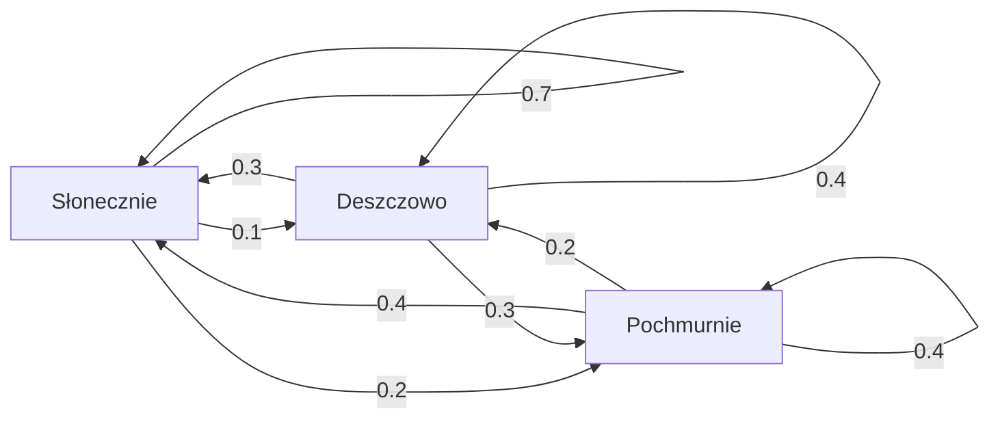
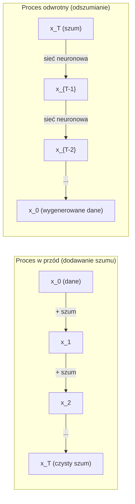

# Procesy stochastyczne

> Losowość ze strukturą. Matematyka stojąca za błądzeniami losowymi, łańcuchami Markowa i modelami dyfuzyjnymi.

**Type:** Learn
**Language:** Python
**Prerequisites:** Phase 1, Lessons 06-07 (probability, Bayes)
**Time:** ~75 minut

## Learning Objectives

- Zasymuluj błądzenia losowe 1D i 2D i zweryfikuj skalowanie sqrt(n) przemieszczenia
- Zbuduj symulator łańcucha Markowa i oblicz jego rozkład stacjonarny przez rozkład na wartości własne
- Zaimplementuj MCMC Metropolisa-Hastingsa i dynamikę Langevina do próbkowania z docelowych rozkładów
- Połącz proces dyfuzji w przód z ruchem Browna i wyjaśnij, jak proces odwrotny generuje dane

## Problem

Wiele systemów AI obejmuje losowość, która ewoluuje w czasie. Nie statyczną losowość -- ustrukturyzowaną, sekwencyjną losowość, gdzie każdy krok zależy od tego, co było wcześniej.

Modele językowe generują tokeny jeden po drugim. Każdy token zależy od poprzedniego kontekstu. Model wyjściowo daje rozkład prawdopodobieństwa, próbkuje z niego i idzie dalej. To jest proces stochastyczny.

Modele dyfuzyjne dodają szum do obrazu krok po kroku, aż stanie się czystym szumem. Następnie odwracają proces, odszumiając krok po kroku, aż wyłoni się nowy obraz. Proces w przód to łańcuch Markowa. Proces odwrotny to uczony łańcuch Markowa działający wstecz.

Agenci uczący się przez wzmacnianie podejmują akcje w środowisku. Każda akcja prowadzi do nowego stanu z pewnym prawdopodobieństwem. Agent podąża za losową polityką w losowym świecie. Całość to proces decyzyjny Markowa.

Próbkowanie MCMC -- podstawa wnioskowania bayesowskiego -- konstruuje łańcuch Markowa, którego rozkład stacjonarny jest rozkładem a posteriori, z którego chcesz próbkować.

Wszystkie te opierają się na czterech fundamentalnych ideach:
1. Błądzenia losowe -- najprostszy proces stochastyczny
2. Łańcuchy Markowa -- ustrukturyzowana losowość z macierzą przejścia
3. Dynamika Langevina -- spadek gradientowy z szumem
4. Metropolis-Hastings -- próbkowanie z dowolnego rozkładu

## Koncepcja

### Błądzenia losowe

Zacznij na pozycji 0. Na każdym kroku rzuć uczciwą monetą. Orzeł: przesuń się w prawo (+1). Reszka: przesuń się w lewo (-1).

Po n krokach twoja pozycja to suma n losowych wartości +/-1. Oczekiwana pozycja to 0 (błądzenie jest nieobciążone). Ale oczekiwana odległość od początku rośnie jak sqrt(n).

To jest kontrintuicyjne. Błądzenie jest uczciwe -- żadnego dryfu w żadnym kierunku. Ale z czasem oddala się coraz bardziej od miejsca startu. Odchylenie standardowe po n krokach to sqrt(n).

```
Krok 0:  Pozycja = 0
Krok 1:  Pozycja = +1 lub -1
Krok 2:  Pozycja = +2, 0 lub -2
...
Krok 100: Oczekiwana odległość od początku ~ 10 (sqrt(100))
Krok 10000: Oczekiwana odległość od początku ~ 100 (sqrt(10000))
```

**W 2D:** błądzenie porusza się w górę, w dół, w lewo lub w prawo z równym prawdopodobieństwem. To samo skalowanie sqrt(n) stosuje się do odległości od początku. Ścieżka kreśli fraktalopodobny wzór.

**Dlaczego sqrt(n)?** Każdy krok to +1 lub -1 z równym prawdopodobieństwem. Po n krokach pozycja S_n = X_1 + X_2 + ... + X_n, gdzie każde X_i to +/-1. Wariancja każdego kroku wynosi 1, a kroki są niezależne, więc Var(S_n) = n. Odchylenie standardowe = sqrt(n). Z centralnego twierdzenia granicznego S_n / sqrt(n) zbiega do standardowego rozkładu normalnego.

To skalowanie sqrt(n) pojawia się wszędzie w ML. Szum SGD skaluje się jak 1/sqrt(rozmiar_wsadu). Wymiary embeddingów skalują się jak sqrt(d). Pierwiastek kwadratowy jest sygnaturą niezależnych losowych dodań.

**Związek z ruchem Browna.** Weź błądzenie losowe z krokiem 1/sqrt(n) i n krokami na jednostkę czasu. Gdy n dąży do nieskończoności, błądzenie zbiega do ruchu Browna B(t) -- procesu ciągłego, gdzie B(t) jest normalnie rozłożone ze średnią 0 i wariancją t.

Ruch Browna jest matematycznym fundamentem dyfuzji. Modeluje losowe drgania cząstek w płynie, fluktuacje cen akcji i -- kluczowo -- proces szumu w modelach dyfuzyjnych.

**Ruina gracza.** Błądzenie losowe zaczynające w pozycji k, z absorbującymi barierami w 0 i N. Jakie jest prawdopodobieństwo osiągnięcia N przed 0? Dla uczciwego błądzenia: P(osiągnij N) = k/N. To zaskakująco proste i eleganckie. Łączy się z teorią martyngałów -- uczciwe błądzenie losowe jest martyngałem (oczekiwana przyszła wartość = bieżąca wartość).

### Łańcuchy Markowa

Łańcuch Markowa to system, który przechodzi między stanami zgodnie z ustalonymi prawdopodobieństwami. Kluczowa własność: następny stan zależy tylko od bieżącego stanu, nie od historii.

```
P(X_{t+1} = j | X_t = i, X_{t-1} = ...) = P(X_{t+1} = j | X_t = i)
```

To jest własność Markowa. Oznacza, że możesz opisać całą dynamikę macierzą przejścia P:

```
P[i][j] = prawdopodobieństwo przejścia ze stanu i do stanu j
```

Każdy wiersz P sumuje się do 1 (musisz gdzieś pójść).

**Przykład -- Pogoda:**

```
Stany: Słonecznie (0), Deszczowo (1), Pochmurnie (2)

P = [[0.7, 0.1, 0.2],    (jeśli słonecznie: 70% słonecznie, 10% deszczowo, 20% pochmurnie)
     [0.3, 0.4, 0.3],    (jeśli deszczowo: 30% słonecznie, 40% deszczowo, 30% pochmurnie)
     [0.4, 0.2, 0.4]]    (jeśli pochmurnie: 40% słonecznie, 20% deszczowo, 40% pochmurnie)
```

Zacznij od dowolnego stanu. Po wielu przejściach rozkład stanów zbiega do rozkładu stacjonarnego pi, gdzie pi * P = pi. To jest lewy wektor własny P z wartością własną 1.

Dla łańcucha pogodowego rozkład stacjonarny może wynosić [0.53, 0.18, 0.29] -- w długim okresie jest słonecznie 53% czasu, niezależnie od stanu początkowego.



**Obliczanie rozkładu stacjonarnego.** Są dwa podejścia:

1. **Metoda potęgowa:** mnóż dowolny początkowy rozkład przez P wielokrotnie. Po wystarczającej liczbie iteracji zbiega.
2. **Metoda wartości własnych:** znajdź lewy wektor własny P z wartością własną 1. To jest wektor własny P^T z wartością własną 1.

Oba podejścia wymagają, by łańcuch spełniał warunki zbieżności.

**Warunki zbieżności.** Łańcuch Markowa zbiega do unikalnego rozkładu stacjonarnego, jeśli jest:
- **Nieredukowalny:** każdy stan jest osiągalny z każdego innego stanu
- **Nieokresowy:** łańcuch nie cykluje z ustalonym okresem

Większość łańcuchów, które napotkasz w ML, spełnia oba warunki.

**Stany absorbujące.** Stan jest absorbujący, jeśli gdy do niego wejdziesz, nigdy go nie opuszczasz (P[i][i] = 1). Absorbujące łańcuchy Markowa modelują procesy ze stanami końcowymi -- gra, która się kończy, klient, który odchodzi, sekwencja tokenów, która trafia na token końca tekstu.

**Czas mieszania.** Ile kroków, zanim łańcuch będzie "blisko" rozkładu stacjonarnego? Formalnie liczba kroków, aż całkowity wariacyjny dystans od stacjonarności spadnie poniżej pewnego progu. Szybkie mieszanie = mało potrzebnych kroków. Przerwa spektralna P (1 minus druga co do wielkości wartość własna) kontroluje czas mieszania. Większa przerwa = szybsze mieszanie.

### Związek z modelami językowymi

Generowanie tokenów w modelu językowym jest w przybliżeniu procesem Markowa. Dany bieżący kontekst model wyjściowo daje rozkład nad następnym tokenem. Temperatura kontroluje ostrość:

```
P(token_i) = exp(logit_i / temperatura) / sum(exp(logit_j / temperatura))
```

- Temperatura = 1.0: standardowy rozkład
- Temperatura < 1.0: ostrzejszy (bardziej deterministyczny)
- Temperatura > 1.0: bardziej płaski (bardziej losowy)
- Temperatura -> 0: argmax (zachłanny)

Próbkowanie top-k obcina do k tokenów o najwyższym prawdopodobieństwie. Top-p (jądrowe) obcina do najmniejszego zbioru tokenów, którego skumulowane prawdopodobieństwo przekracza p. Oba modyfikują prawdopodobieństwa przejścia Markowa.

### Ruch Browna

Granica ciągła błądzenia losowego. Pozycja B(t) ma trzy własności:
1. B(0) = 0
2. B(t) - B(s) jest normalnie rozłożona ze średnią 0 i wariancją t - s (dla t > s)
3. Przyrosty na niezachodzących na siebie interwałach są niezależne

Ruch Browna jest ciągły, ale nigdzie różniczkowalny -- drga na każdej skali. Ścieżka ma wymiar fraktalny 2 na płaszczyźnie.

W symulacji dyskretnej przybliżasz ruch Browna przez:

```
B(t + dt) = B(t) + sqrt(dt) * z,    gdzie z ~ N(0, 1)
```

Skalowanie sqrt(dt) jest ważne. Pochodzi z centralnego twierdzenia granicznego zastosowanego do błądzeń losowych.

### Dynamika Langevina

Spadek gradientowy znajduje minimum funkcji. Dynamika Langevina znajduje rozkład prawdopodobieństwa proporcjonalny do exp(-U(x)/T), gdzie U to funkcja energii, a T to temperatura.

```
x_{t+1} = x_t - dt * gradient(U(x_t)) + sqrt(2 * T * dt) * z_t
```

Dwie siły działają na cząstkę:
1. **Siła gradientu** (-dt * gradient(U)): popycha w kierunku niskiej energii (jak spadek gradientowy)
2. **Siła losowa** (sqrt(2*T*dt) * z): popycha w losowych kierunkach (eksploracja)

W temperaturze T = 0 jest to czysty spadek gradientowy. W wysokiej temperaturze jest to prawie błądzenie losowe. W odpowiedniej temperaturze cząstka eksploruje krajobraz energii i spędza więcej czasu w regionach niskoenergetycznych.

**Związek z modelami dyfuzyjnymi.** Proces w przód modelu dyfuzyjnego to:

```
x_t = sqrt(alpha_t) * x_{t-1} + sqrt(1 - alpha_t) * szum
```

To jest łańcuch Markowa, który stopniowo miesza dane z szumem. Po wystarczającej liczbie kroków x_T to czysty szum Gaussa.

Proces odwrotny -- przejście od szumu z powrotem do danych -- to również łańcuch Markowa, ale jego prawdopodobieństwa przejścia są uczone przez sieć neuronową. Sieć uczy się przewidywać szum, który został dodany na każdym kroku, a następnie go odejmuje.



### MCMC: Łańcuch Markowa Monte Carlo

Czasami potrzebujesz próbkować z rozkładu p(x), który możesz obliczyć (z dokładnością do stałej), ale nie możesz z niego bezpośrednio próbkować. Rozkłady a posteriori Bayesa są klasycznym przykładem -- znasz wiarygodność razy a priori, ale stała normalizująca jest nieobliczalna.

**Metropolis-Hastings** konstruuje łańcuch Markowa, którego rozkład stacjonarny to p(x):

1. Zacznij w pewnej pozycji x
2. Zaproponuj nową pozycję x' z rozkładu propozycji Q(x'|x)
3. Oblicz współczynnik akceptacji: a = p(x') * Q(x|x') / (p(x) * Q(x'|x))
4. Zaakceptuj x' z prawdopodobieństwem min(1, a). W przeciwnym razie zostań w x.
5. Powtórz.

Jeśli Q jest symetryczna (np. Q(x'|x) = Q(x|x') = N(x, sigma^2)), stosunek upraszcza się do a = p(x') / p(x). Potrzebujesz tylko stosunku prawdopodobieństw -- stała normalizująca się skraca.

Łańcuch jest gwarantowany zbieżny do p(x) przy łagodnych warunkach. Ale zbieżność może być powolna, jeśli propozycja jest zbyt mała (błądzenie losowe) lub zbyt duża (wysokie odrzucenie). Strojenie propozycji jest sztuką MCMC.

**Dlaczego działa.** Współczynnik akceptacji zapewnia równowagę szczegółową: prawdopodobieństwo bycia w x i przejścia do x' równa się prawdopodobieństwu bycia w x' i przejścia do x. Równowaga szczegółowa implikuje, że p(x) jest rozkładem stacjonarnym łańcucha. Więc po wystarczającej liczbie kroków próbki pochodzą z p(x).

**Praktyczne uwagi:**
- **Burn-in**: odrzuć pierwsze N próbek. Łańcuch potrzebuje czasu, by osiągnąć rozkład stacjonarny z punktu startowego.
- **Rozrzedzanie**: zachowuj co k-tą próbkę, by zmniejszyć autokorelację.
- **Wiele łańcuchów**: uruchom kilka łańcuchów z różnych punktów startowych. Jeśli zbiegają do tego samego rozkładu, masz dowód zbieżności.
- **Wskaźnik akceptacji**: dla propozycji Gaussa w d wymiarach optymalny wskaźnik akceptacji wynosi około 23% (Roberts & Rosenthal, 2001). Zbyt wysoki oznacza, że łańcuch ledwo się porusza. Zbyt niski oznacza, że odrzuca wszystko.

### Procesy stochastyczne w AI

| Proces | Zastosowanie AI |
|---------|---------------|
| Błądzenie losowe | Eksploracja w RL, embeddingi Node2Vec |
| Łańcuch Markowa | Generowanie tekstu, próbkowanie MCMC |
| Ruch Browna | Modele dyfuzyjne (proces w przód) |
| Dynamika Langevina | Modele generatywne oparte na score, SGLD |
| Proces decyzyjny Markowa | Uczenie przez wzmacnianie |
| Metropolis-Hastings | Wnioskowanie bayesowskie, próbkowanie a posteriori |

```figure
random-walk-diffusion
```

## Build It

### Krok 1: Symulator błądzenia losowego

```python
import numpy as np

def random_walk_1d(n_steps, seed=None):
    rng = np.random.RandomState(seed)
    steps = rng.choice([-1, 1], size=n_steps)
    positions = np.concatenate([[0], np.cumsum(steps)])
    return positions


def random_walk_2d(n_steps, seed=None):
    rng = np.random.RandomState(seed)
    directions = rng.choice(4, size=n_steps)
    dx = np.zeros(n_steps)
    dy = np.zeros(n_steps)
    dx[directions == 0] = 1   # prawo
    dx[directions == 1] = -1  # lewo
    dy[directions == 2] = 1   # góra
    dy[directions == 3] = -1  # dół
    x = np.concatenate([[0], np.cumsum(dx)])
    y = np.concatenate([[0], np.cumsum(dy)])
    return x, y
```

Błądzenie 1D przechowuje sumy skumulowane. Każdy krok to +1 lub -1. Po n krokach pozycja to suma. Wariancja rośnie liniowo z n, więc odchylenie standardowe rośnie jak sqrt(n).

### Krok 2: Łańcuch Markowa

```python
class MarkovChain:
    def __init__(self, transition_matrix, state_names=None):
        self.P = np.array(transition_matrix, dtype=float)
        self.n_states = len(self.P)
        self.state_names = state_names or [str(i) for i in range(self.n_states)]

    def step(self, current_state, rng=None):
        if rng is None:
            rng = np.random.RandomState()
        probs = self.P[current_state]
        return rng.choice(self.n_states, p=probs)

    def simulate(self, start_state, n_steps, seed=None):
        rng = np.random.RandomState(seed)
        states = [start_state]
        current = start_state
        for _ in range(n_steps):
            current = self.step(current, rng)
            states.append(current)
        return states

    def stationary_distribution(self):
        eigenvalues, eigenvectors = np.linalg.eig(self.P.T)
        idx = np.argmin(np.abs(eigenvalues - 1.0))
        stationary = np.real(eigenvectors[:, idx])
        stationary = stationary / stationary.sum()
        return np.abs(stationary)
```

Rozkład stacjonarny to lewy wektor własny P z wartością własną 1. Znajdujemy go przez obliczenie wektorów własnych P^T (transpozycja zamienia lewe wektory własne w prawe).

### Krok 3: Dynamika Langevina

```python
def langevin_dynamics(grad_U, x0, dt, temperature, n_steps, seed=None):
    rng = np.random.RandomState(seed)
    x = np.array(x0, dtype=float)
    trajectory = [x.copy()]
    for _ in range(n_steps):
        noise = rng.randn(*x.shape)
        x = x - dt * grad_U(x) + np.sqrt(2 * temperature * dt) * noise
        trajectory.append(x.copy())
    return np.array(trajectory)
```

Gradient popycha x w kierunku niskiej energii. Szum zapobiega utknięciu. W równowadze rozkład próbek jest proporcjonalny do exp(-U(x)/temperatura).

### Krok 4: Metropolis-Hastings

```python
def metropolis_hastings(target_log_prob, proposal_std, x0, n_samples, seed=None):
    rng = np.random.RandomState(seed)
    x = np.array(x0, dtype=float)
    samples = [x.copy()]
    accepted = 0
    for _ in range(n_samples - 1):
        x_proposed = x + rng.randn(*x.shape) * proposal_std
        log_ratio = target_log_prob(x_proposed) - target_log_prob(x)
        if np.log(rng.rand()) < log_ratio:
            x = x_proposed
            accepted += 1
        samples.append(x.copy())
    acceptance_rate = accepted / (n_samples - 1)
    return np.array(samples), acceptance_rate
```

Algorytm proponuje nowy punkt, sprawdza, czy ma wyższe prawdopodobieństwo (lub akceptuje z prawdopodobieństwem proporcjonalnym do stosunku), i powtarza. Wskaźnik akceptacji powinien wynosić około 23-50% dla dobrego mieszania.

## Use It

W praktyce używasz ustalonych bibliotek dla tych algorytmów. Ale zrozumienie mechaniki ma znaczenie dla debugowania i strojenia.

```python
import numpy as np

rng = np.random.RandomState(42)
walk = np.cumsum(rng.choice([-1, 1], size=10000))
print(f"Końcowa pozycja: {walk[-1]}")
print(f"Oczekiwana odległość: {np.sqrt(10000):.1f}")
print(f"Rzeczywista odległość: {abs(walk[-1])}")
```

### numpy dla macierzy przejścia

```python
import numpy as np

P = np.array([[0.7, 0.1, 0.2],
              [0.3, 0.4, 0.3],
              [0.4, 0.2, 0.4]])

distribution = np.array([1.0, 0.0, 0.0])
for _ in range(100):
    distribution = distribution @ P

print(f"Rozkład stacjonarny: {np.round(distribution, 4)}")
```

Mnoż początkowy rozkład przez P wielokrotnie. Po wystarczającej liczbie iteracji zbiega do rozkładu stacjonarnego niezależnie od tego, gdzie zacząłeś. To jest metoda potęgowa do znajdowania dominującego lewego wektora własnego.

### Związki z prawdziwymi frameworkami

- **Dyfuzja PyTorch:** `DDPMScheduler` w Hugging Face `diffusers` implementuje łańcuchy Markowa w przód i wstecz
- **NumPyro / PyMC:** Używa MCMC (próbnik NUTS, który ulepsza Metropolisa-Hastingsa) do wnioskowania bayesowskiego
- **Gymnasium (RL):** Funkcja kroku środowiska definiuje proces decyzyjny Markowa

### Weryfikacja zbieżności łańcucha Markowa

```python
import numpy as np

P = np.array([[0.9, 0.1], [0.3, 0.7]])

eigenvalues = np.linalg.eigvals(P)
spectral_gap = 1 - sorted(np.abs(eigenvalues))[-2]
print(f"Wartości własne: {eigenvalues}")
print(f"Przerwa spektralna: {spectral_gap:.4f}")
print(f"Przybliżony czas mieszania: {1/spectral_gap:.1f} kroków")
```

Przerwa spektralna mówi, jak szybko łańcuch zapomina swój stan początkowy. Przerwa 0.2 oznacza z grubsza 5 kroków do wymieszania. Przerwa 0.01 oznacza z grubsza 100 kroków. Zawsze sprawdzaj to przed uruchomieniem długich symulacji -- wolno mieszający się łańcuch marnuje obliczenia.

## Ship It

Ta lekcja produkuje:
- `outputs/prompt-stochastic-process-advisor.md` -- prompt pomagający zidentyfikować, które ramy procesów stochastycznych stosują się do danego problemu

## Połączenia

| Koncepcja | Gdzie się pojawia |
|---------|------------------|
| Błądzenie losowe | Embeddingi grafów Node2Vec, eksploracja w RL |
| Łańcuch Markowa | Generowanie tokenów w LLM, próbkowanie MCMC |
| Ruch Browna | Proces dyfuzji w przód w DDPM, modele oparte na SDE |
| Dynamika Langevina | Modele generatywne oparte na score, stochastyczna dynamika Langevina (SGLD) |
| Rozkład stacjonarny | Cel zbieżności MCMC, PageRank |
| Metropolis-Hastings | Próbkowanie a posteriori Bayesa, symulowane wyżarzanie |
| Temperatura | Próbkowanie LLM, eksploracja Boltzmanna w RL, symulowane wyżarzanie |
| Czas mieszania | Szybkość zbieżności MCMC, analiza przerwy spektralnej |
| Stan absorbujący | Token końca sekwencji, stany końcowe w RL |
| Równowaga szczegółowa | Gwarancja poprawności dla próbników MCMC |

Modele dyfuzyjne zasługują na szczególną uwagę. DDPM (Ho et al., 2020) definiuje łańcuch Markowa w przód:

```
q(x_t | x_{t-1}) = N(x_t; sqrt(1-beta_t) * x_{t-1}, beta_t * I)
```

gdzie beta_t to harmonogram szumu. Po T krokach x_T jest w przybliżeniu N(0, I). Proces odwrotny jest parametryzowany przez sieć neuronową, która przewiduje szum:

```
p_theta(x_{t-1} | x_t) = N(x_{t-1}; mu_theta(x_t, t), sigma_t^2 * I)
```

Każdy krok generacji jest krokiem w uczonym łańcuchu Markowa. Zrozumienie łańcuchów Markowa oznacza zrozumienie, jak i dlaczego modele dyfuzyjne generują dane.

SGLD (Stochastic Gradient Langevin Dynamics) łączy mini-wsadowy spadek gradientowy z szumem Langevina. Zamiast obliczać pełny gradient, używasz stochastycznej estymacji i dodajesz skalibrowany szum. Gdy współczynnik uczenia maleje, SGLD przechodzi od optymalizacji do próbkowania -- dostajesz przybliżone próbki a posteriori Bayesa za darmo. To jeden z najprostszych sposobów uzyskania estymacji niepewności z sieci neuronowej.

Kluczowa intuicja we wszystkich tych połączeniach: procesy stochastyczne to nie tylko narzędzia teoretyczne. To mechanizmy obliczeniowe wewnątrz nowoczesnych systemów AI. Gdy stroisz temperaturę LLM, dostosowujesz łańcuch Markowa. Gdy trenujesz model dyfuzyjny, uczysz się odwracać proces podobny do ruchu Browna. Gdy uruchamiasz wnioskowanie bayesowskie, konstruujesz łańcuch zbieżny do a posteriori.

## Ćwiczenia

1. **Zasymuluj 1000 błądzeń losowych po 10000 kroków.** Wykreśl rozkład końcowych pozycji. Zweryfikuj, że jest w przybliżeniu Gaussowski ze średnią 0 i odchyleniem standardowym sqrt(10000) = 100.

2. **Zbuduj generator tekstu używając łańcucha Markowa.** Trenuj na małym korpusie: dla każdego słowa, policz przejścia do następnego słowa. Zbuduj macierz przejścia. Generuj nowe zdania przez próbkowanie z łańcucha.

3. **Zaimplementuj symulowane wyżarzanie** używając Metropolisa-Hastingsa. Zacznij w wysokiej temperaturze (akceptuj prawie wszystko) i stopniowo schładzaj (akceptuj tylko poprawy). Użyj go do znalezienia minimum funkcji z wieloma minimami lokalnymi.

4. **Porównaj dynamikę Langevina w różnych temperaturach.** Próbkuj z potencjału dwójki `U(x) = (x^2 - 1)^2`. W niskiej temperaturze próbki skupiają się w jednej studni. W wysokiej rozprzestrzeniają się na obie. Znajdź krytyczną temperaturę, gdzie łańcuch miesza się między studniami.

5. **Zaimplementuj proces dyfuzji w przód.** Zacznij z sygnałem 1D (np. fala sinusoidalna). Dodawaj szum progresywnie przez 100 kroków z liniowym harmonogramem szumu. Pokaż, jak sygnał degraduje się do czystego szumu. Następnie zaimplementuj prosty odszumiacz, który odwraca proces (nawet naiwny, który tylko odejmuje oszacowany szum).

## Key Terms

| Termin | Co ludzie mówią | Co naprawdę znaczy |
|------|----------------|----------------------|
| Błądzenie losowe | "Ruch monetą" | Proces, w którym pozycja zmienia się o losowe przyrosty na każdym kroku |
| Własność Markowa | "Bez pamięci" | Przyszłość zależy tylko od obecnego stanu, nie od historii |
| Macierz przejścia | "Tabela prawdopodobieństw" | P[i][j] = prawdopodobieństwo przejścia ze stanu i do stanu j |
| Rozkład stacjonarny | "Średnia długookresowa" | Rozkład pi, gdzie pi*P = pi -- równowaga łańcucha |
| Ruch Browna | "Losowe drganie" | Granica ciągła błądzenia losowego, B(t) ~ N(0, t) |
| Dynamika Langevina | "Spadek gradientowy z szumem" | Reguła aktualizacji łącząca deterministyczny gradient z losowym zaburzeniem |
| MCMC | "Wędrowanie do celu" | Konstruowanie łańcucha Markowa, którego rozkładem stacjonarnym jest ten, który chcesz |
| Metropolis-Hastings | "Proponuj i akceptuj/odrzucaj" | Algorytm MCMC używający współczynników akceptacji do zapewnienia zbieżności |
| Temperatura | "Pokrętło losowości" | Parametr kontrolujący kompromis między eksploracją a eksploatacją |
| Proces dyfuzji | "Szum wchodzi, szum wychodzi" | W przód: stopniowo dodawaj szum. Odwrotny: stopniowo go usuwaj. Generuje dane. |