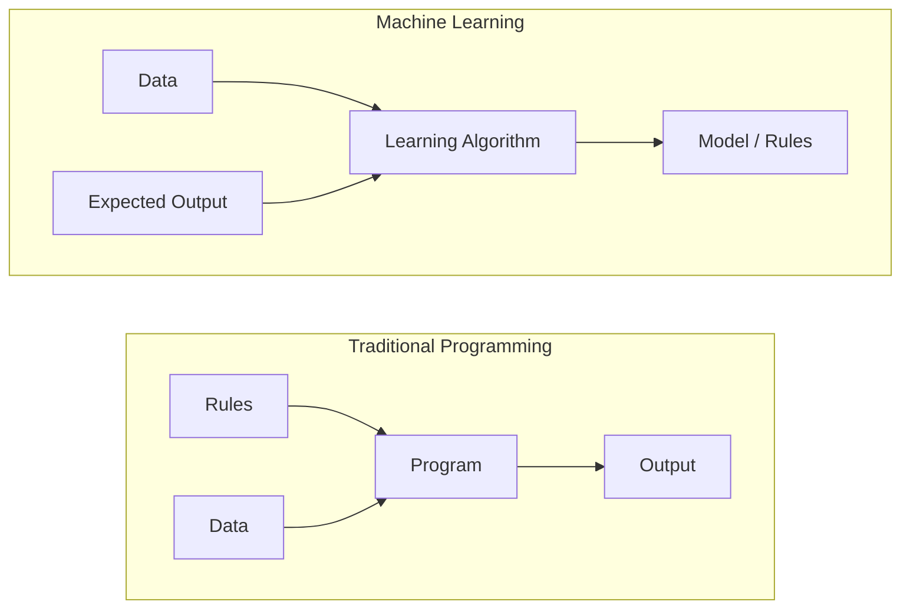
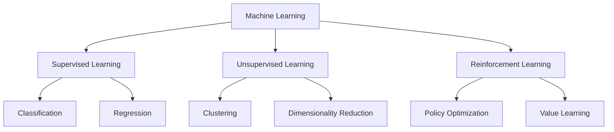
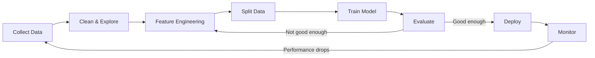
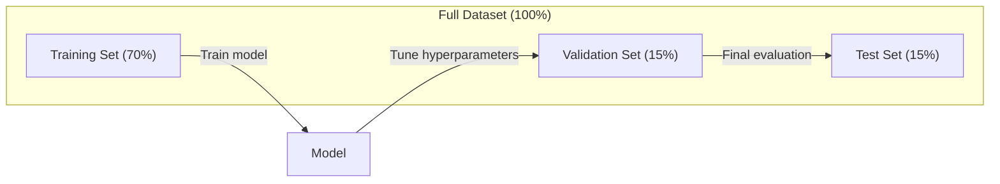
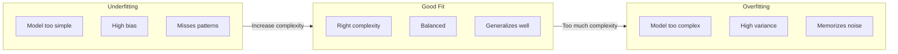
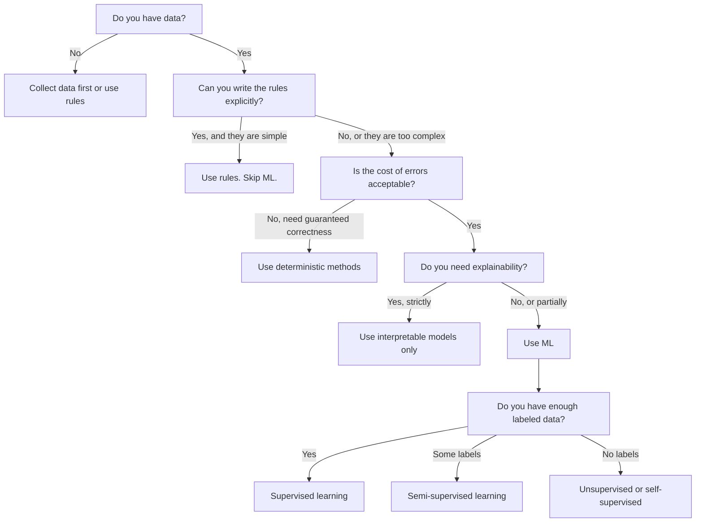

# Czym Jest Uczenie Maszynowe

> Uczenie maszynowe polega na nauczeniu komputerów znajdowania wzorców w danych zamiast ręcznego pisania reguł.

**Type:** Learn
**Languages:** Python
**Prerequisites:** Phase 1 (Math Foundations)
**Time:** ~45 minutes

## Learning Objectives

- Wyjaśnić różnicę między uczeniem nadzorowanym, nienadzorowanym i przez wzmocnienie oraz określić, który typ ma zastosowanie do danego problemu
- Zaimplementować klasyfikator najbliższej średniej (nearest centroid) od podstaw i ocenić go względem losowego baseline'u
- Rozróżniać zadania klasyfikacji i regresji oraz dobrać odpowiednią funkcję straty dla każdego z nich
- Ocenić, czy dany problem biznesowy nadaje się do ML, czy lepiej rozwiązać go za pomocą reguł deterministycznych

## Problem

Chcesz zbudować filtr spamu. Tradycyjne podejście: usiąść i napisać setki reguł. „Jeśli e-mail zawiera 'DARMOWE PIENIĄDZE', oznacz go jako spam. Jeśli ma więcej niż 3 wykrzykniki, oznacz go jako spam." Spędzasz tygodnie na pisaniu reguł. Potem spammerzy zmieniają sformułowania. Twoje reguły przestają działać. Piszesz kolejne reguły. Cykl nigdy się nie kończy.

Uczenie maszynowe odwraca to. Zamiast pisać reguły, dajesz komputerowi tysiące oznaczonych e-maili („spam" lub „nie spam") i pozwalasz mu samodzielnie odkryć reguły. Komputer znajduje wzorce, o których nigdy byś nie pomyślał. Gdy spammerzy zmieniają taktykę, trenujesz model od nowa na nowych danych, zamiast przepisywać kod.

To przejście od „programowania reguł" do „uczenia się z danych" jest istotą uczenia maszynowego. Każdy system rekomendacji, asystent głosowy, samochód autonomiczny i model językowy działa w ten sposób.

## Koncepcja

### Uczenie się z Danych, Nie z Reguł

Tradycyjne programowanie i uczenie maszynowe rozwiązują problemy w przeciwnych kierunkach.



Tradycyjne programowanie: piszesz reguły. Program stosuje je do danych, aby wygenerować wyniki.

Uczenie maszynowe: dostarczasz dane i oczekiwane wyniki. Algorytm odkrywa reguły.

„Model", który powstaje w wyniku trenowania, TO są reguły, zakodowane jako liczby (wagi, parametry). Uogólnia on na podstawie przykładów, które widział, aby przewidywać na danych, których nigdy nie widział.

### Trzy Rodzaje Uczenia Maszynowego



**Uczenie nadzorowane (Supervised Learning)**: Masz pary wejście-wyjście. Model uczy się mapować wejścia na wyjścia.
- „Oto 10 000 zdjęć oznaczonych jako kot lub pies. Naucz się je odróżniać."
- „Oto cechy domów i ich ceny. Naucz się przewidywać cenę."

**Uczenie nienadzorowane (Unsupervised Learning)**: Masz tylko dane wejściowe. Bez etykiet. Model samodzielnie znajduje strukturę.
- „Oto 10 000 historii zakupów klientów. Znajdź naturalne grupowania."
- „Oto 1000-wymiarowe punkty danych. Zredukuj do 2 wymiarów, zachowując strukturę."

**Uczenie przez wzmocnienie (Reinforcement Learning)**: Agent podejmuje działania w środowisku i otrzymuje nagrody lub kary. Uczy się strategii (polityki) maksymalizującej całkowitą nagrodę.
- „Zagraj w tę grę. +1 za wygraną, -1 za przegraną. Wymyśl strategię."
- „Steruj tym ramieniem robota. +1 za podniesienie przedmiotu, -0,01 za każdą straconą sekundę."

W praktyce większość tego, co zbudujesz, będzie wykorzystywać uczenie nadzorowane. Uczenie nienadzorowane jest powszechne w przetwarzaniu wstępnym i eksploracji. Uczenie przez wzmocnienie napędza AI w grach, robotykę i RLHF dla modeli językowych.

### Poza Wielką Trójką

Trzy kategorie powyżej są czyste, ale rzeczywiste ML często zaciera granice.

**Uczenie półnadzorowane (Semi-supervised learning)** wykorzystuje mały zestaw oznaczonych danych i duży zestaw nieoznaczonych danych. Możesz mieć 100 oznaczonych obrazów medycznych i 100 000 nieoznaczonych. Techniki obejmują:

- **Propagacja etykiet:** Zbuduj graf łączący podobne punkty danych. Etykiety rozprzestrzeniają się z oznaczonych węzłów do nieoznaczonych sąsiadów przez graf.
- **Pseudolabelowanie:** Trenuj model na oznaczonych danych, użyj go do przewidzenia etykiet dla nieoznaczonych danych, a następnie trenuj ponownie na wszystkim. Model tworzy własny zestaw treningowy.
- **Regularizacja spójności:** Model powinien dawać tę samą predykcję dla wejścia i jego lekko zaburzonej wersji. Działa to nawet bez etykiet.

**Uczenie samonadzorowane (Self-supervised learning)** tworzy nadzór z samych danych. Nie są potrzebne żadne ludzkie etykiety. Model tworzy własne zadanie predykcyjne na podstawie struktury danych.

- **Maskowane modelowanie języka (BERT):** Ukryj 15% słów w zdaniu, trenuj model, aby przewidywał brakujące słowa. „Etykiety" pochodzą z oryginalnego tekstu.
- **Uczenie kontrastywne (SimCLR):** Weź obraz, utwórz dwie wzbogacone wersje. Trenuj model, aby rozpoznawał, że pochodzą z tego samego obrazu, odróżniając je od wzbogaconych wersji innych obrazów.
- **Predykcja następnego tokena (GPT):** Przewidź następne słowo na podstawie wszystkich poprzednich słów. Każdy dokument tekstowy staje się przykładem treningowym.

To nie są oddzielne kategorie od wielkiej trójki. Są to strategie łączące idee uczenia nadzorowanego i nienadzorowanego. Uczenie samonadzorowane jest technicznie nadzorowane (model coś przewiduje), ale etykiety są generowane automatycznie, nie przez ludzi.

### Klasyfikacja a Regresja

To są dwa główne zadania w uczeniu nadzorowanym.

| Aspekt | Klasyfikacja | Regresja |
|--------|--------------|----------|
| Wynik | Dyskretne kategorie | Ciągłe liczby |
| Przykład | „Czy ten e-mail to spam?" | „Jaka będzie cena domu?" |
| Przestrzeń wyników | {kot, pies, ptak} | Dowolna liczba rzeczywista |
| Funkcja straty | Entropia krzyżowa, dokładność | Średni błąd kwadratowy, MAE |
| Decyzja | Granice między klasami | Krzywa dopasowana do danych |

Klasyfikacja odpowiada na pytanie „która kategoria?" Regresja odpowiada na pytanie „ile?"

Niektóre problemy można sformułować na oba sposoby. Przewidywanie, czy akcje wzrosną, czy spadną, to klasyfikacja. Przewidywanie dokładnej ceny to regresja.

### Przebieg Pracy w ML

Każdy projekt uczenia maszynowego przebiega według tego samego potoku, niezależnie od algorytmu.



**Zbieranie danych**: Zgromadź surowe dane. Więcej danych jest prawie zawsze lepiej, ale jakość ma większe znaczenie niż ilość.

**Czyszczenie i eksploracja**: Obsłuż brakujące wartości, usuń duplikaty, wizualizuj rozkłady, wykryj anomalie. Ten krok często zajmuje 60-80% całkowitego czasu projektu.

**Inżynieria cech**: Przekształć surowe dane w cechy, których model może użyć. Zamień daty na dzień tygodnia. Normalizuj kolumny numeryczne. Zakoduj zmienne kategoryczne. Dobre cechy są ważniejsze niż wymyślne algorytmy.

**Podział danych**: Podziel na zbiory treningowy, walidacyjny i testowy. Model trenuje na zbiorze treningowym, dostrajasz hiperparametry na zbiorze walidacyjnym, a końcową wydajność raportujesz na zbiorze testowym.

**Trenowanie modelu**: Podaj dane treningowe do algorytmu. Algorytm dostosowuje wewnętrzne parametry, aby zminimalizować funkcję straty.

**Ewaluacja**: Zmierz wydajność na danych walidacyjnych/testowych. Jeśli wydajność jest nieakceptowalna, wróć i wypróbuj różne cechy, algorytmy lub hiperparametry.

**Wdrożenie**: Umieść model w produkcji, gdzie będzie dokonywał predykcji na nowych danych.

**Monitorowanie**: Śledź wydajność w czasie. Rozkłady danych zmieniają się (dryf danych), a modele ulegają degradacji. Gdy wydajność spada, trenuj od nowa.

### Podział na Zbiór Treningowy, Walidacyjny i Testowy

To najważniejsza koncepcja, którą początkujący źle rozumieją. Musisz oceniać model na danych, których nigdy nie widział podczas trenowania. W przeciwnym razie mierzysz zapamiętywanie, a nie uczenie się.



| Podział | Cel | Kiedy używany | Typowy rozmiar |
|---------|-----|---------------|----------------|
| Treningowy | Model uczy się z tych danych | Podczas trenowania | 60-80% |
| Walidacyjny | Dostrajanie hiperparametrów, porównywanie modeli | Po każdym uruchomieniu treningu | 10-20% |
| Testowy | Ostateczna, nieobciążona ocena wydajności | Raz, na samym końcu | 10-20% |

Zbiór testowy jest święty. Patrzysz na niego dokładnie raz. Jeśli ciągle dostosowujesz model na podstawie wydajności testowej, w efekcie trenujesz na zbiorze testowym, a Twoje raportowane liczby są bezwartościowe.

W przypadku małych zestawów danych użyj k-krotnej walidacji krzyżowej: podziel dane na k części, trenuj na k-1 częściach, waliduj na pozostałej części, rotuj i uśrednij wyniki.

### Przeuczenie a Niedouczenie



**Niedouczenie (Underfitting)**: Model jest zbyt prosty, aby uchwycić wzorce w danych. Linia prosta próbująca dopasować krzywoliniową zależność. Błąd treningowy jest wysoki. Błąd testowy jest wysoki.

**Przeuczenie (Overfitting)**: Model jest zbyt złożony i zapamiętuje dane treningowe, włącznie z ich szumem. Falista krzywa przechodząca przez każdy punkt treningowy, ale zawodząca na nowych danych. Błąd treningowy jest niski. Błąd testowy jest wysoki.

**Dobre dopasowanie**: Model wychwytuje rzeczywiste wzorce bez zapamiętywania szumu. Błąd treningowy i błąd testowy są rozsądnie niskie.

Oznaki przeuczenia:
- Dokładność treningowa jest znacznie wyższa niż dokładność walidacyjna
- Model dobrze radzi sobie na danych treningowych, ale słabo na nowych danych
- Dodanie większej ilości danych treningowych poprawia wydajność (model zapamiętywał, a nie uczył się)

Sposoby na przeuczenie:
- Zdobądź więcej danych treningowych
- Zmniejsz złożoność modelu (mniej parametrów, prostsza architektura)
- Regularizacja (dodaj karę za duże wagi)
- Dropout (losowo zeruj neurony podczas trenowania)
- Early stopping (zatrzymaj trenowanie, gdy błąd walidacyjny zacznie rosnąć)

Sposoby na niedouczenie:
- Użyj bardziej złożonego modelu
- Dodaj więcej cech
- Zmniejsz regularizację
- Trenuj dłużej

### Kompromis Błędów Systematycznego i Losowego (Bias-Variance Tradeoff)

To matematyczne ramy stojące za przeuczeniem i niedouczeniem.

**Błąd systematyczny (Bias)**: Błąd wynikający z błędnych założeń w modelu. Model liniowy ma wysoki błąd systematyczny, gdy prawdziwa zależność jest nieliniowa. Wysoki błąd systematyczny prowadzi do niedouczenia.

**Błąd losowy (Variance)**: Błąd wynikający z wrażliwości na małe fluktuacje w danych treningowych. Model o wysokim błędzie losowym daje bardzo różne predykcje, gdy jest trenowany na różnych podzbiorach danych. Wysoki błąd losowy prowadzi do przeuczenia.

| Złożoność modelu | Błąd systematyczny | Błąd losowy | Wynik |
|------------------|-------------------|-------------|-------|
| Zbyt niska (model liniowy dla krzywoliniowych danych) | Wysoki | Niski | Niedouczenie |
| W sam raz | Średni | Średni | Dobra generalizacja |
| Zbyt wysoka (wielomian stopnia 20 dla 10 punktów) | Niski | Wysoki | Przeuczenie |

Całkowity błąd = Bias^2 + Variance + Szum niezredukowalny

Nie możesz zmniejszyć szumu niezredukowalnego (to losowość w samych danych). Chcesz znaleźć złoty środek, gdzie bias^2 + variance jest zminimalizowane.

### Twierdzenie o Darmowym Obiadzie (No Free Lunch Theorem)

Nie ma jednego algorytmu, który działa najlepiej dla każdego problemu. Algorytm, który działa dobrze na jednej klasie problemów, będzie działał słabo na innej. Dlatego specjaliści od danych wypróbowują wiele algorytmów i porównują wyniki.

W praktyce wybór zależy od:
- Ile masz danych
- Ile jest cech
- Czy zależność jest liniowa, czy nieliniowa
- Czy potrzebujesz interpretowalności
- Ile mocy obliczeniowej możesz poświęcić

### Kiedy NIE Stosować Uczenia Maszynowego

ML jest potężne, ale nie zawsze jest właściwym narzędziem. Zanim sięgniesz po model, zastanów się, czy rzeczywiście go potrzebujesz.

**Nie używaj ML, gdy:**

- **Reguły są proste i dobrze zdefiniowane.** Obliczanie podatków, algorytmy sortowania, konwersje jednostek. Jeśli możesz zapisać logikę w kilku instrukcjach if, model dodaje złożoności bez korzyści.
- **Nie masz danych lub masz bardzo mało danych.** ML potrzebuje przykładów, aby się uczyć. Przy 10 punktach danych nie jesteś w stanie wytrenować niczego znaczącego. Najpierw zbierz dane.
- **Koszt błędu jest katastrofalny i potrzebujesz gwarantowanej poprawności.** Obliczanie dawkowania leków, sterowanie reaktorem jądrowym, weryfikacja kryptograficzna. Modele ML są probabilistyczne. Czasem będą się mylić. Jeśli „czasem się mylić" jest nie do przyjęcia, użyj metod deterministycznych.
- **Tabela przeglądowa lub heurystyka rozwiązuje problem.** Jeśli prosty próg lub tabela pokrywa 99% przypadków, dodanie ML zwiększa koszty utrzymania bez znaczącej poprawy.
- **Nie możesz wyjaśnić decyzji, a wyjaśnialność jest wymagana.** Regulowane branże (pożyczki, ubezpieczenia, wymiar sprawiedliwości) czasami wymagają, aby każda decyzja była w pełni wyjaśnialna. Niektóre modele ML są interpretowalne (regresja liniowa, małe drzewa decyzyjne). Większość nie jest.
- **Problem zmienia się szybciej, niż możesz ponownie trenować.** Jeśli reguły zmieniają się codziennie, a ponowne trenowanie trwa tydzień, model jest zawsze nieaktualny.

Skorzystaj z tego schematu decyzyjnego:



## Build It

Kod w `code/ml_intro.py` implementuje klasyfikator najbliższej średniej (nearest centroid) od podstaw, najprostszy możliwy algorytm ML. Demonstruje on podstawową ideę: ucz się z danych, a następnie przewiduj na nowych danych.

### Krok 1: Klasyfikator Najbliższej Średniej od Podstaw

Klasyfikator najbliższej średniej oblicza środek (średnią) każdej klasy w danych treningowych. Aby przewidzieć, przypisuje każdy nowy punkt do klasy, której środek jest najbliżej.

```python
class NearestCentroid:
    def fit(self, X, y):
        self.classes = np.unique(y)
        self.centroids = np.array([
            X[y == c].mean(axis=0) for c in self.classes
        ])

    def predict(self, X):
        distances = np.array([
            np.sqrt(((X - c) ** 2).sum(axis=1))
            for c in self.centroids
        ])
        return self.classes[distances.argmin(axis=0)]
```

To cały algorytm. Fit oblicza dwie średnie. Predict oblicza odległości. Żadnego gradientu prostego, żadnej iteracji, żadnych hiperparametrów.

### Krok 2: Trenuj na Syntetycznych Danych

Generujemy dwuwymiarowy zestaw danych klasyfikacyjnych z dwiema klasami, które lekko się nakładają. Klasyfikator oparty na centroidach rysuje liniową granicę decyzyjną między środkami klas.

```python
rng = np.random.RandomState(42)
X_class0 = rng.randn(100, 2) + np.array([1.0, 1.0])
X_class1 = rng.randn(100, 2) + np.array([-1.0, -1.0])
X = np.vstack([X_class0, X_class1])
y = np.array([0] * 100 + [1] * 100)
```

### Krok 3: Porównaj z Baselinem

Każdy model ML należy porównać z trywialnym baseline'm. Tutaj baseline przewiduje losową klasę. Jeśli Twój model ML nie bije losowego zgadywania, coś jest nie tak.

```python
baseline_preds = rng.choice([0, 1], size=len(y_test))
baseline_acc = np.mean(baseline_preds == y_test)
```

Klasyfikator oparty na centroidach powinien osiągnąć około 90%+ dokładności na tym czystym zestawie danych. Losowy baseline osiąga około 50%.

### Dlaczego To Jest Ważne

Klasyfikator najbliższej średniej jest trywialnie prosty. Nie ma hiperparametrów, iteracji ani gradientu prostego. A jednak oddaje fundamentalny wzorzec ML:

1. **Naucz się** reprezentacji z danych treningowych (centroidy)
2. **Przewiduj** na nowych danych za pomocą tej reprezentacji (najbliższa odległość)
3. **Oceń** względem baseline'u (losowe zgadywanie)

Każdy algorytm ML, od regresji logistycznej po transformery, stosuje ten sam trzyetapowy wzorzec. Reprezentacja staje się bardziej złożona, ale przebieg pracy pozostaje ten sam.

### Krok 4: Czego Klasyfikator Oparty na Centroidach Nie Może Zrobić

Klasyfikator najbliższej średniej zakłada, że każda klasa tworzy pojedynczą skupioną chmurę. Rysuje liniowe granice decyzyjne. Zawodzi, gdy:

- Klasy mają wiele klastrów (np. cyfra „1" może być napisana na kilka różnych sposobów)
- Granica decyzyjna jest nieliniowa (np. jedna klasa otacza drugą)
- Cechy mają bardzo różne skale (odległość jest zdominowana przez cechę o największej skali)

Te ograniczenia motywują każdy inny algorytm, którego się nauczysz. K-najbliższych sąsiadów radzi sobie z wieloma klastrami. Drzewa decyzyjne radzą sobie z nieliniowymi granicami. Skalowanie cech rozwiązuje problem skali. Każda lekcja opiera się na ograniczeniach poprzedniej.

## Use It

sklearn udostępnia `NearestCentroid` i generatory danych syntetycznych:

```python
from sklearn.neighbors import NearestCentroid
from sklearn.datasets import make_classification
from sklearn.model_selection import train_test_split

X, y = make_classification(
    n_samples=500, n_features=2, n_redundant=0,
    n_clusters_per_class=1, random_state=42
)
X_train, X_test, y_train, y_test = train_test_split(X, y, test_size=0.3)

clf = NearestCentroid()
clf.fit(X_train, y_train)
print(f"Accuracy: {clf.score(X_test, y_test):.3f}")
```

## Ship It

Ta lekcja produkuje `outputs/prompt-ml-problem-framer.md` -- prompt, który przekształca niejasne problemy biznesowe w konkretne zadania ML. Podaj opis problemu („chcemy zmniejszyć rezygnację klientów" lub „przewidzieć popyt na następny kwartał"), a on identyfikuje typ uczenia, definiuje cel predykcji, wymienia potencjalne cechy, wybiera metrykę sukcesu, ustala baseline i wskazuje pułapki, takie jak wyciek danych lub brak równowagi klas. Użyj go na początku każdego projektu ML, aby uniknąć budowania złego rozwiązania.

## Key Terms

| Term | What people say | What it actually means |
|------|----------------|----------------------|
| Model | „AI" | Funkcja matematyczna z uczonymi parametrami, która mapuje wejścia na wyjścia |
| Trenowanie | „Nauczanie AI" | Uruchamianie algorytmu optymalizacyjnego w celu dostosowania parametrów modelu tak, aby predykcje pasowały do znanych wyników |
| Cecha (Feature) | „Kolumna wejściowa" | Mierzalna właściwość danych, której model używa do przewidywania |
| Etykieta (Label) | „Odpowiedź" | Znany wynik dla przykładu treningowego, używany do obliczenia sygnału błędu |
| Hiperparametr | „Ustawienie, które dostrajasz" | Parametr ustawiany przed trenowaniem, który kontroluje proces uczenia (learning rate, liczba warstw) |
| Funkcja straty | „Jak bardzo model się myli" | Funkcja mierząca różnicę między przewidywanymi a rzeczywistymi wynikami, którą trenowanie stara się zminimalizować |
| Przeuczenie (Overfitting) | „Zapamiętał test" | Model nauczył się szumu specyficznego dla danych treningowych zamiast ogólnych wzorców, więc zawodzi na nowych danych |
| Niedouczenie (Underfitting) | „Niczego się nie nauczył" | Model jest zbyt prosty, aby uchwycić rzeczywiste wzorce w danych |
| Generalizacja | „Działa na nowych danych" | Zdolność modelu do dokonywania dokładnych predykcji na danych, na których nie był trenowany |
| Walidacja krzyżowa | „Testowanie na różnych fragmentach" | Wielokrotne dzielenie danych na części treningowe/testowe i uśrednianie wyników, co daje bardziej solidną ocenę wydajności |
| Regularizacja | „Utrzymywanie wag na małym poziomie" | Dodanie składnika kary do funkcji straty, który zniechęca do nadmiernie złożonych modeli |
| Dryf danych | „Świat się zmienił" | Rozkład statystyczny napływających danych zmienia się w czasie, pogarszając wydajność modelu |

## Exercises

1. Weź dowolny zestaw danych (np. Iris, Titanic). Podziel go 70/15/15 na zbiór treningowy, walidacyjny i testowy. Wyjaśnij, dlaczego nie należy dostrajać hiperparametrów na zbiorze testowym.
2. Wymień trzy rzeczywiste problemy. Dla każdego z nich określ, czy jest to klasyfikacja, regresja czy grupowanie (clustering) oraz czy jest nadzorowany, czy nienadzorowany.
3. Model osiąga 99% dokładności na danych treningowych, ale 60% na danych testowych. Zdiagnozuj problem i wymień trzy rzeczy, które spróbowałbyś zrobić, aby go naprawić.

## Further Reading

- [An Introduction to Statistical Learning](https://www.statlearning.com/) - darmowy podręcznik obejmujący wszystkie klasyczne metody ML z praktycznymi przykładami
- [Google's Machine Learning Crash Course](https://developers.google.com/machine-learning/crash-course) - zwięzłe wizualne wprowadzenie do koncepcji ML
- [Scikit-learn User Guide](https://scikit-learn.org/stable/user_guide.html) - praktyczne źródło implementacji ML w Pythonie