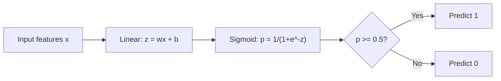
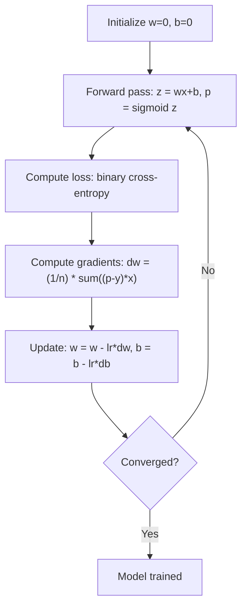

# Regresja Logistyczna

> Regresja logistyczna wygina prostą w krzywą S, aby odpowiadać na pytania typu tak-nie za pomocą prawdopodobieństw.

**Type:** Build
**Languages:** Python
**Prerequisites:** Phase 2 Lesson 1-2 (What Is ML, Linear Regression)
**Time:** ~90 minutes

## Learning Objectives

- Zaimplementować regresję logistyczną od podstaw przy użyciu funkcji sigmoidalnej i binarnej entropii krzyżowej
- Obliczyć i zinterpretować precyzję, czułość (recall), wynik F1 oraz macierz pomyłek dla klasyfikacji binarnej
- Wyjaśnić, dlaczego MSE zawodzi w klasyfikacji i dlaczego binarna entropia krzyżowa daje wypukłą powierzchnię kosztu
- Zbudować model regresji softmax dla klasyfikacji wieloklasowej i ocenić kompromisy w dostrajaniu progu decyzyjnego

## Problem

Chcesz przewidzieć, czy guz jest złośliwy, czy łagodny na podstawie jego rozmiaru. Próbujesz regresji liniowej. Zwraca liczby takie jak 0,3 lub 1,7 lub -0,5. Co one oznaczają? Czy 1,7 to „bardzo złośliwy"? Czy -0,5 to „bardzo łagodny"? Regresja liniowa zwraca nieograniczone liczby. Klasyfikacja potrzebuje ograniczonych prawdopodobieństw między 0 a 1 oraz jasnej decyzji: tak lub nie.

Regresja logistyczna rozwiązuje to. Bierze tę samą kombinację liniową (wx + b) i przepuszcza ją przez funkcję sigmoidalną, która spłaszcza dowolną liczbę do zakresu (0, 1). Wynik to prawdopodobieństwo. Ustawiasz próg (zwykle 0,5) i podejmujesz decyzję.

Jest to jeden z najczęściej używanych algorytmów w praktyce. Mimo swojej nazwy, regresja logistyczna jest algorytmem klasyfikacyjnym, a nie regresyjnym. Nazwa pochodzi od funkcji logistycznej (sigmoidalnej), której używa.

## Koncepcja

### Dlaczego Regresja Liniowa Zawodzi w Klasyfikacji

Wyobraź sobie przewidywanie zaliczenia/niezaliczenia (1/0) na podstawie liczby godzin nauki. Regresja liniowa dopasowuje prostą do danych:

```
godziny:  1   2   3   4   5   6   7   8   9   10
rzeczyw.: 0   0   0   0   1   1   1   1   1   1
```

Dopasowanie liniowe może dać przewidywania takie jak -0,2 dla godziny 1 i 1,3 dla godziny 10. Te wartości nie są prawdopodobieństwami. Schodzą poniżej 0 i powyżej 1. Co gorsza, pojedyncza wartość odstająca (ktoś, kto uczył się 50 godzin) przeciągnęłaby całą prostą, zmieniając przewidywania dla wszystkich.

Klasyfikacja potrzebuje funkcji, która:
- Zwraca wartości między 0 a 1 (prawdopodobieństwa)
- Tworzy ostrą granicę (granicę decyzyjną)
- Nie jest zniekształcana przez wartości odstające daleko od granicy

### Funkcja Sigmoidalna

Funkcja sigmoidalna robi dokładnie to:

```
sigmoid(z) = 1 / (1 + e^(-z))
```

Właściwości:
- Gdy z jest duże i dodatnie, sigmoid(z) dąży do 1
- Gdy z jest duże i ujemne, sigmoid(z) dąży do 0
- Gdy z = 0, sigmoid(z) = 0,5
- Wynik jest zawsze między 0 a 1
- Funkcja jest gładka i różniczkowalna wszędzie

Pochodna ma wygodną postać: sigmoid'(z) = sigmoid(z) * (1 - sigmoid(z)). To sprawia, że obliczanie gradientu jest wydajne.

### Regresja Logistyczna = Model Liniowy + Sigmoida

Model oblicza z = wx + b (tak samo jak regresja liniowa), a następnie stosuje sigmoidę:



Wynik p interpretuje się jako P(y=1 | x), czyli prawdopodobieństwo, że wejście należy do klasy 1. Granica decyzyjna to miejsce, gdzie wx + b = 0, co sprawia, że wynik sigmoidy wynosi dokładnie 0,5.

### Binarna Entropia Krzyżowa (Binary Cross-Entropy Loss)

Nie możesz użyć MSE dla regresji logistycznej. MSE z sigmoidą tworzy niewypukłą powierzchnię kosztu z wieloma minimami lokalnymi. Zamiast tego użyj binarnej entropii krzyżowej (log loss):

```
Strata = -(1/n) * sum(y * log(p) + (1-y) * log(1-p))
```

Dlaczego to działa:
- Gdy y=1, a p jest bliskie 1: log(1) = 0, więc strata jest bliska 0 (poprawnie, niski koszt)
- Gdy y=1, a p jest bliskie 0: log(0) dąży do minus nieskończoności, więc strata jest ogromna (błędnie, wysoki koszt)
- Gdy y=0, a p jest bliskie 0: log(1) = 0, więc strata jest bliska 0 (poprawnie, niski koszt)
- Gdy y=0, a p jest bliskie 1: log(0) dąży do minus nieskończoności, więc strata jest ogromna (błędnie, wysoki koszt)

Ta funkcja straty jest wypukła dla regresji logistycznej, gwarantując pojedyncze globalne minimum.

### Gradient Prostych dla Regresji Logistycznej

Gradienty dla binarnej entropii krzyżowej z sigmoidą mają czystą postać:

```
dL/dw = (1/n) * sum((p - y) * x)
dL/db = (1/n) * sum(p - y)
```

Wyglądają identycznie jak gradienty dla regresji liniowej. Różnica polega na tym, że p = sigmoid(wx + b) zamiast p = wx + b. Sigmoida wprowadza nieliniowość, ale reguła aktualizacji gradientu pozostaje taka sama.



### Granica Decyzyjna

Dla dwuwymiarowego wejścia (dwie cechy) granica decyzyjna to linia, gdzie:

```
w1*x1 + w2*x2 + b = 0
```

Punkty po jednej stronie są klasyfikowane jako 1, punkty po drugiej stronie jako 0. Regresja logistyczna zawsze daje liniową granicę decyzyjną. Jeśli potrzebujesz zakrzywionej granicy, dodaj cechy wielomianowe lub użyj nieliniowego modelu.

### Klasyfikacja Wieloklasowa z Softmax

Binarna regresja logistyczna obsługuje dwie klasy. Dla k klas użyj funkcji softmax:

```
softmax(z_i) = e^(z_i) / sum(e^(z_j) dla wszystkich j)
```

Każda klasa ma swój własny wektor wag. Model oblicza wynik z_i dla każdej klasy, a następnie softmax konwertuje wyniki na prawdopodobieństwa sumujące się do 1. Przewidywana klasa to ta z najwyższym prawdopodobieństwem.

Funkcja straty staje się kategoryczną entropią krzyżową:

```
Strata = -(1/n) * sum(sum(y_k * log(p_k)))
```

gdzie y_k wynosi 1 dla prawdziwej klasy i 0 dla wszystkich pozostałych (kodowanie one-hot).

### Metryki Ewaluacyjne

Sama dokładność nie wystarczy. Dla zbioru danych z 95% negatywów i 5% pozytywów, model, który zawsze przewiduje negatyw, osiąga 95% dokładności, ale jest bezużyteczny.

**Macierz Pomyłek (Confusion Matrix)**:

| | Prognozowany Pozytywny | Prognozowany Negatywny |
|---|---|---|
| Faktycznie Pozytywny | Prawdziwie Pozytywny (TP) | Fałszywie Negatywny (FN) |
| Faktycznie Negatywny | Fałszywie Pozytywny (FP) | Prawdziwie Negatywny (TN) |

**Precyzja (Precision)**: Spośród wszystkich przewidzianych pozytywów, ile jest faktycznie pozytywnych?
```
Precyzja = TP / (TP + FP)
```

**Czułość (Recall / Sensitivity)**: Spośród wszystkich faktycznych pozytywów, ile złapaliśmy?
```
Czułość = TP / (TP + FN)
```

**Wynik F1 (F1 Score)**: Średnia harmoniczna precyzji i czułości. Równoważy obie metryki.
```
F1 = 2 * (Precyzja * Czułość) / (Precyzja + Czułość)
```

Kiedy priorytetyzować:
- **Precyzja**: gdy fałszywie pozytywne są kosztowne (filtr spamu, nie chcesz blokować legalnych e-maili)
- **Czułość**: gdy fałszywie negatywne są kosztowne (badania przesiewowe w kierunku raka, nie chcesz przegapić guza)
- **F1**: gdy potrzebujesz pojedynczej zrównoważonej metryki

```figure
logistic-sigmoid
```

## Build It

### Krok 1: Funkcja sigmoidalna i generowanie danych

```python
import random
import math

def sigmoid(z):
    z = max(-500, min(500, z))
    return 1.0 / (1.0 + math.exp(-z))


random.seed(42)
N = 200
X = []
y = []

for _ in range(N // 2):
    X.append([random.gauss(2, 1), random.gauss(2, 1)])
    y.append(0)

for _ in range(N // 2):
    X.append([random.gauss(5, 1), random.gauss(5, 1)])
    y.append(1)

combined = list(zip(X, y))
random.shuffle(combined)
X, y = zip(*combined)
X = list(X)
y = list(y)

print(f"Generated {N} samples (2 classes, 2 features)")
print(f"Class 0 center: (2, 2), Class 1 center: (5, 5)")
print(f"First 5 samples:")
for i in range(5):
    print(f"  Features: [{X[i][0]:.2f}, {X[i][1]:.2f}], Label: {y[i]}")
```

### Krok 2: Regresja logistyczna od podstaw

```python
class LogisticRegression:
    def __init__(self, n_features, learning_rate=0.01):
        self.weights = [0.0] * n_features
        self.bias = 0.0
        self.lr = learning_rate
        self.loss_history = []

    def predict_proba(self, x):
        z = sum(w * xi for w, xi in zip(self.weights, x)) + self.bias
        return sigmoid(z)

    def predict(self, x, threshold=0.5):
        return 1 if self.predict_proba(x) >= threshold else 0

    def compute_loss(self, X, y):
        n = len(y)
        total = 0.0
        for i in range(n):
            p = self.predict_proba(X[i])
            p = max(1e-15, min(1 - 1e-15, p))
            total += y[i] * math.log(p) + (1 - y[i]) * math.log(1 - p)
        return -total / n

    def fit(self, X, y, epochs=1000, print_every=200):
        n = len(y)
        n_features = len(X[0])
        for epoch in range(epochs):
            dw = [0.0] * n_features
            db = 0.0
            for i in range(n):
                p = self.predict_proba(X[i])
                error = p - y[i]
                for j in range(n_features):
                    dw[j] += error * X[i][j]
                db += error
            for j in range(n_features):
                self.weights[j] -= self.lr * (dw[j] / n)
            self.bias -= self.lr * (db / n)
            loss = self.compute_loss(X, y)
            self.loss_history.append(loss)
            if epoch % print_every == 0:
                print(f"  Epoch {epoch:4d} | Loss: {loss:.4f} | w: [{self.weights[0]:.3f}, {self.weights[1]:.3f}] | b: {self.bias:.3f}")
        return self

    def accuracy(self, X, y):
        correct = sum(1 for i in range(len(y)) if self.predict(X[i]) == y[i])
        return correct / len(y)


split = int(0.8 * N)
X_train, X_test = X[:split], X[split:]
y_train, y_test = y[:split], y[split:]

print("\n=== Training Logistic Regression ===")
model = LogisticRegression(n_features=2, learning_rate=0.1)
model.fit(X_train, y_train, epochs=1000, print_every=200)

print(f"\nTrain accuracy: {model.accuracy(X_train, y_train):.4f}")
print(f"Test accuracy:  {model.accuracy(X_test, y_test):.4f}")
print(f"Weights: [{model.weights[0]:.4f}, {model.weights[1]:.4f}]")
print(f"Bias: {model.bias:.4f}")
```

### Krok 3: Macierz pomyłek i metryki od podstaw

```python
class ClassificationMetrics:
    def __init__(self, y_true, y_pred):
        self.tp = sum(1 for t, p in zip(y_true, y_pred) if t == 1 and p == 1)
        self.tn = sum(1 for t, p in zip(y_true, y_pred) if t == 0 and p == 0)
        self.fp = sum(1 for t, p in zip(y_true, y_pred) if t == 0 and p == 1)
        self.fn = sum(1 for t, p in zip(y_true, y_pred) if t == 1 and p == 0)

    def accuracy(self):
        total = self.tp + self.tn + self.fp + self.fn
        return (self.tp + self.tn) / total if total > 0 else 0

    def precision(self):
        denom = self.tp + self.fp
        return self.tp / denom if denom > 0 else 0

    def recall(self):
        denom = self.tp + self.fn
        return self.tp / denom if denom > 0 else 0

    def f1(self):
        p = self.precision()
        r = self.recall()
        return 2 * p * r / (p + r) if (p + r) > 0 else 0

    def print_confusion_matrix(self):
        print(f"\n  Confusion Matrix:")
        print(f"                  Predicted")
        print(f"                  Pos   Neg")
        print(f"  Actual Pos     {self.tp:4d}  {self.fn:4d}")
        print(f"  Actual Neg     {self.fp:4d}  {self.tn:4d}")

    def print_report(self):
        self.print_confusion_matrix()
        print(f"\n  Accuracy:  {self.accuracy():.4f}")
        print(f"  Precision: {self.precision():.4f}")
        print(f"  Recall:    {self.recall():.4f}")
        print(f"  F1 Score:  {self.f1():.4f}")


y_pred_test = [model.predict(x) for x in X_test]
print("\n=== Classification Report (Test Set) ===")
metrics = ClassificationMetrics(y_test, y_pred_test)
metrics.print_report()
```

### Krok 4: Analiza granicy decyzyjnej

```python
print("\n=== Decision Boundary ===")
w1, w2 = model.weights
b = model.bias
print(f"Decision boundary: {w1:.4f}*x1 + {w2:.4f}*x2 + {b:.4f} = 0")
if abs(w2) > 1e-10:
    print(f"Solved for x2:     x2 = {-w1/w2:.4f}*x1 + {-b/w2:.4f}")

print("\nSample predictions near the boundary:")
test_points = [
    [3.0, 3.0],
    [3.5, 3.5],
    [4.0, 4.0],
    [2.5, 2.5],
    [5.0, 5.0],
]
for point in test_points:
    prob = model.predict_proba(point)
    pred = model.predict(point)
    print(f"  [{point[0]}, {point[1]}] -> prob={prob:.4f}, class={pred}")
```

### Krok 5: Wieloklasowa z softmax

```python
class SoftmaxRegression:
    def __init__(self, n_features, n_classes, learning_rate=0.01):
        self.n_features = n_features
        self.n_classes = n_classes
        self.lr = learning_rate
        self.weights = [[0.0] * n_features for _ in range(n_classes)]
        self.biases = [0.0] * n_classes

    def softmax(self, scores):
        max_score = max(scores)
        exp_scores = [math.exp(s - max_score) for s in scores]
        total = sum(exp_scores)
        return [e / total for e in exp_scores]

    def predict_proba(self, x):
        scores = [
            sum(self.weights[k][j] * x[j] for j in range(self.n_features)) + self.biases[k]
            for k in range(self.n_classes)
        ]
        return self.softmax(scores)

    def predict(self, x):
        probs = self.predict_proba(x)
        return probs.index(max(probs))

    def fit(self, X, y, epochs=1000, print_every=200):
        n = len(y)
        for epoch in range(epochs):
            grad_w = [[0.0] * self.n_features for _ in range(self.n_classes)]
            grad_b = [0.0] * self.n_classes
            total_loss = 0.0
            for i in range(n):
                probs = self.predict_proba(X[i])
                for k in range(self.n_classes):
                    target = 1.0 if y[i] == k else 0.0
                    error = probs[k] - target
                    for j in range(self.n_features):
                        grad_w[k][j] += error * X[i][j]
                    grad_b[k] += error
                true_prob = max(probs[y[i]], 1e-15)
                total_loss -= math.log(true_prob)
            for k in range(self.n_classes):
                for j in range(self.n_features):
                    self.weights[k][j] -= self.lr * (grad_w[k][j] / n)
                self.biases[k] -= self.lr * (grad_b[k] / n)
            if epoch % print_every == 0:
                print(f"  Epoch {epoch:4d} | Loss: {total_loss / n:.4f}")
        return self

    def accuracy(self, X, y):
        correct = sum(1 for i in range(len(y)) if self.predict(X[i]) == y[i])
        return correct / len(y)


random.seed(42)
X_3class = []
y_3class = []

centers = [(1, 1), (5, 1), (3, 5)]
for label, (cx, cy) in enumerate(centers):
    for _ in range(50):
        X_3class.append([random.gauss(cx, 0.8), random.gauss(cy, 0.8)])
        y_3class.append(label)

combined = list(zip(X_3class, y_3class))
random.shuffle(combined)
X_3class, y_3class = zip(*combined)
X_3class = list(X_3class)
y_3class = list(y_3class)

split_3 = int(0.8 * len(X_3class))
X_train_3 = X_3class[:split_3]
y_train_3 = y_3class[:split_3]
X_test_3 = X_3class[split_3:]
y_test_3 = y_3class[split_3:]

print("\n=== Multi-class Softmax Regression (3 classes) ===")
softmax_model = SoftmaxRegression(n_features=2, n_classes=3, learning_rate=0.1)
softmax_model.fit(X_train_3, y_train_3, epochs=1000, print_every=200)
print(f"\nTrain accuracy: {softmax_model.accuracy(X_train_3, y_train_3):.4f}")
print(f"Test accuracy:  {softmax_model.accuracy(X_test_3, y_test_3):.4f}")

print("\nSample predictions:")
for i in range(5):
    probs = softmax_model.predict_proba(X_test_3[i])
    pred = softmax_model.predict(X_test_3[i])
    print(f"  True: {y_test_3[i]}, Predicted: {pred}, Probs: [{', '.join(f'{p:.3f}' for p in probs)}]")
```

### Krok 6: Dostrajanie progu decyzyjnego

```python
print("\n=== Threshold Tuning ===")
print("Default threshold: 0.5. Adjusting the threshold trades precision for recall.\n")

thresholds = [0.3, 0.4, 0.5, 0.6, 0.7]
print(f"{'Threshold':>10} {'Accuracy':>10} {'Precision':>10} {'Recall':>10} {'F1':>10}")
print("-" * 52)

for t in thresholds:
    y_pred_t = [1 if model.predict_proba(x) >= t else 0 for x in X_test]
    m = ClassificationMetrics(y_test, y_pred_t)
    print(f"{t:>10.1f} {m.accuracy():>10.4f} {m.precision():>10.4f} {m.recall():>10.4f} {m.f1():>10.4f}")
```

## Use It

Teraz to samo z scikit-learn.

```python
from sklearn.linear_model import LogisticRegression as SklearnLR
from sklearn.metrics import accuracy_score, precision_score, recall_score, f1_score
from sklearn.metrics import confusion_matrix, classification_report
from sklearn.model_selection import train_test_split
from sklearn.preprocessing import StandardScaler
import numpy as np

np.random.seed(42)
X_0 = np.random.randn(100, 2) + [2, 2]
X_1 = np.random.randn(100, 2) + [5, 5]
X_sk = np.vstack([X_0, X_1])
y_sk = np.array([0] * 100 + [1] * 100)

X_tr, X_te, y_tr, y_te = train_test_split(X_sk, y_sk, test_size=0.2, random_state=42)

scaler = StandardScaler()
X_tr_sc = scaler.fit_transform(X_tr)
X_te_sc = scaler.transform(X_te)

lr = SklearnLR()
lr.fit(X_tr_sc, y_tr)
y_pred = lr.predict(X_te_sc)

print("=== Scikit-learn Logistic Regression ===")
print(f"Accuracy:  {accuracy_score(y_te, y_pred):.4f}")
print(f"Precision: {precision_score(y_te, y_pred):.4f}")
print(f"Recall:    {recall_score(y_te, y_pred):.4f}")
print(f"F1:        {f1_score(y_te, y_pred):.4f}")
print(f"\nConfusion Matrix:\n{confusion_matrix(y_te, y_pred)}")
print(f"\nClassification Report:\n{classification_report(y_te, y_pred)}")
```

Twoja implementacja od podstaw daje tę samą granicę decyzyjną i metryki. Scikit-learn dodaje opcje solvera (liblinear, lbfgs, saga), automatyczną regularizację, strategie wieloklasowe (one-vs-rest, multinomial) i optymalizacje stabilności numerycznej.

## Ship It

Ta lekcja produkuje:
- `code/logistic_regression.py` - regresja logistyczna od podstaw z metrykami

## Exercises

1. Wygeneruj zestaw danych, który NIE jest liniowo separowalny (np. dwa koncentryczne okręgi). Trenuj regresję logistyczną i zaobserwuj jej niepowodzenie. Następnie dodaj cechy wielomianowe (x1^2, x2^2, x1*x2) i trenuj ponownie. Pokaż, że dokładność się poprawia.
2. Zaimplementuj wieloklasową macierz pomyłek dla modelu softmax z 3 klasami. Oblicz precyzję i czułość dla każdej klasy. Która klasa jest najtrudniejsza do sklasyfikowania?
3. Zbuduj krzywą ROC od podstaw. Dla 100 wartości progu od 0 do 1 oblicz wskaźnik prawdziwie pozytywnych i fałszywie pozytywnych. Oblicz AUC (pole pod krzywą) za pomocą metody trapezów.

## Key Terms

| Term | What people say | What it actually means |
|------|----------------|----------------------|
| Regresja logistyczna | „Regresja do klasyfikacji" | Model liniowy, po którym następuje funkcja sigmoidalna, która zwraca prawdopodobieństwa klas |
| Funkcja sigmoidalna | „Krzywa S" | Funkcja 1/(1+e^(-z)), która mapuje dowolną liczbę rzeczywistą do zakresu (0, 1) |
| Binarna entropia krzyżowa | „Log loss" | Funkcja straty -[y*log(p) + (1-y)*log(1-p)], która surowo karze pewne, ale błędne przewidywania |
| Granica decyzyjna | „Linia podziału" | Powierzchnia, gdzie prawdopodobieństwo wyjściowe modelu wynosi 0,5, oddzielająca przewidywane klasy |
| Softmax | „Sigmoida wieloklasowa" | Funkcja konwertująca wektor wyników na prawdopodobieństwa sumujące się do 1 |
| Precyzja | „Ile wybranych jest trafnych" | TP / (TP + FP), ułamek pozytywnych przewidywań, które są faktycznie pozytywne |
| Czułość | „Ile trafnych zostało wybranych" | TP / (TP + FN), ułamek faktycznych pozytywów, które model poprawnie identyfikuje |
| Wynik F1 | „Zbalansowana dokładność" | Średnia harmoniczna precyzji i czułości: 2*P*R / (P+R) |
| Macierz pomyłek | „Rozkład błędów" | Tabela pokazująca liczby TP, TN, FP, FN dla każdej pary klas |
| Próg decyzyjny | „Punkt odcięcia" | Wartość prawdopodobieństwa, powyżej której model przewiduje klasę 1 (domyślnie 0,5, do dostrojenia) |
| Kodowanie one-hot | „Kolumny binarne dla kategorii" | Reprezentowanie klasy k jako wektora zer z jedynką na pozycji k |
| Kategoryczna entropia krzyżowa | „Log loss dla wielu klas" | Rozszerzenie binarnej entropii krzyżowej na k klas przy użyciu kodowania one-hot |