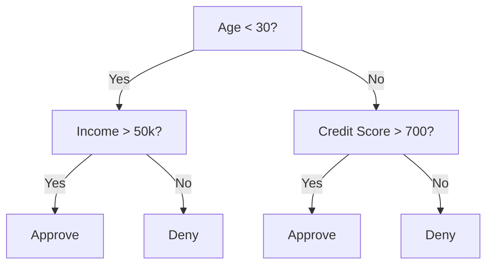
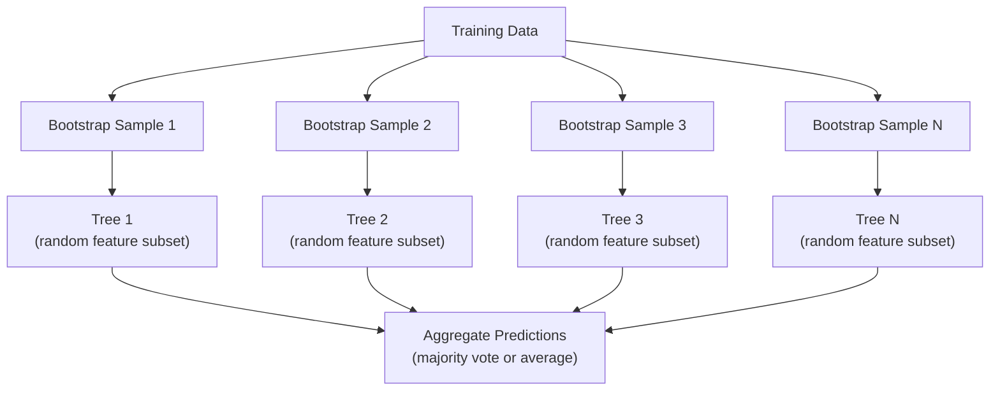

# Drzewa Decyzyjne i Lasy Losowe

> Drzewo decyzyjne to tylko schemat blokowy. Ale las z nich złożony to jedno z najpotężniejszych narzędzi w ML.

**Type:** Build
**Language:** Python
**Prerequisites:** Phase 1 (Lessons 09 Information Theory, 06 Probability)
**Time:** ~90 minutes

## Learning Objectives

- Zaimplementuj obliczanie nieczystości Giniego, entropii i przyrostu informacji, aby znaleźć optymalne podziały drzewa decyzyjnego
- Zbuduj klasyfikator drzewa decyzyjnego od podstaw z kontrolami przycinania wstępnego (max depth, min samples)
- Skonstruuj las losowy przy użyciu próbkowania bootstrapowego i randomizacji cech, oraz wyjaśnij, dlaczego redukuje wariancję
- Porównaj ważność cech MDI z ważnością permutacyjną i wskaż, kiedy MDI jest obciążone

## The Problem

Masz dane tabelaryczne. Wiersze to próbki, kolumny to cechy, i istnieje kolumna docelowa, którą chcesz przewidzieć. Mógłbyś rzucić na to sieć neuronową. Ale w przypadku danych tabelarycznych modele oparte na drzewach (drzewa decyzyjne, lasy losowe, gradient boosted trees) konsekwentnie przewyższają głębokie uczenie. Konkursy Kaggle na danych strukturalnych są zdominowane przez XGBoost i LightGBM, a nie transformery.

Dlaczego? Drzewa obsługują mieszane typy cech (numeryczne i kategoryczne) bez wstępnego przetwarzania. Obsługują nieliniowe zależności bez inżynierii cech. Są interpretowalne: możesz spojrzeć na drzewo i zobaczyć dokładnie, dlaczego dokonano predykcji. A lasy losowe, które uśredniają wiele drzew, są wysoce odporne na przeuczenie na zbiorach danych o umiarkowanym rozmiarze.

Ta lekcja buduje drzewa decyzyjne od podstaw przy użyciu rekurencyjnego podziału, a następnie buduje na ich bazie las losowy. Zaimplementujesz matematykę stojącą za kryteriami podziału (nieczystość Giniego, entropia, przyrost informacji) i zrozumiesz, dlaczego zespół słabych learnerów staje się silnym.

## The Concept

### Co robi drzewo decyzyjne

Drzewo decyzyjne dzieli przestrzeń cech na prostokątne regiony, zadając sekwencję pytań tak/nie.



Każdy węzeł wewnętrzny testuje cechę względem progu. Każdy liść dokonuje predykcji. Aby sklasyfikować nowy punkt danych, zaczynasz od korzenia i podążasz za gałęziami, aż dotrzesz do liścia.

Drzewo jest budowane od góry do dołu, wybierając w każdym węźle cechę i próg, które najlepiej separują dane. „Najlepiej" jest definiowane przez kryterium podziału.

### Kryteria podziału: pomiar nieczystości

W każdym węźle mamy zbiór próbek. Chcemy je podzielić tak, aby powstałe węzły potomne były jak najbardziej „czyste", co oznacza, że każde dziecko zawiera głównie jedną klasę.

**Nieczystość Giniego** mierzy prawdopodobieństwo, że losowo wybrana próbka zostałaby błędnie sklasyfikowana, gdyby była oznaczona zgodnie z rozkładem klas w danym węźle.

```
Gini(S) = 1 - sum(p_k^2)

gdzie p_k to proporcja klasy k w zbiorze S.
```

Dla czystego węzła (jedna klasa), Gini = 0. Dla binarnego podziału 50/50, Gini = 0,5. Niższa wartość jest lepsza.

```
Przykład: 6 kotów, 4 psy

Gini = 1 - (0,6^2 + 0,4^2) = 1 - (0,36 + 0,16) = 0,48
```

**Entropia** mierzy zawartość informacji (nieuporządkowanie) w węźle. Omówiona w Faza 1 Lekcja 09.

```
Entropia(S) = -sum(p_k * log2(p_k))
```

Dla czystego węzła entropia = 0. Dla binarnego podziału 50/50 entropia = 1,0. Niższa wartość jest lepsza.

```
Przykład: 6 kotów, 4 psy

Entropia = -(0,6 * log2(0,6) + 0,4 * log2(0,4))
         = -(0,6 * -0,737 + 0,4 * -1,322)
         = 0,442 + 0,529
         = 0,971 bitów
```

**Przyrost informacji** to redukcja nieczystości (entropii lub Giniego) po podziale.

```
IG(S, cecha, próg) = Nieczystość(S) - średnia_ważona(Nieczystość(S_lewe), Nieczystość(S_prawe))

gdzie wagi to proporcje próbek w każdym dziecku.
```

Zachłanny algorytm w każdym węźle: wypróbuj każdą cechę i każdy możliwy próg. Wybierz parę (cecha, próg), która maksymalizuje przyrost informacji.

### Jak działa podział

Dla zbioru danych z n cechami i m próbkami w bieżącym węźle:

1. Dla każdej cechy j (j = 1 do n):
   - Posortuj próbki według cechy j
   - Wypróbuj każdy punkt środkowy między kolejnymi różnymi wartościami jako próg
   - Oblicz przyrost informacji dla każdego progu
2. Wybierz cechę i próg z najwyższym przyrostem informacji
3. Podziel dane na lewe (cecha <= próg) i prawe (cecha > próg)
4. Rekurencyjnie na każdym dziecku

To zachłanne podejście nie gwarantuje globalnie optymalnego drzewa. Znalezienie optymalnego drzewa jest NP-trudne. Ale zachłanny podział działa dobrze w praktyce.

### Warunki zatrzymania

Bez warunków zatrzymania drzewo rośnie, aż każdy liść będzie czysty (jedna próbka na liść). To doskonale zapamiętuje dane treningowe i generalizuje fatalnie.

**Przycinanie wstępne** zatrzymuje drzewo, zanim w pełni urośnie:
- Maksymalna głębokość: przestań dzielić, gdy drzewo osiągnie zadaną głębokość
- Minimalna liczba próbek na liść: przestań, jeśli węzeł ma mniej niż k próbek
- Minimalny przyrost informacji: przestań, jeśli najlepszy podział poprawia nieczystość o mniej niż próg
- Maksymalna liczba liści: ogranicz całkowitą liczbę liści

**Przycinanie następcze** hoduje pełne drzewo, a następnie je przycina:
- Przycinanie koszt-złożoność (używane przez scikit-learn): dodaje karę proporcjonalną do liczby liści. Zwiększ karę, aby uzyskać mniejsze drzewa
- Przycinanie przez redukcję błędu: usuń poddrzewo, jeśli błąd walidacyjny nie wzrasta

Przycinanie wstępne jest prostsze i szybsze. Przycinanie następcze często produkuje lepsze drzewa, ponieważ nie zatrzymuje przedwcześnie podziałów, które mogłyby prowadzić do użytecznych dalszych podziałów.

### Drzewa decyzyjne dla regresji

Dla regresji, predykcją liścia jest średnia wartości docelowych w tym liściu. Kryterium podziału również się zmienia:

**Redukcja wariancji** zastępuje przyrost informacji:

```
VR(S, cecha, próg) = War(S) - średnia_ważona(War(S_lewe), War(S_prawe))
```

Wybierz podział, który najbardziej redukuje wariancję. Drzewo dzieli przestrzeń wejściową na regiony i przewiduje stałą (średnią) w każdym regionie.

### Lasy losowe: siła zespołów

Pojedyncze drzewo decyzyjne ma wysoką wariancję. Małe zmiany w danych mogą dać zupełnie inne drzewa. Lasy losowe rozwiązują to przez uśrednianie wielu drzew.



Dwa źródła losowości czynią drzewa różnorodnymi:

**Bagging (agregacja bootstrapowa):** Każde drzewo jest trenowane na próbce bootstrapowej, czyli losowej próbce z losowaniem ze zwracaniem z danych treningowych. Około 63% oryginalnych próbek pojawia się w każdej próbce bootstrapowej (reszta to próbki out-of-bag, które mogą być użyte do walidacji).

**Randomizacja cech:** Przy każdym podziale brany jest pod uwagę tylko losowy podzbiór cech. Dla klasyfikacji domyślnie jest to sqrt(n_cech). Dla regresji n_cech/3. Zapobiega to dzieleniu wszystkich drzew na tej samej dominującej cesze.

Kluczowy wgląd: uśrednianie wielu mało skorelowanych drzew redukuje wariancję bez zwiększania obciążenia. Każde pojedyncze drzewo może być przeciętne. Zespół jest silny.

### Ważność cech

Lasy losowe naturalnie dostarczają wyniki ważności cech. Najpopularniejsza metoda:

**Średni spadek nieczystości (MDI):** Dla każdej cechy, zsumuj całkowitą redukcję nieczystości we wszystkich drzewach i wszystkich węzłach, w których ta cecha jest używana. Cechy, które dają większe redukcje nieczystości we wcześniejszych podziałach, są ważniejsze.

```
ważność(cecha_j) = suma po wszystkich węzłach, gdzie używana jest cecha_j:
    (n_próbek_w_węźle / n_całkowitych_próbek) * spadek_nieczystości
```

Jest to szybkie (obliczane podczas treningu), ale obciążone na korzyść cech o wysokiej liczbie wartości i cech z wieloma możliwymi punktami podziału.

**Ważność permutacyjna** to alternatywa: przetasuj wartości jednej cechy i zmierz, jak bardzo spada dokładność modelu. Bardziej wiarygodna, ale wolniejsza.

### Kiedy drzewa biją sieci neuronowe

Drzewa i lasy dominują nad sieciami neuronowymi na danych tabelarycznych. Kilka powodów:

| Czynnik | Drzewa | Sieci neuronowe |
|--------|-------|----------------|
| Mieszane typy (numeryczne + kategoryczne) | Naturalne wsparcie | Wymagają kodowania |
| Małe zbiory danych (< 10k wierszy) | Działają dobrze | Przeuczają się |
| Interakcje cech | Znajdowane przez podział | Wymagają projektowania architektury |
| Interpretowalność | Pełna przezroczystość | Czarna skrzynka |
| Czas treningu | Minuty | Godziny |
| Wrażliwość na hiperparametry | Niska | Wysoka |

Sieci neuronowe wygrywają, gdy dane mają strukturę przestrzenną lub sekwencyjną (obrazy, tekst, audio). Dla płaskich tabel cech, drzewa są domyślnym wyborem.

```figure
decision-tree-depth
```

## Build It

### Step 1: Nieczystość Giniego i entropia

Zbuduj oba kryteria podziału od podstaw i zweryfikuj, że zgadzają się co do tego, które podziały są dobre.

```python
import math

def gini_impurity(labels):
    n = len(labels)
    if n == 0:
        return 0.0
    counts = {}
    for label in labels:
        counts[label] = counts.get(label, 0) + 1
    return 1.0 - sum((c / n) ** 2 for c in counts.values())

def entropy(labels):
    n = len(labels)
    if n == 0:
        return 0.0
    counts = {}
    for label in labels:
        counts[label] = counts.get(label, 0) + 1
    return -sum(
        (c / n) * math.log2(c / n) for c in counts.values() if c > 0
    )
```

### Step 2: Znajdź najlepszy podział

Wypróbuj każdą cechę i każdy próg. Zwróć ten z najwyższym przyrostem informacji.

```python
def information_gain(parent_labels, left_labels, right_labels, criterion="gini"):
    measure = gini_impurity if criterion == "gini" else entropy
    n = len(parent_labels)
    n_left = len(left_labels)
    n_right = len(right_labels)
    if n_left == 0 or n_right == 0:
        return 0.0
    parent_impurity = measure(parent_labels)
    child_impurity = (
        (n_left / n) * measure(left_labels) +
        (n_right / n) * measure(right_labels)
    )
    return parent_impurity - child_impurity
```

### Step 3: Zbuduj klasę DecisionTree

Rekurencyjny podział, predykcja i śledzenie ważności cech.

```python
class DecisionTree:
    def __init__(self, max_depth=None, min_samples_split=2,
                 min_samples_leaf=1, criterion="gini",
                 max_features=None):
        self.max_depth = max_depth
        self.min_samples_split = min_samples_split
        self.min_samples_leaf = min_samples_leaf
        self.criterion = criterion
        self.max_features = max_features
        self.tree = None
        self.feature_importances_ = None

    def fit(self, X, y):
        self.n_features = len(X[0])
        self.feature_importances_ = [0.0] * self.n_features
        self.n_samples = len(X)
        self.tree = self._build(X, y, depth=0)
        total = sum(self.feature_importances_)
        if total > 0:
            self.feature_importances_ = [
                fi / total for fi in self.feature_importances_
            ]

    def predict(self, X):
        return [self._predict_one(x, self.tree) for x in X]
```

### Step 4: Zbuduj klasę RandomForest

Próbkowanie bootstrapowe, randomizacja cech i głosowanie większościowe.

```python
class RandomForest:
    def __init__(self, n_trees=100, max_depth=None,
                 min_samples_split=2, max_features="sqrt",
                 criterion="gini"):
        self.n_trees = n_trees
        self.max_depth = max_depth
        self.min_samples_split = min_samples_split
        self.max_features = max_features
        self.criterion = criterion
        self.trees = []

    def fit(self, X, y):
        n = len(X)
        for _ in range(self.n_trees):
            indices = [random.randint(0, n - 1) for _ in range(n)]
            X_boot = [X[i] for i in indices]
            y_boot = [y[i] for i in indices]
            tree = DecisionTree(
                max_depth=self.max_depth,
                min_samples_split=self.min_samples_split,
                max_features=self.max_features,
                criterion=self.criterion,
            )
            tree.fit(X_boot, y_boot)
            self.trees.append(tree)

    def predict(self, X):
        all_preds = [tree.predict(X) for tree in self.trees]
        predictions = []
        for i in range(len(X)):
            votes = {}
            for preds in all_preds:
                v = preds[i]
                votes[v] = votes.get(v, 0) + 1
            predictions.append(max(votes, key=votes.get))
        return predictions
```

Zobacz `code/trees.py` po pełną implementację ze wszystkimi metodami pomocniczymi.

## Use It

Z scikit-learn, trenowanie lasu losowego to trzy linie:

```python
from sklearn.ensemble import RandomForestClassifier
from sklearn.datasets import load_iris
from sklearn.model_selection import train_test_split

X, y = load_iris(return_X_y=True)
X_train, X_test, y_train, y_test = train_test_split(X, y, random_state=42)

rf = RandomForestClassifier(n_estimators=100, random_state=42)
rf.fit(X_train, y_train)
print(f"Accuracy: {rf.score(X_test, y_test):.4f}")
print(f"Feature importances: {rf.feature_importances_}")
```

W praktyce, drzewa z gradient boostingiem (XGBoost, LightGBM, CatBoost) są często silniejsze niż lasy losowe, ponieważ budują drzewa sekwencyjnie, gdzie każde drzewo koryguje błędy poprzednich. Ale lasy losowe są trudniejsze do nieprawidłowej konfiguracji i wymagają prawie żadnego dostrajania hiperparametrów.

## Ship It

Ta lekcja produkuje `outputs/prompt-tree-interpreter.md` -- prompt, który interpretuje podziały drzewa decyzyjnego dla interesariuszy biznesowych. Podaj mu strukturę wytrenowanego drzewa (głębokość, cechy, progi podziału, dokładność), a on tłumaczy model na reguły w języku naturalnym, szereguje ważność cech, sygnalizuje przeuczenie lub wyciek danych oraz rekomenduje następne kroki. Użyj go za każdym razem, gdy musisz wyjaśnić model oparty na drzewie komuś, kto nie czyta kodu.

## Exercises

1. Wytrenuj pojedyncze drzewo decyzyjne na 2-wymiarowym zbiorze danych z 3 klasami. Ręcznie prześledź podziały i narysuj prostokątne granice decyzyjne. Porównaj granice przy max_depth=2 vs max_depth=10.

2. Zaimplementuj podział przez redukcję wariancji dla drzew regresyjnych. Wygeneruj y = sin(x) + szum dla 200 punktów i dopasuj swoje drzewo regresyjne. Wykreśl fragmentami stałe predykcje drzewa względem prawdziwej krzywej.

3. Zbuduj las losowy z 1, 5, 10, 50 i 200 drzewami. Wykreśl dokładność treningową i testową w zależności od liczby drzew. Zaobserwuj, że dokładność testowa osiąga plateau, ale nie spada (lasy są odporne na przeuczenie).

4. Porównaj nieczystość Giniego vs entropię jako kryteria podziału na 5 różnych zbiorach danych. Zmierz dokładność i głębokość drzewa. W większości przypadków dają prawie identyczne wyniki. Wyjaśnij dlaczego.

5. Zaimplementuj ważność permutacyjną. Porównaj ją z ważnością MDI na zbiorze danych, gdzie jedna cecha jest losowym szumem, ale ma wysoką liczność. MDi będzie oceniać cechę szumu wysoko. Ważność permutacyjna nie.

## Key Terms

| Termin | Co ludzie mówią | Co to naprawdę znaczy |
|------|----------------|----------------------|
| Decision tree | "Schemat blokowy dla predykcji" | Model, który dzieli przestrzeń cech na prostokątne regiony poprzez uczenie sekwencji podziałów if/else |
| Gini impurity | "Jak wymieszany jest węzeł" | Prawdopodobieństwo błędnej klasyfikacji losowej próbki w węźle. 0 = czysty, 0,5 = maksymalna nieczystość dla binarnego |
| Entropy | "Nieuporządkowanie w węźle" | Zawartość informacji w węźle. 0 = czysty, 1,0 = maksymalna niepewność dla binarnego. Z teorii informacji |
| Information gain | "Jak dobry jest podział" | Redukcja nieczystości po podziale. Zachłanne kryterium wyboru podziałów |
| Pre-pruning | "Zatrzymaj drzewo wcześnie" | Zatrzymanie wzrostu drzewa przez ustawienie maksymalnej głębokości, minimalnej liczby próbek lub minimalnego progu przyrostu |
| Post-pruning | "Przytnij drzewo po" | Hodowanie pełnego drzewa, a następnie usuwanie poddrzew, które nie poprawiają wydajności walidacyjnej |
| Bagging | "Trenuj na losowych podzbiorach" | Agregacja bootstrapowa. Trenuj każdy model na innej losowej próbce z losowaniem ze zwracaniem |
| Random forest | "Kupa drzew" | Zespół drzew decyzyjnych, każde trenowane na próbce bootstrapowej z losowymi podzbiorami cech przy każdym podziale |
| Feature importance (MDI) | "Które cechy mają znaczenie" | Całkowity spadek nieczystości wniesiony przez każdą cechę, zsumowany we wszystkich drzewach i węzłach |
| Permutation importance | "Przetasuj i sprawdź" | Spadek dokładności, gdy wartości cechy są losowo przetasowywane. Bardziej wiarygodne niż MDI dla cech zaszumionych |
| Variance reduction | "Regresyjna wersja przyrostu informacji" | Analog przyrostu informacji dla drzew regresyjnych. Wybiera podział, który najbardziej redukuje wariancję celu |
| Bootstrap sample | "Losowa próbka z powtórzeniami" | Losowa próbka pobrana z losowaniem ze zwracaniem z oryginalnego zbioru danych. Ten sam rozmiar, ale z duplikatami |

## Further Reading

- [Breiman: Random Forests (2001)](https://link.springer.com/article/10.1023/A:1010933404324) - oryginalna publikacja o lasach losowych
- [Grinsztajn et al.: Why do tree-based models still outperform deep learning on tabular data? (2022)](https://arxiv.org/abs/2207.08815) - rygorystyczne porównanie drzew vs sieci neuronowych na danych tabelarycznych
- [scikit-learn Decision Trees documentation](https://scikit-learn.org/stable/modules/tree.html) - praktyczny przewodnik z narzędziami wizualizacyjnymi
- [XGBoost: A Scalable Tree Boosting System (Chen & Guestrin, 2016)](https://arxiv.org/abs/1603.02754) - publikacja o gradient boosting, która dominuje na Kaggle