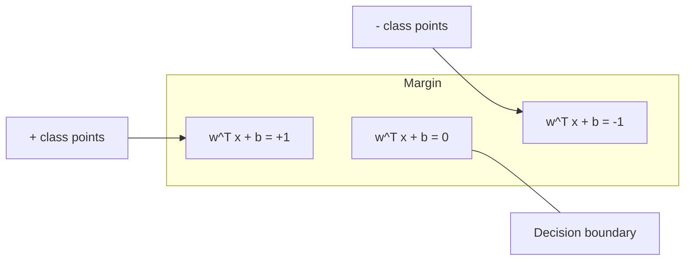
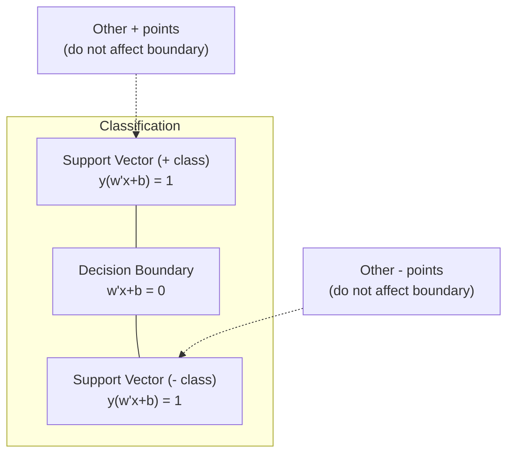
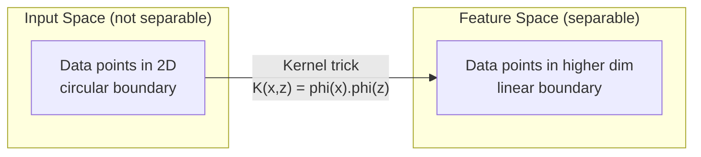

# Maszyny Wektorów Nośnych

> Znajdź najszerszą ulicę między dwiema klasami. To cała idea.

**Type:** Build
**Language:** Python
**Prerequisites:** Phase 1 (Lessons 08 Optimization, 14 Norms and Distances, 18 Convex Optimization)
**Time:** ~90 minutes

## Learning Objectives

- Zaimplementuj liniową SVM od podstaw przy użyciu straty zawiasowej i gradientowego zejścia na sformułowaniu pierwotnym
- Wyjaśnij zasadę maksymalnego marginesu i zidentyfikuj wektory nośne z wytrenowanego modelu
- Porównaj jądra liniowe, wielomianowe i RBF oraz wyjaśnij, jak sztuczka jądra unika jawnego mapowania do wysokiego wymiaru
- Oceń kompromis kontrolowany przez parametr C między szerokością marginesu a błędami klasyfikacji

## The Problem

Masz dwie klasy punktów danych i musisz narysować linię (lub hiperpłaszczyznę) oddzielającą je. Nieskończenie wiele linii mogłoby działać. Którą wybrać?

Tę z największym marginesem. Margines to odległość między granicą decyzyjną a najbliższymi punktami danych po każdej stronie. Szerszy margines oznacza, że klasyfikator jest bardziej pewny i lepiej generalizuje na niewidziane dane.

Ta intuicja prowadzi do Maszyn Wektorów Nośnych, jednego z najbardziej eleganckich matematycznie algorytmów w ML. SVM były dominującą metodą klasyfikacji przed głębokim uczeniem i pozostają najlepszym wyborem dla małych zbiorów danych, danych wysokowymiarowych oraz problemów, gdzie potrzebujesz zasadniczego, dobrze rozumianego modelu z teoretycznymi gwarancjami.

SVM łączą się bezpośrednio z Fazą 1: optymalizacja jest wypukła (Lekcja 18), margines jest mierzony normami (Lekcja 14), a sztuczka jądra wykorzystuje iloczyny skalarne do obsługi nieliniowych granic bez konieczności obliczeń w wysokowymiarowej przestrzeni.

## The Concept

### Klasyfikator maksymalnego marginesu

Dane liniowo separowalne z etykietami y_i w {-1, +1} i wektorami cech x_i. Szukamy hiperpłaszczyzny w^T x + b = 0, która separuje klasy.

Odległość od punktu x_i do hiperpłaszczyzny wynosi:

```
odległość = |w^T x_i + b| / ||w||
```

Dla poprawnie sklasyfikowanego punktu: y_i * (w^T x_i + b) > 0. Margines to dwukrotność odległości od hiperpłaszczyzny do najbliższego punktu po każdej stronie.



Problem optymalizacyjny:

```
maksymalizuj    2 / ||w||     (szerokość marginesu)
z warunkiem    y_i * (w^T x_i + b) >= 1  dla wszystkich i
```

Równoważnie (minimalizacja ||w||^2 jest łatwiejsza do optymalizacji):

```
minimalizuj    (1/2) ||w||^2
z warunkiem    y_i * (w^T x_i + b) >= 1  dla wszystkich i
```

To jest wypukły program kwadratowy. Ma jednoznaczne globalne rozwiązanie. Punkty danych, które leżą dokładnie na granicach marginesu (gdzie y_i * (w^T x_i + b) = 1) to wektory nośne. Są to jedyne punkty, które określają granicę decyzyjną. Przesuń lub usuń dowolny punkt niebędący wektorem nośnym, a granica się nie zmieni.

### Wektory nośne: krytyczna garstka



Większość punktów treningowych jest nieistotna. Liczą się tylko wektory nośne. Dlatego SVM są wydajne pamięciowo w czasie predykcji: musisz przechowywać tylko wektory nośne, a nie cały zbiór treningowy.

Liczba wektorów nośnych daje również ograniczenie błędu generalizacji. Mniej wektorów nośnych względem rozmiaru zbioru danych oznacza lepszą generalizację.

### Miękki margines: obsługa szumu za pomocą parametru C

Rzeczywiste dane rzadko są idealnie separowalne. Niektóre punkty mogą być po złej stronie granicy lub wewnątrz marginesu. Sformułowanie miękkiego marginesu pozwala na naruszenia poprzez wprowadzenie zmiennych swobody.

```
minimalizuj    (1/2) ||w||^2 + C * sum(xi_i)
z warunkiem    y_i * (w^T x_i + b) >= 1 - xi_i
               xi_i >= 0  dla wszystkich i
```

Zmienna swobody xi_i mierzy, jak bardzo punkt i narusza margines. C kontroluje kompromis:

| Wartość C | Zachowanie |
|---------|----------|
| Duże C | Surowo karze naruszenia. Wąski margines, mniej błędów klasyfikacji. Przeucza się |
| Małe C | Pozwala na więcej naruszeń. Szeroki margines, więcej błędów klasyfikacji. Niedoucza się |

C to siła regularyzacji, odwrócona. Duże C = mniej regularyzacji. Małe C = więcej regularyzacji.

### Strata zawiasowa: funkcja straty SVM

Miękki margines SVM można zapisać jako optymalizację bez ograniczeń:

```
minimalizuj    (1/2) ||w||^2 + C * sum(max(0, 1 - y_i * (w^T x_i + b)))
```

Wyrażenie max(0, 1 - y_i * f(x_i)) to strata zawiasowa. Wynosi zero, gdy punkt jest poprawnie sklasyfikowany i znajduje się poza marginesem. Jest liniowa, gdy punkt jest wewnątrz marginesu lub błędnie sklasyfikowany.

```
Strata zawiasowa dla pojedynczego punktu:

strata
  |
  | \
  |  \
  |   \
  |    \
  |     \_______________
  |
  +-----|-----|-------->  y * f(x)
       0     1

Zero straty, gdy y*f(x) >= 1 (poprawnie sklasyfikowany, poza marginesem).
Liniowa kara, gdy y*f(x) < 1.
```

Porównanie ze stratą logistyczną (regresja logistyczna):

```
Zawiasowa:   max(0, 1 - y*f(x))          Ostre odcięcie na marginesie
Logistyczna: log(1 + exp(-y*f(x)))        Gładka, nigdy dokładnie zero
```

Strata zawiasowa daje rzadkie rozwiązania (tylko wektory nośne mają niezerowy wkład). Strata logistyczna wykorzystuje wszystkie punkty danych. To czyni SVM bardziej wydajnymi pamięciowo w czasie predykcji.

### Trenowanie liniowej SVM z gradientowym zejściem

Możesz trenować liniową SVM za pomocą gradientowego zejścia na stracie zawiasowej z regularyzacją L2, bez rozwiązywania ograniczonego QP:

```
L(w, b) = (lambda/2) * ||w||^2 + (1/n) * sum(max(0, 1 - y_i * (w^T x_i + b)))

Gradient względem w:
  Jeśli y_i * (w^T x_i + b) >= 1:  dL/dw = lambda * w
  Jeśli y_i * (w^T x_i + b) < 1:   dL/dw = lambda * w - y_i * x_i

Gradient względem b:
  Jeśli y_i * (w^T x_i + b) >= 1:  dL/db = 0
  Jeśli y_i * (w^T x_i + b) < 1:   dL/db = -y_i
```

To się nazywa sformułowanie pierwotne. Działa w O(n * d) na epokę, gdzie n to liczba próbek, a d to liczba cech. Dla dużych, rzadkich, wysokowymiarowych danych (klasyfikacja tekstu) jest to szybkie.

### Sformułowanie dualne i sztuczka jądra

Lagrangian dualny problemu SVM (z Fazy 1 Lekcji 18, warunki KKT) to:

```
maksymalizuj    sum(alpha_i) - (1/2) * sum_ij(alpha_i * alpha_j * y_i * y_j * (x_i . x_j))
z warunkiem     0 <= alpha_i <= C
                sum(alpha_i * y_i) = 0
```

Dualny zawiera tylko iloczyny skalarne x_i . x_j między punktami danych. To jest kluczowy wgląd. Zastąp każdy iloczyn skalarny funkcją jądra K(x_i, x_j), a SVM może uczyć się nieliniowych granic bez jawnego obliczania transformacji.

```
Jądro liniowe:      K(x, z) = x . z
Jądro wielomianowe: K(x, z) = (x . z + c)^d
RBF (Gaussa):       K(x, z) = exp(-gamma * ||x - z||^2)
```

Jądro RBF mapuje dane do nieskończenie wymiarowej przestrzeni. Punkty bliskie w przestrzeni wejściowej mają wartość jądra bliską 1. Punkty dalekie mają wartość jądra bliską 0. Może nauczyć się dowolnej gładkiej granicy decyzyjnej.



Sztuczka jądra oblicza iloczyn skalarny w wysokowymiarowej przestrzeni bez konieczności wchodzenia do niej. Dla jądra wielomianowego stopnia d w D wymiarach, jawna przestrzeń cech ma O(D^d) wymiarów. Ale K(x, z) jest obliczane w czasie O(D).

### SVM dla regresji (SVR)

Support Vector Regression dopasowuje rurę o szerokości epsilon wokół danych. Punkty wewnątrz rury mają zerową stratę. Punkty na zewnątrz rury są karane liniowo.

```
minimalizuj    (1/2) ||w||^2 + C * sum(xi_i + xi_i*)
z warunkiem    y_i - (w^T x_i + b) <= epsilon + xi_i
               (w^T x_i + b) - y_i <= epsilon + xi_i*
               xi_i, xi_i* >= 0
```

Parametr epsilon kontroluje szerokość rury. Szersza rura = mniej wektorów nośnych = gładsze dopasowanie. Węższa rura = więcej wektorów nośnych = ciaśniejsze dopasowanie.

### Dlaczego SVM przegrały z głębokim uczeniem (i kiedy wciąż wygrywają)

SVM dominowały w ML od późnych lat 90. do wczesnych 2010. Głębokie uczenie przewyższyło je z kilku powodów:

| Czynnik | SVM | Głębokie uczenie |
|--------|------|---------------|
| Inżynieria cech | Wymaga jej | Uczy się cech |
| Skalowalność | O(n^2) do O(n^3) dla jąder | O(n) na epokę z SGD |
| Obraz/tekst/audio | Potrzebuje ręcznych cech | Uczy się z surowych danych |
| Duże zbiory (>100k) | Wolne | Skaluje się dobrze |
| Akceleracja GPU | Ograniczona korzyść | Ogromne przyspieszenie |

SVM wciąż wygrywają w tych sytuacjach:
- Małe zbiory danych (setki do niskich tysięcy próbek)
- Wysokowymiarowe rzadkie dane (tekst z cechami TF-IDF)
- Gdy potrzebujesz matematycznych gwarancji (ograniczenia marginesu)
- Gdy czas treningu musi być minimalny (liniowa SVM jest bardzo szybka)
- Klasyfikacja binarna z wyraźną strukturą marginesu
- Wykrywanie anomalii (one-class SVM)

```figure
svm-margin
```

## Build It

### Step 1: Strata zawiasowa i gradient

Podstawa. Oblicz stratę zawiasową dla partii i jej gradient.

```python
def hinge_loss(X, y, w, b):
    n = len(X)
    total_loss = 0.0
    for i in range(n):
        margin = y[i] * (dot(w, X[i]) + b)
        total_loss += max(0.0, 1.0 - margin)
    return total_loss / n
```

### Step 2: Liniowa SVM przez gradientowe zejście

Trenuj przez minimalizację regularyzowanej straty zawiasowej. Nie wymaga solvera QP.

```python
class LinearSVM:
    def __init__(self, lr=0.001, lambda_param=0.01, n_epochs=1000):
        self.lr = lr
        self.lambda_param = lambda_param
        self.n_epochs = n_epochs
        self.w = None
        self.b = 0.0

    def fit(self, X, y):
        n_features = len(X[0])
        self.w = [0.0] * n_features
        self.b = 0.0

        for epoch in range(self.n_epochs):
            for i in range(len(X)):
                margin = y[i] * (dot(self.w, X[i]) + self.b)
                if margin >= 1:
                    self.w = [wj - self.lr * self.lambda_param * wj
                              for wj in self.w]
                else:
                    self.w = [wj - self.lr * (self.lambda_param * wj - y[i] * X[i][j])
                              for j, wj in enumerate(self.w)]
                    self.b -= self.lr * (-y[i])

    def predict(self, X):
        return [1 if dot(self.w, x) + self.b >= 0 else -1 for x in X]
```

### Step 3: Funkcje jądra

Zaimplementuj jądra liniowe, wielomianowe i RBF.

```python
def linear_kernel(x, z):
    return dot(x, z)

def polynomial_kernel(x, z, degree=3, c=1.0):
    return (dot(x, z) + c) ** degree

def rbf_kernel(x, z, gamma=0.5):
    diff = [xi - zi for xi, zi in zip(x, z)]
    return math.exp(-gamma * dot(diff, diff))
```

### Step 4: Identyfikacja marginesu i wektorów nośnych

Po treningu zidentyfikuj, które punkty są wektorami nośnymi i oblicz szerokość marginesu.

```python
def find_support_vectors(X, y, w, b, tol=1e-3):
    support_vectors = []
    for i in range(len(X)):
        margin = y[i] * (dot(w, X[i]) + b)
        if abs(margin - 1.0) < tol:
            support_vectors.append(i)
    return support_vectors
```

Zobacz `code/svm.py` po pełną implementację ze wszystkimi demonstracjami.

## Use It

Z scikit-learn:

```python
from sklearn.svm import SVC, LinearSVC, SVR
from sklearn.preprocessing import StandardScaler
from sklearn.pipeline import Pipeline

clf = Pipeline([
    ("scaler", StandardScaler()),
    ("svm", SVC(kernel="rbf", C=1.0, gamma="scale")),
])
clf.fit(X_train, y_train)
print(f"Accuracy: {clf.score(X_test, y_test):.4f}")
print(f"Support vectors: {clf['svm'].n_support_}")
```

Ważne: zawsze skaluj swoje cechy przed trenowaniem SVM. SVM są wrażliwe na wielkości cech, ponieważ margines zależy od ||w||, a nieskalowane cechy zniekształcają geometrię.

Dla dużych zbiorów danych użyj `LinearSVC` (sformułowanie pierwotne, O(n) na epokę) zamiast `SVC` (sformułowanie dualne, O(n^2) do O(n^3)):

```python
from sklearn.svm import LinearSVC

clf = Pipeline([
    ("scaler", StandardScaler()),
    ("svm", LinearSVC(C=1.0, max_iter=10000)),
])
```

## Exercises

1. Wygeneruj 2-wymiarowy liniowo separowalny zbiór danych. Wytrenuj swoją LinearSVM i zidentyfikuj wektory nośne. Zweryfikuj, że wektory nośne to punkty najbliższe granicy decyzyjnej.

2. Zmieniaj C od 0,001 do 1000 na zaszumionym zbiorze danych. Wykreśl granicę decyzyjną dla każdej wartości C. Zaobserwuj przejście od szerokiego marginesu (niedouczenie) do wąskiego marginesu (przeuczenie).

3. Stwórz zbiór danych, gdzie granice klas są okrągłe (nie liniowe). Pokaż, że liniowa SVM zawodzi. Oblicz macierz jądra RBF i pokaż, że klasy stają się separowalne w przestrzeni cech indukowanej przez jądro.

4. Porównaj stratę zawiasową vs stratę logistyczną na tym samym zbiorze danych. Wytrenuj liniową SVM i regresję logistyczną. Policz, ile punktów treningowych przyczynia się do granicy decyzyjnej każdego modelu (wektory nośne vs wszystkie punkty).

5. Zaimplementuj SVR (stratę epsilon-niewrażliwą). Dopasuj do y = sin(x) + szum. Wykreśl rurę epsilon wokół predykcji i zaznacz wektory nośne (punkty poza rurą).

## Key Terms

| Termin | Co to naprawdę znaczy |
|------|----------------------|
| Support vectors | Punkty treningowe najbliższe granicy decyzyjnej. Jedyne punkty, które określają hiperpłaszczyznę |
| Margin | Odległość między granicą decyzyjną a najbliższymi wektorami nośnymi. SVM maksymalizują to |
| Hinge loss | max(0, 1 - y*f(x)). Zero, gdy poprawnie sklasyfikowany i poza marginesem. Liniowa kara w przeciwnym razie |
| C parameter | Kompromis między szerokością marginesu a błędami klasyfikacji. Duże C = wąski margines, małe C = szeroki margines |
| Soft margin | Sformułowanie SVM pozwalające na naruszenia marginesu poprzez zmienne swobody. Obsługuje nieseparowalne dane |
| Kernel trick | Obliczanie iloczynów skalarnych w wysokowymiarowej przestrzeni cech bez jawnego mapowania do tej przestrzeni |
| Linear kernel | K(x, z) = x . z. Odpowiednik standardowego iloczynu skalarnego. Dla danych liniowo separowalnych |
| RBF kernel | K(x, z) = exp(-gamma * \|\|x-z\|\|^2). Mapuje do nieskończonych wymiarów. Uczy się dowolnej gładkiej granicy |
| Polynomial kernel | K(x, z) = (x . z + c)^d. Mapuje do przestrzeni cech kombinacji wielomianowych |
| Dual formulation | Reformułacja problemu SVM zależna tylko od iloczynów skalarnych między punktami danych. Umożliwia jądra |
| SVR | Support Vector Regression. Dopasowuje rurę epsilon wokół danych. Punkty wewnątrz rury mają zerową stratę |
| Slack variables | xi_i: mierzy, jak bardzo punkt narusza margines. Zero dla poprawnie sklasyfikowanych punktów poza marginesem |
| Maximum margin | Zasada wyboru hiperpłaszczyzny, która maksymalizuje odległość do najbliższych punktów każdej klasy |

## Further Reading

- [Vapnik: The Nature of Statistical Learning Theory (1995)](https://link.springer.com/book/10.1007/978-1-4757-3264-1) - fundamentalny tekst o SVM i uczeniu statystycznym
- [Cortes & Vapnik: Support-vector networks (1995)](https://link.springer.com/article/10.1007/BF00994018) - oryginalna publikacja o SVM
- [Platt: Sequential Minimal Optimization (1998)](https://www.microsoft.com/en-us/us/research/publication/sequential-minimal-optimization-a-fast-algorithm-for-training-support-vector-machines/) - algorytm SMO, który uczynił trenowanie SVM praktycznym
- [scikit-learn SVM documentation](https://scikit-learn.org/stable/modules/svm.html) - praktyczny przewodnik ze szczegółami implementacji
- [LIBSVM: A Library for Support Vector Machines](https://www.csie.ntu.edu.tw/~cjlin/libsvm/) - biblioteka C++ stojąca za większością implementacji SVM