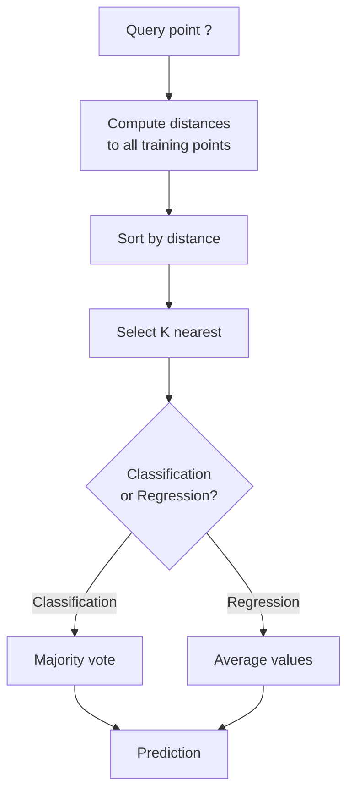
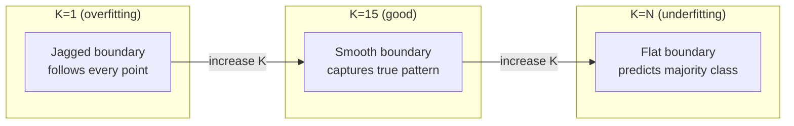
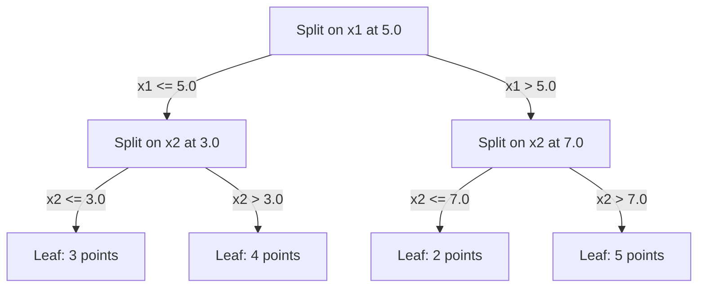

# K-Najbliższych Sąsiadów i Odległości

> Zapamiętaj wszystko. Przewiduj, patrząc na sąsiadów. Najprostszy algorytm, który faktycznie działa.

**Type:** Build
**Language:** Python
**Prerequisites:** Phase 1 (Lesson 14 Norms and Distances)
**Time:** ~90 minutes

## Learning Objectives

- Zaimplementuj klasyfikację i regresję KNN od podstaw z konfigurowalnym K i ważonym głosowaniem odległością
- Porównaj metryki odległości L1, L2, cosinusową i Minkowskiego oraz wybierz odpowiednią dla danego typu danych
- Wyjaśnij przekleństwo wymiarowości i zademonstruj, dlaczego KNN degraduje w wysokowymiarowych przestrzeniach
- Zbuduj KD-drzewo do efektywnego wyszukiwania najbliższych sąsiadów i przeanalizuj, kiedy przewyższa brute-force

## The Problem

Masz zbiór danych. Pojawia się nowy punkt danych. Musisz go sklasyfikować lub przewidzieć jego wartość. Zamiast uczyć się parametrów z danych (jak regresja liniowa czy SVM), po prostu znajdujesz K punktów treningowych najbliższych nowemu punktowi i pozwalasz im głosować.

To są K-najbliżsi sąsiedzi. Nie ma fazy treningowej. Nie ma parametrów do uczenia. Nie ma funkcji straty do minimalizowania. Przechowujesz cały zbiór treningowy i obliczasz odległości w czasie predykcji.

Brzmi zbyt prosto, żeby działać. Ale KNN jest zaskakująco konkurencyjny dla wielu problemów, zwłaszcza z małymi i średnimi zbiorami danych, a głębokie zrozumienie go ujawnia fundamentalne koncepcje: wybór metryki odległości (łącząc z Fazą 1 Lekcją 14), przekleństwo wymiarowości oraz różnicę między uczeniem leniwym a zachłannym.

KNN pojawia się też wszędzie we współczesnym AI, tylko pod innymi nazwami. Bazy danych wektorowych wykonują wyszukiwanie KNN na embeddingach. Generacja wspomagana retrievcją (RAG) znajduje K najbliższych fragmentów dokumentów. Systemy rekomendacyjne znajdują podobnych użytkowników lub przedmioty. Algorytm jest ten sam. Skala i struktury danych są inne.

## The Concept

### Jak działa KNN

Mając zbiór danych oznaczonych punktów i nowy punkt zapytania:

1. Oblicz odległość od zapytania do każdego punktu w zbiorze danych
2. Posortuj według odległości
3. Weź K najbliższych punktów
4. Dla klasyfikacji: głosowanie większościowe wśród K sąsiadów
5. Dla regresji: średnia (lub ważona średnia) wartości K sąsiadów



To cały algorytm. Bez dopasowywania. Bez gradientowego zejścia. Bez epok.

### Wybór K

K to pojedynczy hiperparametr. Kontroluje kompromis obciążenie-wariancja:

| K | Zachowanie |
|---|----------|
| K = 1 | Granica decyzyjna podąża za każdym punktem. Zerowy błąd treningowy. Wysoka wariancja. Przeucza się |
| Małe K (3-5) | Wrażliwe na lokalną strukturę. Może uchwycić złożone granice |
| Duże K | Gładsze granice. Bardziej odporne na szum. Może się niedouczać |
| K = N | Przewiduje klasę większościową dla każdego punktu. Maksymalne obciążenie |

Częstym punktem startowym jest K = sqrt(N) dla zbioru danych z N punktami. Używaj nieparzystego K dla klasyfikacji binarnej, aby uniknąć remisów.



### Metryki odległości

Funkcja odległości definiuje, co znaczy „blisko". Różne metryki dają różnych sąsiadów, różne predykcje.

**L2 (Euklidesowa)** to domyślna. Odległość w linii prostej.

```
d(a, b) = sqrt(sum((a_i - b_i)^2))
```

Wrażliwa na skalę cech. Zawsze standaryzuj cechy przed użyciem L2 z KNN.

**L1 (Manhattan)** sumuje bezwzględne różnice. Bardziej odporna na wartości odstające niż L2, ponieważ nie podnosi różnic do kwadratu.

```
d(a, b) = sum(|a_i - b_i|)
```

**Odległość cosinusowa** mierzy kąt między wektorami, ignorując wielkość. Niezbędna dla danych tekstowych i embeddingów.

```
d(a, b) = 1 - (a . b) / (||a|| * ||b||)
```

**Minkowski** uogólnia L1 i L2 z parametrem p.

```
d(a, b) = (sum(|a_i - b_i|^p))^(1/p)

p=1: Manhattan
p=2: Euklidesowa
p->inf: Czebyszewa (maksymalna bezwzględna różnica)
```

Której metryki użyć zależy od danych:

| Typ danych | Najlepsza metryka | Dlaczego |
|-----------|------------|-----|
| Cechy numeryczne, podobna skala | L2 (Euklidesowa) | Domyślna, działa dla danych przestrzennych |
| Cechy numeryczne, wartości odstające | L1 (Manhattan) | Odporna, nie wzmacnia dużych różnic |
| Embeddingi tekstowe | Cosinusowa | Wielkość to szum, kierunek to znaczenie |
| Wysokowymiarowe rzadkie | Cosinusowa lub L1 | L2 cierpi na przekleństwo wymiarowości |
| Mieszane typy | Niestandardowa odległość | Połącz metryki według typu cechy |

### Ważone KNN

Standardowy KNN daje równą wagę wszystkim K sąsiadom. Ale sąsiad w odległości 0,1 powinien mieć większe znaczenie niż ten w odległości 5,0.

**KNN ważony odległością** waży każdego sąsiada odwrotnie proporcjonalnie do odległości:

```
waga_i = 1 / (odległość_i + epsilon)

Dla klasyfikacji: ważone głosowanie
Dla regresji:     ważona średnia = sum(w_i * y_i) / sum(w_i)
```

Epsilon zapobiega dzieleniu przez zero, gdy punkt zapytania dokładnie pasuje do punktu treningowego.

Ważone KNN jest mniej wrażliwe na wybór K, ponieważ odlegli sąsiedzi wnoszą bardzo mało niezależnie od wartości K.

### Przekleństwo wymiarowości

Wydajność KNN degraduje w wysokich wymiarach. To nie jest luźne zmartwienie. To matematyczny fakt.

**Problem 1: odległości się zbiegają.** Wraz ze wzrostem wymiarowości, stosunek maksymalnej odległości do minimalnej odległości dąży do 1. Wszystkie punkty stają się równie „dalekie" od zapytania.

```
W d wymiarach, dla losowych jednostajnych punktów:

d=2:    max_odl / min_odl = bardzo różne
d=100:  max_odl / min_odl ~ 1,01
d=1000: max_odl / min_odl ~ 1,001

Gdy wszystkie odległości są prawie równe, „najbliższy" nie ma znaczenia.
```

**Problem 2: objętość eksploduje.** Aby uchwycić K sąsiadów w ustalonym ułamku danych, musisz rozszerzyć promień wyszukiwania, aby pokryć znacznie większą część przestrzeni cech. „Sąsiedztwo" w wysokich wymiarach obejmuje większość przestrzeni.

**Problem 3: narożniki dominują.** W jednostkowym hipersześcianie w d wymiarach, większość objętości jest skoncentrowana blisko narożników, a nie środka. Kula wpisana w sześcian zawiera znikomy ułamek objętości, gdy d rośnie.

Praktyczna konsekwencja: KNN działa dobrze do około 20-50 cech. Powyżej tego potrzebujesz redukcji wymiarowości (PCA, UMAP, t-SNE) przed zastosowaniem KNN, lub potrzebujesz struktur wyszukiwania opartych na drzewach, które wykorzystują wewnętrzną niższą wymiarowość danych.

### KD-drzewa: szybkie wyszukiwanie najbliższych sąsiadów

Brute-force KNN oblicza odległość od zapytania do każdego punktu treningowego. To O(n * d) na zapytanie. Dla dużych zbiorów danych jest to zbyt wolne.

KD-drzewo rekurencyjnie dzieli przestrzeń wzdłuż osi cech. Na każdym poziomie dzieli wzdłuż jednego wymiaru na wartości mediany.



Aby znaleźć najbliższego sąsiada, przejdź drzewo do liścia zawierającego zapytanie, a następnie cofnij się i sprawdź sąsiednie partycje tylko wtedy, gdy mogą zawierać bliższe punkty.

Średni czas zapytania: O(log n) dla niskich wymiarów. Ale KD-drzewa degradują do O(n) w wysokich wymiarach (d > 20), ponieważ cofanie się eliminuje coraz mniej gałęzi.

### Drzewa kulowe: lepsze dla umiarkowanych wymiarów

Drzewa kulowe dzielą dane na zagnieżdżone hipersfery zamiast pudeł wyrównanych do osi. Każdy węzeł definiuje kulę (środek + promień), która zawiera wszystkie punkty w tym poddrzewie.

Zalety w porównaniu z KD-drzewami:
- Działają lepiej w umiarkowanych wymiarach (do ~50)
- Obsługują strukturę niewyrównaną do osi
- Ciasniejsze objętości graniczne oznaczają, że więcej gałęzi jest odcinanych podczas wyszukiwania

Zarówno KD-drzewa, jak i drzewa kulowe to algorytmy dokładne. Dla prawdziwie wielkoskalowego wyszukiwania (miliony punktów, setki wymiarów) stosuje się metody przybliżonych najbliższych sąsiadów (HNSW, IVF, kwantyzacja produktowa). Są one omówione w Fazie 1 Lekcji 14.

### Uczenie leniwe vs uczenie zachłanne

KNN jest uczącym się leniwym: nie wykonuje żadnej pracy w czasie treningu, a całą pracę w czasie predykcji. Większość innych algorytmów (regresja liniowa, SVM, sieci neuronowe) to uczący się zachłanni: wykonują ciężkie obliczenia w czasie treningu, aby zbudować kompaktowy model, a następnie predykcje są szybkie.

| Aspekt | Leniwe (KNN) | Zachłanne (SVM, sieć neuronowa) |
|--------|------------|------------------------|
| Czas treningu | O(1) tylko przechowaj dane | O(n * epoki) |
| Czas predykcji | O(n * d) na zapytanie | O(d) lub O(parametry) |
| Pamięć przy predykcji | Przechowuje cały zbiór treningowy | Przechowuje tylko parametry modelu |
| Adaptacja do nowych danych | Dodawanie punktów natychmiast | Przetrenuj model |
| Granica decyzyjna | Niejawna, obliczana na bieżąco | Jawna, ustalona po treningu |

Uczenie leniwe jest idealne, gdy:
- Zbiór danych często się zmienia (dodawanie/usuwanie punktów bez przetrenowywania)
- Potrzebujesz predykcji dla bardzo niewielu zapytań
- Chcesz zerowego czasu treningu
- Zbiór danych jest wystarczająco mały, aby brute-force był szybki

### KNN dla regresji

Zamiast głosowania większościowego, KNN dla regresji uśrednia wartości docelowe K sąsiadów.

```
predykcja = (1/K) * sum(y_i dla i w K najbliższych sąsiadów)

Lub z ważeniem odległością:
predykcja = sum(w_i * y_i) / sum(w_i)
gdzie w_i = 1 / odległość_i
```

Regresja KNN produkuje fragmentami stałe (lub fragmentami gładkie z ważeniem) predykcje. Nie może ekstrapolować poza zakres danych treningowych. Jeśli docelowe wartości treningowe są wszystkie między 0 a 100, KNN nigdy nie przewidzi 200.

```figure
knn-smoothness
```

## Build It

### Step 1: Funkcje odległości

Zaimplementuj odległości L1, L2, cosinusową i Minkowskiego. Łączą się bezpośrednio z Fazą 1 Lekcją 14.

```python
import math

def l2_distance(a, b):
    return math.sqrt(sum((ai - bi) ** 2 for ai, bi in zip(a, b)))

def l1_distance(a, b):
    return sum(abs(ai - bi) for ai, bi in zip(a, b))

def cosine_distance(a, b):
    dot_val = sum(ai * bi for ai, bi in zip(a, b))
    norm_a = math.sqrt(sum(ai ** 2 for ai in a))
    norm_b = math.sqrt(sum(bi ** 2 for bi in b))
    if norm_a == 0 or norm_b == 0:
        return 1.0
    return 1.0 - dot_val / (norm_a * norm_b)

def minkowski_distance(a, b, p=2):
    if p == float('inf'):
        return max(abs(ai - bi) for ai, bi in zip(a, b))
    return sum(abs(ai - bi) ** p for ai, bi in zip(a, b)) ** (1 / p)
```

### Step 2: Klasyfikator i regresor KNN

Zbuduj pełne KNN z konfigurowalnym K, metryką odległości i opcjonalnym ważeniem odległością.

```python
class KNN:
    def __init__(self, k=5, distance_fn=l2_distance, weighted=False,
                 task="classification"):
        self.k = k
        self.distance_fn = distance_fn
        self.weighted = weighted
        self.task = task
        self.X_train = None
        self.y_train = None

    def fit(self, X, y):
        self.X_train = X
        self.y_train = y

    def predict(self, X):
        return [self._predict_one(x) for x in X]
```

### Step 3: KD-drzewo do efektywnego wyszukiwania

Zbuduj KD-drzewo od podstaw, które rekurencyjnie dzieli na medianie każdego wymiaru.

```python
class KDTree:
    def __init__(self, X, indices=None, depth=0):
        # Rekurencyjnie partycjonuj dane
        self.axis = depth % len(X[0])
        # Podziel na medianie bieżącej osi
        ...

    def query(self, point, k=1):
        # Przejdź do liścia, potem cofnij się
        ...
```

Zobacz `code/knn.py` po pełną implementację ze wszystkimi metodami pomocniczymi i demonstracjami.

### Step 4: Skalowanie cech

KNN wymaga skalowania cech, ponieważ odległości są wrażliwe na wielkości cech. Cecha w zakresie od 0 do 1000 będzie dominować nad cechą w zakresie od 0 do 1.

```python
def standardize(X):
    n = len(X)
    d = len(X[0])
    means = [sum(X[i][j] for i in range(n)) / n for j in range(d)]
    stds = [
        max(1e-10, (sum((X[i][j] - means[j]) ** 2 for i in range(n)) / n) ** 0.5)
        for j in range(d)
    ]
    return [[((X[i][j] - means[j]) / stds[j]) for j in range(d)] for i in range(n)], means, stds
```

## Use It

Z scikit-learn:

```python
from sklearn.neighbors import KNeighborsClassifier
from sklearn.preprocessing import StandardScaler
from sklearn.pipeline import Pipeline

clf = Pipeline([
    ("scaler", StandardScaler()),
    ("knn", KNeighborsClassifier(n_neighbors=5, metric="euclidean")),
])
clf.fit(X_train, y_train)
print(f"Accuracy: {clf.score(X_test, y_test):.4f}")
```

Scikit-learn automatycznie używa KD-drzew lub drzew kulowych, gdy zbiór danych jest wystarczająco duży, a wymiarowość wystarczająco niska. Dla danych wysokowymiarowych wraca do brute-force. Możesz to kontrolować za pomocą parametru `algorithm`.

Do wielkoskalowego wyszukiwania najbliższych sąsiadów (miliony wektorów) użyj FAISS, Annoy lub bazy danych wektorowych:

```python
import faiss

index = faiss.IndexFlatL2(dimension)
index.add(embeddings)
distances, indices = index.search(query_vectors, k=5)
```

## Exercises

1. Zaimplementuj klasyfikację KNN na 2-wymiarowym zbiorze danych z 3 klasami. Wykreśl granicę decyzyjną dla K=1, K=5, K=15 i K=N. Zaobserwuj przejście od przeuczenia do niedouczenia.

2. Wygeneruj 1000 losowych punktów w 2, 5, 10, 50, 100 i 500 wymiarach. Dla każdej wymiarowości oblicz stosunek maksymalnej odległości parami do minimalnej odległości parami. Wykreśl stosunek vs wymiarowość, aby zwizualizować przekleństwo wymiarowości.

3. Porównaj odległość L1, L2 i cosinusową dla KNN na problemie klasyfikacji tekstu (użyj wektorów TF-IDF). Która metryka daje najlepszą dokładność? Dlaczego cosinusowa wygrywa dla tekstu?

4. Zaimplementuj KD-drzewo i zmierz czas zapytania w porównaniu z brute-force dla zbiorów danych 1k, 10k i 100k punktów w 2D, 10D i 50D. Przy jakiej wymiarowości KD-drzewo przestaje być szybsze niż brute-force?

5. Zbuduj ważony regresor KNN dla y = sin(x) + szum. Porównaj go z nieważonym KNN dla K=3, 10, 30. Pokaż, że ważenie daje gładsze predykcje, zwłaszcza dla dużego K.

## Key Terms

| Termin | Co to naprawdę znaczy |
|------|----------------------|
| K-nearest neighbors | Algorytm nieparametryczny, który przewiduje, znajdując K najbliższych punktów treningowych do zapytania |
| Lazy learning | Brak obliczeń w czasie treningu. Cała praca odbywa się w czasie predykcji. KNN jest kanonicznym przykładem |
| Eager learning | Ciężkie obliczenia w czasie treningu w celu zbudowania kompaktowego modelu. Większość algorytmów ML jest zachłanna |
| Curse of dimensionality | W wysokich wymiarach odległości się zbiegają, a sąsiedztwa rozszerzają się, by pokryć większość przestrzeni, czyniąc KNN nieskutecznym |
| KD-tree | Drzewo binarne, które rekurencyjnie dzieli przestrzeń wzdłuż osi cech. Zapytania O(log n) w niskich wymiarach |
| Ball tree | Drzewo zagnieżdżonych hipersfer. Działa lepiej niż KD-drzewa w umiarkowanych wymiarach (do ~50) |
| Weighted KNN | Sąsiedzi ważeni odwrotnie proporcjonalnie do odległości. Bliżsi sąsiedzi mają większy wpływ na predykcję |
| Feature scaling | Normalizacja cech do porównywalnych zakresów. Wymagane dla metod opartych na odległości, takich jak KNN |
| Majority vote | Klasyfikacja przez zliczanie, która klasa jest najczęstsza wśród K sąsiadów |
| Brute force search | Obliczanie odległości do każdego punktu treningowego. O(n*d) na zapytanie. Dokładne, ale wolne dla dużego n |
| Approximate nearest neighbor | Algorytmy (HNSW, LSH, IVF), które znajdują przybliżone najbliższe punkty znacznie szybciej niż wyszukiwanie dokładne |
| Voronoi diagram | Podział przestrzeni, gdzie każdy region zawiera wszystkie punkty bliższe jednemu punktowi treningowemu niż jakiemukolwiek innemu. K=1 KNN tworzy granice Voronoi |

## Further Reading

- [Cover & Hart: Nearest Neighbor Pattern Classification (1967)](https://ieeexplore.ieee.org/document/1053964) - fundamentalna publikacja KNN dowodząca, że ma on współczynnik błędu co najwyżej dwukrotność optymalnego Bayesa
- [Friedman, Bentley, Finkel: An Algorithm for Finding Best Matches in Logarithmic Expected Time (1977)](https://dl.acm.org/doi/10.1145/355744.355745) - oryginalna publikacja o KD-drzewach
- [Beyer et al.: When Is "Nearest Neighbor" Meaningful? (1999)](https://link.springer.com/chapter/10.1007/3-540-49257-7_15) - formalna analiza przekleństwa wymiarowości dla najbliższych sąsiadów
- [scikit-learn Nearest Neighbors documentation](https://scikit-learn.org/stable/modules/neighbors.html) - praktyczny przewodnik z wyborem algorytmu
- [FAISS: A Library for Efficient Similarity Search](https://github.com/facebookresearch/faiss) - biblioteka Meta do wielomiliardowego przybliżonego wyszukiwania najbliższych sąsiadów