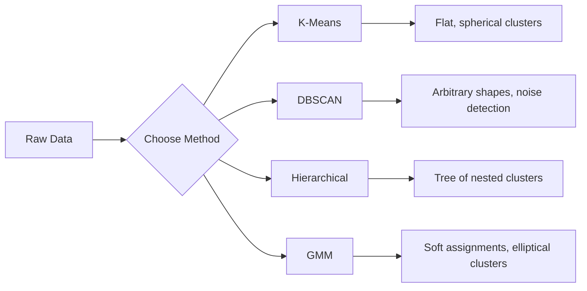

# Uczenie nienadzorowane

> Brak etykiet, brak nauczyciela. Algorytm samodzielnie znajduje strukturę.

**Type:** Build
**Languages:** Python
**Prerequisites:** Phase 1 (Norms & Distances, Probability & Distributions), Phase 2 Lessons 1-6
**Time:** ~90 minutes

## Learning Objectives

- Zaimplementuj K-Means, DBSCAN i modele mieszanin gaussowskich od podstaw i porównaj ich zachowanie podczas grupowania
- Oceń jakość klastrów za pomocą współczynnika sylwetki i metody łokcia, aby wybrać optymalne K
- Wyjaśnij, kiedy DBSCAN przewyższa K-Means i wskaż, który algorytm radzi sobie z klastrami niesferycznymi i odstającymi
- Zbuduj potok wykrywania anomalii przy użyciu metod grupowania, aby oznaczać punkty odbiegające od normalnych wzorców

## The Problem

Każda dotychczasowa lekcja ML zakładała dane z etykietami: „oto wejście, oto poprawna odpowiedź." W rzeczywistym świecie etykiety są drogie. Szpital ma miliony kart pacjentów, ale nikt ręcznie nie oznaczył każdej z nich kategorią choroby. Sklep e-commerce ma miliony sesji użytkowników, ale nikt ręcznie nie oznaczył segmentów klientów. Zespół ds. bezpieczeństwa ma logi sieciowe, ale nikt nie oznaczył każdej anomalii.

Uczenie nienadzorowane znajduje wzorce bez wskazywania, czego szukać. Grupuje podobne punkty danych, odkrywa ukryte struktury i wykrywa anomalie. Jeśli uczenie nadzorowane to nauka z podręcznika z kluczem odpowiedzi, to uczenie nienadzorowane to wpatrywanie się w surowe dane, aż wzorce same się ujawnią.

Haczyk: bez etykiet nie można bezpośrednio zmierzyć, co jest „poprawne" lub „niepoprawne." Potrzebne są inne narzędzia, aby ocenić, czy struktura znaleziona przez algorytm ma znaczenie.

## The Concept

### Grupowanie: Łączenie podobnych rzeczy

Grupowanie (klasteryzacja) przypisuje każdy punkt danych do grupy (klastra) tak, aby punkty w tej samej grupie były bardziej podobne do siebie niż do punktów w innych grupach. Pytanie zawsze brzmi: co oznacza „podobny?"



### K-Means: Koń roboczy

K-Means dzieli dane na dokładnie K klastrów. Każdy klaster ma centroid (swój środek masy), a każdy punkt należy do najbliższego centroidu.

Algorytm Lloyda:

1. Wybierz K losowych punktów jako początkowe centroidy
2. Przypisz każdy punkt danych do najbliższego centroidu
3. Przelicz każdy centroid jako średnią przypisanych do niego punktów
4. Powtarzaj kroki 2-3, aż przypisania przestaną się zmieniać

Funkcja celu (inercja) mierzy sumę kwadratów odległości każdego punktu od przypisanego centroidu. K-Means minimalizuje tę wartość, ale znajduje jedynie minimum lokalne. Różne inicjalizacje mogą dać różne wyniki.

### Wybór K

Dwie standardowe metody:

**Metoda łokcia:** Uruchom K-Means dla K = 1, 2, 3, ..., n. Wykreśl inercję względem K. Poszukaj „łokcia", gdzie dodawanie kolejnych klastrów przestaje znacząco zmniejszać inercję.

**Współczynnik sylwetki:** Dla każdego punktu zmierz, jak bardzo jest podobny do własnego klastra (a) w porównaniu do najbliższego innego klastra (b). Współczynnik sylwetki to (b - a) / max(a, b), w zakresie od -1 (zły klaster) do +1 (dobrze zgrupowany). Uśrednij dla wszystkich punktów, aby uzyskać globalny wynik.

### DBSCAN: Grupowanie oparte na gęstości

K-Means zakłada, że klastry są sferyczne i wymaga podania K z góry. DBSCAN nie robi żadnego z tych założeń. Znajduje klastry jako gęste regiony oddzielone rzadkimi regionami.

Dwa parametry:
- **eps**: promień sąsiedztwa
- **min_samples**: minimalna liczba punktów potrzebna do utworzenia gęstego regionu

Trzy typy punktów:
- **Punkt rdzeniowy**: ma co najmniej min_samples punktów w odległości eps
- **Punkt brzegowy**: znajduje się w odległości eps od punktu rdzeniowego, ale sam nie jest punktem rdzeniowym
- **Punkt szumowy**: ani rdzeniowy, ani brzegowy. Są to wartości odstające.

DBSCAN łączy punkty rdzeniowe, które są względem siebie w odległości eps, w ten sam klaster. Punkty brzegowe dołączają do klastra pobliskiego punktu rdzeniowego. Punkty szumowe nie należą do żadnego klastra.

Mocne strony: znajduje klastry o dowolnym kształcie, automatycznie określa liczbę klastrów, identyfikuje wartości odstające. Słabość: ma trudności z klastrami o zmiennej gęstości.

### Grupowanie hierarchiczne

Buduje drzewo (dendrogram) zagnieżdżonych klastrów.

Aglomeracyjne (oddolne):
1. Zacznij od każdego punktu jako osobnego klastra
2. Połącz dwa najbliższe klastry
3. Powtarzaj, aż pozostanie tylko jeden klaster
4. Przytnij dendrogram na żądanym poziomie, aby uzyskać K klastrów

„Bliskość" między klastrami można mierzyć jako:
- **Wiązanie pojedyncze**: minimalna odległość między dowolnymi dwoma punktami w dwóch klastrach
- **Wiązanie pełne**: maksymalna odległość między dowolnymi dwoma punktami
- **Wiązanie średnie**: średnia odległość między wszystkimi parami
- **Metoda Warda**: połączenie powodujące najmniejszy wzrost całkowitej wariancji wewnątrz klastra

### Modele mieszanin gaussowskich (GMM)

K-Means daje przyporządkowania twarde: każdy punkt należy do dokładnie jednego klastra. GMM daje przyporządkowania miękkie: każdy punkt ma prawdopodobieństwo przynależności do każdego klastra.

GMM zakłada, że dane są generowane z mieszaniny K rozkładów gaussowskich, każdy z własną średnią i kowariancją. Algorytm Expectation-Maximization (EM) naprzemiennie wykonuje:

- **Krok E (Expectation)**: oblicz prawdopodobieństwo, że każdy punkt należy do każdej z gaussowskich składowych
- **Krok M (Maximization)**: zaktualizuj średnią, kowariancję i wagę mieszaniny każdej składowej gaussowskiej tak, aby zmaksymalizować wiarygodność danych

GMM może modelować eliptyczne klastry (nie tylko sferyczne jak K-Means) i naturalnie radzi sobie z nakładającymi się klastrami.

### Kiedy używać której metody

| Metoda | Najlepsza do | Unikaj gdy |
|--------|----------|------------|
| K-Means | Duże zbiory danych, sferyczne klastry, znane K | Nieregularne kształty, obecność wartości odstających |
| DBSCAN | Nieznane K, dowolne kształty, wykrywanie wartości odstających | Zmienna gęstość, bardzo wysokie wymiary |
| Hierarchiczne | Małe zbiory danych, potrzeba dendrogramu, nieznane K | Duże zbiory danych (pamięć O(n^2)) |
| GMM | Nakładające się klastry, potrzebne miękkie przyporządkowania | Bardzo duże zbiory danych, zbyt wiele wymiarów |

### Wykrywanie anomalii za pomocą grupowania

Grupowanie naturalnie wspiera wykrywanie anomalii:
- **K-Means**: punkty daleko od dowolnego centroidu są anomaliami
- **DBSCAN**: punkty szumowe są z definicji anomaliami
- **GMM**: punkty o niskim prawdopodobieństwie we wszystkich rozkładach gaussowskich są anomaliami

```figure
kmeans-step
```

## Build It

### Step 1: K-Means from scratch

```python
import math
import random


def euclidean_distance(a, b):
    return math.sqrt(sum((ai - bi) ** 2 for ai, bi in zip(a, b)))


def kmeans(data, k, max_iterations=100, seed=42):
    random.seed(seed)
    n_features = len(data[0])

    centroids = random.sample(data, k)

    for iteration in range(max_iterations):
        clusters = [[] for _ in range(k)]
        assignments = []

        for point in data:
            distances = [euclidean_distance(point, c) for c in centroids]
            nearest = distances.index(min(distances))
            clusters[nearest].append(point)
            assignments.append(nearest)

        new_centroids = []
        for cluster in clusters:
            if len(cluster) == 0:
                new_centroids.append(random.choice(data))
                continue
            centroid = [
                sum(point[j] for point in cluster) / len(cluster)
                for j in range(n_features)
            ]
            new_centroids.append(centroid)

        if all(
            euclidean_distance(old, new) < 1e-6
            for old, new in zip(centroids, new_centroids)
        ):
            print(f"  Converged at iteration {iteration + 1}")
            break

        centroids = new_centroids

    return assignments, centroids
```

### Step 2: Elbow method and silhouette score

```python
def compute_inertia(data, assignments, centroids):
    total = 0.0
    for point, cluster_id in zip(data, assignments):
        total += euclidean_distance(point, centroids[cluster_id]) ** 2
    return total


def silhouette_score(data, assignments):
    n = len(data)
    if n < 2:
        return 0.0

    clusters = {}
    for i, c in enumerate(assignments):
        clusters.setdefault(c, []).append(i)

    if len(clusters) < 2:
        return 0.0

    scores = []
    for i in range(n):
        own_cluster = assignments[i]
        own_members = [j for j in clusters[own_cluster] if j != i]

        if len(own_members) == 0:
            scores.append(0.0)
            continue

        a = sum(euclidean_distance(data[i], data[j]) for j in own_members) / len(own_members)

        b = float("inf")
        for cluster_id, members in clusters.items():
            if cluster_id == own_cluster:
                continue
            avg_dist = sum(euclidean_distance(data[i], data[j]) for j in members) / len(members)
            b = min(b, avg_dist)

        if max(a, b) == 0:
            scores.append(0.0)
        else:
            scores.append((b - a) / max(a, b))

    return sum(scores) / len(scores)


def find_best_k(data, max_k=10):
    print("Elbow method:")
    inertias = []
    for k in range(1, max_k + 1):
        assignments, centroids = kmeans(data, k)
        inertia = compute_inertia(data, assignments, centroids)
        inertias.append(inertia)
        print(f"  K={k}: inertia={inertia:.2f}")

    print("\nSilhouette scores:")
    for k in range(2, max_k + 1):
        assignments, centroids = kmeans(data, k)
        score = silhouette_score(data, assignments)
        print(f"  K={k}: silhouette={score:.4f}")

    return inertias
```

### Step 3: DBSCAN from scratch

```python
def dbscan(data, eps, min_samples):
    n = len(data)
    labels = [-1] * n
    cluster_id = 0

    def region_query(point_idx):
        neighbors = []
        for i in range(n):
            if euclidean_distance(data[point_idx], data[i]) <= eps:
                neighbors.append(i)
        return neighbors

    visited = [False] * n

    for i in range(n):
        if visited[i]:
            continue
        visited[i] = True

        neighbors = region_query(i)

        if len(neighbors) < min_samples:
            labels[i] = -1
            continue

        labels[i] = cluster_id
        seed_set = list(neighbors)
        seed_set.remove(i)

        j = 0
        while j < len(seed_set):
            q = seed_set[j]

            if not visited[q]:
                visited[q] = True
                q_neighbors = region_query(q)
                if len(q_neighbors) >= min_samples:
                    for nb in q_neighbors:
                        if nb not in seed_set:
                            seed_set.append(nb)

            if labels[q] == -1:
                labels[q] = cluster_id

            j += 1

        cluster_id += 1

    return labels
```

### Step 4: Gaussian Mixture Model (EM algorithm)

```python
def gmm(data, k, max_iterations=100, seed=42):
    random.seed(seed)
    n = len(data)
    d = len(data[0])

    indices = random.sample(range(n), k)
    means = [list(data[i]) for i in indices]
    variances = [1.0] * k
    weights = [1.0 / k] * k

    def gaussian_pdf(x, mean, variance):
        d = len(x)
        coeff = 1.0 / ((2 * math.pi * variance) ** (d / 2))
        exponent = -sum((xi - mi) ** 2 for xi, mi in zip(x, mean)) / (2 * variance)
        return coeff * math.exp(max(exponent, -500))

    for iteration in range(max_iterations):
        responsibilities = []
        for i in range(n):
            probs = []
            for j in range(k):
                probs.append(weights[j] * gaussian_pdf(data[i], means[j], variances[j]))
            total = sum(probs)
            if total == 0:
                total = 1e-300
            responsibilities.append([p / total for p in probs])

        old_means = [list(m) for m in means]

        for j in range(k):
            r_sum = sum(responsibilities[i][j] for i in range(n))
            if r_sum < 1e-10:
                continue

            weights[j] = r_sum / n

            for dim in range(d):
                means[j][dim] = sum(
                    responsibilities[i][j] * data[i][dim] for i in range(n)
                ) / r_sum

            variances[j] = sum(
                responsibilities[i][j]
                * sum((data[i][dim] - means[j][dim]) ** 2 for dim in range(d))
                for i in range(n)
            ) / (r_sum * d)
            variances[j] = max(variances[j], 1e-6)

        shift = sum(
            euclidean_distance(old_means[j], means[j]) for j in range(k)
        )
        if shift < 1e-6:
            print(f"  GMM converged at iteration {iteration + 1}")
            break

    assignments = []
    for i in range(n):
        assignments.append(responsibilities[i].index(max(responsibilities[i])))

    return assignments, means, weights, responsibilities
```

### Step 5: Generate test data and run everything

```python
def make_blobs(centers, n_per_cluster=50, spread=0.5, seed=42):
    random.seed(seed)
    data = []
    true_labels = []
    for label, (cx, cy) in enumerate(centers):
        for _ in range(n_per_cluster):
            x = cx + random.gauss(0, spread)
            y = cy + random.gauss(0, spread)
            data.append([x, y])
            true_labels.append(label)
    return data, true_labels


def make_moons(n_samples=200, noise=0.1, seed=42):
    random.seed(seed)
    data = []
    labels = []
    n_half = n_samples // 2
    for i in range(n_half):
        angle = math.pi * i / n_half
        x = math.cos(angle) + random.gauss(0, noise)
        y = math.sin(angle) + random.gauss(0, noise)
        data.append([x, y])
        labels.append(0)
    for i in range(n_half):
        angle = math.pi * i / n_half
        x = 1 - math.cos(angle) + random.gauss(0, noise)
        y = 1 - math.sin(angle) - 0.5 + random.gauss(0, noise)
        data.append([x, y])
        labels.append(1)
    return data, labels


if __name__ == "__main__":
    centers = [[2, 2], [8, 3], [5, 8]]
    data, true_labels = make_blobs(centers, n_per_cluster=50, spread=0.8)

    print("=== K-Means on 3 blobs ===")
    assignments, centroids = kmeans(data, k=3)
    print(f"  Centroids: {[[round(c, 2) for c in cent] for cent in centroids]}")
    sil = silhouette_score(data, assignments)
    print(f"  Silhouette score: {sil:.4f}")

    print("\n=== Elbow Method ===")
    find_best_k(data, max_k=6)

    print("\n=== DBSCAN on 3 blobs ===")
    db_labels = dbscan(data, eps=1.5, min_samples=5)
    n_clusters = len(set(db_labels) - {-1})
    n_noise = db_labels.count(-1)
    print(f"  Found {n_clusters} clusters, {n_noise} noise points")

    print("\n=== GMM on 3 blobs ===")
    gmm_assignments, gmm_means, gmm_weights, _ = gmm(data, k=3)
    print(f"  Means: {[[round(m, 2) for m in mean] for mean in gmm_means]}")
    print(f"  Weights: {[round(w, 3) for w in gmm_weights]}")
    gmm_sil = silhouette_score(data, gmm_assignments)
    print(f"  Silhouette score: {gmm_sil:.4f}")

    print("\n=== DBSCAN on moons (non-spherical clusters) ===")
    moon_data, moon_labels = make_moons(n_samples=200, noise=0.1)
    moon_db = dbscan(moon_data, eps=0.3, min_samples=5)
    n_moon_clusters = len(set(moon_db) - {-1})
    n_moon_noise = moon_db.count(-1)
    print(f"  Found {n_moon_clusters} clusters, {n_moon_noise} noise points")

    print("\n=== K-Means on moons (will fail to separate) ===")
    moon_km, moon_centroids = kmeans(moon_data, k=2)
    moon_sil = silhouette_score(moon_data, moon_km)
    print(f"  Silhouette score: {moon_sil:.4f}")
    print("  K-Means splits moons poorly because they are not spherical")

    print("\n=== Anomaly detection with DBSCAN ===")
    anomaly_data = list(data)
    anomaly_data.append([20.0, 20.0])
    anomaly_data.append([-5.0, -5.0])
    anomaly_data.append([15.0, 0.0])
    anomaly_labels = dbscan(anomaly_data, eps=1.5, min_samples=5)
    anomalies = [
        anomaly_data[i]
        for i in range(len(anomaly_labels))
        if anomaly_labels[i] == -1
    ]
    print(f"  Detected {len(anomalies)} anomalies")
    for a in anomalies[-3:]:
        print(f"    Point {[round(v, 2) for v in a]}")
```

## Use It

W scikit-learn te same algorytmy to jednolinijkowce:

```python
from sklearn.cluster import KMeans, DBSCAN, AgglomerativeClustering
from sklearn.mixture import GaussianMixture
from sklearn.metrics import silhouette_score as sklearn_silhouette

km = KMeans(n_clusters=3, random_state=42).fit(data)
db = DBSCAN(eps=1.5, min_samples=5).fit(data)
agg = AgglomerativeClustering(n_clusters=3).fit(data)
gmm_model = GaussianMixture(n_components=3, random_state=42).fit(data)
```

Wersje od podstaw pokazują dokładnie, co obliczają te biblioteki. K-Means iteruje między przypisywaniem a przeliczaniem. DBSCAN rozrasta klastry z gęstych zarodków. GMM naprzemiennie wykonuje kroki estymacji i maksymalizacji. Wersje biblioteczne dodają stabilność numeryczną, inteligentniejszą inicjalizację (K-Means++) i akcelerację GPU, ale podstawowa logika jest taka sama.

## Ship It

Ta lekcja dostarcza działające implementacje K-Means, DBSCAN i GMM od podstaw. Kod grupowania może być ponownie wykorzystany jako podstawa dla bardziej zaawansowanych metod nienadzorowanych.

## Exercises

1. Zaimplementuj inicjalizację K-Means++: zamiast wybierać losowe centroidy, wybierz pierwszy losowo, a każdy kolejny centroid z prawdopodobieństwem proporcjonalnym do kwadratu jego odległości od najbliższego istniejącego centroidu. Porównaj szybkość zbieżności z inicjalizacją losową.
2. Dodaj aglomeracyjne grupowanie hierarchiczne do kodu. Zaimplementuj metodę Warda i wygeneruj dendrogram (jako zagnieżdżoną listę połączeń). Przytnij go na różnych poziomach i porównaj wyniki z K-Means.
3. Zbuduj prosty potok wykrywania anomalii: uruchom DBSCAN i GMM na tych samych danych, oznacz punkty, co do których obie metody są zgodne, że są wartościami odstającymi (szum w DBSCAN, niskie prawdopodobieństwo w GMM). Zmierz pokrywanie się i omów, kiedy metody są niezgodne.

## Key Terms

| Term | What people say | What it actually means |
|------|----------------|----------------------|
| Grupowanie (klasteryzacja) | „Grupowanie podobnych rzeczy" | Partycjonowanie danych na podzbiory, w których podobieństwo wewnątrz grupy przewyższa podobieństwo między grupami, mierzone określoną metryką odległości |
| Centroid | „Środek klastra" | Średnia wszystkich punktów przypisanych do klastra; używany przez K-Means jako reprezentant klastra |
| Inercja | „Jak ścisłe są klastry" | Suma kwadratów odległości każdego punktu od przypisanego centroidu; niższa wartość oznacza większą ścisłość |
| Współczynnik sylwetki | „Jak dobrze rozdzielone są klastry" | Dla każdego punktu (b - a) / max(a, b), gdzie a to średnia odległość wewnątrz klastra, a b to średnia odległość do najbliższego klastra |
| Punkt rdzeniowy | „Punkt w gęstym regionie" | Punkt mający co najmniej min_samples sąsiadów w odległości eps, w DBSCAN |
| Algorytm EM | „Miękki K-Means" | Expectation-Maximization: iteracyjne obliczanie prawdopodobieństw przynależności (krok E) i aktualizacja parametrów rozkładu (krok M) |
| Dendrogram | „Drzewo klastrów" | Diagram drzewiasty pokazujący kolejność i odległość, w jakiej klastry zostały połączone w grupowaniu hierarchicznym |
| Anomalia | „Wartość odstająca" | Punkt danych, który nie spełnia oczekiwanego wzorca, identyfikowany jako szum przez DBSCAN lub jako niskie prawdopodobieństwo przez GMM |

## Further Reading

- [Stanford CS229 - Unsupervised Learning](https://cs229.stanford.edu/notes2022fall/main_notes.pdf) - notatki Andrew Ng z wykładów o grupowaniu i EM
- [scikit-learn Clustering Guide](https://scikit-learn.org/stable/modules/clustering.html) - praktyczne porównanie wszystkich algorytmów grupowania z przykładami wizualnymi
- [DBSCAN original paper (Ester et al., 1996)](https://www.aaai.org/Papers/KDD/1996/KDD96-037.pdf) - artykuł, który wprowadził grupowanie oparte na gęstości