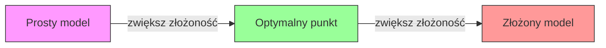
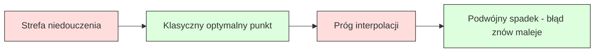
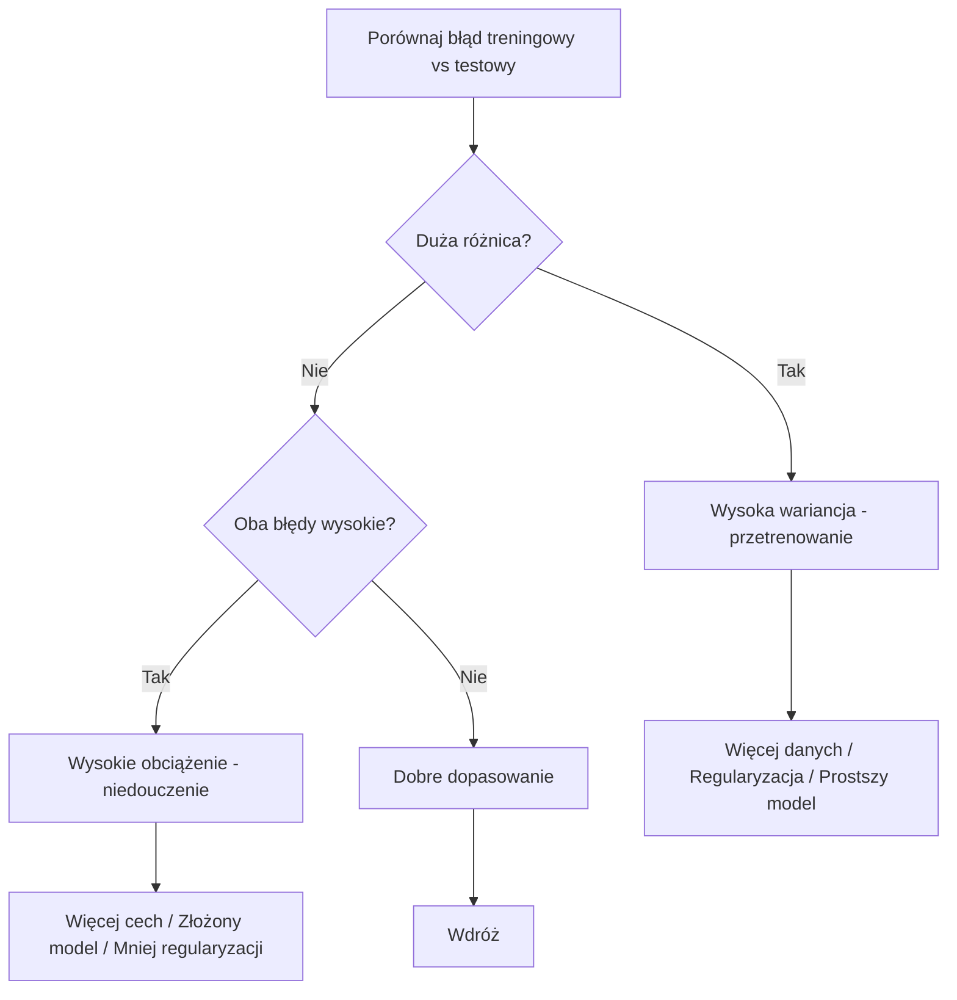
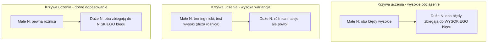
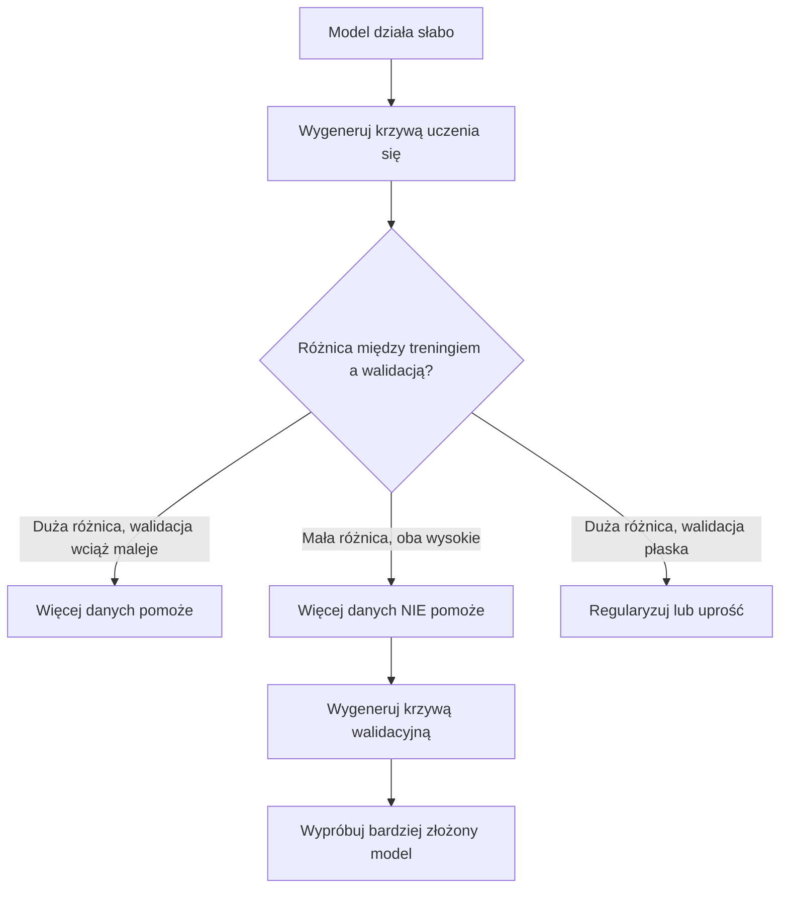

# Kompromis błąd-wariancja (Bias-Variance Tradeoff)

> Każdy błąd modelu pochodzi z jednego z trzech źródeł: obciążenia (bias), wariancji lub szumu. Możesz kontrolować tylko dwa pierwsze.

**Type:** Learn
**Language:** Python
**Prerequisites:** Phase 2, Lessons 01-09 (ML basics, regression, classification, evaluation)
**Time:** ~75 minutes

## Learning Objectives

- Wyprowadzić dekompozycję błędu przewidywania na obciążenie i wariancję oraz wyjaśnić rolę szumu nieredukowalnego
- Diagnozować, czy model cierpi na wysokie obciążenie czy wysoką wariancję na podstawie wzorców błędu na zbiorze treningowym i testowym
- Wyjaśnić, jak techniki regularyzacji (L1, L2, dropout, wczesne zatrzymywanie) wymieniają obciążenie na wariancję
- Zaimplementować eksperymenty wizualizujące kompromis obciążenie-wariancja dla modeli o rosnącej złożoności

## The Problem

Wytrenowałeś model. Ma pewien błąd na danych testowych. Skąd pochodzi ten błąd?

Jeśli twój model jest zbyt prosty (regresja liniowa na zakrzywionym zbiorze danych), będzie konsekwentnie pomijał prawdziwy wzorzec. To jest obciążenie. Jeśli twój model jest zbyt złożony (wielomian stopnia 20 na 15 punktach danych), dopasuje się idealnie do danych treningowych, ale da radykalnie różne przewidywania na nowych danych. To jest wariancja.

Nie możesz zminimalizować obu jednocześnie przy ustalonej pojemności modelu. Zmniejsz obciążenie, a wariancja wzrośnie. Zmniejsz wariancję, a obciążenie wzrośnie. Zrozumienie tego kompromisu to najważniejsza umiejętność diagnostyczna w uczeniu maszynowym. Mówi ci, czy zwiększyć złożoność modelu, czy ją zmniejszyć, czy zdobyć więcej danych, czy inżynierować lepsze cechy, czy regularyzować bardziej, czy mniej.

## The Concept

### Obciążenie (Bias): Błąd systematyczny

Obciążenie mierzy, jak bardzo średnia przewidywania twojego modelu odbiega od prawdziwej wartości. Gdybyś trenował ten sam model na wielu różnych zbiorach treningowych pochodzących z tego samego rozkładu i uśrednił przewidywania, obciążenie to różnica między tą średnią a prawdą.

Wysokie obciążenie oznacza, że model jest zbyt sztywny, aby uchwycić rzeczywisty wzorzec. Linia prosta dopasowana do paraboli zawsze będzie pomijać krzywiznę, niezależnie od tego, ile danych jej dasz. To jest niedouczenie (underfitting).

```
Wysokie obciążenie (niedouczenie):
  Model zawsze przewiduje mniej więcej to samo, ale błędne.
  Błąd treningowy: WYSOKI
  Błąd testowy: WYSOKI
  Różnica między nimi: MAŁA
```

### Wariancja: Wrażliwość na dane treningowe

Wariancja mierzy, jak bardzo zmieniają się twoje przewidywania, gdy trenujesz na różnych podzbiorach danych. Jeśli małe zmiany w zbiorze treningowym powodują duże zmiany w modelu, wariancja jest wysoka.

Wysoka wariancja oznacza, że model dopasowuje się do szumu w danych treningowych, a nie do rzeczywistego sygnału. Wielomian stopnia 20 przejdzie przez każdy punkt treningowy, ale będzie oscylował dziko między nimi. To jest przetrenowanie (overfitting).

```
Wysoka wariancja (przetrenowanie):
  Model idealnie dopasowuje się do danych treningowych, ale zawodzi na nowych danych.
  Błąd treningowy: NISKI
  Błąd testowy: WYSOKI
  Różnica między nimi: DUŻA
```

### Dekompozycja

Dla dowolnego punktu x, oczekiwany błąd przewidywania przy kwadracie błędu rozkłada się dokładnie:

```
Oczekiwany Błąd = Obciążenie^2 + Wariancja + Szum Nieredukowalny

gdzie:
  Obciążenie^2 = (E[f_hat(x)] - f(x))^2
  Wariancja    = E[(f_hat(x) - E[f_hat(x)])^2]
  Szum         = E[(y - f(x))^2]             (sigma^2)
```

- `f(x)` to prawdziwa funkcja
- `f_hat(x)` to przewidywanie twojego modelu
- `E[...]` to wartość oczekiwana po różnych zbiorach treningowych
- `y` to zaobserwowana etykieta (prawdziwa funkcja plus szum)

Składnik szumu jest nieredukowalny. Żaden model nie może osiągnąć lepszego wyniku niż sigma^2 na danych zaszumionych. Twoim zadaniem jest znalezienie właściwej równowagi między obciążeniem^2 a wariancją.

### Złożoność modelu a błąd



Klasyczna krzywa w kształcie litery U:

| Złożoność | Obciążenie | Wariancja | Błąd całkowity |
|-----------|------------|-----------|----------------|
| Zbyt niska | WYSOKIE | NISKA | WYSOKI (niedouczenie) |
| W sam raz | UMIARKOWANE | UMIARKOWANA | NAJNIŻSZY |
| Zbyt wysoka | NISKIE | WYSOKA | WYSOKI (przetrenowanie) |

### Regularyzacja jako kontrola obciążenie-wariancja

Regularyzacja celowo zwiększa obciążenie, aby zmniejszyć wariancję. Ogranicza model, aby nie mógł gonić za szumem.

- **L2 (Ridge):** Ściska wszystkie wagi w kierunku zera. Zachowuje wszystkie cechy, ale zmniejsza ich wpływ.
- **L1 (Lasso):** Zeruje niektóre wagi. Dokonuje selekcji cech.
- **Dropout:** Losowo wyłącza neurony podczas treningu. Wymusza nadmiarowe reprezentacje.
- **Wczesne zatrzymywanie:** Zatrzymuje trening, zanim model w pełni dopasuje się do danych treningowych.

Siła regularyzacji (lambda, współczynnik dropout, liczba epok) bezpośrednio kontroluje, gdzie znajdujesz się na krzywej obciążenie-wariancja. Więcej regularyzacji oznacza więcej obciążenia, mniej wariancji.

### Podwójny spadek (Double Descent): Nowoczesna perspektywa

Klasyczna teoria mówi: po optymalnym punkcie większa złożoność zawsze szkodzi. Jednak badania od 2019 roku pokazały coś zaskakującego. Jeśli będziesz zwiększać pojemność modelu daleko poza próg interpolacji (gdzie model ma wystarczająco parametrów, aby idealnie dopasować dane treningowe), błąd testowy może ponownie spaść.



To zjawisko "podwójnego spadku" wyjaśnia, dlaczego masywnie przeparametryzowane sieci neuronowe (z dużo większą liczbą parametrów niż przykładów treningowych) wciąż dobrze generalizują. Klasyczny kompromis obciążenie-wariancja nie jest błędny, ale jest niekompletny dla nowoczesnego reżimu.

Kluczowe obserwacje dotyczące podwójnego spadku:
- Występuje w modelach liniowych, drzewach decyzyjnych i sieciach neuronowych
- Więcej danych może wręcz zaszkodzić w regionie interpolacji (próbkowy podwójny spadek)
- Więcej epok treningowych również może go wywołać (epokowy podwójny spadek)
- Regularyzacja wygładza szczyt, ale go nie eliminuje

Dlaczego tak się dzieje? Przy progu interpolacji model ma dokładnie tyle pojemności, aby dopasować wszystkie punkty treningowe. Jest zmuszony do bardzo specyficznego rozwiązania, które przechodzi przez każdy punkt, a małe perturbacje w danych powodują duże zmiany w dopasowaniu. To tutaj wariancja osiąga szczyt. Po przekroczeniu progu model ma wiele możliwych rozwiązań, które idealnie pasują do danych. Algorytm uczący (np. gradient prosty z domyślną regularyzacją) wybiera zwykle to najprostsze. To domyślne skłanianie się ku prostym rozwiązaniom sprawia, że przeparametryzowane modele generalizują.

| Reżim | Parametry vs próbki | Zachowanie |
|-------|---------------------|------------|
| Niedoparametryzowany | p << n | Klasyczny kompromis ma zastosowanie |
| Próg interpolacji | p ~ n | Wariancja osiąga szczyt, błąd testowy skacze |
| Przeparametryzowany | p >> n | Wchodzi domyślna regularyzacja, błąd testowy spada |

Dla praktycznych celów: jeśli używasz sieci neuronowych lub dużych zespołów drzew, nie zatrzymuj się na progu interpolacji. Albo pozostań znacznie poniżej niego (z jawną regularyzacją), albo idź znacznie powyżej. Najgorsze miejsce to być tuż przy progu.

### Diagnozowanie modelu



| Objaw | Diagnoza | Naprawa |
|-------|----------|---------|
| Wysoki błąd treningowy, wysoki błąd testowy | Obciążenie | Więcej cech, złożony model, mniej regularyzacji |
| Niski błąd treningowy, wysoki błąd testowy | Wariancja | Więcej danych, regularyzacja, prostszy model, dropout |
| Niski błąd treningowy, niski błąd testowy | Dobre dopasowanie | Wdróż |
| Błąd treningowy maleje, błąd testowy rośnie | Postępujące przetrenowanie | Wczesne zatrzymywanie |

### Praktyczne strategie

**Gdy problemem jest obciążenie:**
- Dodaj cechy wielomianowe lub interakcyjne
- Użyj bardziej elastycznego modelu (zespół drzew zamiast liniowego)
- Zmniejsz siłę regularyzacji
- Trenuj dłużej (jeśli jeszcze nie zbiegło)

**Gdy problemem jest wariancja:**
- Zdobądź więcej danych treningowych
- Użyj baggingu (lasy losowe)
- Zwiększ regularyzację (wyższa lambda, więcej dropoutu)
- Selekcja cech (usuń zaszumione cechy)
- Użyj walidacji krzyżowej, aby wykryć to wcześnie

### Metody zespołowe a redukcja wariancji

Metody zespołowe są najbardziej praktycznym narzędziem do walki z wariancją.

**Bagging (Bootstrap Aggregating)** trenuje wiele modeli na różnych próbkach bootstrapowych danych treningowych, a następnie uśrednia ich przewidywania. Każdy indywidualny model ma wysoką wariancję, ale średnia ma znacznie niższą wariancję. Lasy losowe to bagging zastosowany do drzew decyzyjnych.

Dlaczego to działa matematycznie: jeśli uśrednisz N niezależnych przewidywań, każde z wariancją sigma^2, wariancja średniej wynosi sigma^2 / N. Modele nie są w pełni niezależne (wszystkie widzą podobne dane), więc redukcja jest mniejsza niż 1/N, ale wciąż znacząca.

**Boosting** redukuje obciążenie, budując modele sekwencyjnie, gdzie każdy nowy model koncentruje się na błędach dotychczasowego zespołu. Gradient boosting i AdaBoost to główne przykłady. Boosting może się przetrenować, jeśli dodasz zbyt wiele modeli, więc potrzebujesz wczesnego zatrzymywania lub regularyzacji.

| Metoda | Efekt główny | Zmiana obciążenia | Zmiana wariancji |
|--------|-------------|-------------------|------------------|
| Bagging | Redukuje wariancję | Brak zmiany | Spadek |
| Boosting | Redukuje obciążenie | Spadek | Może wzrosnąć |
| Stacking | Redukuje oba | Zależy od meta-ucznia | Zależy od modeli bazowych |
| Dropout | Niejawny bagging | Niewielki wzrost | Spadek |

**Praktyczna zasada:** jeśli twój model bazowy ma wysoką wariancję (głębokie drzewa, wielomiany wysokiego stopnia), użyj baggingu. Jeśli twój model bazowy ma wysokie obciążenie (płytkie pniaki, proste modele liniowe), użyj boostingu.

### Krzywe uczenia się

Krzywe uczenia się przedstawiają błąd treningowy i walidacyjny w funkcji rozmiaru zbioru treningowego. Są najbardziej praktycznym narzędziem diagnostycznym, jakie masz. W przeciwieństwie do pojedynczego porównania trening/test, krzywe uczenia się pokazują trajektorię twojego modelu i mówią, czy więcej danych pomoże.



Jak je odczytywać:

| Scenariusz | Błąd treningowy | Błąd walidacyjny | Różnica | Co oznacza | Co robić |
|-----------|----------------|------------------|---------|------------|----------|
| Wysokie obciążenie | Wysoki | Wysoki | Mała | Model nie może uchwycić wzorca | Więcej cech, złożony model, mniej regularyzacji |
| Wysoka wariancja | Niski | Wysoki | Duża | Model zapamiętuje dane treningowe | Więcej danych, regularyzacja, prostszy model |
| Dobre dopasowanie | Umiarkowany | Umiarkowany | Mała | Model dobrze generalizuje | Wdróż |
| Wysoka wariancja, poprawa | Niski | Maleje z większą ilością danych | Kurczy się | Problem wariancji, który dane mogą naprawić | Zbierz więcej danych |
| Wysokie obciążenie, płasko | Wysoki | Wysoki i płaski | Mała i płaska | Więcej danych NIE pomoże | Zmień architekturę modelu |

Kluczowy wgląd: jeśli obie krzywe się wypłaszczyły, różnica jest mała, ale oba błędy są wysokie, więcej danych jest bezużyteczne. Potrzebujesz lepszego modelu. Jeśli różnica jest duża i wciąż się kurczy, więcej danych pomoże.

### Jak generować krzywe uczenia się

Są dwa podejścia:

**Podejście 1: Zmieniaj rozmiar zbioru treningowego, stały model.** Utrzymuj model i hiperparametry stałe. Trenuj na coraz większych podzbiorach danych treningowych. Mierz błąd treningowy i walidacyjny przy każdym rozmiarze. To jest standardowa krzywa uczenia się.

**Podejście 2: Zmieniaj złożoność modelu, stałe dane.** Utrzymuj dane stałe. Przeskanuj parametr złożoności (stopień wielomianu, głębokość drzewa, liczba warstw). Mierz błąd treningowy i walidacyjny przy każdej złożoności. To jest krzywa walidacyjna i pokazuje bezpośrednio kompromis obciążenie-wariancja.

Oba podejścia się uzupełniają. Pierwsze mówi, czy więcej danych pomoże. Drugie mówi, czy inny model pomoże. Przeprowadź oba przed podjęciem decyzji o następnym kroku.



```figure
bias-variance
```

## Build It

Kod w `code/bias_variance.py` przeprowadza pełny eksperyment dekompozycji obciążenie-wariancja. Oto podejście krok po kroku.

### Step 1: Generowanie syntetycznych danych ze znanej funkcji

Używamy `f(x) = sin(1.5x) + 0.5x` z szumem gaussowskim. Znajomość prawdziwej funkcji pozwala nam obliczyć dokładne obciążenie i wariancję.

```python
def true_function(x):
    return np.sin(1.5 * x) + 0.5 * x

def generate_data(n_samples=30, noise_std=0.5, x_range=(-3, 3), seed=None):
    rng = np.random.RandomState(seed)
    x = rng.uniform(x_range[0], x_range[1], n_samples)
    y = true_function(x) + rng.normal(0, noise_std, n_samples)
    return x, y
```

### Step 2: Próbkowanie bootstrapowe i dopasowanie wielomianu

Dla każdego stopnia wielomianu pobieramy wiele bootstrapowych zbiorów treningowych, dopasowujemy wielomian i zapisujemy przewidywania na ustalonej siatce testowej. Daje nam to rozkład przewidywań w każdym punkcie testowym.

```python
def fit_polynomial(x_train, y_train, degree, lam=0.0):
    X = np.column_stack([x_train ** d for d in range(degree + 1)])
    if lam > 0:
        penalty = lam * np.eye(X.shape[1])
        penalty[0, 0] = 0
        w = np.linalg.solve(X.T @ X + penalty, X.T @ y_train)
    else:
        w = np.linalg.lstsq(X, y_train, rcond=None)[0]
    return w
```

Dopasowujemy na 200 różnych próbkach bootstrapowych. Każda próbka bootstrapowa pochodzi z tego samego rozkładu, ale zawiera różne punkty.

### Step 3: Obliczanie dekompozycji obciążenie^2 i wariancji

Mając 200 zestawów przewidywań w każdym punkcie testowym, możemy obliczyć dekompozycję bezpośrednio z definicji:

```python
mean_pred = predictions.mean(axis=0)
bias_sq = np.mean((mean_pred - y_true) ** 2)
variance = np.mean(predictions.var(axis=0))
total_error = np.mean(np.mean((predictions - y_true) ** 2, axis=1))
```

- `mean_pred` to E[f_hat(x)] oszacowane z próbek bootstrapowych
- `bias_sq` to kwadrat różnicy między średnią przewidywaniem a prawdą
- `variance` to średni rozrzut przewidywań między próbkami bootstrapowymi
- `total_error` powinien w przybliżeniu równać się bias^2 + variance + noise

### Step 4: Krzywe uczenia się

Krzywe uczenia się przeskanowują rozmiar zbioru treningowego przy ustalonej złożoności modelu. Pokazują, czy twój model jest ograniczony przez dane, czy przez pojemność.

```python
def demo_learning_curves():
    sizes = [10, 15, 20, 30, 50, 75, 100, 150, 200, 300]
    degree = 5

    for n in sizes:
        train_errors = []
        test_errors = []
        for seed in range(50):
            x_train, y_train = generate_data(n_samples=n, seed=seed * 100)
            w = fit_polynomial(x_train, y_train, degree)
            train_pred = predict_polynomial(x_train, w)
            train_mse = np.mean((train_pred - y_train) ** 2)
            test_pred = predict_polynomial(x_test, w)
            test_mse = np.mean((test_pred - y_test) ** 2)
            train_errors.append(train_mse)
            test_errors.append(test_mse)
        # Uśrednienie po przebiegach daje punkt na krzywej uczenia
```

Dla modelu o wysokiej wariancji (stopień 5 z małą ilością danych) widzisz:
- Błąd treningowy zaczyna się nisko i rośnie, gdy więcej danych utrudnia zapamiętanie
- Błąd testowy zaczyna się wysoko i maleje, gdy model otrzymuje więcej sygnału
- Różnica kurczy się z większą ilością danych

Dla modelu o wysokim obciążeniu (stopień 1) oba błędy szybko zbiegają do tej samej wysokiej wartości i więcej danych nie pomaga.

### Step 5: Przeskanowanie regularyzacji

Kod zawiera również `demo_regularization_sweep()`, który ustala wielomian wysokiego stopnia (stopień 15) i przeskanowuje siłę regularyzacji Ridge od 0.001 do 100. Pokazuje to kompromis obciążenie-wariancja z innej perspektywy: zamiast zmieniać złożoność modelu, zmieniamy siłę ograniczenia.

```python
def demo_regularization_sweep():
    alphas = [0.001, 0.005, 0.01, 0.05, 0.1, 0.5, 1.0, 5.0, 10.0, 50.0, 100.0]
    for alpha in alphas:
        results = bias_variance_decomposition([15], lam=alpha)
        r = results[15]
        print(f"alpha={alpha:.3f}  bias={r['bias_sq']:.4f}  var={r['variance']:.4f}")
```

Przy niskim alpha wielomian stopnia 15 jest prawie nieograniczony. Wariancja dominuje, ponieważ model goni za szumem w każdej próbce bootstrapowej. Przy wysokim alpha kara jest tak silna, że model efektywnie staje się prawie stałą funkcją. Dominuje obciążenie. Optymalne alpha leży pomiędzy tymi skrajnościami.

To ta sama krzywa U, co przy zmianie stopnia wielomianu, ale kontrolowana przez ciągłe pokrętło zamiast dyskretnego. W praktyce regularyzacja jest preferowanym sposobem kontrolowania kompromisu, ponieważ pozwala na precyzyjne strojenie bez zmiany zestawu cech.

## Use It

sklearn dostarcza `learning_curve` i `validation_curve`, aby zautomatyzować te diagnozy bez pisania pętli bootstrapowych.

### Krzywa walidacyjna: przeskanowanie złożoności modelu

```python
from sklearn.model_selection import validation_curve
from sklearn.pipeline import make_pipeline
from sklearn.preprocessing import PolynomialFeatures
from sklearn.linear_model import Ridge

degrees = list(range(1, 16))
train_scores_all = []
val_scores_all = []

for d in degrees:
    pipe = make_pipeline(PolynomialFeatures(d), Ridge(alpha=0.01))
    train_scores, val_scores = validation_curve(
        pipe, X, y, param_name="polynomialfeatures__degree",
        param_range=[d], cv=5, scoring="neg_mean_squared_error"
    )
    train_scores_all.append(-train_scores.mean())
    val_scores_all.append(-val_scores.mean())
```

To daje ci bezpośrednio krzywą kompromisu obciążenie-wariancja. Tam, gdzie wynik walidacji jest najgorszy względem wyniku treningowego, dominuje wariancja. Tam, gdzie oba są złe, dominuje obciążenie.

### Krzywa uczenia się: przeskanowanie rozmiaru zbioru treningowego

```python
from sklearn.model_selection import learning_curve

pipe = make_pipeline(PolynomialFeatures(5), Ridge(alpha=0.01))
train_sizes, train_scores, val_scores = learning_curve(
    pipe, X, y, train_sizes=np.linspace(0.1, 1.0, 10),
    cv=5, scoring="neg_mean_squared_error"
)
train_mse = -train_scores.mean(axis=1)
val_mse = -val_scores.mean(axis=1)
```

Wykreśl `train_mse` i `val_mse` względem `train_sizes`. Kształt mówi ci wszystko o twoim modelu.

### Walidacja krzyżowa z przeskanowaniem regularyzacji

```python
from sklearn.model_selection import cross_val_score

alphas = [0.001, 0.01, 0.1, 1.0, 10.0, 100.0]
for alpha in alphas:
    pipe = make_pipeline(PolynomialFeatures(10), Ridge(alpha=alpha))
    scores = cross_val_score(pipe, X, y, cv=5, scoring="neg_mean_squared_error")
    print(f"alpha={alpha:>7.3f}  MSE={-scores.mean():.4f} +/- {scores.std():.4f}")
```

To przeskanowuje siłę regularyzacji dla ustalonej złożoności modelu. Zobaczysz ten sam kompromis obciążenie-wariancja: niskie alpha oznacza wysoką wariancję, wysokie alpha oznacza wysokie obciążenie.

### Wszystko razem: kompletny przepływ diagnostyczny

W praktyce wykonujesz te diagnozy sekwencyjnie:

1. Wytrenuj model. Oblicz błąd treningowy i testowy.
2. Jeśli oba są wysokie: masz problem z obciążeniem. Przejdź do kroku 4.
3. Jeśli trening jest niski, ale test wysoki: masz problem z wariancją. Wygeneruj krzywą uczenia się, aby sprawdzić, czy więcej danych pomoże. Jeśli nie, regularyzuj.
4. Wygeneruj krzywą walidacyjną, przeskanowując główny parametr złożoności. Znajdź optymalny punkt.
5. W optymalnym punkcie wygeneruj krzywą uczenia się. Jeśli różnica wciąż jest duża, potrzebujesz więcej danych lub regularyzacji.
6. Wypróbuj Ridge/Lasso z różnymi wartościami alpha za pomocą `cross_val_score`. Wybierz alpha, przy którym błąd walidacji krzyżowej jest najniższy.

To zajmuje 10-15 minut obliczeń dla większości tabelarycznych zbiorów danych i oszczędza godziny zgadywania.

## Ship It

Ta lekcja produkuje: `outputs/prompt-model-diagnostics.md`

## Exercises

1. Przeprowadź dekompozycję z `noise_std=0` (bez szumu). Co dzieje się ze składnikiem szumu nieredukowalnego? Czy optymalna złożoność się zmienia?

2. Zwiększ rozmiar zbioru treningowego z 30 do 300. Jak wpływa to na składnik wariancji? Czy optymalny stopień wielomianu się przesuwa?

3. Dodaj regularyzację L2 (regresja grzbietowa) do eksperymentu. Dla ustalonego wielomianu wysokiego stopnia (stopień 15), przeskanuj lambda od 0 do 100. Wykreśl bias^2 i wariancję jako funkcje lambda.

4. Zmodyfikuj prawdziwą funkcję z wielomianu na `sin(x)`. Jak zmienia się dekompozycja obciążenie-wariancja? Czy wciąż istnieje wyraźny optymalny stopień?

5. Zaimplementuj prosty wrapper agregacji bootstrapowej (bagging): wytrenuj 10 modeli na próbkach bootstrapowych i uśrednij przewidywania. Pokaż, że zmniejsza to wariancję bez znaczącego zwiększania obciążenia.

## Key Terms

| Termin | Co ludzie mówią | Co naprawdę znaczy |
|--------|-----------------|---------------------|
| Bias (obciążenie) | "Model jest zbyt prosty" | Błąd systematyczny wynikający z błędnych założeń. Różnica między średnią przewidywania modelu a prawdą. |
| Variance (wariancja) | "Model się przetrenowuje" | Błąd wynikający z wrażliwości na dane treningowe. Jak bardzo przewidywania zmieniają się między różnymi zbiorami treningowymi. |
| Szum nieredukowalny | "Szum w danych" | Błąd wynikający z losowości w prawdziwym procesie generowania danych. Żaden model nie może go wyeliminować. |
| Underfitting (niedouczenie) | "Nie uczy się wystarczająco" | Model ma wysokie obciążenie. Pomija prawdziwy wzorzec nawet na danych treningowych. |
| Overfitting (przetrenowanie) | "Zapamiętuje dane" | Model ma wysoką wariancję. Dopasowuje szum w danych treningowych, który nie generalizuje. |
| Regularization (regularyzacja) | "Ograniczanie modelu" | Dodawanie kary w celu zmniejszenia złożoności modelu, wymieniając obciążenie na niższą wariancję. |
| Podwójny spadek (double descent) | "Więcej parametrów może pomóc" | Błąd testowy ponownie maleje, gdy pojemność modelu znacznie przekracza próg interpolacji. |
| Złożoność modelu | "Jak elastyczny jest model" | Pojemność modelu do dopasowywania dowolnych wzorców. Kontrolowana przez architekturę, cechy lub regularyzację. |

## Further Reading

- [Hastie, Tibshirani, Friedman: Elements of Statistical Learning, Ch. 7](https://hastie.su.domains/ElemStatLearn/) -- definitive treatment of bias-variance decomposition
- [Belkin et al., Reconciling modern machine learning practice and the bias-variance trade-off (2019)](https://arxiv.org/abs/1812.11118) -- the double descent paper
- [Nakkiran et al., Deep Double Descent (2019)](https://arxiv.org/abs/1912.02292) -- epoch-wise and sample-wise double descent
- [Scott Fortmann-Roe: Understanding the Bias-Variance Tradeoff](http://scott.fortmann-roe.com/docs/BiasVariance.html) -- clear visual explanation
