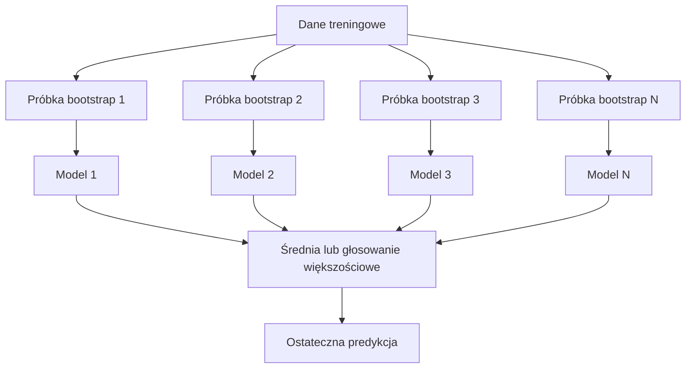
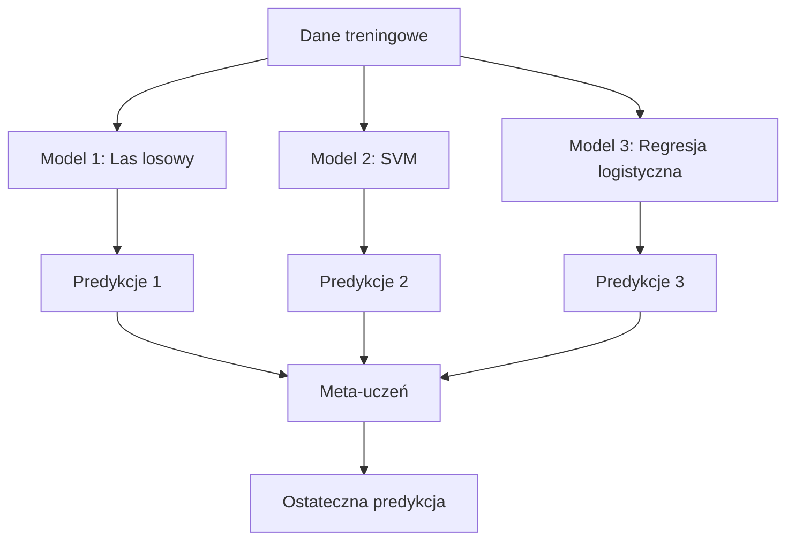

# Metody zespołowe (Ensemble Methods)

> Grupa słabych learnerów, połączonych prawidłowo, staje się silnym learnerem. To nie metafora. To twierdzenie.

**Type:** Build
**Language:** Python
**Prerequisites:** Phase 2, Lesson 10 (Bias-Variance Tradeoff)
**Time:** ~120 minutes

## Learning Objectives

- Zaimplementować AdaBoost i gradient boosting od zera oraz wyjaśnić, jak boosting sekwencyjnie redukuje obciążenie
- Zbudować zespół baggingowy i pokazać, jak uśrednianie skorelowanych modeli redukuje wariancję bez zwiększania obciążenia
- Porównać bagging, boosting i stacking pod kątem tego, który składnik błędu każda metoda redukuje
- Ocenić różnorodność zespołu i wyjaśnić, dlaczego dokładność głosowania większościowego rośnie wraz z większą liczbą niezależnych słabych learnerów

## The Problem

Pojedyncze drzewo decyzyjne jest szybkie w trenowaniu i łatwe do interpretacji, ale się przetrenowuje. Pojedynczy model liniowy jest niedouczony na złożonych granicach. Mógłbyś spędzić dni na inżynierii idealnej architektury modelu. Albo możesz połączyć kilka niedoskonałych modeli i uzyskać coś lepszego niż którykolwiek z nich indywidualnie.

Metody zespołowe właśnie to robią. Są najbardziej niezawodną techniką wygrywania konkursów Kaggle na danych tabelarycznych, napędzają większość produkcyjnych systemów ML i ilustrują w praktyce kompromis obciążenie-wariancja. Bagging redukuje wariancję. Boosting redukuje obciążenie. Stacking uczy się, którym modelom ufać przy których wejściach.

## The Concept

### Dlaczego zespoły działają

Załóżmy, że masz N niezależnych klasyfikatorów, każdy z dokładnością p > 0.5. Głosowanie większościowe ma dokładność:

```
P(większość poprawna) = suma po k > N/2 z C(N,k) * p^k * (1-p)^(N-k)
```

Dla 21 klasyfikatorów, każdy z 60% dokładnością, dokładność głosowania większościowego wynosi około 74%. Przy 101 klasyfikatorach wzrasta do 84%. Błędy znoszą się, gdy modele popełniają różne błędy.

Kluczowym wymaganiem jest **różnorodność**. Jeśli wszystkie modele popełniają te same błędy, łączenie ich nic nie daje. Zespoły działają, ponieważ produkują zróżnicowane modele poprzez:

- Różne podzbiory treningowe (bagging)
- Różne podzbiory cech (lasy losowe)
- Sekwencyjną korektę błędów (boosting)
- Różne rodziny modeli (stacking)

### Bagging (Bootstrap Aggregating)

Bagging tworzy różnorodność poprzez trenowanie każdego modelu na innej próbce bootstrapowej danych treningowych.



Próbka bootstrapowa jest losowana ze zwracaniem z oryginalnych danych, o tym samym rozmiarze co oryginał. Około 63.2% unikalnych próbek pojawia się w każdej bootstrapowej próbce. Pozostałe 36.8% (próbki out-of-bag) stanowi darmowy zbiór walidacyjny.

Bagging redukuje wariancję bez znaczącego zwiększania obciążenia. Każde indywidualne drzewo przetrenowuje się na swojej próbce bootstrapowej, ale przetrenowanie jest inne dla każdego drzewa, więc uśrednianie znosi szum.

**Lasy losowe** to bagging z dodatkowym ulepszeniem: przy każdym podziale brana jest pod uwagę tylko losowa podpróbka cech. To wymusza jeszcze większą różnorodność między drzewami. Typowa liczba kandydatów na cechy to `sqrt(n_features)` dla klasyfikacji i `n_features / 3` dla regresji.

### Boosting (sekwencyjna korekta błędów)

Boosting trenuje modele sekwencyjnie. Każdy nowy model koncentruje się na przykładach, które poprzednie modele sklasyfikowały błędnie.


Boosting redukuje obciążenie. Każdy nowy model koryguje systematyczne błędy dotychczasowego zespołu. Ostateczna predykcja to ważona suma wszystkich modeli, gdzie lepsze modele mają wyższe wagi.

Kompromis: boosting może się przetrenować, jeśli uruchomisz zbyt wiele rund, ponieważ dopasowuje się do coraz trudniejszych przykładów, z których część może być szumem.

### AdaBoost

AdaBoost (Adaptive Boosting) był pierwszym praktycznym algorytmem boostingowym. Działa z dowolnym learnerem bazowym, zazwyczaj pniakami decyzyjnymi (drzewa głębokości 1).

Algorytm:

```
1. Zainicjalizuj wagi próbek: w_i = 1/N dla wszystkich i

2. Dla t = 1 do T:
   a. Wytrenuj słaby learner h_t na ważonych danych
   b. Oblicz ważony błąd:
      err_t = sum(w_i * I(h_t(x_i) != y_i)) / sum(w_i)
   c. Oblicz wagę modelu:
      alpha_t = 0.5 * ln((1 - err_t) / err_t)
   d. Zaktualizuj wagi próbek:
      w_i = w_i * exp(-alpha_t * y_i * h_t(x_i))
   e. Znormalizuj wagi, aby sumowały się do 1

3. Ostateczna predykcja: H(x) = sign(sum(alpha_t * h_t(x)))
```

Modele z niższym błędem otrzymują wyższe alpha. Błędnie sklasyfikowane próbki otrzymują wyższe wagi, aby następny model się na nich skupił.

### Gradient Boosting

Gradient boosting uogólnia boosting na dowolne funkcje straty. Zamiast przeważać próbki, dopasowuje każdy nowy model do residuów (ujemny gradient funkcji straty) obecnego zespołu.

```
1. Inicjalizacja: F_0(x) = argmin_c sum(L(y_i, c))

2. Dla t = 1 do T:
   a. Oblicz pseudo-residua:
      r_i = -dL(y_i, F_{t-1}(x_i)) / dF_{t-1}(x_i)
   b. Dopasuj drzewo h_t do residuów r_i
   c. Znajdź optymalną wielkość kroku:
      gamma_t = argmin_gamma sum(L(y_i, F_{t-1}(x_i) + gamma * h_t(x_i)))
   d. Aktualizacja:
      F_t(x) = F_{t-1}(x) + learning_rate * gamma_t * h_t(x)

3. Ostateczna predykcja: F_T(x)
```

Dla błędu kwadratowego pseudo-residua to po prostu rzeczywiste residua: `r_i = y_i - F_{t-1}(x_i)`. Każde drzewo dosłownie dopasowuje błędy poprzedniego zespołu.

Współczynnik uczenia (shrinking) kontroluje, jak bardzo każde drzewo się przyczynia. Niższe współczynniki uczenia wymagają więcej drzew, ale lepiej generalizują. Typowe wartości: 0.01 do 0.3.

### XGBoost: Dlaczego dominuje na danych tabelarycznych

XGBoost (eXtreme Gradient Boosting) to gradient boosting zoptymalizowany inżynieryjnie, co czyni go szybkim, dokładnym i odpornym na przetrenowanie:

- **Regularyzowany cel:** Kary L1 i L2 na wagach liści zapobiegają zbytniej pewności poszczególnych drzew
- **Aproksymacja drugiego rzędu:** Używa zarówno pierwszej, jak i drugiej pochodnej funkcji straty, dając lepsze decyzje o podziale
- **Podziały świadome rzadkości:** Obsługuje brakujące wartości natywnie, ucząc się najlepszego kierunku dla brakujących danych przy każdym podziale
- **Subpróbkowanie kolumn:** Jak lasy losowe, próbkuje cechy przy każdym podziale dla różnorodności
- **Ważony kwantylowy szkic:** Efektywnie znajduje punkty podziału dla cech ciągłych na danych rozproszonych
- **Struktura blokowa przyjazna pamięci podręcznej:** Układ pamięci zoptymalizowany pod linie pamięci podręcznej CPU

Dla danych tabelarycznych XGBoost (i jego następca LightGBM) konsekwentnie przewyższa sieci neuronowe. To się szybko nie zmieni. Jeśli twoje dane mieszczą się w tabeli z wierszami i kolumnami, zacznij od gradient boostingu.

### Stacking (Meta-uczenie się)

Stacking używa przewidywań wielu modeli bazowych jako cech dla meta-ucznia.



Meta-uczeń uczy się, któremu modelowi bazowemu ufać dla których danych wejściowych. Jeśli las losowy jest lepszy w pewnych regionach, a SVM w innych, meta-uczeń nauczy się odpowiednio kierować.

Aby uniknąć wycieku danych, przewidywania modeli bazowych muszą być generowane poprzez walidację krzyżową na zbiorze treningowym. Nigdy nie trenuj modeli bazowych i nie generuj meta-cech na tych samych danych.

### Głosowanie

Najprostszy zespół. Po prostu łącz przewidywania bezpośrednio.

- **Głosowanie twarde:** Głosowanie większościowe na etykietach klas.
- **Głosowanie miękkie:** Średnia prawdopodobieństw przewidywania, wybierz klasę z najwyższym średnim prawdopodobieństwem. Zwykle lepsze, ponieważ wykorzystuje informację o pewności.

## Build It

### Step 1: Pniak decyzyjny (learner bazowy)

Kod w `code/ensembles.py` implementuje wszystko od zera. Zaczynamy od pniaka decyzyjnego: drzewa z pojedynczym podziałem.

```python
class DecisionStump:
    def __init__(self):
        self.feature_idx = None
        self.threshold = None
        self.polarity = 1
        self.alpha = None

    def fit(self, X, y, weights):
        n_samples, n_features = X.shape
        best_error = float("inf")

        for f in range(n_features):
            thresholds = np.unique(X[:, f])
            for thresh in thresholds:
                for polarity in [1, -1]:
                    pred = np.ones(n_samples)
                    pred[polarity * X[:, f] < polarity * thresh] = -1
                    error = np.sum(weights[pred != y])
                    if error < best_error:
                        best_error = error
                        self.feature_idx = f
                        self.threshold = thresh
                        self.polarity = polarity

    def predict(self, X):
        n = X.shape[0]
        pred = np.ones(n)
        idx = self.polarity * X[:, self.feature_idx] < self.polarity * self.threshold
        pred[idx] = -1
        return pred
```

### Step 2: AdaBoost od zera

```python
class AdaBoostScratch:
    def __init__(self, n_estimators=50):
        self.n_estimators = n_estimators
        self.stumps = []
        self.alphas = []

    def fit(self, X, y):
        n = X.shape[0]
        weights = np.full(n, 1 / n)

        for _ in range(self.n_estimators):
            stump = DecisionStump()
            stump.fit(X, y, weights)
            pred = stump.predict(X)

            err = np.sum(weights[pred != y])
            err = np.clip(err, 1e-10, 1 - 1e-10)

            alpha = 0.5 * np.log((1 - err) / err)
            weights *= np.exp(-alpha * y * pred)
            weights /= weights.sum()

            stump.alpha = alpha
            self.stumps.append(stump)
            self.alphas.append(alpha)

    def predict(self, X):
        total = sum(a * s.predict(X) for a, s in zip(self.alphas, self.stumps))
        return np.sign(total)
```

### Step 3: Gradient Boosting od zera

```python
class GradientBoostingScratch:
    def __init__(self, n_estimators=100, learning_rate=0.1, max_depth=3):
        self.n_estimators = n_estimators
        self.lr = learning_rate
        self.max_depth = max_depth
        self.trees = []
        self.initial_pred = None

    def fit(self, X, y):
        self.initial_pred = np.mean(y)
        current_pred = np.full(len(y), self.initial_pred)

        for _ in range(self.n_estimators):
            residuals = y - current_pred
            tree = SimpleRegressionTree(max_depth=self.max_depth)
            tree.fit(X, residuals)
            update = tree.predict(X)
            current_pred += self.lr * update
            self.trees.append(tree)

    def predict(self, X):
        pred = np.full(X.shape[0], self.initial_pred)
        for tree in self.trees:
            pred += self.lr * tree.predict(X)
        return pred
```

### Step 4: Porównanie ze sklearn

Kod weryfikuje, że nasze implementacje od zera osiągają podobną dokładność do `AdaBoostClassifier` i `GradientBoostingClassifier` ze sklearn, i porównuje wszystkie metody obok siebie.

## Use It

### Kiedy używać każdej metody

| Metoda | Redukuje | Najlepsza do | Uważaj na |
|--------|----------|--------------|-----------|
| Bagging / Las losowy | Wariancję | Zaszumione dane, wiele cech | Nie pomaga przy obciążeniu |
| AdaBoost | Obciążenie | Czyste dane, proste learnery bazowe | Wrażliwy na wartości odstające i szum |
| Gradient Boosting | Obciążenie | Dane tabelaryczne, konkursy | Wolne trenowanie, łatwy do przetrenowania bez strojenia |
| XGBoost / LightGBM | Oba | Produkcyjne ML na danych tabelarycznych | Wiele hiperparametrów |
| Stacking | Oba | Uzyskanie ostatnich 1-2% dokładności | Złożony, ryzyko przetrenowania meta-ucznia |
| Głosowanie | Wariancję | Szybkie łączenie różnorodnych modeli | Pomaga tylko, gdy modele są różnorodne |

### Produkcyjny stos dla danych tabelarycznych

Dla większości problemów predykcyjnych na danych tabelarycznych, to jest kolejność do wypróbowania:

1. **LightGBM lub XGBoost** z domyślnymi parametrami
2. Dostrój n_estimators, learning_rate, max_depth, min_child_weight
3. Jeśli potrzebujesz ostatnich 0.5%, zbuduj zespół stackingowy z 3-5 różnorodnymi modelami
4. Używaj walidacji krzyżowej przez cały czas

Sieci neuronowe na danych tabelarycznych są prawie zawsze gorsze niż gradient boosting, pomimo ciągłych prób badawczych. TabNet, NODE i podobne architektury czasami dorównują, ale rzadko pokonują dobrze dostrojony XGBoost.

## Ship It

Ta lekcja produkuje `outputs/prompt-ensemble-selector.md` -- prompt, który pomaga wybrać odpowiednią metodę zespołową dla danego zbioru danych. Opisz swoje dane (rozmiar, typy cech, poziom szumu, balans klas) i problem, który rozwiązujesz. Prompt przeprowadza przez listę kontrolną decyzji, rekomenduje metodę, sugeruje początkowe hiperparametry i ostrzega przed typowymi błędami dla tej metody. Produkuje również `outputs/skill-ensemble-builder.md` z pełnym przewodnikiem wyboru.

## Exercises

1. Zmodyfikuj implementację AdaBoost, aby śledzić dokładność treningową po każdej rundzie. Wykreśl dokładność vs liczba estymatorów. Kiedy osiąga zbieżność?

2. Zaimplementuj las losowy od zera, dodając losowe subpróbkowanie cech do drzewa regresyjnego. Wytrenuj 100 drzew z `max_features=sqrt(n_features)` i uśrednij przewidywania. Porównaj redukcję wariancji z pojedynczym drzewem.

3. W implementacji gradient boostingu dodaj wczesne zatrzymywanie: śledź stratę walidacyjną po każdej rundzie i zatrzymaj, gdy nie poprawiła się przez 10 kolejnych rund. Ile drzew faktycznie potrzebuje?

4. Zbuduj zespół stackingowy z trzema modelami bazowymi (regresja logistyczna, drzewo decyzyjne, k-najbliższych sąsiadów) i meta-uczniem będącym regresją logistyczną. Użyj 5-krotnej walidacji krzyżowej do generowania meta-cech. Porównaj z każdym modelem bazowym osobno.

5. Uruchom XGBoost na tym samym zbiorze danych z domyślnymi parametrami. Porównaj jego dokładność z twoim gradient boostingiem od zera. Zmierz czas obu. Jak duża jest różnica w szybkości?

## Key Terms

| Termin | Co ludzie mówią | Co naprawdę znaczy |
|--------|-----------------|---------------------|
| Bagging | "Trenuj na losowych podzbiorach" | Agregacja bootstrapowa: trenuj modele na próbkach bootstrapowych, uśredniaj przewidywania, aby zmniejszyć wariancję |
| Boosting | "Skup się na trudnych przykładach" | Trenuj modele sekwencyjnie, każdy koryguje błędy dotychczasowego zespołu, aby zmniejszyć obciążenie |
| AdaBoost | "Przeważ dane" | Boosting poprzez aktualizację wag próbek; błędnie sklasyfikowane punkty dostają wyższą wagę dla następnego learnera |
| Gradient boosting | "Dopasuj residua" | Boosting poprzez dopasowywanie każdego nowego modelu do ujemnego gradientu funkcji straty |
| XGBoost | "Broń Kaggle'a" | Gradient boosting z regularyzacją, optymalizacją drugiego rzędu i systemowymi trikami szybkościowymi |
| Stacking | "Modele na modelach" | Użyj przewidywań modeli bazowych jako cech wejściowych dla meta-ucznia |
| Las losowy | "Wiele losowych drzew" | Bagging z drzewami decyzyjnymi, dodający losowe subpróbkowanie cech przy każdym podziale dla różnorodności |
| Różnorodność zespołu | "Popełniaj różne błędy" | Modele muszą być nieskorelowane w swoich błędach, aby zespół był lepszy od indywidualnych modeli |
| Błąd out-of-bag | "Darmowa walidacja" | Próbki nieobecne w losowaniu bootstrapowym (~36.8%) służą jako zbiór walidacyjny bez potrzeby wydzielania |

## Further Reading

- [Schapire & Freund: Boosting: Foundations and Algorithms](https://mitpress.mit.edu/9780262526036/) -- the book by AdaBoost's creators
- [Friedman: Greedy Function Approximation: A Gradient Boosting Machine (2001)](https://statweb.stanford.edu/~jhf/ftp/trebst.pdf) -- the original gradient boosting paper
- [Chen & Guestrin: XGBoost (2016)](https://arxiv.org/abs/1603.02754) -- the XGBoost paper
- [Wolpert: Stacked Generalization (1992)](https://www.sciencedirect.com/science/article/abs/pii/S0893608005800231) -- the original stacking paper
- [scikit-learn Ensemble Methods](https://scikit-learn.org/stable/modules/ensemble.html) -- practical reference
