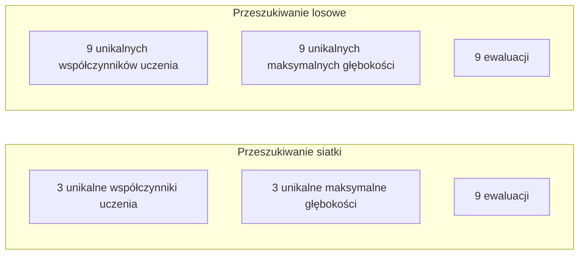
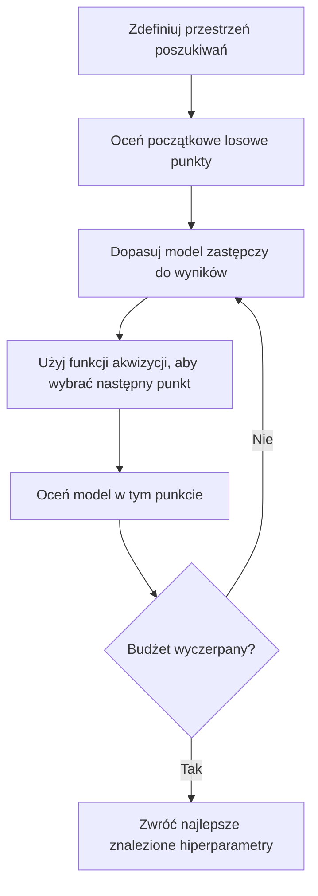
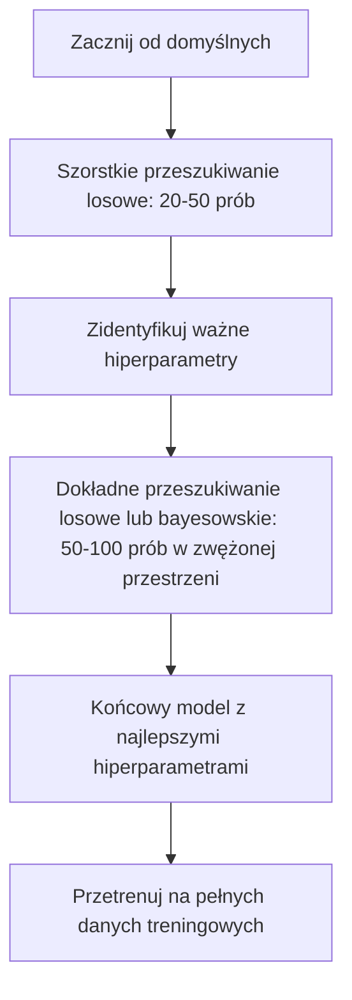
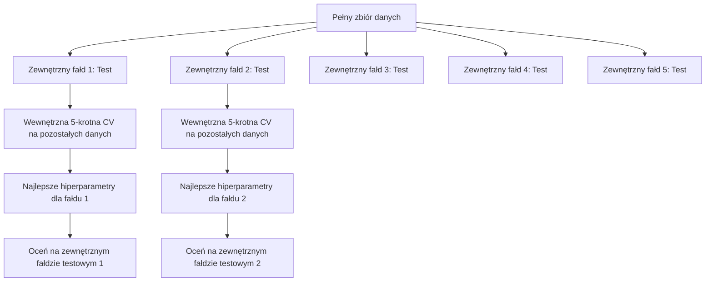

# Strojenie hiperparametrów (Hyperparameter Tuning)

> Hiperparametry to pokrętła, które przekręcasz przed rozpoczęciem treningu. Dobre ich ustawienie to różnica między przeciętnym modelem a świetnym.

**Type:** Build
**Language:** Python
**Prerequisites:** Phase 2, Lesson 11 (Ensemble Methods)
**Time:** ~90 minutes

## Learning Objectives

- Zaimplementować przeszukiwanie siatki, przeszukiwanie losowe i optymalizację bayesowską od zera oraz porównać ich efektywność próbkowania
- Wyjaśnić, dlaczego przeszukiwanie losowe przewyższa przeszukiwanie siatki, gdy większość hiperparametrów ma niską efektywną wymiarowość
- Zbudować pętlę optymalizacji bayesowskiej z użyciem modelu zastępczego i funkcji akwizycji do kierowania poszukiwaniami
- Zaprojektować strategię strojenia hiperparametrów, która unika przetrenowania zbioru walidacyjnego poprzez właściwą walidację krzyżową

## The Problem

Twój model gradient boostingu ma współczynnik uczenia, liczbę drzew, maksymalną głębokość, minimalną liczbę próbek na liść, współczynnik podpróbkowania i współczynnik próbkowania kolumn. To sześć hiperparametrów. Jeśli każdy ma 5 rozsądnych wartości, siatka ma 5^6 = 15,625 kombinacji. Trenowanie każdej zajmuje 10 sekund. To 43 godziny obliczeń, aby wypróbować wszystkie.

Przeszukiwanie siatki to oczywiste podejście i najgorsze na większą skalę. Przeszukiwanie losowe radzi sobie lepiej przy mniejszej mocy obliczeniowej. Optymalizacja bayesowska radzi sobie jeszcze lepiej, ucząc się z poprzednich ocen. Wiedza, którą strategię zastosować i które hiperparametry faktycznie mają znaczenie, oszczędza dni zmarnowanego czasu GPU.

## The Concept

### Parametry vs hiperparametry

Parametry są uczone podczas treningu (wagi, obciążenia, progi podziału). Hiperparametry są ustawiane przed rozpoczęciem treningu i kontrolują, jak przebiega uczenie.

| Hiperparametr | Co kontroluje | Typowy zakres |
|---------------|---------------|---------------|
| Współczynnik uczenia (learning rate) | Wielkość kroku aktualizacji | 0.001 do 1.0 |
| Liczba drzew/epok | Jak długo trenować | 10 do 10,000 |
| Maksymalna głębokość (max depth) | Złożoność modelu | 1 do 30 |
| Regularyzacja (lambda) | Zapobieganie przetrenowaniu | 0.0001 do 100 |
| Rozmiar partii (batch size) | Szum estymacji gradientu | 16 do 512 |
| Współczynnik dropout | Frakcja wyłączanych neuronów | 0.0 do 0.5 |

### Przeszukiwanie siatki (Grid Search)

Przeszukiwanie siatki ocenia każdą kombinację określonych wartości. Jest wyczerpujące i łatwe do zrozumienia, ale skaluje się wykładniczo z liczbą hiperparametrów.

```
Siatka dla 2 hiperparametrów:

  learning_rate: [0.01, 0.1, 1.0]
  max_depth:     [3, 5, 7]

  Ewaluacje: 3 x 3 = 9 kombinacji

  (0.01, 3)  (0.01, 5)  (0.01, 7)
  (0.1,  3)  (0.1,  5)  (0.1,  7)
  (1.0,  3)  (1.0,  5)  (1.0,  7)
```

Przeszukiwanie siatki ma fundamentalną wadę: jeśli jeden hiperparametr ma znaczenie, a drugi nie, większość ewaluacji jest marnowana. Dostajesz tylko 3 unikalne wartości ważnego parametru z 9 ewaluacji.

### Przeszukiwanie losowe (Random Search)

Przeszukiwanie losowe próbkuje hiperparametry z rozkładów zamiast z siatki. Przy tym samym budżecie 9 ewaluacji dostajesz 9 unikalnych wartości każdego hiperparametru.



Dlaczego losowe bije siatkę (Bergstra & Bengio, 2012):

- Większość hiperparametrów ma niską efektywną wymiarowość. Tylko 1-2 z 6 hiperparametrów zwykle mają znaczenie dla danego problemu.
- Przeszukiwanie siatki marnuje ewaluacje na nieważnych wymiarach.
- Przeszukiwanie losowe pokrywa ważne wymiary gęściej przy tym samym budżecie.
- Przy 60 losowych próbach masz 95% szans na znalezienie punktu w odległości 5% od optimum (jeśli istnieje w przestrzeni poszukiwań).

### Optymalizacja bayesowska

Przeszukiwanie losowe ignoruje wyniki. Nie uczy się, że wysokie współczynniki uczenia powodują rozbieżność lub że głębokość 3 konsekwentnie przewyższa głębokość 10. Optymalizacja bayesowska używa poprzednich ewaluacji, aby zdecydować, gdzie szukać dalej.



Dwa kluczowe komponenty:

**Model zastępczy (surrogate model):** Tani w ocenie model (zwykle proces gaussowski), który aproksymuje kosztowną funkcję celu. Daje zarówno przewidywanie, jak i oszacowanie niepewności w dowolnym punkcie przestrzeni poszukiwań.

**Funkcja akwizycji (acquisition function):** Decyduje, gdzie ocenić dalej, balansując eksploatację (szukaj w pobliżu znanych dobrych punktów) i eksplorację (szukaj tam, gdzie niepewność jest wysoka). Typowe wybory:

- **Expected Improvement (EI):** Jakiej poprawy względem obecnego najlepszego wyniku oczekujemy w tym punkcie?
- **Upper Confidence Bound (UCB):** Przewidywanie plus wielokrotność niepewności. Wyższe UCB oznacza albo obiecujące, albo niezbadane.
- **Probability of Improvement (PI):** Jakie jest prawdopodobieństwo, że ten punkt przebije obecny najlepszy?

Optymalizacja bayesowska zazwyczaj znajduje lepsze hiperparametry niż przeszukiwanie losowe przy 2-5x mniejszej liczbie ewaluacji. Narzut związany z dopasowaniem modelu zastępczego jest pomijalny w porównaniu z trenowaniem rzeczywistego modelu.

### Wczesne zatrzymywanie (Early Stopping)

Nie każde uruchomienie treningu musi się zakończyć. Jeśli konfiguracja jest wyraźnie zła po 10 epokach, zatrzymaj ją i idź dalej. To jest wczesne zatrzymywanie w kontekście poszukiwania hiperparametrów.

Strategie:
- **Oparte na cierpliwości:** Zatrzymaj, jeśli strata walidacyjna nie poprawiła się przez N kolejnych epok
- **Median pruning:** Zatrzymaj, jeśli pośredni wynik próby jest gorszy niż mediana ukończonych prób w tym samym kroku
- **Hyperband:** Przydziel małe budżety wielu konfiguracjom, a następnie stopniowo zwiększaj budżet dla najlepszych

Hyperband jest szczególnie skuteczny. Zaczyna od 81 konfiguracji z 1 epoką każda, zatrzymuje najlepszą trzecią część, daje im 3 epoki, zatrzymuje najlepszą trzecią część i tak dalej. To znajduje dobre konfiguracje 10-50x szybciej niż ocenianie wszystkich konfiguracji z pełnym budżetem.

### Współczynniki uczenia (Learning Rate Schedulers)

Współczynnik uczenia jest prawie zawsze najważniejszym hiperparametrem. Zamiast utrzymywać go stałym, harmonogramy dostosowują go podczas treningu.

| Harmonogram | Wzór | Kiedy używać |
|-------------|------|--------------|
| Step decay | Pomnóż przez 0.1 co N epok | Klasyczne trenowanie CNN |
| Cosine annealing | lr * 0.5 * (1 + cos(pi * t / T)) | Nowoczesny domyślny |
| Warmup + decay | Liniowy wzrost, potem cosinusowy spadek | Transformery |
| One-cycle | Wzrost, potem spadek w jednym cyklu | Szybka zbieżność |
| Reduce on plateau | Zmniejsz o czynnik, gdy metryka stoi w miejscu | Bezpieczny domyślny |

### Znaczenie hiperparametrów

Nie wszystkie hiperparametry mają równe znaczenie. Badania nad lasami losowymi (Probst et al., 2019) i gradient boostingiem pokazują spójne wzorce:

**Wysokie znaczenie:**
- Współczynnik uczenia (zawsze strojony jako pierwszy)
- Liczba estymatorów / epok (użyj wczesnego zatrzymywania zamiast strojenia)
- Siła regularyzacji

**Średnie znaczenie:**
- Maksymalna głębokość / liczba warstw
- Minimalna liczba próbek na liść / weight decay
- Współczynnik podpróbkowania

**Niskie znaczenie:**
- Maksymalna liczba cech (dla lasów losowych)
- Wybór konkretnej funkcji aktywacji
- Rozmiar partii (w rozsądnym zakresie)

Strój najpierw te ważne, resztę zostaw przy domyślnych.

### Praktyczna strategia



Konkretny przepływ pracy:

1. **Zacznij od domyślnych biblioteki.** Są wybrane przez doświadczonych praktyków i często są w 80% drogi do celu.
2. **Szorstkie przeszukiwanie losowe.** Szerokie zakresy, 20-50 prób. Użyj wczesnego zatrzymywania, aby szybko zabić złe uruchomienia.
3. **Przeanalizuj wyniki.** Które hiperparametry korelują z wydajnością? Zwęż przestrzeń poszukiwań.
4. **Dokładne przeszukiwanie.** Optymalizacja bayesowska lub ukierunkowane przeszukiwanie losowe w zwężonej przestrzeni. 50-100 prób.
5. **Przetrenuj na wszystkich danych treningowych** z najlepszymi znalezionymi hiperparametrami.

### Integracja walidacji krzyżowej

Strojenie hiperparametrów na pojedynczym podziale walidacyjnym jest ryzykowne. Najlepsze hiperparametry mogą przetrenować się na konkretnym fałdzie walidacyjnym. Zagnieżdżona walidacja krzyżowa rozwiązuje to, używając dwóch pętli:

- **Pętla zewnętrzna** (ewaluacja): dzieli dane na trening+walidację i test. Raportuje nieobciążoną wydajność.
- **Pętla wewnętrzna** (strojenie): dzieli trening+walidację na trening i walidację. Znajduje najlepsze hiperparametry.



Każdy zewnętrzny fałd znajduje własne najlepsze hiperparametry niezależnie. Wyniki zewnętrzne są nieobciążonym oszacowaniem wydajności generalizacji.

Z sklearn:

```python
from sklearn.model_selection import cross_val_score, GridSearchCV
from sklearn.ensemble import GradientBoostingRegressor

inner_cv = GridSearchCV(
    GradientBoostingRegressor(),
    param_grid={
        "learning_rate": [0.01, 0.05, 0.1],
        "max_depth": [2, 3, 5],
        "n_estimators": [50, 100, 200],
    },
    cv=5,
    scoring="neg_mean_squared_error",
)

outer_scores = cross_val_score(
    inner_cv, X, y, cv=5, scoring="neg_mean_squared_error"
)

print(f"Nested CV MSE: {-outer_scores.mean():.4f} +/- {outer_scores.std():.4f}")
```

To jest kosztowne (5 zewnętrznych fałdów x 5 wewnętrznych fałdów x 27 punktów siatki = 675 dopasowań modelu), ale daje wiarygodne oszacowanie wydajności. Używaj go przy raportowaniu końcowych wyników w publikacjach lub gdy stawka decyzji jest wysoka.

### Praktyczne wskazówki

**Zacznij od współczynnika uczenia.** Jest zawsze najważniejszym hiperparametrem dla metod gradientowych. Zły współczynnik uczenia czyni wszystko inne nieistotnym. Ustal pozostałe hiperparametry na domyślne i przeskanuj najpierw współczynnik uczenia.

**Używaj rozkładów log-jednostajnych dla współczynnika uczenia i regularyzacji.** Różnica między 0.001 a 0.01 ma takie samo znaczenie jak różnica między 0.1 a 1.0. Przeszukiwanie liniowe marnuje budżet na dużym końcu.

**Używaj wczesnego zatrzymywania zamiast strojenia n_estimators.** Dla boostingu i sieci neuronowych ustaw n_estimators lub epoki wysoko i pozwól wczesnemu zatrzymywaniu zdecydować, kiedy przestać. To usuwa jeden hiperparametr z poszukiwań.

**Alokacja budżetu.** Wydaj 60% budżetu strojenia na 2 najważniejsze hiperparametry. Wydaj pozostałe 40% na wszystko inne. Te 2 najważniejsze odpowiadają za większość zmienności wydajności.

**Skala ma znaczenie.** Nigdy nie przeszukuj rozmiaru partii na skali logarytmicznej (16, 32, 64 są w porządku). Zawsze przeszukuj współczynnik uczenia na skali logarytmicznej. Dopasuj rozkład poszukiwań do tego, jak hiperparametr wpływa na model.

| Typ modelu | Najważniejsze hiperparametry | Zalecane przeszukiwanie | Budżet |
|-----------|-----------------------------|-------------------------|--------|
| Random Forest | n_estimators, max_depth, min_samples_leaf | Losowe, 50 prób | Niski (szybkie trenowanie) |
| Gradient Boosting | learning_rate, n_estimators, max_depth | Bayesowskie, 100 prób + wczesne zatrzymywanie | Średni |
| Neural Network | learning_rate, weight_decay, batch_size | Bayesowskie lub losowe, 100+ prób | Wysoki (wolne trenowanie) |
| SVM | C, gamma (jądro RBF) | Siatka na skali logarytmicznej, 25-50 prób | Niski (2 parametry) |
| Lasso/Ridge | alpha | 1D przeszukiwanie na skali logarytmicznej, 20 prób | Bardzo niski |
| XGBoost | learning_rate, max_depth, subsample, colsample | Bayesowskie, 100-200 prób + wczesne zatrzymywanie | Średni |

**Gdy masz wątpliwości:** przeszukiwanie losowe z 2x liczbą hiperparametrów jako liczbą prób (np. 6 hiperparametrów = 12+ prób minimum). Będziesz zaskoczony, jak często przeszukiwanie losowe z 50 próbami bije starannie zaprojektowane przeszukiwanie siatki.

```figure
k-fold-cv
```

## Build It

### Step 1: Przeszukiwanie siatki od zera

Kod w `code/tuning.py` implementuje przeszukiwanie siatki, przeszukiwanie losowe i prosty optymalizator bayesowski od zera.

```python
def grid_search(model_fn, param_grid, X_train, y_train, X_val, y_val):
    keys = list(param_grid.keys())
    values = list(param_grid.values())
    best_score = -float("inf")
    best_params = None
    n_evals = 0

    for combo in itertools.product(*values):
        params = dict(zip(keys, combo))
        model = model_fn(**params)
        model.fit(X_train, y_train)
        score = evaluate(model, X_val, y_val)
        n_evals += 1

        if score > best_score:
            best_score = score
            best_params = params

    return best_params, best_score, n_evals
```

### Step 2: Przeszukiwanie losowe od zera

```python
def random_search(model_fn, param_distributions, X_train, y_train,
                  X_val, y_val, n_iter=50, seed=42):
    rng = np.random.RandomState(seed)
    best_score = -float("inf")
    best_params = None

    for _ in range(n_iter):
        params = {k: sample(v, rng) for k, v in param_distributions.items()}
        model = model_fn(**params)
        model.fit(X_train, y_train)
        score = evaluate(model, X_val, y_val)

        if score > best_score:
            best_score = score
            best_params = params

    return best_params, best_score, n_iter
```

### Step 3: Optymalizacja bayesowska (uproszczona)

Główna idea: dopasuj proces gaussowski do zaobserwowanych par (hiperparametr, wynik), a następnie użyj funkcji akwizycji, aby zdecydować, gdzie szukać dalej.

```python
class SimpleBayesianOptimizer:
    def __init__(self, search_space, n_initial=5):
        self.search_space = search_space
        self.n_initial = n_initial
        self.X_observed = []
        self.y_observed = []

    def _kernel(self, x1, x2, length_scale=1.0):
        dists = np.sum((x1[:, None, :] - x2[None, :, :]) ** 2, axis=2)
        return np.exp(-0.5 * dists / length_scale ** 2)

    def _fit_gp(self, X_new):
        X_obs = np.array(self.X_observed)
        y_obs = np.array(self.y_observed)
        y_mean = y_obs.mean()
        y_centered = y_obs - y_mean

        K = self._kernel(X_obs, X_obs) + 1e-4 * np.eye(len(X_obs))
        K_star = self._kernel(X_new, X_obs)

        L = np.linalg.cholesky(K)
        alpha = np.linalg.solve(L.T, np.linalg.solve(L, y_centered))
        mu = K_star @ alpha + y_mean

        v = np.linalg.solve(L, K_star.T)
        var = 1.0 - np.sum(v ** 2, axis=0)
        var = np.maximum(var, 1e-6)

        return mu, var

    def _expected_improvement(self, mu, var, best_y):
        sigma = np.sqrt(var)
        z = (mu - best_y) / (sigma + 1e-10)
        ei = sigma * (z * norm_cdf(z) + norm_pdf(z))
        return ei

    def suggest(self):
        if len(self.X_observed) < self.n_initial:
            return sample_random(self.search_space)

        candidates = [sample_random(self.search_space) for _ in range(500)]
        X_cand = np.array([to_vector(c) for c in candidates])
        mu, var = self._fit_gp(X_cand)
        ei = self._expected_improvement(mu, var, max(self.y_observed))
        return candidates[np.argmax(ei)]

    def observe(self, params, score):
        self.X_observed.append(to_vector(params))
        self.y_observed.append(score)
```

Model zastępczy GP daje dwie rzeczy w każdym punkcie kandydackim: przewidywany wynik (mu) i niepewność (var). Expected Improvement balansuje je: faworyzuje punkty, gdzie model przewiduje wysokie wyniki LUB gdzie niepewność jest wysoka. Na początku większość punktów ma wysoką niepewność, więc optymalizator eksploruje. Później koncentruje się na najbardziej obiecującym regionie.

### Step 4: Porównanie wszystkich metod

Uruchom wszystkie trzy metody na tym samym syntetycznym celu i porównaj. To porównanie używa uproszczonego wrappera, który wywołuje każdy optymalizator z bezpośrednią funkcją celu (bez trenowania modelu), więc API różni się od implementacji opartych na modelu powyżej:

```python
def synthetic_objective(params):
    lr = params["learning_rate"]
    depth = params["max_depth"]
    return -(np.log10(lr) + 2) ** 2 - (depth - 4) ** 2 + 10

param_grid = {
    "learning_rate": [0.001, 0.01, 0.1, 1.0],
    "max_depth": [2, 3, 4, 5, 6, 7, 8],
}

grid_best = None
grid_score = -float("inf")
grid_history = []
for combo in itertools.product(*param_grid.values()):
    params = dict(zip(param_grid.keys(), combo))
    score = synthetic_objective(params)
    grid_history.append((params, score))
    if score > grid_score:
        grid_score = score
        grid_best = params

param_dist = {
    "learning_rate": ("log_float", 0.001, 1.0),
    "max_depth": ("int", 2, 8),
}

rand_best = None
rand_score = -float("inf")
rand_history = []
rng = np.random.RandomState(42)
for _ in range(28):
    params = {k: sample(v, rng) for k, v in param_dist.items()}
    score = synthetic_objective(params)
    rand_history.append((params, score))
    if score > rand_score:
        rand_score = score
        rand_best = params

optimizer = SimpleBayesianOptimizer(param_dist, n_initial=5)
bayes_history = []
for _ in range(28):
    params = optimizer.suggest()
    score = synthetic_objective(params)
    optimizer.observe(params, score)
    bayes_history.append((params, score))
bayes_score = max(s for _, s in bayes_history)

print(f"{'Method':<20} {'Best Score':>12} {'Evaluations':>12}")
print("-" * 50)
print(f"{'Grid Search':<20} {grid_score:>12.4f} {len(grid_history):>12}")
print(f"{'Random Search':<20} {rand_score:>12.4f} {len(rand_history):>12}")
print(f"{'Bayesian Opt':<20} {bayes_score:>12.4f} {len(bayes_history):>12}")
```

Przy tym samym budżecie, optymalizacja bayesowska zwykle znajduje najlepszy wynik najszybciej, ponieważ nie marnuje ewaluacji na wyraźnie złych regionach. Przeszukiwanie losowe pokrywa więcej terenu niż przeszukiwanie siatki. Przeszukiwanie siatki wygrywa tylko wtedy, gdy masz bardzo mało hiperparametrów i możesz sobie pozwolić na wyczerpujące podejście.

## Use It

### Optuna w praktyce

Optuna jest zalecaną biblioteką do poważnego strojenia hiperparametrów. Obsługuje przycinanie, rozproszone poszukiwania i wizualizację od razu po wyjęciu z pudełka.

```python
import optuna

def objective(trial):
    lr = trial.suggest_float("learning_rate", 1e-4, 1e-1, log=True)
    n_est = trial.suggest_int("n_estimators", 50, 500)
    max_depth = trial.suggest_int("max_depth", 2, 10)

    model = GradientBoostingRegressor(
        learning_rate=lr,
        n_estimators=n_est,
        max_depth=max_depth,
    )
    model.fit(X_train, y_train)
    return mean_squared_error(y_val, model.predict(X_val))

study = optuna.create_study(direction="minimize")
study.optimize(objective, n_trials=100)

print(f"Best params: {study.best_params}")
print(f"Best MSE: {study.best_value:.4f}")
```

Kluczowe funkcje Optuny:
- `suggest_float(..., log=True)` dla parametrów najlepiej przeszukiwanych na skali logarytmicznej (współczynnik uczenia, regularyzacja)
- `suggest_int` dla parametrów całkowitych
- `suggest_categorical` dla dyskretnych wyborów
- Wbudowany MedianPruner do wczesnego zatrzymywania złych prób
- `study.trials_dataframe()` do analizy

### Optuna z przycinaniem

Przycinanie zatrzymuje wcześnie nieobiecujące próby, oszczędzając ogromną moc obliczeniową. Oto wzorzec:

```python
import optuna
from sklearn.model_selection import cross_val_score

def objective(trial):
    params = {
        "learning_rate": trial.suggest_float("lr", 1e-4, 0.5, log=True),
        "max_depth": trial.suggest_int("max_depth", 2, 10),
        "n_estimators": trial.suggest_int("n_estimators", 50, 500),
        "subsample": trial.suggest_float("subsample", 0.5, 1.0),
    }

    model = GradientBoostingRegressor(**params)
    scores = cross_val_score(model, X_train, y_train, cv=3,
                             scoring="neg_mean_squared_error")
    mean_score = -scores.mean()

    trial.report(mean_score, step=0)
    if trial.should_prune():
        raise optuna.TrialPruned()

    return mean_score

pruner = optuna.pruners.MedianPruner(n_startup_trials=10, n_warmup_steps=5)
study = optuna.create_study(direction="minimize", pruner=pruner)
study.optimize(objective, n_trials=200)
```

`MedianPruner` zatrzymuje próbę, jeśli jej pośrednia wartość jest gorsza niż mediana wszystkich ukończonych prób w tym samym kroku. Przycinanie wymaga wywołania `trial.report()` w celu raportowania pośrednich metryk i `trial.should_prune()` w celu sprawdzenia, czy próba powinna zostać zatrzymana. `n_startup_trials=10` zapewnia, że co najmniej 10 prób ukończy się w pełni, zanim przycinanie zacznie działać. To zazwyczaj oszczędza 40-60% całkowitej mocy obliczeniowej.

### Wbudowane strojniki sklearn

Do szybkich eksperymentów sklearn udostępnia `GridSearchCV`, `RandomizedSearchCV` i `HalvingRandomSearchCV`:

```python
from sklearn.model_selection import RandomizedSearchCV
from scipy.stats import loguniform, randint

param_dist = {
    "learning_rate": loguniform(1e-4, 0.5),
    "max_depth": randint(2, 10),
    "n_estimators": randint(50, 500),
}

search = RandomizedSearchCV(
    GradientBoostingRegressor(),
    param_dist,
    n_iter=100,
    cv=5,
    scoring="neg_mean_squared_error",
    random_state=42,
    n_jobs=-1,
)
search.fit(X_train, y_train)
print(f"Best params: {search.best_params_}")
print(f"Best CV MSE: {-search.best_score_:.4f}")
```

Użyj `loguniform` z scipy dla współczynnika uczenia i regularyzacji. Użyj `randint` dla całkowitych hiperparametrów. Flaga `n_jobs=-1` parallelizuje na wszystkich rdzeniach CPU.

### Częste błędy w strojeniu hiperparametrów

**Wyciek danych przez przetwarzanie wstępne.** Jeśli dopasujesz skaler na pełnym zbiorze danych przed walidacją krzyżową, informacja z fałdu walidacyjnego wycieka do treningu. Zawsze umieszczaj przetwarzanie wstępne wewnątrz `Pipeline`, aby było dopasowane tylko na fałdzie treningowym.

**Przetrenowanie na zbiorze walidacyjnym.** Uruchamianie tysięcy prób efektywnie trenuje na zbiorze walidacyjnym. Użyj zagnieżdżonej walidacji krzyżowej do końcowych oszacowań wydajności lub odłóż osobny zbiór testowy, którego nie dotykasz podczas strojenia.

**Przeszukiwanie zbyt wąskiego zakresu.** Jeśli twoja najlepsza wartość jest na granicy przestrzeni poszukiwań, nie przeszukiwałeś wystarczająco szeroko. Optymalna wartość może być poza twoim zakresem. Zawsze sprawdzaj, czy najlepsze parametry są na krawędziach.

**Ignorowanie efektów interakcji.** Współczynnik uczenia i liczba estymatorów silnie ze sobą współdziałają w boostingu. Niski współczynnik uczenia potrzebuje więcej estymatorów. Strojenie ich niezależnie daje gorsze wyniki niż strojenie ich razem.

**Nie używanie wczesnego zatrzymywania dla modeli iteracyjnych.** Dla gradient boostingu i sieci neuronowych ustaw n_estimators lub epoki na wysoką wartość i użyj wczesnego zatrzymywania. To jest ściśle lepsze niż strojenie liczby iteracji jako hiperparametru.

## Exercises

1. Uruchom przeszukiwanie siatki i przeszukiwanie losowe z tym samym całkowitym budżetem (np. 50 ewaluacji). Porównaj najlepsze znalezione wyniki. Przeprowadź eksperyment 10 razy z różnymi ziarnami. Jak często wygrywa przeszukiwanie losowe?

2. Zaimplementuj Hyperband od zera. Zacznij od 81 konfiguracji, każda trenowana przez 1 epokę. Zachowaj najlepszą 1/3 w każdej rundzie i potrój ich budżet. Porównaj całkowitą moc obliczeniową (suma wszystkich epok we wszystkich konfiguracjach) do uruchomienia 81 konfiguracji z pełnym budżetem.

3. Dodaj harmonogram współczynnika uczenia (cosine annealing) do implementacji gradient boostingu z Lekcji 11. Czy to pomaga w porównaniu do stałego współczynnika uczenia?

4. Użyj Optuny, aby dostroić RandomForestClassifier na prawdziwym zbiorze danych (np. zbiór danych raka piersi ze sklearn). Użyj `optuna.visualization.plot_param_importances(study)`, aby zobaczyć, które hiperparametry mają największe znaczenie. Czy zgadza się to z rankingiem znaczenia z tej lekcji?

5. Zaimplementuj prostą funkcję akwizycji (Expected Improvement) i zademonstruj eksplorację vs eksploatację. Wykreśl średnią i niepewność modelu zastępczego i pokaż, gdzie EI wybiera do oceny w następnej kolejności.

## Key Terms

| Termin | Co ludzie mówią | Co naprawdę znaczy |
|--------|-----------------|---------------------|
| Hiperparametr | "Ustawienie, które wybierasz" | Wartość ustawiona przed treningiem, która kontroluje proces uczenia, nieuczona z danych |
| Przeszukiwanie siatki | "Wypróbuj każdą kombinację" | Wyczerpujące przeszukiwanie określonej siatki parametrów. Koszt wykładniczy. |
| Przeszukiwanie losowe | "Po prostu próbkuj losowo" | Próbkuj hiperparametry z rozkładów. Lepiej pokrywa ważne wymiary niż przeszukiwanie siatki. |
| Optymalizacja bayesowska | "Inteligentne przeszukiwanie" | Używa modelu zastępczego celu, aby zdecydować, gdzie ocenić dalej, balansując eksplorację i eksploatację |
| Model zastępczy | "Tania aproksymacja" | Model (zwykle proces gaussowski), który aproksymuje kosztowną funkcję celu na podstawie zaobserwowanych ewaluacji |
| Funkcja akwizycji | "Gdzie szukać dalej" | Punktuje kandydatów, balansując oczekiwaną poprawę z niepewnością. EI i UCB to typowe wybory. |
| Wczesne zatrzymywanie | "Przestań marnować czas" | Zakończ trenowanie wcześnie, gdy wydajność walidacyjna przestaje się poprawiać |
| Hyperband | "Turniej dla konfiguracji" | Adaptacyjna alokacja zasobów: zacznij wiele konfiguracji z małymi budżetami, zachowaj najlepsze i zwiększ ich budżety |
| Harmonogram współczynnika uczenia | "Zmień lr podczas treningu" | Funkcja, która dostosowuje współczynnik uczenia w trakcie treningu dla lepszej zbieżności |

## Further Reading

- [Bergstra & Bengio: Random Search for Hyper-Parameter Optimization (2012)](https://jmlr.org/papers/v13/bergstra12a.html) -- the paper that showed random beats grid
- [Snoek et al., Practical Bayesian Optimization of Machine Learning Algorithms (2012)](https://arxiv.org/abs/1206.2944) -- Bayesian optimization for ML
- [Li et al., Hyperband: A Novel Bandit-Based Approach (2018)](https://jmlr.org/papers/v18/16-558.html) -- the Hyperband paper
- [Optuna: A Next-generation Hyperparameter Optimization Framework](https://arxiv.org/abs/1907.10902) -- the Optuna paper
- [Probst et al., Tunability: Importance of Hyperparameters (2019)](https://jmlr.org/papers/v20/18-444.html) -- which hyperparameters matter
