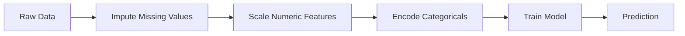
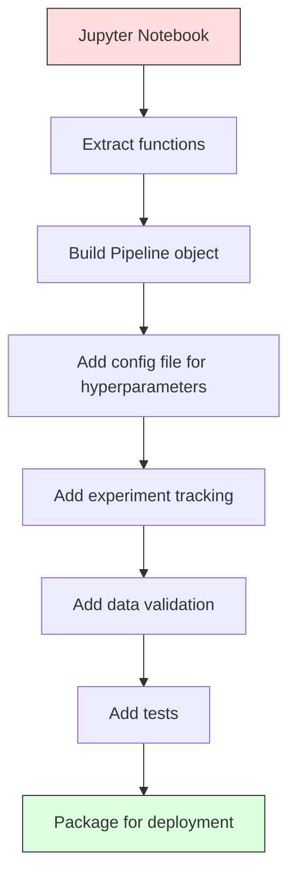

# Potoki ML

> Model to nie produkt. Potok to produkt. Potok to wszystko od surowych danych po wdrożoną predykcję, a każdy krok musi być powtarzalny.

**Type:** Build
**Language:** Python
**Prerequisites:** Phase 2, Lesson 12 (Hyperparameter Tuning)
**Time:** ~120 minutes

## Learning Objectives

- Zbudować potok ML od podstaw, który łączy imputację, skalowanie, kodowanie i trenowanie modelu w jeden powtarzalny obiekt
- Identyfikować scenariusze wycieku danych i wyjaśniać, jak potoki im zapobiegają przez dopasowywanie transformatorów tylko na danych treningowych
- Skonstruować ColumnTransformer, który stosuje różne przetwarzanie wstępne do cech numerycznych i kategorycznych
- Zaimplementować serializację potoku i wykazać, że ten sam dopasowany potok daje identyczne wyniki w treningu i produkcji

## The Problem

Masz notebook, który ładuje dane, uzupełnia brakujące wartości medianą, skaluje cechy, trenuje model i wyświetla dokładność. Działa. Wdrażasz go.

Miesiąc później ktoś ponownie trenuje model i uzyskuje inne wyniki. Mediana została obliczona na całym zbiorze danych, włącznie z danymi testowymi (wyciek danych). Parametry skalowania nie zostały zapisane, więc wnioskowanie używa innych statystyk. Kod inżynierii cech został skopiowany między treningiem a serwowaniem, a kopie się rozjechały. Kolumna kategoryczna otrzymała w produkcji nową wartość, której enkoder nigdy nie widział.

To nie są hipotetyczne sytuacje. To najczęstsze powody, dla których systemy ML zawodzą w produkcji. Potoki rozwiązują je wszystkie, pakując każdy krok transformacji w jeden, uporządkowany, powtarzalny obiekt.

## The Concept

### Czym jest potok

Potok to uporządkowana sekwencja transformacji danych, po których następuje model. Każdy krok przyjmuje na wejściu wynik poprzedniego kroku. Cały potok jest dopasowywany raz na danych treningowych. W czasie wnioskowania ten sam dopasowany potok przekształca nowe dane i generuje predykcje.



Potok gwarantuje:
- Transformacje są dopasowywane tylko na danych treningowych (brak wycieku)
- Te same transformacje są stosowane w czasie wnioskowania
- Cały obiekt może być serializowany i wdrożony jako jeden artefakt
- Walidacja krzyżowa stosuje potok per-fold, zapobiegając subtelnym wyciekom

### Wyciek danych: cichy zabójca

Wyciek danych ma miejsce, gdy informacje ze zbioru testowego lub przyszłych danych zanieczyszczają trening. Potoki zapobiegają najczęstszym formom wycieku.

**Z wyciekiem (źle):**
```python
X = df.drop("target", axis=1)
y = df["target"]

scaler = StandardScaler()
X_scaled = scaler.fit_transform(X)

X_train, X_test = X_scaled[:800], X_scaled[800:]
y_train, y_test = y[:800], y[800:]
```

Skaler widział dane testowe. Średnia i odchylenie standardowe obejmują próbki testowe. To zawyża oszacowania dokładności.

**Poprawnie:**
```python
X_train, X_test = X[:800], X[800:]

scaler = StandardScaler()
X_train_scaled = scaler.fit_transform(X_train)
X_test_scaled = scaler.transform(X_test)
```

Z potokiem nie musisz o tym myśleć. Potok robi to automatycznie.

### Potok sklearn

`Pipeline` z sklearn łączy transformatory i estymator. Udostępnia `.fit()`, `.predict()` i `.score()`, które stosują wszystkie kroki po kolei.

```python
from sklearn.pipeline import Pipeline
from sklearn.preprocessing import StandardScaler
from sklearn.linear_model import LogisticRegression

pipe = Pipeline([
    ("scaler", StandardScaler()),
    ("model", LogisticRegression()),
])

pipe.fit(X_train, y_train)
predictions = pipe.predict(X_test)
```

Kiedy wywołujesz `pipe.fit(X_train, y_train)`:
1. Skaler wywołuje `fit_transform` na X_train
2. Model wywołuje `fit` na przeskalowanym X_train

Kiedy wywołujesz `pipe.predict(X_test)`:
1. Skaler wywołuje `transform` (nie fit_transform) na X_test
2. Model wywołuje `predict` na przeskalowanym X_test

Skaler nigdy nie widzi danych testowych podczas dopasowywania. O to właśnie chodzi.

### ColumnTransformer: różne potoki dla różnych kolumn

Rzeczywiste zbiory danych mają kolumny numeryczne i kategoryczne, które wymagają różnego przetwarzania wstępnego. `ColumnTransformer` radzi sobie z tym.

```python
from sklearn.compose import ColumnTransformer
from sklearn.preprocessing import StandardScaler, OneHotEncoder
from sklearn.impute import SimpleImputer

numeric_pipe = Pipeline([
    ("impute", SimpleImputer(strategy="median")),
    ("scale", StandardScaler()),
])

categorical_pipe = Pipeline([
    ("impute", SimpleImputer(strategy="most_frequent")),
    ("encode", OneHotEncoder(handle_unknown="ignore")),
])

preprocessor = ColumnTransformer([
    ("num", numeric_pipe, ["age", "income", "score"]),
    ("cat", categorical_pipe, ["city", "gender", "plan"]),
])

full_pipeline = Pipeline([
    ("preprocess", preprocessor),
    ("model", GradientBoostingClassifier()),
])
```

`handle_unknown="ignore"` w OneHotEncoder jest krytyczny w produkcji. Kiedy pojawi się nowa kategoria (miasto, którego model nigdy nie widział), generuje wektor zerowy zamiast powodować błąd.

### Śledzenie eksperymentów

Potok sprawia, że trenowanie jest powtarzalne, ale potrzebujesz też śledzić, co się wydarzyło w różnych eksperymentach: które hiperparametry były używane, która wersja zbioru danych, jakie były metryki, który kod był uruchomiony.

**MLflow** to najpopularniejsze rozwiązanie open-source:

```python
import mlflow

with mlflow.start_run():
    mlflow.log_param("max_depth", 5)
    mlflow.log_param("n_estimators", 100)
    mlflow.log_param("learning_rate", 0.1)

    pipe.fit(X_train, y_train)
    accuracy = pipe.score(X_test, y_test)

    mlflow.log_metric("accuracy", accuracy)
    mlflow.sklearn.log_model(pipe, "model")
```

Każde uruchomienie jest rejestrowane z parametrami, metrykami, artefaktami i pełnym modelem. Możesz porównywać uruchomienia, odtwarzać dowolny eksperyment i wdrażać dowolną wersję modelu.

**Weights & Biases (wandb)** zapewnia tę samą funkcjonalność z hostowanym dashboardem:

```python
import wandb

wandb.init(project="my-pipeline")
wandb.config.update({"max_depth": 5, "n_estimators": 100})

pipe.fit(X_train, y_train)
accuracy = pipe.score(X_test, y_test)

wandb.log({"accuracy": accuracy})
```

### Wersjonowanie modeli

Po śledzeniu eksperymentów potrzebujesz zarządzać wersjami modeli. Który model jest w produkcji? Który na stagingu? Który był w zeszłym tygodniu?

Rejestr modeli MLflow zapewnia:
- **Śledzenie wersji:** Każdy zapisany model otrzymuje numer wersji
- **Przejścia między etapami:** "Staging", "Production", "Archived"
- **Przepływ zatwierdzania:** Modele muszą być jawnie promowane do produkcji
- **Wycofywanie:** Błyskawiczny powrót do poprzedniej wersji

### Wersjonowanie danych za pomocą DVC

Kod jest wersjonowany za pomocą gita. Dane też powinny być wersjonowane, ale git nie radzi sobie z dużymi plikami. DVC (Data Version Control) rozwiązuje ten problem.

```
dvc init
dvc add data/training.csv
git add data/training.csv.dvc data/.gitignore
git commit -m "Track training data"
dvc push
```

DVC przechowuje rzeczywiste dane w zdalnym magazynie (S3, GCS, Azure) i trzyma mały plik `.dvc` w gicie, który rejestruje hash. Kiedy przełączasz się na commit gita, `dvc checkout` przywraca dokładne dane, które były używane.

Oznacza to, że każdy commit gita przypina zarówno kod, jak i dane. Pełna powtarzalność.

### Powtarzalne eksperymenty

Powtarzalny eksperyment wymaga czterech rzeczy:

1. **Ustalonych ziaren losowości:** Ustaw ziarna dla numpy, random i frameworka (torch, sklearn)
2. **Zapiętych zależności:** requirements.txt lub poetry.lock z dokładnymi wersjami
3. **Wersjonowanych danych:** DVC lub podobne
4. **Plików konfiguracyjnych:** Wszystkie hiperparametry w konfiguracji, nie zakodowane na sztywno

```python
import numpy as np
import random

def set_seed(seed=42):
    random.seed(seed)
    np.random.seed(seed)
    try:
        import torch
        torch.manual_seed(seed)
        torch.cuda.manual_seed_all(seed)
        torch.backends.cudnn.deterministic = True
    except ImportError:
        pass
```

### Z notebooka do potoku produkcyjnego



Typowa progresja:

1. **Eksploracja w notebooku:** Szybkie eksperymenty, wizualizacje, pomysły na cechy
2. **Wydzielenie funkcji:** Przeniesienie przetwarzania wstępnego, inżynierii cech, ewaluacji do modułów
3. **Zbudowanie potoku:** Połączenie transformacji w potok sklearn lub własną klasę
4. **Zarządzanie konfiguracją:** Przeniesienie wszystkich hiperparametrów do konfiguracji YAML/JSON
5. **Śledzenie eksperymentów:** Dodanie logowania MLflow lub wandb
6. **Walidacja danych:** Sprawdzenie schematu, rozkładów i wzorców brakujących wartości przed treningiem
7. **Testy:** Testy jednostkowe dla transformatorów, testy integracyjne dla całego potoku
8. **Wdrożenie:** Serializacja potoku, opakowanie w API (FastAPI, Flask), konteneryzacja

### Typowe błędy w potokach

| Błąd | Dlaczego jest zły | Poprawka |
|---------|-------------|-----|
| Dopasowywanie na pełnych danych przed podziałem | Wyciek danych | Użyj Pipeline z cross_val_score |
| Inżynieria cech poza potokiem | Różne transformacje przy treningu i serwowaniu | Umieść wszystkie transformacje w Pipeline |
| Brak obsługi nieznanych kategorii | Błąd w produkcji przy nowych wartościach | OneHotEncoder(handle_unknown="ignore") |
| Zakodowane na sztywno nazwy kolumn | Psuje się przy zmianie schematu | Użyj list nazw kolumn z konfiguracji |
| Brak walidacji danych | Ciche błędne predykcje na złych danych | Dodaj sprawdzanie schematu przed predykcją |
| Rozbieżność trening/serwowanie | Model widzi inne cechy w produkcji | Jeden obiekt Pipeline dla obu |

## Build It

Kod w `code/pipeline.py` buduje kompletny potok ML od podstaw:

### Krok 1: Własny transformator

```python
class CustomTransformer:
    def __init__(self):
        self.means = None
        self.stds = None

    def fit(self, X):
        self.means = np.mean(X, axis=0)
        self.stds = np.std(X, axis=0)
        self.stds[self.stds == 0] = 1.0
        return self

    def transform(self, X):
        return (X - self.means) / self.stds

    def fit_transform(self, X):
        return self.fit(X).transform(X)
```

### Krok 2: Potok od podstaw

```python
class PipelineFromScratch:
    def __init__(self, steps):
        self.steps = steps

    def fit(self, X, y=None):
        X_current = X.copy()
        for name, step in self.steps[:-1]:
            X_current = step.fit_transform(X_current)
        name, model = self.steps[-1]
        model.fit(X_current, y)
        return self

    def predict(self, X):
        X_current = X.copy()
        for name, step in self.steps[:-1]:
            X_current = step.transform(X_current)
        name, model = self.steps[-1]
        return model.predict(X_current)
```

### Krok 3: Walidacja krzyżowa z potokiem

Kod pokazuje, jak walidacja krzyżowa z potokiem zapobiega wyciekowi danych: skaler jest dopasowywany osobno na danych treningowych każdego folda.

### Krok 4: Pełny potok produkcyjny z sklearn

Kompletny potok z `ColumnTransformer`, wieloma ścieżkami przetwarzania wstępnego i modelem, trenowany z właściwą walidacją krzyżową i logowaniem eksperymentów.

## Ship It

Ta lekcja produkuje:
- `outputs/prompt-ml-pipeline.md` -- umiejętność budowania i debugowania potoków ML
- `code/pipeline.py` -- kompletny potok od podstaw przez sklearn

## Exercises

1. Zbuduj potok, który obsługuje zbiór danych z 3 kolumnami numerycznymi i 2 kategorycznymi. Użyj `ColumnTransformer`, aby zastosować imputację medianą + skalowanie do numerycznych oraz imputację najczęstszą wartością + kodowanie one-hot do kategorycznych. Trenuj z 5-foldową walidacją krzyżową.

2. Celowo wprowadź wyciek danych: dopasuj skaler na pełnym zbiorze danych przed podziałem. Porównaj wynik walidacji krzyżowej (z wyciekiem) z wynikiem walidacji krzyżowej potoku (bez wycieku). Jak duża jest różnica?

3. Serializuj swój potok za pomocą `joblib.dump`. Załaduj go w osobnym skrypcie i wykonaj predykcje. Zweryfikuj, że predykcje są identyczne.

4. Dodaj do potoku własny transformator, który tworzy cechy wielomianowe (stopień 2) dla dwóch najważniejszych kolumn numerycznych. Gdzie powinien się znaleźć w potoku?

5. Skonfiguruj śledzenie MLflow dla potoku. Przeprowadź 5 eksperymentów z różnymi hiperparametrami. Użyj interfejsu MLflow (`mlflow ui`), aby porównać uruchomienia i wybrać najlepszy model.

## Key Terms

| Term | What people say | What it actually means |
|------|----------------|----------------------|
| Potok | "Łańcuch transformacji + model" | Uporządkowana sekwencja dopasowanych transformatorów i modelu, stosowana jako jedna jednostka w celu zapobiegania wyciekom |
| Wyciek danych | "Info testowe wyciekło do treningu" | Wykorzystanie informacji spoza zbioru treningowego do budowy modelu, zawyżanie oszacowań wydajności |
| ColumnTransformer | "Różne przetwarzanie na kolumnę" | Stosuje różne potoki do różnych podzbiorów kolumn, łącząc wyniki |
| Śledzenie eksperymentów | "Logowanie swoich uruchomień" | Rejestrowanie parametrów, metryk, artefaktów i wersji kodu dla każdego uruchomienia treningowego |
| MLflow | "Śledź i wdrażaj modele" | Platforma open-source do śledzenia eksperymentów, rejestru modeli i wdrażania |
| DVC | "Git dla danych" | System kontroli wersji dla dużych plików danych, przechowujący hashe w gicie i dane w zdalnym magazynie |
| Rejestr modeli | "Katalog wersji modeli" | System śledzący wersje modeli z etykietami etapów (staging, production, archived) |
| Rozbieżność trening/serwowanie | "Działało w notebooku" | Różnice między przetwarzaniem danych podczas treningu a wnioskowania, powodujące ciche błędy |
| Powtarzalność | "Ten sam kod, ten sam wynik" | Zdolność do uzyskania identycznych wyników z tego samego kodu, danych i konfiguracji |

## Further Reading

- [scikit-learn Pipeline docs](https://scikit-learn.org/stable/modules/compose.html) -- the official pipeline reference
- [MLflow documentation](https://mlflow.org/docs/latest/index.html) -- experiment tracking and model registry
- [DVC documentation](https://dvc.org/doc) -- data versioning
- [Sculley et al., Hidden Technical Debt in Machine Learning Systems (2015)](https://papers.nips.cc/paper/2015/hash/86df7dcfd896fcaf2674f757a2463eba-Abstract.html) -- the seminal paper on ML systems complexity
- [Google ML Best Practices: Rules of ML](https://developers.google.com/machine-learning/guides/rules-of-ml) -- practical production ML advice