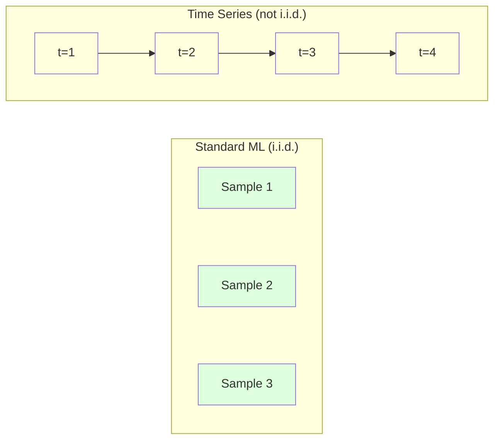
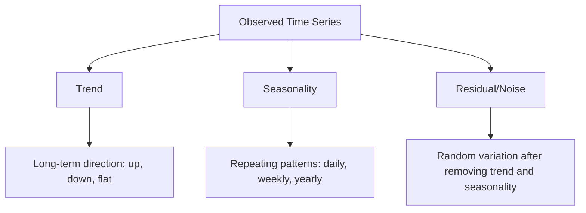
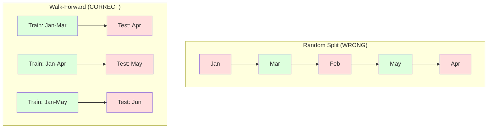

# Podstawy szeregów czasowych

> Przeszłe wyniki przewidują przyszłość -- pod warunkiem, że najpierw sprawdzisz stacjonarność.

**Type:** Build
**Language:** Python
**Prerequisites:** Phase 2, Lessons 01-09
**Time:** ~90 minutes

## Learning Objectives

- Rozłożyć szereg czasowy na trend, sezonowość i składnik resztowy oraz przetestować na stacjonarność
- Zaimplementować cechy opóźnień i statystyki kroczące, aby przekształcić szereg czasowy w problem uczenia nadzorowanego
- Zbudować framework walidacji kroczącej, który zapobiega wyciekowi przyszłych danych do treningu
- Wyjaśnić, dlaczego losowe podziały trening/test są nieprawidłowe dla szeregów czasowych i zademonstrować różnicę w wydajności względem właściwych podziałów czasowych

## The Problem

Masz dane uporządkowane według czasu. Dzienna sprzedaż, godzinowa temperatura, minutowe użycie CPU, tygodniowe ceny akcji. Chcesz przewidzieć następną wartość, następny tydzień, następny kwartał.

Sięgasz po swój standardowy zestaw narzędzi ML: losowy podział trening/test, walidację krzyżową, macierz cech na wejściu, predykcję na wyjściu. Każdy krok jest błędny.

Szeregi czasowe łamią założenia, na których polega standardowy ML. Próbki nie są niezależne -- dzisiejsza temperatura zależy od wczorajszej. Losowe podziały powodują wyciek przyszłych informacji do przeszłości. Cechy, które świetnie wypadają w backteście, zawodzą w produkcji, ponieważ polegają na wzorcach, które zmieniają się w czasie.

Model, który osiąga 95% dokładności przy losowej walidacji krzyżowej, może osiągnąć 55% przy właściwej ocenie czasowej. Różnica nie jest technicznym szczegółem. To różnica między modelem, który działa na papierze, a modelem, który działa w produkcji.

Ta lekcja obejmuje podstawy: co sprawia, że dane czasowe są inne, jak uczciwie oceniać modele i jak przekształcić szereg czasowy w cechy, które standardowe modele ML mogą konsumować.

## The Concept

### Co sprawia, że szeregi czasowe są inne

Standardowy ML zakłada i.i.d. -- niezależne i identycznie rozłożone. Każda próbka pochodzi z tego samego rozkładu, niezależnie od innych próbek. Szeregi czasowe naruszają oba założenia:

- **Nie są niezależne.** Dzisiejsza cena akcji zależy od wczorajszej. Sprzedaż w tym tygodniu koreluje z poprzednim.
- **Nie są identycznie rozłożone.** Rozkład zmienia się w czasie. Sprzedaż w grudniu wygląda inaczej niż sprzedaż w marcu.

Te naruszenia nie są drobne. Zmieniają sposób, w jaki budujesz cechy, jak oceniasz modele i które algorytmy działają.



W standardowym ML próbki są wymienne. Ich przetasowanie niczego nie zmienia. W szeregach czasowych kolejność jest wszystkim. Przetasowanie niszczy sygnał.

### Składowe szeregu czasowego

Każdy szereg czasowy jest kombinacją:



- **Trend**: Długoterminowy kierunek. Przychód rosnący o 10% rocznie. Globalna temperatura rosnąca.
- **Sezonowość**: Powtarzające się wzorce w stałych odstępach czasu. Sprzedaż detaliczna wzrasta w grudniu. Użycie klimatyzacji osiąga szczyt w lipcu.
- **Reszta**: To, co pozostaje po usunięciu trendu i sezonowości. Jeśli reszta wygląda jak biały szum, dekompozycja uchwyciła sygnał.

### Stacjonarność

Szereg czasowy jest stacjonarny, jeśli jego właściwości statystyczne (średnia, wariancja, autokorelacja) nie zmieniają się w czasie. Większość metod prognozowania zakłada stacjonarność.

**Dlaczego to ważne:** Niestacjonarny szereg ma średnią, która dryfuje. Model wytrenowany na danych ze stycznia nauczył się innej średniej niż ta, którą pokaże luty. Będzie systematycznie błędny.

**Jak sprawdzić:** Oblicz kroczącą średnią i kroczące odchylenie standardowe w oknach. Jeśli dryfują, szereg jest niestacjonarny.

**Jak naprawić:** Różnicowanie. Zamiast modelować surowe wartości, modeluj zmianę między kolejnymi wartościami:

```
diff[t] = value[t] - value[t-1]
```

Jeśli jedna runda różnicowania nie uczyni szeregu stacjonarnym, zastosuj ją ponownie (różnicowanie drugiego rzędu). Większość rzeczywistych szeregów potrzebuje co najwyżej dwóch rund.

**Przykład:**

Oryginalny szereg: [100, 102, 106, 112, 120]
Pierwsza różnica:  [2, 4, 6, 8] (wciąż trend rosnący)
Druga różnica:  [2, 2, 2] (stały -- stacjonarny)

Oryginalny szereg miał trend kwadratowy. Pierwsze różnicowanie zamieniło go w trend liniowy. Drugie różnicowanie uczyniło go płaskim. W praktyce rzadko potrzebujesz więcej niż dwóch rund.

**Test formalny:** Rozszerzony test Dickeya-Fullera (ADF) to standardowy test statystyczny na stacjonarność. Hipoteza zerowa brzmi "szereg jest niestacjonarny". Wartość p poniżej 0.05 oznacza, że możesz odrzucić hipotezę zerową i stwierdzić stacjonarność. Nie implementujemy ADF od podstaw (wymaga asymptotycznych tablic rozkładów), ale podejście z kroczącymi statystykami w naszym kodzie daje praktyczną kontrolę wizualną.

### Autokorelacja

Autokorelacja mierzy, jak bardzo wartość w czasie t koreluje z wartością w czasie t-k (k kroków w przeszłości). Funkcja autokorelacji (ACF) wykreśla tę korelację dla każdego opóźnienia k.

**ACF mówi ci:**
- Jak daleko wstecz szereg pamięta. Jeśli ACF spada do zera po opóźnieniu 5, wartości starsze niż 5 kroków są nieistotne.
- Czy istnieje sezonowość. Jeśli ACF ma skoki przy opóźnieniu 12 (dane miesięczne), istnieje sezonowość roczna.
- Ile cech opóźnień utworzyć. Użyj opóźnień do punktu, w którym ACF staje się pomijalny.

**PACF (Partial Autocorrelation Function)** usuwa pośrednie korelacje. Jeśli dzisiaj koreluje z 3 dniami temu tylko dlatego, że oba korelują z wczoraj, PACF przy opóźnieniu 3 będzie zerem, podczas gdy ACF przy opóźnieniu 3 nie będzie.

### Cechy opóźnień: przekształcanie szeregu czasowego w uczenie nadzorowane

Standardowe modele ML potrzebują macierzy cech X i celu y. Szereg czasowy daje pojedynczą kolumnę wartości. Mostem są cechy opóźnień.

Weź szereg [10, 12, 14, 13, 15] i utwórz cechy opóźnienia-1 i opóźnienia-2:

| lag_2 | lag_1 | target |
|-------|-------|--------|
| 10    | 12    | 14     |
| 12    | 14    | 13     |
| 14    | 13    | 15     |

Teraz masz standardowy problem regresji. Dowolny model ML (regresja liniowa, las losowy, gradient boosting) może przewidzieć cel z opóźnień.

Dodatkowe cechy, które możesz inżynierować:
- **Statystyki kroczące:** średnia, std, min, max z ostatnich k wartości
- **Cechy kalendarzowe:** dzień tygodnia, miesiąc, czy_święto, czy_weekend
- **Wartości różnicowane:** zmiana z poprzedniego kroku
- **Statystyki rozszerzające:** średnia skumulowana, suma skumulowana
- **Cechy ilorazowe:** bieżąca wartość / krocząca średnia (jak daleko od ostatniej średniej)
- **Cechy interakcji:** lag_1 * dzień_tygodnia (efekty dnia roboczego na momentum)

**Ile opóźnień?** Użyj funkcji autokorelacji. Jeśli ACF jest istotna do opóźnienia 10, użyj co najmniej 10 opóźnień. Jeśli istnieje sezonowość tygodniowa, uwzględnij opóźnienie 7 (a być może 14). Więcej opóźnień daje modelowi więcej historii, ale także więcej cech do dopasowania, zwiększając ryzyko przeuczenia.

**Pułapka wyrównania celu.** Podczas tworzenia cech opóźnień, cel musi być wartością w czasie t, a wszystkie cechy muszą używać wartości w czasie t-1 lub wcześniejszych. Jeśli przypadkowo uwzględnisz wartość w czasie t jako cechę, masz idealny predyktor -- i całkowicie bezużyteczny model. To najczęstszy błąd w inżynierii cech szeregów czasowych.

### Walidacja krocząca

To najważniejsza koncepcja w tej lekcji. Standardowa k-fold walidacja krzyżowa losowo przypisuje próbki do treningu i testu. W przypadku szeregów czasowych powoduje to wyciek przyszłych informacji.



Walidacja krocząca:
1. Trenuj na danych do czasu t
2. Przewiduj w czasie t+1 (lub t+1 do t+k dla wielu kroków)
3. Przesuń okno do przodu
4. Powtórz

Każdy fold testowy zawiera tylko dane, które występują po wszystkich danych treningowych. Żaden wyciek przyszłości. To daje uczciwe oszacowanie, jak model będzie działał po wdrożeniu.

**Okno rozszerzające** używa wszystkich historycznych danych do treningu (okno rośnie). **Okno przesuwne** używa okna treningowego o stałym rozmiarze (okno się przesuwa). Używaj okna rozszerzającego, gdy wierzysz, że starsze dane są wciąż istotne. Używaj okna przesuwnego, gdy świat się zmienia, a stare dane szkodzą.

### Intuicja ARIMA

ARIMA to klasyczny model szeregów czasowych. Ma trzy składowe:

- **AR (Autoregresyjny):** Przewiduje z przeszłych wartości. AR(p) używa ostatnich p wartości.
- **I (Zintegrowany):** Różnicowanie w celu osiągnięcia stacjonarności. I(d) stosuje d rund różnicowania.
- **MA (Średnia ruchoma):** Przewiduje z przeszłych błędów prognozy. MA(q) używa ostatnich q błędów.

ARIMA(p, d, q) łączy wszystkie trzy. Wybierasz p, d, q na podstawie analizy ACF/PACF lub automatycznego wyszukiwania (auto-ARIMA).

Nie będziemy implementować ARIMA od podstaw -- wymaga optymalizacji numerycznej, która wykracza poza zakres tej lekcji. Kluczowym wglądem jest zrozumienie, co robi każda składowa, abyś mógł interpretować wyniki ARIMA i wiedzieć, kiedy go użyć.

### Kiedy czego użyć

| Podejście | Najlepsze do | Obsługuje sezonowość | Obsługuje cechy zewnętrzne |
|----------|---------|-------------------|------------------------|
| Cechy opóźnień + ML | Tabelaryczne z wieloma cechami zewnętrznymi | Z cechami kalendarzowymi | Tak |
| ARIMA | Pojedynczy jednowymiarowy szereg, krótki okres | Wariant SARIMA | Nie (ARIMAX dla ograniczonego) |
| Wygładzanie wykładnicze | Prosty trend + sezonowość | Tak (Holt-Winters) | Nie |
| Prophet | Prognozowanie biznesowe, święta | Tak (wyrazy Fouriera) | Ograniczone |
| Sieci neuronowe (LSTM, Transformer) | Długie sekwencje, wiele szeregów | Uczone | Tak |

Dla większości praktycznych problemów, cechy opóźnień + gradient boosting to najsilniejszy punkt startowy. Naturalnie obsługuje cechy zewnętrzne, nie wymaga stacjonarności i jest łatwy do debugowania.

### Horyzonty prognozowania i strategie

Prognozowanie jednokrokowe przewiduje jeden krok czasowy naprzód. Prognozowanie wielokrokowe przewiduje wiele kroków. Są trzy strategie:

**Rekurencyjna (iterowana):** Przewiduj jeden krok naprzód, użyj predykcji jako wejścia dla następnego kroku. Prosta, ale błędy się akumulują -- każda predykcja używa poprzedniej predykcji, więc błędy się kumulują.

**Bezpośrednia:** Trenuj osobny model dla każdego horyzontu. Model-1 przewiduje t+1, Model-5 przewiduje t+5. Brak akumulacji błędów, ale każdy model ma mniej próbek treningowych i nie dzielą się informacjami.

**Wielowyjściowa:** Trenuj jeden model, który generuje wszystkie horyzonty jednocześnie. Dzieli informacje między horyzontami, ale wymaga modelu obsługującego wiele wyjść (lub własnej funkcji straty).

Dla większości praktycznych problemów, zacznij od rekurencyjnej dla krótkich horyzontów (1-5 kroków) i bezpośredniej dla dłuższych horyzontów.

### Typowe błędy w szeregach czasowych

| Błąd | Dlaczego się zdarza | Jak naprawić |
|---------|---------------|-----------|
| Losowy podział trening/test | Nawyk ze standardowego ML | Użyj walidacji kroczącej lub podziału czasowego |
| Używanie przyszłych cech | Cecha w czasie t uwzględniona przez pomyłkę | Audytuj każdą cechę pod kątem wyrównania czasowego |
| Przeuczenie do sezonowości | Model zapamiętuje wzorce kalendarzowe | Wydziel pełny cykl sezonowy w zbiorze testowym |
| Ignorowanie zmian skali | Przychód się podwaja, ale wzorce pozostają | Modeluj zmianę procentową zamiast bezwzględnej |
| Zbyt wiele cech opóźnień | "Więcej historii znaczy lepiej" | Użyj ACF do określenia istotnych opóźnień |
| Brak różnicowania | "Model sobie poradzi" | Modele drzewiaste radzą sobie z trendami; modele liniowe potrzebują stacjonarności |

## Build It

Kod w `code/time_series.py` implementuje podstawowe bloki budulcowe od podstaw.

### Kreator cech opóźnień

```python
def make_lag_features(series, n_lags):
    n = len(series)
    X = np.full((n, n_lags), np.nan)
    for lag in range(1, n_lags + 1):
        X[lag:, lag - 1] = series[:-lag]
    valid = ~np.isnan(X).any(axis=1)
    return X[valid], series[valid]
```

To konwertuje jednowymiarowy szereg na macierz cech, gdzie każdy wiersz ma ostatnie `n_lags` wartości jako cechy, a bieżąca wartość jako cel.

### Walidacja krzyżowa krocząca

```python
def walk_forward_split(n_samples, n_splits=5, min_train=50):
    assert min_train < n_samples, "min_train must be less than n_samples"
    step = max(1, (n_samples - min_train) // n_splits)
    for i in range(n_splits):
        train_end = min_train + i * step
        test_end = min(train_end + step, n_samples)
        if train_end >= n_samples:
            break
        yield slice(0, train_end), slice(train_end, test_end)
```

Każdy podział zapewnia, że dane treningowe występują ściśle przed danymi testowymi. Okno treningowe rozszerza się z każdym foldem.

### Prosty model autoregresyjny

Czysty model AR to po prostu regresja liniowa na cechach opóźnień:

```python
class SimpleAR:
    def __init__(self, n_lags=5):
        self.n_lags = n_lags
        self.weights = None
        self.bias = None

    def fit(self, series):
        X, y = make_lag_features(series, self.n_lags)
        # Solve via normal equations
        X_b = np.column_stack([np.ones(len(X)), X])
        theta = np.linalg.lstsq(X_b, y, rcond=None)[0]
        self.bias = theta[0]
        self.weights = theta[1:]
        return self
```

To koncepcyjnie identyczne z regresją liniową z Lekcji 02, ale zastosowane do opóźnionych w czasie wersji tej samej zmiennej.

### Sprawdzanie stacjonarności

Kod oblicza kroczące statystyki, aby wizualnie i numerycznie ocenić stacjonarność:

```python
def check_stationarity(series, window=50):
    rolling_mean = np.array([
        series[max(0, i - window):i].mean()
        for i in range(1, len(series) + 1)
    ])
    rolling_std = np.array([
        series[max(0, i - window):i].std()
        for i in range(1, len(series) + 1)
    ])
    return rolling_mean, rolling_std
```

Jeśli krocząca średnia dryfuje lub kroczące std się zmienia, szereg jest niestacjonarny. Zastosuj różnicowanie i sprawdź ponownie.

Kod sprawdza również stacjonarność, porównując pierwszą połowę i drugą połowę szeregu. Jeśli średnie różnią się o więcej niż pół odchylenia standardowego lub iloraz wariancji przekracza 2x, szereg jest oznaczony jako niestacjonarny.

### Autokorelacja

```python
def autocorrelation(series, max_lag=20):
    n = len(series)
    mean = series.mean()
    var = series.var()
    acf = np.zeros(max_lag + 1)
    for k in range(max_lag + 1):
        cov = np.mean((series[:n-k] - mean) * (series[k:] - mean))
        acf[k] = cov / var if var > 0 else 0
    return acf
```

## Use It

Z sklearn używasz cech opóźnień bezpośrednio z dowolnym regresorem:

```python
from sklearn.linear_model import Ridge
from sklearn.ensemble import GradientBoostingRegressor

X, y = make_lag_features(series, n_lags=10)

for train_idx, test_idx in walk_forward_split(len(X)):
    model = Ridge(alpha=1.0)
    model.fit(X[train_idx], y[train_idx])
    predictions = model.predict(X[test_idx])
```

Dla ARIMA, użyj statsmodels:

```python
from statsmodels.tsa.arima.model import ARIMA

model = ARIMA(train_series, order=(5, 1, 2))
fitted = model.fit()
forecast = fitted.forecast(steps=30)
```

Kod w `time_series.py` demonstruje oba podejścia i porównuje je przy użyciu walidacji kroczącej.

### TimeSeriesSplit z sklearn

sklearn udostępnia `TimeSeriesSplit`, który implementuje walidację kroczącą:

```python
from sklearn.model_selection import TimeSeriesSplit

tscv = TimeSeriesSplit(n_splits=5)
for train_index, test_index in tscv.split(X):
    X_train, X_test = X[train_index], X[test_index]
    y_train, y_test = y[train_index], y[test_index]
    model.fit(X_train, y_train)
    score = model.score(X_test, y_test)
```

To jest odpowiednik naszego `walk_forward_split` od podstaw, ale zintegrowany z frameworkiem walidacji krzyżowej sklearn. Możesz go używać z `cross_val_score`:

```python
from sklearn.model_selection import cross_val_score

scores = cross_val_score(model, X, y, cv=TimeSeriesSplit(n_splits=5))
print(f"Mean score: {scores.mean():.4f} +/- {scores.std():.4f}")
```

### Metryki ewaluacji

Prognozowanie szeregów czasowych używa metryk regresji, ale ze świadomością kontekstu czasowego:

- **MAE (Mean Absolute Error):** Średnia z |y_true - y_pred|. Łatwa do interpretacji w oryginalnych jednostkach. "Średnio, predykcje różnią się o 3.2 stopnia."
- **RMSE (Root Mean Squared Error):** Pierwiastek kwadratowy ze średniego błędu kwadratowego. Karze duże błędy bardziej niż MAE. Używaj, gdy duże błędy są gorsze niż wiele małych błędów.
- **MAPE (Mean Absolute Percentage Error):** Średnia z |błąd / prawdziwa_wartość| * 100. Niezależna od skali, przydatna do porównywania różnych szeregów. Ale niezdefiniowana, gdy prawdziwe wartości są zerowe.
- **Porównanie z naiwnym baseline:** Zawsze porównuj z prostymi baseline'ami. Sezonowy naiwny baseline przewiduje wartość sprzed jednego okresu (wczoraj, ostatni tydzień). Jeśli twój model nie może pokonać naiwnego, coś jest nie tak.

### Cechy kroczące

Kod demonstruje dodawanie statystyk kroczących (średnia, std, min, max w oknach 7 i 14 dni) do cech opóźnień. Dają one modelowi informacje o ostatnich trendach i zmienności, których same cechy opóźnień nie wychwytują.

Na przykład, jeśli krocząca średnia rośnie, sugeruje to trend wzrostowy. Jeśli kroczące std rośnie, sugeruje rosnącą zmienność. To są rodzaje wzorców, których modele oparte na drzewach mogą się nauczyć, ale modele liniowe nie.

## Ship It

Ta lekcja produkuje:
- `outputs/prompt-time-series-advisor.md` -- prompt do ramowania problemów szeregów czasowych
- `code/time_series.py` -- cechy opóźnień, walidacja krocząca, model AR, sprawdzanie stacjonarności

### Baseline'y, które musisz pokonać

Przed zbudowaniem jakiegokolwiek modelu, ustal baseline'y:

1. **Ostatnia wartość (persistence).** Przewiduj, że jutro będzie takie samo jak dzisiaj. Dla wielu szeregów jest to zaskakująco trudne do pokonania.
2. **Sezonowy naiwny.** Przewiduj, że dzisiaj będzie takie samo jak tego samego dnia w zeszłym tygodniu (lub zeszłym roku). Jeśli twój model nie może tego pokonać, nie nauczył się żadnego użytecznego wzorca poza sezonowością.
3. **Średnia ruchoma.** Przewiduj średnią z ostatnich k wartości. Wygładza szum, ale nie może wychwycić nagłych zmian.

Jeśli twój wymyślny model ML przegrywa z sezonowym naiwnym baseline'em, masz błąd. Najczęściej: wyciek przyszłości w cechach, niewłaściwa metoda ewaluacji lub szereg jest naprawdę losowy i nieprzewidywalny.

### Praktyczne wskazówki

1. **Zacznij od wykresu.** Przed jakimkolwiek modelowaniem, narysuj surowy szereg. Szukaj trendów, sezonowości, wartości odstających, zmian strukturalnych (nagłe zmiany w zachowaniu). 30-sekundowa inspekcja wizualna często mówi więcej niż godzina automatycznej analizy.

2. **Najpierw różnicuj, potem modeluj.** Jeśli szereg ma wyraźny trend, różnicuj go przed utworzeniem cech opóźnień. Modele drzewiaste radzą sobie z trendami, ale modele liniowe nie, a różnicowanie nigdy nie szkodzi.

3. **Wydziel co najmniej jeden pełny cykl sezonowy.** Jeśli masz sezonowość tygodniową, twój zbiór testowy potrzebuje co najmniej jednego pełnego tygodnia. Jeśli miesięczną, co najmniej jednego pełnego miesiąca. W przeciwnym razie nie możesz ocenić, czy model uchwycił wzorzec sezonowy.

4. **Monitoruj w produkcji.** Modele szeregów czasowych degradują się w czasie, gdy świat się zmienia. Śledź błędy predykcji na bieżąco. Kiedy błędy zaczynają rosnąć, trenuj model ponownie na najnowszych danych.

5. **Uważaj na zmiany reżimu.** Model wytrenowany na danych sprzed pandemii nie przewidzi zachowań po pandemii. Dołącz wskaźniki znanych zmian reżimu jako cechy lub użyj przesuwnego okna, które zapomina stare dane.

6. **Transformuj logarytmicznie skośne szeregi.** Przychód, ceny i zliczenia są często prawoskośne. Logarytm stabilizuje wariancję i sprawia, że wzorce multiplikatywne stają się addytywne, z czym modele liniowe sobie radzą. Prognozuj w przestrzeni logarytmicznej, a następnie eksponentuj, aby wrócić do oryginalnych jednostek.

## Exercises

1. **Eksperyment ze stacjonarnością.** Wygeneruj szereg z trendem liniowym. Sprawdź stacjonarność za pomocą kroczących statystyk. Zastosuj pierwsze różnicowanie. Sprawdź ponownie. Ile rund różnicowania potrzeba dla trendu kwadratowego?

2. **Wybór opóźnień.** Oblicz ACF na sezonowym szeregu (okres=7). Które opóźnienia mają najwyższą autokorelację? Utwórz cechy opóźnień używając tylko tych opóźnień (nie kolejnych opóźnień). Czy dokładność poprawia się w porównaniu z używaniem opóźnień 1 do 7?

3. **Walidacja krocząca vs losowy podział.** Trenuj regresję Ridge na cechach opóźnień. Oceń za pomocą losowego podziału 80/20 i walidacji kroczącej. O ile losowy podział przeszacowuje wydajność?

4. **Inżynieria cech.** Dodaj kroczącą średnią (okno=7), kroczące std (okno=7) i cechy dnia tygodnia do cech opóźnień. Porównaj dokładność z i bez tych dodatków używając walidacji kroczącej.

5. **Prognozowanie wielokrokowe.** Zmodyfikuj model AR, aby przewidywał 5 kroków naprzód zamiast 1. Porównaj dwie strategie: (a) przewiduj jeden krok, użyj predykcji jako wejścia dla następnego kroku (rekurencyjna) i (b) trenuj osobne modele dla każdego horyzontu (bezpośrednia). Która jest dokładniejsza?

## Key Terms

| Term | What people say | What it actually means |
|------|----------------|----------------------|
| Stacjonarność | "Statystyki nie zmieniają się w czasie" | Szereg, którego średnia, wariancja i struktura autokorelacji są stałe w czasie |
| Różnicowanie | "Odejmij kolejne wartości" | Obliczanie y[t] - y[t-1] w celu usunięcia trendów i osiągnięcia stacjonarności |
| Autokorelacja (ACF) | "Jak szereg koreluje sam ze sobą" | Korelacja między szeregiem czasowym a jego opóźnioną kopią, jako funkcja opóźnienia |
| Częściowa autokorelacja (PACF) | "Tylko bezpośrednia korelacja" | Autokorelacja przy opóźnieniu k po usunięciu efektu wszystkich krótszych opóźnień |
| Cechy opóźnień | "Przeszłe wartości jako wejścia" | Używanie y[t-1], y[t-2], ..., y[t-k] jako cech do przewidzenia y[t] |
| Walidacja krocząca | "Walidacja krzyżowa z poszanowaniem czasu" | Ewaluacja, gdzie dane treningowe zawsze poprzedzają dane testowe chronologicznie |
| ARIMA | "Klasyczny model szeregów czasowych" | AutoRegresyjna Zintegrowana Średnia Ruchoma: łączy przeszłe wartości (AR), różnicowanie (I) i przeszłe błędy (MA) |
| Sezonowość | "Powtarzające się wzorce kalendarzowe" | Regularne, przewidywalne cykle w szeregu czasowym powiązane z okresami kalendarzowymi (dzienne, tygodniowe, roczne) |
| Trend | "Długoterminowy kierunek" | Trwały wzrost lub spadek poziomu szeregu w czasie |
| Okno rozszerzające | "Użyj całej historii" | Walidacja krocząca, gdzie zbiór treningowy rośnie z każdym foldem |
| Okno przesuwne | "Historia o stałym rozmiarze" | Walidacja krocząca, gdzie zbiór treningowy jest oknem o stałej długości, które przesuwa się do przodu |

## Further Reading

- [Hyndman and Athanasopoulos, Forecasting: Principles and Practice (3rd ed.)](https://otexts.com/fpp3/) -- the best free textbook on time series forecasting
- [scikit-learn Time Series Split](https://scikit-learn.org/stable/modules/generated/sklearn.model_selection.TimeSeriesSplit.html) -- sklearn's walk-forward splitter
- [statsmodels ARIMA docs](https://www.statsmodels.org/stable/generated/statsmodels.tsa.arima.model.ARIMA.html) -- ARIMA implementation with diagnostics
- [Makridakis et al., The M5 Competition (2022)](https://www.sciencedirect.com/science/article/pii/S0169207021001874) -- large-scale forecasting competition showing ML methods vs statistical methods