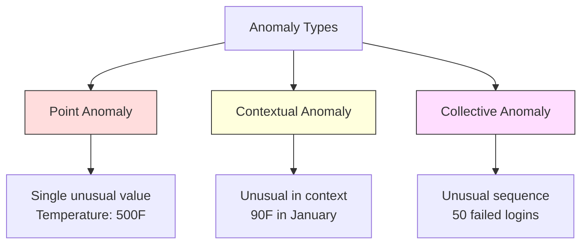
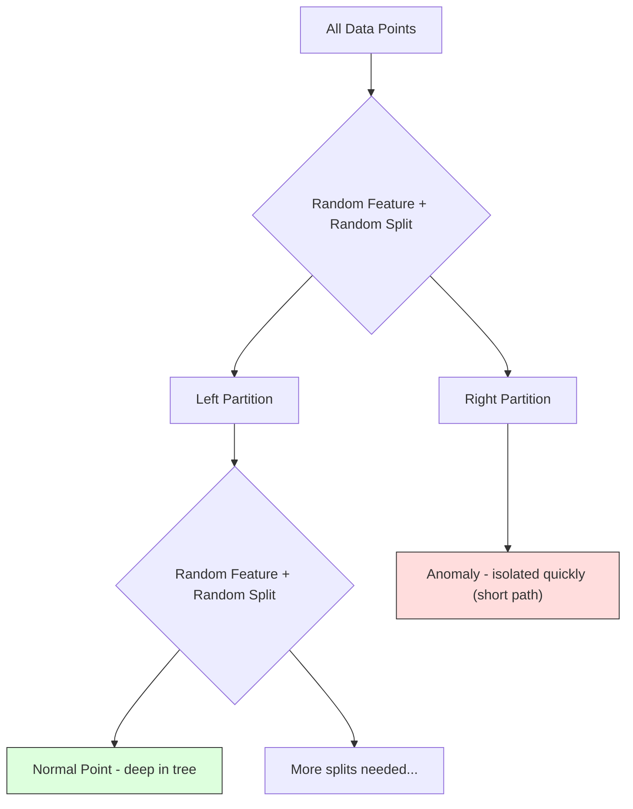
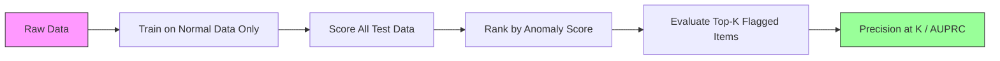

# Wykrywanie Anomalii

> Normalność łatwo zdefiniować. Anomalia to wszystko, co nie pasuje.

**Type:** Build
**Language:** Python
**Prerequisites:** Phase 2, Lessons 01-09
**Time:** ~75 minutes

## Learning Objectives

- Zaimplementuj metody Z-score, IQR oraz Isolation Forest do wykrywania anomalii od podstaw
- Rozróżniaj anomalie punktowe, kontekstowe i kolektywne oraz dobieraj odpowiednią metodę detekcji dla każdej z nich
- Wyjaśnij, dlaczego wykrywanie anomalii jest formułowane jako modelowanie danych normalnych, a nie klasyfikowanie anomalii
- Porównaj nienadzorowane wykrywanie anomalii z nadzorowaną klasyfikacją i oceń kompromis między pokryciem nowych anomalii a precyzją

## The Problem

Karta kredytowa jest użyta w Nowym Jorku o 14:00, a następnie w Tokio o 14:05. Czujnik fabryczny odczytuje 150 stopni, podczas gdy normalny zakres to 80-120. Serwer wysyła 50 000 żądań na sekundę, gdy dzienna średnia wynosi 200.

To są anomalie. Znajdowanie ich ma znaczenie. Oszustwa kosztują miliardy. Awarie sprzętu kosztują przestoje. Włamania do sieci kosztują dane.

Wyzwanie: rzadko masz oznaczone przykłady anomalii. Oszustwa stanowią 0,1% transakcji. Awarie sprzętu zdarzają się kilka razy w roku. Nie możesz wytrenować standardowego klasyfikatora, ponieważ w klasie „anomalia" prawie nie ma danych do uczenia. Nawet jeśli masz kilka etykiet, anomalie, które widziałeś, nie są jedynymi typami, jakie napotkasz. Jutrzejszy schemat oszustwa będzie wyglądał inaczej niż dzisiejszy.

Wykrywanie anomalii odwraca problem. Zamiast uczyć się, co jest nieprawidłowe, ucz się, co jest normalne. Wszystko, co odbiega od normy, jest podejrzane. Działa to bez etykiet, dostosowuje się do nowych typów anomalii i skaluje do ogromnych zbiorów danych.

## The Concept

### Types of Anomalies

Nie wszystkie anomalie są takie same:

- **Anomalie punktowe.** Pojedynczy punkt danych, który jest nietypowy niezależnie od kontekstu. Odczyt temperatury 500 stopni. Transakcja na 50 000 $ na koncie, które zwykle wydaje 50 $.
- **Anomalie kontekstowe.** Punkt danych, który jest nietypowy w danym kontekście. Temperatura 90 stopni jest normalna latem, anomalna zimą. Ta sama wartość, inny kontekst.
- **Anomalie kolektywne.** Sekwencja punktów danych, która jest nietypowa jako grupa, mimo że każdy pojedynczy punkt może być normalny. Pięć nieudanych logowań jest normalne. Pięćdziesiąt pod rząd to atak brute-force.

Większość metod wykrywa anomalie punktowe. Anomalie kontekstowe wymagają cech czasowych lub lokalizacyjnych. Anomalie kolektywne wymagają metod świadomych sekwencji.



### The Unsupervised Framing

W standardowej klasyfikacji masz etykiety dla obu klas. W wykrywaniu anomalii zazwyczaj masz jedną z trzech sytuacji:

1. **W pełni nienadzorowane.** Brak etykiet. Dopasowujesz detektor na wszystkich danych i masz nadzieję, że anomalie są na tyle rzadkie, że nie zepsują modelu „normalności".
2. **Półnadzorowane.** Masz czysty zbiór danych tylko z normalnymi danymi. Dopasowujesz na tym czystym zbiorze i oceniasz wszystko inne. To najsilniejsze ustawienie, gdy jest możliwe.
3. **Słabo nadzorowane.** Masz kilka oznaczonych anomalii. Użyj ich do ewaluacji, nie do trenowania. Trenuj nienadzorowanie, a następnie mierz precyzję/czułość na oznaczonym podzbiorze.

Kluczowy wgląd: wykrywanie anomalii zasadniczo różni się od klasyfikacji. Modelujesz rozkład normalnych danych, a nie granicę decyzyjną między dwiema klasami.

### Supervised vs Unsupervised: The Tradeoff

Jeśli masz oznaczone anomalie, czy powinieneś ich użyć do trenowania (klasyfikacja nadzorowana) czy tylko do ewaluacji (detekcja nienadzorowana)?

**Nadzorowane (traktuj jako klasyfikację):**
- Łapie dokładnie te typy anomalii, które widziałeś wcześniej
- Wyższa precyzja na znanych typach anomalii
- Całkowicie pomija nowe typy anomalii
- Wymaga ponownego trenowania, gdy pojawią się nowe typy anomalii
- Potrzebuje wystarczająco dużo przykładów anomalii (często zbyt mało)

**Nienadzorowane (modeluj normalność, oznaczaj odchylenia):**
- Łapie każde odchylenie od normy, w tym nowe typy
- Nie wymaga oznaczonych anomalii
- Wyższy wskaźnik fałszywych alarmów (nie wszystko, co nietypowe, jest złe)
- Bardziej odporne na zmiany rozkładu

W praktyce najlepsze systemy łączą oba podejścia: detekcja nienadzorowana dla szerokiego pokrycia, modele nadzorowane dla znanych typów anomalii o wysokim priorytecie oraz przegląd ludzki dla przypadków niejednoznacznych.

### Z-Score Method

Najprostsze podejście. Oblicz średnią i odchylenie standardowe każdej cechy. Oznacz każdy punkt oddalony o więcej niż k odchyleń standardowych od średniej.

```text
z_score = (x - mean) / std
anomaly if |z_score| > threshold
```

Domyślny próg to 3.0 (99,7% normalnych danych mieści się w 3 odchyleniach standardowych dla rozkładu Gaussa).

**Zalety:** Proste. Szybkie. Interpretowalne („ta wartość jest 4,5 odchylenia standardowego od normy").

**Wady:** Zakłada, że dane mają rozkład normalny. Wrażliwe na wartości odstające w danych treningowych (odstające przesuwają średnią i zawyżają odchylenie standardowe, utrudniając ich wykrycie). Nie działa na rozkładach wielomodalnych.

**Kiedy działa dobrze:** Monitorowanie pojedynczej cechy, gdzie dane mają w przybliżeniu kształt dzwonu. Czasy odpowiedzi serwera, tolerancje produkcyjne, odczyty czujników ze stabilną bazą.

**Kiedy zawodzi:** Dane z wieloma skupieniami (dwie lokalizacje biur z różnymi temperaturami bazowymi), dane skośne (kwoty transakcji, gdzie 1000 $ jest rzadkie, ale nie anomalne), dane z wartościami odstającymi w zbiorze treningowym.

### IQR Method

Bardziej odporna niż Z-score. Używa rozstępu międzykwartylowego zamiast średniej i odchylenia standardowego.

```
Q1 = 25th percentile
Q3 = 75th percentile
IQR = Q3 - Q1
lower_bound = Q1 - factor * IQR
upper_bound = Q3 + factor * IQR
anomaly if x < lower_bound or x > upper_bound
```

Domyślny współczynnik to 1.5.

**Zalety:** Odporna na wartości odstające (percentyle nie są dotknięte ekstremalnymi wartościami). Działa na rozkładach skośnych. Brak założenia normalności.

**Wady:** Tylko jednowymiarowa (stosowana do każdej cechy niezależnie). Nie wykrywa anomalii, które są nietypowe tylko przy rozpatrywaniu cech razem (punkt może być normalny dla każdej cechy z osobna, ale anomalny w przestrzeni łącznej).

**Uwaga praktyczna:** Współczynnik 1.5 w IQR odpowiada wąsom na wykresie pudełkowym. Punkty poza wąsami to potencjalne odstające. Użycie 3.0 zamiast 1.5 sprawia, że detektor jest bardziej konserwatywny (mniej flag, mniej fałszywych alarmów). Odpowiedni współczynnik zależy od tolerancji na fałszywe alarmy.

### Isolation Forest

Kluczowy wgląd: anomalie są nieliczne i odmienne. Przy losowym partycjonowaniu danych anomalie są łatwiejsze do wyizolowania — potrzebują mniej losowych podziałów, aby zostać oddzielone od reszty.



**Jak to działa:**
1. Zbuduj wiele losowych drzew (las izolujący)
2. W każdym węźle wybierz losową cechę i losową wartość podziału między min a max tej cechy
3. Dziel, aż każdy punkt będzie wyizolowany (we własnym liściu)
4. Anomalie mają krótsze średnie ścieżki we wszystkich drzewach

**Dlaczego to działa:** Normalne punkty znajdują się w gęstych regionach. Potrzeba wielu losowych podziałów, aby wyizolować jeden z nich od sąsiadów. Anomalie znajdują się w rzadkich regionach. Jeden lub dwa losowe podziały wystarczą, aby je wyizolować.

Wynik anomalii opiera się na średniej długości ścieżki we wszystkich drzewach, znormalizowanej przez oczekiwaną długość ścieżki losowego drzewa wyszukiwania binarnego:

```
score(x) = 2^(-average_path_length(x) / c(n))
```

Gdzie `c(n)` to oczekiwana długość ścieżki dla n próbek. Wynik bliski 1 oznacza anomalię. Wynik bliski 0,5 oznacza normalność. Wynik bliski 0 oznacza bardzo normalny (głęboko w gęstych skupieniach).

**Zalety:** Brak założeń co do rozkładu. Działa w wysokich wymiarach. Skaluje się dobrze (podliniowo względem rozmiaru próbki, ponieważ każde drzewo używa podpróbki). Obsługuje mieszane typy cech.

**Wady:** Radzi sobie słabo z anomaliami w gęstych regionach (efekt maskowania). Losowe dzielenie jest mniej skuteczne, gdy wiele cech jest nieistotnych.

**Kluczowe hiperparametry:**
- `n_estimators`: Liczba drzew. 100 zwykle wystarcza. Więcej drzew daje bardziej stabilne wyniki, ale wolniejsze obliczenia.
- `max_samples`: Liczba próbek na drzewo. 256 to domyślna wartość w oryginalnej publikacji. Mniejsze wartości sprawiają, że poszczególne drzewa są mniej dokładne, ale zwiększają różnorodność. Próbkowanie to właśnie czyni Isolation Forest szybkim — każde drzewo widzi mały fragment danych.
- `contamination`: Oczekiwany ułamek anomalii. Używany tylko do ustawienia progu. Nie wpływa na same wyniki.

### Local Outlier Factor (LOF)

LOF porównuje lokalną gęstość wokół punktu do gęstości wokół jego sąsiadów. Punkt w rzadkim regionie otoczony gęstymi regionami jest anomalny.

**Jak to działa:**
1. Dla każdego punktu znajdź jego k najbliższych sąsiadów
2. Oblicz lokalną gęstość osiągalności (jak gęste jest sąsiedztwo)
3. Porównaj gęstość każdego punktu z gęstościami jego sąsiadów
4. Jeśli punkt ma znacznie niższą gęstość niż jego sąsiedzi, jest odstający

**Wynik LOF:**
- LOF bliski 1.0 oznacza podobną gęstość do sąsiadów (normalny)
- LOF większy niż 1.0 oznacza niższą gęstość niż sąsiedzi (potencjalnie anomalny)
- LOF znacznie większy niż 1.0 (np. 2.0+) oznacza znacząco niższą gęstość (prawdopodobnie anomalia)

Część „lokalna" jest kluczowa. Rozważmy zbiór danych z dwoma skupieniami: gęste skupienie 1000 punktów i rzadkie skupienie 50 punktów. Punkt na skraju rzadkiego skupienia nie jest globalnie nietypowy — ma 50 sąsiadów. Ale jest lokalnie nietypowy, jeśli jego bezpośredni sąsiedzi są gęstsi od niego. LOF wychwytuje tę subtelność, którą metody globalne pomijają.

**Zalety:** Wykrywa lokalne anomalie (punkty nietypowe w swoim sąsiedztwie, nawet jeśli nie są globalnie nietypowe). Działa na skupieniach o różnej gęstości.

**Wady:** Wolne na dużych zbiorach danych (O(n^2) dla naiwnej implementacji). Wrażliwe na wybór k. Nie działa dobrze w bardzo wysokich wymiarach (przekleństwo wymiarowości wpływa na obliczenia odległości).

### Comparison

| Method | Assumptions | Speed | Handles High Dims | Detects Local Anomalies |
|--------|------------|-------|-------------------|------------------------|
| Z-score | Normal distribution | Very fast | Yes (per feature) | No |
| IQR | None (per feature) | Very fast | Yes (per feature) | No |
| Isolation Forest | None | Fast | Yes | Partially |
| LOF | Distance is meaningful | Slow | Poorly | Yes |

### Evaluation Challenges

Ocena detektorów anomalii jest trudniejsza niż ocena klasyfikatorów:

- **Ekstremalny brak równowagi klas.** Przy 0,1% anomalii przewidywanie „normalny" dla wszystkiego daje 99,9% dokładności. Dokładność jest bezużyteczna.
- **AUROC jest mylące.** Przy silnym braku równowagi AUROC może wyglądać dobrze, nawet gdy model pomija większość anomalii przy praktycznych progach.
- **Lepsze metryki:** Precision@k (spośród k najlepiej oznaczonych elementów, ile to rzeczywiste anomalie), AUPRC (pole pod krzywą precyzji-czułości) oraz czułość przy ustalonym wskaźniku fałszywych alarmów.



### Anomaly Detection Pipeline

W praktyce wykrywanie anomalii przebiega według tego schematu:

1. **Zbierz dane bazowe.** Najlepiej okres, w którym wiesz, że nie ma (lub jest bardzo mało) anomalii.
2. **Inżynieria cech.** Surowe cechy plus cechy pochodne (statystyki kroczące, cechy czasowe, proporcje).
3. **Trenuj detektor.** Dopasuj na danych bazowych. Model uczy się, jak wygląda „normalność".
4. **Oceń nowe dane.** Każda nowa obserwacja otrzymuje wynik anomalii.
5. **Wybór progu.** Wybierz punkt odcięcia wyniku. To decyzja biznesowa: wyższy próg oznacza mniej fałszywych alarmów, ale więcej przeoczonych anomalii.
6. **Alertuj i badaj.** Oznaczone punkty trafiają do przeglądu ludzkiego lub automatycznej odpowiedzi.
7. **Zbieraj informacje zwrotne.** Rejestruj, czy oznaczone elementy były prawdziwymi anomaliami czy fałszywymi alarmami. Użyj tych danych do oceny detektora i dostrojenia progu w czasie.

Potok nigdy nie jest „skończony". Rozkłady danych się przesuwają, pojawiają się nowe typy anomalii, a progi wymagają dostosowania. Traktuj wykrywanie anomalii jako żywy system, a nie model jednorazowy.

## Build It

Kod w `code/anomaly_detection.py` implementuje Z-score, IQR oraz Isolation Forest od podstaw.

### Z-Score Detector

```python
def zscore_detect(X, threshold=3.0):
    mean = X.mean(axis=0)
    std = X.std(axis=0)
    std[std == 0] = 1.0
    z = np.abs((X - mean) / std)
    return z.max(axis=1) > threshold
```

Prosty i zwektoryzowany. Oznacza punkt, jeśli którakolwiek cecha przekracza próg.

### IQR Detector

```python
def iqr_detect(X, factor=1.5):
    q1 = np.percentile(X, 25, axis=0)
    q3 = np.percentile(X, 75, axis=0)
    iqr = q3 - q1
    iqr[iqr == 0] = 1.0
    lower = q1 - factor * iqr
    upper = q3 + factor * iqr
    outside = (X < lower) | (X > upper)
    return outside.any(axis=1)
```

### Isolation Forest from Scratch

Implementacja od podstaw buduje drzewa izolujące, które losowo dzielą przestrzeń cech:

```python
class IsolationTree:
    def __init__(self, max_depth):
        self.max_depth = max_depth

    def fit(self, X, depth=0):
        n, p = X.shape
        if depth >= self.max_depth or n <= 1:
            self.is_leaf = True
            self.size = n
            return self
        self.is_leaf = False
        self.feature = np.random.randint(p)
        x_min = X[:, self.feature].min()
        x_max = X[:, self.feature].max()
        if x_min == x_max:
            self.is_leaf = True
            self.size = n
            return self
        self.threshold = np.random.uniform(x_min, x_max)
        left_mask = X[:, self.feature] < self.threshold
        self.left = IsolationTree(self.max_depth).fit(X[left_mask], depth + 1)
        self.right = IsolationTree(self.max_depth).fit(X[~left_mask], depth + 1)
        return self
```

Długość ścieżki do wyizolowania punktu określa jego wynik anomalii. Krótsze ścieżki oznaczają większą anomalność.

Klasa `IsolationForest` opakowuje wiele drzew:

```python
class IsolationForest:
    def __init__(self, n_estimators=100, max_samples=256, seed=42):
        self.n_estimators = n_estimators
        self.max_samples = max_samples

    def fit(self, X):
        sample_size = min(self.max_samples, X.shape[0])
        max_depth = int(np.ceil(np.log2(sample_size)))
        for _ in range(self.n_estimators):
            idx = rng.choice(X.shape[0], size=sample_size, replace=False)
            tree = IsolationTree(max_depth=max_depth)
            tree.fit(X[idx])
            self.trees.append(tree)

    def anomaly_score(self, X):
        avg_path = average path length across all trees
        scores = 2.0 ** (-avg_path / c(max_samples))
        return scores
```

Współczynnik normalizacji `c(n)` to oczekiwana długość ścieżki nieudanego wyszukiwania w drzewie wyszukiwania binarnego z n elementami. Wynosi `2 * H(n-1) - 2*(n-1)/n`, gdzie `H` to liczba harmoniczna. Ta normalizacja zapewnia porównywalność wyników między zbiorami danych o różnych rozmiarach.

### Demo Scenarios

Kod generuje wiele scenariuszy testowych:

1. **Pojedyncze skupienie z odstającymi.** Dwuwymiarowe skupienie Gaussa z anomaliami wstrzykniętymi daleko od środka. Wszystkie metody powinny tu działać.
2. **Dane wielomodalne.** Trzy skupienia o różnych rozmiarach i gęstościach. Punkty między skupieniami są anomalne. Z-score ma trudności, ponieważ zakresy poszczególnych cech są szerokie.
3. **Dane wysokowymiarowe.** 50 cech, ale anomalie różnią się tylko w 5 z nich. Testuje, czy metody potrafią znaleźć anomalie w podzbiorze cech.

Każde demo porównuje wszystkie metody przy użyciu precyzji, czułości, F1 oraz Precision@k.

## Use It

Z sklearn (używając implementacji bibliotecznych, a nie od podstaw):

```python
from sklearn.ensemble import IsolationForest
from sklearn.neighbors import LocalOutlierFactor

iso = IsolationForest(n_estimators=100, contamination=0.05, random_state=42)
iso.fit(X_train)
predictions = iso.predict(X_test)

lof = LocalOutlierFactor(n_neighbors=20, contamination=0.05, novelty=True)
lof.fit(X_train)
predictions = lof.predict(X_test)
```

Zauważ, że `contamination` ustawia oczekiwany ułamek anomalii. Prawidłowe ustawienie ma znaczenie — zbyt niskie pomija anomalie, zbyt wysokie tworzy fałszywe alarmy.

Kod w `anomaly_detection.py` porównuje implementacje od podstaw z sklearn na tych samych danych.

### sklearn Contamination Parameter

Parametr `contamination` w sklearn określa próg do konwersji ciągłych wyników anomalii na binarne przewidywania. Nie zmienia podstawowych wyników.

```python
iso_5 = IsolationForest(contamination=0.05)
iso_10 = IsolationForest(contamination=0.10)
```

Oba produkują te same wyniki anomalii. Ale `iso_5` oznacza górne 5%, podczas gdy `iso_10` oznacza górne 10%. Jeśli nie znasz prawdziwego wskaźnika anomalii (zwykle nie znasz), ustaw contamination na „auto" i pracuj bezpośrednio z surowymi wynikami. Ustaw własny próg w oparciu o kompromis kosztów między fałszywie pozytywnymi a fałszywie negatywnymi.

### One-Class SVM

Inny nienadzorowany detektor anomalii wart poznania. One-Class SVM dopasowuje granicę wokół normalnych danych w wysokowymiarowej przestrzeni cech (używając sztuczki jądrowej).

```python
from sklearn.svm import OneClassSVM

oc_svm = OneClassSVM(kernel="rbf", gamma="auto", nu=0.05)
oc_svm.fit(X_train)
predictions = oc_svm.predict(X_test)
```

Parametr `nu` przybliża ułamek anomalii. One-Class SVM działa dobrze na małych i średnich zbiorach danych, ale nie skaluje się do bardzo dużych danych (macierz jądra rośnie kwadratowo).

### Autoencoder Approach (Preview)

Autoenkodery to sieci neuronowe, które uczą się kompresować i rekonstruować dane. Trenuj na normalnych danych. W czasie testu anomalie mają wysoki błąd rekonstrukcji, ponieważ sieć nauczyła się rekonstruować tylko normalne wzorce.

Jest to omówione w Phase 3 (Deep Learning), ale zasada jest taka sama: modeluj, co jest normalne, oznaczaj to, co odbiega.

### Ensemble Anomaly Detection

Tak jak metody zespołowe poprawiają klasyfikację (Lesson 11), łączenie wielu detektorów anomalii poprawia wykrywanie. Najprostsze podejście:

1. Uruchom wiele detektorów (Z-score, IQR, Isolation Forest, LOF)
2. Znormalizuj wyniki każdego detektora do [0, 1]
3. Uśrednij znormalizowane wyniki
4. Oznacz punkty powyżej progu na średnim wyniku

Zmniejsza to liczbę fałszywych alarmów, ponieważ różne metody mają różne tryby awarii. Punkt oznaczony przez wszystkie cztery metody jest prawie na pewno anomalny. Punkt oznaczony tylko przez jedną może być dziwactwem tej metody.

Bardziej zaawansowane zespoły ważą każdy detektor według jego szacowanej niezawodności (mierzonej na zbiorze walidacyjnym ze znanymi anomaliami, jeśli dostępny).

### Production Considerations

1. **Dryf progu.** Wraz ze zmianą rozkładu danych stały próg staje się nieaktualny. Monitoruj rozkład wyników anomalii i dostosowuj okresowo.
2. **Zmęczenie alertami.** Zbyt wiele fałszywych alarmów powoduje, że operatorzy przestają zwracać uwagę. Zacznij od wysokiego progu (mniej, ale bardziej wiarygodnych alertów) i obniżaj go w miarę budowania zaufania.
3. **Podejście zespołowe.** W produkcji łącz wiele detektorów. Oznacz punkt tylko wtedy, gdy wiele metod zgadza się, że jest anomalny. Znacząco zmniejsza to liczbę fałszywych alarmów.
4. **Inżynieria cech.** Surowe cechy rzadko wystarczają. Dodaj statystyki kroczące, proporcje, czas-od-ostatniego-zdarzenia i cechy specyficzne dla domeny. Dobry zestaw cech ma większe znaczenie niż wybór detektora.
5. **Pętla zwrotna.** Gdy operatorzy badają oznaczone elementy i potwierdzają je lub odrzucają, przekaż to z powrotem do systemu. Akumuluj oznaczone dane w czasie, aby oceniać i ulepszać detektor.

## Ship It

Ta lekcja produkuje:
- `outputs/skill-anomaly-detector.md` -- umiejętność decyzyjna do wyboru odpowiedniego detektora
- `code/anomaly_detection.py` -- Z-score, IQR i Isolation Forest od podstaw, z porównaniem sklearn

### Choosing a Threshold

Wynik anomalii jest ciągły. Potrzebujesz progu, aby podejmować binarne decyzje. To decyzja biznesowa, a nie techniczna.

Rozważ dwa scenariusze:
- **Wykrywanie oszustw.** Przeoczenie oszustwa jest kosztowne (obciążenia zwrotne, zaufanie klientów). Fałszywy alarm kosztuje analityka 5 minut na zbadanie. Ustaw niski próg, aby złapać więcej oszustw, akceptując więcej fałszywych alarmów.
- **Konserwacja sprzętu.** Fałszywy alarm oznacza niepotrzebne wyłączenie kosztujące 50 000 $. Przeoczenie awarii oznacza naprawę za 500 000 $. Ustaw próg, aby zrównoważyć te koszty.

W obu przypadkach optymalny próg zależy od stosunku kosztów między fałszywie pozytywnymi a fałszywie negatywnymi. Wykreśl precyzję i czułość przy różnych progach, nałóż funkcję kosztu i wybierz punkt o minimalnym koszcie.

### Scaling to Production

Do wykrywania anomalii w czasie rzeczywistym w produkcji:

1. **Trenowanie wsadowe, ocenianie online.** Trenuj model okresowo (codziennie, co tydzień) na ostatnich normalnych danych. Oceń każdą nową obserwację w miarę jej napływania.
2. **Obliczanie cech musi być zgodne.** Jeśli trenowałeś ze statystykami kroczącymi z 30 dni, potrzebujesz 30 dni historii do obliczenia cech dla nowej obserwacji. Buforuj wymaganą historię.
3. **Monitorowanie rozkładu wyników.** Śledź rozkład wyników anomalii w czasie. Jeśli mediana wyniku rośnie, albo dane się zmieniają, albo model jest nieaktualny.
4. **Wyjaśnialność.** Gdy oznaczasz anomalię, powiedz dlaczego. Z-score: „Cecha X jest 4,2 odchylenia standardowego powyżej normy." Isolation Forest: „Ten punkt został wyizolowany średnio w 3,1 podziałach (normalne punkty potrzebują 8,5)."

## Exercises

1. **Dostrajanie progu.** Uruchom detektor Z-score z progami od 1.0 do 5.0 w krokach co 0.5. Wykreśl precyzję i czułość przy każdym progu. Gdzie znajduje się optymalny punkt dla twoich danych?

2. **Anomalie wielowymiarowe.** Stwórz dane 2D, gdzie każda cecha z osobna wygląda normalnie, ale kombinacja jest anomalna (np. punkty daleko od głównej przekątnej skupienia). Pokaż, że Z-score dla poszczególnych cech je pomija, ale Isolation Forest je łapie.

3. **LOF od podstaw.** Zaimplementuj Local Outlier Factor przy użyciu k-najbliższych sąsiadów. Porównaj z sklearn's LocalOutlierFactor na tych samych danych. Użyj k=10 i k=50 — jak wybór k wpływa na wyniki?

4. **Strumieniowe wykrywanie anomalii.** Zmodyfikuj detektor Z-score do pracy strumieniowej: aktualizuj kroczącą średnią i wariancję w miarę napływania nowych punktów (algorytm online Welforda). Porównaj z wsadowym Z-score na tych samych danych.

5. **Ocena na rzeczywistych danych.** Weź zbiór danych ze znanymi anomaliami (np. oszustwa kart kredytowych z Kaggle). Oceń wszystkie cztery metody używając precision@100, precision@500 i AUPRC. Która metoda działa najlepiej? Dlaczego?

## Key Terms

| Term | What people say | What it actually means |
|------|----------------|----------------------|
| Anomalia | „Odstający, nietypowy punkt" | Punkt danych, który znacząco odbiega od oczekiwanego wzorca normalnych danych |
| Anomalia punktowa | „Pojedyncza dziwna wartość" | Pojedyncza obserwacja, która jest nietypowa niezależnie od kontekstu |
| Anomalia kontekstowa | „Normalna wartość, zły kontekst" | Obserwacja nietypowa w danym kontekście (czas, lokalizacja itp.), ale mogąca być normalna w innym kontekście |
| Isolation Forest | „Losowe podziały do znajdowania odstających" | Zespół losowych drzew, które izolują anomalie przy mniejszej liczbie podziałów niż normalne punkty |
| Local Outlier Factor | „Porównaj gęstość z sąsiadami" | Metoda oznaczająca punkty, których lokalna gęstość jest znacznie niższa niż gęstość ich sąsiadów |
| Z-score | „Odchylenia standardowe od średniej" | (x - średnia) / std, mierzące odległość punktu od środka w jednostkach odchylenia standardowego |
| IQR | „Rozstęp międzykwartylowy" | Q3 - Q1, mierzący rozrzut środkowych 50% danych, używany do odpornej detekcji odstających |
| Contamination | „Oczekiwany ułamek anomalii" | Hiperparametr informujący detektor, jaką proporcję danych powinien oznaczyć jako anomalne |
| Precision@k | „Spośród k najlepszych flag, ile jest prawdziwych" | Precyzja obliczona tylko na k najbardziej podejrzanych punktach, przydatna przy niezrównoważonym wykrywaniu anomalii |
| AUPRC | „Pole pod krzywą precyzji-czułości" | Metryka podsumowująca wydajność precyzji-czułości dla wszystkich progów, lepsza niż AUROC dla niezrównoważonych danych |

## Further Reading

- [Liu et al., Isolation Forest (2008)](https://cs.nju.edu.cn/zhouzh/zhouzh.files/publication/icdm08b.pdf) -- the original Isolation Forest paper
- [Breunig et al., LOF: Identifying Density-Based Local Outliers (2000)](https://dl.acm.org/doi/10.1145/342009.335388) -- the original LOF paper
- [scikit-learn Outlier Detection docs](https://scikit-learn.org/stable/modules/outlier_detection.html) -- overview of all sklearn anomaly detectors
- [Chandola et al., Anomaly Detection: A Survey (2009)](https://dl.acm.org/doi/10.1145/1541880.1541882) -- comprehensive survey of anomaly detection methods
- [Goldstein and Uchida, A Comparative Evaluation of Unsupervised Anomaly Detection Algorithms (2016)](https://journals.plos.org/plosone/article?id=10.1371/journal.pone.0152173) -- empirical comparison of 10 methods on real datasets