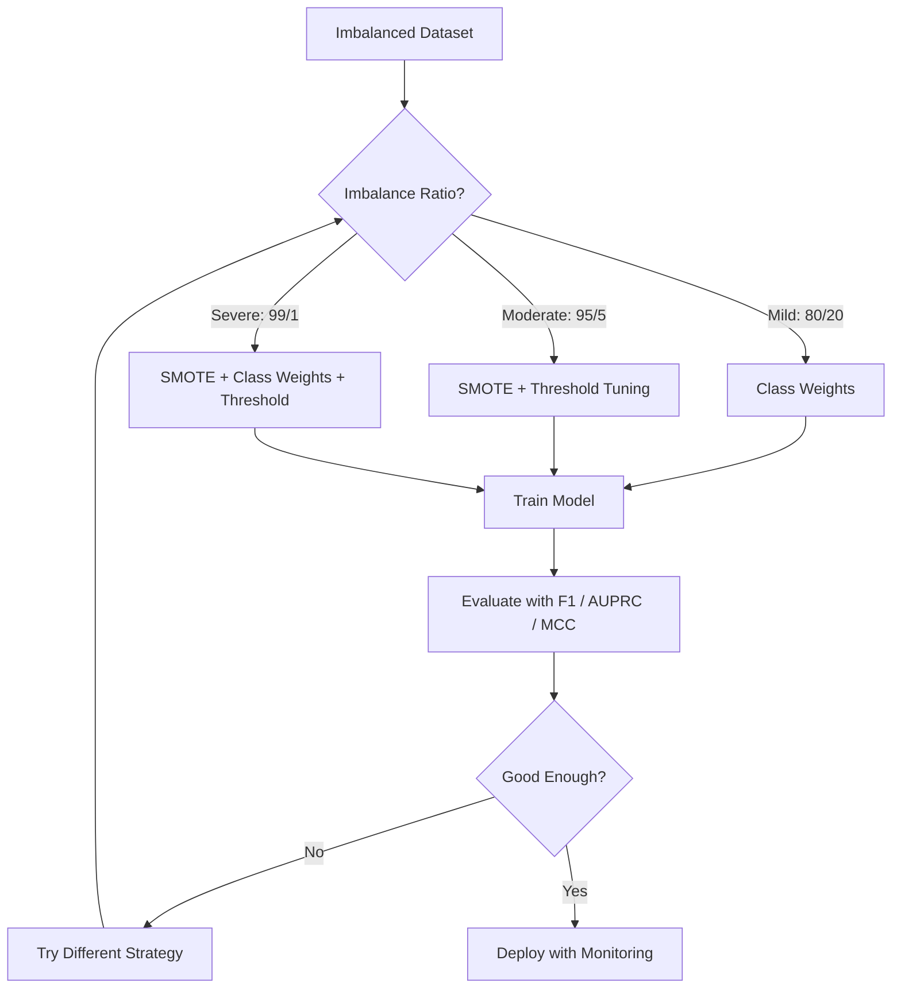
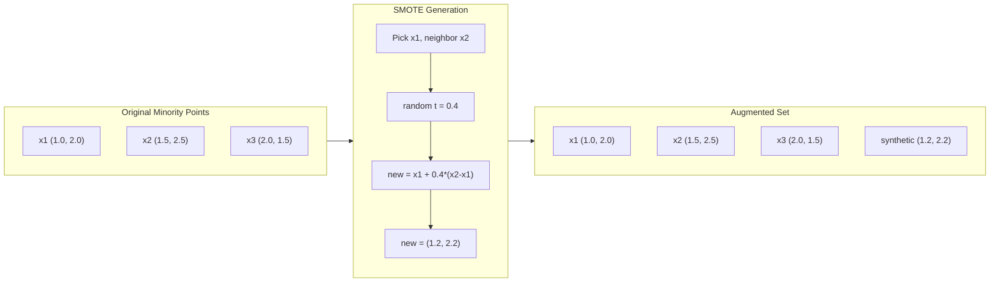
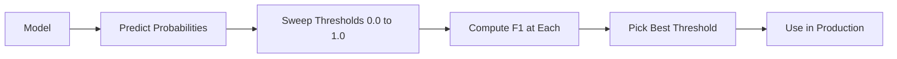
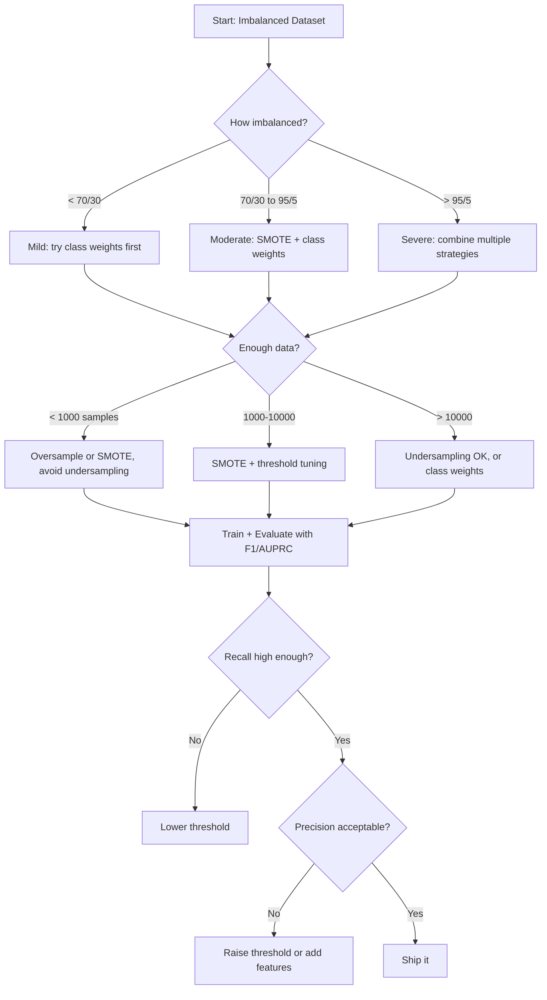

# Radzenie Sobie z Niezrównoważonymi Danymi

> Gdy 99% twoich danych jest „normalne", dokładność to kłamstwo.

**Type:** Build
**Language:** Python
**Prerequisites:** Phase 2, Lessons 01-09 (especially evaluation metrics)
**Time:** ~90 minutes

## Learning Objectives

- Zaimplementuj SMOTE od podstaw i wyjaśnij, jak syntetyczne nadpróbkowanie różni się od losowego powielania
- Oceń niezrównoważone klasyfikatory za pomocą F1, AUPRC i współczynnika korelacji Matthewsa zamiast dokładności
- Porównaj ważenie klas, dostrajanie progu i strategie resamplingu oraz wybierz odpowiednie podejście dla danego współczynnika niezrównoważenia
- Zbuduj kompletny potok dla niezrównoważonych danych łączący SMOTE, wagi klas i optymalizację progu

## The Problem

Budujesz model wykrywania oszustw. Osiąga 99,9% dokładności. Cieszysz się. Potem zdajesz sobie sprawę, że przewiduje „brak oszustwa" dla każdej transakcji.

To nie jest błąd. To racjonalne zachowanie, gdy tylko 0,1% transakcji jest oszukańczych. Model uczy się, że zawsze zgadywanie klasy większościowej minimalizuje całkowity błąd. Jest technicznie poprawny i całkowicie bezużyteczny.

Dzieje się tak wszędzie tam, gdzie prawdziwa klasyfikacja ma znaczenie. Diagnoza choroby: 1% pozytywnych. Włamania do sieci: 0,01% ataków. Wady produkcyjne: 0,5% wadliwych. Filtrowanie spamu: 20% spamu. Prognozowanie rezygnacji: 5% rezygnujących. Im bardziej znacząca jest klasa mniejszościowa, tym rzadsza zwykle bywa.

Dokładność zawodzi, ponieważ traktuje wszystkie poprawne przewidywania jednakowo. Prawidłowe oznaczenie legalnej transakcji i złapanie oszustwa liczą się jako jeden punkt dokładności. Ale łapanie oszustw to cały powód istnienia modelu. Potrzebujemy metryk, technik i strategii treningowych, które zmuszą model do zwracania uwagi na rzadką, ale ważną klasę.

## The Concept

### Why Accuracy Fails

Rozważmy zbiór danych z 1000 próbek: 990 negatywnych, 10 pozytywnych. Model, który zawsze przewiduje negatyw:

| | Predicted Positive | Predicted Negative |
|--|---|---|
| Actually Positive | 0 (TP) | 10 (FN) |
| Actually Negative | 0 (FP) | 990 (TN) |

Dokładność = (0 + 990) / 1000 = 99,0%

Model łapie zero oszustw. Zero chorób. Zero wad. Ale dokładność mówi 99%. Dlatego dokładność jest niebezpieczna dla problemów z nierównowagą klas.

### Better Metrics

**Precyzja (Precision)** = TP / (TP + FP). Spośród wszystkiego oznaczonego jako pozytywne, ile rzeczywiście jest pozytywnych? Wysoka precyzja oznacza mało fałszywych alarmów.

**Czułość (Recall)** = TP / (TP + FN). Spośród wszystkiego, co jest rzeczywiście pozytywne, ile złapaliśmy? Wysoka czułość oznacza mało przeoczonych pozytywów.

**Wynik F1** = 2 * precyzja * czułość / (precyzja + czułość). Średnia harmoniczna. Kara za ekstremalną nierównowagę między precyzją a czułością bardziej niż średnia arytmetyczna.

**Wynik F-beta** = (1 + beta^2) * precyzja * czułość / (beta^2 * precyzja + czułość). Gdy beta > 1, czułość ma większe znaczenie. Gdy beta < 1, precyzja ma większe znaczenie. F2 jest powszechne w wykrywaniu oszustw (przeoczenie oszustwa jest gorsze niż fałszywy alarm).

**AUPRC** (Pole pod krzywą precyzji-czułości). Podobne do AUC-ROC, ale bardziej informatywne dla niezrównoważonych danych. Losowy klasyfikator ma AUPRC równe wskaźnikowi klasy pozytywnej (nie 0,5 jak w ROC). Ułatwia to dostrzeganie ulepszeń.

**Współczynnik korelacji Matthewsa (MCC)** = (TP * TN - FP * FN) / sqrt((TP+FP)(TP+FN)(TN+FP)(TN+FN)). Zakres od -1 do +1. Daje wysoki wynik tylko wtedy, gdy model dobrze radzi sobie na obu klasach. Jest zrównoważony nawet przy bardzo różnych rozmiarach klas.

Dla modelu „zawsze przewiduj negatyw" powyżej: precyzja = 0/0 (niezdefiniowane, często ustawiane na 0), czułość = 0/10 = 0, F1 = 0, MCC = 0. Te metryki prawidłowo identyfikują model jako bezwartościowy.

### The Imbalanced Data Pipeline



### SMOTE: Synthetic Minority Oversampling Technique

Losowe nadpróbkowanie duplikuje istniejące próbki mniejszościowe. To działa, ale grozi przeuczeniem, ponieważ model widzi identyczne punkty wielokrotnie.

SMOTE tworzy nowe syntetyczne próbki mniejszościowe, które są wiarygodne, ale nie są kopiami. Algorytm:

1. Dla każdej próbki mniejszościowej x znajdź jej k najbliższych sąsiadów wśród innych próbek mniejszościowych
2. Wybierz losowo jednego sąsiada
3. Stwórz nową próbkę na odcinku między x a tym sąsiadem

Wzór: `new_sample = x + random(0, 1) * (neighbor - x)`

Interpoluje to między rzeczywistymi punktami mniejszościowymi, tworząc próbki w tym samym regionie przestrzeni cech bez prostego kopiowania istniejących danych.



### Sampling Strategies Compared

**Losowe nadpróbkowanie**: duplikuj próbki mniejszościowe, aby dorównać liczbie większościowej.
- Plusy: proste, brak utraty informacji
- Minusy: identyczne duplikaty powodują przeuczenie, wydłużają czas trenowania

**Losowe podpróbkowanie**: usuń próbki większościowe, aby dorównać liczbie mniejszościowej.
- Plusy: szybkie trenowanie, proste
- Minusy: wyrzuca potencjalnie użyteczne dane większościowe, wyższa wariancja

**SMOTE**: twórz syntetyczne próbki mniejszościowe przez interpolację.
- Plusy: generuje nowe punkty danych, zmniejsza przeuczenie w porównaniu z losowym nadpróbkowaniem
- Minusy: może tworzyć zaszumione próbki w pobliżu granicy decyzyjnej, nie uwzględnia rozkładu klasy większościowej

| Strategy | Data Changed | Risk | When to Use |
|----------|-------------|------|-------------|
| Nadpróbkowanie | Mniejszość duplikowana | Przeuczenie | Małe zbiory danych, umiarkowana nierównowaga |
| Podpróbkowanie | Większość usuwana | Utrata informacji | Duże zbiory danych, szybkie trenowanie |
| SMOTE | Syntetyczna mniejszość dodana | Szum graniczny | Umiarkowana nierównowaga, wystarczająco próbek mniejszościowych dla k-NN |

### Class Weights

Zamiast zmieniać dane, zmień sposób, w jaki model traktuje błędy. Przypisz wyższą wagę do błędnej klasyfikacji klasy mniejszościowej.

Dla problemu binarnego z 950 negatywnymi i 50 pozytywnymi próbkami:
- Waga dla klasy negatywnej = n_próbek / (2 * n_negatywne) = 1000 / (2 * 950) = 0,526
- Waga dla klasy pozytywnej = n_próbek / (2 * n_pozytywne) = 1000 / (2 * 50) = 10,0

Klasa pozytywna otrzymuje 19-krotną wagę. Błędne sklasyfikowanie jednej pozytywnej próbki kosztuje tyle, co błędne sklasyfikowanie 19 negatywnych próbek. Model jest zmuszony zwracać uwagę na klasę mniejszościową.

W regresji logistycznej modyfikuje to funkcję straty:

```
weighted_loss = -sum(w_i * [y_i * log(p_i) + (1-y_i) * log(1-p_i)])
```

gdzie w_i zależy od klasy próbki i.

Wagi klas są matematycznie równoważne nadpróbkowaniu w oczekiwaniu, ale bez tworzenia nowych punktów danych. To czyni je szybszymi i pozwala uniknąć ryzyka przeuczenia związanego z duplikowaniem próbek.

### Threshold Tuning

Większość klasyfikatorów zwraca prawdopodobieństwo. Domyślny próg to 0,5: jeśli P(pozytywne) >= 0,5, przewiduj pozytywne. Ale 0,5 jest arbitralne. Gdy klasy są niezrównoważone, optymalny próg jest zwykle znacznie niższy.

Proces:
1. Trenuj model
2. Uzyskaj przewidywane prawdopodobieństwa na zbiorze walidacyjnym
3. Przeskanuj progi od 0,0 do 1,0
4. Oblicz F1 (lub wybraną metrykę) przy każdym progu
5. Wybierz próg, który maksymalizuje twoją metrykę



Model może zwrócić P(oszustwo) = 0,15 dla oszukańczej transakcji. Przy progu 0,5 jest klasyfikowana jako brak oszustwa. Przy progu 0,10 zostaje prawidłowo złapana. Kalibracja prawdopodobieństwa ma mniejsze znaczenie niż ranking — dopóki oszustwa otrzymują wyższe prawdopodobieństwa niż nie-oszustwa, istnieje próg, który je rozdziela.

### Cost-Sensitive Learning

Uogólnienie wag klas. Zamiast jednolitych kosztów, przypisz konkretne koszty błędnej klasyfikacji:

| | Predict Positive | Predict Negative |
|--|---|---|
| Actually Positive | 0 (correct) | C_FN = 100 |
| Actually Negative | C_FP = 1 | 0 (correct) |

Przeoczenie oszukańczej transakcji (FN) kosztuje 100 razy więcej niż fałszywy alarm (FP). Model optymalizuje pod kątem całkowitego kosztu, a nie całkowitej liczby błędów.

To najbardziej zasadne podejście, gdy potrafisz oszacować rzeczywiste koszty. Przeoczona diagnoza raka ma zupełnie inny koszt niż fałszywy alarm prowadzący do dodatkowej biopsji. Wyraźne określenie tych kosztów wymusza właściwe kompromisy.

### Decision Flowchart



```figure
class-imbalance
```

## Build It

### Step 1: Generate an imbalanced dataset

```python
import numpy as np


def make_imbalanced_data(n_majority=950, n_minority=50, seed=42):
    rng = np.random.RandomState(seed)

    X_maj = rng.randn(n_majority, 2) * 1.0 + np.array([0.0, 0.0])
    X_min = rng.randn(n_minority, 2) * 0.8 + np.array([2.5, 2.5])

    X = np.vstack([X_maj, X_min])
    y = np.concatenate([np.zeros(n_majority), np.ones(n_minority)])

    shuffle_idx = rng.permutation(len(y))
    return X[shuffle_idx], y[shuffle_idx]
```

### Step 2: SMOTE from scratch

```python
def euclidean_distance(a, b):
    return np.sqrt(np.sum((a - b) ** 2))


def find_k_neighbors(X, idx, k):
    distances = []
    for i in range(len(X)):
        if i == idx:
            continue
        d = euclidean_distance(X[idx], X[i])
        distances.append((i, d))
    distances.sort(key=lambda x: x[1])
    return [d[0] for d in distances[:k]]


def smote(X_minority, k=5, n_synthetic=100, seed=42):
    rng = np.random.RandomState(seed)
    n_samples = len(X_minority)
    k = min(k, n_samples - 1)
    synthetic = []

    for _ in range(n_synthetic):
        idx = rng.randint(0, n_samples)
        neighbors = find_k_neighbors(X_minority, idx, k)
        neighbor_idx = neighbors[rng.randint(0, len(neighbors))]
        t = rng.random()
        new_point = X_minority[idx] + t * (X_minority[neighbor_idx] - X_minority[idx])
        synthetic.append(new_point)

    return np.array(synthetic)
```

### Step 3: Random oversampling and undersampling

```python
def random_oversample(X, y, seed=42):
    rng = np.random.RandomState(seed)
    classes, counts = np.unique(y, return_counts=True)
    max_count = counts.max()

    X_resampled = list(X)
    y_resampled = list(y)

    for cls, count in zip(classes, counts):
        if count < max_count:
            cls_indices = np.where(y == cls)[0]
            n_needed = max_count - count
            chosen = rng.choice(cls_indices, size=n_needed, replace=True)
            X_resampled.extend(X[chosen])
            y_resampled.extend(y[chosen])

    X_out = np.array(X_resampled)
    y_out = np.array(y_resampled)
    shuffle = rng.permutation(len(y_out))
    return X_out[shuffle], y_out[shuffle]


def random_undersample(X, y, seed=42):
    rng = np.random.RandomState(seed)
    classes, counts = np.unique(y, return_counts=True)
    min_count = counts.min()

    X_resampled = []
    y_resampled = []

    for cls in classes:
        cls_indices = np.where(y == cls)[0]
        chosen = rng.choice(cls_indices, size=min_count, replace=False)
        X_resampled.extend(X[chosen])
        y_resampled.extend(y[chosen])

    X_out = np.array(X_resampled)
    y_out = np.array(y_resampled)
    shuffle = rng.permutation(len(y_out))
    return X_out[shuffle], y_out[shuffle]
```

### Step 4: Logistic regression with class weights

```python
def sigmoid(z):
    return 1.0 / (1.0 + np.exp(-np.clip(z, -500, 500)))


def logistic_regression_weighted(X, y, weights, lr=0.01, epochs=200):
    n_samples, n_features = X.shape
    w = np.zeros(n_features)
    b = 0.0

    for _ in range(epochs):
        z = X @ w + b
        pred = sigmoid(z)
        error = pred - y
        weighted_error = error * weights

        gradient_w = (X.T @ weighted_error) / n_samples
        gradient_b = np.mean(weighted_error)

        w -= lr * gradient_w
        b -= lr * gradient_b

    return w, b


def compute_class_weights(y):
    classes, counts = np.unique(y, return_counts=True)
    n_samples = len(y)
    n_classes = len(classes)
    weight_map = {}
    for cls, count in zip(classes, counts):
        weight_map[cls] = n_samples / (n_classes * count)
    return np.array([weight_map[yi] for yi in y])
```

### Step 5: Threshold tuning

```python
def find_optimal_threshold(y_true, y_probs, metric="f1"):
    best_threshold = 0.5
    best_score = -1.0

    for threshold in np.arange(0.05, 0.96, 0.01):
        y_pred = (y_probs >= threshold).astype(int)
        tp = np.sum((y_pred == 1) & (y_true == 1))
        fp = np.sum((y_pred == 1) & (y_true == 0))
        fn = np.sum((y_pred == 0) & (y_true == 1))

        if metric == "f1":
            precision = tp / (tp + fp) if (tp + fp) > 0 else 0.0
            recall = tp / (tp + fn) if (tp + fn) > 0 else 0.0
            score = 2 * precision * recall / (precision + recall) if (precision + recall) > 0 else 0.0
        elif metric == "recall":
            score = tp / (tp + fn) if (tp + fn) > 0 else 0.0
        elif metric == "precision":
            score = tp / (tp + fp) if (tp + fp) > 0 else 0.0

        if score > best_score:
            best_score = score
            best_threshold = threshold

    return best_threshold, best_score
```

### Step 6: Evaluation functions

```python
def confusion_matrix_values(y_true, y_pred):
    tp = np.sum((y_pred == 1) & (y_true == 1))
    tn = np.sum((y_pred == 0) & (y_true == 0))
    fp = np.sum((y_pred == 1) & (y_true == 0))
    fn = np.sum((y_pred == 0) & (y_true == 1))
    return tp, tn, fp, fn


def compute_metrics(y_true, y_pred):
    tp, tn, fp, fn = confusion_matrix_values(y_true, y_pred)
    accuracy = (tp + tn) / (tp + tn + fp + fn)
    precision = tp / (tp + fp) if (tp + fp) > 0 else 0.0
    recall = tp / (tp + fn) if (tp + fn) > 0 else 0.0
    f1 = 2 * precision * recall / (precision + recall) if (precision + recall) > 0 else 0.0

    denom = np.sqrt(float((tp + fp) * (tp + fn) * (tn + fp) * (tn + fn)))
    mcc = (tp * tn - fp * fn) / denom if denom > 0 else 0.0

    return {
        "accuracy": accuracy,
        "precision": precision,
        "recall": recall,
        "f1": f1,
        "mcc": mcc,
    }
```

### Step 7: Compare all approaches

```python
X, y = make_imbalanced_data(950, 50, seed=42)
split = int(0.8 * len(y))
X_train, X_test = X[:split], X[split:]
y_train, y_test = y[:split], y[split:]

# Baseline: no treatment
w_base, b_base = logistic_regression_weighted(
    X_train, y_train, np.ones(len(y_train)), lr=0.1, epochs=300
)
probs_base = sigmoid(X_test @ w_base + b_base)
preds_base = (probs_base >= 0.5).astype(int)

# Oversampled
X_over, y_over = random_oversample(X_train, y_train)
w_over, b_over = logistic_regression_weighted(
    X_over, y_over, np.ones(len(y_over)), lr=0.1, epochs=300
)
preds_over = (sigmoid(X_test @ w_over + b_over) >= 0.5).astype(int)

# SMOTE
minority_mask = y_train == 1
X_minority = X_train[minority_mask]
synthetic = smote(X_minority, k=5, n_synthetic=len(y_train) - 2 * int(minority_mask.sum()))
X_smote = np.vstack([X_train, synthetic])
y_smote = np.concatenate([y_train, np.ones(len(synthetic))])
w_sm, b_sm = logistic_regression_weighted(
    X_smote, y_smote, np.ones(len(y_smote)), lr=0.1, epochs=300
)
preds_smote = (sigmoid(X_test @ w_sm + b_sm) >= 0.5).astype(int)

# Class weights
sample_weights = compute_class_weights(y_train)
w_cw, b_cw = logistic_regression_weighted(
    X_train, y_train, sample_weights, lr=0.1, epochs=300
)
probs_cw = sigmoid(X_test @ w_cw + b_cw)
preds_cw = (probs_cw >= 0.5).astype(int)

# Threshold tuning (tune on held-out validation set, not test set)
probs_val = sigmoid(X_val @ w_cw + b_cw)
best_thresh, best_f1 = find_optimal_threshold(y_val, probs_val, metric="f1")
preds_thresh = (probs_cw >= best_thresh).astype(int)
```

Plik kodu uruchamia to wszystko w jednym skrypcie i wyświetla wyniki.

## Use It

Z scikit-learn i imbalanced-learn, te techniki to jednolinijkowce:

```python
from sklearn.linear_model import LogisticRegression
from sklearn.metrics import classification_report, f1_score
from sklearn.model_selection import train_test_split
from imblearn.over_sampling import SMOTE
from imblearn.under_sampling import RandomUnderSampler
from imblearn.pipeline import Pipeline

X_train, X_test, y_train, y_test = train_test_split(X, y, stratify=y)

model_weighted = LogisticRegression(class_weight="balanced")
model_weighted.fit(X_train, y_train)
print(classification_report(y_test, model_weighted.predict(X_test)))

smote = SMOTE(random_state=42)
X_resampled, y_resampled = smote.fit_resample(X_train, y_train)
model_smote = LogisticRegression()
model_smote.fit(X_resampled, y_resampled)
print(classification_report(y_test, model_smote.predict(X_test)))

pipeline = Pipeline([
    ("smote", SMOTE()),
    ("model", LogisticRegression(class_weight="balanced")),
])
pipeline.fit(X_train, y_train)
print(classification_report(y_test, pipeline.predict(X_test)))
```

Implementacje od podstaw pokazują dokładnie, co robi każda technika. SMOTE to po prostu interpolacja k-NN na klasie mniejszościowej. Wagi klas mnożą stratę. Dostrajanie progu to pętla po punktach odcięcia. Żadnej magii.

## Ship It

Ta lekcja produkuje:
- `outputs/skill-imbalanced-data.md` -- lista kontrolna decyzji do radzenia sobie z problemami niezrównoważonej klasyfikacji

## Exercises

1. **Borderline-SMOTE**: zmodyfikuj implementację SMOTE tak, aby generowała syntetyczne próbki tylko dla punktów mniejszościowych znajdujących się w pobliżu granicy decyzyjnej (tych, których k-najbliższych sąsiadów zawiera próbki klasy większościowej). Porównaj wyniki ze standardowym SMOTE na zbiorze danych, gdzie klasy się nakładają.

2. **Optymalizacja macierzy kosztów**: zaimplementuj uczenie wrażliwe na koszty, gdzie macierz kosztów jest parametrem. Stwórz funkcję, która przyjmuje macierz kosztów i zwraca optymalne przewidywania minimalizujące oczekiwany koszt. Przetestuj z różnymi proporcjami kosztów (1:10, 1:100, 1:1000) i wykreśl, jak zmienia się kompromis precyzji i czułości.

3. **Kalibracja progu**: zaimplementuj skalowanie Platta (dopasuj regresję logistyczną do surowych wyników modelu, aby uzyskać skalibrowane prawdopodobieństwa). Porównaj krzywą precyzji-czułości przed i po kalibracji. Pokaż, że kalibracja nie zmienia rankingu (AUC pozostaje takie samo), ale sprawia, że prawdopodobieństwa są bardziej znaczące.

4. **Zespół ze zrównoważonym baggingiem**: trenuj wiele modeli, każdy na zrównoważonej próbce bootstrapowej (wszystkie mniejszościowe + losowy podzbiór większościowych). Uśrednij ich przewidywania. Porównaj to podejście z pojedynczym modelem z SMOTE. Zmierz zarówno wydajność, jak i wariancję między uruchomieniami.

5. **Eksperyment ze współczynnikiem nierównowagi**: weź zrównoważony zbiór danych i stopniowo zwiększaj współczynnik nierównowagi (50/50, 70/30, 90/10, 95/5, 99/1). Dla każdego współczynnika trenuj z SMOTE i bez SMOTE. Wykreśl F1 w funkcji współczynnika nierównowagi dla obu podejść. Przy jakim współczynniku SMOTE zaczyna robić znaczącą różnicę?

## Key Terms

| Term | What people say | What it actually means |
|------|----------------|----------------------|
| Nierównowaga klas | „Jedna klasa ma znacznie więcej próbek" | Rozkład klas w zbiorze danych jest znacząco przekrzywiony, powodując, że modele faworyzują klasę większościową |
| SMOTE | „Syntetyczne nadpróbkowanie" | Tworzy nowe próbki mniejszościowe przez interpolację między istniejącymi próbkami mniejszościowymi a ich k-najbliższymi mniejszościowymi sąsiadami |
| Wagi klas | „Sprawianie, że błędy na rzadkich klasach są droższe" | Mnożenie funkcji straty przez wagi specyficzne dla klas, tak aby model karał błędną klasyfikację mniejszości bardziej |
| Dostrajanie progu | „Przesuwanie granicy decyzyjnej" | Zmiana punktu odcięcia prawdopodobieństwa dla klasyfikacji z domyślnego 0,5 na wartość optymalizującą wybraną metrykę |
| Kompromis precyzji i czułości | „Nie możesz mieć obu" | Obniżenie progu łapie więcej pozytywów (wyższa czułość), ale także oznacza więcej fałszywych alarmów (niższa precyzja) i odwrotnie |
| AUPRC | „Pole pod krzywą PR" | Podsumowuje krzywą precyzji-czułości w jednej liczbie; bardziej informatywna niż AUC-ROC, gdy klasy są silnie niezrównoważone |
| Współczynnik korelacji Matthewsa | „Zrównoważona metryka" | Korelacja między przewidywanymi a rzeczywistymi etykietami, która daje wysoki wynik tylko wtedy, gdy model działa dobrze na obu klasach |
| Uczenie wrażliwe na koszty | „Różne błędy kosztują różne kwoty" | Włączenie rzeczywistych kosztów błędnej klasyfikacji do celu treningowego, tak aby model optymalizował pod kątem całkowitego kosztu, a nie liczby błędów |
| Losowe nadpróbkowanie | „Duplikuj mniejszość" | Powtarzanie próbek klasy mniejszościowej w celu zrównoważenia liczebności klas; proste, ale ryzykowne ze względu na przeuczenie do zduplikowanych punktów |

## Further Reading

- [SMOTE: Synthetic Minority Over-sampling Technique (Chawla et al., 2002)](https://arxiv.org/abs/1106.1813) -- the original SMOTE paper, still the most cited work on imbalanced learning
- [Learning from Imbalanced Data (He & Garcia, 2009)](https://ieeexplore.ieee.org/document/5128907) -- comprehensive survey covering sampling, cost-sensitive, and algorithmic approaches
- [imbalanced-learn documentation](https://imbalanced-learn.org/stable/) -- Python library with SMOTE variants, undersampling strategies, and pipeline integration
- [The Precision-Recall Plot Is More Informative than the ROC Plot (Saito & Rehmsmeier, 2015)](https://journals.plos.org/plosone/article?id=10.1371/journal.pone.0118432) -- when and why to prefer PR curves over ROC curves for imbalanced problems