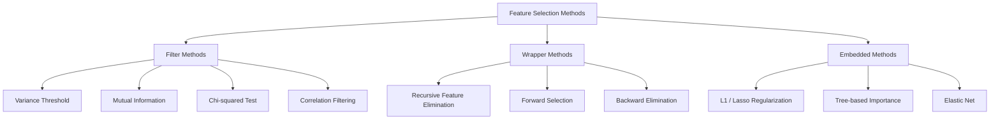
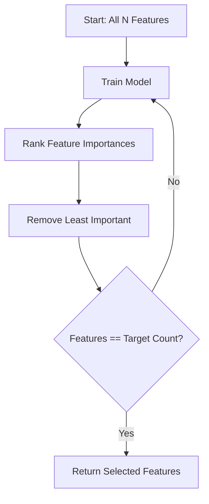
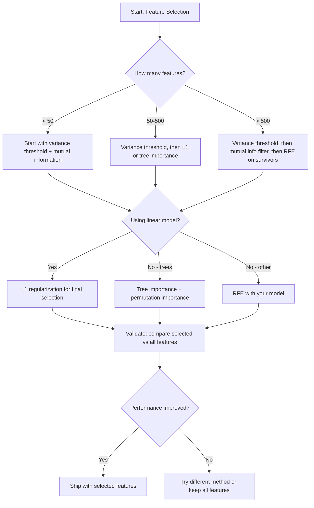

# Selekcja Cech

> Więcej cech nie znaczy lepiej. Właściwe cechy znaczą lepiej.

**Type:** Build
**Language:** Python
**Prerequisites:** Phase 2, Lessons 01-09, 08 (feature engineering)
**Time:** ~75 minutes

## Learning Objectives

- Zaimplementuj metody filtrujące (próg wariancji, informacja wzajemna, chi-kwadrat) i metody opakowujące (RFE, selekcja forward) od podstaw
- Wyjaśnij, dlaczego informacja wzajemna wychwytuje nieliniowe zależności między cechą a targetem, których korelacja nie wychwytuje
- Porównaj regularyzację L1 (selekcja osadzona) z RFE (selekcja opakowująca) i oceń ich kompromisy obliczeniowe
- Zbuduj potok selekcji cech łączący wiele metod i zademonstruj poprawę generalizacji na danych testowych

## The Problem

Masz 500 cech. Twój model trenuje wolno, ciągle się przeucza i nikt nie jest w stanie wyjaśnić, czego się nauczył. Dodajesz więcej cech, mając nadzieję na poprawę wydajności. Robi się gorzej.

To przekleństwo wymiarowości w działaniu. Wraz ze wzrostem liczby cech objętość przestrzeni cech eksploduje. Punkty danych stają się rzadkie. Odległości między punktami zbiegają się. Model potrzebuje wykładniczo więcej danych, aby znaleźć rzeczywiste wzorce. Szumowe cechy zagłuszają sygnałowe. Przeuczenie staje się domyślne.

Selekcja cech jest antidotum. Odetnij szum. Usuń nadmiarowość. Zachowaj cechy, które niosą rzeczywiste informacje o targetcie. Rezultat: szybsze trenowanie, lepsza generalizacja i modele, które faktycznie możesz wyjaśnić.

Celem nie jest wykorzystanie wszystkich dostępnych informacji. Celem jest wykorzystanie właściwych informacji.

## The Concept

### Three Categories of Feature Selection

Każda metoda selekcji cech należy do jednej z trzech kategorii:



**Metody filtrujące** oceniają każdą cechę niezależnie za pomocą miary statystycznej. Nie używają modelu. Szybkie, ale pomijają interakcje między cechami.

**Metody opakowujące** trenują model w celu oceny podzbiorów cech. Używają wydajności modelu jako wyniku. Lepsze wyniki, ale kosztowne, ponieważ wielokrotnie trenują model od nowa.

**Metody osadzone** dokonują selekcji cech jako części trenowania modelu. Regularyzacja L1 zeruje wagi. Drzewa decyzyjne dzielą na najbardziej użytecznych cechach. Selekcja zachodzi podczas dopasowywania, a nie jako osobny krok.

### Variance Threshold

Najprostszy filtr. Jeśli cecha prawie nie zmienia się między próbkami, niesie prawie żadnych informacji.

Rozważ cechę, która wynosi 0,0 dla 999 z 1000 próbek. Jej wariancja jest bliska zeru. Żaden model nie może jej użyć do rozróżnienia klas. Usuń ją.

```
variance(x) = mean((x - mean(x))^2)
```

Ustaw próg (np. 0,01). Odrzuć każdą cechę o wariancji poniżej niego. Usuwa to cechy stałe lub prawie stałe bez patrzenia na zmienną celu.

Kiedy używać: jako krok wstępnego przetwarzania przed innymi metodami. Wychwytuje oczywiście bezużyteczne cechy przy prawie zerowym koszcie.

Ograniczenie: cecha może mieć wysoką wariancję i wciąż być czystym szumem. Próg wariancji jest konieczny, ale niewystarczający.

### Mutual Information

Informacja wzajemna mierzy, jak bardzo znajomość wartości cechy X zmniejsza niepewność co do targetu Y.

```
I(X; Y) = sum_x sum_y p(x, y) * log(p(x, y) / (p(x) * p(y)))
```

Jeśli X i Y są niezależne, p(x, y) = p(x) * p(y), więc człon logarytmiczny wynosi zero i I(X; Y) = 0. Im więcej X mówi o Y, tym wyższa informacja wzajemna.

Kluczowa zaleta w porównaniu z korelacją: informacja wzajemna wychwytuje zależności nieliniowe. Cecha może mieć zerową korelację z targetem, ale wysoką informację wzajemną, ponieważ zależność jest kwadratowa lub okresowa.

Dla cech ciągłych najpierw dyskretyzuj na przedziały (estymacja histogramowa). Liczba przedziałów wpływa na estymację — zbyt mało przedziałów traci informacje, zbyt wiele dodaje szumu. Typowy wybór: sqrt(n) przedziałów lub reguła Sturgesa (1 + log2(n)).


### Recursive Feature Elimination (RFE)

RFE to metoda opakowująca. Używa własnej ważności cech modelu do iteracyjnego przycinania:

1. Trenuj model ze wszystkimi cechami
2. Uszereguj cechy według ważności (współczynniki dla modeli liniowych, redukcja nieczystości dla drzew)
3. Usuń najmniej ważną cechę (lub cechy)
4. Powtarzaj, aż pozostanie żądana liczba cech



RFE uwzględnia interakcje między cechami, ponieważ model widzi wszystkie pozostałe cechy razem. Usunięcie jednej cechy zmienia ważność innych. To czyni go dokładniejszym niż metody filtrujące.

Koszt: trenujesz model N - target razy. Przy 500 cechach i celu 10, to 490 uruchomień treningu. Dla kosztownych modeli jest to wolne. Możesz przyspieszyć, usuwając wiele cech na krok (np. usuwaj dolne 10% każdej rundy).

### L1 (Lasso) Regularization

Regularyzacja L1 dodaje wartość bezwzględną wag do funkcji straty:

```
loss = prediction_error + alpha * sum(|w_i|)
```

Parametr alpha kontroluje, jak agresywnie cechy są przycinane. Wyższe alpha oznacza, że więcej wag spada dokładnie do zera.

Dlaczego dokładnie zero? Kara L1 tworzy diamentowy obszar ograniczeń w przestrzeni wag. Optymalne rozwiązanie ma tendencję do lądowania na rogu tego diamentu, gdzie jedna lub więcej wag jest zerowych. Regularyzacja L2 (ridge) tworzy kołowy obszar ograniczeń, gdzie wagi kurczą się, ale rzadko osiągają zero.

To osadzona selekcja cech: model uczy się podczas trenowania, które cechy ignorować. Cechy z zerową wagą są skutecznie usuwane.

Zalety: pojedyncze uruchomienie treningu, radzi sobie ze skorelowanymi cechami (wybiera jedną i zeruje pozostałe), wbudowane w większość implementacji modeli liniowych.

Ograniczenie: działa tylko dla modeli liniowych. Nie może wychwycić nieliniowej ważności cech.

### Tree-Based Feature Importance

Drzewa decyzyjne i ich zespoły (random forest, gradient boosting) naturalnie rankują cechy. Każdy podział redukuje nieczystość (Gini lub entropia dla klasyfikacji, wariancja dla regresji). Cechy, które dają większe redukcje nieczystości, są ważniejsze.

Dla lasu losowego z T drzewami:

```
importance(feature_j) = (1/T) * sum over all trees of
    sum over all nodes splitting on feature_j of
        (n_samples * impurity_decrease)
```

Daje to znormalizowany wynik ważności dla każdej cechy. Automatycznie obsługuje zależności nieliniowe i interakcje między cechami.

Uwaga: ważność oparta na drzewach jest obciążona na korzyść cech z wieloma unikalnymi wartościami (wysoka liczność). Losowa kolumna ID będzie wydawać się ważna, ponieważ doskonale dzieli każdą próbkę. Użyj ważności permutacyjnej jako sprawdzenia poprawności.

### Permutation Importance

Metoda niezależna od modelu:

1. Trenuj model i zapisz bazową wydajność na danych walidacyjnych
2. Dla każdej cechy: przetasuj jej wartości losowo, zmierz spadek wydajności
3. Im większy spadek, tym ważniejsza cecha

Jeśli przetasowanie cechy nie szkodzi wydajności, model od niej nie zależy. Jeśli wydajność spada, ta cecha jest krytyczna.

Ważność permutacyjna unika obciążenia licznością cech charakterystycznego dla ważności opartej na drzewach. Ale jest wolna: jedna pełna ocena na cechę, powtarzana wielokrotnie dla stabilności.

### Comparison Table

| Method | Type | Speed | Nonlinear | Feature Interactions |
|--------|------|-------|-----------|---------------------|
| Próg wariancji | Filtr | Bardzo szybka | Nie | Nie |
| Informacja wzajemna | Filtr | Szybka | Tak | Nie |
| Filtr korelacji | Filtr | Szybka | Nie | Nie |
| RFE | Opakowująca | Wolna | Zależy od modelu | Tak |
| L1 / Lasso | Osadzona | Szybka | Nie (liniowa) | Nie |
| Ważność drzewiasta | Osadzona | Średnia | Tak | Tak |
| Ważność permutacyjna | Niezależna od modelu | Wolna | Tak | Tak |

### Decision Flowchart



## Build It

### Step 1: Generate synthetic data with known feature structure

```python
import numpy as np


def make_feature_selection_data(n_samples=500, seed=42):
    rng = np.random.RandomState(seed)

    x1 = rng.randn(n_samples)
    x2 = rng.randn(n_samples)
    x3 = rng.randn(n_samples)
    x4 = x1 + 0.1 * rng.randn(n_samples)
    x5 = x2 + 0.1 * rng.randn(n_samples)

    informative = np.column_stack([x1, x2, x3, x4, x5])

    correlated = np.column_stack([
        x1 * 0.9 + 0.1 * rng.randn(n_samples),
        x2 * 0.8 + 0.2 * rng.randn(n_samples),
        x3 * 0.7 + 0.3 * rng.randn(n_samples),
        x1 * 0.5 + x2 * 0.5 + 0.1 * rng.randn(n_samples),
        x2 * 0.6 + x3 * 0.4 + 0.1 * rng.randn(n_samples),
    ])

    noise = rng.randn(n_samples, 10) * 0.5

    X = np.hstack([informative, correlated, noise])
    y = (2 * x1 - 1.5 * x2 + x3 + 0.5 * rng.randn(n_samples) > 0).astype(int)

    feature_names = (
        [f"info_{i}" for i in range(5)]
        + [f"corr_{i}" for i in range(5)]
        + [f"noise_{i}" for i in range(10)]
    )

    return X, y, feature_names
```

Znamy prawdę podstawową: cechy 0-4 są informatywne (przy czym 3 i 4 są skorelowanymi kopiami 0 i 1), cechy 5-9 są skorelowane z cechami informatywnymi, cechy 10-19 to czysty szum. Dobra metoda selekcji powinna rankingować 0-4 najwyżej, a 10-19 najniżej.

### Step 2: Variance threshold

```python
def variance_threshold(X, threshold=0.01):
    variances = np.var(X, axis=0)
    mask = variances > threshold
    return mask, variances
```

### Step 3: Mutual information (discrete)

```python
def discretize(x, n_bins=10):
    min_val, max_val = x.min(), x.max()
    if max_val == min_val:
        return np.zeros_like(x, dtype=int)
    bin_edges = np.linspace(min_val, max_val, n_bins + 1)
    binned = np.digitize(x, bin_edges[1:-1])
    return binned


def mutual_information(X, y, n_bins=10):
    n_samples, n_features = X.shape
    mi_scores = np.zeros(n_features)

    y_vals, y_counts = np.unique(y, return_counts=True)
    p_y = y_counts / n_samples

    for f in range(n_features):
        x_binned = discretize(X[:, f], n_bins)
        x_vals, x_counts = np.unique(x_binned, return_counts=True)
        p_x = dict(zip(x_vals, x_counts / n_samples))

        mi = 0.0
        for xv in x_vals:
            for yi, yv in enumerate(y_vals):
                joint_mask = (x_binned == xv) & (y == yv)
                p_xy = np.sum(joint_mask) / n_samples
                if p_xy > 0:
                    mi += p_xy * np.log(p_xy / (p_x[xv] * p_y[yi]))
        mi_scores[f] = mi

    return mi_scores
```

### Step 4: Recursive Feature Elimination

```python
def simple_logistic_importance(X, y, lr=0.1, epochs=100):
    n_samples, n_features = X.shape
    w = np.zeros(n_features)
    b = 0.0

    for _ in range(epochs):
        z = X @ w + b
        pred = 1.0 / (1.0 + np.exp(-np.clip(z, -500, 500)))
        error = pred - y
        w -= lr * (X.T @ error) / n_samples
        b -= lr * np.mean(error)

    return w, b


def rfe(X, y, n_features_to_select=5, lr=0.1, epochs=100):
    n_total = X.shape[1]
    remaining = list(range(n_total))
    rankings = np.ones(n_total, dtype=int)
    rank = n_total

    while len(remaining) > n_features_to_select:
        X_subset = X[:, remaining]
        w, _ = simple_logistic_importance(X_subset, y, lr, epochs)
        importances = np.abs(w)

        least_idx = np.argmin(importances)
        original_idx = remaining[least_idx]
        rankings[original_idx] = rank
        rank -= 1
        remaining.pop(least_idx)

    for idx in remaining:
        rankings[idx] = 1

    selected_mask = rankings == 1
    return selected_mask, rankings
```

### Step 5: L1 feature selection

```python
def soft_threshold(w, alpha):
    return np.sign(w) * np.maximum(np.abs(w) - alpha, 0)


def l1_feature_selection(X, y, alpha=0.1, lr=0.01, epochs=500):
    n_samples, n_features = X.shape
    w = np.zeros(n_features)
    b = 0.0

    for _ in range(epochs):
        z = X @ w + b
        pred = 1.0 / (1.0 + np.exp(-np.clip(z, -500, 500)))
        error = pred - y

        gradient_w = (X.T @ error) / n_samples
        gradient_b = np.mean(error)

        w -= lr * gradient_w
        w = soft_threshold(w, lr * alpha)
        b -= lr * gradient_b

    selected_mask = np.abs(w) > 1e-6
    return selected_mask, w
```

### Step 6: Tree-based importance (simple decision tree)

```python
def gini_impurity(y):
    if len(y) == 0:
        return 0.0
    classes, counts = np.unique(y, return_counts=True)
    probs = counts / len(y)
    return 1.0 - np.sum(probs ** 2)


def best_split(X, y, feature_idx):
    values = np.unique(X[:, feature_idx])
    if len(values) <= 1:
        return None, -1.0

    best_threshold = None
    best_gain = -1.0
    parent_gini = gini_impurity(y)
    n = len(y)

    for i in range(len(values) - 1):
        threshold = (values[i] + values[i + 1]) / 2.0
        left_mask = X[:, feature_idx] <= threshold
        right_mask = ~left_mask

        n_left = np.sum(left_mask)
        n_right = np.sum(right_mask)

        if n_left == 0 or n_right == 0:
            continue

        gain = parent_gini - (n_left / n) * gini_impurity(y[left_mask]) - (n_right / n) * gini_impurity(y[right_mask])

        if gain > best_gain:
            best_gain = gain
            best_threshold = threshold

    return best_threshold, best_gain


def tree_importance(X, y, n_trees=50, max_depth=5, seed=42):
    rng = np.random.RandomState(seed)
    n_samples, n_features = X.shape
    importances = np.zeros(n_features)

    for _ in range(n_trees):
        sample_idx = rng.choice(n_samples, size=n_samples, replace=True)
        feature_subset = rng.choice(n_features, size=max(1, int(np.sqrt(n_features))), replace=False)

        X_boot = X[sample_idx]
        y_boot = y[sample_idx]

        tree_imp = _build_tree_importance(X_boot, y_boot, feature_subset, max_depth)
        importances += tree_imp

    total = importances.sum()
    if total > 0:
        importances /= total

    return importances


def _build_tree_importance(X, y, feature_subset, max_depth, depth=0):
    n_features = X.shape[1]
    importances = np.zeros(n_features)

    if depth >= max_depth or len(np.unique(y)) <= 1 or len(y) < 4:
        return importances

    best_feature = None
    best_threshold = None
    best_gain = -1.0

    for f in feature_subset:
        threshold, gain = best_split(X, y, f)
        if gain > best_gain:
            best_gain = gain
            best_feature = f
            best_threshold = threshold

    if best_feature is None or best_gain <= 0:
        return importances

    importances[best_feature] += best_gain * len(y)

    left_mask = X[:, best_feature] <= best_threshold
    right_mask = ~left_mask

    importances += _build_tree_importance(X[left_mask], y[left_mask], feature_subset, max_depth, depth + 1)
    importances += _build_tree_importance(X[right_mask], y[right_mask], feature_subset, max_depth, depth + 1)

    return importances
```

### Step 7: Run all methods and compare

Plik kodu uruchamia wszystkie pięć metod na tym samym syntetycznym zbiorze danych i wyświetla tabelę porównawczą pokazującą, które cechy wybiera każda metoda.

## Use It

Z scikit-learn, selekcja cech jest wbudowana w potok:

```python
from sklearn.feature_selection import (
    VarianceThreshold,
    mutual_info_classif,
    RFE,
    SelectFromModel,
)
from sklearn.linear_model import Lasso, LogisticRegression
from sklearn.ensemble import RandomForestClassifier

vt = VarianceThreshold(threshold=0.01)
X_filtered = vt.fit_transform(X)

mi_scores = mutual_info_classif(X, y)
top_k = np.argsort(mi_scores)[-10:]

rfe_selector = RFE(LogisticRegression(), n_features_to_select=10)
rfe_selector.fit(X, y)
X_rfe = rfe_selector.transform(X)

lasso_selector = SelectFromModel(Lasso(alpha=0.01))
lasso_selector.fit(X, y)
X_lasso = lasso_selector.transform(X)

rf = RandomForestClassifier(n_estimators=100)
rf.fit(X, y)
importances = rf.feature_importances_
```

Implementacje od podstaw pokazują dokładnie, co dzieje się wewnątrz każdej metody. Próg wariancji to po prostu obliczanie `var(X, axis=0)` i stosowanie maski. Informacja wzajemna to zliczanie częstości łącznych i brzegowych w tablicy kontyngencji. RFE to pętla, która trenuje, rankuje i przycina. L1 to gradientowe zejście z krokiem progowania miękkiego. Ważność drzewiasta akumuluje redukcje nieczystości w podziałach. Żadnej magii — tylko statystyka i pętle.

Wersje sklearn dodają solidność (np. mutual_info_classif używa estymacji gęstości k-NN zamiast przedziałowania), szybkość (implementacje w C) i integrację z potokami.

## Ship It

Ta lekcja produkuje:
- `outputs/skill-feature-selector.md` -- szybkie referencyjne drzewo decyzyjne do wyboru odpowiedniej metody selekcji cech

## Exercises

1. **Selekcja forward**: zaimplementuj przeciwieństwo RFE. Zacznij od zerowej liczby cech. W każdym kroku dodaj cechę, która najbardziej poprawia wydajność modelu. Zatrzymaj się, gdy dodawanie cech już nie pomaga. Porównaj wybrane cechy z wynikami RFE. Które jest szybsze? Które daje lepsze wyniki?

2. **Selekcja stabilnościowa**: uruchom selekcję cech L1 50 razy, za każdym razem na losowej 80% podpróbce danych, z nieco innymi wartościami alpha. Policz, jak często każda cecha jest wybierana. Cechy wybrane w > 80% uruchomień są „stabilne". Porównaj stabilne cechy z selekcją L1 z pojedynczego uruchomienia. Które jest bardziej wiarygodne?

3. **Wykrywanie współliniowości**: oblicz macierz korelacji dla wszystkich cech. Zaimplementuj funkcję, która dla zadanego progu korelacji (np. 0,9) usuwa jedną cechę z każdej silnie skorelowanej pary (zachowując tę z wyższą informacją wzajemną z targetem). Przetestuj na syntetycznym zbiorze danych i zweryfikuj, że usuwa nadmiarowe skorelowane cechy.

4. **Potok selekcji cech**: połącz próg wariancji, filtr informacji wzajemnej i RFE w jeden potok. Najpierw usuń cechy o prawie zerowej wariancji, następnie zachowaj górne 50% według informacji wzajemnej, a potem uruchom RFE na ocalałych. Porównaj ten potok z samodzielnym RFE na wszystkich cechach. Czy potok jest szybszy? Czy jest równie dokładny?

5. **Ważność permutacyjna od podstaw**: zaimplementuj ważność permutacyjną. Dla każdej cechy przetasuj jej wartości 10 razy, zmierz średni spadek wyniku F1. Porównaj ranking z ważnością drzewiastą. Znajdź przypadki, w których się różnią i wyjaśnij dlaczego (wskazówka: skorelowane cechy).

## Key Terms

| Term | What people say | What it actually means |
|------|----------------|----------------------|
| Metoda filtrująca | „Oceniaj cechy niezależnie" | Podejście do selekcji cech, które rankuje cechy za pomocą miary statystycznej bez trenowania modelu, oceniając każdą cechę w izolacji |
| Metoda opakowująca | „Użyj modelu do wyboru cech" | Podejście do selekcji cech, które ocenia podzbiory cech poprzez trenowanie modelu i używanie jego wydajności jako kryterium wyboru |
| Metoda osadzona | „Model wybiera cechy podczas trenowania" | Selekcja cech zachodząca jako część dopasowywania modelu, np. regularyzacja L1 zerująca wagi |
| Informacja wzajemna | „Jak wiele jedna zmienna mówi o drugiej" | Miara redukcji niepewności co do Y przy znajomości X, wychwytująca zarówno zależności liniowe, jak i nieliniowe |
| Rekursywna eliminacja cech | „Trenuj, rankuj, przytnij, powtórz" | Iteracyjna metoda opakowująca, która trenuje model, usuwa najmniej ważną cechę (lub cechy) i powtarza, aż do osiągnięcia docelowej liczby |
| Regularyzacja L1 / Lasso | „Kara, która zabija cechy" | Dodanie sumy wartości bezwzględnych wag do funkcji straty, co zeruje wagi nieistotnych cech |
| Próg wariancji | „Usuń stałe cechy" | Odrzucanie cech, których wariancja między próbkami spada poniżej określonego progu, odfiltrowując cechy niosące zerową informację |
| Ważność cech | „Które cechy mają największe znaczenie" | Wynik wskazujący, jak bardzo każda cecha przyczynia się do przewidywań modelu, obliczany z przyrostów podziału (drzewa) lub wielkości współczynników (liniowe) |
| Ważność permutacyjna | „Przetasuj i zmierz szkody" | Ocena ważności cech poprzez losowe tasowanie wartości każdej cechy i mierzenie wynikającego spadku wydajności modelu |
| Przekleństwo wymiarowości | „Zbyt wiele cech, zbyt mało danych" | Zjawisko, w którym dodawanie cech zwiększa objętość przestrzeni cech wykładniczo, czyniąc dane rzadkimi, a odległości bez znaczenia |

## Further Reading

- [An Introduction to Variable and Feature Selection (Guyon & Elisseeff, 2003)](https://jmlr.org/papers/v3/guyon03a.html) -- the foundational survey on feature selection methods, still widely referenced
- [scikit-learn Feature Selection Guide](https://scikit-learn.org/stable/modules/feature_selection.html) -- practical reference for filter, wrapper, and embedded methods with code examples
- [Stability Selection (Meinshausen & Buhlmann, 2010)](https://arxiv.org/abs/0809.2932) -- combines subsampling with feature selection for robust, reproducible results
- [Beware Default Random Forest Importances (Strobl et al., 2007)](https://bmcbioinformatics.biomedcentral.com/articles/10.1186/1471-2105-8-25) -- demonstrates the cardinality bias in tree-based importance and proposes conditional importance as an alternative