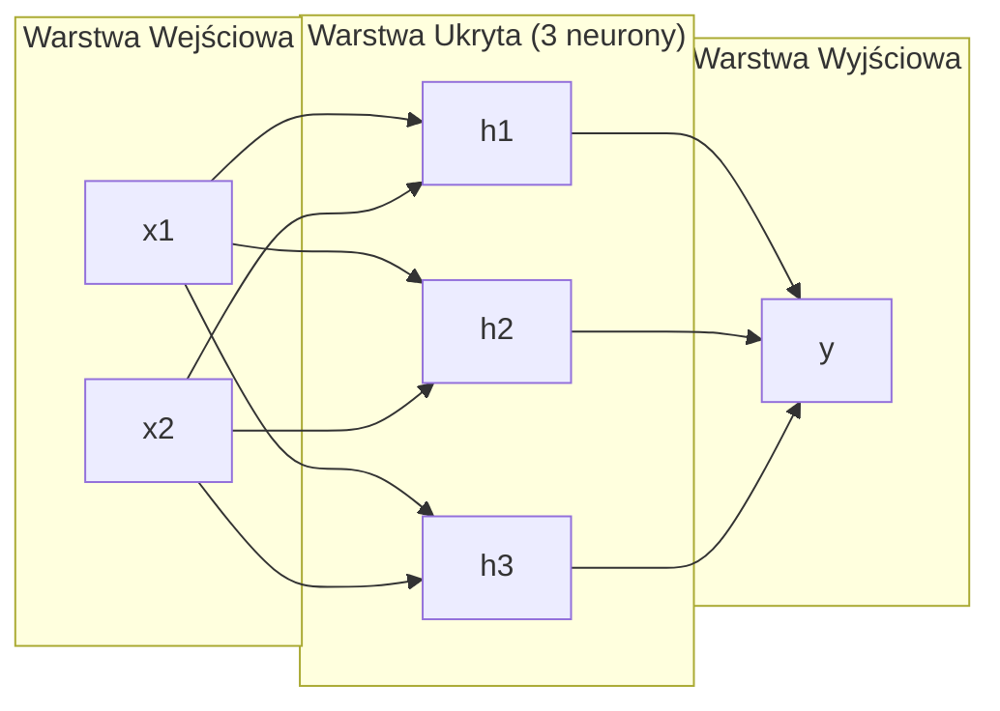
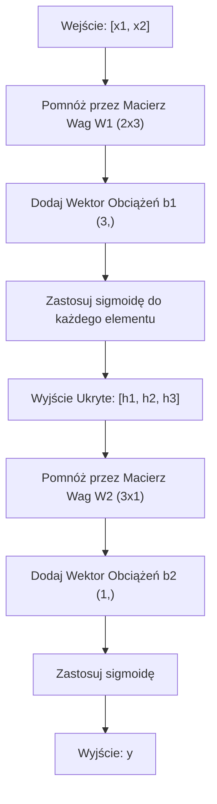
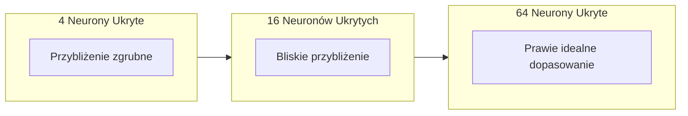

# Sieci Wielowarstwowe i Przejście Wprzód (Forward Pass)

> Jeden neuron rysuje linię. Ułóż je w stos, a będziesz mógł narysować wszystko.

**Type:** Build
**Languages:** Python
**Prerequisites:** Phase 01 (Math Foundations), Lesson 03.01 (The Perceptron)
**Time:** ~90 minutes

## Learning Objectives

- Zbudować sieć wielowarstwową od podstaw z klasami Layer i Network wykonującymi pełne przejście wprzód
- Śledzić wymiary macierzy przez każdą warstwę sieci i identyfikować niezgodności kształtów
- Wyjaśnić, jak układanie nieliniowych aktywacji umożliwia sieci uczenie się zakrzywionych granic decyzyjnych
- Rozwiązać problem XOR przy użyciu architektury 2-2-1 z ręcznie dobranymi wagami sigmoidalnymi

## The Problem

Pojedynczy neuron to rysownik linii. Tylko tyle. Jedna prosta linia przez twoje dane. Każdy rzeczywisty problem w AI -- rozpoznawanie obrazów, rozumienie języka, gra w Go -- wymaga krzywych. Układanie neuronów w warstwy to sposób na uzyskanie krzywych.

W 1969 roku Minsky i Papert udowodnili, że to ograniczenie jest krytyczne: sieć jednowarstwowa nie może nauczyć się XOR. Nie "ma trudności z nauczeniem się" -- matematycznie nie może. Tabela prawdy XOR umieszcza [0,1] i [1,0] po jednej stronie, [0,0] i [1,1] po drugiej. Żadna pojedyncza linia ich nie rozdzieli.

To zabiło finansowanie sieci neuronowych na ponad dekadę. Rozwiązanie było oczywiste z perspektywy czasu: przestań używać jednej warstwy. Układaj neurony w warstwy. Pozwól pierwszej warstwie wyciąć przestrzeń wejściową w nowe cechy, a drugiej warstwie połączyć te cechy w decyzje, których żadna pojedyncza linia nie mogłaby podjąć.

Ten stos to sieć wielowarstwowa. Jest fundamentem każdego modelu głębokiego uczenia w produkcji dzisiaj. Przejście wprzód -- dane płynące od wejścia przez warstwy ukryte do wyjścia -- jest pierwszą rzeczą, którą musisz zbudować, zanim cokolwiek innego zacznie działać.

## The Concept

### Warstwy: Wejściowa, Ukryte, Wyjściowa

Sieć wielowarstwowa ma trzy typy warstw:

**Warstwa wejściowa** -- to tak naprawdę nie jest warstwa. Przechowuje twoje surowe dane. Dwie cechy oznaczają dwa węzły wejściowe. Nie odbywa się tu żadne obliczenie.

**Warstwy ukryte** -- tutaj odbywa się praca. Każdy neuron przyjmuje każde wyjście z poprzedniej warstwy, stosuje wagi i obciążenie (bias), a następnie przepuszcza wynik przez funkcję aktywacji. "Ukryte", ponieważ nigdy nie widzisz tych wartości bezpośrednio w danych treningowych.

**Warstwa wyjściowa** -- ostateczna odpowiedź. Dla klasyfikacji binarnej: jeden neuron z sigmoidą. Dla wieloklasowej: jeden neuron na klasę.



To jest sieć 2-3-1. Dwa wejścia, trzy neurony ukryte, jedno wyjście. Każde połączenie niesie wagę. Każdy neuron (z wyjątkiem wejściowych) niesie obciążenie.

Każda warstwa produkuje wektor liczb zwany stanem ukrytym. Dla tekstu, stany ukryte zwiększają wymiarowość -- kodując słowo jako 768 liczb, aby uchwycić znaczenie semantyczne. Dla obrazów, zmniejszają wymiarowość -- kompresując miliony pikseli do zarządzalnej reprezentacji. Stan ukryty jest tym, gdzie żyje uczenie się.

### Neurony i Aktywacje

Każdy neuron wykonuje trzy rzeczy:

1. Mnoży każde wejście przez odpowiadającą mu wagę
2. Sumuje wszystkie iloczyny i dodaje obciążenie
3. Przekazuje sumę przez funkcję aktywacji

Na razie aktywacją jest sigmoida:

```
sigmoid(z) = 1 / (1 + e^(-z))
```

Sigmoida ściska dowolną liczbę do zakresu (0, 1). Duże dodatnie wejścia popychają w kierunku 1. Duże ujemne wejścia popychają w kierunku 0. Zero mapuje na 0.5. Ta gładka krzywa umożliwia uczenie -- w przeciwieństwie do twardego progu perceptronu, sigmoida ma gradient wszędzie.

### Przejście Wprzód: Jak Przepływają Dane

Przejście wprzód przepycha dane wejściowe przez sieć, warstwa po warstwie, aż dotrą do wyjścia. Żadne uczenie nie odbywa się podczas przejścia wprzód. To czyste obliczenia: mnoż, dodawaj, aktywuj, powtarzaj.



W każdej warstwie trzy operacje zachodzą sekwencyjnie:

```
z = W * wejście + b       (transformacja liniowa)
a = sigmoid(z)            (aktywacja)
```

Wyjście jednej warstwy staje się wejściem do następnej. To całe przejście wprzód.

### Wymiary Macierzy

Śledzenie wymiarów to najważniejsza umiejętność debugowania w głębokim uczeniu. Oto sieć 2-3-1:

| Krok | Operacja | Wymiary | Kształt Wyniku |
|------|-----------|------------|-------------|
| Wejście | x | -- | (2,) |
| Liniowa ukryta | W1 * x + b1 | W1: (3, 2), b1: (3,) | (3,) |
| Aktywacja ukryta | sigmoid(z1) | -- | (3,) |
| Liniowa wyjściowa | W2 * h + b2 | W2: (1, 3), b2: (1,) | (1,) |
| Aktywacja wyjściowa | sigmoid(z2) | -- | (1,) |

Zasada: macierz wag W w warstwie k ma kształt (neurony_w_warstwie_k, neurony_w_warstwie_k_minus_1). Wiersze odpowiadają bieżącej warstwie. Kolumny odpowiadają poprzedniej warstwie. Jeśli kształty nie pasują do siebie, masz błąd.

### Twierdzenie o Uniwersalnej Aproksymacji

W 1989 roku George Cybenko udowodnił coś niezwykłego: sieć neuronowa z pojedynczą warstwą ukrytą i wystarczającą liczbą neuronów może aproksymować dowolną funkcję ciągłą z dowolną dokładnością.

To nie znaczy, że jedna warstwa ukryta jest zawsze najlepsza. Oznacza, że architektura jest teoretycznie zdolna. W praktyce, głębsze sieci (więcej warstw, mniej neuronów na warstwę) uczą się tych samych funkcji przy znacznie mniejszej liczbie parametrów niż płytkie-szerokie sieci. Dlatego głębokie uczenie działa.

Intuicja: każdy neuron w warstwie ukrytej uczy się jednego "garbu" lub cechy. Wystarczająca liczba garbów umieszczonych w odpowiednich miejscach może aproksymować dowolną gładką krzywą. Więcej neuronów, więcej garbów, lepsza aproksymacja.



### Kompozycyjność

Sieci neuronowe są kompozycyjne. Można je układać w stos, łączyć w łańcuchy, uruchamiać równolegle. Model Whisper używa sieci enkodera do przetwarzania audio i oddzielnej sieci dekodera do generowania tekstu. Nowoczesne LLM są dekoder-only. BERT jest enkoder-only. T5 jest enkoder-dekoder. Wybór architektury definiuje, co model może zrobić.

```figure
mlp-forward
```

## Build It

Czysty Python. Bez numpy. Każda operacja na macierzach napisana od podstaw.

### Krok 1: Aktywacja Sigmoidalna

```python
import math

def sigmoid(x):
    x = max(-500.0, min(500.0, x))
    return 1.0 / (1.0 + math.exp(-x))
```

Zakleszczenie do [-500, 500] zapobiega przepełnieniu. `math.exp(500)` jest duże, ale skończone. `math.exp(1000)` to nieskończoność.

### Krok 2: Klasa Layer

Najważniejszą operacją w całym głębokim uczeniu jest mnożenie macierzy. Każda warstwa, każda głowa attention, każde przejście wprzód -- to matmule w dół. Warstwa liniowa przyjmuje wektor wejściowy, mnoży go przez macierz wag i dodaje wektor obciążeń: y = Wx + b. To pojedyncze równanie stanowi 90% obliczeń w sieci neuronowej.

Warstwa przechowuje macierz wag i wektor obciążeń. Jej metoda forward przyjmuje wektor wejściowy i zwraca aktywowane wyjście.

```python
class Layer:
    def __init__(self, n_inputs, n_neurons, weights=None, biases=None):
        if weights is not None:
            self.weights = weights
        else:
            import random
            self.weights = [
                [random.uniform(-1, 1) for _ in range(n_inputs)]
                for _ in range(n_neurons)
            ]
        if biases is not None:
            self.biases = biases
        else:
            self.biases = [0.0] * n_neurons

    def forward(self, inputs):
        self.last_input = inputs
        self.last_output = []
        for neuron_idx in range(len(self.weights)):
            z = sum(
                w * x for w, x in zip(self.weights[neuron_idx], inputs)
            )
            z += self.biases[neuron_idx]
            self.last_output.append(sigmoid(z))
        return self.last_output
```

Macierz wag ma kształt (n_neurons, n_inputs). Każdy wiersz to wagi jednego neuronu dla wszystkich wejść. Metoda forward iteruje przez neurony, oblicza ważoną sumę plus obciążenie, stosuje sigmoidę i zbiera wyniki.

### Krok 3: Klasa Network

Sieć to lista warstw. Przejście wprzód łączy je w łańcuch: wyjście warstwy k trafia do warstwy k+1.

```python
class Network:
    def __init__(self, layers):
        self.layers = layers

    def forward(self, inputs):
        current = inputs
        for layer in self.layers:
            current = layer.forward(current)
        return current
```

To całe przejście wprzód. Cztery linie logiki. Dane wchodzą, przepływają przez każdą warstwę, wychodzą po drugiej stronie.

### Krok 4: XOR z Ręcznie Dobranymi Wagami

W Lekcji 01 rozwiązaliśmy XOR poprzez połączenie perceptronów OR, NAND i AND. Teraz zrób to samo z naszymi klasami Layer i Network. Architektura 2-2-1: dwa wejścia, dwa neurony ukryte, jedno wyjście.

```python
hidden = Layer(
    n_inputs=2,
    n_neurons=2,
    weights=[[20.0, 20.0], [-20.0, -20.0]],
    biases=[-10.0, 30.0],
)

output = Layer(
    n_inputs=2,
    n_neurons=1,
    weights=[[20.0, 20.0]],
    biases=[-30.0],
)

xor_net = Network([hidden, output])

xor_data = [
    ([0, 0], 0),
    ([0, 1], 1),
    ([1, 0], 1),
    ([1, 1], 0),
]

for inputs, expected in xor_data:
    result = xor_net.forward(inputs)
    predicted = 1 if result[0] >= 0.5 else 0
    print(f"  {inputs} -> {result[0]:.6f} (rounded: {predicted}, expected: {expected})")
```

Duże wagi (20, -20) sprawiają, że sigmoida zachowuje się jak funkcja progowa. Pierwszy neuron ukryty aproksymuje OR. Drugi aproksymuje NAND. Neuron wyjściowy łączy je w AND, czyli XOR.

### Krok 5: Klasyfikacja Koła

Trudniejszy problem: klasyfikacja punktów 2D jako wewnątrz lub na zewnątrz okręgu o promieniu 0.5 wyśrodkowanego w początku układu. Wymaga to zakrzywionej granicy decyzyjnej -- niemożliwe dla pojedynczego perceptronu.

```python
import random
import math

random.seed(42)

data = []
for _ in range(200):
    x = random.uniform(-1, 1)
    y = random.uniform(-1, 1)
    label = 1 if (x * x + y * y) < 0.25 else 0
    data.append(([x, y], label))

circle_net = Network([
    Layer(n_inputs=2, n_neurons=8),
    Layer(n_inputs=8, n_neurons=1),
])
```

Przy losowych wagach sieć nie będzie dobrze klasyfikować. Ale przejście wprzód nadal działa. O to chodzi -- przejście wprzód to tylko obliczenia. Nauka odpowiednich wag to wsteczna propagacja (backpropagation), która pojawi się w Lekcji 03.

```python
correct = 0
for inputs, expected in data:
    result = circle_net.forward(inputs)
    predicted = 1 if result[0] >= 0.5 else 0
    if predicted == expected:
        correct += 1

print(f"Accuracy with random weights: {correct}/{len(data)} ({100*correct/len(data):.1f}%)")
```

Losowe wagi dają słabą dokładność -- często gorszą niż zgadywanie klasy większościowej. Po treningu (Lekcja 03), ta sama architektura z 8 neuronami ukrytymi narysuje zakrzywioną granicę oddzielającą wnętrze od zewnętrza.

## Use It

PyTorch robi wszystko powyżej w czterech liniach:

```python
import torch
import torch.nn as nn

model = nn.Sequential(
    nn.Linear(2, 8),
    nn.Sigmoid(),
    nn.Linear(8, 1),
    nn.Sigmoid(),
)

x = torch.tensor([[0.0, 0.0], [0.0, 1.0], [1.0, 0.0], [1.0, 1.0]])
output = model(x)
print(output)
```

`nn.Linear(2, 8)` to twoja klasa Layer: macierz wag o kształcie (8, 2), wektor obciążeń o kształcie (8,). `nn.Sigmoid()` to twoja funkcja sigmoidalna zastosowana element po elemencie. `nn.Sequential` to twoja klasa Network: łączy warstwy w kolejności.

Różnica polega na szybkości i skali. PyTorch działa na GPU, obsługuje batche milionów próbek i automatycznie oblicza gradienty dla wstecznej propagacji. Ale logika przejścia wprzód jest identyczna z tym, co właśnie zbudowałeś od podstaw.

## Ship It

Ta lekcja produkuje wielokrotnego użytku prompt do projektowania architektur sieciowych:

- `outputs/prompt-network-architect.md`

Użyj go, gdy potrzebujesz zdecydować, ile warstw, ile neuronów na warstwę i jakie funkcje aktywacji użyć dla danego problemu.

## Exercises

1. Zbuduj sieć 2-4-2-1 (dwie warstwy ukryte) i uruchom przejście wprzód na danych XOR z losowymi wagami. Wypisz pośrednie wyjścia warstw ukrytych, aby zobaczyć, jak reprezentacja przekształca się na każdej warstwie.

2. Zmień rozmiar warstwy ukrytej w klasyfikatorze koła z 8 na 2, a następnie na 32. Uruchom przejście wprzód z losowymi wagami za każdym razem. Czy liczba neuronów ukrytych zmienia zakres lub rozkład wyjścia? Dlaczego?

3. Zaimplementuj metodę `count_parameters` na klasie Network, która zwraca całkowitą liczbę trenowalnych wag i obciążeń. Przetestuj ją na sieci 784-256-128-10 (klasyczna architektura MNIST). Ile ma parametrów?

4. Zbuduj przejście wprzód dla sieci 3-4-4-2. Podaj jej wartości kolorów RGB (znormalizowane do 0-1) i obserwuj dwa wyjścia. To jest architektura dla prostego klasyfikatora kolorów z dwiema klasami.

5. Zastąp sigmoidę funkcją "leaky step": zwróć 0.01 * z jeśli z < 0, w przeciwnym razie 1.0. Uruchom przejście wprzód na XOR z tymi samymi ręcznie dobranymi wagami z Kroku 4. Czy nadal działa? Dlaczego gładka sigmoida jest preferowana nad twardymi progami?

## Key Terms

| Termin | Co ludzie mówią | Co to naprawdę znaczy |
|------|----------------|----------------------|
| Forward pass | "Uruchamianie modelu" | Przepychanie wejścia przez każdą warstwę -- mnożenie przez wagi, dodawanie obciążenia, aktywacja -- w celu uzyskania wyjścia |
| Hidden layer | "Środkowa część" | Dowolna warstwa między wejściem a wyjściem, której wartości nie są bezpośrednio obserwowane w danych |
| Multi-layer network | "Głęboka sieć neuronowa" | Warstwy neuronów ułożone sekwencyjnie, gdzie wyjście każdej warstwy zasila wejście następnej |
| Activation function | "Nieliniowość" | Funkcja zastosowana po transformacji liniowej, która wprowadza krzywizny do granicy decyzyjnej |
| Sigmoid | "Krzywa S" | sigma(z) = 1/(1+e^(-z)), ściska dowolną liczbę rzeczywistą do (0,1), gładka i różniczkowalna wszędzie |
| Weight matrix | "Parametry" | Macierz W o kształcie (neurony_bieżącej_warstwy, neurony_poprzedniej_warstwy) zawierająca uczone siły połączeń |
| Bias vector | "Przesunięcie" | Wektor dodawany po mnożeniu macierzy, który pozwala neuronom aktywować się nawet gdy wszystkie wejścia są zerowe |
| Universal approximation | "Sieci neuronowe mogą nauczyć się wszystkiego" | Pojedyncza warstwa ukryta z wystarczającą liczbą neuronów może aproksymować dowolną funkcję ciągłą -- ale "wystarczająca" może oznaczać miliardy |
| Linear transformation | "Krok mnożenia macierzy" | z = W * x + b, obliczenie przed aktywacją, które mapuje wejścia do nowej przestrzeni |
| Decision boundary | "Gdzie klasyfikator się przełącza" | Powierzchnia w przestrzeni wejściowej, gdzie wyjście sieci przekracza próg klasyfikacji |

## Further Reading

- Michael Nielsen, "Neural Networks and Deep Learning", Chapter 1-2 (http://neuralnetworksanddeeplearning.com/) -- najjaśniejsze darmowe wyjaśnienie przejść wprzód i struktury sieci, z interaktywnymi wizualizacjami
- Cybenko, "Approximation by Superpositions of a Sigmoidal Function" (1989) -- oryginalna praca o twierdzeniu o uniwersalnej aproksymacji, zaskakująco czytelna
- 3Blue1Brown, "But what is a neural network?" (https://www.youtube.com/watch?v=aircAruvnKk) -- 20-minutowy wizualny przegląd warstw, wag i przejść wprzód, który buduje właściwy model mentalny
- Goodfellow, Bengio, Courville, "Deep Learning", Chapter 6 (https://www.deeplearningbook.org/) -- standardowe źródło o sieciach wielowarstwowych, dostępne za darmo online