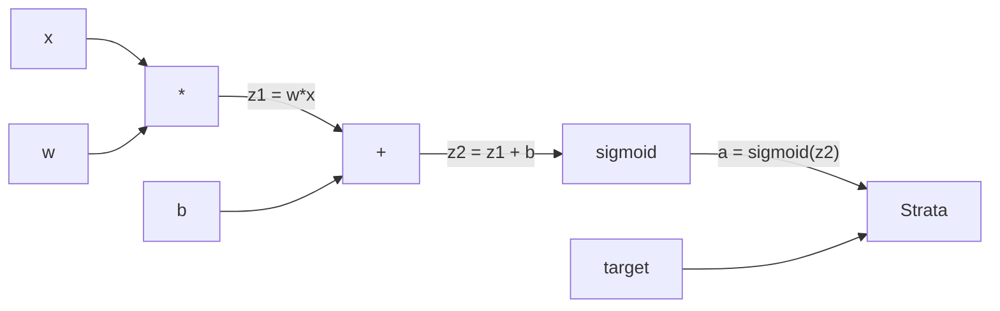
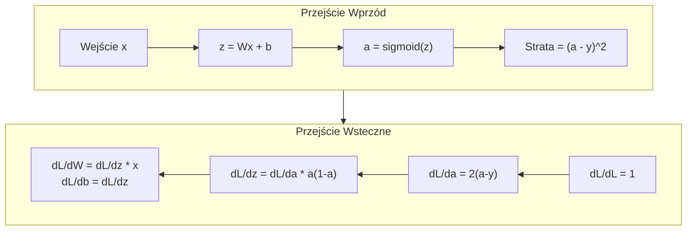
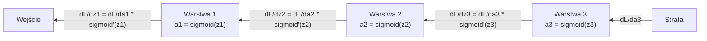

# Wsteczna Propagacja od Podstaw

> Wsteczna propagacja to algorytm, który umożliwia uczenie. Bez niej sieci neuronowe są tylko drogimi generatorami liczb losowych.

**Type:** Build
**Languages:** Python
**Prerequisites:** Lesson 03.02 (Multi-Layer Networks)
**Time:** ~120 minutes

## Learning Objectives

- Zaimplementować silnik autograd oparty na Value, który buduje graf obliczeniowy i oblicza gradienty przez sortowanie topologiczne
- Wyprowadzić przejście wsteczne dla dodawania, mnożenia i sigmoidy przy użyciu reguły łańcuchowej
- Wytrenować sieć wielowarstwową na problemach XOR i klasyfikacji koła używając tylko własnego silnika wstecznej propagacji od podstaw
- Zidentyfikować problem zanikającego gradientu w głębokich sieciach sigmoidalnych i wyjaśnić, dlaczego gradienty kurczą się wykładniczo

## The Problem

Twoja sieć ma jedną warstwę ukrytą z 768 wejściami i 3072 wyjściami. To 2 359 296 wag. Sieć dokonała błędnej predykcji. Które wagi spowodowały błąd? Testowanie każdej wagi indywidualnie oznacza 2,3 miliona przejść wprzód. Wsteczna propagacja oblicza wszystkie 2,3 miliona gradientów w jednym przejściu wstecznym. To nie jest optymalizacja. To różnica między możliwością trenowania a niemożliwością.

Naiwne podejście: weź jedną wagę, przesuń ją o minimalną wartość, uruchom ponownie przejście wprzód, zmierz, czy strata wzrosła czy spadła. To daje gradient dla tej wagi. Teraz zrób to dla każdej wagi w sieci. Pomnóż przez tysiące kroków treningowych i miliony punktów danych. Potrzebowałbyś czasu geologicznego, aby wytrenować cokolwiek użytecznego.

Wsteczna propagacja rozwiązuje to. Jedno przejście wprzód, jedno przejście wsteczne, wszystkie gradienty obliczone. Sztuczka polega na regule łańcuchowej z rachunku różniczkowego, zastosowanej systematycznie do grafu obliczeniowego. To jest algorytm, który uczynił głębokie uczenie praktycznym. Bez niego wciąż utknęlibyśmy na zabawkowych problemach.

## The Concept

### Reguła Łańcuchowa, Zastosowana do Sieci

Widziałeś regułę łańcuchową w Fazie 01, Lekcji 05. Szybkie przypomnienie: jeśli y = f(g(x)), to dy/dx = f'(g(x)) * g'(x). Mnożysz pochodne wzdłuż łańcucha.

W sieci neuronowej "łańcuch" to sekwencja operacji od wejścia do straty. Każda warstwa stosuje wagi, dodaje obciążenia, przepuszcza przez aktywację. Funkcja straty porównuje końcowe wyjście z celem. Wsteczna propagacja śledzi ten łańcuch wstecz, obliczając, jak każda operacja przyczyniła się do błędu.

### Grafy Obliczeniowe

Każde przejście wprzód buduje graf. Każdy węzeł to operacja (mnożenie, dodawanie, sigmoida). Każda krawędź niesie wartość do przodu i gradient do tyłu.



Przejście wprzód: wartości płyną od lewej do prawej. x i w produkują z1 = w*x. Dodaj b, aby otrzymać z2. Sigmoida daje aktywację a. Porównaj a z celem y za pomocą funkcji straty.

Przejście wsteczne: gradienty płyną od prawej do lewej. Zacznij od dL/da (jak strata zmienia się wraz z aktywacją). Pomnóż przez da/dz2 (pochodna sigmoidy). To daje dL/dz2. Rozdziel na dL/db (które równa się dL/dz2, ponieważ z2 = z1 + b) i dL/dz1. Następnie dL/dw = dL/dz1 * x i dL/dx = dL/dz1 * w.

Każdy węzeł w grafie ma jedno zadanie podczas przejścia wstecznego: wziąć gradient przychodzący z góry, pomnożyć przez swoją lokalną pochodną i przekazać go dalej.

### Przód vs Tył



Przejście wprzód przechowuje każdą wartość pośrednią: z, a, wejścia do każdej warstwy. Przejście wsteczne potrzebuje tych zapisanych wartości do obliczenia gradientów. To jest kompromis pamięć-obliczenia w sercu wstecznej propagacji. Wymieniasz pamięć (przechowywanie aktywacji) na prędkość (jedno przejście zamiast milionów).

### Przepływ Gradientu Przez Sieć

Dla sieci 3-warstwowej, gradienty łańcuchują przez każdą warstwę:



Na każdej warstwie gradient jest mnożony przez pochodną sigmoidy. Pochodna sigmoidy to a * (1 - a), która osiąga maksimum 0.25 (gdy a = 0.5). Trzy warstwy w głąb, gradient został pomnożony przez co najwyżej 0.25^3 = 0.0156. Dziesięć warstw w głąb: 0.25^10 = 0.000001.

### Zanikające Gradienty

To jest problem zanikającego gradientu. Sigmoida ściska swoje wyjście między 0 a 1. Jej pochodna jest zawsze mniejsza niż 0.25. Ułóż wystarczająco wiele warstw sigmoidalnych, a gradienty skurczą się do zera. Wczesne warstwy ledwo się uczą, ponieważ otrzymują gradienty bliskie zeru.

```
sigmoid(z):     Zakres wyjścia [0, 1]
sigmoid'(z):    Maksymalna wartość 0.25 (przy z = 0)

Po 5 warstwach:   gradient * 0.25^5 = 0.001x oryginału
Po 10 warstwach:  gradient * 0.25^10 = 0.000001x oryginału
```

Dlatego głębokie sieci sigmoidalne są prawie niemożliwe do wytrenowania. Rozwiązanie -- ReLU i jego warianty -- jest tematem Lekcji 04. Na razie zrozum, że wsteczna propagacja działa doskonale. Problemem jest to, przez co pracuje.

### Wyprowadzanie Gradientów dla Sieci 2-Warstwowej

Konkretna matematyka dla sieci z wejściem x, warstwą ukrytą z sigmoidą, warstwą wyjściową z sigmoidą i stratą MSE.

Przejście wprzód:
```
z1 = W1 * x + b1
a1 = sigmoid(z1)
z2 = W2 * a1 + b2
a2 = sigmoid(z2)
L = (a2 - y)^2
```

Przejście wsteczne (stosując regułę łańcuchową krok po kroku):
```
dL/da2 = 2(a2 - y)
da2/dz2 = a2 * (1 - a2)
dL/dz2 = dL/da2 * da2/dz2 = 2(a2 - y) * a2 * (1 - a2)

dL/dW2 = dL/dz2 * a1
dL/db2 = dL/dz2

dL/da1 = dL/dz2 * W2
da1/dz1 = a1 * (1 - a1)
dL/dz1 = dL/da1 * da1/dz1

dL/dW1 = dL/dz1 * x
dL/db1 = dL/dz1
```

Każdy gradient jest iloczynem lokalnych pochodnych prześledzonych wstecz od straty. To wszystko, czym jest wsteczna propagacja.

```figure
backprop-vanishing
```

## Build It

### Krok 1: Węzeł Value

Każda liczba w naszych obliczeniach staje się Value. Przechowuje swoje dane, swój gradient i to, jak został utworzony (więc wie, jak obliczać gradienty wstecz).

```python
class Value:
    def __init__(self, data, children=(), op=''):
        self.data = data
        self.grad = 0.0
        self._backward = lambda: None
        self._children = set(children)
        self._op = op

    def __repr__(self):
        return f"Value(data={self.data:.4f}, grad={self.grad:.4f})"
```

Jeszcze żaden gradient (0.0). Jeszcze żadna funkcja wsteczna (brak operacji). `_children` śledzi, które Value go utworzyły, abyśmy mogli później topologicznie posortować graf.

### Krok 2: Operacje z Funkcjami Wstecznymi

Każda operacja tworzy nowe Value i definiuje, jak gradienty przepływają przez nią wstecz.

```python
def __add__(self, other):
    other = other if isinstance(other, Value) else Value(other)
    out = Value(self.data + other.data, (self, other), '+')

    def _backward():
        self.grad += out.grad
        other.grad += out.grad

    out._backward = _backward
    return out

def __mul__(self, other):
    other = other if isinstance(other, Value) else Value(other)
    out = Value(self.data * other.data, (self, other), '*')

    def _backward():
        self.grad += other.data * out.grad
        other.grad += self.data * out.grad

    out._backward = _backward
    return out
```

Dla dodawania: d(a+b)/da = 1, d(a+b)/db = 1. Więc oba wejścia otrzymują bezpośrednio gradient wyjścia.

Dla mnożenia: d(a*b)/da = b, d(a*b)/db = a. Każde wejście otrzymuje wartość drugiego razy gradient wyjścia.

`+=` jest krytyczne. Value może być użyte w wielu operacjach. Jego gradient jest sumą gradientów ze wszystkich ścieżek.

### Krok 3: Sigmoida i Strata

```python
import math

def sigmoid(self):
    x = self.data
    x = max(-500, min(500, x))
    s = 1.0 / (1.0 + math.exp(-x))
    out = Value(s, (self,), 'sigmoid')

    def _backward():
        self.grad += (s * (1 - s)) * out.grad

    out._backward = _backward
    return out
```

Pochodna sigmoidy: sigmoid(x) * (1 - sigmoid(x)). Obliczyliśmy sigmoid(x) = s podczas przejścia wprzód. Użyj jej ponownie. Żadnej dodatkowej pracy.

```python
def mse_loss(predicted, target):
    diff = predicted + Value(-target)
    return diff * diff
```

MSE dla pojedynczego wyjścia: (przewidywane - cel)^2. Wyrażamy odejmowanie jako dodawanie z zanegowanym Value.

### Krok 4: Przejście Wsteczne

Sortowanie topologiczne zapewnia, że przetwarzamy węzły we właściwej kolejności -- gradient węzła jest w pełni zgromadzony, zanim przez niego propagujemy.

```python
def backward(self):
    topo = []
    visited = set()

    def build_topo(v):
        if v not in visited:
            visited.add(v)
            for child in v._children:
                build_topo(child)
            topo.append(v)

    build_topo(self)
    self.grad = 1.0
    for v in reversed(topo):
        v._backward()
```

Zacznij od straty (gradient = 1.0, ponieważ dL/dL = 1). Idź wstecz przez posortowany graf. Każdy `_backward` węzła przepycha gradienty do jego dzieci.

### Krok 5: Warstwa i Sieć

```python
import random

class Neuron:
    def __init__(self, n_inputs):
        scale = (2.0 / n_inputs) ** 0.5
        self.weights = [Value(random.uniform(-scale, scale)) for _ in range(n_inputs)]
        self.bias = Value(0.0)

    def __call__(self, x):
        act = sum((wi * xi for wi, xi in zip(self.weights, x)), self.bias)
        return act.sigmoid()

    def parameters(self):
        return self.weights + [self.bias]


class Layer:
    def __init__(self, n_inputs, n_outputs):
        self.neurons = [Neuron(n_inputs) for _ in range(n_outputs)]

    def __call__(self, x):
        out = [n(x) for n in self.neurons]
        return out[0] if len(out) == 1 else out

    def parameters(self):
        params = []
        for n in self.neurons:
            params.extend(n.parameters())
        return params


class Network:
    def __init__(self, sizes):
        self.layers = []
        for i in range(len(sizes) - 1):
            self.layers.append(Layer(sizes[i], sizes[i + 1]))

    def __call__(self, x):
        for layer in self.layers:
            x = layer(x)
            if not isinstance(x, list):
                x = [x]
        return x[0] if len(x) == 1 else x

    def parameters(self):
        params = []
        for layer in self.layers:
            params.extend(layer.parameters())
        return params

    def zero_grad(self):
        for p in self.parameters():
            p.grad = 0.0
```

Neuron przyjmuje wejścia, oblicza ważoną sumę + obciążenie i stosuje sigmoidę. Inicjalizacja wag skaluje przez sqrt(2/n_inputs), aby zapobiec nasyceniu sigmoidy w głębszych sieciach. Warstwa to lista Neuronów. Sieć to lista Warstw. Metoda `parameters()` zbiera wszystkie uczone Value, abyśmy mogli je aktualizować.

### Krok 6: Trenuj na XOR

```python
random.seed(42)
net = Network([2, 4, 1])

xor_data = [
    ([0.0, 0.0], 0.0),
    ([0.0, 1.0], 1.0),
    ([1.0, 0.0], 1.0),
    ([1.0, 1.0], 0.0),
]

learning_rate = 1.0

for epoch in range(1000):
    total_loss = Value(0.0)
    for inputs, target in xor_data:
        x = [Value(i) for i in inputs]
        pred = net(x)
        loss = mse_loss(pred, target)
        total_loss = total_loss + loss

    net.zero_grad()
    total_loss.backward()

    for p in net.parameters():
        p.data -= learning_rate * p.grad

    if epoch % 100 == 0:
        print(f"Epoch {epoch:4d} | Loss: {total_loss.data:.6f}")

print("\nXOR Results:")
for inputs, target in xor_data:
    x = [Value(i) for i in inputs]
    pred = net(x)
    print(f"  {inputs} -> {pred.data:.4f} (expected {target})")
```

Obserwuj, jak strata maleje. Od losowych predykcji do poprawnych wyjść XOR, napędzane w całości przez wsteczną propagację obliczającą gradienty i popychającą wagi we właściwym kierunku.

### Krok 7: Klasyfikacja Koła

W Lekcji 02 ręcznie dobierałeś wagi do klasyfikacji koła. Teraz pozwól sieci nauczyć się ich.

```python
random.seed(7)

def generate_circle_data(n=100):
    data = []
    for _ in range(n):
        x1 = random.uniform(-1.5, 1.5)
        x2 = random.uniform(-1.5, 1.5)
        label = 1.0 if x1 * x1 + x2 * x2 < 1.0 else 0.0
        data.append(([x1, x2], label))
    return data

circle_data = generate_circle_data(80)

circle_net = Network([2, 8, 1])
learning_rate = 0.5

for epoch in range(2000):
    random.shuffle(circle_data)
    total_loss_val = 0.0
    for inputs, target in circle_data:
        x = [Value(i) for i in inputs]
        pred = circle_net(x)
        loss = mse_loss(pred, target)
        circle_net.zero_grad()
        loss.backward()
        for p in circle_net.parameters():
            p.data -= learning_rate * p.grad
        total_loss_val += loss.data

    if epoch % 200 == 0:
        correct = 0
        for inputs, target in circle_data:
            x = [Value(i) for i in inputs]
            pred = circle_net(x)
            predicted_class = 1.0 if pred.data > 0.5 else 0.0
            if predicted_class == target:
                correct += 1
        accuracy = correct / len(circle_data) * 100
        print(f"Epoch {epoch:4d} | Loss: {total_loss_val:.4f} | Accuracy: {accuracy:.1f}%")
```

Używamy tutaj online SGD -- aktualizujemy wagi po każdej próbce zamiast akumulować cały batch. To szybciej przełamuje symetrię i unika nasycenia sigmoidy na pełnym krajobrazie straty. Tasowanie danych w każdej epoce zapobiega zapamiętywaniu przez sieć kolejności.

Żadnego ręcznego dostrajania. Sieć odkrywa okrągłą granicę decyzyjną sama. To jest potęga wstecznej propagacji: definiujesz architekturę, funkcję straty i dane. Algorytm znajduje wagi.

## Use It

PyTorch robi wszystko powyżej w kilku liniach. Podstawowa idea jest identyczna -- autograd buduje graf obliczeniowy podczas przejścia wprzód i śledzi go wstecz, aby obliczyć gradienty.

```python
import torch
import torch.nn as nn

model = nn.Sequential(
    nn.Linear(2, 4),
    nn.Sigmoid(),
    nn.Linear(4, 1),
    nn.Sigmoid(),
)
optimizer = torch.optim.SGD(model.parameters(), lr=1.0)
criterion = nn.MSELoss()

X = torch.tensor([[0,0],[0,1],[1,0],[1,1]], dtype=torch.float32)
y = torch.tensor([[0],[1],[1],[0]], dtype=torch.float32)

for epoch in range(1000):
    pred = model(X)
    loss = criterion(pred, y)
    optimizer.zero_grad()
    loss.backward()
    optimizer.step()

print("PyTorch XOR Results:")
with torch.no_grad():
    for i in range(4):
        pred = model(X[i])
        print(f"  {X[i].tolist()} -> {pred.item():.4f} (expected {y[i].item()})")
```

`loss.backward()` to twoje `total_loss.backward()`. `optimizer.step()` to twoje ręczne `p.data -= lr * p.grad`. `optimizer.zero_grad()` to twoje `net.zero_grad()`. Ten sam algorytm, przemysłowej klasy implementacja. PyTorch obsługuje akcelerację GPU, mieszaną precyzję, gradient checkpointing i setki typów warstw. Ale przejście wsteczne to ta sama reguła łańcuchowa zastosowana do tego samego grafu obliczeniowego.

Trening uruchamia przejście wprzód, potem przejście wsteczne, potem aktualizuje wagi. Inferencja uruchamia tylko przejście wprzód. Żadnych gradientów, żadnych aktualizacji. To rozróżnienie ma znaczenie, ponieważ inferencja ma miejsce w produkcji. Kiedy wywołujesz API, takie jak Claude czy GPT, uruchamiasz inferencję -- twój prompt płynie wprzód przez sieć, a tokeny wychodzą po drugiej stronie. Żadne wagi się nie zmieniają. Zrozumienie wstecznej propagacji ma znaczenie, ponieważ ukształtowała każdą wagę w tej sieci.

## Ship It

Ta lekcja produkuje:
- `outputs/prompt-gradient-debugger.md` -- wielokrotnego użytku prompt do diagnozowania problemów z gradientami (zanikające, eksplodujące, NaN) w dowolnej sieci neuronowej

## Exercises

1. Dodaj metodę `__sub__` do klasy Value (a - b = a + (-1 * b)). Następnie zaimplementuj metodę `__neg__`. Zweryfikuj, że gradienty są poprawne, porównując z ręcznym obliczeniem dla prostego wyrażenia takiego jak (a - b)^2.

2. Dodaj metodę `relu` do Value (wyjście max(0, x), pochodna to 1 jeśli x > 0, w przeciwnym razie 0). Zastąp sigmoidę funkcją relu w warstwach ukrytych i trenuj ponownie na XOR. Porównaj szybkość zbieżności. Powinieneś zobaczyć szybsze trenowanie -- to zapowiedź Lekcji 04.

3. Zaimplementuj metodę `__pow__` na Value dla potęg całkowitych. Użyj jej, aby zastąpić `mse_loss` wyrażeniem `(przewidywane - cel) ** 2`. Zweryfikuj, że gradienty są zgodne z oryginalną implementacją.

4. Dodaj przycinanie gradientów (gradient clipping) do pętli treningowej: po wywołaniu `backward()`, przytnij wszystkie gradienty do [-1, 1]. Trenuj głębszą sieć (4+ warstw z sigmoidą) i porównaj krzywe straty z przycinaniem i bez. To twoja pierwsza obrona przed eksplodującymi gradientami.

5. Zbuduj wizualizację: po treningu na XOR, wypisz gradient każdego parametru w sieci. Zidentyfikuj, która warstwa ma najmniejsze gradienty. To demonstruje problem zanikającego gradientu, o którym czytałeś w sekcji The Concept.

## Key Terms

| Termin | Co ludzie mówią | Co to naprawdę znaczy |
|------|----------------|----------------------|
| Backpropagation | "Sieć się uczy" | Algorytm obliczający dL/dw dla każdej wagi poprzez zastosowanie reguły łańcuchowej wstecz przez graf obliczeniowy |
| Computational graph | "Struktura sieci" | Skierowany graf acykliczny, gdzie węzły są operacjami, a krawędzie niosą wartości (wprzód) i gradienty (wstecz) |
| Chain rule | "Pomnóż pochodne" | Jeśli y = f(g(x)), to dy/dx = f'(g(x)) * g'(x) -- matematyczny fundament wstecznej propagacji |
| Gradient | "Kierunek najstromszego wzrostu" | Pochodna cząstkowa straty względem parametru -- mówi, jak zmienić ten parametr, aby zmniejszyć stratę |
| Vanishing gradient | "Głębokie sieci się nie uczą" | Gradienty kurczą się wykładniczo w miarę propagacji przez warstwy z nasycającymi aktywacjami takimi jak sigmoida |
| Forward pass | "Uruchamianie sieci" | Obliczanie wyjścia z wejść poprzez sekwencyjne stosowanie operacji każdej warstwy i przechowywanie wartości pośrednich |
| Backward pass | "Obliczanie gradientów" | Przechodzenie grafu obliczeniowego w odwrotnej kolejności, akumulowanie gradientów w każdym węźle przy użyciu reguły łańcuchowej |
| Learning rate | "Jak szybko się uczy" | Skalar kontrolujący wielkość kroku przy aktualizacji wag: w_nowe = w_stare - lr * gradient |
| Topological sort | "Właściwa kolejność" | Uporządkowanie węzłów grafu, gdzie każdy węzeł pojawia się po wszystkich węzłach, od których zależy -- zapewnia pełne zgromadzenie gradientów przed propagacją |
| Autograd | "Automatyczne różniczkowanie" | System budujący grafy obliczeniowe podczas obliczeń wprzód i automatycznie obliczający gradienty -- to, co robi silnik PyTorcha |

## Further Reading

- Rumelhart, Hinton & Williams, "Learning representations by back-propagating errors" (1986) -- praca, która uczyniła wsteczną propagację mainstreamem i odblokowała trenowanie sieci wielowarstwowych
- 3Blue1Brown, "Neural Networks" series (https://www.youtube.com/playlist?list=PLZHQObOWTQDNU6R1_67000Dx_ZCJB-3pi) -- najlepsze wizualne wyjaśnienie wstecznej propagacji i przepływu gradientu przez sieci