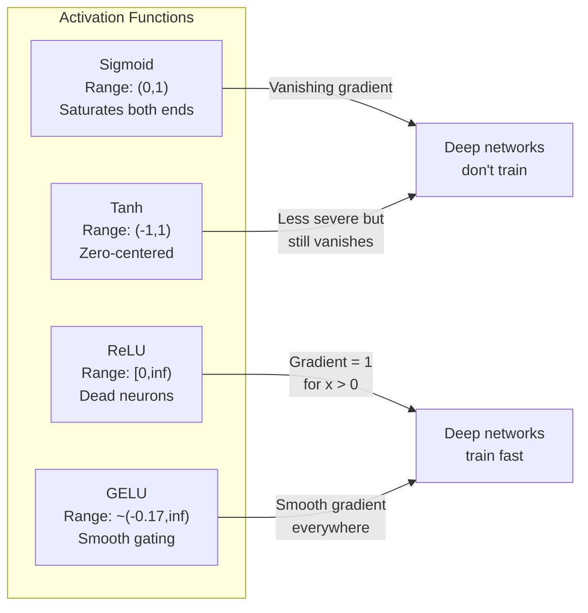
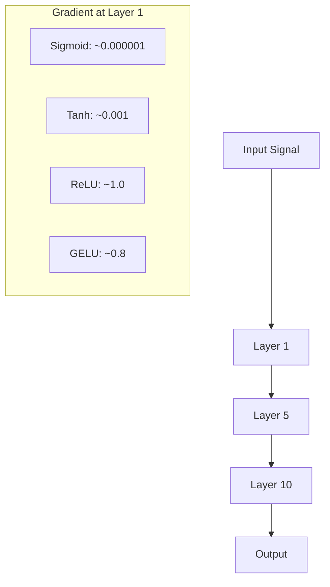
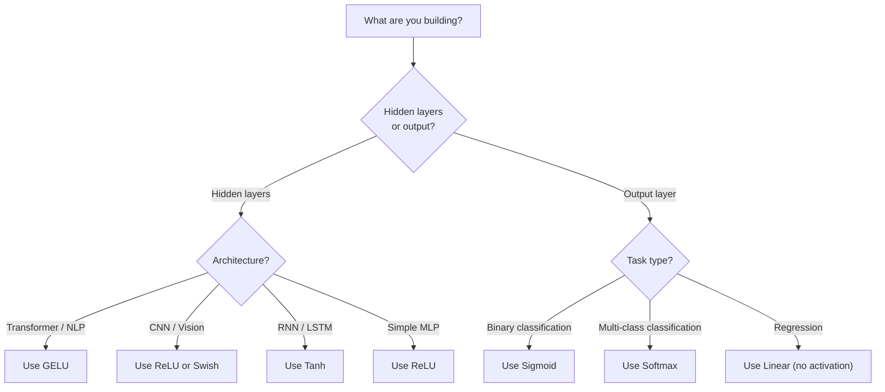

# Funkcje aktywacji

> Bez nieliniowości twoja 100-warstwowa sieć to wymyślne mnożenie macierzy. Aktywacje to bramy, które pozwalają sieciom neuronowym myśleć krzywiznami.

**Type:** Build
**Languages:** Python
**Prerequisites:** Lesson 03.03 (Backpropagation)
**Time:** ~75 minut

## Learning Objectives

- Zaimplementuj od zera sigmoid, tanh, ReLU, Leaky ReLU, GELU, Swish i softmax wraz z ich pochodnymi
- Zdiagnozuj problem zanikającego gradientu, mierząc wielkości aktywacji przez 10+ warstw z różnymi aktywacjami
- Wykryj martwe neurony w sieci ReLU i wyjaśnij, dlaczego GELU unika tego trybu awarii
- Wybierz odpowiednią funkcję aktywacji dla danej architektury (transformer, CNN, RNN, warstwa wyjściowa)

## Problem

Złóż dwie transformacje liniowe: y = W2(W1x + b1) + b2. Rozwiń to: y = W2W1x + W2b1 + b2. To tylko y = Ax + c -- pojedyncza transformacja liniowa. Nieważne, ile liniowych warstw ułożysz, wynik sprowadza się do jednego mnożenia macierzy. Twoja 100-warstwowa sieć ma taką samą moc reprezentacyjną jak pojedyncza warstwa.

To nie jest teoretyczna ciekawostka. Oznacza to, że głęboka liniowa sieć dosłownie nie może nauczyć się XOR, nie może sklasyfikować spiralnego zbioru danych, nie może rozpoznać twarzy. Bez funkcji aktywacji głębokość jest iluzją.

Funkcje aktywacji przełamują liniowość. Wypaczają wynik każdej warstwy poprzez nieliniową funkcję, dając sieci zdolność do wyginania granic decyzyjnych, przybliżania dowolnych funkcji i faktycznego uczenia się. Ale wybierz złą aktywację, a twoje gradienty znikną do zera (sigmoid w głębokich sieciach), eksplodują do nieskończoności (nieograniczone aktywacje bez starannej inicjalizacji) lub twoje neurony umrą na stałe (ReLU z dużymi ujemnymi biasami). Wybór funkcji aktywacji bezpośrednio decyduje o tym, czy twoja sieć w ogóle się uczy.

## Koncepcja

### Dlaczego nieliniowość jest konieczna

Mnożenie macierzy jest składalne. Pomnożenie wektora przez macierz A, a następnie przez macierz B jest identyczne z pomnożeniem przez AB. Oznacza to, że ułożenie dziesięciu liniowych warstw jest matematycznie równoważne jednej liniowej warstwie z jedną dużą macierzą. Wszystkie te parametry, cała ta głębokość -- zmarnowane. Potrzebujesz czegoś, co przerwie łańcuch. To właśnie robią funkcje aktywacji.

Oto dowód. Liniowa warstwa oblicza f(x) = Wx + b. Złóż dwie:

```
Layer 1: h = W1 * x + b1
Layer 2: y = W2 * h + b2
```

Podstaw:

```
y = W2 * (W1 * x + b1) + b2
y = (W2 * W1) * x + (W2 * b1 + b2)
y = A * x + c
```

Jedna warstwa. Wstaw nieliniową aktywację g() między warstwy:

```
h = g(W1 * x + b1)
y = W2 * h + b2
```

Teraz podstawienie się załamuje. W2 * g(W1 * x + b1) + b2 nie może zostać zredukowane do pojedynczej transformacji liniowej. Sieć może reprezentować funkcje nieliniowe. Każda dodatkowa warstwa z aktywacją dodaje mocy reprezentacyjnej.

### Sigmoid

Oryginalna funkcja aktywacji dla sieci neuronowych.

```
sigmoid(x) = 1 / (1 + e^(-x))
```

Zakres wyjścia: (0, 1). Gładka, różniczkowalna, mapuje dowolną liczbę rzeczywistą na wartość przypominającą prawdopodobieństwo.

Pochodna:

```
sigmoid'(x) = sigmoid(x) * (1 - sigmoid(x))
```

Maksymalna wartość tej pochodnej wynosi 0,25, występująca przy x = 0. W backpropagacji gradienty mnożą się przez warstwy. Dziesięć warstw sigmoid oznacza, że gradient jest mnożony przez co najwyżej 0,25 dziesięć razy:

```
0.25^10 = 0.000000953674
```

Mniej niż jedna milionowa oryginalnego sygnału. To jest problem zanikającego gradientu. Gradienty we wczesnych warstwach stają się tak małe, że wagi ledwo się aktualizują. Sieć wydaje się uczyć -- strata spada w późniejszych warstwach -- ale pierwsze warstwy są zamrożone. Głębokie sieci sigmoidalne po prostu się nie trenują.

Dodatkowy problem: wyjścia sigmoid są zawsze dodatnie (0 do 1), co oznacza, że gradienty na wagach mają zawsze ten sam znak. Powoduje to zygzakowanie podczas gradientowego schodzenia.

### Tanh

Wycentrowana wersja sigmoid.

```
tanh(x) = (e^x - e^(-x)) / (e^x + e^(-x))
```

Zakres wyjścia: (-1, 1). Wycentrowana wokół zera, co eliminuje problem zygzakowania.

Pochodna:

```
tanh'(x) = 1 - tanh(x)^2
```

Maksymalna pochodna wynosi 1.0 przy x = 0 -- cztery razy lepiej niż sigmoid. Ale problem zanikającego gradientu nadal istnieje. Dla dużych dodatnich lub ujemnych wejść pochodna zbliża się do zera. Dziesięć warstw wciąż niszczy gradient, tylko mniej agresywnie.

### ReLU: Przełom

Rectified Linear Unit. Spopularyzowana dla głębokiego uczenia przez Naira i Hintona w 2010 roku (sama funkcja pochodzi z pracy Fukushimy z 1969 roku), zmieniła wszystko.

```
relu(x) = max(0, x)
```

Zakres wyjścia: [0, nieskończoność). Pochodna jest trywialnie prosta:

```
relu'(x) = 1  if x > 0
            0  if x <= 0
```

Brak zanikającego gradientu dla dodatnich wejść. Gradient wynosi dokładnie 1, przekazywany wprost. Dlatego głębokie sieci stały się możliwe do trenowania -- ReLU zachowuje wielkość gradientu przez warstwy.

Ale jest tryb awarii: problem martwych neuronów. Jeśli ważone wejście neuronu jest zawsze ujemne (z powodu dużego ujemnego biasa lub niefortunnej inicjalizacji wag), jego wyjście jest zawsze zero, jego gradient jest zawsze zero i nigdy się nie aktualizuje. Jest trwale martwy. W praktyce 10-40% neuronów w sieci ReLU może umrzeć podczas treningu.

### Leaky ReLU

Najprostsze rozwiązanie dla martwych neuronów.

```
leaky_relu(x) = x        if x > 0
                alpha * x if x <= 0
```

Gdzie alpha to mała stała, zazwyczaj 0.01. Strona ujemna ma małe nachylenie zamiast zera, więc martwe neurony wciąż otrzymują sygnał gradientu i mogą się odrodzić.

### GELU: Nowoczesna domyślna

Gaussian Error Linear Unit. Wprowadzona przez Hendrycksa i Gimpela w 2016 roku. Domyślna aktywacja w BERT, GPT i większości nowoczesnych transformerów.

```
gelu(x) = x * Phi(x)
```

Gdzie Phi(x) to dystrybuanta standardowego rozkładu normalnego. Aproksymacja używana w praktyce:

```
gelu(x) ~= 0.5 * x * (1 + tanh(sqrt(2/pi) * (x + 0.044715 * x^3)))
```

GELU jest gładka wszędzie, dopuszcza małe ujemne wartości (w przeciwieństwie do ReLU, która twardo obcina do zera) i ma interpretację probabilistyczną: waży każde wejście przez to, jak prawdopodobne jest, że będzie dodatnie w rozkładzie Gaussa. To gładkie bramkowanie przewyższa ReLU w architekturach transformerów, ponieważ zapewnia lepszy przepływ gradientu i całkowicie unika problemu martwych neuronów.

### Swish / SiLU

Samobramkowana aktywacja odkryta przez Ramachandrana i in. w 2017 roku poprzez zautomatyzowane przeszukiwanie.

```
swish(x) = x * sigmoid(x)
```

Swish to formalnie x * sigmoid(x). Google odkryło ją poprzez zautomatyzowane przeszukiwanie przestrzeni funkcji aktywacji -- sieć neuronowa projektująca części sieci neuronowych.

Podobnie jak GELU, jest gładka, niemonotoniczna i dopuszcza małe ujemne wartości. Różnica jest subtelna: Swish używa sigmoid do bramkowania, podczas gdy GELU używa dystrybuanty Gaussa. W praktyce wydajność jest prawie identyczna. Swish jest używany w EfficientNet i niektórych modelach wizyjnych. GELU dominuje w modelach językowych.

### Softmax: Aktywacja wyjściowa

Nie używana w warstwach ukrytych. Softmax przekształca wektor surowych wyników (logitów) w rozkład prawdopodobieństwa.

```
softmax(x_i) = e^(x_i) / sum(e^(x_j) for all j)
```

Każde wyjście jest między 0 a 1. Wszystkie wyjścia sumują się do 1. To czyni ją standardową końcową aktywacją dla klasyfikacji wieloklasowej. Największy logit otrzymuje najwyższe prawdopodobieństwo, ale w przeciwieństwie do argmax, softmax jest różniczkowalny i zachowuje informację o względnej pewności.

### Porównanie kształtów



### Porównanie przepływu gradientu



### Którą aktywację kiedy



```figure
softmax-temperature
```

## Zbuduj to

### Krok 1: Zaimplementuj wszystkie funkcje aktywacji z pochodnymi

Każda funkcja przyjmuje pojedynczy float i zwraca float. Każda funkcja pochodnej przyjmuje to samo wejście i zwraca gradient.

```python
import math

def sigmoid(x):
    x = max(-500, min(500, x))
    return 1.0 / (1.0 + math.exp(-x))

def sigmoid_derivative(x):
    s = sigmoid(x)
    return s * (1 - s)

def tanh_act(x):
    return math.tanh(x)

def tanh_derivative(x):
    t = math.tanh(x)
    return 1 - t * t

def relu(x):
    return max(0.0, x)

def relu_derivative(x):
    return 1.0 if x > 0 else 0.0

def leaky_relu(x, alpha=0.01):
    return x if x > 0 else alpha * x

def leaky_relu_derivative(x, alpha=0.01):
    return 1.0 if x > 0 else alpha

def gelu(x):
    return 0.5 * x * (1 + math.tanh(math.sqrt(2 / math.pi) * (x + 0.044715 * x ** 3)))

def gelu_derivative(x):
    phi = 0.5 * (1 + math.erf(x / math.sqrt(2)))
    pdf = math.exp(-0.5 * x * x) / math.sqrt(2 * math.pi)
    return phi + x * pdf

def swish(x):
    return x * sigmoid(x)

def swish_derivative(x):
    s = sigmoid(x)
    return s + x * s * (1 - s)

def softmax(xs):
    max_x = max(xs)
    exps = [math.exp(x - max_x) for x in xs]
    total = sum(exps)
    return [e / total for e in exps]
```

### Krok 2: Wizualizuj, gdzie gradienty umierają

Oblicz gradient w 100 równomiernie rozmieszczonych punktach od -5 do 5. Wypisz histogram tekstowy pokazujący, gdzie gradient każdej aktywacji jest bliski zera.

```python
def gradient_scan(name, derivative_fn, start=-5, end=5, n=100):
    step = (end - start) / n
    near_zero = 0
    healthy = 0
    for i in range(n):
        x = start + i * step
        g = derivative_fn(x)
        if abs(g) < 0.01:
            near_zero += 1
        else:
            healthy += 1
    pct_dead = near_zero / n * 100
    print(f"{name:15s}: {healthy:3d} healthy, {near_zero:3d} near-zero ({pct_dead:.0f}% dead zone)")

gradient_scan("Sigmoid", sigmoid_derivative)
gradient_scan("Tanh", tanh_derivative)
gradient_scan("ReLU", relu_derivative)
gradient_scan("Leaky ReLU", leaky_relu_derivative)
gradient_scan("GELU", gelu_derivative)
gradient_scan("Swish", swish_derivative)
```

### Krok 3: Eksperyment z zanikającym gradientem

Przepuść sygnał w przód przez N warstw używając sigmoid vs ReLU. Zmierz, jak zmienia się wielkość aktywacji.

```python
import random

def vanishing_gradient_experiment(activation_fn, name, n_layers=10, n_inputs=5):
    random.seed(42)
    values = [random.gauss(0, 1) for _ in range(n_inputs)]

    print(f"\n{name} through {n_layers} layers:")
    for layer in range(n_layers):
        weights = [random.gauss(0, 1) for _ in range(n_inputs)]
        z = sum(w * v for w, v in zip(weights, values))
        activated = activation_fn(z)
        magnitude = abs(activated)
        bar = "#" * int(magnitude * 20)
        print(f"  Layer {layer+1:2d}: magnitude = {magnitude:.6f} {bar}")
        values = [activated] * n_inputs

vanishing_gradient_experiment(sigmoid, "Sigmoid")
vanishing_gradient_experiment(relu, "ReLU")
vanishing_gradient_experiment(gelu, "GELU")
```

### Krok 4: Detektor martwych neuronów

Stwórz sieć ReLU, przepuść przez nią losowe wejścia, policz, ile neuronów nigdy się nie aktywuje.

```python
def dead_neuron_detector(n_inputs=5, hidden_size=20, n_samples=1000):
    random.seed(0)
    weights = [[random.gauss(0, 1) for _ in range(n_inputs)] for _ in range(hidden_size)]
    biases = [random.gauss(0, 1) for _ in range(hidden_size)]

    fire_counts = [0] * hidden_size

    for _ in range(n_samples):
        inputs = [random.gauss(0, 1) for _ in range(n_inputs)]
        for neuron_idx in range(hidden_size):
            z = sum(w * x for w, x in zip(weights[neuron_idx], inputs)) + biases[neuron_idx]
            if relu(z) > 0:
                fire_counts[neuron_idx] += 1

    dead = sum(1 for c in fire_counts if c == 0)
    rarely_fire = sum(1 for c in fire_counts if 0 < c < n_samples * 0.05)
    healthy = hidden_size - dead - rarely_fire

    print(f"\nDead Neuron Report ({hidden_size} neurons, {n_samples} samples):")
    print(f"  Dead (never fired):     {dead}")
    print(f"  Barely alive (<5%):     {rarely_fire}")
    print(f"  Healthy:                {healthy}")
    print(f"  Dead neuron rate:       {dead/hidden_size*100:.1f}%")

    for i, c in enumerate(fire_counts):
        status = "DEAD" if c == 0 else "WEAK" if c < n_samples * 0.05 else "OK"
        bar = "#" * (c * 40 // n_samples)
        print(f"  Neuron {i:2d}: {c:4d}/{n_samples} fires [{status:4s}] {bar}")

dead_neuron_detector()
```

### Krok 5: Porównanie treningu -- Sigmoid vs ReLU vs GELU

Wytrenuj tę samą dwuwarstwową sieć na zbiorze danych koła (punkty wewnątrz koła = klasa 1, na zewnątrz = klasa 0) z trzema różnymi aktywacjami. Porównaj szybkość zbieżności.

```python
def make_circle_data(n=200, seed=42):
    random.seed(seed)
    data = []
    for _ in range(n):
        x = random.uniform(-2, 2)
        y = random.uniform(-2, 2)
        label = 1.0 if x * x + y * y < 1.5 else 0.0
        data.append(([x, y], label))
    return data


class ActivationNetwork:
    def __init__(self, activation_fn, activation_deriv, hidden_size=8, lr=0.1):
        random.seed(0)
        self.act = activation_fn
        self.act_d = activation_deriv
        self.lr = lr
        self.hidden_size = hidden_size

        self.w1 = [[random.gauss(0, 0.5) for _ in range(2)] for _ in range(hidden_size)]
        self.b1 = [0.0] * hidden_size
        self.w2 = [random.gauss(0, 0.5) for _ in range(hidden_size)]
        self.b2 = 0.0

    def forward(self, x):
        self.x = x
        self.z1 = []
        self.h = []
        for i in range(self.hidden_size):
            z = self.w1[i][0] * x[0] + self.w1[i][1] * x[1] + self.b1[i]
            self.z1.append(z)
            self.h.append(self.act(z))

        self.z2 = sum(self.w2[i] * self.h[i] for i in range(self.hidden_size)) + self.b2
        self.out = sigmoid(self.z2)
        return self.out

    def backward(self, target):
        error = self.out - target
        d_out = error * self.out * (1 - self.out)

        for i in range(self.hidden_size):
            d_h = d_out * self.w2[i] * self.act_d(self.z1[i])
            self.w2[i] -= self.lr * d_out * self.h[i]
            for j in range(2):
                self.w1[i][j] -= self.lr * d_h * self.x[j]
            self.b1[i] -= self.lr * d_h
        self.b2 -= self.lr * d_out

    def train(self, data, epochs=200):
        losses = []
        for epoch in range(epochs):
            total_loss = 0
            correct = 0
            for x, y in data:
                pred = self.forward(x)
                self.backward(y)
                total_loss += (pred - y) ** 2
                if (pred >= 0.5) == (y >= 0.5):
                    correct += 1
            avg_loss = total_loss / len(data)
            accuracy = correct / len(data) * 100
            losses.append(avg_loss)
            if epoch % 50 == 0 or epoch == epochs - 1:
                print(f"    Epoch {epoch:3d}: loss={avg_loss:.4f}, accuracy={accuracy:.1f}%")
        return losses


data = make_circle_data()

configs = [
    ("Sigmoid", sigmoid, sigmoid_derivative),
    ("ReLU", relu, relu_derivative),
    ("GELU", gelu, gelu_derivative),
]

results = {}
for name, act_fn, act_d_fn in configs:
    print(f"\n=== Training with {name} ===")
    net = ActivationNetwork(act_fn, act_d_fn, hidden_size=8, lr=0.1)
    losses = net.train(data, epochs=200)
    results[name] = losses

print("\n=== Final Loss Comparison ===")
for name, losses in results.items():
    print(f"  {name:10s}: start={losses[0]:.4f} -> end={losses[-1]:.4f} (improvement: {(1 - losses[-1]/losses[0])*100:.1f}%)")
```

## Użyj tego

PyTorch udostępnia wszystkie te funkcje zarówno w formie funkcyjnej, jak i modułowej:

```python
import torch
import torch.nn as nn
import torch.nn.functional as F

x = torch.randn(4, 10)

relu_out = F.relu(x)
gelu_out = F.gelu(x)
sigmoid_out = torch.sigmoid(x)
swish_out = F.silu(x)

logits = torch.randn(4, 5)
probs = F.softmax(logits, dim=1)

model = nn.Sequential(
    nn.Linear(10, 64),
    nn.GELU(),
    nn.Linear(64, 32),
    nn.GELU(),
    nn.Linear(32, 5),
)
```

Warstwy ukryte w transformerze: GELU. Warstwy ukryte w CNN: ReLU. Warstwa wyjściowa dla klasyfikacji: softmax. Warstwa wyjściowa dla regresji: brak (liniowa). Warstwa wyjściowa dla prawdopodobieństw: sigmoid. To wszystko. Zacznij od tych domyślnych. Zmień je tylko wtedy, gdy masz dowody.

RNN i LSTM używają tanh dla stanu ukrytego i sigmoid dla bramek, ale jeśli budujesz od zera dzisiaj, prawdopodobnie nie używasz RNN. Jeśli neurony umierają w twojej sieci ReLU, przełącz się na GELU. Nie sięgaj po Leaky ReLU, chyba że masz konkretny powód -- GELU rozwiązuje problem martwych neuronów i zapewnia lepszy przepływ gradientu.

## Dostarcz

Ta lekcja produkuje:
- `outputs/prompt-activation-selector.md` -- wielokrotnego użytku prompt pomagający wybrać odpowiednią funkcję aktywacji dla dowolnej architektury

## Ćwiczenia

1. Zaimplementuj Parametric ReLU (PReLU), gdzie nachylenie alfa dla ujemnych wartości jest parametrem uczonym. Wytrenuj ją na zbiorze danych koła i porównaj ze stałym Leaky ReLU.

2. Uruchom eksperyment z zanikającym gradientem z 50 warstwami zamiast 10. Wykreśl wielkość w każdej warstwie dla sigmoid, tanh, ReLU i GELU. W której warstwie sygnał każdej aktywacji efektywnie osiąga zero?

3. Zaimplementuj ELU (Exponential Linear Unit): elu(x) = x jeśli x > 0, alpha * (e^x - 1) jeśli x <= 0. Porównaj jej wskaźnik martwych neuronów z ReLU na tej samej sieci.

4. Zbuduj "monitor zdrowia gradientu", który działa podczas treningu: w każdej epoce oblicz średnią wielkość gradientu w każdej warstwie. Wypisz ostrzeżenie, gdy gradient którejś warstwy spadnie poniżej 0.001 lub przekroczy 100.

5. Zmodyfikuj porównanie treningu, aby użyć zbioru danych XOR z lekcji 01 zamiast kół. Która aktywacja zbiega najszybciej na XOR? Dlaczego różni się to od wyników dla kół?

## Kluczowe pojęcia

| Termin | Co ludzie mówią | Co to faktycznie znaczy |
|------|----------------|----------------------|
| Funkcja aktywacji | "Część nieliniowa" | Funkcja zastosowana do wyjścia każdego neuronu, która przełamuje liniowość, umożliwiając sieci uczenie nieliniowych odwzorowań |
| Zanikający gradient | "Gradienty znikają w głębokich sieciach" | Gradienty maleją wykładniczo przez warstwy, gdy pochodna aktywacji jest mniejsza niż 1, uniemożliwiając trenowanie wczesnych warstw |
| Eksplodujący gradient | "Gradienty wybuchają" | Gradienty rosną wykładniczo przez warstwy, gdy efektywny mnożnik przekracza 1, powodując niestabilny trening |
| Martwy neuron | "Neuron, który przestał się uczyć" | Neuron ReLU, którego wejście jest trwale ujemne, dając zero na wyjściu i zerowy gradient |
| Sigmoid | "Spłaszcza wartości do 0-1" | Funkcja logistyczna 1/(1+e^-x), historycznie ważna, ale powodująca zanikające gradienty w głębokich sieciach |
| ReLU | "Obcina ujemne do zera" | max(0, x) -- aktywacja, która uczyniła głębokie uczenie praktycznym poprzez zachowanie wielkości gradientu |
| GELU | "Aktywacja transformerów" | Gaussowska jednostka liniowa z błędem, gładka aktywacja ważąca wejścia przez ich prawdopodobieństwo bycia dodatnimi |
| Swish/SiLU | "Samobramkowany ReLU" | x * sigmoid(x), odkryta poprzez zautomatyzowane przeszukiwanie, używana w EfficientNet |
| Softmax | "Zamienia wyniki na prawdopodobieństwa" | Normalizuje wektor logitów do rozkładu prawdopodobieństwa, gdzie wszystkie wartości są w (0,1) i sumują się do 1 |
| Leaky ReLU | "ReLU, który nie umiera" | max(alpha*x, x) gdzie alpha jest małe (0.01), zapobiegający martwym neuronom przez dopuszczenie małych ujemnych gradientów |
| Nasycenie | "Płaska część sigmoid" | Regiony, w których pochodna aktywacji zbliża się do zera, blokując przepływ gradientu |
| Logit | "Surowy wynik przed softmax" | Nienormalizowane wyjście ostatniej warstwy przed zastosowaniem softmax lub sigmoid |

## Dalsza lektura

- Nair & Hinton, "Rectified Linear Units Improve Restricted Boltzmann Machines" (2010) -- artykuł, który wprowadził ReLU i umożliwił trenowanie głębokich sieci
- Hendrycks & Gimpel, "Gaussian Error Linear Units (GELUs)" (2016) -- wprowadził funkcję aktywacji, która stała się domyślną dla transformerów
- Ramachandran et al., "Searching for Activation Functions" (2017) -- użył zautomatyzowanego przeszukiwania do odkrycia Swish, pokazując, że projektowanie aktywacji może być zautomatyzowane
- Glorot & Bengio, "Understanding the difficulty of training deep feedforward neural networks" (2010) -- artykuł, który zdiagnozował zanikające/eksplodujące gradienty i zaproponował inicjalizację Xaviera
- Goodfellow, Bengio, Courville, "Deep Learning" Rozdział 6.3 (https://www.deeplearningbook.org/) -- rygorystyczne omówienie jednostek ukrytych i funkcji aktywacji
