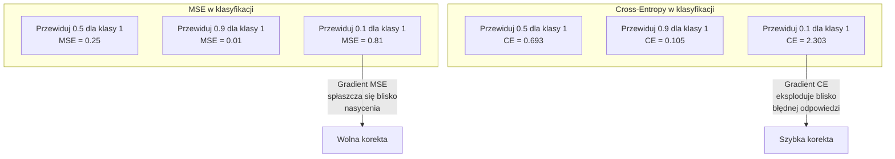
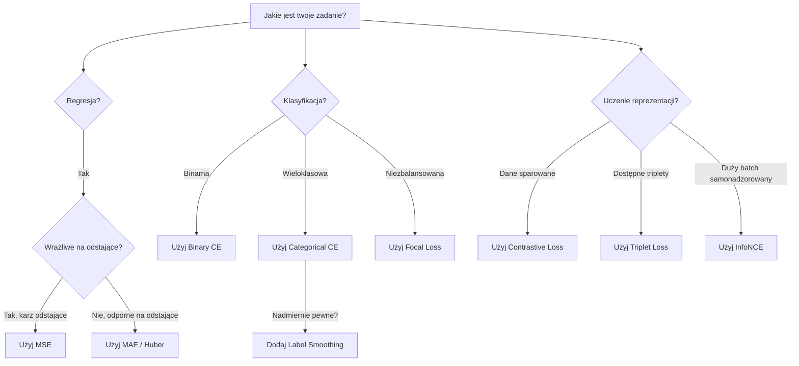
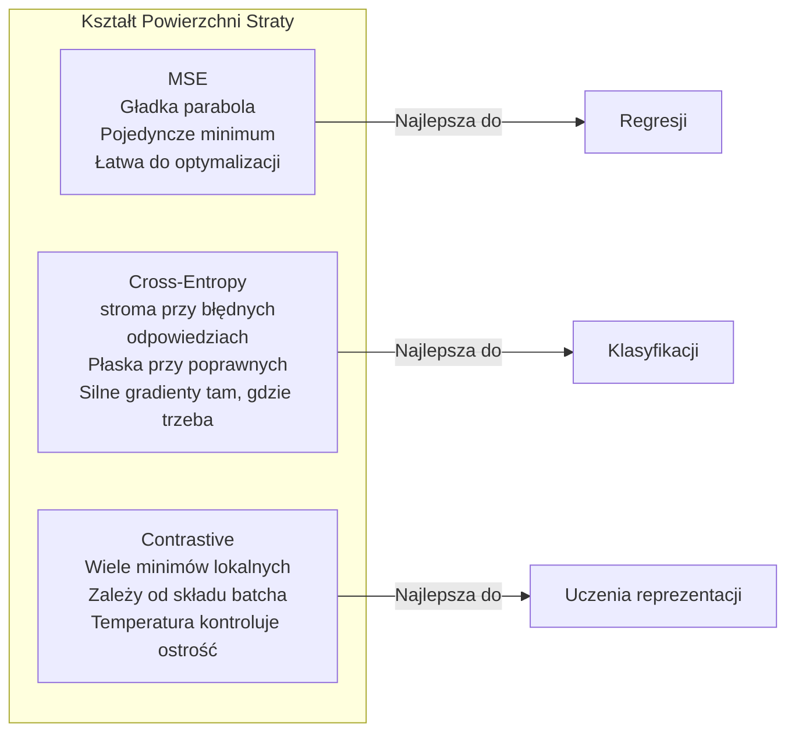

# Funkcje strat

> Twoja sieć dokonuje predykcji. Rzeczywistość mówi inaczej. Jak bardzo się myli? Ta liczba to strata. Wybierz złą funkcję straty, a twój model będzie optymalizował zupełnie nie to, co trzeba.

**Type:** Build
**Languages:** Python
**Prerequisites:** Lesson 03.04 (Activation Functions)
**Time:** ~75 minutes

## Learning Objectives

- Zaimplementuj MSE, binary cross-entropy, categorical cross-entropy i contrastive loss (InfoNCE) od podstaw wraz z ich gradientami
- Wyjaśnij, dlaczego MSE zawodzi w klasyfikacji, demonstrując tryb awarii "przewidywanie 0.5 dla wszystkiego"
- Zastosuj label smoothing do cross-entropy i opisz, jak zapobiega nadmiernie pewnym predykcjom
- Wybierz odpowiednią funkcję straty dla regresji, klasyfikacji binarnej, klasyfikacji wieloklasowej i uczenia reprezentacji (embedding learning)

## The Problem

Model minimalizujący MSE w zadaniu klasyfikacyjnym będzie z przekonaniem przewidywał 0.5 dla wszystkiego. Minimalizuje stratę. Jest też bezużyteczny.

Funkcja straty jest jedyną rzeczą, którą twój model faktycznie optymalizuje. Nie dokładność. Nie miarę F1. Nie jakikolwiek wskaźnik, który raportujesz swojemu menedżerowi. Optymalizator bierze gradient funkcji straty i dostosowuje wagi, aby ta liczba była mniejsza. Jeśli funkcja straty nie odzwierciedla tego, na czym ci zależy, model znajdzie matematycznie najtańszy sposób, aby ją zadowolić, a ten sposób prawie nigdy nie będzie tym, czego chciałeś.

Oto konkretny przykład. Masz zadanie klasyfikacji binarnej. Dwie klasy, podział 50/50. Używasz MSE jako funkcji straty. Model przewiduje 0.5 dla każdego wejścia. Średnie MSE wynosi 0.25, co jest minimum możliwym bez faktycznego uczenia się czegokolwiek. Model ma zerową zdolność dyskryminacyjną, ale technicznie zminimalizował twoją funkcję straty. Przełącz się na cross-entropy, a ten sam model będzie zmuszony przesuwać przewidywania w kierunku 0 lub 1, ponieważ -log(0.5) = 0.693 to straszna strata, podczas gdy -log(0.99) = 0.01 nagradza pewne poprawne przewidywania. Wybór funkcji straty to różnica między modelem, który się uczy, a modelem, który oszukuje metrykę.

Robí się gorzej. W uczeniu samonadzorowanym (self-supervised learning) nie masz nawet etykiet. Contrastive loss definiuje cały sygnał uczący: co jest podobne, co jest różne i jak mocno model powinien je od siebie oddalić. Źle zaimplementuj contrastive loss, a twoje osadzenia (embeddings) zapadną się do pojedynczego punktu — każde wejście mapuje się do tego samego wektora. Technicznie zerowa strata. Całkowicie bezużyteczne.

## The Concept

### Mean Squared Error (MSE)

Domyślna funkcja dla regresji. Oblicz kwadrat różnicy między przewidywaniem a celem, uśrednij po wszystkich próbkach.

```
MSE = (1/n) * sum((y_pred - y_true)^2)
```

Dlaczego kwadrat ma znaczenie: karze duże błędy kwadratowo. Błąd 2 kosztuje 4 razy więcej niż błąd 1. Błąd 10 kosztuje 100 razy więcej. To sprawia, że MSE jest wrażliwe na wartości odstające — pojedyncze skrajnie błędne przewidywanie dominuje nad stratą.

Liczby rzeczywiste: jeśli twój model przewiduje ceny mieszkań i myli się o 10 000 $ na większości domów, ale myli się o 200 000 $ na jednej willi, MSE będzie agresywnie dążyć do naprawienia tej jednej willi, potencjalnie pogarszając wydajność na pozostałych 99 domach.

Gradient MSE względem przewidywania:

```
dMSE/dy_pred = (2/n) * (y_pred - y_true)
```

Liniowy względem błędu. Większe błędy otrzymują większe gradienty. To jest zaletą dla regresji (duże błędy potrzebują dużych korekt) i wadą dla klasyfikacji (chcesz karać pewne błędne odpowiedzi wykładniczo, a nie liniowo).

### Cross-Entropy Loss

Funkcja straty dla klasyfikacji. Zakorzeniona w teorii informacji — mierzy rozbieżność między przewidywanym rozkładem prawdopodobieństwa a rzeczywistym rozkładem.

**Binary Cross-Entropy (BCE):**

```
BCE = -(y * log(p) + (1 - y) * log(1 - p))
```

Gdzie y to prawdziwa etykieta (0 lub 1), a p to przewidywane prawdopodobieństwo.

Dlaczego -log(p) działa: gdy prawdziwa etykieta to 1 i przewidujesz p = 0.99, strata wynosi -log(0.99) = 0.01. Gdy przewidujesz p = 0.01, strata wynosi -log(0.01) = 4.6. Ta 460-krotna różnica sprawia, że cross-entropy działa. Bezlitośnie karze pewne błędne przewidywania, ledwo karząc pewne poprawne.

Gradient mówi tę samą historię:

```
dBCE/dp = -(y/p) + (1-y)/(1-p)
```

Gdy y = 1, a p jest blisko zera, gradient wynosi -1/p, co zbliża się do minus nieskończoności. Model otrzymuje ogromny sygnał do naprawienia błędu. Gdy p jest blisko 1, gradient jest malutki. Już poprawne, nie ma co naprawiać.

**Categorical Cross-Entropy:**

Do klasyfikacji wieloklasowej z celami kodowanymi one-hot.

```
CCE = -sum(y_i * log(p_i))
```

Tylko prawdziwa klasa wnosi wkład do straty (ponieważ wszystkie pozostałe y_i są zerem). Jeśli jest 10 klas, a prawidłowa klasa otrzymuje prawdopodobieństwo 0.1 (losowe zgadywanie), strata wynosi -log(0.1) = 2.3. Jeśli prawidłowa klasa otrzymuje prawdopodobieństwo 0.9, strata wynosi -log(0.9) = 0.105. Model uczy się koncentrować masę prawdopodobieństwa na poprawnej odpowiedzi.

### Dlaczego MSE Zawodzi w Klasyfikacji



Gradienty MSE spłaszczają się, gdy przewidywania są blisko 0 lub 1 (z powodu nasycenia sigmoidy). Gradienty cross-entropy kompensują to — -log anuluje płaskie regiony sigmoidy, dając silne gradienty dokładnie tam, gdzie są najbardziej potrzebne.

### Label Smoothing

Standardowe etykiety one-hot mówią "to jest w 100% klasa 3 i 0% wszystko inne." To mocne twierdzenie. Label smoothing je łagodzi:

```
smooth_label = (1 - alpha) * one_hot + alpha / num_classes
```

Z alpha = 0.1 i 10 klasami: zamiast [0, 0, 1, 0, ...], cel staje się [0.01, 0.01, 0.91, 0.01, ...]. Model celuje w 0.91 zamiast 1.0.

Dlaczego to działa: model próbujący wygenerować dokładnie 1.0 przez softmax musi wypychać logity do nieskończoności. Powoduje to nadmierną pewność, szkodzi generalizacji i czyni model podatnym na przesunięcia rozkładu danych. Label smoothing ogranicza cel do 0.9 (z alpha=0.1), utrzymując logity w rozsądnym zakresie. GPT i większość nowoczesnych modeli używa label smoothingu lub jego odpowiednika.

### Contrastive Loss

Bez etykiet. Bez klas. Tylko pary wejść i pytanie: czy są podobne czy różne?

**Contrastive loss w stylu SimCLR (NT-Xent / InfoNCE):**

Weź jeden obraz. Utwórz dwa augmentowane widoki (kadrowanie, obrót, zmiana kolorów). To jest "para pozytywna" — powinny mieć podobne osadzenia. Każdy inny obraz w batchu tworzy "parę negatywną" — powinny mieć różne osadzenia.

```
L = -log(exp(sim(z_i, z_j) / tau) / sum(exp(sim(z_i, z_k) / tau)))
```

Gdzie sim() to podobieństwo cosinusowe, z_i i z_j to para pozytywna, suma jest po wszystkich negatywach, a tau (temperatura) kontroluje, jak ostra jest dystrybucja. Niższa temperatura = trudniejsze negatywy = bardziej agresywna separacja.

Liczby rzeczywiste: rozmiar batcha 256 oznacza 255 negatywów na parę pozytywną. Temperatura tau = 0.07 (domyślna w SimCLR). Strata wygląda jak softmax na podobieństwach — chce, aby podobieństwo pary pozytywnej było najwyższe spośród wszystkich 256 opcji.

**Triplet Loss:**

Przyjmuje trzy wejścia: anchor (kotwica), positive (ta sama klasa), negative (inna klasa).

```
L = max(0, d(anchor, positive) - d(anchor, negative) + margin)
```

Margines (zazwyczaj 0.2-1.0) wymusza minimalną lukę między odległością pozytywną a negatywną. Jeśli negatyw jest już wystarczająco daleko, strata wynosi zero — brak gradientu, brak aktualizacji. To sprawia, że trenowanie jest wydajne, ale wymaga starannego doboru tripletów (wybierania trudnych negatywów bliskich anchorowi).

### Focal Loss

Dla niezbalansowanych zbiorów danych. Standardowa cross-entropy traktuje wszystkie poprawnie sklasyfikowane przykłady jednakowo. Focal loss zmniejsza wagę łatwych przykładów:

```
FL = -alpha * (1 - p_t)^gamma * log(p_t)
```

Gdzie p_t to przewidywane prawdopodobieństwo prawdziwej klasy, a gamma kontroluje skupienie. Przy gamma = 0 jest to standardowa cross-entropy. Przy gamma = 2 (wartość domyślna):

- Łatwy przykład (p_t = 0.9): waga = (0.1)^2 = 0.01. Efektywnie ignorowany.
- Trudny przykład (p_t = 0.1): waga = (0.9)^2 = 0.81. Pełny sygnał gradientu.

Focal loss został wprowadzony przez Lin i in. do wykrywania obiektów, gdzie 99% regionów kandydackich to tło (łatwe negatywy). Bez focal loss model tonie w łatwych przykładach tła i nigdy nie uczy się wykrywać obiektów. Z nim model skupia swoją pojemność na trudnych, niejednoznacznych przypadkach, które mają znaczenie.

### Drzewo Decyzyjne Funkcji Strat



### Krajobraz Strat



```figure
cross-entropy-loss
```

## Build It

### Krok 1: MSE i Jego Gradient

```python
def mse(predictions, targets):
    n = len(predictions)
    total = 0.0
    for p, t in zip(predictions, targets):
        total += (p - t) ** 2
    return total / n

def mse_gradient(predictions, targets):
    n = len(predictions)
    grads = []
    for p, t in zip(predictions, targets):
        grads.append(2.0 * (p - t) / n)
    return grads
```

### Krok 2: Binary Cross-Entropy

Problem log(0) jest realny. Jeśli model przewiduje dokładnie 0 dla pozytywnego przykładu, log(0) = minus nieskończoność. Przycinanie (clipping) temu zapobiega.

```python
import math

def binary_cross_entropy(predictions, targets, eps=1e-15):
    n = len(predictions)
    total = 0.0
    for p, t in zip(predictions, targets):
        p_clipped = max(eps, min(1 - eps, p))
        total += -(t * math.log(p_clipped) + (1 - t) * math.log(1 - p_clipped))
    return total / n

def bce_gradient(predictions, targets, eps=1e-15):
    grads = []
    for p, t in zip(predictions, targets):
        p_clipped = max(eps, min(1 - eps, p))
        grads.append(-(t / p_clipped) + (1 - t) / (1 - p_clipped))
    return grads
```

### Krok 3: Categorical Cross-Entropy z Softmax

Softmax konwertuje surowe logity na prawdopodobieństwa. Następnie obliczamy cross-entropy względem celów one-hot.

```python
def softmax(logits):
    max_val = max(logits)
    exps = [math.exp(x - max_val) for x in logits]
    total = sum(exps)
    return [e / total for e in exps]

def categorical_cross_entropy(logits, target_index, eps=1e-15):
    probs = softmax(logits)
    p = max(eps, probs[target_index])
    return -math.log(p)

def cce_gradient(logits, target_index):
    probs = softmax(logits)
    grads = list(probs)
    grads[target_index] -= 1.0
    return grads
```

Gradient softmax + cross-entropy pięknie się upraszcza: to po prostu (przewidywane prawdopodobieństwo - 1) dla prawdziwej klasy i (przewidywane prawdopodobieństwo) dla wszystkich innych klas. Ta elegancka simplifikacja nie jest przypadkiem — to dlatego softmax i cross-entropy są parowane.

### Krok 4: Label Smoothing

```python
def label_smoothed_cce(logits, target_index, num_classes, alpha=0.1, eps=1e-15):
    probs = softmax(logits)
    loss = 0.0
    for i in range(num_classes):
        if i == target_index:
            smooth_target = 1.0 - alpha + alpha / num_classes
        else:
            smooth_target = alpha / num_classes
        p = max(eps, probs[i])
        loss += -smooth_target * math.log(p)
    return loss
```

### Krok 5: Contrastive Loss (Uproszczone InfoNCE)

```python
def cosine_similarity(a, b):
    dot = sum(x * y for x, y in zip(a, b))
    norm_a = math.sqrt(sum(x * x for x in a))
    norm_b = math.sqrt(sum(x * x for x in b))
    if norm_a < 1e-10 or norm_b < 1e-10:
        return 0.0
    return dot / (norm_a * norm_b)

def contrastive_loss(anchor, positive, negatives, temperature=0.07):
    sim_pos = cosine_similarity(anchor, positive) / temperature
    sim_negs = [cosine_similarity(anchor, neg) / temperature for neg in negatives]

    max_sim = max(sim_pos, max(sim_negs)) if sim_negs else sim_pos
    exp_pos = math.exp(sim_pos - max_sim)
    exp_negs = [math.exp(s - max_sim) for s in sim_negs]
    total_exp = exp_pos + sum(exp_negs)

    return -math.log(max(1e-15, exp_pos / total_exp))
```

### Krok 6: MSE vs Cross-Entropy w Klasyfikacji

Wytrenuj tę samą sieć z lekcji 04 (zbiór danych okręgu) z obiema funkcjami strat. Zobacz, jak cross-entropy zbiega szybciej.

```python
import random

def sigmoid(x):
    x = max(-500, min(500, x))
    return 1.0 / (1.0 + math.exp(-x))

def make_circle_data(n=200, seed=42):
    random.seed(seed)
    data = []
    for _ in range(n):
        x = random.uniform(-2, 2)
        y = random.uniform(-2, 2)
        label = 1.0 if x * x + y * y < 1.5 else 0.0
        data.append(([x, y], label))
    return data


class LossComparisonNetwork:
    def __init__(self, loss_type="bce", hidden_size=8, lr=0.1):
        random.seed(0)
        self.loss_type = loss_type
        self.lr = lr
        self.hidden_size = hidden_size

        self.w1 = [[random.gauss(0, 0.5) for _ in range(2)] for _ in range(hidden_size)]
        self.b1 = [0.0] * hidden_size
        self.w2 = [random.gauss(0, 0.5) for _ in range(hidden_size)]
        self.b2 = 0.0

    def forward(self, x):
        self.x = x
        self.z1 = []
        self.h = []
        for i in range(self.hidden_size):
            z = self.w1[i][0] * x[0] + self.w1[i][1] * x[1] + self.b1[i]
            self.z1.append(z)
            self.h.append(max(0.0, z))

        self.z2 = sum(self.w2[i] * self.h[i] for i in range(self.hidden_size)) + self.b2
        self.out = sigmoid(self.z2)
        return self.out

    def backward(self, target):
        if self.loss_type == "mse":
            d_loss = 2.0 * (self.out - target)
        else:
            eps = 1e-15
            p = max(eps, min(1 - eps, self.out))
            d_loss = -(target / p) + (1 - target) / (1 - p)

        d_sigmoid = self.out * (1 - self.out)
        d_out = d_loss * d_sigmoid

        for i in range(self.hidden_size):
            d_relu = 1.0 if self.z1[i] > 0 else 0.0
            d_h = d_out * self.w2[i] * d_relu
            self.w2[i] -= self.lr * d_out * self.h[i]
            for j in range(2):
                self.w1[i][j] -= self.lr * d_h * self.x[j]
            self.b1[i] -= self.lr * d_h
        self.b2 -= self.lr * d_out

    def compute_loss(self, pred, target):
        if self.loss_type == "mse":
            return (pred - target) ** 2
        else:
            eps = 1e-15
            p = max(eps, min(1 - eps, pred))
            return -(target * math.log(p) + (1 - target) * math.log(1 - p))

    def train(self, data, epochs=200):
        losses = []
        for epoch in range(epochs):
            total_loss = 0.0
            correct = 0
            for x, y in data:
                pred = self.forward(x)
                self.backward(y)
                total_loss += self.compute_loss(pred, y)
                if (pred >= 0.5) == (y >= 0.5):
                    correct += 1
            avg_loss = total_loss / len(data)
            accuracy = correct / len(data) * 100
            losses.append((avg_loss, accuracy))
            if epoch % 50 == 0 or epoch == epochs - 1:
                print(f"    Epoch {epoch:3d}: loss={avg_loss:.4f}, accuracy={accuracy:.1f}%")
        return losses
```

## Use It

PyTorch dostarcza wszystkie standardowe funkcje strat z wbudowaną stabilnością numeryczną:

```python
import torch
import torch.nn as nn
import torch.nn.functional as F

predictions = torch.tensor([0.9, 0.1, 0.7], requires_grad=True)
targets = torch.tensor([1.0, 0.0, 1.0])

mse_loss = F.mse_loss(predictions, targets)
bce_loss = F.binary_cross_entropy(predictions, targets)

logits = torch.randn(4, 10)
labels = torch.tensor([3, 7, 1, 9])
ce_loss = F.cross_entropy(logits, labels)
ce_smooth = F.cross_entropy(logits, labels, label_smoothing=0.1)
```

Używaj `F.cross_entropy` (nie `F.nll_loss` plus ręczny softmax). Łączy log-softmax i ujemną logarytmiczną wiarogodność w jednej numerycznie stabilnej operacji. Osobne stosowanie softmax, a następnie logarytmu jest mniej stabilne — tracisz precyzję przy odejmowaniu dużych eksponent.

W przypadku contrastive learning większość zespołów używa własnych implementacji lub bibliotek takich jak `lightly` czy `pytorch-metric-learning`. Główna pętla jest zawsze taka sama: oblicz podobieństwa parami, utwórz softmax na pozytywach i negatywach, wsteczna propagacja.

## Ship It

Ta lekcja produkuje:
- `outputs/prompt-loss-function-selector.md` -- wielokrotnego użytku prompt do wyboru odpowiedniej funkcji straty
- `outputs/prompt-loss-debugger.md` -- prompt diagnostyczny, gdy krzywa straty wygląda źle

## Exercises

1. Zaimplementuj funkcję straty Hubera (gładką L1), która jest MSE dla małych błędów i MAE dla dużych. Wytrenuj sieć regresyjną przewidującą y = sin(x) z MSE vs Huber, gdy 5% celów treningowych ma dodany losowy szum (wartości odstające). Porównaj końcowy błąd testowy.

2. Dodaj focal loss do pętli treningowej klasyfikacji binarnej. Utwórz niezbalansowany zbiór danych (90% klasa 0, 10% klasa 1). Porównaj standardową BCE vs focal loss (gamma=2) na czułości (recall) dla klasy mniejszościowej po 200 epokach.

3. Zaimplementuj triplet loss z pół-trudnym wydobywaniem negatywów (semi-hard negative mining). Wygeneruj dane 2D reprezentacji dla 5 klas. Dla każdego anchora znajdź najtrudniejszy negatyw, który jest wciąż dalej niż pozytyw (pół-trudny). Porównaj zbieżność z losowym wyborem tripletów.

4. Uruchom porównanie MSE vs cross-entropy, ale śledź wielkości gradientów w każdej warstwie podczas trenowania. Narysuj średnią normę gradientu na epokę. Zweryfikuj, że cross-entropy produkuje większe gradienty we wczesnych epokach, gdy model jest najbardziej niepewny.

5. Zaimplementuj funkcję straty KL divergence i zweryfikuj, że minimalizacja KL(prawdziwy || przewidywany) daje te same gradienty co cross-entropy, gdy prawdziwy rozkład jest one-hot. Następnie wypróbuj miękkie cele (jak w dystylacji wiedzy), gdzie "prawdziwy" rozkład pochodzi z wyjścia softmax modelu nauczyciela.

## Key Terms

| Termin | Co ludzie mówią | Co to naprawdę znaczy |
|------|----------------|----------------------|
| Loss function | "Jak bardzo model się myli" | Różniczkowalna funkcja mapująca przewidywania i cele na skalar, który optymalizator minimalizuje |
| MSE | "Średni błąd kwadratowy" | Średnia kwadratów różnic między przewidywaniami a celami; karze duże błędy kwadratowo |
| Cross-entropy | "Strata klasyfikacyjna" | Mierzy rozbieżność między przewidywanym rozkładem prawdopodobieństwa a rzeczywistym rozkładem za pomocą -log(p) |
| Binary cross-entropy | "BCE" | Cross-entropy dla dwóch klas: -(y*log(p) + (1-y)*log(1-p)) |
| Label smoothing | "Zmiękczanie celów" | Zastępowanie twardych celów 0/1 miękkimi wartościami (np. 0.1/0.9), aby zapobiec nadmiernej pewności i poprawić generalizację |
| Contrastive loss | "Przyciągaj, odpychaj" | Strata, która uczy reprezentacji poprzez zbliżanie podobnych par i oddalanie różnych w przestrzeni osadzeń |
| InfoNCE | "Strata CLIP/SimCLR" | Znormalizowana, skalowana temperaturą cross-entropy na wynikach podobieństwa; traktuje uczenie kontrastywne jako klasyfikację |
| Focal loss | "Naprawa dla niezbalansowanych danych" | Cross-entropy ważona przez (1-p_t)^gamma, aby zmniejszyć wagę łatwych przykładów i skupić się na trudnych |
| Triplet loss | "Anchor-pozytyw-negatyw" | Przybliża anchor do pozytywu bardziej niż do negatywu o co najmniej margines w przestrzeni osadzeń |
| Temperature | "Pokrętło ostrości" | Skalarny dzielnik logitów/podobieństw kontrolujący, jak szczytowy jest wynikowy rozkład; niższa = ostrzejszy |

## Further Reading

- Lin et al., "Focal Loss for Dense Object Detection" (2017) -- wprowadził focal loss do obsługi ekstremalnej nierównowagi klas w wykrywaniu obiektów (RetinaNet)
- Chen et al., "A Simple Framework for Contrastive Learning of Visual Representations" (SimCLR, 2020) -- zdefiniował nowoczesny pipeline uczenia kontrastywnego z funkcją straty NT-Xent
- Szegedy et al., "Rethinking the Inception Architecture" (2016) -- wprowadził label smoothing jako technikę regularyzacji, obecnie standard w większości dużych modeli
- Hinton et al., "Distilling the Knowledge in a Neural Network" (2015) -- dystylacja wiedzy z użyciem miękkich celów i KL divergence, fundamentalna dla kompresji modeli