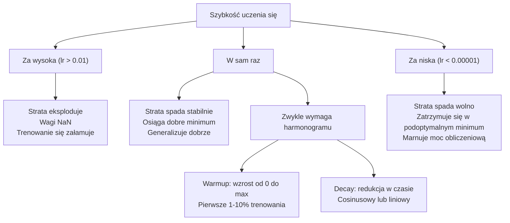
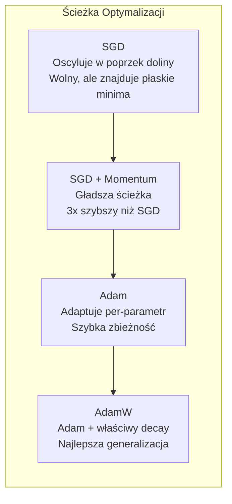
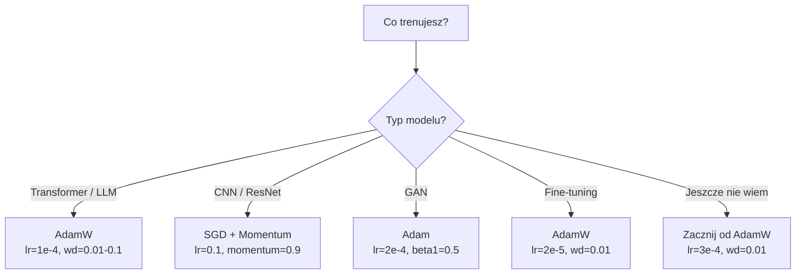

# Optymalizatory

> Zejście gradientowe mówi ci, w którym kierunku się poruszać. Nie mówi nic o tym, jak daleko ani jak szybko. SGD to kompas. Adam to GPS z danymi o ruchu drogowym.

**Type:** Build
**Languages:** Python
**Prerequisites:** Lesson 03.05 (Loss Functions)
**Time:** ~75 minutes

## Learning Objectives

- Zaimplementuj SGD, SGD z momentum, Adam i AdamW od podstaw w Pythonie
- Wyjaśnij, jak korekcja obciążenia (bias correction) Adama kompensuje wyzerowane estymatory momentów w początkowych krokach trenowania
- Zademonstruj, dlaczego AdamW daje lepszą generalizację niż Adam z regularyzacją L2 w tym samym zadaniu
- Wybierz odpowiedni optymalizator i domyślne hiperparametry dla transformerów, CNN, GAN i fine-tuningu

## The Problem

Obliczyłeś gradienty. Wiesz, że waga #4,721 powinna zmniejszyć się o 0.003, aby zredukować stratę. Ale 0.003 w jakich jednostkach? Przeskalowane przez co? I czy powinieneś przesunąć się o tyle samo w kroku 1 co w kroku 1000?

Waniliowe zejście gradientowe stosuje tę samą szybkość uczenia się do każdego parametru w każdym kroku: w = w - lr * gradient. Tworzy to trzy problemy, które sprawiają, że trenowanie sieci neuronowych jest w praktyce bolesne.

Po pierwsze, oscylacja. Krajobraz strat rzadko ma kształt gładkiej misy. Jest bardziej jak długa, wąska dolina. Gradient wskazuje w poprzek doliny (stromy kierunek), a nie wzdłuż niej (płytki kierunek). Zejście gradientowe odbija się tam i z powrotem w wąskim wymiarze, robiąc maleńkie postępy w tym użytecznym. Widziałeś to: strata spada szybko, a potem wychodzi na plateau, nie dlatego, że model się zbiegł, ale dlatego, że oscyluje.

Po drugie, jedna szybkość uczenia się dla wszystkich parametrów jest błędna. Niektóre wagi potrzebują dużych aktualizacji (są we wczesnej fazie niedouczenia). Inne potrzebują maleńkich aktualizacji (są blisko swojej optymalnej wartości). Szybkość uczenia się, która działa dla pierwszych, niszczy drugie, i odwrotnie.

Po trzecie, punkty siodłowe. W wysokich wymiarach krajobraz strat ma rozległe płaskie regiony, gdzie gradient jest blisko zera. Waniliowe SGD pełznie przez nie z prędkością gradientu, która jest efektywnie zerowa. Model wygląda na zablokowanego. Nie jest zablokowany — jest w płaskim regionie z użytecznym zejściem po drugiej stronie. Ale SGD nie ma mechanizmu, aby się przez to przebić.

Adam rozwiązuje wszystkie trzy. Utrzymuje dwa średnie kroczące na parametr — średni gradient (momentum, obsługuje oscylację) i średni kwadrat gradientu (adaptacyjna szybkość, obsługuje różne skale). W połączeniu z korekcją obciążenia dla pierwszych kilku kroków, daje pojedynczy optymalizator, który działa na 80% problemów z domyślnymi hiperparametrami. Ta lekcja buduje go od podstaw, abyś dokładnie zrozumiał, kiedy i dlaczego zawodzi na pozostałych 20%.

## The Concept

### Stochastic Gradient Descent (SGD)

Najprostszy optymalizator. Oblicz gradient na mini-batchu i zrób krok w przeciwnym kierunku.

```
w = w - lr * gradient
```

"Stochastic" oznacza, że używasz losowego podzbioru (mini-batchu) danych do oszacowania gradientu, zamiast całego zbioru. Ten szum jest w rzeczywistości użyteczny — pomaga uciekać z ostrych minimów lokalnych. Ale szum powoduje też oscylacje.

Szybkość uczenia się to jedyne pokrętło. Zbyt wysoka: strata rozbiega się. Zbyt niska: trenowanie trwa wieczność. Optymalna wartość zależy od architektury, danych, rozmiaru batcha i bieżącego etapu trenowania. Dla waniliowego SGD w nowoczesnych sieciach typowe wartości mieszczą się w zakresie od 0.01 do 0.1. Ale nawet w ramach pojedynczej sesji treningowej idealna szybkość uczenia się zmienia się.

### Momentum

Analogia z toczącą się piłką jest nadużywana, ale trafna. Zamiast robić krok wyłącznie według gradientu, utrzymujesz prędkość, która akumuluje przeszłe gradienty.

```
m_t = beta * m_{t-1} + gradient
w = w - lr * m_t
```

Beta (zazwyczaj 0.9) kontroluje, ile historii zachować. Przy beta = 0.9, momentum jest z grubsza średnią z ostatnich 10 gradientów (1 / (1 - 0.9) = 10).

Dlaczego to naprawia oscylację: gradienty wskazujące w tym samym kierunku kumulują się. Gradienty zmieniające kierunek znoszą się. W tej wąskiej dolinie składowa "poprzeczna" zmienia znak w każdym kroku i jest tłumiona. Składowa "wzdłuż" pozostaje spójna i jest wzmacniana. Rezultatem jest płynne przyspieszenie w użytecznym kierunku.

Liczby rzeczywiste: samo SGD na źle uwarunkowanym krajobrazie strat może potrzebować 10 000 kroków. SGD z momentum (beta=0.9) zazwyczaj potrzebuje 3 000-5 000 kroków w tym samym zadaniu. Przyspieszenie nie jest marginalne.

### RMSProp

Pierwsza działająca metoda z per-parametrową adaptacyjną szybkością uczenia się. Zaproponowana przez Hintona w wykładzie na Courserze (nigdy formalnie opublikowana).

```
s_t = beta * s_{t-1} + (1 - beta) * gradient^2
w = w - lr * gradient / (sqrt(s_t) + epsilon)
```

s_t śledzi średnią kroczącą kwadratów gradientów. Parametry z konsekwentnie dużymi gradientami są dzielone przez dużą liczbę (mniejsza efektywna szybkość uczenia się). Parametry z małymi gradientami są dzielone przez małą liczbę (większa efektywna szybkość uczenia się).

To rozwiązuje problem "jednej szybkości uczenia się dla wszystkich parametrów". Waga, która już otrzymuje duże aktualizacje, jest prawdopodobnie blisko swojego celu — zwolnij ją. Waga, która otrzymuje maleńkie aktualizacje, może być niedotrenowana — przyspiesz ją.

Epsilon (zazwyczaj 1e-8) zapobiega dzieleniu przez zero, gdy parametr nie był aktualizowany.

### Adam: Momentum + RMSProp

Adam łączy oba pomysły. Utrzymuje dwie wykładnicze średnie kroczące na parametr:

```
m_t = beta1 * m_{t-1} + (1 - beta1) * gradient        (pierwszy moment: średnia)
v_t = beta2 * v_{t-1} + (1 - beta2) * gradient^2       (drugi moment: wariancja)
```

**Korekcja obciążenia (Bias correction)** to kluczowy szczegół, który większość wyjaśnień pomija. W kroku 1, m_1 = (1 - beta1) * gradient. Przy beta1 = 0.9, to 0.1 * gradient — dziesięciokrotnie za mało. Średnia krocząca jeszcze się nie rozgrzała. Korekcja obciążenia kompensuje:

```
m_hat = m_t / (1 - beta1^t)
v_hat = v_t / (1 - beta2^t)
```

W kroku 1 z beta1 = 0.9: m_hat = m_1 / (1 - 0.9) = m_1 / 0.1 = rzeczywisty gradient. W kroku 100: (1 - 0.9^100) wynosi w przybliżeniu 1.0, więc korekcja zanika. Korekcja obciążenia ma znaczenie dla pierwszych ~10 kroków i jest nieistotna po ~50.

Aktualizacja:

```
w = w - lr * m_hat / (sqrt(v_hat) + epsilon)
```

Domyślne wartości Adama: lr = 0.001, beta1 = 0.9, beta2 = 0.999, epsilon = 1e-8. Te domyślne wartości działają dla 80% problemów. Kiedy nie działają, najpierw zmień lr. Potem beta2. Prawie nigdy nie zmieniaj beta1 ani epsilon.

### AdamW: Weight Decay Zrobione Prawidłowo

Regularyzacja L2 dodaje lambda * w^2 do straty. W waniliowym SGD jest to równoważne weight decay (odejmowaniu lambda * w od wagi w każdym kroku). W Adamie ta równoważność zostaje zerwana.

Spostrzeżenie Loshchilova i Huttera: gdy dodajesz L2 do straty, a następnie Adam przetwarza gradient, adaptacyjna szybkość uczenia się skaluje również człon regularyzacyjny. Parametry z dużą wariancją gradientu otrzymują mniej regularyzacji. Parametry z małą wariancją otrzymują więcej. To nie jest to, czego chcesz — chcesz jednolitej regularyzacji niezależnie od statystyk gradientu.

AdamW naprawia to, stosując weight decay bezpośrednio do wag, po aktualizacji Adama:

```
w = w - lr * m_hat / (sqrt(v_hat) + epsilon) - lr * lambda * w
```

Człon weight decay (lr * lambda * w) nie jest skalowany przez adaptacyjny czynnik Adama. Każdy parametr otrzymuje tę samą proporcjonalną redukcję.

Wydaje się to drobnym szczegółem. Nie jest. AdamW zbiega do lepszych rozwiązań niż Adam + regularyzacja L2 praktycznie w każdym zadaniu. Jest domyślnym optymalizatorem w PyTorchu do trenowania transformerów, modeli dyfuzyjnych i większości nowoczesnych architektur. BERT, GPT, LLaMA, Stable Diffusion — wszystkie trenowane z AdamW.

### Szybkość Uczenia Się: Najważniejszy Hiperparametr



Jeśli dostrajasz jeden hiperparametr, dostrój szybkość uczenia się. 10-krotna zmiana szybkości uczenia się ma większe znaczenie niż jakakolwiek decyzja architektoniczna, którą podejmiesz. Typowe domyślne wartości:

- SGD: lr = 0.01 do 0.1
- Adam/AdamW: lr = 1e-4 do 3e-4
- Fine-tuning wstępnie wytrenowanych modeli: lr = 1e-5 do 5e-5
- Warmup szybkości uczenia się: liniowy wzrost przez pierwsze 1-10% kroków

### Porównanie Optymalizatorów



### Kiedy Który Optymalizator Wygrywa



```figure
optimizer-trajectory
```

## Build It

### Krok 1: Waniliowe SGD

```python
class SGD:
    def __init__(self, lr=0.01):
        self.lr = lr

    def step(self, params, grads):
        for i in range(len(params)):
            params[i] -= self.lr * grads[i]
```

### Krok 2: SGD z Momentum

```python
class SGDMomentum:
    def __init__(self, lr=0.01, beta=0.9):
        self.lr = lr
        self.beta = beta
        self.velocities = None

    def step(self, params, grads):
        if self.velocities is None:
            self.velocities = [0.0] * len(params)
        for i in range(len(params)):
            self.velocities[i] = self.beta * self.velocities[i] + grads[i]
            params[i] -= self.lr * self.velocities[i]
```

### Krok 3: Adam

```python
import math

class Adam:
    def __init__(self, lr=0.001, beta1=0.9, beta2=0.999, epsilon=1e-8):
        self.lr = lr
        self.beta1 = beta1
        self.beta2 = beta2
        self.epsilon = epsilon
        self.m = None
        self.v = None
        self.t = 0

    def step(self, params, grads):
        if self.m is None:
            self.m = [0.0] * len(params)
            self.v = [0.0] * len(params)

        self.t += 1

        for i in range(len(params)):
            self.m[i] = self.beta1 * self.m[i] + (1 - self.beta1) * grads[i]
            self.v[i] = self.beta2 * self.v[i] + (1 - self.beta2) * grads[i] ** 2

            m_hat = self.m[i] / (1 - self.beta1 ** self.t)
            v_hat = self.v[i] / (1 - self.beta2 ** self.t)

            params[i] -= self.lr * m_hat / (math.sqrt(v_hat) + self.epsilon)
```

### Krok 4: AdamW

```python
class AdamW:
    def __init__(self, lr=0.001, beta1=0.9, beta2=0.999, epsilon=1e-8, weight_decay=0.01):
        self.lr = lr
        self.beta1 = beta1
        self.beta2 = beta2
        self.epsilon = epsilon
        self.weight_decay = weight_decay
        self.m = None
        self.v = None
        self.t = 0

    def step(self, params, grads):
        if self.m is None:
            self.m = [0.0] * len(params)
            self.v = [0.0] * len(params)

        self.t += 1

        for i in range(len(params)):
            self.m[i] = self.beta1 * self.m[i] + (1 - self.beta1) * grads[i]
            self.v[i] = self.beta2 * self.v[i] + (1 - self.beta2) * grads[i] ** 2

            m_hat = self.m[i] / (1 - self.beta1 ** self.t)
            v_hat = self.v[i] / (1 - self.beta2 ** self.t)

            params[i] -= self.lr * m_hat / (math.sqrt(v_hat) + self.epsilon)
            params[i] -= self.lr * self.weight_decay * params[i]
```

### Krok 5: Porównanie Trenowania

Wytrenuj tę samą dwuwarstwową sieć na zbiorze danych okręgu z lekcji 05 ze wszystkimi czterema optymalizatorami. Porównaj zbieżność.

```python
import random

def sigmoid(x):
    x = max(-500, min(500, x))
    return 1.0 / (1.0 + math.exp(-x))

def make_circle_data(n=200, seed=42):
    random.seed(seed)
    data = []
    for _ in range(n):
        x = random.uniform(-2, 2)
        y = random.uniform(-2, 2)
        label = 1.0 if x * x + y * y < 1.5 else 0.0
        data.append(([x, y], label))
    return data


class OptimizerTestNetwork:
    def __init__(self, optimizer, hidden_size=8):
        random.seed(0)
        self.hidden_size = hidden_size
        self.optimizer = optimizer

        self.w1 = [[random.gauss(0, 0.5) for _ in range(2)] for _ in range(hidden_size)]
        self.b1 = [0.0] * hidden_size
        self.w2 = [random.gauss(0, 0.5) for _ in range(hidden_size)]
        self.b2 = 0.0

    def get_params(self):
        params = []
        for row in self.w1:
            params.extend(row)
        params.extend(self.b1)
        params.extend(self.w2)
        params.append(self.b2)
        return params

    def set_params(self, params):
        idx = 0
        for i in range(self.hidden_size):
            for j in range(2):
                self.w1[i][j] = params[idx]
                idx += 1
        for i in range(self.hidden_size):
            self.b1[i] = params[idx]
            idx += 1
        for i in range(self.hidden_size):
            self.w2[i] = params[idx]
            idx += 1
        self.b2 = params[idx]

    def forward(self, x):
        self.x = x
        self.z1 = []
        self.h = []
        for i in range(self.hidden_size):
            z = self.w1[i][0] * x[0] + self.w1[i][1] * x[1] + self.b1[i]
            self.z1.append(z)
            self.h.append(max(0.0, z))

        self.z2 = sum(self.w2[i] * self.h[i] for i in range(self.hidden_size)) + self.b2
        self.out = sigmoid(self.z2)
        return self.out

    def compute_grads(self, target):
        eps = 1e-15
        p = max(eps, min(1 - eps, self.out))
        d_loss = -(target / p) + (1 - target) / (1 - p)
        d_sigmoid = self.out * (1 - self.out)
        d_out = d_loss * d_sigmoid

        grads = [0.0] * (self.hidden_size * 2 + self.hidden_size + self.hidden_size + 1)
        idx = 0
        for i in range(self.hidden_size):
            d_relu = 1.0 if self.z1[i] > 0 else 0.0
            d_h = d_out * self.w2[i] * d_relu
            grads[idx] = d_h * self.x[0]
            grads[idx + 1] = d_h * self.x[1]
            idx += 2

        for i in range(self.hidden_size):
            d_relu = 1.0 if self.z1[i] > 0 else 0.0
            grads[idx] = d_out * self.w2[i] * d_relu
            idx += 1

        for i in range(self.hidden_size):
            grads[idx] = d_out * self.h[i]
            idx += 1

        grads[idx] = d_out
        return grads

    def train(self, data, epochs=300):
        losses = []
        for epoch in range(epochs):
            total_loss = 0.0
            correct = 0
            for x, y in data:
                pred = self.forward(x)
                grads = self.compute_grads(y)
                params = self.get_params()
                self.optimizer.step(params, grads)
                self.set_params(params)

                eps = 1e-15
                p = max(eps, min(1 - eps, pred))
                total_loss += -(y * math.log(p) + (1 - y) * math.log(1 - p))
                if (pred >= 0.5) == (y >= 0.5):
                    correct += 1
            avg_loss = total_loss / len(data)
            accuracy = correct / len(data) * 100
            losses.append((avg_loss, accuracy))
            if epoch % 75 == 0 or epoch == epochs - 1:
                print(f"    Epoch {epoch:3d}: loss={avg_loss:.4f}, accuracy={accuracy:.1f}%")
        return losses
```

## Use It

Optymalizatory PyTorch obsługują grupy parametrów, przycinanie gradientów i harmonogramowanie szybkości uczenia się:

```python
import torch
import torch.optim as optim

model = torch.nn.Sequential(
    torch.nn.Linear(784, 256),
    torch.nn.ReLU(),
    torch.nn.Linear(256, 10),
)

optimizer = optim.AdamW(model.parameters(), lr=3e-4, weight_decay=0.01)

scheduler = optim.lr_scheduler.CosineAnnealingLR(optimizer, T_max=100)

for epoch in range(100):
    optimizer.zero_grad()
    output = model(torch.randn(32, 784))
    loss = torch.nn.functional.cross_entropy(output, torch.randint(0, 10, (32,)))
    loss.backward()
    torch.nn.utils.clip_grad_norm_(model.parameters(), max_norm=1.0)
    optimizer.step()
    scheduler.step()
```

Wzorzec jest zawsze: zero_grad, forward, loss, backward, (clip), step, (schedule). Zapamiętaj tę kolejność. Zrobienie tego źle (np. wywołanie scheduler.step() przed optimizer.step()) jest częstym źródłem subtelnych błędów.

W przypadku CNN wielu praktyków wciąż preferuje SGD + momentum (lr=0.1, momentum=0.9, weight_decay=1e-4) z harmonogramem krokowym lub cosinusowym. SGD znajduje płaskie minima, które często lepiej generalizują. W przypadku transformerów i LLM, AdamW z warmupem + cosinusowym wygaszaniem jest uniwersalną domyślną wartością. Nie walcz z konsensusem bez wymiernego powodu.

## Ship It

Ta lekcja produkuje:
- `outputs/prompt-optimizer-selector.md` -- prompt decyzyjny do wyboru odpowiedniego optymalizatora i szybkości uczenia się dla dowolnej architektury

## Exercises

1. Zaimplementuj momentum Nesterova, gdzie obliczasz gradient w pozycji "lookahead" (w - lr * beta * v) zamiast w bieżącej pozycji. Porównaj zbieżność ze standardowym momentum na zbiorze danych okręgu.

2. Zaimplementuj harmonogram warmupu szybkości uczenia się: liniowy wzrost od 0 do max_lr przez pierwsze 10% kroków trenowania, następnie cosinusowe wygaszanie do 0. Trenuj z Adam + warmup vs Adam bez warmupu. Zmierz, ile epok potrzeba do osiągnięcia 90% dokładności na zbiorze danych okręgu.

3. Śledź efektywną szybkość uczenia się dla każdego parametru podczas trenowania z Adamem. Efektywna szybkość to lr * m_hat / (sqrt(v_hat) + eps). Narysuj rozkład efektywnych szybkości po 10, 50 i 200 krokach. Czy wszystkie parametry są aktualizowane z tą samą prędkością?

4. Zaimplementuj przycinanie gradientów (clip by global norm). Ustaw maksymalną normę gradientu na 1.0. Trenuj z przycinaniem i bez, używając wysokiej szybkości uczenia się (lr=0.01 dla Adama). Policz, ile przebiegów rozbiega się (strata idzie do NaN) z przycinaniem i bez na 10 losowych ziarnach.

5. Porównaj Adama vs AdamW na sieci z dużymi wagami. Zainicjalizuj wszystkie wagi losowymi wartościami w [-5, 5] (znacznie większymi niż normalnie). Trenuj przez 200 epok z weight_decay=0.1. Narysuj normę L2 wag w trakcie trenowania dla obu optymalizatorów. AdamW powinien pokazać szybszy shrinkage wag.

## Key Terms

| Termin | Co ludzie mówią | Co to naprawdę znaczy |
|------|----------------|----------------------|
| Learning rate | "Wielkość kroku" | Skalarny mnożnik aktualizacji gradientu; pojedynczy najbardziej wpływowy hiperparametr w trenowaniu |
| SGD | "Podstawowe zejście gradientowe" | Stochastic gradient descent: aktualizacja wag przez odjęcie lr * gradientu, obliczonego na mini-batchu |
| Momentum | "Analogia toczącej się piłki" | Wykładnicza średnia krocząca przeszłych gradientów; tłumi oscylacje i przyspiesza spójne kierunki |
| RMSProp | "Adaptacyjna szybkość uczenia się" | Dzieli gradient każdego parametru przez bieżący RMS jego ostatnich gradientów; wyrównuje szybkości uczenia się |
| Adam | "Domyślny optymalizator" | Łączy momentum (pierwszy moment) i RMSProp (drugi moment) z korekcją obciążenia dla początkowych kroków |
| AdamW | "Adam zrobiony prawidłowo" | Adam z odsprzężonym weight decay; stosuje regularyzację bezpośrednio do wag, a nie poprzez gradient |
| Bias correction | "Warmup dla średnich kroczących" | Dzielenie przez (1 - beta^t) w celu skompensowania wyzerowanej inicjalizacji estymatorów momentów Adama |
| Weight decay | "Zmniejszaj wagi" | Odejmowanie ułamka wartości wagi w każdym kroku; regulator karzący duże wagi |
| Learning rate schedule | "Zmiana lr w czasie" | Funkcja dostosowująca szybkość uczenia się podczas trenowania; warmup + cosinusowe wygaszanie to nowoczesna domyślna wartość |
| Gradient clipping | "Ograniczanie normy gradientu" | Skalowanie w dół wektora gradientu, gdy jego norma przekracza próg; zapobiega eksplodującym aktualizacjom gradientu |

## Further Reading

- Kingma & Ba, "Adam: A Method for Stochastic Optimization" (2014) -- oryginalna praca o Adamie z analizą zbieżności i wyprowadzeniem korekcji obciążenia
- Loshchilov & Hutter, "Decoupled Weight Decay Regularization" (2017) -- udowodnili, że regularyzacja L2 i weight decay nie są równoważne w Adamie, i zaproponowali AdamW
- Smith, "Cyclical Learning Rates for Training Neural Networks" (2017) -- wprowadził test zakresu LR i cykliczne harmonogramy, które eliminują potrzebę dostrajania stałej szybkości uczenia się
- Ruder, "An Overview of Gradient Descent Optimization Algorithms" (2016) -- najlepszy pojedynczy przegląd wszystkich wariantów optymalizatorów, z jasnymi porównaniami i intuicjami