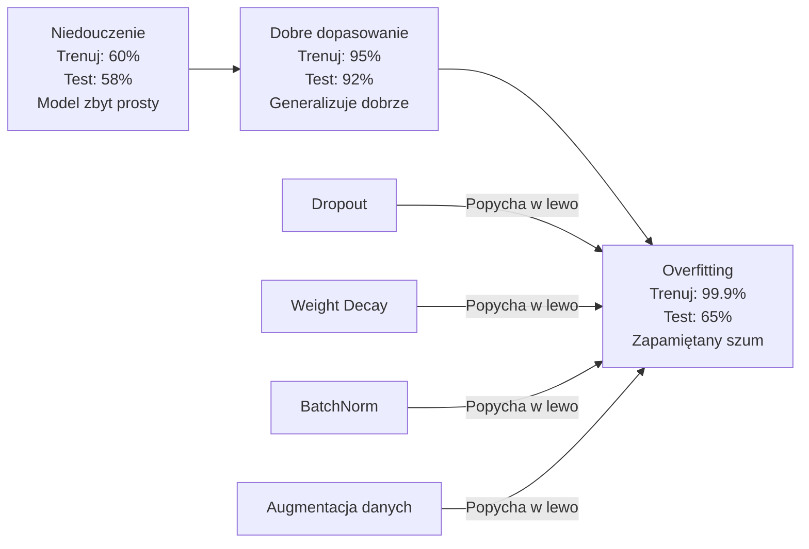
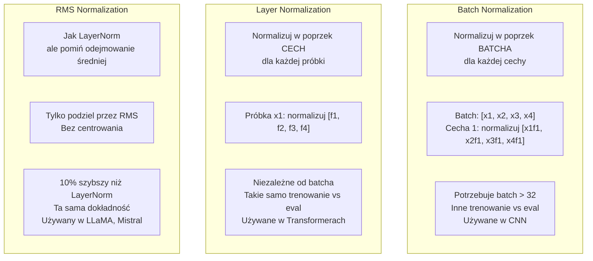
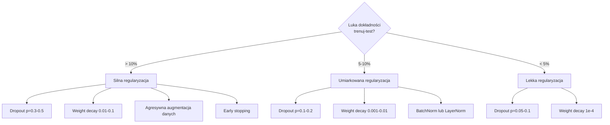

# Regularyzacja

> Twój model osiąga 99% na danych treningowych i 60% na danych testowych. Zapamiętał zamiast się nauczyć. Regularyzacja to podatek, który nakładasz na złożoność, aby wymusić generalizację.

**Type:** Build
**Languages:** Python
**Prerequisites:** Lesson 03.06 (Optimizers)
**Time:** ~75 minutes

## Learning Objectives

- Zaimplementuj dropout z odwrotnym skalowaniem, L2 weight decay, batch normalization, layer normalization i RMSNorm od podstaw
- Zmierz lukę dokładności trenuj-test i zdiagnozuj nadmierne dopasowanie (overfitting) za pomocą eksperymentów regularyzacyjnych
- Wyjaśnij, dlaczego transformery używają LayerNorm zamiast BatchNorm i dlaczego nowoczesne LLM preferują RMSNorm
- Zastosuj odpowiednią kombinację technik regularyzacyjnych w zależności od nasilenia overfittingu

## The Problem

Sieć neuronowa z wystarczającą liczbą parametrów może zapamiętać dowolny zbiór danych. To nie jest hipoteza — Zhang i in. (2017) udowodnili to, trenując standardowe sieci na ImageNet z losowymi etykietami. Sieci osiągnęły blisko zerową stratę treningową na całkowicie losowych przypisaniach etykiet. Zapamiętały milion losowych par wejście-wyjście bez żadnego wzorca do nauczenia. Strata treningowa była doskonała. Dokładność testowa była zerowa.

To jest problem overfittingu, który pogarsza się wraz ze wzrostem modeli. GPT-3 ma 175 miliardów parametrów. Zbiór treningowy ma około 500 miliardów tokenów. Przy takiej liczbie parametrów model ma wystarczającą pojemność, aby zapamiętać znaczące fragmenty danych treningowych dosłownie. Bez regularyzacji po prostu powtarzałby przykłady treningowe zamiast uczyć się uogólnialnych wzorców.

Luka między wydajnością treningową a testową to luka overfittingu. Każda technika w tej lekcji atakuje tę lukę z innego kierunku. Dropout zmusza sieć do niepolegania na żadnym pojedynczym neuronie. Weight decay zapobiega zbytniemu wzrostowi pojedynczej wagi. Batch normalization wygładza krajobraz strat, dzięki czemu optymalizator znajduje bardziej płaskie, lepiej generalizujące minima. Layer normalization robi to samo, ale działa tam, gdzie BatchNorm zawodzi (małe batche, sekwencje o zmiennej długości). RMSNorm robi to 10% szybciej, pomijając obliczanie średniej. Każda technika jest prosta. Razem stanowią różnicę między modelem, który zapamiętuje, a modelem, który generalizuje.

## The Concept

### Spektrum Overfittingu

Każdy model znajduje się gdzieś na spektrum od niedouczenia (zbyt prosty, aby uchwycić wzorzec) do nadmiernego dopasowania (tak złożony, że łapie szum). Punkt optimum jest pośrodku, a regularyzacja popycha modele w jego kierunku od strony overfittingu.



### Dropout

Najprostsza technika regularyzacyjna z najbardziej elegancką interpretacją. Podczas trenowania, losowo zeruj wyjście każdego neuronu z prawdopodobieństwem p.

```
output = activation(z) * mask    gdzie mask[i] ~ Bernoulli(1 - p)
```

Przy p = 0.5, połowa neuronów jest zerowana w każdym przejściu do przodu. Sieć musi nauczyć się nadmiarowych reprezentacji, ponieważ nie może przewidzieć, które neurony będą dostępne. Zapobiega to ko-adaptacji — uczeniu się neuronów polegających na obecności konkretnych innych neuronów.

Interpretacja ensemble: sieć z N neuronami i dropoutem tworzy 2^N możliwych podsieci (każda kombinacja tego, które neurony są włączone lub wyłączone). Trenowanie z dropoutem w przybliżeniu trenuje wszystkie 2^N podsieci jednocześnie, każdą na różnych mini-batchach. W czasie testu używasz wszystkich neuronów (bez dropoutu) i skalujesz wyjścia przez (1 - p), aby dopasować wartość oczekiwaną podczas trenowania. Jest to równoważne uśrednianiu przewidywań 2^N podsieci — masywny ensemble z pojedynczego modelu.

W praktyce skalowanie jest stosowane podczas trenowania zamiast testowania (odwrócony dropout / inverted dropout):

```
Podczas trenowania:  output = activation(z) * mask / (1 - p)
Podczas testowania:   output = activation(z)   (nie wymaga zmian)
```

Jest to czystsze, ponieważ kod testowy nie musi w ogóle wiedzieć o dropoucie.

Domyślne wartości: p = 0.1 dla transformerów, p = 0.5 dla MLP, p = 0.2-0.3 dla CNN. Wyższy dropout = silniejsza regularyzacja = większe ryzyko niedouczenia.

### Weight Decay (Regularyzacja L2)

Dodaj kwadratową wielkość wszystkich wag do straty:

```
total_loss = task_loss + (lambda / 2) * sum(w_i^2)
```

Gradient członu regularyzacyjnego to lambda * w. Oznacza to, że w każdym kroku każda waga jest zmniejszana w kierunku zera o ułamek proporcjonalny do jej wielkości. Duże wagi są karane bardziej. Model jest popychany w kierunku rozwiązań, w których żadna pojedyncza waga nie dominuje.

Dlaczego pomaga to w generalizacji: modele z overfittingiem mają tendencję do posiadania dużych wag, które wzmacniają szum w danych treningowych. Weight decay utrzymuje wagi małe, co ogranicza efektywną pojemność modelu i zmusza go do polegania na solidnych, generalizowalnych cechach, a nie na zapamiętanych dziwactwach.

Hiperparametr lambda kontroluje siłę. Typowe wartości:

- 0.01 dla AdamW na transformerach
- 1e-4 dla SGD na CNN
- 0.1 dla mocno overfitowanych modeli

Jak omówiono w lekcji 06: weight decay i regularyzacja L2 są równoważne w SGD, ale nie w Adamie. Zawsze używaj AdamW (odsprzężony weight decay) podczas trenowania z Adamem.

### Batch Normalization

Normalizuj wyjście każdej warstwy w poprzek mini-batcha przed przekazaniem go do następnej warstwy.

Dla mini-batcha aktywacji w pewnej warstwie:

```
mu = (1/B) * sum(x_i)           (średnia batcha)
sigma^2 = (1/B) * sum((x_i - mu)^2)   (wariancja batcha)
x_hat = (x_i - mu) / sqrt(sigma^2 + eps)   (normalizacja)
y = gamma * x_hat + beta        (skalowanie i przesunięcie)
```

Gamma i beta to uczone parametry, które pozwalają sieci cofnąć normalizację, jeśli to optymalne. Bez nich zmuszałbyś wyjście każdej warstwy do bycia o średniej zero i jednostkowej wariancji, co może nie być tym, czego chce sieć.

**Podział trenowanie vs wnioskowanie:** Podczas trenowania, mu i sigma pochodzą z bieżącego mini-batcha. Podczas wnioskowania, używasz średnich kroczących zgromadzonych podczas trenowania (wykładnicza średnia krocząca z momentum = 0.1, co oznacza 90% stare + 10% nowe).

Dlaczego BatchNorm działa wciąż jest przedmiotem debaty. Oryginalna praca twierdziła, że redukuje "wewnętrzne przesunięcie kowariancji" (zmianę rozkładu wejść warstw w miarę aktualizacji wcześniejszych warstw). Santurkar i in. (2018) wykazali, że to wyjaśnienie jest błędne. Rzeczywisty powód: BatchNorm wygładza krajobraz strat. Gradienty są bardziej przewidywalne, stałe Lipschitza są mniejsze, a optymalizator może bezpiecznie robić większe kroki. Dlatego BatchNorm pozwala na używanie wyższych szybkości uczenia się i szybszą zbieżność.

BatchNorm ma fundamentalne ograniczenie: zależy od statystyk batcha. Przy rozmiarze batcha 1, średnia i wariancja są bez znaczenia. Przy małych batchach (< 32), statystyki są zaszumione i szkodzą wydajności. Ma to znaczenie w zadaniach takich jak wykrywanie obiektów (gdzie pamięć ogranicza rozmiar batcha) i modelowanie języka (gdzie długości sekwencji są zmienne).

### Layer Normalization

Normalizuj w poprzek cech, a nie w poprzek batcha. Dla pojedynczej próbki:

```
mu = (1/D) * sum(x_j)           (średnia cech)
sigma^2 = (1/D) * sum((x_j - mu)^2)   (wariancja cech)
x_hat = (x_j - mu) / sqrt(sigma^2 + eps)
y = gamma * x_hat + beta
```

D to wymiar cech. Każda próbka jest normalizowana niezależnie — brak zależności od rozmiaru batcha. Dlatego transformery używają LayerNorm zamiast BatchNorm. Sekwencje mają zmienne długości, rozmiary batchów są często małe (lub wynoszą 1 podczas generacji), a obliczenia są identyczne między trenowaniem a wnioskowaniem.

LayerNorm w transformerach jest stosowany po każdym bloku self-attention i każdym bloku feed-forward (Post-LN) lub przed nimi (Pre-LN, który jest bardziej stabilny podczas trenowania).

### RMSNorm

LayerNorm bez odejmowania średniej. Zaproponowany przez Zhanga i Sennricha (2019).

```
rms = sqrt((1/D) * sum(x_j^2))
y = gamma * x / rms
```

To wszystko. Brak obliczania średniej, brak parametru beta. Obserwacja: ponowne centrowanie (odejmowanie średniej) w LayerNorm wnosi bardzo niewiele do wydajności modelu, ale kosztuje obliczenia. Jego usunięcie daje tę samą dokładność przy około 10% mniejszym narzucie.

LLaMA, LLaMA 2, LLaMA 3, Mistral i większość nowoczesnych LLM używa RMSNorm zamiast LayerNorm. W skali miliardów parametrów i bilionów tokenów, te 10% oszczędności jest znaczące.

### Porównanie Normalizacji



### Augmentacja Danych jako Regularyzacja

Nie modyfikacja modelu, ale modyfikacja danych. Przekształcaj wejścia treningowe, zachowując etykiety:

- Obrazy: losowe przycinanie, odwracanie, obrót, zmiana kolorów, cutout
- Tekst: zastępowanie synonimami, tłumaczenie zwrotne, losowe usuwanie
- Audio: rozciąganie czasu, zmiana wysokości dźwięku, dodawanie szumu

Efekt jest identyczny z regularyzacją: zwiększa efektywny rozmiar zbioru treningowego, utrudniając modelowi zapamiętanie konkretnych przykładów. Model, który widzi każde zdjęcie tylko raz w oryginalnej formie, może je zapamiętać. Model, który widzi 50 augmentowanych wersji każdego zdjęcia, jest zmuszony nauczyć się niezmienniczej struktury.

### Early Stopping

Najprostszy regulator: przestań trenować, gdy strata walidacyjna zacznie rosnąć. Model nie jest jeszcze nadmiernie dopasowany w tym momencie. W praktyce śledzisz stratę walidacyjną co epokę, zapisujesz najlepszy model i kontynuujesz trenowanie przez okno "cierpliwości" (zazwyczaj 5-20 epok). Jeśli strata walidacyjna nie poprawi się w oknie cierpliwości, zatrzymujesz się i ładujesz najlepszy zapisany model.

### Kiedy Zastosować Co



```figure
l2-regularization
```

## Build It

### Krok 1: Dropout (Tryb Trenowania i Ewaluacji)

```python
import random
import math


class Dropout:
    def __init__(self, p=0.5):
        self.p = p
        self.training = True
        self.mask = None

    def forward(self, x):
        if not self.training:
            return list(x)
        self.mask = []
        output = []
        for val in x:
            if random.random() < self.p:
                self.mask.append(0)
                output.append(0.0)
            else:
                self.mask.append(1)
                output.append(val / (1 - self.p))
        return output

    def backward(self, grad_output):
        grads = []
        for g, m in zip(grad_output, self.mask):
            if m == 0:
                grads.append(0.0)
            else:
                grads.append(g / (1 - self.p))
        return grads
```

### Krok 2: L2 Weight Decay

```python
def l2_regularization(weights, lambda_reg):
    penalty = 0.0
    for w in weights:
        penalty += w * w
    return lambda_reg * 0.5 * penalty

def l2_gradient(weights, lambda_reg):
    return [lambda_reg * w for w in weights]
```

### Krok 3: Batch Normalization

```python
class BatchNorm:
    def __init__(self, num_features, momentum=0.1, eps=1e-5):
        self.gamma = [1.0] * num_features
        self.beta = [0.0] * num_features
        self.eps = eps
        self.momentum = momentum
        self.running_mean = [0.0] * num_features
        self.running_var = [1.0] * num_features
        self.training = True
        self.num_features = num_features

    def forward(self, batch):
        batch_size = len(batch)
        if self.training:
            mean = [0.0] * self.num_features
            for sample in batch:
                for j in range(self.num_features):
                    mean[j] += sample[j]
            mean = [m / batch_size for m in mean]

            var = [0.0] * self.num_features
            for sample in batch:
                for j in range(self.num_features):
                    var[j] += (sample[j] - mean[j]) ** 2
            var = [v / batch_size for v in var]

            for j in range(self.num_features):
                self.running_mean[j] = (1 - self.momentum) * self.running_mean[j] + self.momentum * mean[j]
                self.running_var[j] = (1 - self.momentum) * self.running_var[j] + self.momentum * var[j]
        else:
            mean = list(self.running_mean)
            var = list(self.running_var)

        self.x_hat = []
        output = []
        for sample in batch:
            normalized = []
            out_sample = []
            for j in range(self.num_features):
                x_h = (sample[j] - mean[j]) / math.sqrt(var[j] + self.eps)
                normalized.append(x_h)
                out_sample.append(self.gamma[j] * x_h + self.beta[j])
            self.x_hat.append(normalized)
            output.append(out_sample)
        return output
```

### Krok 4: Layer Normalization

```python
class LayerNorm:
    def __init__(self, num_features, eps=1e-5):
        self.gamma = [1.0] * num_features
        self.beta = [0.0] * num_features
        self.eps = eps
        self.num_features = num_features

    def forward(self, x):
        mean = sum(x) / len(x)
        var = sum((xi - mean) ** 2 for xi in x) / len(x)

        self.x_hat = []
        output = []
        for j in range(self.num_features):
            x_h = (x[j] - mean) / math.sqrt(var + self.eps)
            self.x_hat.append(x_h)
            output.append(self.gamma[j] * x_h + self.beta[j])
        return output
```

### Krok 5: RMSNorm

```python
class RMSNorm:
    def __init__(self, num_features, eps=1e-6):
        self.gamma = [1.0] * num_features
        self.eps = eps
        self.num_features = num_features

    def forward(self, x):
        rms = math.sqrt(sum(xi * xi for xi in x) / len(x) + self.eps)
        output = []
        for j in range(self.num_features):
            output.append(self.gamma[j] * x[j] / rms)
        return output
```

### Krok 6: Trenowanie z Regularyzacją i Bez

```python
def sigmoid(x):
    x = max(-500, min(500, x))
    return 1.0 / (1.0 + math.exp(-x))


def make_circle_data(n=200, seed=42):
    random.seed(seed)
    data = []
    for _ in range(n):
        x = random.uniform(-2, 2)
        y = random.uniform(-2, 2)
        label = 1.0 if x * x + y * y < 1.5 else 0.0
        data.append(([x, y], label))
    return data


class RegularizedNetwork:
    def __init__(self, hidden_size=16, lr=0.05, dropout_p=0.0, weight_decay=0.0):
        random.seed(0)
        self.hidden_size = hidden_size
        self.lr = lr
        self.dropout_p = dropout_p
        self.weight_decay = weight_decay
        self.dropout = Dropout(p=dropout_p) if dropout_p > 0 else None

        self.w1 = [[random.gauss(0, 0.5) for _ in range(2)] for _ in range(hidden_size)]
        self.b1 = [0.0] * hidden_size
        self.w2 = [random.gauss(0, 0.5) for _ in range(hidden_size)]
        self.b2 = 0.0

    def forward(self, x, training=True):
        self.x = x
        self.z1 = []
        self.h = []
        for i in range(self.hidden_size):
            z = self.w1[i][0] * x[0] + self.w1[i][1] * x[1] + self.b1[i]
            self.z1.append(z)
            self.h.append(max(0.0, z))

        if self.dropout and training:
            self.dropout.training = True
            self.h = self.dropout.forward(self.h)
        elif self.dropout:
            self.dropout.training = False
            self.h = self.dropout.forward(self.h)

        self.z2 = sum(self.w2[i] * self.h[i] for i in range(self.hidden_size)) + self.b2
        self.out = sigmoid(self.z2)
        return self.out

    def backward(self, target):
        eps = 1e-15
        p = max(eps, min(1 - eps, self.out))
        d_loss = -(target / p) + (1 - target) / (1 - p)
        d_sigmoid = self.out * (1 - self.out)
        d_out = d_loss * d_sigmoid

        for i in range(self.hidden_size):
            d_relu = 1.0 if self.z1[i] > 0 else 0.0
            d_h = d_out * self.w2[i] * d_relu
            self.w2[i] -= self.lr * (d_out * self.h[i] + self.weight_decay * self.w2[i])
            for j in range(2):
                self.w1[i][j] -= self.lr * (d_h * self.x[j] + self.weight_decay * self.w1[i][j])
            self.b1[i] -= self.lr * d_h
        self.b2 -= self.lr * d_out

    def evaluate(self, data):
        correct = 0
        total_loss = 0.0
        for x, y in data:
            pred = self.forward(x, training=False)
            eps = 1e-15
            p = max(eps, min(1 - eps, pred))
            total_loss += -(y * math.log(p) + (1 - y) * math.log(1 - p))
            if (pred >= 0.5) == (y >= 0.5):
                correct += 1
        return total_loss / len(data), correct / len(data) * 100

    def train_model(self, train_data, test_data, epochs=300):
        history = []
        for epoch in range(epochs):
            total_loss = 0.0
            correct = 0
            for x, y in train_data:
                pred = self.forward(x, training=True)
                self.backward(y)
                eps = 1e-15
                p = max(eps, min(1 - eps, pred))
                total_loss += -(y * math.log(p) + (1 - y) * math.log(1 - p))
                if (pred >= 0.5) == (y >= 0.5):
                    correct += 1
            train_loss = total_loss / len(train_data)
            train_acc = correct / len(train_data) * 100
            test_loss, test_acc = self.evaluate(test_data)
            history.append((train_loss, train_acc, test_loss, test_acc))
            if epoch % 75 == 0 or epoch == epochs - 1:
                gap = train_acc - test_acc
                print(f"    Epoch {epoch:3d}: train_acc={train_acc:.1f}%, test_acc={test_acc:.1f}%, gap={gap:.1f}%")
        return history
```

## Use It

PyTorch dostarcza wszystkie normalizacje i regularyzacje jako moduły:

```python
import torch
import torch.nn as nn

model = nn.Sequential(
    nn.Linear(784, 256),
    nn.BatchNorm1d(256),
    nn.ReLU(),
    nn.Dropout(0.3),
    nn.Linear(256, 128),
    nn.BatchNorm1d(128),
    nn.ReLU(),
    nn.Dropout(0.3),
    nn.Linear(128, 10),
)

model.train()
out_train = model(torch.randn(32, 784))

model.eval()
out_test = model(torch.randn(1, 784))
```

Przełącznik `model.train()` / `model.eval()` jest krytyczny. Włącza/wyłącza dropout i mówi BatchNorm, aby używał statystyk batcha vs statystyk kroczących. Zapomnienie o `model.eval()` przed wnioskowaniem jest jednym z najczęstszych błędów w głębokim uczeniu. Twoja dokładność testowa będzie losowo fluktuować, ponieważ dropout jest wciąż aktywny, a BatchNorm używa statystyk mini-batcha.

W przypadku transformerów wzorzec jest inny:

```python
class TransformerBlock(nn.Module):
    def __init__(self, d_model=512, nhead=8, dropout=0.1):
        super().__init__()
        self.attention = nn.MultiheadAttention(d_model, nhead, dropout=dropout)
        self.norm1 = nn.LayerNorm(d_model)
        self.ff = nn.Sequential(
            nn.Linear(d_model, d_model * 4),
            nn.GELU(),
            nn.Linear(d_model * 4, d_model),
            nn.Dropout(dropout),
        )
        self.norm2 = nn.LayerNorm(d_model)
        self.dropout = nn.Dropout(dropout)

    def forward(self, x):
        attended, _ = self.attention(x, x, x)
        x = self.norm1(x + self.dropout(attended))
        x = self.norm2(x + self.ff(x))
        return x
```

LayerNorm, nie BatchNorm. Dropout p=0.1, nie p=0.5. To są domyślne wartości dla transformerów.

## Ship It

Ta lekcja produkuje:
- `outputs/prompt-regularization-advisor.md` -- prompt, który diagnozuje overfitting i zaleca odpowiednią strategię regularyzacji

## Exercises

1. Zaimplementuj dropout przestrzenny (spatial dropout) dla danych 2D: zamiast zerować pojedyncze neurony, zeruj całe kanały cech. Zasymuluj to, traktując grupy kolejnych cech jako kanały i zerując całe grupy. Porównaj lukę trenuj-test ze standardowym dropoutem na zbiorze okręgu z hidden_size=32.

2. Połącz label smoothing z lekcji 05 z dropoutem z tej lekcji. Trenuj z czterema konfiguracjami: żadne, tylko dropout, tylko label smoothing, oba. Zmierz końcową lukę dokładności trenuj-test dla każdej. Która kombinacja daje najmniejszą lukę?

3. Dodaj warstwę BatchNorm między warstwą ukrytą a aktywacją w swojej sieci na zbiorze okręgu. Trenuj z BatchNorm i bez, przy szybkościach uczenia się 0.01, 0.05 i 0.1. BatchNorm powinien umożliwić stabilne trenowanie przy wyższych szybkościach uczenia się, gdzie waniliowa sieć się rozbiega.

4. Zaimplementuj early stopping: śledź stratę testową co epokę, zapisuj najlepsze wagi i zatrzymaj się, jeśli strata testowa nie poprawiła się przez 20 epok. Uruchom regularyzowaną sieć na 1000 epok. Podaj, która epoka miała najlepszą dokładność testową i ile epok obliczeń zaoszczędziłeś.

5. Porównaj LayerNorm vs RMSNorm na 4-warstwowej sieci (nie tylko 2). Zainicjalizuj obie z tymi samymi wagami. Trenuj przez 200 epok i porównaj końcową dokładność, szybkość trenowania (czas na epokę) i wielkości gradientów w pierwszej warstwie. Zweryfikuj, że RMSNorm jest szybszy przy tej samej dokładności.

## Key Terms

| Termin | Co ludzie mówią | Co to naprawdę znaczy |
|------|----------------|----------------------|
| Overfitting | "Model zapamiętał dane" | Gdy wydajność treningowa modelu znacząco przewyższa jego wydajność testową, wskazując, że nauczył się szumu zamiast sygnału |
| Regularization | "Zapobieganie overfittingowi" | Każda technika ograniczająca złożoność modelu w celu poprawy generalizacji: dropout, weight decay, normalizacja, augmentacja |
| Dropout | "Losowe usuwanie neuronów" | Zerowanie losowych neuronów podczas trenowania z prawdopodobieństwem p, wymuszające nadmiarowe reprezentacje; równoważne trenowaniu ensemble |
| Weight decay | "Kara L2" | Zmniejszanie wszystkich wag w kierunku zera przez odejmowanie lambda * w w każdym kroku; karze złożoność poprzez wielkość wag |
| Batch normalization | "Normalizuj na batch" | Normalizowanie wyjść warstw w poprzek wymiaru batcha przy użyciu statystyk batcha podczas trenowania i średnich kroczących podczas wnioskowania |
| Layer normalization | "Normalizuj na próbkę" | Normalizowanie w poprzek cech w obrębie każdej próbki; niezależna od batcha, używana w transformerach, gdzie rozmiar batcha jest zmienny |
| RMSNorm | "LayerNorm bez średniej" | Normalizacja pierwiastkiem kwadratowym średniej kwadratów; pomija odejmowanie średniej z LayerNorm dla 10% przyspieszenia przy równej dokładności |
| Early stopping | "Zatrzymaj przed overfitem" | Zatrzymanie trenowania, gdy strata walidacyjna przestaje się poprawiać; najprostszy regulator, często używany razem z innymi |
| Data augmentation | "Więcej danych z mniej" | Przekształcanie wejść treningowych (odwracanie, przycinanie, szum) w celu zwiększenia efektywnego rozmiaru zbioru danych i wymuszenia uczenia się niezmienniczości |
| Generalization gap | "Podział trenuj-test" | Różnica między wydajnością treningową a testową; regularyzacja ma na celu zminimalizowanie tej luki |

## Further Reading

- Srivastava et al., "Dropout: A Simple Way to Prevent Neural Networks from Overfitting" (2014) -- oryginalna praca o dropoucie z interpretacją ensemble i obszernymi eksperymentami
- Ioffe & Szegedy, "Batch Normalization: Accelerating Deep Network Training by Reducing Internal Covariate Shift" (2015) -- wprowadziła BatchNorm i procedurę trenowania, jeden z najczęściej cytowanych artykułów o głębokim uczeniu
- Zhang & Sennrich, "Root Mean Square Layer Normalization" (2019) -- wykazali, że RMSNorm dorównuje dokładnością LayerNorm przy zmniejszonych obliczeniach; przyjęty przez LLaMA i Mistral
- Zhang et al., "Understanding Deep Learning Requires Rethinking Generalization" (2017) -- przełomowa praca pokazująca, że sieci neuronowe mogą zapamiętywać losowe etykiety, podważając tradycyjne poglądy na generalizację