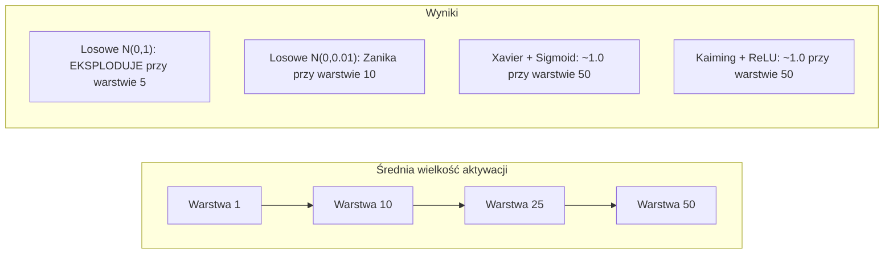
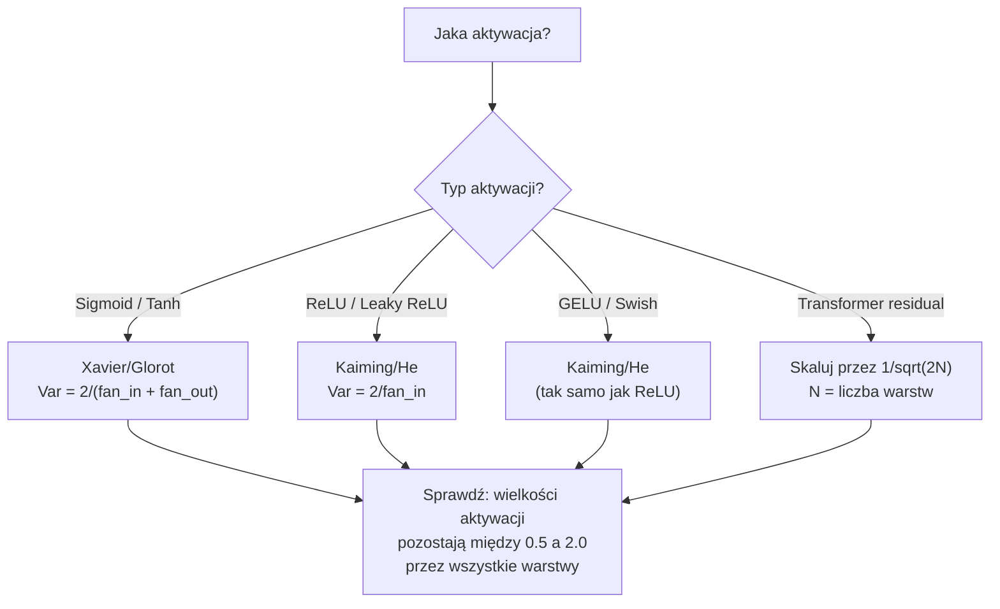

# Inicjalizacja wag i stabilność trenowania

> Źle zainicjujesz i trenowanie nigdy się nie rozpocznie. Dobrze zainicjujesz i 50 warstw trenuje równie płynnie jak 3.

**Type:** Build
**Languages:** Python
**Prerequisites:** Lesson 03.04 (Activation Functions), Lesson 03.07 (Regularization)
**Time:** ~90 minutes

## Learning Objectives

- Zaimplementuj strategie inicjalizacji zerowej, losowej, Xavier/Glorot i Kaiming/He oraz zmierz ich wpływ na wielkości aktywacji przez 50 warstw
- Wyprowadź, dlaczego inicjalizacja Xaviera używa Var(w) = 2/(fan_in + fan_out), a Kaiminga Var(w) = 2/fan_in
- Zademonstruj problem symetrii przy inicjalizacji zerowej i wyjaśnij, dlaczego sama skala losowa jest niewystarczająca
- Dopasuj odpowiednią strategię inicjalizacji do funkcji aktywacji: Xavier dla sigmoid/tanh, Kaiming dla ReLU/GELU

## The Problem

Zainicjuj wszystkie wagi na zero. Nic się nie uczy. Każdy neuron oblicza tę samą funkcję, otrzymuje ten sam gradient i aktualizuje się identycznie. Po 10 000 epok Twoja 512-neuronowa warstwa ukryta to wciąż 512 kopii tego samego neuronu. Zapłaciłeś za 512 parametrów, a dostałeś 1.

Zainicjuj je zbyt duże. Aktywacje eksplodują przez sieć. Przy warstwie 10 wartości osiągają 1e15. Przy warstwie 20 przepełniają się do nieskończoności. Gradienty podążają tą samą trajektorią w odwrotnym kierunku.

Zainicjuj je losowo ze standardowego rozkładu normalnego. Działa dla 3 warstw. Przy 50 warstwach sygnał zapada się do zera lub detonuje do nieskończoności, w zależności od tego, czy skala losowa była nieco za mała, czy nieco za duża. Granica między "działa" a "zepsute" jest cienka jak brzytwa.

Inicjalizacja wag jest najbardziej niedocenianą decyzją w głębokim uczeniu. Architektura zdobywa publikacje. Optymalizatory dostają wpisy na blogach. Inicjalizacja dostaje przypis. Ale jeśli ją spieprzysz, nic innego nie ma znaczenia -- Twoja sieć jest martwa, zanim trenowanie się zacznie.

## The Concept

### The Symmetry Problem

Każdy neuron w warstwie ma tę samą strukturę: pomnóż wejścia przez wagi, dodaj bias, zastosuj aktywację. Jeśli wszystkie wagi zaczynają od tej samej wartości (zero jest skrajnym przypadkiem), każdy neuron oblicza to samo wyjście. Podczas wstecznej propagacji każdy neuron otrzymuje ten sam gradient. Podczas kroku aktualizacji każdy neuron zmienia się o tę samą wartość.

Utknąłeś. Sieć ma setki parametrów, ale wszystkie poruszają się w jednym tempie. Nazywa się to symetrią, a losowa inicjalizacja jest brutalnym sposobem na jej przełamanie. Każdy neuron zaczyna w innym punkcie przestrzeni wag, więc każdy uczy się innej cechy.

Ale "losowość" to nie wszystko. *Skala* losowości decyduje o tym, czy sieć się trenuje.

### Variance Propagation Through Layers

Rozważ pojedynczą warstwę z fan_in wejściami:

```
z = w1*x1 + w2*x2 + ... + w_n*x_n
```

Jeśli każda waga wi pochodzi z rozkładu o wariancji Var(w), a każde wejście xi ma wariancję Var(x), wariancja wyjścia wynosi:

```
Var(z) = fan_in * Var(w) * Var(x)
```

Jeśli Var(w) = 1 i fan_in = 512, wariancja wyjścia jest 512 razy większa od wariancji wejścia. Po 10 warstwach: 512^10 = 1.2e27. Twój sygnał eksplodował.

Jeśli Var(w) = 0.001, wariancja wyjścia zmniejsza się o 0.001 * 512 = 0.512 na warstwę. Po 10 warstwach: 0.512^10 = 0.00013. Twój sygnał zniknął.

Cel: wybrać Var(w) tak, aby Var(z) = Var(x). Wielkość sygnału pozostaje stała przez wszystkie warstwy.

### Xavier/Glorot Initialization

Glorot i Bengio (2010) wyprowadzili rozwiązanie dla aktywacji sigmoid i tanh. Aby utrzymać stałą wariancję zarówno w przejściu do przodu, jak i wstecz:

```
Var(w) = 2 / (fan_in + fan_out)
```

W praktyce wagi są losowane z:

```
w ~ Uniform(-limit, limit)  gdzie limit = sqrt(6 / (fan_in + fan_out))
```

lub:

```
w ~ Normal(0, sqrt(2 / (fan_in + fan_out)))
```

Działa to, ponieważ sigmoid i tanh są w przybliżeniu liniowe w pobliżu zera, gdzie żyją prawidłowo zainicjowane aktywacje. Wariancja pozostaje stabilna przez dziesiątki warstw.

### Kaiming/He Initialization

ReLU zabija połowę wyjść (wszystko, co ujemne, staje się zerem). Efektywne fan_in jest zmniejszone o połowę, ponieważ średnio połowa wejść jest zerowana. Inicjalizacja Xaviera nie uwzględnia tego -- zaniża potrzebną wariancję.

He i in. (2015) dostosowali wzór:

```
Var(w) = 2 / fan_in
```

Wagi są losowane z:

```
w ~ Normal(0, sqrt(2 / fan_in))
```

Współczynnik 2 kompensuje zerowanie połowy aktywacji przez ReLU. Bez niego sygnał kurczy się o ~0.5x na warstwę. Przy 50 warstwach: 0.5^50 = 8.8e-16. Inicjalizacja Kaiminga zapobiega temu.

### Transformer Initialization

GPT-2 wprowadził inny wzór. Połączenia residualne dodają wyjście każdej podwarstwy do jej wejścia:

```
x = x + sublayer(x)
```

Każde dodanie zwiększa wariancję. Przy N warstwach residualnych wariancja rośnie proporcjonalnie do N. GPT-2 skaluje wagi warstw residualnych przez 1/sqrt(2N), gdzie N to liczba warstw. Utrzymuje to skumulowaną wielkość sygnału stabilną.

Llama 3 (405B parametrów, 126 warstw) używa podobnego schematu. Bez tego skalowania strumień residualny rósłby nieograniczenie przez 126 warstw bloków attention i feedforward.

```mermaid
flowchart TD
    subgraph "Inicjalizacja zerowa"
        Z1["Warstwa 1<br/>Wszystkie wagi = 0"] --> Z2["Warstwa 2<br/>Wszystkie neurony identyczne"]
        Z2 --> Z3["Warstwa 3<br/>Wciąż identyczne"]
        Z3 --> ZR["Wynik: 1 efektywny neuron<br/>niezależnie od szerokości"]
    end

    subgraph "Inicjalizacja Xaviera"
        X1["Warstwa 1<br/>Var = 2/(fan_in+fan_out)"] --> X2["Warstwa 2<br/>Sygnał stabilny"]
        X2 --> X3["Warstwa 50<br/>Sygnał stabilny"]
        X3 --> XR["Wynik: Trenuje z<br/>sigmoid/tanh"]
    end

    subgraph "Inicjalizacja Kaiminga"
        K1["Warstwa 1<br/>Var = 2/fan_in"] --> K2["Warstwa 2<br/>Sygnał stabilny"]
        K2 --> K3["Warstwa 50<br/>Sygnał stabilny"]
        K3 --> KR["Wynik: Trenuje z<br/>ReLU/GELU"]
    end
```



### Activation Magnitude Through 50 Layers



### Choosing the Right Init



```figure
weight-init-variance
```

## Build It

### Step 1: Initialization Strategies

Cztery sposoby na inicjalizację macierzy wag. Każdy zwraca listę list (macierz 2D) z fan_in kolumnami i fan_out wierszami.

```python
import math
import random


def zero_init(fan_in, fan_out):
    return [[0.0 for _ in range(fan_in)] for _ in range(fan_out)]


def random_init(fan_in, fan_out, scale=1.0):
    return [[random.gauss(0, scale) for _ in range(fan_in)] for _ in range(fan_out)]


def xavier_init(fan_in, fan_out):
    std = math.sqrt(2.0 / (fan_in + fan_out))
    return [[random.gauss(0, std) for _ in range(fan_in)] for _ in range(fan_out)]


def kaiming_init(fan_in, fan_out):
    std = math.sqrt(2.0 / fan_in)
    return [[random.gauss(0, std) for _ in range(fan_in)] for _ in range(fan_out)]
```

### Step 2: Activation Functions

Potrzebujemy sigmoid, tanh i ReLU, aby przetestować każdą strategię inicjalizacji z jej przeznaczoną aktywacją.

```python
def sigmoid(x):
    x = max(-500, min(500, x))
    return 1.0 / (1.0 + math.exp(-x))


def tanh_act(x):
    return math.tanh(x)


def relu(x):
    return max(0.0, x)
```

### Step 3: Forward Pass Through 50 Layers

Przepuść losowe dane przez głęboką sieć i zmierz średnią wielkość aktywacji w każdej warstwie.

```python
def forward_deep(init_fn, activation_fn, n_layers=50, width=64, n_samples=100):
    random.seed(42)
    layer_magnitudes = []

    inputs = [[random.gauss(0, 1) for _ in range(width)] for _ in range(n_samples)]

    for layer_idx in range(n_layers):
        weights = init_fn(width, width)
        biases = [0.0] * width

        new_inputs = []
        for sample in inputs:
            output = []
            for neuron_idx in range(width):
                z = sum(weights[neuron_idx][j] * sample[j] for j in range(width)) + biases[neuron_idx]
                output.append(activation_fn(z))
            new_inputs.append(output)
        inputs = new_inputs

        magnitudes = []
        for sample in inputs:
            magnitudes.append(sum(abs(v) for v in sample) / width)
        mean_mag = sum(magnitudes) / len(magnitudes)
        layer_magnitudes.append(mean_mag)

    return layer_magnitudes
```

### Step 4: The Experiment

Uruchom wszystkie kombinacje: inicjalizacja zerowa, losowe N(0,1), losowe N(0,0.01), Xavier z sigmoid, Xavier z tanh, Kaiming z ReLU. Wypisz wielkość w kluczowych warstwach.

```python
def run_experiment():
    configs = [
        ("Zero init + Sigmoid", lambda fi, fo: zero_init(fi, fo), sigmoid),
        ("Random N(0,1) + ReLU", lambda fi, fo: random_init(fi, fo, 1.0), relu),
        ("Random N(0,0.01) + ReLU", lambda fi, fo: random_init(fi, fo, 0.01), relu),
        ("Xavier + Sigmoid", xavier_init, sigmoid),
        ("Xavier + Tanh", xavier_init, tanh_act),
        ("Kaiming + ReLU", kaiming_init, relu),
    ]

    print(f"{'Strategia':<30} {'L1':>10} {'L5':>10} {'L10':>10} {'L25':>10} {'L50':>10}")
    print("-" * 80)

    for name, init_fn, act_fn in configs:
        mags = forward_deep(init_fn, act_fn)
        row = f"{name:<30}"
        for idx in [0, 4, 9, 24, 49]:
            val = mags[idx]
            if val > 1e6:
                row += f" {'EKSPLODOWAŁO':>10}"
            elif val < 1e-6:
                row += f" {'ZANIKŁO':>10}"
            else:
                row += f" {val:>10.4f}"
        print(row)
```

### Step 5: Symmetry Demonstration

Pokaż, że inicjalizacja zerowa tworzy identyczne neurony.

```python
def symmetry_demo():
    random.seed(42)
    weights = zero_init(2, 4)
    biases = [0.0] * 4

    inputs = [0.5, -0.3]
    outputs = []
    for neuron_idx in range(4):
        z = sum(weights[neuron_idx][j] * inputs[j] for j in range(2)) + biases[neuron_idx]
        outputs.append(sigmoid(z))

    print("\nDemonstracja symetrii (4 neurony, inicjalizacja zerowa):")
    for i, out in enumerate(outputs):
        print(f"  Neuron {i}: wyjście = {out:.6f}")
    all_same = all(abs(outputs[i] - outputs[0]) < 1e-10 for i in range(len(outputs)))
    print(f"  Wszystkie identyczne: {all_same}")
    print(f"  Efektywne parametry: 1 (nie {len(weights) * len(weights[0])})")
```

### Step 6: Layer-by-Layer Magnitude Report

Wypisz wizualny wykres słupkowy wielkości aktywacji przez 50 warstw.

```python
def magnitude_report(name, magnitudes):
    print(f"\n{name}:")
    for i, mag in enumerate(magnitudes):
        if i % 5 == 0 or i == len(magnitudes) - 1:
            if mag > 1e6:
                bar = "X" * 50 + " EKSPLODOWAŁO"
            elif mag < 1e-6:
                bar = "." + " ZANIKŁO"
            else:
                bar_len = min(50, max(1, int(mag * 10)))
                bar = "#" * bar_len
            print(f"  Warstwa {i+1:3d}: {bar} ({mag:.6f})")
```

## Use It

PyTorch udostępnia je jako wbudowane funkcje:

```python
import torch
import torch.nn as nn

layer = nn.Linear(512, 256)

nn.init.xavier_uniform_(layer.weight)
nn.init.xavier_normal_(layer.weight)

nn.init.kaiming_uniform_(layer.weight, nonlinearity='relu')
nn.init.kaiming_normal_(layer.weight, nonlinearity='relu')

nn.init.zeros_(layer.bias)
```

Kiedy wywołujesz `nn.Linear(512, 256)`, PyTorch domyślnie używa inicjalizacji Kaiming uniform. Dlatego większość prostych sieci "po prostu działa" -- PyTorch już podjął właściwą decyzję. Ale kiedy budujesz własne architektury lub schodzisz głębiej niż 20 warstw, musisz rozumieć, co się dzieje i potencjalnie nadpisać domyślne ustawienia.

W przypadku transformerów, modele HuggingFace zazwyczaj obsługują inicjalizację w swojej metodzie `_init_weights`. Implementacja GPT-2 skaluje projekcje residualne przez 1/sqrt(N). Jeśli budujesz transformer od podstaw, musisz dodać to samodzielnie.

## Ship It

Ta lekcja produkuje:
- `outputs/prompt-init-strategy.md` -- prompt, który diagnozuje problemy z inicjalizacją wag i rekomenduje właściwą strategię

## Exercises

1. Dodaj inicjalizację LeCuna (Var = 1/fan_in, zaprojektowaną dla aktywacji SELU). Uruchom eksperyment z 50 warstwami dla LeCun init + tanh i porównaj z Xavier + tanh.

2. Zaimplementuj skalowanie residualne GPT-2: pomnóż wyjście każdej warstwy przez 1/sqrt(2*N) przed dodaniem do strumienia residualnego. Uruchom 50 warstw ze skalowaniem i bez, zmierz, jak szybko rośnie wielkość residualna.

3. Stwórz funkcję "kontroli zdrowia inicjalizacji", która przyjmuje wymiary warstw sieci i typ aktywacji, a następnie rekomenduje prawidłową inicjalizację i ostrzega, jeśli obecna inicjalizacja spowoduje problemy.

4. Uruchom eksperyment z fan_in = 16 vs fan_in = 1024. Xavier i Kaiming dostosowują się do fan_in, ale losowa inicjalizacja nie. Pokaż, jak różnica między "działa" a "psuje się" powiększa się z większymi warstwami.

5. Zaimplementuj inicjalizację ortogonalną (wygeneruj losową macierz, oblicz jej SVD, użyj macierzy ortogonalnej U). Porównaj z Kaiming dla sieci ReLU przy 50 warstwach.

## Key Terms

| Term | Co ludzie mówią | Co to faktycznie znaczy |
|------|----------------|----------------------|
| Weight initialization | "Ustaw początkowe wagi losowo" | Strategia wyboru początkowych wartości wag, która decyduje, czy sieć w ogóle może być trenowana |
| Symmetry breaking | "Spraw, by neurony były różne" | Użycie losowej inicjalizacji, aby neurony uczyły się odrębnych cech zamiast obliczać identyczne funkcje |
| Fan-in | "Liczba wejść do neuronu" | Liczba połączeń przychodzących, która określa, jak wariancja wejścia kumuluje się w ważonej sumie |
| Fan-out | "Liczba wyjść z neuronu" | Liczba połączeń wychodzących, istotna dla utrzymania wariancji gradientu podczas wstecznej propagacji |
| Xavier/Glorot init | "Inicjalizacja dla sigmoid" | Var(w) = 2/(fan_in + fan_out), zaprojektowana do zachowania wariancji przez aktywacje sigmoid i tanh |
| Kaiming/He init | "Inicjalizacja dla ReLU" | Var(w) = 2/fan_in, uwzględnia zerowanie połowy aktywacji przez ReLU |
| Variance propagation | "Jak sygnały rosną lub kurczą się przez warstwy" | Analityczne badanie, jak wariancja aktywacji zmienia się warstwa po warstwie w zależności od skali wag |
| Residual scaling | "Sztuczka inicjalizacyjna GPT-2" | Skalowanie wag połączeń residualnych przez 1/sqrt(2N), aby zapobiec wzrostowi wariancji przez N warstw transformer |
| Dead network | "Nic się nie trenuje" | Sieć, w której zła inicjalizacja powoduje, że wszystkie gradienty są zerowe lub wszystkie aktywacje są nasycone |
| Exploding activations | "Wartości idą do nieskończoności" | Gdy wariancja wag jest zbyt wysoka, powodując wykładniczy wzrost wielkości aktywacji przez warstwy |

## Further Reading

- Glorot & Bengio, "Understanding the difficulty of training deep feedforward neural networks" (2010) -- oryginalna praca o inicjalizacji Xaviera z analizą wariancji
- He et al., "Delving Deep into Rectifiers" (2015) -- wprowadziła inicjalizację Kaiminga dla sieci ReLU
- Radford et al., "Language Models are Unsupervised Multitask Learners" (2019) -- praca o GPT-2 z inicjalizacją skalowania residualnego
- Mishkin & Matas, "All You Need is a Good Init" (2016) -- inicjalizacja o jednostkowej wariancji sekwencyjna po warstwach, empiryczna alternatywa dla wzorów analitycznych