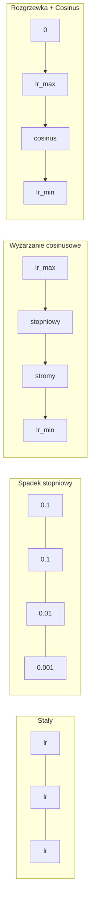
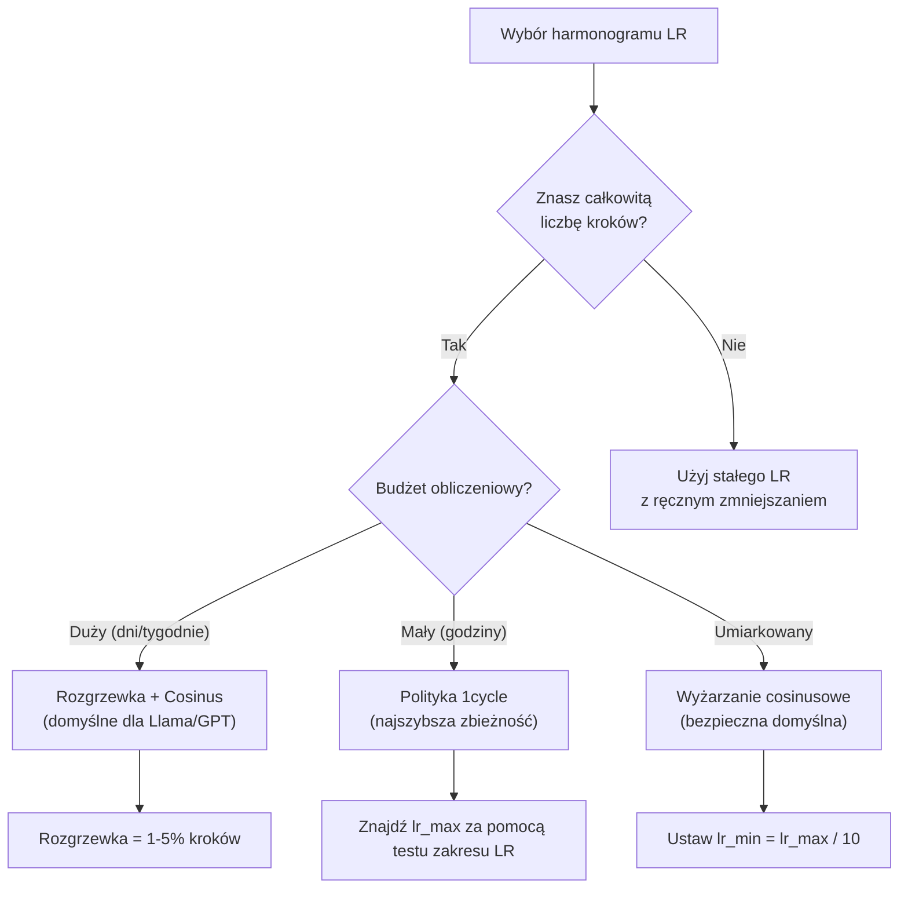
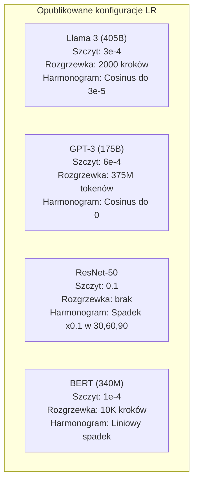

# Harmonogramy tempa uczenia i rozgrzewka (warmup)

> Tempo uczenia jest najważniejszym hiperparametrem. Nie architektura. Nie rozmiar zbioru danych. Nie funkcja aktywacji. Tempo uczenia. Jeśli nie tunujesz niczego innego, tunuj to.

**Type:** Build
**Languages:** Python
**Prerequisites:** Lesson 03.06 (Optimizers), Lesson 03.08 (Weight Initialization)
**Time:** ~90 minutes

## Learning Objectives

- Zaimplementuj od podstaw harmonogramy: stały, stopniowe zmniejszanie, wyżarzanie cosinusowe, rozgrzewkę + cosinus oraz politykę 1cycle
- Zademonstruj trzy tryby awarii doboru tempa uczenia: dywergencja (za wysokie), zatrzymanie (za niskie) i oscylacja (bez zmniejszania)
- Wyjaśnij, dlaczego rozgrzewka jest konieczna dla optymalizatorów opartych na Adamie i jak stabilizuje wczesne trenowanie
- Porównaj szybkość zbieżności wszystkich pięciu harmonogramów na tym samym zadaniu i wybierz odpowiedni dla danego budżetu trenowania

## The Problem

Ustaw tempo uczenia na 0.1. Trenowanie rozbiega się -- strata skacze do nieskończoności w 3 krokach. Ustaw na 0.0001. Trenowanie pełznie -- po 100 epokach model ledwie ruszył się od losowego. Ustaw na 0.01. Trenowanie działa przez 50 epok, potem strata oscyluje wokół minimum, którego nigdy nie osiągnie, ponieważ kroki są zbyt duże.

Optymalne tempo uczenia nie jest stałe. Zmienia się podczas trenowania. Na początku chcesz dużych kroków, aby szybko pokryć teren. Pod koniec trenowania chcesz malutkich kroków, aby osiąść w ostrym minimum. Różnica między modelem z 90% dokładnością a 95% często sprowadza się do harmonogramu.

Każdy większy model opublikowany w ciągu ostatnich trzech lat używa harmonogramu tempa uczenia. Llama 3 używała szczytowego lr=3e-4 z 2000 krokami rozgrzewki i zanikiem cosinusowym do 3e-5. GPT-3 używał lr=6e-4 z rozgrzewką przez 375 milionów tokenów. To nie są arbitralne wybory. Są wynikiem rozległych przeszukiwań hiperparametrów, które kosztowały miliony dolarów.

Musisz rozumieć harmonogramy, ponieważ domyślne ustawienia nie będą działać dla Twojego problemu. Kiedy dostrajasz wstępnie wytrenowany model, odpowiedni harmonogram jest inny niż przy trenowaniu od zera. Kiedy zwiększasz rozmiar batcha, okres rozgrzewki musi się zmienić. Kiedy trenowanie psuje się w kroku 10 000, musisz wiedzieć, czy to problem harmonogramu, czy czegoś innego.

## The Concept

### Constant Learning Rate

Najprostsze podejście. Wybierz liczbę, używaj jej w każdym kroku.

```
lr(t) = lr_0
```

Rzadko optymalne. Jest albo za wysokie na koniec trenowania (oscylacja wokół minimum), albo za niskie na początek (zmarnowana moc obliczeniowa na małych krokach). Działa dobrze dla małych modeli i debugowania. Okropny wybór do czegokolwiek, co trenuje dłużej niż godzinę.

### Step Decay

Staroszkolne podejście z epoki ResNet. Przytnij tempo uczenia o współczynnik (zwykle 10x) w ustalonych epokach.

```
lr(t) = lr_0 * gamma^(floor(epoch / step_size))
```

Gdzie gamma = 0.1 i step_size = 30 oznacza: lr spada 10x co 30 epok. ResNet-50 używał tego -- lr=0.1, spadek 10x w epokach 30, 60 i 90.

Problem: optymalne punkty spadku zależą od zbioru danych i architektury. Przejdź do innego problemu i musisz ponownie dostroić, kiedy spadać. Przejścia są gwałtowne -- strata może skoczyć, gdy tempo nagle się zmienia.

### Cosine Annealing

Płynny spadek od maksymalnego tempa uczenia do minimum, zgodnie z krzywą cosinusową:

```
lr(t) = lr_min + 0.5 * (lr_max - lr_min) * (1 + cos(pi * t / T))
```

Gdzie t to bieżący krok, a T to całkowita liczba kroków.

W t=0 składnik cosinusowy wynosi 1, więc lr = lr_max. W t=T składnik cosinusowy wynosi -1, więc lr = lr_min. Zanik jest początkowo łagodny, przyspiesza w środku i ponownie staje się łagodny pod koniec.

To jest domyślny wybór dla większości nowoczesnych sesji treningowych. Żadnych hiperparametrów do strojenia poza lr_max i lr_min. Kształt cosinusowy odpowiada empirycznej obserwacji, że większość uczenia odbywa się w środku trenowania -- chcesz rozsądnych rozmiarów kroków w tym krytycznym okresie.

### Warmup: Why You Start Small

Adam i inne adaptacyjne optymalizatory utrzymują bieżące estymaty średniej i wariancji gradientu. W kroku 0 te estymaty są inicjowane na zero. Pierwsze kilka aktualizacji gradientu opiera się na śmieciowych statystykach. Jeśli Twoje tempo uczenia jest duże w tym okresie, model wykonuje ogromne, źle ukierunkowane kroki.

Rozgrzewka rozwiązuje to. Zacznij od maleńkiego tempa uczenia (często lr_max / warmup_steps lub nawet zero) i liniowo zwiększaj do lr_max przez pierwsze N kroków. Zanim osiągniesz pełne tempo uczenia, statystyki Adama ustabilizują się.

```
lr(t) = lr_max * (t / warmup_steps)     dla t < warmup_steps
```

Typowa rozgrzewka: 1-5% całkowitych kroków trenowania. Llama 3 trenowała przez ~1.8 biliona tokenów i rozgrzewała się przez 2000 kroków. GPT-3 rozgrzewał się przez 375 milionów tokenów.

### Linear Warmup + Cosine Decay

Nowoczesna domyślna konfiguracja. Zwiększaj liniowo, następnie zmniejszaj cosinusowo:

```
if t < warmup_steps:
    lr(t) = lr_max * (t / warmup_steps)
else:
    progress = (t - warmup_steps) / (total_steps - warmup_steps)
    lr(t) = lr_min + 0.5 * (lr_max - lr_min) * (1 + cos(pi * progress))
```

Tego używają Llama, GPT, PaLM i większość nowoczesnych transformerów. Rozgrzewka zapobiega wczesnej niestabilności. Zanik cosinusowy osadza model w dobrym minimum.

### 1cycle Policy

Odkrycie Lesliego Smitha (2018): zwiększaj tempo uczenia od niskiej wartości do wysokiej w pierwszej połowie trenowania, a następnie zmniejszaj je z powrotem w drugiej połowie. Kontrintuicyjne -- dlaczego miałbyś *zwiększać* tempo uczenia w środku trenowania?

Teoria: wysokie tempo uczenia działa jak regularyzacja, dodając szum do trajektorii optymalizacji. Model eksploruje więcej krajobrazu straty podczas fazy wzrostu, znajdując lepsze baseny. Faza spadku następnie dopracowuje rozwiązanie w najlepszym znalezionym basenie.

```
Faza 1 (0 do T/2):    lr rośnie od lr_max/25 do lr_max
Faza 2 (T/2 do T):    lr spada od lr_max do lr_max/10000
```

1cycle często trenuje szybciej niż wyżarzanie cosinusowe dla ustalonego budżetu obliczeniowego. Kompromis: musisz znać całkowitą liczbę kroków z góry.

### Schedule Shapes



### Decision Flowchart



### Real Numbers from Published Models



```figure
lr-schedule
```

## Build It

### Step 1: Schedule Functions

Każda funkcja przyjmuje bieżący krok i zwraca tempo uczenia w tym kroku.

```python
import math


def constant_schedule(step, lr=0.01, **kwargs):
    return lr


def step_decay_schedule(step, lr=0.1, step_size=100, gamma=0.1, **kwargs):
    return lr * (gamma ** (step // step_size))


def cosine_schedule(step, lr=0.01, total_steps=1000, lr_min=1e-5, **kwargs):
    if step >= total_steps:
        return lr_min
    return lr_min + 0.5 * (lr - lr_min) * (1 + math.cos(math.pi * step / total_steps))


def warmup_cosine_schedule(step, lr=0.01, total_steps=1000, warmup_steps=100, lr_min=1e-5, **kwargs):
    if total_steps <= warmup_steps:
        return lr * (step / max(warmup_steps, 1))
    if step < warmup_steps:
        return lr * step / warmup_steps
    progress = (step - warmup_steps) / (total_steps - warmup_steps)
    return lr_min + 0.5 * (lr - lr_min) * (1 + math.cos(math.pi * progress))


def one_cycle_schedule(step, lr=0.01, total_steps=1000, **kwargs):
    mid = max(total_steps // 2, 1)
    if step < mid:
        return (lr / 25) + (lr - lr / 25) * step / mid
    else:
        progress = (step - mid) / max(total_steps - mid, 1)
        return lr * (1 - progress) + (lr / 10000) * progress
```

### Step 2: Visualize All Schedules

Wypisz wykres tekstowy pokazujący, jak każdy harmonogram ewoluuje podczas trenowania.

```python
def visualize_schedule(name, schedule_fn, total_steps=500, **kwargs):
    steps = list(range(0, total_steps, total_steps // 20))
    if total_steps - 1 not in steps:
        steps.append(total_steps - 1)

    lrs = [schedule_fn(s, total_steps=total_steps, **kwargs) for s in steps]
    max_lr = max(lrs) if max(lrs) > 0 else 1.0

    print(f"\n{name}:")
    for s, lr_val in zip(steps, lrs):
        bar_len = int(lr_val / max_lr * 40)
        bar = "#" * bar_len
        print(f"  Krok {s:4d}: lr={lr_val:.6f} {bar}")
```

### Step 3: Training Network

Prosta dwuwarstwowa sieć na zbiorze kołowym, tak samo jak w poprzednich lekcjach, ale teraz zmieniamy harmonogram.

```python
import random


def sigmoid(x):
    x = max(-500, min(500, x))
    return 1.0 / (1.0 + math.exp(-x))


def relu(x):
    return max(0.0, x)


def relu_deriv(x):
    return 1.0 if x > 0 else 0.0


def make_circle_data(n=200, seed=42):
    random.seed(seed)
    data = []
    for _ in range(n):
        x = random.uniform(-2, 2)
        y = random.uniform(-2, 2)
        label = 1.0 if x * x + y * y < 1.5 else 0.0
        data.append(([x, y], label))
    return data


def train_with_schedule(schedule_fn, schedule_name, data, epochs=300, base_lr=0.05, **kwargs):
    random.seed(0)
    hidden_size = 8
    total_steps = epochs * len(data)

    std = math.sqrt(2.0 / 2)
    w1 = [[random.gauss(0, std) for _ in range(2)] for _ in range(hidden_size)]
    b1 = [0.0] * hidden_size
    w2 = [random.gauss(0, std) for _ in range(hidden_size)]
    b2 = 0.0

    step = 0
    epoch_losses = []

    for epoch in range(epochs):
        total_loss = 0
        correct = 0

        for x, target in data:
            lr = schedule_fn(step, lr=base_lr, total_steps=total_steps, **kwargs)

            z1 = []
            h = []
            for i in range(hidden_size):
                z = w1[i][0] * x[0] + w1[i][1] * x[1] + b1[i]
                z1.append(z)
                h.append(relu(z))

            z2 = sum(w2[i] * h[i] for i in range(hidden_size)) + b2
            out = sigmoid(z2)

            error = out - target
            d_out = error * out * (1 - out)

            for i in range(hidden_size):
                d_h = d_out * w2[i] * relu_deriv(z1[i])
                w2[i] -= lr * d_out * h[i]
                for j in range(2):
                    w1[i][j] -= lr * d_h * x[j]
                b1[i] -= lr * d_h
            b2 -= lr * d_out

            total_loss += (out - target) ** 2
            if (out >= 0.5) == (target >= 0.5):
                correct += 1
            step += 1

        avg_loss = total_loss / len(data)
        accuracy = correct / len(data) * 100
        epoch_losses.append(avg_loss)

    return epoch_losses
```

### Step 4: Compare All Schedules

Trenuj tę samą sieć z każdym harmonogramem i porównaj końcową stratę oraz zachowanie zbieżności.

```python
def compare_schedules(data):
    configs = [
        ("Stały", constant_schedule, {}),
        ("Spadek stopniowy", step_decay_schedule, {"step_size": 15000, "gamma": 0.1}),
        ("Cosinus", cosine_schedule, {"lr_min": 1e-5}),
        ("Rozgrzewka+Cosinus", warmup_cosine_schedule, {"warmup_steps": 3000, "lr_min": 1e-5}),
        ("1cycle", one_cycle_schedule, {}),
    ]

    print(f"\n{'Harmonogram':<20} {'Strata start':>12} {'Strata środk':>12} {'Strata końc':>12} {'Najlepsza':>12}")
    print("-" * 70)

    for name, schedule_fn, extra_kwargs in configs:
        losses = train_with_schedule(schedule_fn, name, data, epochs=300, base_lr=0.05, **extra_kwargs)
        mid_idx = len(losses) // 2
        best = min(losses)
        print(f"{name:<20} {losses[0]:>12.6f} {losses[mid_idx]:>12.6f} {losses[-1]:>12.6f} {best:>12.6f}")
```

### Step 5: LR Too High vs Too Low

Zademonstruj trzy tryby awarii: za wysokie (dywergencja), za niskie (pełzanie) i w sam raz.

```python
def lr_sensitivity(data):
    learning_rates = [1.0, 0.1, 0.01, 0.001, 0.0001]

    print("\nCzułość LR (stały harmonogram, 100 epok):")
    print(f"  {'LR':>10} {'Strata start':>12} {'Strata końc':>12} {'Status':>15}")
    print("  " + "-" * 52)

    for lr in learning_rates:
        losses = train_with_schedule(constant_schedule, f"lr={lr}", data, epochs=100, base_lr=lr)
        start = losses[0]
        end = losses[-1]

        if end > start or math.isnan(end) or end > 1.0:
            status = "DYVERGENCJA"
        elif end > start * 0.9:
            status = "LEDWO DRGNĄŁ"
        elif end < 0.15:
            status = "ZBIEŻNY"
        else:
            status = "UCZY SIĘ"

        end_str = f"{end:.6f}" if not math.isnan(end) else "NaN"
        print(f"  {lr:>10.4f} {start:>12.6f} {end_str:>12} {status:>15}")
```

## Use It

PyTorch udostępnia schedulery w `torch.optim.lr_scheduler`:

```python
import torch
import torch.optim as optim
from torch.optim.lr_scheduler import CosineAnnealingLR, OneCycleLR, StepLR

model = nn.Sequential(nn.Linear(10, 64), nn.ReLU(), nn.Linear(64, 1))
optimizer = optim.Adam(model.parameters(), lr=3e-4)

scheduler = CosineAnnealingLR(optimizer, T_max=1000, eta_min=1e-5)

for step in range(1000):
    loss = train_step(model, optimizer)
    scheduler.step()
```

Do rozgrzewki + cosinus, użyj scheduler'a lambda lub `get_cosine_schedule_with_warmup` z HuggingFace:

```python
from transformers import get_cosine_schedule_with_warmup

scheduler = get_cosine_schedule_with_warmup(
    optimizer,
    num_warmup_steps=2000,
    num_training_steps=100000,
)
```

Funkcja z HuggingFace jest tym, czego używają większość skryptów do fine-tuningu Llamy i GPT. W razie wątpliwości używaj rozgrzewki + cosinus z rozgrzewką = 3-5% całkowitych kroków. Działa prawie na wszystko.

## Ship It

Ta lekcja produkuje:
- `outputs/prompt-lr-schedule-advisor.md` -- prompt, który rekomenduje odpowiedni harmonogram tempa uczenia i hiperparametry dla Twojej konfiguracji trenowania

## Exercises

1. Zaimplementuj zanik wykładniczy: lr(t) = lr_0 * gamma^t gdzie gamma = 0.999. Porównaj z wyżarzaniem cosinusowym na zbiorze kołowym.

2. Zaimplementuj test zakresu tempa uczenia (Leslie Smith): trenuj przez kilkaset kroków, wykładniczo zwiększając LR od 1e-7 do 1. Wykreśl stratę vs LR. Optymalne maksymalne LR jest tuż przed momentem, gdy strata zaczyna rosnąć.

3. Trenuj z rozgrzewką + cosinus, ale zmieniaj długość rozgrzewki: 0%, 1%, 5%, 10%, 20% całkowitych kroków. Znajdź optymalny punkt, w którym trenowanie jest najbardziej stabilne.

4. Zaimplementuj wyżarzanie cosinusowe z ciepłymi restartami (SGDR): resetuj tempo uczenia do lr_max co T kroków i zmniejszaj ponownie. Porównaj ze standardowym cosinusem na dłuższej sesji treningowej.

5. Zbuduj "chirurga harmonogramu", który monitoruje stratę trenowania i automatycznie przełącza się z rozgrzewki na cosinus, gdy strata się stabilizuje, oraz zmniejsza lr, jeśli strata plateau przez zbyt długo.

## Key Terms

| Term | Co ludzie mówią | Co to faktycznie znaczy |
|------|----------------|----------------------|
| Learning rate | "Jak szybko model się uczy" | Skalar mnożący gradient w celu określenia rozmiaru aktualizacji parametrów |
| Schedule | "Zmień LR w czasie" | Funkcja odwzorowująca krok trenowania na tempo uczenia, zaprojektowana do optymalizacji zbieżności |
| Warmup | "Zacznij od małego LR" | Liniowe zwiększanie LR od blisko zera do docelowej wartości przez pierwsze N kroków w celu stabilizacji statystyk optymalizatora |
| Cosine annealing | "Płynny spadek LR" | Zmniejszanie LR zgodnie z krzywą cosinusową od lr_max do lr_min podczas trenowania |
| Step decay | "Upuść LR w punktach milowych" | Mnożenie LR przez współczynnik (zwykle 0.1) w ustalonych odstępach epok |
| 1cycle policy | "W górę, potem w dół" | Metoda Lesliego Smitha polegająca na zwiększaniu, a następnie zmniejszaniu LR w jednym cyklu dla szybszej zbieżności |
| LR range test | "Znajdź najlepsze tempo uczenia" | Krótkie trenowanie przy zwiększaniu LR w celu znalezienia wartości, przy której strata zaczyna się rozbiegać |
| Cosine with warm restarts | "Resetuj i powtórz" | Okresowe resetowanie LR do lr_max i ponowne zmniejszanie (SGDR) |
| Eta min | "Podłoga dla LR" | Minimalne tempo uczenia, do którego harmonogram zmniejsza LR |
| Peak learning rate | "Maksymalne LR" | Najwyższe LR osiągnięte podczas trenowania, zazwyczaj po rozgrzewce |

## Further Reading

- Loshchilov & Hutter, "SGDR: Stochastic Gradient Descent with Warm Restarts" (2017) -- wprowadziła wyżarzanie cosinusowe i ciepłe restarty
- Smith, "Super-Convergence: Very Fast Training of Neural Networks Using Large Learning Rates" (2018) -- praca o polityce 1cycle
- Touvron et al., "Llama 2: Open Foundation and Fine-Tuned Chat Models" (2023) -- dokumentuje harmonogram rozgrzewki + cosinus użyty na dużą skalę
- Goyal et al., "Accurate, Large Minibatch SGD: Training ImageNet in 1 Hour" (2017) -- reguła skalowania liniowego i rozgrzewka dla trenowania z dużymi batchami