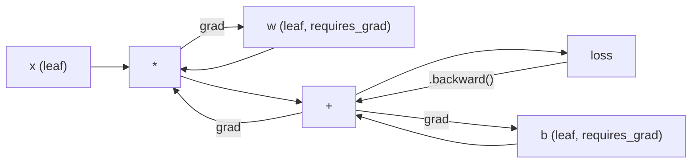
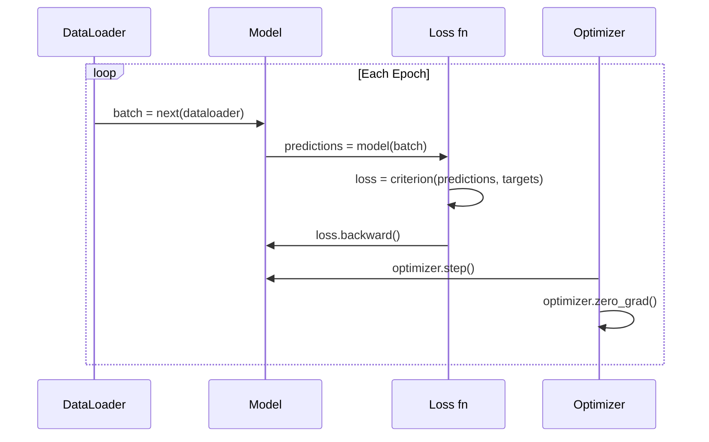

# Wprowadzenie do PyTorch

> Zbudowałeś silnik z tłoków i wałów korbowych. Teraz poznaj ten, którego wszyscy faktycznie używają.

**Type:** Build
**Languages:** Python
**Prerequisites:** Lesson 03.10 (Build Your Own Mini Framework)
**Time:** ~75 minutes

## Learning Objectives

- Buduj i trenuj sieci neuronowe używając PyTorch nn.Module, nn.Sequential i autograd
- Używaj tensorów PyTorch, akceleracji GPU i standardowej pętli treningowej (zero_grad, forward, loss, backward, step)
- Przekonwertuj swoje komponenty miniaturowego frameworka napisanego od zera na ich odpowiedniki w PyTorch
- Profiluj i porównuj szybkość trenowania między swoim frameworkiem w czystym Pythonie a PyTorch na tym samym zadaniu

## The Problem

Masz działający miniaturowy framework. Linear layers, ReLU, dropout, batch norm, Adam, DataLoader, pętla treningowa. Trenuje 4-warstwową sieć na problemie klasyfikacji okręgu w czystym Pythonie.

Jest on również 500 razy wolniejszy niż PyTorch na tym samym problemie.

Twój miniaturowy framework przetwarza jedną próbkę na raz za pomocą zagnieżdżonych pętli Pythona. PyTorch przekazuje te same operacje do zoptymalizowanych jąder C++/CUDA działających na GPU. Na pojedynczym NVIDIA A100 PyTorch trenuje ResNet-50 (25,6M parametrów) na ImageNet (1,28M obrazów) w około 6 godzin. Twój framework zajmowałby na tym samym zadaniu około 3000 godzin – gdyby wcześniej nie zabrakło mu pamięci.

Szybkość to nie jedyna różnica. Twój framework nie ma wsparcia GPU. Nie ma automatycznego różniczkowania – ręcznie napisałeś backward() dla każdego modułu. Nie ma serializacji. Nie ma trenowania rozproszonego. Nie ma mieszanej precyzji. Nie ma sposobu na debugowanie przepływu gradientów poza print.

PyTorch wypełnia każdą z tych luk. I robi to, zachowując dokładnie ten sam model mentalny, który już zbudowałeś: Module, forward(), parameters(), backward(), optimizer.step(). Koncepcje przenoszą się jeden do jednego. Składnia jest prawie identyczna. Różnica polega na tym, że PyTorch zawiera dekadę inżynierii systemowej za tym samym interfejsem, który zaprojektowałeś od zera.

## The Concept

### Why PyTorch Won

W 2015 roku TensorFlow wymagał zdefiniowania statycznego grafu obliczeniowego przed uruchomieniem czegokolwiek. Budowałeś graf, kompilowałeś go, a następnie podawałeś dane. Debugowanie oznaczało wpatrywanie się w wizualizacje grafu. Zmiana architektury oznaczała budowanie grafu od nowa.

PyTorch pojawił się w 2017 roku z inną filozofią: eager execution. Piszesz Pythona. Wykonuje się natychmiast. `y = model(x)` faktycznie oblicza y teraz, a nie "dodaje węzeł do grafu, który obliczy y później". Oznaczało to, że standardowe narzędzia debugowania Pythona działały. print() działał. pdb działało. if/else w forward działały.

Do 2020 roku rynek przemówił. Udział PyTorch w pracach badawczych ML wzrósł z 7% (2017) do ponad 75% (2022). Meta, Google DeepMind, OpenAI, Anthropic i Hugging Face wszyscy używają PyTorch jako głównego frameworka. TensorFlow 2.x przyjął eager execution w odpowiedzi – milczące przyznanie, że projekt PyTorch był słuszny.

Lekcja: developer experience procentuje. Framework, który jest o 10% wolniejszy, ale 50% szybszy w debugowaniu, wygrywa za każdym razem.

### Tensors

Tensor to wielowymiarowa tablica z trzema kluczowymi właściwościami: kształt, dtype i urządzenie.

```python
import torch

x = torch.zeros(3, 4)           # shape: (3, 4), dtype: float32, device: cpu
x = torch.randn(2, 3, 224, 224) # batch of 2 RGB images, 224x224
x = torch.tensor([1, 2, 3])     # from a Python list
```

**Shape** to wymiarowość. Skalar ma kształt (), wektor (n,), macierz (m, n), partia obrazów (batch, channels, height, width).

**Dtype** kontroluje precyzję i pamięć.

| dtype | Bity | Zakres | Zastosowanie |
|-------|------|-------|----------|
| float32 | 32 | ~7 cyfr dziesiętnych | Domyślne trenowanie |
| float16 | 16 | ~3,3 cyfry dziesiętne | Mieszana precyzja |
| bfloat16 | 16 | Taki sam zakres jak float32, mniejsza precyzja | Trenowanie LLM |
| int8 | 8 | -128 do 127 | Kwantyzowana inferencja |

**Device** określa, gdzie odbywają się obliczenia.

```python
device = torch.device("cuda" if torch.cuda.is_available() else "cpu")
x = torch.randn(3, 4, device=device)
x = x.to("cuda")
x = x.cpu()
```

Każda operacja wymaga, aby wszystkie tensory znajdowały się na tym samym urządzeniu. To błąd nr 1, na który trafiają początkujący w PyTorch: `RuntimeError: Expected all tensors to be on the same device`. Napraw to, przenosząc wszystko na to samo urządzenie przed obliczeniami.

**Reshaping** ma stały czas – zmienia metadane, nie dane.

```python
x = torch.randn(2, 3, 4)
x.view(2, 12)      # reshape to (2, 12) -- must be contiguous
x.reshape(6, 4)    # reshape to (6, 4) -- works always
x.permute(2, 0, 1) # reorder dimensions
x.unsqueeze(0)     # add dimension: (1, 2, 3, 4)
x.squeeze()        # remove size-1 dimensions
```

### Autograd

Twój miniaturowy framework wymagał zaimplementowania backward() dla każdego modułu. PyTorch nie wymaga. Rejestruje każdą operację na tensorach w skierowanym grafie acyklicznym (graf obliczeniowy), a następnie przechodzi przez ten graf w odwrotnej kolejności, aby automatycznie obliczyć gradienty.



Kluczowa różnica w porównaniu z twoim frameworkiem: PyTorch używa tape-based autodiff. Każda operacja dodaje wpis do "taśmy" podczas forward pass. Wywołanie `.backward()` odtwarza taśmę w odwrotnej kolejności.

```python
x = torch.randn(3, requires_grad=True)
y = x ** 2 + 3 * x
z = y.sum()
z.backward()
print(x.grad)  # dz/dx = 2x + 3
```

Trzy zasady autograd:

1. Tylko tensory liście z `requires_grad=True` akumulują gradienty
2. Gradienty domyślnie się akumulują – wywołaj `optimizer.zero_grad()` przed każdym backward pass
3. `torch.no_grad()` wyłącza śledzenie gradientów (używaj podczas ewaluacji)

### nn.Module

`nn.Module` jest klasą bazową dla każdego komponentu sieci neuronowej w PyTorch. Już zbudowałeś tę abstrakcję w Lekcji 10. Wersja PyTorch dodaje automatyczną rejestrację parametrów, rekurencyjne wykrywanie modułów, zarządzanie urządzeniami i serializację stanu słownika.

```python
import torch.nn as nn

class MLP(nn.Module):
    def __init__(self, input_dim, hidden_dim, output_dim):
        super().__init__()
        self.layer1 = nn.Linear(input_dim, hidden_dim)
        self.relu = nn.ReLU()
        self.layer2 = nn.Linear(hidden_dim, output_dim)

    def forward(self, x):
        x = self.layer1(x)
        x = self.relu(x)
        x = self.layer2(x)
        return x
```

Kiedy przypiszesz `nn.Module` lub `nn.Parameter` jako atrybut w `__init__`, PyTorch automatycznie go rejestruje. `model.parameters()` rekurencyjnie zbiera każdy zarejestrowany parametr. Dlatego nigdy nie musisz ręcznie zbierać wag, jak robiłeś to w miniaturowym frameworku.

Kluczowe bloki konstrukcyjne:

| Module | Co robi | Parametry |
|--------|-------------|------------|
| nn.Linear(in, out) | Wx + b | in*out + out |
| nn.Conv2d(in_ch, out_ch, k) | 2D konwolucja | in_ch*out_ch*k*k + out_ch |
| nn.BatchNorm1d(features) | Normalizacja aktywacji | 2 * features |
| nn.Dropout(p) | Losowe zerowanie | 0 |
| nn.ReLU() | max(0, x) | 0 |
| nn.GELU() | Gausowski błąd liniowy | 0 |
| nn.Embedding(vocab, dim) | Tablica odnośników | vocab * dim |
| nn.LayerNorm(dim) | Normalizacja na próbkę | 2 * dim |

### Loss Functions and Optimizers

PyTorch dostarcza gotowe do produkcji wersje wszystkiego, co zbudowałeś.

**Funkcje strat** (z `torch.nn`):

| Strata | Zadanie | Wejście |
|------|------|-------|
| nn.MSELoss() | Regresja | Dowolny kształt |
| nn.CrossEntropyLoss() | Klasyfikacja wieloklasowa | Logity (nie softmax) |
| nn.BCEWithLogitsLoss() | Klasyfikacja binarna | Logity (nie sigmoid) |
| nn.L1Loss() | Regresja (odporna) | Dowolny kształt |
| nn.CTCLoss() | Dopasowanie sekwencji | Log prawdopodobieństwa |

Uwaga: `CrossEntropyLoss` łączy `LogSoftmax` + `NLLLoss` wewnętrznie. Przekazuj surowe logity, a nie wyniki softmax. To częsty błąd, który po cichu produkuje błędne gradienty.

**Optymalizatory** (z `torch.optim`):

| Optymalizator | Kiedy używać | Typowy LR |
|-----------|-------------|-----------|
| SGD(params, lr, momentum) | CNN, dobrze dostrojone potoki | 0,01--0,1 |
| Adam(params, lr) | Domyślny punkt startowy | 1e-3 |
| AdamW(params, lr, weight_decay) | Transformery, fine-tuning | 1e-4--1e-3 |
| LBFGS(params) | Mała skala, drugiego rzędu | 1,0 |

### The Training Loop

Każda pętla treningowa PyTorch stosuje ten sam 5-etapowy wzorzec. Znasz go już z Lekcji 10.



Kanoniczny wzorzec:

```python
for epoch in range(num_epochs):
    model.train()
    for inputs, targets in train_loader:
        inputs, targets = inputs.to(device), targets.to(device)
        optimizer.zero_grad()
        outputs = model(inputs)
        loss = criterion(outputs, targets)
        loss.backward()
        optimizer.step()
```

Pięć linii wewnątrz pętli nad partiami. Pięć linii, które wytrenowały GPT-4, Stable Diffusion i LLaMA. Architektura się zmienia. Dane się zmieniają. Te pięć linii nie.

### Dataset and DataLoader

`Dataset` PyTorch to abstrakcyjna klasa z dwoma metodami: `__len__` i `__getitem__`. `DataLoader` opakowuje ją w grupowanie, mieszanie i wieloprocesowe ładowanie danych.

```python
from torch.utils.data import Dataset, DataLoader

class MNISTDataset(Dataset):
    def __init__(self, images, labels):
        self.images = images
        self.labels = labels

    def __len__(self):
        return len(self.labels)

    def __getitem__(self, idx):
        return self.images[idx], self.labels[idx]

loader = DataLoader(dataset, batch_size=64, shuffle=True, num_workers=4)
```

`num_workers=4` uruchamia 4 procesy do równoległego ładowania danych, podczas gdy GPU trenuje na bieżącej partii. W zadaniach ograniczonych przez wejście/wyjście (duże obrazy, audio) samo to może podwoić szybkość trenowania.

### GPU Training

Przenoszenie modelu na GPU:

```python
device = torch.device("cuda" if torch.cuda.is_available() else "cpu")
model = model.to(device)
```

To rekurencyjnie przenosi każdy parametr i bufor na GPU. Następnie przenoś każdą partię podczas trenowania:

```python
inputs, targets = inputs.to(device), targets.to(device)
```

**Mieszana precyzja** zmniejsza zużycie pamięci o połowę i podwaja przepustowość na nowoczesnych GPU (A100, H100, RTX 4090) poprzez wykonywanie forward/backward w float16, przy jednoczesnym utrzymaniu głównych wag w float32:

```python
from torch.amp import autocast, GradScaler

scaler = GradScaler()
for inputs, targets in loader:
    with autocast(device_type="cuda"):
        outputs = model(inputs)
        loss = criterion(outputs, targets)
    scaler.scale(loss).backward()
    scaler.step(optimizer)
    scaler.update()
    optimizer.zero_grad()
```

### Comparison: Mini Framework vs PyTorch vs JAX

| Cecha | Mini Framework (L10) | PyTorch | JAX |
|---------|---------------------|---------|-----|
| Autodyf | Ręczny backward() | Autograd oparty na taśmie | Transformacje funkcyjne |
| Wykonanie | Zachłanne (pętle Pythona) | Zachłanne (jądra C++) | Śledzone + JIT kompilowane |
| Wsparcie GPU | Nie | Tak (CUDA, ROCm, MPS) | Tak (CUDA, TPU) |
| Szybkość (MNIST MLP) | ~300s/epoka | ~0,5s/epoka | ~0,3s/epoka |
| System modułów | Niestandardowa klasa Module | nn.Module | Funkcje bezstanowe (Flax/Equinox) |
| Debugowanie | print() | print(), pdb, breakpoint() | Trudniejsze (JIT tracing psuje print) |
| Ekosystem | Brak | Hugging Face, Lightning, timm | Flax, Optax, Orbax |
| Krzywa uczenia | Sam to zbudowałeś | Umiarkowany | Stromy (paradygmat funkcyjny) |
| Zastosowania produkcyjne | Problemy zabawkowe | Meta, OpenAI, Anthropic, HF | Google DeepMind, Midjourney |

```figure
dropout-mask
```

## Build It

3-warstwowy MLP trenowany na MNIST używając tylko podstawowych elementów PyTorch. Żadnych wysokopoziomowych nakładek. Żadnych `torchvision.datasets`. Sami pobieramy i parsujemy surowe dane.

### Step 1: Load MNIST From Raw Files

MNIST jest dostarczany jako 4 skompresowane pliki: obrazy treningowe (60 000 x 28 x 28), etykiety treningowe, obrazy testowe (10 000 x 28 x 28), etykiety testowe. Pobieramy je i parsujemy format binarny.

```python
import torch
import torch.nn as nn
import struct
import gzip
import urllib.request
import os

def download_mnist(path="./mnist_data"):
    base_url = "https://storage.googleapis.com/cvdf-datasets/mnist/"
    files = [
        "train-images-idx3-ubyte.gz",
        "train-labels-idx1-ubyte.gz",
        "t10k-images-idx3-ubyte.gz",
        "t10k-labels-idx1-ubyte.gz",
    ]
    os.makedirs(path, exist_ok=True)
    for f in files:
        filepath = os.path.join(path, f)
        if not os.path.exists(filepath):
            urllib.request.urlretrieve(base_url + f, filepath)

def load_images(filepath):
    with gzip.open(filepath, "rb") as f:
        magic, num, rows, cols = struct.unpack(">IIII", f.read(16))
        data = f.read()
        images = torch.frombuffer(bytearray(data), dtype=torch.uint8)
        images = images.reshape(num, rows * cols).float() / 255.0
    return images

def load_labels(filepath):
    with gzip.open(filepath, "rb") as f:
        magic, num = struct.unpack(">II", f.read(8))
        data = f.read()
        labels = torch.frombuffer(bytearray(data), dtype=torch.uint8).long()
    return labels
```

### Step 2: Define the Model

3-warstwowy MLP: 784 -> 256 -> 128 -> 10. Aktywacje ReLU. Dropout do regularyzacji. Bez batch norm, aby zachować prostotę.

```python
class MNISTModel(nn.Module):
    def __init__(self):
        super().__init__()
        self.net = nn.Sequential(
            nn.Linear(784, 256),
            nn.ReLU(),
            nn.Dropout(0.2),
            nn.Linear(256, 128),
            nn.ReLU(),
            nn.Dropout(0.2),
            nn.Linear(128, 10),
        )

    def forward(self, x):
        return self.net(x)
```

Warstwa wyjściowa produkuje 10 surowych logitów (jeden na cyfrę). Bez softmax – `CrossEntropyLoss` obsługuje to wewnętrznie.

Liczba parametrów: 784*256 + 256 + 256*128 + 128 + 128*10 + 10 = 235 146. Mało jak na dzisiejsze standardy. GPT-2 small ma 124M. To trenuje w sekundach.

### Step 3: Training Loop

Kanoniczny wzorzec forward-loss-backward-step.

```python
def train_one_epoch(model, loader, criterion, optimizer, device):
    model.train()
    total_loss = 0
    correct = 0
    total = 0
    for images, labels in loader:
        images, labels = images.to(device), labels.to(device)
        optimizer.zero_grad()
        outputs = model(images)
        loss = criterion(outputs, labels)
        loss.backward()
        optimizer.step()
        total_loss += loss.item() * images.size(0)
        _, predicted = outputs.max(1)
        correct += predicted.eq(labels).sum().item()
        total += labels.size(0)
    return total_loss / total, correct / total


def evaluate(model, loader, criterion, device):
    model.eval()
    total_loss = 0
    correct = 0
    total = 0
    with torch.no_grad():
        for images, labels in loader:
            images, labels = images.to(device), labels.to(device)
            outputs = model(images)
            loss = criterion(outputs, labels)
            total_loss += loss.item() * images.size(0)
            _, predicted = outputs.max(1)
            correct += predicted.eq(labels).sum().item()
            total += labels.size(0)
    return total_loss / total, correct / total
```

Zwróć uwagę na `torch.no_grad()` podczas ewaluacji. Wyłącza to autograd, zmniejszając użycie pamięci i przyspieszając inferencję. Bez tego PyTorch buduje graf obliczeniowy, którego nigdy nie użyjesz.

### Step 4: Wire Everything Together

```python
def main():
    device = torch.device("cuda" if torch.cuda.is_available() else "cpu")

    download_mnist()
    train_images = load_images("./mnist_data/train-images-idx3-ubyte.gz")
    train_labels = load_labels("./mnist_data/train-labels-idx1-ubyte.gz")
    test_images = load_images("./mnist_data/t10k-images-idx3-ubyte.gz")
    test_labels = load_labels("./mnist_data/t10k-labels-idx1-ubyte.gz")

    train_dataset = torch.utils.data.TensorDataset(train_images, train_labels)
    test_dataset = torch.utils.data.TensorDataset(test_images, test_labels)
    train_loader = torch.utils.data.DataLoader(
        train_dataset, batch_size=64, shuffle=True
    )
    test_loader = torch.utils.data.DataLoader(
        test_dataset, batch_size=256, shuffle=False
    )

    model = MNISTModel().to(device)
    criterion = nn.CrossEntropyLoss()
    optimizer = torch.optim.Adam(model.parameters(), lr=1e-3)

    num_params = sum(p.numel() for p in model.parameters())
    print(f"Device: {device}")
    print(f"Parameters: {num_params:,}")
    print(f"Train samples: {len(train_dataset):,}")
    print(f"Test samples: {len(test_dataset):,}")
    print()

    for epoch in range(10):
        train_loss, train_acc = train_one_epoch(
            model, train_loader, criterion, optimizer, device
        )
        test_loss, test_acc = evaluate(
            model, test_loader, criterion, device
        )
        print(
            f"Epoch {epoch+1:2d} | "
            f"Train Loss: {train_loss:.4f} | Train Acc: {train_acc:.4f} | "
            f"Test Loss: {test_loss:.4f} | Test Acc: {test_acc:.4f}"
        )

    torch.save(model.state_dict(), "mnist_mlp.pt")
    print(f"\nModel saved to mnist_mlp.pt")
    print(f"Final test accuracy: {test_acc:.4f}")
```

Oczekiwany wynik po 10 epokach: ~97,8% dokładności testowej. Czas trenowania na CPU: ~30 sekund. Na GPU: ~5 sekund. Na twoim miniaturowym frameworku z tą samą architekturą: ~45 minut.

## Use It

### Quick Comparison: Mini Framework vs PyTorch

| Mini Framework (Lekcja 10) | PyTorch |
|---------------------------|---------|
| `model = Sequential(Linear(784, 256), ReLU(), ...)` | `model = nn.Sequential(nn.Linear(784, 256), nn.ReLU(), ...)` |
| `pred = model.forward(x)` | `pred = model(x)` |
| `optimizer.zero_grad()` | `optimizer.zero_grad()` |
| `grad = criterion.backward()` then `model.backward(grad)` | `loss.backward()` |
| `optimizer.step()` | `optimizer.step()` |
| Brak GPU | `model.to("cuda")` |
| Ręczny backward dla każdego modułu | Autograd obsługuje wszystko |

Interfejs jest prawie identyczny. Różnica tkwi w tym, co pod maską.

### Saving and Loading Models

```python
torch.save(model.state_dict(), "model.pt")

model = MNISTModel()
model.load_state_dict(torch.load("model.pt", weights_only=True))
model.eval()
```

Zawsze zapisuj `state_dict()` (słownik parametrów), a nie obiekt modelu. Zapisanie obiektu modelu używa pickle, który psuje się, gdy refaktoryzujesz kod. State dicts są przenośne.

### Learning Rate Scheduling

```python
scheduler = torch.optim.lr_scheduler.CosineAnnealingLR(
    optimizer, T_max=10
)
for epoch in range(10):
    train_one_epoch(model, train_loader, criterion, optimizer, device)
    scheduler.step()
```

PyTorch dostarcza 15+ schedulerów: StepLR, ExponentialLR, CosineAnnealingLR, OneCycleLR, ReduceLROnPlateau. Wszystkie podłączają się do tego samego interfejsu optymalizatora.

## Ship It

Ta lekcja produkuje dwa artefakty:

- `outputs/prompt-pytorch-debugger.md` -- prompt do diagnozowania typowych błędów trenowania w PyTorch
- `outputs/skill-pytorch-patterns.md` -- odniesienie do wzorców trenowania w PyTorch

## Exercises

1. **Dodaj normalizację batch.** Wstaw `nn.BatchNorm1d` po każdej warstwie liniowej (przed aktywacją). Porównaj dokładność testową i szybkość trenowania z wersją tylko z dropoutem. Batch norm powinien osiągnąć 98%+ w mniejszej liczbie epok.

2. **Zaimplementuj wyszukiwarkę tempa uczenia.** Trenuj przez jedną epokę z wykładniczo rosnącym tempem uczenia (od 1e-7 do 1,0). Wykreśl stratę względem LR. Optymalne LR jest tuż przed tym, jak strata zacznie rosnąć. Użyj tego, aby wybrać lepsze LR dla modelu MNIST.

3. **Portuj na GPU z mieszaną precyzją.** Dodaj `torch.amp.autocast` i `GradScaler` do pętli treningowej. Zmierz przepustowość (próbki/sekundę) z mieszaną precyzją i bez niej na GPU. Na A100 oczekuj ~2x przyspieszenia.

4. **Zbuduj niestandardowy Dataset.** Pobierz Fashion-MNIST (taki sam format jak MNIST, ale z elementami odzieży). Zaimplementuj klasę `FashionMNISTDataset(Dataset)` z `__getitem__` i `__len__`. Trenuj ten sam MLP i porównaj dokładność. Fashion-MNIST jest trudniejszy – oczekuj ~88% vs ~98%.

5. **Zastąp Adam SGD + momentum.** Trenuj z `SGD(params, lr=0,01, momentum=0,9)`. Porównaj krzywe zbieżności. Następnie dodaj scheduler `CosineAnnealingLR` i sprawdź, czy SGD dogoni Adama do epoki 10.

## Key Terms

| Termin | Co ludzie mówią | Co to faktycznie oznacza |
|------|----------------|----------------------|
| Tensor | "Tablica wielowymiarowa" | Typowana tablica świadoma urządzenia, z wbudowanym wsparciem automatycznego różniczkowania w każdej operacji |
| Autograd | "Automatyczna wsteczna propagacja" | System oparty na taśmie, który rejestruje operacje podczas forward pass, a następnie odtwarza je w odwrotnej kolejności, aby obliczyć dokładne gradienty |
| nn.Module | "Warstwa" | Klasa bazowa dla dowolnego różniczkowalnego bloku obliczeniowego – rejestruje parametry, obsługuje zagnieżdżanie, zarządza trybami train/eval |
| state_dict | "Wagi modelu" | OrderedDict odwzorowujący nazwy parametrów na tensory – przenośna, serializowalna reprezentacja wytrenowanego modelu |
| .backward() | "Oblicz gradienty" | Przejście grafu obliczeniowego w odwrotnej kolejności, obliczanie i akumulowanie gradientów dla każdego tensora liścia z requires_grad=True |
| .to(device) | "Przenieś na GPU" | Rekurencyjne przeniesienie wszystkich parametrów i buforów na określone urządzenie (CPU, CUDA, MPS) |
| DataLoader | "Potok danych" | Iterator, który grupuje, miesza i opcjonalnie zrównolegla ładowanie danych z Dataset |
| Mieszana precyzja | "Użyj float16" | Trenuj z float16 forward/backward dla szybkości, utrzymując float32 główne wagi dla stabilności numerycznej |
| Eager execution | "Uruchom teraz" | Operacje wykonują się natychmiast po wywołaniu, a nie są odkładane do późniejszego kroku kompilacji – kluczowa decyzja projektowa odróżniająca PyTorch od TF 1.x |
| zero_grad | "Resetuj gradienty" | Ustaw wszystkie gradienty parametrów na zero przed następnym backward pass, ponieważ PyTorch domyślnie akumuluje gradienty |

## Further Reading

- Paszke et al., "PyTorch: An Imperative Style, High-Performance Deep Learning Library" (2019) -- oryginalna praca wyjaśniająca kompromisy projektowe PyTorch
- PyTorch Tutorials: "Learning PyTorch with Examples" (https://pytorch.org/tutorials/beginner/pytorch_with_examples.html) -- oficjalna ścieżka od tensorów do nn.Module
- PyTorch Performance Tuning Guide (https://pytorch.org/tutorials/recipes/recipes/tuning_guide.html) -- mieszana precyzja, DataLoader workers, pamięć przypięta i inne optymalizacje produkcyjne
- Horace He, "Making Deep Learning Go Brrrr" (https://horace.io/brrr_intro.html) -- dlaczego trenowanie na GPU jest szybkie, ze strategiami optymalizacji specyficznymi dla PyTorch