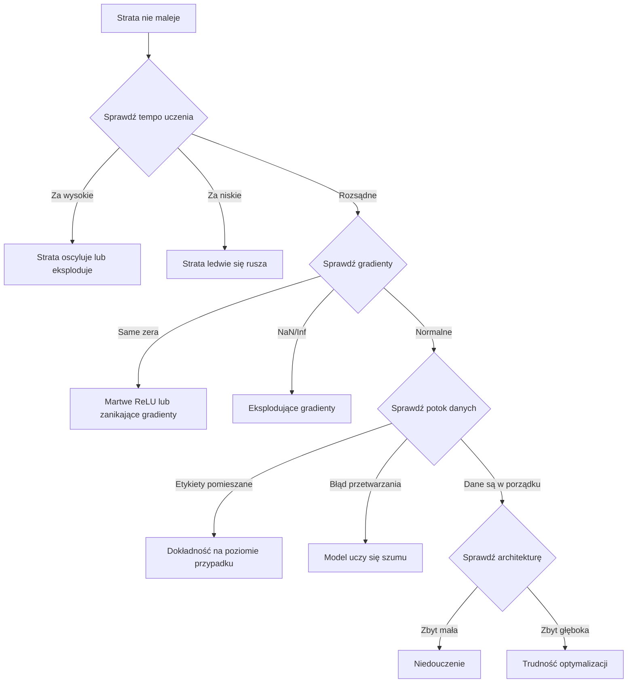
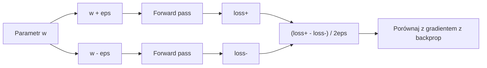
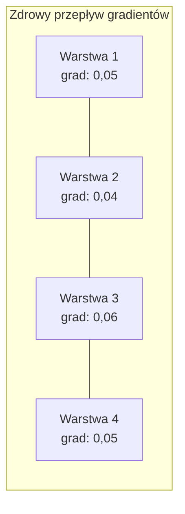
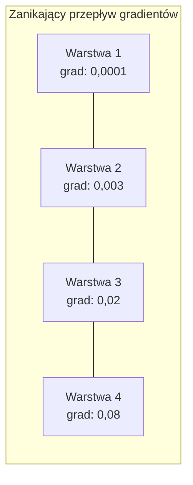
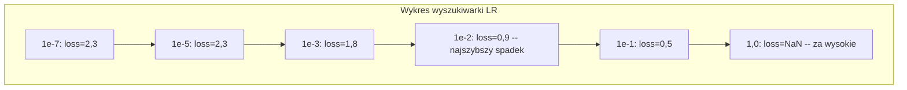

# Debugowanie sieci neuronowych

> Twoja sieć się skompilowała. Działała. Wyprodukowała liczbę. Liczba jest błędna i nic się nie wysypało. Witaj w najtrudniejszym rodzaju debugowania – takim, w którym nie ma komunikatu o błędzie.

**Type:** Build
**Languages:** Python, PyTorch
**Prerequisites:** Phase 03 Lessons 01-10 (especially backpropagation, loss functions, optimizers)
**Time:** ~90 minutes

## Learning Objectives

- Diagnozuj typowe awarie sieci neuronowych (NaN loss, płaska krzywa straty, przeuczenie, oscylacje) używając systematycznych strategii debugowania
- Zastosuj technikę "overfit one batch", aby zweryfikować poprawność architektury modelu i pętli treningowej
- Sprawdzaj wielkości gradientów, rozkłady aktywacji i normy wag, aby identyfikować problemy z zanikającymi/eksplodującymi gradientami
- Zbuduj listę kontrolną debugowania obejmującą potok danych, architekturę modelu, funkcję straty, optymalizator i tempo uczenia

## The Problem

Tradycyjne oprogramowanie wysypuje się, gdy jest zepsute. Null pointer rzuca wyjątek. Niezgodność typów zawodzi na etapie kompilacji. Błąd off-by-one produkuje wyraźnie błędne wyjście.

Sieci neuronowe nie dają ci tego luksusu.

Zepsuta sieć neuronowa działa do końca, wypisuje wartość straty i produkuje przewidywania. Strata może maleć. Przewidywania mogą wyglądać wiarygodnie. Ale model jest po cichu błędny – uczy się skrótów, zapamiętuje szum lub zbiega do bezużytecznego minimum lokalnego. Badacze Google oszacowali, że 60-70% czasu debugowania ML jest spędzane na "cichych" błędach, które nie produkują błędów, ale obniżają jakość modelu.

Różnica między działającym a zepsutym modelem to często jedna źle umieszczona linia: brakujące `zero_grad()`, transponowany wymiar, tempo uczenia różne o 10x. Kanoniczny "Recipe for Training Neural Networks" (2019) zaczyna się od tego: "Najczęstsze błędy w sieciach neuronowych to błędy, które nie powodują crasha."

Ta lekcja uczy, jak znajdować te błędy.

## The Concept

### The Debugging Mindset

Zapomnij o debugowaniu metodą "wydrukuj i módl się". Debugowanie sieci neuronowych wymaga systematycznego podejścia, ponieważ pętla sprzężenia zwrotnego jest wolna (minuty do godzin na jeden przebieg trenowania), a objawy są niejednoznaczne (zła strata może oznaczać 20 różnych rzeczy).

Złota zasada: **zacznij prosto, dodawaj złożoność po jednym elemencie i weryfikuj każdy element niezależnie.**



### Symptom 1: Loss Not Decreasing

To najczęstsza skarga. Pętla treningowa działa, epoki mijają, a strata pozostaje płaska lub dziko oscyluje.

**Złe tempo uczenia.** Za wysokie: strata oscyluje lub skacze do NaN. Za niskie: strata maleje tak wolno, że wygląda na płaską. Dla Adama zacznij od 1e-3. Dla SGD zacznij od 1e-1 lub 1e-2. Zawsze wypróbuj 3 tempa uczenia różniące się 10x (np. 1e-2, 1e-3, 1e-4), zanim stwierdzisz, że coś innego jest nie tak.

**Martwe ReLU.** Jeśli neuron ReLU otrzymuje duże ujemne wejście, wyprowadza 0, a jego gradient wynosi 0. Nigdy więcej się nie aktywuje. Jeśli wystarczająco dużo neuronów umrze, sieć nie może się uczyć. Sprawdź: wypisz ułamek aktywacji, które są dokładnie 0 po każdej warstwie ReLU. Jeśli >50% jest martwych, przełącz na LeakyReLU lub zmniejsz tempo uczenia.

**Zanikające gradienty.** W głębokich sieciach z aktywacjami sigmoid lub tanh gradienty maleją wykładniczo w miarę propagacji wstecznej. Zanim dotrą do pierwszej warstwy, są ~0. Pierwsze warstwy przestają się uczyć. Naprawa: użyj ReLU/GELU, dodaj połączenia resztkowe lub użyj normalizacji batch.

**Eksplodujące gradienty.** Odwrotny problem – gradienty rosną wykładniczo. Częste w RNN i bardzo głębokich sieciach. Strata skacze do NaN. Naprawa: przycinanie gradientów (`torch.nn.utils.clip_grad_norm_`), niższe tempo uczenia lub dodanie normalizacji.

### Symptom 2: Loss Decreasing But Model is Bad

Strata maleje. Dokładność treningowa sięga 99%. Ale dokładność testowa wynosi 55%. Albo model produkuje bezsensowne wyniki na prawdziwych danych.

**Przeuczenie.** Model zapamiętuje dane treningowe zamiast uczyć się wzorców. Różnica między stratą treningową a walidacyjną rośnie z czasem. Naprawa: więcej danych, dropout, spadek wagi, wczesne zatrzymanie, augmentacja danych.

**Wyciek danych.** Dane testowe wyciekły do treningu. Dokładność jest podejrzanie wysoka. Częste przyczyny: mieszanie przed podziałem, przetwarzanie wstępne ze statystykami z całego zbioru, duplikaty próbek między podziałami. Naprawa: najpierw podziel, potem przetwarzaj, sprawdź duplikaty.

**Błędy etykiet.** 5-10% etykiet w większości rzeczywistych zbiorów danych jest błędnych (Northcutt et al., 2021 -- "Pervasive Label Errors in Test Sets"). Model uczy się szumu. Naprawa: użyj confident learning, aby znaleźć i naprawić błędnie oznaczone przykłady, lub użyj obcinania strat, aby ignorować próbki z wysoką stratą.

### Symptom 3: NaN or Inf in Loss

Wartość straty staje się `nan` lub `inf`. Trenowanie jest martwe.

**Tempo uczenia za wysokie.** Aktualizacje gradientów przestrzeliwują tak bardzo, że wagi eksplodują. Naprawa: zmniejsz 10x.

**log(0) lub log(negative).** Entropia krzyżowa oblicza `log(p)`. Jeśli twój model wyprowadza dokładnie 0 lub ujemne prawdopodobieństwo, log eksploduje. Naprawa: ogranicz przewidywania do `[eps, 1-eps]` gdzie `eps=1e-7`.

**Dzielenie przez zero.** Normalizacja batch dzieli przez odchylenie standardowe. Partia ze stałymi wartościami ma std=0. Naprawa: dodaj epsilon do mianownika (PyTorch robi to domyślnie, ale niestandardowe implementacje mogą nie).

**Nadmiar numeryczny.** Duże aktywacje podane do `exp()` produkują Inf. Softmax jest szczególnie podatny. Naprawa: odejmij max przed potęgowaniem (sztuczka log-sum-exp).

### Technique 1: Gradient Checking

Porównaj swoje analityczne gradienty (z wstecznej propagacji) z numerycznymi gradientami (z różnic skończonych). Jeśli się nie zgadzają, twój backward pass ma błąd.

Numeryczny gradient dla parametru `w`:

```
grad_numerical = (loss(w + eps) - loss(w - eps)) / (2 * eps)
```

Metryka zgodności (różnica względna):

```
rel_diff = |grad_analytical - grad_numerical| / max(|grad_analytical|, |grad_numerical|, 1e-8)
```

Jeśli `rel_diff < 1e-5`: poprawne. Jeśli `rel_diff > 1e-3`: prawie na pewno błąd.



### Technique 2: Activation Statistics

Monitoruj średnią i odchylenie standardowe aktywacji po każdej warstwie podczas trenowania. Zdrowe sieci utrzymują aktywacje ze średnią bliską 0 i std bliskim 1 (po normalizacji) lub przynajmniej ograniczone.

| Wskaźnik zdrowia | Średnia | Std | Diagnoza |
|-----------------|------|-----|-----------|
| Zdrowa | ~0 | ~1 | Sieć uczy się normalnie |
| Nasycona | >>0 lub <<0 | ~0 | Aktywacje utknęły na ekstremalnych wartościach |
| Martwa | 0 | 0 | Neurony są martwe (same zera) |
| Eksplodująca | >>10 | >>10 | Aktywacje rosną bez granic |

### Technique 3: Gradient Flow Visualization

Wykreśl średnią wielkość gradientu dla każdej warstwy. W zdrowej sieci wielkości gradientów powinny być w przybliżeniu podobne we wszystkich warstwach. Jeśli wczesne warstwy mają gradienty 1000x mniejsze niż późniejsze, masz zanikające gradienty.





### Technique 4: The Overfit-One-Batch Test

Najważniejsza technika debugowania w głębokim uczeniu.

Weź jedną małą partię (8-32 próbki). Trenuj na niej przez 100+ iteracji. Strata powinna spaść prawie do zera, a dokładność treningowa powinna osiągnąć 100%. Jeśli nie, twój model lub pętla treningowa ma fundamentalny błąd – nie przechodź do pełnego trenowania.

Ten test wykrywa:
- Zepsute funkcje strat
- Zepsute backward pass
- Architekturę zbyt małą, aby reprezentować dane
- Optymalizator niepodłączony do parametrów modelu
- Dane i etykiety źle dopasowane

To zajmuje 30 sekund i oszczędza godziny debugowania pełnych przebiegów treningowych.

### Technique 5: Learning Rate Finder

Leslie Smith (2017) zaproponował przeszukanie tempa uczenia od bardzo małego (1e-7) do bardzo dużego (10) przez jedną epokę, rejestrując stratę. Wykreśl stratę względem tempa uczenia. Optymalne tempo uczenia jest z grubsza 10x mniejsze niż tempo, przy którym strata zaczyna najszybciej spadać.



Najlepsze LR w tym przykładzie: ~1e-3 (jeden rząd wielkości przed najszybszym punktem spadku).

### Common PyTorch Bugs

To są błędy, które marnują najwięcej łącznych godzin w społeczności PyTorch:

| Błąd | Objaw | Naprawa |
|-----|---------|-----|
| Zapomnienie `optimizer.zero_grad()` | Gradienty kumulują się między partiami, strata oscyluje | Dodaj `optimizer.zero_grad()` przed `loss.backward()` |
| Zapomnienie `model.eval()` przy testowaniu | Dropout i batch norm zachowują się inaczej, dokładność testowa zmienia się między uruchomieniami | Dodaj `model.eval()` i `torch.no_grad()` |
| Złe kształty tensorów | Ciche broadcastowanie produkuje błędne wyniki, brak błędu | Wypisz kształty po każdej operacji podczas debugowania |
| Niezgodność CPU/GPU | `RuntimeError: expected CUDA tensor` | Użyj `.to(device)` na modelu I danych |
| Nieodłączanie tensorów | Graf obliczeniowy rośnie w nieskończoność, OOM | Użyj `.detach()` lub `with torch.no_grad()` |
| Operacje in-place psujące autograd | `RuntimeError: modified by in-place operation` | Zastąp `x += 1` przez `x = x + 1` |
| Dane nieznormalizowane | Strata utknęła na poziomie przypadku | Normalizuj wejścia do średniej=0, std=1 |
| Etykiety w złym dtype | Cross-entropy oczekuje `Long`, dostał `Float` | Rzutuj etykiety: `labels.long()` |

### The Master Debugging Table

| Objaw | Prawdopodobna przyczyna | Pierwsza rzecz do spróbowania |
|---------|-------------|-------------------|
| Strata utknęła na -log(1/liczba_klas) | Model przewiduje rozkład jednostajny | Sprawdź potok danych, zweryfikuj dopasowanie etykiet do wejść |
| Strata NaN po kilku krokach | Tempo uczenia za wysokie | Zmniejsz LR 10x |
| Strata NaN natychmiast | log(0) lub dzielenie przez zero | Dodaj epsilon do operacji log/dzielenia |
| Strata dziko oscyluje | LR za wysokie lub rozmiar partii za mały | Zmniejsz LR, zwiększ rozmiar partii |
| Strata maleje, potem osiąga plateau | LR za wysokie dla fazy dostrajania | Dodaj harmonogram LR (cosinus lub schodkowy) |
| Dokładność treningowa wysoka, testowa niska | Przeuczenie | Dodaj dropout, spadek wagi, więcej danych |
| Dokładność treningowa = testowa = przypadek | Model niczego się nie uczy | Uruchom test overfit-one-batch |
| Dokładność treningowa = testowa, ale obie niskie | Niedouczenie | Większy model, więcej warstw, więcej cech |
| Gradienty wszystkie zero | Martwe ReLU lub odłączony graf obliczeniowy | Przełącz na LeakyReLU, sprawdź `.requires_grad` |
| Brak pamięci podczas trenowania | Partia zbyt duża lub graf nie zwolniony | Zmniejsz rozmiar partii, użyj `torch.no_grad()` dla ewaluacji |

```figure
learning-curves
```

## Build It

Zestaw diagnostyczny, który monitoruje aktywacje, gradienty i krzywe strat. Celowo zepsujesz sieć i użyjesz zestawu do zdiagnozowania każdego problemu.

### Step 1: The NetworkDebugger Class

Podłącza się do modelu PyTorch, aby rejestrować statystyki aktywacji i gradientów na warstwę.

```python
import torch
import torch.nn as nn
import math


class NetworkDebugger:
    def __init__(self, model):
        self.model = model
        self.activation_stats = {}
        self.gradient_stats = {}
        self.loss_history = []
        self.lr_losses = []
        self.hooks = []
        self._register_hooks()

    def _register_hooks(self):
        for name, module in self.model.named_modules():
            if isinstance(module, (nn.Linear, nn.Conv2d, nn.ReLU, nn.LeakyReLU)):
                hook = module.register_forward_hook(self._make_activation_hook(name))
                self.hooks.append(hook)
                hook = module.register_full_backward_hook(self._make_gradient_hook(name))
                self.hooks.append(hook)

    def _make_activation_hook(self, name):
        def hook(module, input, output):
            with torch.no_grad():
                out = output.detach().float()
                self.activation_stats[name] = {
                    "mean": out.mean().item(),
                    "std": out.std().item(),
                    "fraction_zero": (out == 0).float().mean().item(),
                    "min": out.min().item(),
                    "max": out.max().item(),
                }
        return hook

    def _make_gradient_hook(self, name):
        def hook(module, grad_input, grad_output):
            if grad_output[0] is not None:
                with torch.no_grad():
                    grad = grad_output[0].detach().float()
                    self.gradient_stats[name] = {
                        "mean": grad.mean().item(),
                        "std": grad.std().item(),
                        "abs_mean": grad.abs().mean().item(),
                        "max": grad.abs().max().item(),
                    }
        return hook

    def record_loss(self, loss_value):
        self.loss_history.append(loss_value)

    def check_loss_health(self):
        if len(self.loss_history) < 2:
            return "NOT_ENOUGH_DATA"
        recent = self.loss_history[-10:]
        if any(math.isnan(v) or math.isinf(v) for v in recent):
            return "NAN_OR_INF"
        if len(self.loss_history) >= 20:
            first_half = sum(self.loss_history[:10]) / 10
            second_half = sum(self.loss_history[-10:]) / 10
            if second_half >= first_half * 0.99:
                return "NOT_DECREASING"
        if len(recent) >= 5:
            diffs = [recent[i+1] - recent[i] for i in range(len(recent)-1)]
            if max(diffs) - min(diffs) > 2 * abs(sum(diffs) / len(diffs)):
                return "OSCILLATING"
        return "HEALTHY"

    def check_activations(self):
        issues = []
        for name, stats in self.activation_stats.items():
            if stats["fraction_zero"] > 0.5:
                issues.append(f"DEAD_NEURONS: {name} has {stats['fraction_zero']:.0%} zero activations")
            if abs(stats["mean"]) > 10:
                issues.append(f"EXPLODING_ACTIVATIONS: {name} mean={stats['mean']:.2f}")
            if stats["std"] < 1e-6:
                issues.append(f"COLLAPSED_ACTIVATIONS: {name} std={stats['std']:.2e}")
        return issues if issues else ["HEALTHY"]

    def check_gradients(self):
        issues = []
        grad_magnitudes = []
        for name, stats in self.gradient_stats.items():
            grad_magnitudes.append((name, stats["abs_mean"]))
            if stats["abs_mean"] < 1e-7:
                issues.append(f"VANISHING_GRADIENT: {name} abs_mean={stats['abs_mean']:.2e}")
            if stats["abs_mean"] > 100:
                issues.append(f"EXPLODING_GRADIENT: {name} abs_mean={stats['abs_mean']:.2e}")
        if len(grad_magnitudes) >= 2:
            first_mag = grad_magnitudes[0][1]
            last_mag = grad_magnitudes[-1][1]
            if last_mag > 0 and first_mag / last_mag > 100:
                issues.append(f"GRADIENT_RATIO: first/last = {first_mag/last_mag:.0f}x (vanishing)")
        return issues if issues else ["HEALTHY"]

    def print_report(self):
        print("\n=== NETWORK DEBUGGER REPORT ===")
        print(f"\nLoss health: {self.check_loss_health()}")
        if self.loss_history:
            print(f"  Last 5 losses: {[f'{v:.4f}' for v in self.loss_history[-5:]]}")
        print("\nActivation diagnostics:")
        for item in self.check_activations():
            print(f"  {item}")
        print("\nGradient diagnostics:")
        for item in self.check_gradients():
            print(f"  {item}")
        print("\nPer-layer activation stats:")
        for name, stats in self.activation_stats.items():
            print(f"  {name}: mean={stats['mean']:.4f} std={stats['std']:.4f} zero={stats['fraction_zero']:.1%}")
        print("\nPer-layer gradient stats:")
        for name, stats in self.gradient_stats.items():
            print(f"  {name}: abs_mean={stats['abs_mean']:.2e} max={stats['max']:.2e}")

    def remove_hooks(self):
        for hook in self.hooks:
            hook.remove()
        self.hooks.clear()
```

### Step 2: The Overfit-One-Batch Test

```python
def overfit_one_batch(model, x_batch, y_batch, criterion, lr=0.01, steps=200):
    optimizer = torch.optim.Adam(model.parameters(), lr=lr)
    model.train()
    print("\n=== OVERFIT ONE BATCH TEST ===")
    print(f"Batch size: {x_batch.shape[0]}, Steps: {steps}")

    for step in range(steps):
        optimizer.zero_grad()
        output = model(x_batch)
        loss = criterion(output, y_batch)
        loss.backward()
        optimizer.step()

        if step % 50 == 0 or step == steps - 1:
            with torch.no_grad():
                preds = (output > 0).float() if output.shape[-1] == 1 else output.argmax(dim=1)
                targets = y_batch if y_batch.dim() == 1 else y_batch.squeeze()
                acc = (preds.squeeze() == targets).float().mean().item()
            print(f"  Step {step:3d} | Loss: {loss.item():.6f} | Accuracy: {acc:.1%}")

    final_loss = loss.item()
    if final_loss > 0.1:
        print(f"\n  FAIL: Loss did not converge ({final_loss:.4f}). Model or training loop is broken.")
        return False
    print(f"\n  PASS: Loss converged to {final_loss:.6f}")
    return True
```

### Step 3: Learning Rate Finder

```python
def find_learning_rate(model, x_data, y_data, criterion, start_lr=1e-7, end_lr=10, steps=100):
    import copy
    original_state = copy.deepcopy(model.state_dict())
    optimizer = torch.optim.SGD(model.parameters(), lr=start_lr)
    lr_mult = (end_lr / start_lr) ** (1 / steps)

    model.train()
    results = []
    best_loss = float("inf")
    current_lr = start_lr

    print("\n=== LEARNING RATE FINDER ===")

    for step in range(steps):
        optimizer.zero_grad()
        output = model(x_data)
        loss = criterion(output, y_data)

        if math.isnan(loss.item()) or loss.item() > best_loss * 10:
            break

        best_loss = min(best_loss, loss.item())
        results.append((current_lr, loss.item()))

        loss.backward()
        optimizer.step()

        current_lr *= lr_mult
        for param_group in optimizer.param_groups:
            param_group["lr"] = current_lr

    model.load_state_dict(original_state)

    if len(results) < 10:
        print("  Could not complete LR sweep -- loss diverged too quickly")
        return results

    min_loss_idx = min(range(len(results)), key=lambda i: results[i][1])
    suggested_lr = results[max(0, min_loss_idx - 10)][0]

    print(f"  Swept {len(results)} steps from {start_lr:.0e} to {results[-1][0]:.0e}")
    print(f"  Minimum loss {results[min_loss_idx][1]:.4f} at lr={results[min_loss_idx][0]:.2e}")
    print(f"  Suggested learning rate: {suggested_lr:.2e}")

    return results
```

### Step 4: Gradient Checker

```python
def _flat_to_multi_index(flat_idx, shape):
    multi_idx = []
    remaining = flat_idx
    for dim in reversed(shape):
        multi_idx.insert(0, remaining % dim)
        remaining //= dim
    return tuple(multi_idx)


def gradient_check(model, x, y, criterion, eps=1e-4):
    model.train()
    x_double = x.double()
    y_double = y.double()
    model_double = model.double()

    print("\n=== GRADIENT CHECK ===")
    overall_max_diff = 0
    checked = 0

    for name, param in model_double.named_parameters():
        if not param.requires_grad:
            continue

        layer_max_diff = 0

        model_double.zero_grad()
        output = model_double(x_double)
        loss = criterion(output, y_double)
        loss.backward()
        analytical_grad = param.grad.clone()

        num_checks = min(5, param.numel())
        for i in range(num_checks):
            idx = _flat_to_multi_index(i, param.shape)
            original = param.data[idx].item()

            param.data[idx] = original + eps
            with torch.no_grad():
                loss_plus = criterion(model_double(x_double), y_double).item()

            param.data[idx] = original - eps
            with torch.no_grad():
                loss_minus = criterion(model_double(x_double), y_double).item()

            param.data[idx] = original

            numerical = (loss_plus - loss_minus) / (2 * eps)
            analytical = analytical_grad[idx].item()

            denom = max(abs(numerical), abs(analytical), 1e-8)
            rel_diff = abs(numerical - analytical) / denom

            layer_max_diff = max(layer_max_diff, rel_diff)
            checked += 1

        overall_max_diff = max(overall_max_diff, layer_max_diff)
        status = "OK" if layer_max_diff < 1e-5 else "MISMATCH"
        print(f"  {name}: max_rel_diff={layer_max_diff:.2e} [{status}]")

    model.float()

    print(f"\n  Checked {checked} parameters")
    if overall_max_diff < 1e-5:
        print("  PASS: Gradients match (rel_diff < 1e-5)")
    elif overall_max_diff < 1e-3:
        print("  WARN: Small differences (1e-5 < rel_diff < 1e-3)")
    else:
        print("  FAIL: Gradient mismatch detected (rel_diff > 1e-3)")
    return overall_max_diff
```

### Step 5: Deliberately Broken Networks

Teraz zastosuj zestaw narzędzi do zepsutych sieci i zdiagnozuj każdą z nich.

```python
def demo_broken_networks():
    torch.manual_seed(42)
    x = torch.randn(64, 10)
    y = (x[:, 0] > 0).long()

    print("\n" + "=" * 60)
    print("BUG 1: Learning rate too high (lr=10)")
    print("=" * 60)
    model1 = nn.Sequential(nn.Linear(10, 32), nn.ReLU(), nn.Linear(32, 2))
    debugger1 = NetworkDebugger(model1)
    optimizer1 = torch.optim.SGD(model1.parameters(), lr=10.0)
    criterion = nn.CrossEntropyLoss()
    for step in range(20):
        optimizer1.zero_grad()
        out = model1(x)
        loss = criterion(out, y)
        debugger1.record_loss(loss.item())
        loss.backward()
        optimizer1.step()
    debugger1.print_report()
    debugger1.remove_hooks()

    print("\n" + "=" * 60)
    print("BUG 2: Dead ReLUs from bad initialization")
    print("=" * 60)
    model2 = nn.Sequential(nn.Linear(10, 32), nn.ReLU(), nn.Linear(32, 32), nn.ReLU(), nn.Linear(32, 2))
    with torch.no_grad():
        for m in model2.modules():
            if isinstance(m, nn.Linear):
                m.weight.fill_(-1.0)
                m.bias.fill_(-5.0)
    debugger2 = NetworkDebugger(model2)
    optimizer2 = torch.optim.Adam(model2.parameters(), lr=1e-3)
    for step in range(50):
        optimizer2.zero_grad()
        out = model2(x)
        loss = criterion(out, y)
        debugger2.record_loss(loss.item())
        loss.backward()
        optimizer2.step()
    debugger2.print_report()
    debugger2.remove_hooks()

    print("\n" + "=" * 60)
    print("BUG 3: Missing zero_grad (gradients accumulate)")
    print("=" * 60)
    model3 = nn.Sequential(nn.Linear(10, 32), nn.ReLU(), nn.Linear(32, 2))
    debugger3 = NetworkDebugger(model3)
    optimizer3 = torch.optim.SGD(model3.parameters(), lr=0.01)
    for step in range(50):
        out = model3(x)
        loss = criterion(out, y)
        debugger3.record_loss(loss.item())
        loss.backward()
        optimizer3.step()
    debugger3.print_report()
    debugger3.remove_hooks()

    print("\n" + "=" * 60)
    print("HEALTHY NETWORK: Correct setup for comparison")
    print("=" * 60)
    model_good = nn.Sequential(nn.Linear(10, 32), nn.ReLU(), nn.Linear(32, 2))
    debugger_good = NetworkDebugger(model_good)
    optimizer_good = torch.optim.Adam(model_good.parameters(), lr=1e-3)
    for step in range(50):
        optimizer_good.zero_grad()
        out = model_good(x)
        loss = criterion(out, y)
        debugger_good.record_loss(loss.item())
        loss.backward()
        optimizer_good.step()
    debugger_good.print_report()
    debugger_good.remove_hooks()

    print("\n" + "=" * 60)
    print("OVERFIT-ONE-BATCH TEST (healthy model)")
    print("=" * 60)
    model_test = nn.Sequential(nn.Linear(10, 32), nn.ReLU(), nn.Linear(32, 2))
    overfit_one_batch(model_test, x[:8], y[:8], criterion)

    print("\n" + "=" * 60)
    print("LEARNING RATE FINDER")
    print("=" * 60)
    model_lr = nn.Sequential(nn.Linear(10, 32), nn.ReLU(), nn.Linear(32, 2))
    find_learning_rate(model_lr, x, y, criterion)

    print("\n" + "=" * 60)
    print("GRADIENT CHECK")
    print("=" * 60)
    model_grad = nn.Sequential(nn.Linear(10, 8), nn.ReLU(), nn.Linear(8, 2))
    gradient_check(model_grad, x[:4], y[:4], criterion)
```

## Use It

### PyTorch Built-in Tools

```python
import torch
import torch.nn as nn

model = nn.Sequential(
    nn.Linear(768, 256),
    nn.ReLU(),
    nn.Linear(256, 10),
)

with torch.autograd.detect_anomaly():
    output = model(input_tensor)
    loss = criterion(output, target)
    loss.backward()

for name, param in model.named_parameters():
    if param.grad is not None:
        print(f"{name}: grad_mean={param.grad.abs().mean():.2e}")
```

### Weights & Biases Integration

```python
import wandb

wandb.init(project="debug-training")

for epoch in range(100):
    loss = train_one_epoch()
    wandb.log({
        "loss": loss,
        "lr": optimizer.param_groups[0]["lr"],
        "grad_norm": torch.nn.utils.clip_grad_norm_(model.parameters(), float("inf")),
    })

    for name, param in model.named_parameters():
        if param.grad is not None:
            wandb.log({f"grad/{name}": wandb.Histogram(param.grad.cpu().numpy())})
```

### TensorBoard

```python
from torch.utils.tensorboard import SummaryWriter

writer = SummaryWriter("runs/debug_experiment")

for epoch in range(100):
    loss = train_one_epoch()
    writer.add_scalar("Loss/train", loss, epoch)

    for name, param in model.named_parameters():
        writer.add_histogram(f"weights/{name}", param, epoch)
        if param.grad is not None:
            writer.add_histogram(f"gradients/{name}", param.grad, epoch)
```

### The Debug Checklist (Before Full Training)

1. Uruchom test overfit-one-batch. Jeśli się nie powiedzie, zatrzymaj się.
2. Wypisz podsumowanie modelu -- sprawdź, czy liczba parametrów jest rozsądna.
3. Wykonaj pojedynczy forward pass z losowymi danymi -- sprawdź kształt wyjścia.
4. Trenuj przez 5 epok -- sprawdź, czy strata maleje.
5. Sprawdź statystyki aktywacji -- żadnych martwych warstw, żadnych eksplozji.
6. Sprawdź przepływ gradientów -- żadnego zanikania, żadnego eksplodowania.
7. Zweryfikuj potok danych -- wypisz 5 losowych próbek z etykietami.

## Ship It

Ta lekcja produkuje:
- `outputs/prompt-nn-debugger.md` -- prompt do diagnozowania awarii trenowania sieci neuronowych
- `outputs/skill-debug-checklist.md` -- lista kontrolna w formie drzewa decyzyjnego do debugowania problemów z trenowaniem

Kluczowe wzorce wdrożeniowe do debugowania:
- Dodaj huki monitorujące do produkcyjnych skryptów treningowych
- Loguj statystyki aktywacji i gradientów do W&B lub TensorBoard co N kroków
- Zaimplementuj automatyczne alerty dla NaN loss, martwych neuronów (>80% zero) lub eksplozji gradientów
- Zawsze uruchamiaj test overfit-one-batch przy zmianie architektur lub potoków danych

## Exercises

1. **Dodaj detektor eksplodujących gradientów.** Zmodyfikuj `NetworkDebugger`, aby wykrywał, gdy gradienty przekraczają próg i automatycznie sugerował wartość przycinania gradientów. Przetestuj go na 20-warstwowej sieci bez normalizacji.

2. **Zbuduj wskrzeszacz martwych neuronów.** Napisz funkcję, która identyfikuje martwe neurony ReLU (zawsze wyprowadzające 0) i reinicjalizuje ich wagi wejściowe inicjalizacją Kaiminga. Pokaż, że odzyskuje to sieć, w której >70% neuronów jest martwych.

3. **Zaimplementuj wyszukiwarkę tempa uczenia z wykresem.** Rozszerz `find_learning_rate`, aby zapisywać wyniki jako CSV i napisz osobny skrypt, który czyta CSV i wyświetla krzywą LR vs strata używając matplotlib. Zidentyfikuj optymalne LR dla ResNet-18 na CIFAR-10.

4. **Stwórz walidator potoku danych.** Napisz funkcję, która sprawdza: duplikaty próbek między podziałami trening/test, brak równowagi w rozkładzie etykiet (>10:1), normalizację wejść (średnia blisko 0, std blisko 1) oraz wartości NaN/Inf w danych. Uruchom ją na celowo uszkodzonym zbiorze danych.

5. **Zdebuguj prawdziwą awarię.** Weź miniaturowy framework z Lekcji 10, wprowadź subtelny błąd (np. transponuj macierz wag w backward) i użyj gradient checking, aby zlokalizować, który konkretnie parametr ma nieprawidłowe gradienty. Udokumentuj proces debugowania.

## Key Terms

| Termin | Co ludzie mówią | Co to faktycznie oznacza |
|------|----------------|----------------------|
| Cichy błąd | "Działa, ale daje złe wyniki" | Błąd, który nie produkuje komunikatu o błędzie, ale obniża jakość modelu -- dominujący tryb awarii w ML |
| Martwy ReLU | "Neurony umarły" | Neuron ReLU, którego wejście jest zawsze ujemne, więc wyprowadza 0 i otrzymuje 0 gradientu na stałe |
| Zanikające gradienty | "Wczesne warstwy przestają się uczyć" | Gradienty maleją wykładniczo przez warstwy, powodując efektywne zamrożenie wag we wczesnych warstwach |
| Eksplodujące gradienty | "Strata poszła w NaN" | Gradienty rosną wykładniczo przez warstwy, powodując aktualizacje wag tak duże, że przepełniają się |
| Gradient checking | "Zweryfikuj, czy backprop jest poprawny" | Porównywanie analitycznych gradientów z backprop do numerycznych gradientów z różnic skończonych |
| Overfit-one-batch | "Najważniejszy test debugowania" | Trenowanie na jednej małej partii w celu sprawdzenia, czy model MOŻE się uczyć -- jeśli nie, coś jest fundamentalnie zepsute |
| Wyszukiwarka LR | "Przeszukaj, aby znaleźć odpowiednie tempo uczenia" | Wykładnicze zwiększanie tempa uczenia przez jedną epokę i wybranie tempa tuż przed tym, jak strata zacznie się rozchodzić |
| Wyciek danych | "Dane testowe wyciekły do treningu" | Gdy informacje ze zbioru testowego zanieczyszczają trening, produkując sztucznie wysoką dokładność |
| Statystyki aktywacji | "Monitoruj zdrowie warstw" | Śledzenie średniej, std i ułamka zer każdej warstwy wyjściowej w celu wykrycia martwych, nasyconych lub eksplodujących neuronów |
| Przycinanie gradientów | "Ogranicz wielkość gradientu" | Skalowanie gradientów w dół, gdy ich norma przekracza próg, zapobiegając eksplodującym aktualizacjom wag |

## Further Reading

- Smith, "Cyclical Learning Rates for Training Neural Networks" (2017) -- praca wprowadzająca test zakresu tempa uczenia (LR finder)
- Northcutt et al., "Pervasive Label Errors in Test Sets Destabilize Machine Learning Benchmarks" (2021) -- pokazuje, że 3-6% etykiet w ImageNet, CIFAR-10 i innych głównych benchmarkach jest błędnych
- Zhang et al., "Understanding Deep Learning Requires Rethinking Generalization" (2017) -- praca pokazująca, że sieci neuronowe mogą zapamiętywać losowe etykiety, dlaczego test overfit-one-batch działa
- PyTorch documentation on `torch.autograd.detect_anomaly` and `torch.autograd.set_detect_anomaly` for built-in NaN/Inf detection