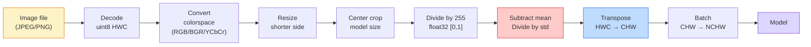
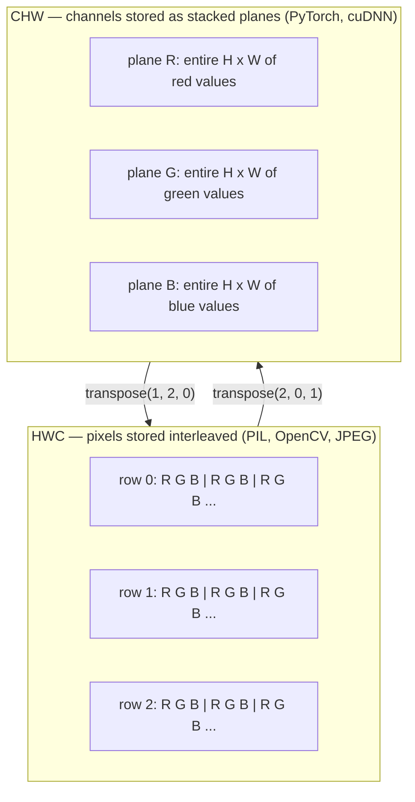

# Podstawy obrazu — piksele, kanały, przestrzenie barw

> Obraz jest tensorem próbek światła. Każdy model widzenia, którego kiedykolwiek użyjesz, zaczyna się od tego jednego faktu.

**Type:** Build
**Languages:** Python
**Prerequisites:** Phase 1 Lesson 12 (Tensor Operations), Phase 3 Lesson 11 (Intro to PyTorch)
**Time:** ~45 minutes

## Learning Objectives

- Wyjaśnić, w jaki sposób ciągła scena jest dyskretyzowana na piksele i dlaczego decyzje dotyczące próbkowania/kwantyzacji wyznaczają górną granicę dla każdego modelu
- Czytać, wycinać i analizować obrazy jako tablice NumPy oraz płynnie przełączać się między układami HWC i CHW
- Konwertować między RGB, skalą szarości, HSV i YCbCr oraz uzasadnić, dlaczego każda przestrzeń barw istnieje
- Stosować przetwarzanie wstępne na poziomie pikseli (normalizacja, standaryzacja, skalowanie, kanał-pierwszy) dokładnie tak, jak oczekuje tego torchvision

## The Problem

Każda praca, którą przeczytasz, każda wstępnie wytrenowana waga, którą pobierzesz, każde API widzenia, którego użyjesz, zakłada konkretne kodowanie wejścia. Przekaż obraz `uint8` tam, gdzie model oczekuje `float32` — uruchomi się i po cichu wyprodukuje śmieci. Podaj BGR sieci trenowanej na RGB — dokładność spada o dziesięć punktów. Przekaż modelowi dane w układzie kanały-ostatnie, gdy oczekuje kanały-pierwsze, a pierwsza warstwa konwolucyjna potraktuje wysokość jako kanał cech. Żadne z tych nie rzuca błędem. To po prostu rujnuje metryki, a ty spędzasz tydzień na polowaniu na błąd, który tkwi w sposobie wczytania pliku.

Konwolucja nie jest skomplikowana, gdy wiesz, po czym się przesuwa. Trudność polega na tym, że "obraz" znaczy co innego dla aparatu, dekodera JPEG, PIL, OpenCV, torchvision i jądra CUDA. Każdy stos ma własną kolejność osi, zakres bajtów i konwencję kanałów. Inżynier widzenia, który nie umie tego rozróżniać, wdraża zepsute potoki.

Ta lekcja kładzie fundament, aby reszta fazy mogła na nim budować. Po jej ukończeniu będziesz wiedzieć, czym jest piksel, dlaczego są trzy liczby na piksel zamiast jednej, co faktycznie robi "normalizacja statystykami ImageNet" i jak poruszać się między dwoma lub trzema układami, które zakłada każda inna lekcja w tej fazie.

## The Concept

### Pełny potok przetwarzania wstępnego na pierwszy rzut oka

Każdy produkcyjny system widzenia to ta sama sekwencja przekształceń. Popełnij błąd w jednym kroku, a model widzi inne wejście niż to, na którym został wytrenowany.



Dwa czerwone i niebieskie pola to miejsce, w którym żyje 80% cichych błędów: brak standaryzacji i zły układ.

### Piksel to próbka, nie kwadrat

Sensor aparatu zlicza fotony, które trafiają na siatkę maleńkich detektorów. Każdy detektor integruje światło przez ułamek sekundy i emituje napięcie proporcjonalne do liczby trafiających fotonów. Sensor następnie dyskretyzuje to napięcie na liczbę całkowitą. Jeden detektor staje się jednym pikselem.

```
Continuous scene                 Sensor grid                     Digital image
(infinite detail)                (H x W detectors)               (H x W integers)

    ~~~~~                        +--+--+--+--+--+                 210 198 180 155 120
   ~   ~   ~                     |  |  |  |  |  |                 205 195 178 152 118
  ~ light ~      ---->           +--+--+--+--+--+     ---->       200 190 175 150 115
   ~~~~~                         |  |  |  |  |  |                 195 185 170 148 112
                                 +--+--+--+--+--+                 188 180 165 145 108
```

Dwa wybory mają miejsce na tym etapie i wyznaczają górną granicę wszystkiego, co dalej:

- **Próbkowanie przestrzenne** decyduje, ile detektorów przypada na stopień sceny. Zbyt mało — krawędzie stają się postrzępione (aliasing). Zbyt wiele — eksplodują pamięć i obliczenia.
- **Kwantyzacja intensywności** decyduje, jak dokładnie dzielone jest napięcie na przedziały. 8 bitów daje 256 poziomów i jest standardem dla wyświetlania. 10, 12, 16 bitów daje gładsze gradienty i ma znaczenie w obrazowaniu medycznym, HDR i surowych potokach sensorów.

Piksel to nie kolorowy kwadrat z polem. To pojedynczy pomiar. Gdy zmieniasz rozmiar lub obracasz, ponownie próbkujesz tę siatkę pomiarów.

### Dlaczego trzy kanały

Jeden detektor zlicza fotony w całym widmie widzialnym — to skala szarości. Aby uzyskać kolor, sensor pokrywa siatkę mozaiką czerwonych, zielonych i niebieskich filtrów. Po demosaicyzacji każda lokalizacja przestrzenna ma trzy liczby całkowite: odpowiedź detektora z filtrem czerwonym, zielonym i niebieskim w pobliżu. Te trzy liczby całkowite to trójka RGB piksela.

```
One pixel in memory:

    (R, G, B) = (210, 140, 30)   <- czerwono-pomarańczowy

An H x W RGB image:

    shape (H, W, 3)     stored as   H rows of W pixels of 3 values
                                    each in [0, 255] for uint8
```

Trzy nie jest magiczne. Kamery głębi dodają kanał Z. Satelity dodają pasma podczerwieni i ultrafioletu. Skanery medyczne często mają jeden kanał (RTG, CT) lub wiele (hiperspektralne). Liczba kanałów to ostatnia oś; warstwy splotowe uczą się miksować w poprzek niej.

### Dwie konwencje układu: HWC i CHW

Ten sam tensor, dwa porządki. Każda biblioteka wybiera jeden.

```
HWC (height, width, channels)           CHW (channels, height, width)

   W ->                                    H ->
  +-----+-----+-----+                     +-----+-----+
H |R G B|R G B|R G B|                   C |R R R R R R|
| +-----+-----+-----+                   | +-----+-----+
v |R G B|R G B|R G B|                   v |G G G G G G|
  +-----+-----+-----+                     +-----+-----+
                                          |B B B B B B|
                                          +-----+-----+

   PIL, OpenCV, matplotlib,              PyTorch, most deep learning
   almost every image file on disk       frameworks, cuDNN kernels
```

CHW istnieje, ponieważ jądra splotowe przesuwają się po H i W. Utrzymanie osi kanałów jako pierwszej oznacza, że każde jądro widzi ciągłą płaszczyznę 2D na kanał, co dobrze się wektoryzuje. Formaty dyskowe zachowują HWC, ponieważ odpowiada to sposobowi, w jaki linie skanowania wychodzą z sensora.

Jednowierszowa konwersja, którą wpiszesz tysiąc razy:

```
img_chw = img_hwc.transpose(2, 0, 1)      # NumPy
img_chw = img_hwc.permute(2, 0, 1)        # PyTorch tensor
```

Układ pamięci, wizualizacja:



### Zakresy bajtów i dtype

Dominują trzy konwencje:

| Convention | dtype | Range | Where you see it |
|------------|-------|-------|------------------|
| Raw | `uint8` | [0, 255] | Files on disk, PIL, OpenCV output |
| Normalized | `float32` | [0.0, 1.0] | After `img.astype('float32') / 255` |
| Standardized | `float32` | roughly [-2, +2] | After subtracting mean and dividing by std |

Sieci splotowe były trenowane na standaryzowanych wejściach. Statystyki ImageNet `mean=[0.485, 0.456, 0.406]`, `std=[0.229, 0.224, 0.225]` to średnia arytmetyczna i odchylenie standardowe trzech kanałów w całym zbiorze treningowym ImageNet, obliczone na pikselach znormalizowanych do [0, 1]. Podawanie surowego `uint8` do modelu oczekującego standaryzowanego float to najczęstsza cicha awaria w stosowanym widzeniu.

### Przestrzenie barw i dlaczego istnieją

RGB to format przechwytywania, ale nie zawsze jest najbardziej użyteczną reprezentacją dla modelu.

```
 RGB               HSV                       YCbCr / YUV

 R red             H hue (angle 0-360)       Y luminance (brightness)
 G green           S saturation (0-1)        Cb chroma blue-yellow
 B blue            V value/brightness (0-1)  Cr chroma red-green

 Linear to         Separates color from      Separates brightness from
 sensor output     brightness. Useful for    color. JPEG and most video
                   color thresholding, UI    codecs compress the chroma
                   sliders, simple filters   channels harder because the
                                             human eye is less sensitive
                                             to chroma detail than to Y.
```

W przypadku większości nowoczesnych CNN podajesz RGB. Inne przestrzenie poznajesz, gdy:

- **HSV** — klasyczny kod CV, segmentacja oparta na kolorze, balans bieli.
- **YCbCr** — czytanie wewnętrznych struktur JPEG, potoki wideo, modele superrozdzielczości działające tylko na Y.
- **Grayscale** — OCR, modele dokumentów, każdy przypadek, gdzie kolor jest zmienną zakłócającą, a nie sygnałem.

Skala szarości z RGB to ważona suma, a nie średnia, ponieważ ludzkie oko jest bardziej czułe na zieleń niż na czerwień lub błękit:

```
Y = 0.299 R + 0.587 G + 0.114 B       (ITU-R BT.601, the classic weights)
```

### Proporcje obrazu, skalowanie i interpolacja

Każdy model ma stały rozmiar wejściowy (224x224 dla większości klasyfikatorów ImageNet, 384x384 lub 512x512 dla nowoczesnych detektorów). Twoje obrazy rzadko pasują. Trzy wybory skalowania, które mają znaczenie:

- **Resize shorter side, then center crop** — standardowa recepta ImageNet. Zachowuje proporcje, odrzuca pasek pikseli krawędziowych.
- **Resize and pad** — zachowuje proporcje i każdy piksel, dodaje czarne pasy. Standard dla detekcji i OCR.
- **Resize directly to target** — rozciąga obraz. Tanio, zniekształca geometrię, w porządku dla wielu zadań klasyfikacji.

Metoda interpolacji decyduje, w jaki sposób obliczane są piksele pośrednie, gdy nowa siatka nie pokrywa się ze starą:

```
Nearest neighbour     fastest, blocky, only choice for masks/labels
Bilinear              fast, smooth, default for most image resizing
Bicubic               slower, sharper on upscaling
Lanczos               slowest, best quality, used for final display
```

Zasada kciuka: bilinearna do trenowania, bikubiczna lub Lanczos do zasobów, które będziesz oglądać, nearest do wszystkiego zawierającego całkowite identyfikatory klas.

```figure
conv-output-size
```

## Build It

### Step 1: Load an image and inspect its shape

Użyj Pillow, aby wczytać dowolny JPEG lub PNG, przekonwertować na NumPy i wydrukować, co otrzymałeś. Dla deterministycznego przykładu działającego offline, zsyntetyzuj jeden.

```python
import numpy as np
from PIL import Image

def synthetic_rgb(h=128, w=192, seed=0):
    rng = np.random.default_rng(seed)
    yy, xx = np.meshgrid(np.linspace(0, 1, h), np.linspace(0, 1, w), indexing="ij")
    r = (np.sin(xx * 6) * 0.5 + 0.5) * 255
    g = yy * 255
    b = (1 - yy) * xx * 255
    rgb = np.stack([r, g, b], axis=-1) + rng.normal(0, 6, (h, w, 3))
    return np.clip(rgb, 0, 255).astype(np.uint8)

arr = synthetic_rgb()
# Or load from disk:
# arr = np.asarray(Image.open("your_image.jpg").convert("RGB"))

print(f"type:   {type(arr).__name__}")
print(f"dtype:  {arr.dtype}")
print(f"shape:  {arr.shape}     # (H, W, C)")
print(f"min:    {arr.min()}")
print(f"max:    {arr.max()}")
print(f"pixel at (0, 0): {arr[0, 0]}")
```

Oczekiwane wyjście: `shape: (H, W, 3)`, `dtype: uint8`, zakres `[0, 255]`. To jest kanoniczna reprezentacja na dysku, niezależnie od tego, czy bajty pochodzą z aparatu, dekodera JPEG czy generatora syntetycznego.

### Step 2: Split channels and re-order layout

Wyodrębnij R, G, B osobno, a następnie przekonwertuj z HWC na CHW dla PyTorch.

```python
R = arr[:, :, 0]
G = arr[:, :, 1]
B = arr[:, :, 2]
print(f"R shape: {R.shape}, mean: {R.mean():.1f}")
print(f"G shape: {G.shape}, mean: {G.mean():.1f}")
print(f"B shape: {B.shape}, mean: {B.mean():.1f}")

arr_chw = arr.transpose(2, 0, 1)
print(f"\nHWC shape: {arr.shape}")
print(f"CHW shape: {arr_chw.shape}")
```

Trzy płaszczyzny skali szarości, jedna na kanał. CHW po prostu zmienia kolejność osi; ścisłe kopiowanie danych nie jest wymagane, gdy układ pamięci na to pozwala.

### Step 3: Grayscale and HSV conversions

Skala szarości przez ważoną sumę, a następnie ręczna konwersja RGB-to-HSV.

```python
def rgb_to_grayscale(rgb):
    weights = np.array([0.299, 0.587, 0.114], dtype=np.float32)
    return (rgb.astype(np.float32) @ weights).astype(np.uint8)

def rgb_to_hsv(rgb):
    rgb_f = rgb.astype(np.float32) / 255.0
    r, g, b = rgb_f[..., 0], rgb_f[..., 1], rgb_f[..., 2]
    cmax = np.max(rgb_f, axis=-1)
    cmin = np.min(rgb_f, axis=-1)
    delta = cmax - cmin

    h = np.zeros_like(cmax)
    mask = delta > 0
    rmax = mask & (cmax == r)
    gmax = mask & (cmax == g)
    bmax = mask & (cmax == b)
    h[rmax] = ((g[rmax] - b[rmax]) / delta[rmax]) % 6
    h[gmax] = ((b[gmax] - r[gmax]) / delta[gmax]) + 2
    h[bmax] = ((r[bmax] - g[bmax]) / delta[bmax]) + 4
    h = h * 60.0

    s = np.where(cmax > 0, delta / cmax, 0)
    v = cmax
    return np.stack([h, s, v], axis=-1)

gray = rgb_to_grayscale(arr)
hsv = rgb_to_hsv(arr)
print(f"gray shape: {gray.shape}, range: [{gray.min()}, {gray.max()}]")
print(f"hsv   shape: {hsv.shape}")
print(f"hue range: [{hsv[..., 0].min():.1f}, {hsv[..., 0].max():.1f}] degrees")
print(f"sat range: [{hsv[..., 1].min():.2f}, {hsv[..., 1].max():.2f}]")
print(f"val range: [{hsv[..., 2].min():.2f}, {hsv[..., 2].max():.2f}]")
```

Odcień (hue) wychodzi w stopniach, nasycenie (saturation) i wartość (value) w [0, 1]. To odpowiada konwencji `hsv_full` z OpenCV.

### Step 4: Normalize, standardize, and reverse it

Przejdź od surowych bajtów do dokładnego tensora, jakiego oczekuje wstępnie wytrenowany model ImageNet, a następnie z powrotem.

```python
mean = np.array([0.485, 0.456, 0.406], dtype=np.float32)
std = np.array([0.229, 0.224, 0.225], dtype=np.float32)

def preprocess_imagenet(rgb_uint8):
    x = rgb_uint8.astype(np.float32) / 255.0
    x = (x - mean) / std
    x = x.transpose(2, 0, 1)
    return x

def deprocess_imagenet(chw_float32):
    x = chw_float32.transpose(1, 2, 0)
    x = x * std + mean
    x = np.clip(x * 255.0, 0, 255).astype(np.uint8)
    return x

x = preprocess_imagenet(arr)
print(f"preprocessed shape: {x.shape}     # (C, H, W)")
print(f"preprocessed dtype: {x.dtype}")
print(f"preprocessed mean per channel:  {x.mean(axis=(1, 2)).round(3)}")
print(f"preprocessed std  per channel:  {x.std(axis=(1, 2)).round(3)}")

roundtrip = deprocess_imagenet(x)
max_diff = np.abs(roundtrip.astype(int) - arr.astype(int)).max()
print(f"roundtrip max pixel diff: {max_diff}    # should be 0 or 1")
```

Średnia na kanał powinna być bliska zera, odchylenie standardowe bliskie jedności. Para preprocess/deprocess to dokładnie to, co robi pod maską każde wywołanie `transforms.Normalize` z torchvision.

### Step 5: Resize with three interpolation methods

Porównaj nearest, bilinear i bicubic przy powiększeniu, aby różnica była widoczna.

```python
target = (arr.shape[0] * 3, arr.shape[1] * 3)

nearest = np.asarray(Image.fromarray(arr).resize(target[::-1], Image.NEAREST))
bilinear = np.asarray(Image.fromarray(arr).resize(target[::-1], Image.BILINEAR))
bicubic = np.asarray(Image.fromarray(arr).resize(target[::-1], Image.BICUBIC))

def local_roughness(x):
    gy = np.diff(x.astype(float), axis=0)
    gx = np.diff(x.astype(float), axis=1)
    return float(np.abs(gy).mean() + np.abs(gx).mean())

for name, out in [("nearest", nearest), ("bilinear", bilinear), ("bicubic", bicubic)]:
    print(f"{name:>8}  shape={out.shape}  roughness={local_roughness(out):6.2f}")
```

Nearest osiąga najwyższą chropowatość, ponieważ zachowuje ostre krawędzie. Bilinear jest najgładszy. Bicubic znajduje się pomiędzy, zachowując postrzeganą ostrość bez artefaktów schodkowych.

## Use It

`torchvision.transforms` łączy wszystko powyżej w jeden komponowalny potok. Poniższy kod odtwarza dokładnie to, co robi `preprocess_imagenet`, plus skalowanie i przycinanie.

```python
import torch
from torchvision import transforms
from PIL import Image

img = Image.fromarray(synthetic_rgb(256, 256))

pipeline = transforms.Compose([
    transforms.Resize(256),
    transforms.CenterCrop(224),
    transforms.ToTensor(),
    transforms.Normalize(mean=[0.485, 0.456, 0.406], std=[0.229, 0.224, 0.225]),
])

x = pipeline(img)
print(f"tensor type:  {type(x).__name__}")
print(f"tensor dtype: {x.dtype}")
print(f"tensor shape: {tuple(x.shape)}      # (C, H, W)")
print(f"per-channel mean: {x.mean(dim=(1, 2)).tolist()}")
print(f"per-channel std:  {x.std(dim=(1, 2)).tolist()}")

batch = x.unsqueeze(0)
print(f"\nbatched shape: {tuple(batch.shape)}   # (N, C, H, W) — ready for a model")
```

Cztery kroki, w tej dokładnej kolejności: `Resize(256)` skaluje krótszy bok do 256; `CenterCrop(224)` wycina fragment 224x224 ze środka; `ToTensor()` dzieli przez 255 i zamienia HWC na CHW; `Normalize` odejmuje średnią ImageNet i dzieli przez std. Odwrócenie tej kolejności po cichu zmienia to, co dociera do modelu.

## Ship It

Ta lekcja produkuje:

- `outputs/prompt-vision-preprocessing-audit.md` — prompt, który zamienia każdą kartę modelu lub kartę zbioru danych w listę kontrolną dokładnych niezmienników przetwarzania wstępnego, które zespół musi honorować.
- `outputs/skill-image-tensor-inspector.md` — umiejętność, która dla dowolnego tensora lub tablicy w kształcie obrazu raportuje dtype, układ, zakres i to, czy wygląda na surowy, znormalizowany czy standaryzowany.

## Exercises

1. **(Easy)** Wczytaj JPEG za pomocą OpenCV (`cv2.imread`) i Pillow. Wydrukuj oba kształty oraz piksel w `(0, 0)`. Wyjaśnij różnicę w kolejności kanałów, a następnie napisz jednowierszową konwersję, która sprawi, że tablica OpenCV będzie identyczna z tablicą Pillow.
2. **(Medium)** Napisz `standardize(img, mean, std)` i jego odwrotność, które razem przejdą test `roundtrip_max_diff <= 1` na dowolnym obrazie uint8. Twoje funkcje muszą działać na pojedynczym obrazie w HWC i na batchu w NCHW przy tym samym wywołaniu.
3. **(Hard)** Weź 3-kanałowy tensor standaryzowany ImageNet i przepuść go przez konwolucję 1x1, która uczy się ważonej mieszanki RGB w jeden kanał skali szarości. Zainicjuj wagi na `[0.299, 0.587, 0.114]`, zamroź je i zweryfikuj, że wynik pasuje do ręcznej `rgb_to_grayscale` w granicach błędu zmiennoprzecinkowego. Jakie inne klasyczne przekształcenia przestrzeni barw można zapisać jako konwolucje 1x1?

## Key Terms

| Term | What people say | What it actually means |
|------|----------------|----------------------|
| Pixel | "A coloured square" | One sample of light intensity at one grid location — three numbers for colour, one for grayscale |
| Channel | "The colour" | One of the parallel spatial grids stacked into an image tensor; last axis in HWC, first in CHW |
| HWC / CHW | "The shape" | Axis orderings for an image tensor; disk and PIL use HWC, PyTorch and cuDNN use CHW |
| Normalize | "Scale the image" | Divide by 255 so pixels live in [0, 1] — necessary but not sufficient |
| Standardize | "Zero-center" | Subtract mean and divide by std per channel so the input distribution matches what the model was trained on |
| Grayscale conversion | "Average the channels" | A weighted sum with coefficients 0.299/0.587/0.114 that matches human luminance perception |
| Interpolation | "How resize picks pixels" | The rule that decides output values when the new grid does not align with the old one — nearest for labels, bilinear for training, bicubic for display |
| Aspect ratio | "Width over height" | The ratio that distinguishes "resize and pad" from "resize and stretch" |

## Further Reading

- [Charles Poynton — A Guided Tour of Color Space](https://poynton.ca/PDFs/Guided_tour.pdf) — najczystsze techniczne opracowanie o tym, dlaczego istnieje tak wiele przestrzeni barw i kiedy każda ma znaczenie
- [PyTorch Vision Transforms Docs](https://pytorch.org/vision/stable/transforms.html) — pełny potok transformacji, które faktycznie będziesz składać w produkcji
- [How JPEG Works (Colt McAnlis)](https://www.youtube.com/watch?v=F1kYBnY6mwg) — ostra wizualna wycieczka po próbkowaniu chrominancji, DCT i dlaczego JPEG koduje YCbCr zamiast RGB
- [ImageNet Preprocessing Conventions (torchvision models)](https://pytorch.org/vision/stable/models.html) — źródło prawdy dla `mean=[0.485, 0.456, 0.406]` i dlaczego każdy model w zoo tego oczekuje